This chapter is about linear regression, a very simple approach for supervised learning. In particular, linear regression is a useful tool for predicting a quantitative response. It has been around for a long time and is the topic of innumerable textbooks. Though it may seem somewhat dull compared to some of the more modern statistical learning approaches described in later chapters of this book, linear regression is still a useful and widely used statistical learning method. Moreover, it serves as a good jumping-off point for newer approaches: as we will see in later chapters, many fancy statistical learning approaches can be seen as generalizations or extensions of linear regression. Consequently, the importance of having a good understanding of linear regression before studying more complex learning methods cannot be overstated. In this chapter, we review some of the key ideas underlying the linear regression model, as well as the least squares approach that is most commonly used to fit this model.

Recall the Advertising data from Chapter 2. Figure 2.1 displays sales (in thousands of units) for a particular product as a function of advertising budgets (in thousands of dollars) for TV, radio, and newspaper media. Suppose that in our role as statistical consultants we are asked to suggest, on the basis of this data, a marketing plan for next year that will result in high product sales. What information would be useful in order to provide such a recommendation? Here are a few important questions that we might seek to address:

# 1. Is there a relationship between advertising budget and sales?

Our first goal should be to determine whether the data provide evidence of an association between advertising expenditure and sales. If the evidence is weak, then one might argue that no money should be spent on advertising!

2. How strong is the relationship between advertising budget and sales? Assuming that there is a relationship between advertising and sales, we would like to know the strength of this relationship. Does knowledge of the advertising budget provide a lot of information about product sales?  
3. Which media are associated with sales?

Are all three media—TV, radio, and newspaper—associated with sales, or are just one or two of the media associated? To answer this question, we must find a way to separate out the individual contribution of each medium to sales when we have spent money on all three media.

4. How large is the association between each medium and sales?

For every dollar spent on advertising in a particular medium, by what amount will sales increase? How accurately can we predict this amount of increase?

5. How accurately can we predict future sales?

For any given level of television, radio, or newspaper advertising, what is our prediction for sales, and what is the accuracy of this prediction?

6. Is the relationship linear?

If there is approximately a straight-line relationship between advertising expenditure in the various media and sales, then linear regression is an appropriate tool. If not, then it may still be possible to transform the predictor or the response so that linear regression can be used.

7. Is there synergy among the advertising media?

Perhaps spending \$50,000 on television advertising and \$50,000 on radio advertising is associated with higher sales than allocating \$100,000 to either television or radio individually. In marketing, this is known as a synergy effect, while in statistics it is called an interaction effect.

It turns out that linear regression can be used to answer each of these questions. We will first discuss all of these questions in a general context, and then return to them in this specific context in Section 3.4.

synergy
interaction

# 3.1 Simple Linear Regression

Simple linear regression lives up to its name: it is a very straightforward approach for predicting a quantitative response Y on the basis of a single predictor variable X. It assumes that there is approximately a linear relationship between X and Y. Mathematically, we can write this linear relationship as

$$
Y \approx \beta_ {0} + \beta_ {1} X. \tag {3.1}
$$

You might read “≈” as “is approximately modeled as”. We will sometimes describe (3.1) by saying that we are regressing Y on X (or Y onto X).

simple linear regression

For example, X may represent TV advertising and Y may represent sales. Then we can regress sales onto TV by fitting the model

$$
\text {sales} \approx \beta_ {0} + \beta_ {1} \times \text {TV}.
$$

In Equation 3.1, $\beta_{0}$ and $\beta_{1}$ are two unknown constants that represent the intercept and slope terms in the linear model. Together, $\beta_{0}$ and $\beta_{1}$ are known as the model coefficients or parameters. Once we have used our training data to produce estimates $\hat{\beta}_{0}$ and $\hat{\beta}_{1}$ for the model coefficients, we can predict future sales on the basis of a particular value of TV advertising by computing

$$
\hat {y} = \hat {\beta} _ {0} + \hat {\beta} _ {1} x, \tag {3.2}
$$

where $\hat{y}$ indicates a prediction of Y on the basis of X = x. Here we use a hat symbol, $\hat{}$ , to denote the estimated value for an unknown parameter or coefficient, or to denote the predicted value of the response.

# 3.1.1 Estimating the Coefficients

In practice, $\beta_{0}$ and $\beta_{1}$ are unknown. So before we can use (3.1) to make predictions, we must use data to estimate the coefficients. Let

$$
(x _ {1}, y _ {1}), (x _ {2}, y _ {2}), \dots , (x _ {n}, y _ {n})
$$

represent n observation pairs, each of which consists of a measurement of X and a measurement of Y. In the Advertising example, this data set consists of the TV advertising budget and product sales in n = 200 different markets. (Recall that the data are displayed in Figure 2.1.) Our goal is to obtain coefficient estimates $\hat{\beta}_{0}$ and $\hat{\beta}_{1}$ such that the linear model (3.1) fits the available data well—that is, so that $y_{i} \approx \hat{\beta}_{0} + \hat{\beta}_{1}x_{i}$ for $i = 1, \ldots, n$ . In other words, we want to find an intercept $\hat{\beta}_{0}$ and a slope $\hat{\beta}_{1}$ such that the resulting line is as close as possible to the n = 200 data points. There are a number of ways of measuring closeness. However, by far the most common approach involves minimizing the least squares criterion, and we take that approach in this chapter. Alternative approaches will be considered in Chapter 6.

Let $\hat{y}_{i}=\hat{\beta}_{0}+\hat{\beta}_{1}x_{i}$ be the prediction for Y based on the ith value of X. Then $e_{i}=y_{i}-\hat{y}_{i}$ represents the ith residual—this is the difference between the ith observed response value and the ith response value that is predicted by our linear model. We define the residual sum of squares (RSS) as

$$
\mathrm{RSS} = e _ {1} ^ {2} + e _ {2} ^ {2} + \dots + e _ {n} ^ {2},
$$

or equivalently as

$$
\mathrm{RSS} = (y _ {1} - \hat {\beta} _ {0} - \hat {\beta} _ {1} x _ {1}) ^ {2} + (y _ {2} - \hat {\beta} _ {0} - \hat {\beta} _ {1} x _ {2}) ^ {2} + \dots + (y _ {n} - \hat {\beta} _ {0} - \hat {\beta} _ {1} x _ {n}) ^ {2}. \tag {3.3}
$$

The least squares approach chooses $\hat{\beta}_{0}$ and $\hat{\beta}_{1}$ to minimize the RSS. Using some calculus, one can show that the minimizers are

$$
\hat {\beta} _ {1} = \frac {\sum_ {i = 1} ^ {n} (x _ {i} - \bar {x}) (y _ {i} - \bar {y})}{\sum_ {i = 1} ^ {n} (x _ {i} - \bar {x}) ^ {2}}, \tag {3.4}
$$

$$
\hat {\beta} _ {0} = \bar {y} - \hat {\beta} _ {1} \bar {x},
$$

intercept
slope
coefficient
parameter

least squares

residual

residual sum of squares


<details>
<summary>scatter</summary>

| TV | Sales |
| --- | --- |
| ~5 | ~2 |
| ~5 | ~3 |
| ~5 | ~5 |
| ~5 | ~6 |
| ~5 | ~7 |
| ~10 | ~5 |
| ~10 | ~6 |
| ~10 | ~7 |
| ~10 | ~8 |
| ~10 | ~9 |
| ~15 | ~6 |
| ~15 | ~7 |
| ~15 | ~8 |
| ~15 | ~9 |
| ~20 | ~7 |
| ~20 | ~8 |
| ~20 | ~9 |
| ~25 | ~8 |
| ~25 | ~9 |
| ~25 | ~10 |
| ~30 | ~8 |
| ~30 | ~9 |
| ~30 | ~10 |
| ~35 | ~9 |
| ~35 | ~10 |
| ~40 | ~10 |
| ~40 | ~11 |
| ~45 | ~10 |
| ~45 | ~11 |
| ~50 | ~11 |
| ~50 | ~12 |
| ~55 | ~10 |
| ~55 | ~11 |
| ~60 | ~11 |
| ~60 | ~12 |
| ~65 | ~12 |
| ~65 | ~13 |
| ~70 | ~13 |
| ~70 | ~14 |
| ~75 | ~14 |
| ~75 | ~15 |
| ~80 | ~14 |
| ~80 | ~15 |
| ~85 | ~15 |
| ~85 | ~16 |
| ~90 | ~16 |
| ~90 | ~17 |
| ~95 | ~17 |
| ~95 | ~18 |
| ~100 | ~18 |
| ~100 | ~19 |
| ~105 | ~19 |
| ~105 | ~20 |
| ~110 | ~20 |
| ~110 | ~21 |
| ~115 | ~21 |
| ~115 | ~22 |
| ~120 | ~22 |
| ~120 | ~23 |
| ~125 | ~23 |
| ~125 | ~24 |
| ~130 | ~24 |
| ~130 | ~25 |
| ~135 | ~25 |
| ~135 | ~26 |
| ~140 | ~26 |
| ~140 | ~27 |
| ~145 | ~27 |
| ~145 | ~28 |
| ~150 | ~28 |
| ~150 | ~29 |
| ~155 | ~29 |
| ~155 | ~30 |
| ~160 | ~30 |
| ~160 | ~31 |
| ~165 | ~31 |
| ~165 | ~32 |
| ~170 | ~32 |
| ~170 | ~33 |
| ~175 | ~33 |
| ~175 | ~34 |
| ~180 | ~34 |
| ~180 | ~35 |
| ~185 | ~35 |
| ~185 | ~36 |
| ~190 | ~36 |
| ~190 | ~37 |
| ~195 | ~37 |
| ~195 | ~38 |
| ~200 | ~38 |
| ~200 | ~39 |
| ~205 | ~39 |
| ~205 | ~40 |
| ~210 | ~40 |
| ~210 | ~41 |
| ~215 | ~41 |
| ~215 | ~42 |
| ~220 | ~42 |
| ~220 | ~43 |
| ~225 | ~43 |
| ~225 | ~44 |
| ~230 | ~44 |
| ~230 | ~45 |
| ~235 | ~45 |
| ~235 | ~46 |
| ~240 | ~46 |
| ~240 | ~47 |
| ~245 | ~47 |
| ~245 | ~48 |
| ~250 | ~48 |
| ~250 | ~49 |
| ~255 | ~49 |
| ~255 | ~50 |
| ~260 | ~50 |
| ~260 | ~51 |
| ~265 | ~51 |
| ~265 | ~52 |
| ~270 | ~52 |
| ~270 | ~53 |
| ~275 | ~53 |
| ~275 | ~54 |
| ~280 | ~54 |
| ~280 | ~55 |
| ~285 | ~55 |
| ~285 | ~56 |
| ~290 | ~56 |
| ~290 | ~57 |
| ~295 | ~57 |
| ~295 | ~58 |
| ~300 | ~58 |
</details>

FIGURE 3.1. For the Advertising data, the least squares fit for the regression of sales onto TV is shown. The fit is found by minimizing the residual sum of squares. Each grey line segment represents a residual. In this case a linear fit captures the essence of the relationship, although it overestimates the trend in the left of the plot.

where $\bar{y} \equiv \frac{1}{n} \sum_{i=1}^{n} y_{i}$ and $\bar{x} \equiv \frac{1}{n} \sum_{i=1}^{n} x_{i}$ are the sample means. In other words, (3.4) defines the least squares coefficient estimates for simple linear regression.

Figure 3.1 displays the simple linear regression fit to the Advertising data, where $\hat{\beta}_0 = 7.03$ and $\hat{\beta}_1 = 0.0475$ . In other words, according to this approximation, an additional \$1,000 spent on TV advertising is associated with selling approximately 47.5 additional units of the product. In Figure 3.2, we have computed RSS for a number of values of $\beta_0$ and $\beta_1$ , using the advertising data with sales as the response and TV as the predictor. In each plot, the red dot represents the pair of least squares estimates $(\hat{\beta}_0, \hat{\beta}_1)$ given by (3.4). These values clearly minimize the RSS.

# 3.1.2 Assessing the Accuracy of the Coefficient Estimates

Recall from (2.1) that we assume that the true relationship between $X$ and $Y$ takes the form $Y = f(X) + \epsilon$ for some unknown function $f$ , where $\epsilon$ is a mean-zero random error term. If $f$ is to be approximated by a linear function, then we can write this relationship as

$$
Y = \beta_ {0} + \beta_ {1} X + \epsilon . \tag {3.5}
$$

Here $\beta_{0}$ is the intercept term—that is, the expected value of Y when X = 0, and $\beta_{1}$ is the slope—the average increase in Y associated with a one-unit increase in X. The error term is a catch-all for what we miss with this simple model: the true relationship is probably not linear, there may be other variables that cause variation in Y, and there may be measurement error. We typically assume that the error term is independent of X.

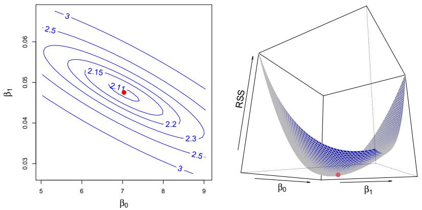  
FIGURE 3.2. Contour and three-dimensional plots of the RSS on the Advertising data, using sales as the response and TV as the predictor. The red dots correspond to the least squares estimates $\hat{\beta}_{0}$ and $\hat{\beta}_{1}$ , given by (3.4).

The model given by (3.5) defines the population regression line, which is the best linear approximation to the true relationship between X and $Y.^{1}$ The least squares regression coefficient estimates (3.4) characterize the least squares line (3.2). The left-hand panel of Figure 3.3 displays these two lines in a simple simulated example. We created 100 random Xs, and generated 100 corresponding Ys from the model

$$
Y = 2 + 3 X + \epsilon , \tag {3.6}
$$

where $\epsilon$ was generated from a normal distribution with mean zero. The red line in the left-hand panel of Figure 3.3 displays the true relationship, $f(X) = 2 + 3X$ , while the blue line is the least squares estimate based on the observed data. The true relationship is generally not known for real data, but the least squares line can always be computed using the coefficient estimates given in (3.4). In other words, in real applications, we have access to a set of observations from which we can compute the least squares line; however, the population regression line is unobserved. In the right-hand panel of Figure 3.3 we have generated ten different data sets from the model given by (3.6) and plotted the corresponding ten least squares lines. Notice that different data sets generated from the same true model result in slightly different least squares lines, but the unobserved population regression line does not change.

At first glance, the difference between the population regression line and the least squares line may seem subtle and confusing. We only have one data set, and so what does it mean that two different lines describe the relationship between the predictor and the response? Fundamentally, the concept of these two lines is a natural extension of the standard statistical approach of using information from a sample to estimate characteristics of a large population. For example, suppose that we are interested in knowing

population
regression
line

least squares
line

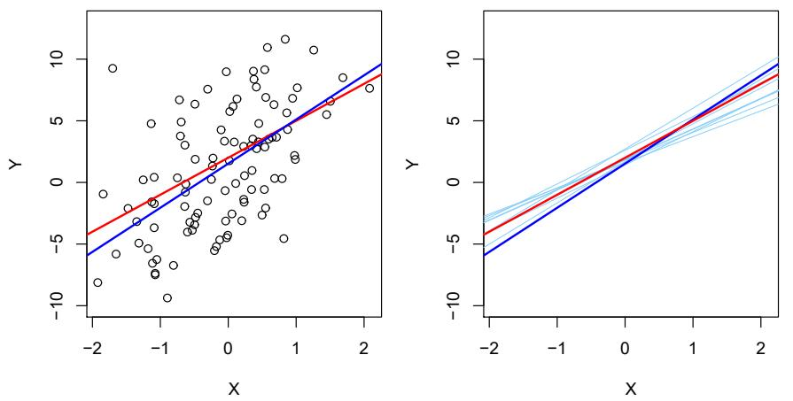  
FIGURE 3.3. A simulated data set. Left: The red line represents the true relationship, $f(X) = 2 + 3X$ , which is known as the population regression line. The blue line is the least squares line; it is the least squares estimate for $f(X)$ based on the observed data, shown in black. Right: The population regression line is again shown in red, and the least squares line in dark blue. In light blue, ten least squares lines are shown, each computed on the basis of a separate random set of observations. Each least squares line is different, but on average, the least squares lines are quite close to the population regression line.

the population mean $\mu$ of some random variable Y. Unfortunately, $\mu$ is unknown, but we do have access to n observations from $Y, y_{1}, \ldots, y_{n}$ , which we can use to estimate $\mu$ . A reasonable estimate is $\hat{\mu} = \bar{y}$ , where $\bar{y} = \frac{1}{n} \sum_{i=1}^{n} y_{i}$ is the sample mean. The sample mean and the population mean are different, but in general the sample mean will provide a good estimate of the population mean. In the same way, the unknown coefficients $\beta_{0}$ and $\beta_{1}$ in linear regression define the population regression line. We seek to estimate these unknown coefficients using $\hat{\beta}_{0}$ and $\hat{\beta}_{1}$ given in (3.4). These coefficient estimates define the least squares line.

The analogy between linear regression and estimation of the mean of a random variable is an apt one based on the concept of bias. If we use the sample mean $\hat{\mu}$ to estimate $\mu$ , this estimate is unbiased, in the sense that on average, we expect $\hat{\mu}$ to equal $\mu$ . What exactly does this mean? It means that on the basis of one particular set of observations $y_1, \ldots, y_n$ , $\hat{\mu}$ might overestimate $\mu$ , and on the basis of another set of observations, $\hat{\mu}$ might underestimate $\mu$ . But if we could average a huge number of estimates of $\mu$ obtained from a huge number of sets of observations, then this average would exactly equal $\mu$ . Hence, an unbiased estimator does not systematically over- or under-estimate the true parameter. The property of unbiasedness holds for the least squares coefficient estimates given by (3.4) as well: if we estimate $\beta_0$ and $\beta_1$ on the basis of a particular data set, then our estimates won't be exactly equal to $\beta_0$ and $\beta_1$ . But if we could average the estimates obtained over a huge number of data sets, then the average of these estimates would be spot on! In fact, we can see from the right-hand panel of Figure 3.3 that the average of many least squares lines, each

estimated from a separate data set, is pretty close to the true population regression line.

We continue the analogy with the estimation of the population mean $\mu$ of a random variable $Y$ . A natural question is as follows: how accurate is the sample mean $\hat{\mu}$ as an estimate of $\mu$ ? We have established that the average of $\hat{\mu}$ 's over many data sets will be very close to $\mu$ , but that a single estimate $\hat{\mu}$ may be a substantial underestimate or overestimate of $\mu$ . How far off will that single estimate of $\hat{\mu}$ be? In general, we answer this question by computing the standard error of $\hat{\mu}$ , written as $\mathrm{SE}(\hat{\mu})$ . We have the well-known formula

$$
\mathrm{Var} (\hat {\mu}) = \mathrm{SE} (\hat {\mu}) ^ {2} = \frac {\sigma^ {2}}{n}, \tag {3.7}
$$

standard
error

where $\sigma$ is the standard deviation of each of the realizations $y_{i}$ of $Y.^{2}$ Roughly speaking, the standard error tells us the average amount that this estimate $\hat{\mu}$ differs from the actual value of $\mu$ . Equation 3.7 also tells us how this deviation shrinks with n—the more observations we have, the smaller the standard error of $\hat{\mu}$ . In a similar vein, we can wonder how close $\hat{\beta}_{0}$ and $\hat{\beta}_{1}$ are to the true values $\beta_{0}$ and $\beta_{1}$ . To compute the standard errors associated with $\hat{\beta}_{0}$ and $\hat{\beta}_{1}$ , we use the following formulas:

$$
\mathrm{SE} (\hat {\beta} _ {0}) ^ {2} = \sigma^ {2} \left[ \frac {1}{n} + \frac {\bar {x} ^ {2}}{\sum_ {i = 1} ^ {n} (x _ {i} - \bar {x}) ^ {2}} \right], \quad \mathrm{SE} (\hat {\beta} _ {1}) ^ {2} = \frac {\sigma^ {2}}{\sum_ {i = 1} ^ {n} (x _ {i} - \bar {x}) ^ {2}}, \tag {3.8}
$$

where $\sigma^{2} = \mathrm{Var}(\epsilon)$ . For these formulas to be strictly valid, we need to assume that the errors $\epsilon_{i}$ for each observation have common variance $\sigma^{2}$ and are uncorrelated. This is clearly not true in Figure 3.1, but the formula still turns out to be a good approximation. Notice in the formula that $\mathrm{SE}(\hat{\beta}_{1})$ is smaller when the $x_{i}$ are more spread out; intuitively we have more leverage to estimate a slope when this is the case. We also see that $\mathrm{SE}(\hat{\beta}_{0})$ would be the same as $\mathrm{SE}(\hat{\mu})$ if $\bar{x}$ were zero (in which case $\hat{\beta}_{0}$ would be equal to $\bar{y}$ ). In general, $\sigma^{2}$ is not known, but can be estimated from the data. This estimate of $\sigma$ is known as the residual standard error, and is given by the formula $\mathrm{RSE} = \sqrt{\mathrm{RSS}/(n-2)}$ . Strictly speaking, when $\sigma^{2}$ is estimated from the data we should write $\widehat{\mathrm{SE}}(\hat{\beta}_{1})$ to indicate that an estimate has been made, but for simplicity of notation we will drop this extra “hat”.

Standard errors can be used to compute confidence intervals. A 95% confidence interval is defined as a range of values such that with 95% probability, the range will contain the true unknown value of the parameter. The range is defined in terms of lower and upper limits computed from the sample of data. A 95% confidence interval has the following property: if we take repeated samples and construct the confidence interval for each sample, 95% of the intervals will contain the true unknown value of the parameter. For linear regression, the 95% confidence interval for $\beta_{1}$ approximately takes the form

$$
\hat {\beta} _ {1} \pm 2 \cdot \mathrm{SE} (\hat {\beta} _ {1}). \tag {3.9}
$$

residual
standard
error

confidence
interval

That is, there is approximately a 95% chance that the interval

$$
\left[ \hat {\beta} _ {1} - 2 \cdot \mathrm{SE} (\hat {\beta} _ {1}), \hat {\beta} _ {1} + 2 \cdot \mathrm{SE} (\hat {\beta} _ {1}) \right] \tag {3.10}
$$

will contain the true value of $\beta_{1}$ . $^{3}$ Similarly, a confidence interval for $\beta_{0}$ approximately takes the form

$$
\hat {\beta} _ {0} \pm 2 \cdot \mathrm{SE} (\hat {\beta} _ {0}). \tag {3.11}
$$

In the case of the advertising data, the $95\%$ confidence interval for $\beta_0$ is [6.130, 7.935] and the $95\%$ confidence interval for $\beta_1$ is [0.042, 0.053]. Therefore, we can conclude that in the absence of any advertising, sales will, on average, fall somewhere between 6,130 and 7,935 units. Furthermore, for each \$1,000 increase in television advertising, there will be an average increase in sales of between 42 and 53 units.

Standard errors can also be used to perform hypothesis tests on the coefficients. The most common hypothesis test involves testing the null hypothesis of

$$
H _ {0}: \text {There is no relationship between} X \text {and} Y \tag {3.12}
$$

versus the alternative hypothesis

$$
H _ {a}: \text {There is some relationship between} X \text {and} Y. \tag {3.13}
$$

Mathematically, this corresponds to testing

$$
H _ {0}: \beta_ {1} = 0
$$

versus

$$
H _ {a}: \beta_ {1} \neq 0,
$$

since if $\beta_{1}=0$ then the model (3.5) reduces to $Y=\beta_{0}+\epsilon$ , and X is not associated with Y. To test the null hypothesis, we need to determine whether $\hat{\beta}_{1}$ , our estimate for $\beta_{1}$ , is sufficiently far from zero that we can be confident that $\beta_{1}$ is non-zero. How far is far enough? This of course depends on the accuracy of $\hat{\beta}_{1}$ —that is, it depends on $\mathrm{SE}(\hat{\beta}_{1})$ . If $\mathrm{SE}(\hat{\beta}_{1})$ is small, then even relatively small values of $\hat{\beta}_{1}$ may provide strong evidence that $\beta_{1}\neq0$ , and hence that there is a relationship between X and Y. In contrast, if $\mathrm{SE}(\hat{\beta}_{1})$ is large, then $\hat{\beta}_{1}$ must be large in absolute value in order for us to reject the null hypothesis. In practice, we compute a t-statistic, given by

$$
t = \frac {\hat {\beta} _ {1} - 0}{\mathrm{SE} (\hat {\beta} _ {1})}, \tag {3.14}
$$

hypothesis test

null
hypothesis

alternative
hypothesis

t-statistic

<table><tr><td></td><td>Coefficient</td><td>Std. error</td><td>t-statistic</td><td>p-value</td></tr><tr><td>Intercept</td><td>7.0325</td><td>0.4578</td><td>15.36</td><td>&lt; 0.0001</td></tr><tr><td>TV</td><td>0.0475</td><td>0.0027</td><td>17.67</td><td>&lt; 0.0001</td></tr></table>

TABLE 3.1. For the Advertising data, coefficients of the least squares model for the regression of number of units sold on TV advertising budget. An increase of \$1,000 in the TV advertising budget is associated with an increase in sales by around 50 units. (Recall that the sales variable is in thousands of units, and the TV variable is in thousands of dollars.)

which measures the number of standard deviations that $\hat{\beta}_{1}$ is away from 0. If there really is no relationship between X and Y, then we expect that (3.14) will have a t-distribution with n-2 degrees of freedom. The t-distribution has a bell shape and for values of n greater than approximately 30 it is quite similar to the standard normal distribution. Consequently, it is a simple matter to compute the probability of observing any number equal to $|t|$ or larger in absolute value, assuming $\beta_{1}=0$ . We call this probability the p-value. Roughly speaking, we interpret the p-value as follows: a small p-value indicates that it is unlikely to observe such a substantial association between the predictor and the response due to chance, in the absence of any real association between the predictor and the response. Hence, if we see a small p-value, then we can infer that there is an association between the predictor and the response. We reject the null hypothesis—that is, we declare a relationship to exist between X and Y—if the p-value is small enough. Typical p-value cutoffs for rejecting the null hypothesis are 5% or 1%, although this topic will be explored in much greater detail in Chapter 13. When n=30, these correspond to t-statistics (3.14) of around 2 and 2.75, respectively.

Table 3.1 provides details of the least squares model for the regression of number of units sold on TV advertising budget for the Advertising data. Notice that the coefficients for $\hat{\beta}_{0}$ and $\hat{\beta}_{1}$ are very large relative to their standard errors, so the t-statistics are also large; the probabilities of seeing such values if $H_{0}$ is true are virtually zero. Hence we can conclude that $\beta_{0} \neq 0$ and $\beta_{1} \neq 0$ . $^{4}$

# 3.1.3 Assessing the Accuracy of the Model

Once we have rejected the null hypothesis (3.12) in favor of the alternative hypothesis (3.13), it is natural to want to quantify the extent to which the model fits the data. The quality of a linear regression fit is typically assessed using two related quantities: the residual standard error (RSE) and the $R^{2}$ statistic.

$R^{2}$

p-value

<table><tr><td>Quantity</td><td>Value</td></tr><tr><td>Residual standard error</td><td>3.26</td></tr><tr><td> $R^{2}$ </td><td>0.612</td></tr><tr><td>F-statistic</td><td>312.1</td></tr></table>

TABLE 3.2. For the Advertising data, more information about the least squares model for the regression of number of units sold on TV advertising budget.

Table 3.2 displays the RSE, the $R^{2}$ statistic, and the F-statistic (to be described in Section 3.2.2) for the linear regression of number of units sold on TV advertising budget.

# Residual Standard Error

Recall from the model (3.5) that associated with each observation is an error term $\epsilon$ . Due to the presence of these error terms, even if we knew the true regression line (i.e. even if $\beta_{0}$ and $\beta_{1}$ were known), we would not be able to perfectly predict Y from X. The RSE is an estimate of the standard deviation of $\epsilon$ . Roughly speaking, it is the average amount that the response will deviate from the true regression line. It is computed using the formula

$$
\mathrm{RSE} = \sqrt {\frac {1}{n - 2} \mathrm{RSS}} = \sqrt {\frac {1}{n - 2} \sum_ {i = 1} ^ {n} (y _ {i} - \hat {y} _ {i}) ^ {2}}. \tag {3.15}
$$

Note that RSS was defined in Section 3.1.1, and is given by the formula

$$
\mathrm{RSS} = \sum_ {i = 1} ^ {n} (y _ {i} - \hat {y} _ {i}) ^ {2}. \tag {3.16}
$$

In the case of the advertising data, we see from the linear regression output in Table 3.2 that the RSE is 3.26. In other words, actual sales in each market deviate from the true regression line by approximately 3,260 units, on average. Another way to think about this is that even if the model were correct and the true values of the unknown coefficients $\beta_{0}$ and $\beta_{1}$ were known exactly, any prediction of sales on the basis of TV advertising would still be off by about 3,260 units on average. Of course, whether or not 3,260 units is an acceptable prediction error depends on the problem context. In the advertising data set, the mean value of sales over all markets is approximately 14,000 units, and so the percentage error is 3,260/14,000 = 23%.

The RSE is considered a measure of the lack of fit of the model (3.5) to the data. If the predictions obtained using the model are very close to the true outcome values—that is, if $\hat{y}_i \approx y_i$ for $i = 1, \dots, n$ —then (3.15) will be small, and we can conclude that the model fits the data very well. On the other hand, if $\hat{y}_i$ is very far from $y_i$ for one or more observations, then the RSE may be quite large, indicating that the model doesn't fit the data well.

# $R^{2}$ Statistic

The RSE provides an absolute measure of lack of fit of the model $(3.5)$ to the data. But since it is measured in the units of Y, it is not always

clear what constitutes a good RSE. The $R^{2}$ statistic provides an alternative measure of fit. It takes the form of a proportion—the proportion of variance explained—and so it always takes on a value between 0 and 1, and is independent of the scale of Y.

To calculate $R^2$ , we use the formula

$$
R ^ {2} = \frac {\mathrm{TSS} - \mathrm{RSS}}{\mathrm{TSS}} = 1 - \frac {\mathrm{RSS}}{\mathrm{TSS}} \tag {3.17}
$$

where $\mathrm{TSS} = \sum(y_{i} - \bar{y})^{2}$ is the total sum of squares, and RSS is defined in (3.16). TSS measures the total variance in the response Y, and can be thought of as the amount of variability inherent in the response before the regression is performed. In contrast, RSS measures the amount of variability that is left unexplained after performing the regression. Hence, TSS – RSS measures the amount of variability in the response that is explained (or removed) by performing the regression, and $R^{2}$ measures the proportion of variability in Y that can be explained using X. An $R^{2}$ statistic that is close to 1 indicates that a large proportion of the variability in the response is explained by the regression. A number near 0 indicates that the regression does not explain much of the variability in the response; this might occur because the linear model is wrong, or the error variance $\sigma^{2}$ is high, or both. In Table 3.2, the $R^{2}$ was 0.61, and so just under two-thirds of the variability in sales is explained by a linear regression on TV.

The $R^{2}$ statistic (3.17) has an interpretational advantage over the RSE (3.15), since unlike the RSE, it always lies between 0 and 1. However, it can still be challenging to determine what is a good $R^{2}$ value, and in general, this will depend on the application. For instance, in certain problems in physics, we may know that the data truly comes from a linear model with a small residual error. In this case, we would expect to see an $R^{2}$ value that is extremely close to 1, and a substantially smaller $R^{2}$ value might indicate a serious problem with the experiment in which the data were generated. On the other hand, in typical applications in biology, psychology, marketing, and other domains, the linear model (3.5) is at best an extremely rough approximation to the data, and residual errors due to other unmeasured factors are often very large. In this setting, we would expect only a very small proportion of the variance in the response to be explained by the predictor, and an $R^{2}$ value well below 0.1 might be more realistic!

The $R^{2}$ statistic is a measure of the linear relationship between X and Y. Recall that correlation, defined as

$$
\mathrm{Cor} (X, Y) = \frac {\sum_ {i = 1} ^ {n} (x _ {i} - \overline {{x}}) (y _ {i} - \overline {{y}})}{\sqrt {\sum_ {i = 1} ^ {n} (x _ {i} - \overline {{x}}) ^ {2}} \sqrt {\sum_ {i = 1} ^ {n} (y _ {i} - \overline {{y}}) ^ {2}}}, \tag {3.18}
$$

is also a measure of the linear relationship between X and Y. $^{5}$ This suggests that we might be able to use $r = \text{Cor}(X, Y)$ instead of $R^{2}$ in order to assess the fit of the linear model. In fact, it can be shown that in the simple

total sum of squares

correlation

Simple regression of sales on radio

<table><tr><td></td><td>Coefficient</td><td>Std. error</td><td>t-statistic</td><td>p-value</td></tr><tr><td>Intercept</td><td>9.312</td><td>0.563</td><td>16.54</td><td>&lt; 0.0001</td></tr><tr><td>radio</td><td>0.203</td><td>0.020</td><td>9.92</td><td>&lt; 0.0001</td></tr></table>

Simple regression of sales on newspaper

<table><tr><td></td><td>Coefficient</td><td>Std. error</td><td>t-statistic</td><td>p-value</td></tr><tr><td>Intercept</td><td>12.351</td><td>0.621</td><td>19.88</td><td>&lt; 0.0001</td></tr><tr><td>newspaper</td><td>0.055</td><td>0.017</td><td>3.30</td><td>0.00115</td></tr></table>

TABLE 3.3. More simple linear regression models for the Advertising data. Coefficients of the simple linear regression model for number of units sold on Top: radio advertising budget and Bottom: newspaper advertising budget. A \$1,000 increase in spending on radio advertising is associated with an average increase in sales by around 203 units, while the same increase in spending on newspaper advertising is associated with an average increase in sales by around 55 units. (Note that the sales variable is in thousands of units, and the radio and newspaper variables are in thousands of dollars.)

linear regression setting, $R^{2} = r^{2}$ . In other words, the squared correlation and the $R^{2}$ statistic are identical. However, in the next section we will discuss the multiple linear regression problem, in which we use several predictors simultaneously to predict the response. The concept of correlation between the predictors and the response does not extend automatically to this setting, since correlation quantifies the association between a single pair of variables rather than between a larger number of variables. We will see that $R^{2}$ fills this role.

# 3.2 Multiple Linear Regression

Simple linear regression is a useful approach for predicting a response on the basis of a single predictor variable. However, in practice we often have more than one predictor. For example, in the Advertising data, we have examined the relationship between sales and TV advertising. We also have data for the amount of money spent advertising on the radio and in newspapers, and we may want to know whether either of these two media is associated with sales. How can we extend our analysis of the advertising data in order to accommodate these two additional predictors?

One option is to run three separate simple linear regressions, each of which uses a different advertising medium as a predictor. For instance, we can fit a simple linear regression to predict sales on the basis of the amount spent on radio advertisements. Results are shown in Table 3.3 (top table). We find that a \$1,000 increase in spending on radio advertising is associated with an increase in sales of around 203 units. Table 3.3 (bottom table) contains the least squares coefficients for a simple linear regression of sales onto newspaper advertising budget. A \$1,000 increase in newspaper advertising budget is associated with an increase in sales of approximately 55 units.

However, the approach of fitting a separate simple linear regression model for each predictor is not entirely satisfactory. First of all, it is unclear how to make a single prediction of sales given the three advertising media budgets, since each of the budgets is associated with a separate regression equation. Second, each of the three regression equations ignores the other two media in forming estimates for the regression coefficients. We will see shortly that if the media budgets are correlated with each other in the 200 markets in our data set, then this can lead to very misleading estimates of the association between each media budget and sales.

Instead of fitting a separate simple linear regression model for each predictor, a better approach is to extend the simple linear regression model $(3.5)$ so that it can directly accommodate multiple predictors. We can do this by giving each predictor a separate slope coefficient in a single model. In general, suppose that we have p distinct predictors. Then the multiple linear regression model takes the form

$$
Y = \beta_ {0} + \beta_ {1} X _ {1} + \beta_ {2} X _ {2} + \dots + \beta_ {p} X _ {p} + \epsilon , \tag {3.19}
$$

where $X_{j}$ represents the jth predictor and $\beta_{j}$ quantifies the association between that variable and the response. We interpret $\beta_{j}$ as the average effect on Y of a one unit increase in $X_{j}$ , holding all other predictors fixed. In the advertising example, (3.19) becomes

$$
\text {sales} = \beta_ {0} + \beta_ {1} \times \mathrm{TV} + \beta_ {2} \times \text {radio} + \beta_ {3} \times \text {newspaper} + \epsilon . \tag {3.20}
$$

# 3.2.1 Estimating the Regression Coefficients

As was the case in the simple linear regression setting, the regression coefficients $\beta_{0}, \beta_{1}, \ldots, \beta_{p}$ in (3.19) are unknown, and must be estimated. Given estimates $\hat{\beta}_{0}, \hat{\beta}_{1}, \ldots, \hat{\beta}_{p}$ , we can make predictions using the formula

$$
\hat {y} = \hat {\beta} _ {0} + \hat {\beta} _ {1} x _ {1} + \hat {\beta} _ {2} x _ {2} + \dots + \hat {\beta} _ {p} x _ {p}. \tag {3.21}
$$

The parameters are estimated using the same least squares approach that we saw in the context of simple linear regression. We choose $\beta_{0}, \beta_{1}, \ldots, \beta_{p}$ to minimize the sum of squared residuals

$$
\begin{array}{l} \mathrm{RSS} = \sum_ {i = 1} ^ {n} (y _ {i} - \hat {y} _ {i}) ^ {2} \\ = \sum_ {i = 1} ^ {n} (y _ {i} - \hat {\beta} _ {0} - \hat {\beta} _ {1} x _ {i 1} - \hat {\beta} _ {2} x _ {i 2} - \dots - \hat {\beta} _ {p} x _ {i p}) ^ {2}. \tag {3.22} \\ \end{array}
$$

The values $\hat{\beta}_{0},\hat{\beta}_{1},\ldots,\hat{\beta}_{p}$ that minimize (3.22) are the multiple least squares regression coefficient estimates. Unlike the simple linear regression estimates given in (3.4), the multiple regression coefficient estimates have somewhat complicated forms that are most easily represented using matrix algebra. For this reason, we do not provide them here. Any statistical software package can be used to compute these coefficient estimates, and later in this chapter we will show how this can be done in R. Figure 3.4


<details>
<summary>scatter_3d</summary>

| Series | X1 (range) | X2 (range) | Y (range) |
| --- | --- | --- | --- |
| Data Points | 0~100 | 0~100 | 0~100 |
</details>

FIGURE 3.4. In a three-dimensional setting, with two predictors and one response, the least squares regression line becomes a plane. The plane is chosen to minimize the sum of the squared vertical distances between each observation (shown in red) and the plane.

illustrates an example of the least squares fit to a toy data set with $p = 2$ predictors.

Table 3.4 displays the multiple regression coefficient estimates when TV, radio, and newspaper advertising budgets are used to predict product sales using the Advertising data. We interpret these results as follows: for a given amount of TV and newspaper advertising, spending an additional \$1,000 on radio advertising is associated with approximately 189 units of additional sales. Comparing these coefficient estimates to those displayed in Tables 3.1 and 3.3, we notice that the multiple regression coefficient estimates for TV and radio are pretty similar to the simple linear regression coefficient estimates. However, while the newspaper regression coefficient estimate in Table 3.3 was significantly non-zero, the coefficient estimate for newspaper in the multiple regression model is close to zero, and the corresponding $p$ -value is no longer significant, with a value around 0.86. This illustrates that the simple and multiple regression coefficients can be quite different. This difference stems from the fact that in the simple regression case, the slope term represents the average increase in product sales associated with a \$1,000 increase in newspaper advertising, ignoring other predictors such as TV and radio. By contrast, in the multiple regression setting, the coefficient for newspaper represents the average increase in product sales associated with increasing newspaper spending by \$1,000 while holding TV and radio fixed.

Does it make sense for the multiple regression to suggest no relationship between sales and newspaper while the simple linear regression implies the

<table><tr><td></td><td>Coefficient</td><td>Std. error</td><td>t-statistic</td><td>p-value</td></tr><tr><td>Intercept</td><td>2.939</td><td>0.3119</td><td>9.42</td><td>&lt; 0.0001</td></tr><tr><td>TV</td><td>0.046</td><td>0.0014</td><td>32.81</td><td>&lt; 0.0001</td></tr><tr><td>radio</td><td>0.189</td><td>0.0086</td><td>21.89</td><td>&lt; 0.0001</td></tr><tr><td>newspaper</td><td>-0.001</td><td>0.0059</td><td>-0.18</td><td>0.8599</td></tr></table>

TABLE 3.4. For the Advertising data, least squares coefficient estimates of the multiple linear regression of number of units sold on TV, radio, and newspaper advertising budgets.

<table><tr><td></td><td>TV</td><td>radio</td><td>newspaper</td><td>sales</td></tr><tr><td>TV</td><td>1.0000</td><td>0.0548</td><td>0.0567</td><td>0.7822</td></tr><tr><td>radio</td><td></td><td>1.0000</td><td>0.3541</td><td>0.5762</td></tr><tr><td>newspaper</td><td></td><td></td><td>1.0000</td><td>0.2283</td></tr><tr><td>sales</td><td></td><td></td><td></td><td>1.0000</td></tr></table>

TABLE 3.5. Correlation matrix for TV, radio, newspaper, and sales for the Advertising data.

opposite? In fact it does. Consider the correlation matrix for the three predictor variables and response variable, displayed in Table 3.5. Notice that the correlation between radio and newspaper is 0.35. This indicates that markets with high newspaper advertising tend to also have high radio advertising. Now suppose that the multiple regression is correct and newspaper advertising is not associated with sales, but radio advertising is associated with sales. Then in markets where we spend more on radio our sales will tend to be higher, and as our correlation matrix shows, we also tend to spend more on newspaper advertising in those same markets. Hence, in a simple linear regression which only examines sales versus newspaper, we will observe that higher values of newspaper tend to be associated with higher values of sales, even though newspaper advertising is not directly associated with sales. So newspaper advertising is a surrogate for radio advertising; newspaper gets “credit” for the association between radio on sales.

This slightly counterintuitive result is very common in many real life situations. Consider an absurd example to illustrate the point. Running a regression of shark attacks versus ice cream sales for data collected at a given beach community over a period of time would show a positive relationship, similar to that seen between sales and newspaper. Of course no one has (yet) suggested that ice creams should be banned at beaches to reduce shark attacks. In reality, higher temperatures cause more people to visit the beach, which in turn results in more ice cream sales and more shark attacks. A multiple regression of shark attacks onto ice cream sales and temperature reveals that, as intuition implies, ice cream sales is no longer a significant predictor after adjusting for temperature.

# 3.2.2 Some Important Questions

When we perform multiple linear regression, we usually are interested in answering a few important questions.

1. Is at least one of the predictors $X_{1}, X_{2}, \ldots, X_{p}$ useful in predicting the response?  
2. Do all the predictors help to explain $Y$ , or is only a subset of the predictors useful?  
3. How well does the model fit the data?  
4. Given a set of predictor values, what response value should we predict, and how accurate is our prediction?

We now address each of these questions in turn.

One: Is There a Relationship Between the Response and Predictors?

Recall that in the simple linear regression setting, in order to determine whether there is a relationship between the response and the predictor we can simply check whether $\beta_{1}=0$ . In the multiple regression setting with p predictors, we need to ask whether all of the regression coefficients are zero, i.e. whether $\beta_{1}=\beta_{2}=\cdots=\beta_{p}=0$ . As in the simple linear regression setting, we use a hypothesis test to answer this question. We test the null hypothesis,

$$
H _ {0}: \beta_ {1} = \beta_ {2} = \dots = \beta_ {p} = 0
$$

versus the alternative

$$
H _ {a}: \text {at least one} \beta_ {j} \text {is non - zero.}
$$

This hypothesis test is performed by computing the F-statistic,

F-statistic

$$
F = \frac {(\mathrm{TSS} - \mathrm{RSS}) / p}{\mathrm{RSS} / (n - p - 1)}, \tag {3.23}
$$

where, as with simple linear regression, $\mathrm{TSS} = \sum (y_i - \bar{y})^2$ and $\mathrm{RSS} = \sum (y_i - \hat{y}_i)^2$ . If the linear model assumptions are correct, one can show that

$$
E \{\mathrm{RSS} / (n - p - 1) \} = \sigma^ {2}
$$

and that, provided $H_0$ is true,

$$
E \{(\mathrm{TSS} - \mathrm{RSS}) / p \} = \sigma^ {2}.
$$

Hence, when there is no relationship between the response and predictors, one would expect the F-statistic to take on a value close to 1. On the other hand, if $H_{a}$ is true, then $E\{(\mathrm{TSS}-\mathrm{RSS})/p\} > \sigma^{2}$ , so we expect F to be greater than 1.

The $F$ -statistic for the multiple linear regression model obtained by regressing sales onto radio, TV, and newspaper is shown in Table 3.6. In this example the $F$ -statistic is 570. Since this is far larger than 1, it provides compelling evidence against the null hypothesis $H_0$ . In other words, the large $F$ -statistic suggests that at least one of the advertising media must be related to sales. However, what if the $F$ -statistic had been closer to 1? How large does the $F$ -statistic need to be before we can reject $H_0$ and

<table><tr><td>Quantity</td><td>Value</td></tr><tr><td>Residual standard error</td><td>1.69</td></tr><tr><td> $R^{2}$ </td><td>0.897</td></tr><tr><td>F-statistic</td><td>570</td></tr></table>

TABLE 3.6. More information about the least squares model for the regression of number of units sold on TV, newspaper, and radio advertising budgets in the Advertising data. Other information about this model was displayed in Table 3.4.

conclude that there is a relationship? It turns out that the answer depends on the values of n and p. When n is large, an F-statistic that is just a little larger than 1 might still provide evidence against $H_{0}$ . In contrast, a larger F-statistic is needed to reject $H_{0}$ if n is small. When $H_{0}$ is true and the errors $\epsilon_{i}$ have a normal distribution, the F-statistic follows an F-distribution. $^{6}$ For any given value of n and p, any statistical software package can be used to compute the p-value associated with the F-statistic using this distribution. Based on this p-value, we can determine whether or not to reject $H_{0}$ . For the advertising data, the p-value associated with the F-statistic in Table 3.6 is essentially zero, so we have extremely strong evidence that at least one of the media is associated with increased sales.

In (3.23) we are testing $H_{0}$ that all the coefficients are zero. Sometimes we want to test that a particular subset of q of the coefficients are zero. This corresponds to a null hypothesis

$$
H _ {0}: \quad \beta_ {p - q + 1} = \beta_ {p - q + 2} = \dots = \beta_ {p} = 0,
$$

where for convenience we have put the variables chosen for omission at the end of the list. In this case we fit a second model that uses all the variables except those last q. Suppose that the residual sum of squares for that model is $RSS_{0}$ . Then the appropriate F-statistic is

$$
F = \frac {(\mathrm{RSS} _ {0} - \mathrm{RSS}) / q}{\mathrm{RSS} / (n - p - 1)}. \tag {3.24}
$$

Notice that in Table 3.4, for each individual predictor a t-statistic and a p-value were reported. These provide information about whether each individual predictor is related to the response, after adjusting for the other predictors. It turns out that each of these is exactly equivalent $^{7}$ to the F-test that omits that single variable from the model, leaving all the others in—i.e. q=1 in (3.24). So it reports the partial effect of adding that variable to the model. For instance, as we discussed earlier, these p-values indicate that TV and radio are related to sales, but that there is no evidence that newspaper is associated with sales, when TV and radio are held fixed.

Given these individual p-values for each variable, why do we need to look at the overall F-statistic? After all, it seems likely that if any one of the p-values for the individual variables is very small, then at least one of the predictors is related to the response. However, this logic is flawed, especially when the number of predictors p is large.

For instance, consider an example in which p = 100 and $H_{0} : \beta_{1} = \beta_{2} = \cdots = \beta_{p} = 0$ is true, so no variable is truly associated with the response. In this situation, about 5% of the p-values associated with each variable (of the type shown in Table 3.4) will be below 0.05 by chance. In other words, we expect to see approximately five small p-values even in the absence of any true association between the predictors and the response. $^{8}$ In fact, it is likely that we will observe at least one p-value below 0.05 by chance! Hence, if we use the individual t-statistics and associated p-values in order to decide whether or not there is any association between the variables and the response, there is a very high chance that we will incorrectly conclude that there is a relationship. However, the F-statistic does not suffer from this problem because it adjusts for the number of predictors. Hence, if $H_{0}$ is true, there is only a 5% chance that the F-statistic will result in a p-value below 0.05, regardless of the number of predictors or the number of observations.

The approach of using an F-statistic to test for any association between the predictors and the response works when p is relatively small, and certainly small compared to n. However, sometimes we have a very large number of variables. If p > n then there are more coefficients $\beta_{j}$ to estimate than observations from which to estimate them. In this case we cannot even fit the multiple linear regression model using least squares, so the F-statistic cannot be used, and neither can most of the other concepts that we have seen so far in this chapter. When p is large, some of the approaches discussed in the next section, such as forward selection, can be used. This high-dimensional setting is discussed in greater detail in Chapter 6.

high-dimensional

# Two: Deciding on Important Variables

As discussed in the previous section, the first step in a multiple regression analysis is to compute the F-statistic and to examine the associated p-value. If we conclude on the basis of that p-value that at least one of the predictors is related to the response, then it is natural to wonder which are the guilty ones! We could look at the individual p-values as in Table 3.4, but as discussed (and as further explored in Chapter 13), if p is large we are likely to make some false discoveries.

It is possible that all of the predictors are associated with the response, but it is more often the case that the response is only associated with a subset of the predictors. The task of determining which predictors are associated with the response, in order to fit a single model involving only those predictors, is referred to as variable selection. The variable selection problem is studied extensively in Chapter 6, and so here we will provide only a brief outline of some classical approaches.

Ideally, we would like to perform variable selection by trying out a lot of different models, each containing a different subset of the predictors. For instance, if $p = 2$ , then we can consider four models: (1) a model containing no variables, (2) a model containing $X_{1}$ only, (3) a model containing

variable selection

$X_{2}$ only, and (4) a model containing both $X_{1}$ and $X_{2}$ . We can then select the best model out of all of the models that we have considered. How do we determine which model is best? Various statistics can be used to judge the quality of a model. These include Mallow's $C_{p}$ , Akaike information criterion (AIC), Bayesian information criterion (BIC), and adjusted $R^{2}$ . These are discussed in more detail in Chapter 6. We can also determine which model is best by plotting various model outputs, such as the residuals, in order to search for patterns.

Unfortunately, there are a total of $2^{p}$ models that contain subsets of p variables. This means that even for moderate p, trying out every possible subset of the predictors is infeasible. For instance, we saw that if p = 2, then there are $2^{2} = 4$ models to consider. But if p = 30, then we must consider $2^{30} = 1,073,741,824$ models! This is not practical. Therefore, unless p is very small, we cannot consider all $2^{p}$ models, and instead we need an automated and efficient approach to choose a smaller set of models to consider. There are three classical approaches for this task:

Mallow's $C_p$ Akaike information criterion Bayesian information criterion adjusted $R^2$

\- Forward selection. We begin with the null model—a model that contains an intercept but no predictors. We then fit $p$ simple linear regressions and add to the null model the variable that results in the lowest RSS. We then add to that model the variable that results in the lowest RSS for the new two-variable model. This approach is continued until some stopping rule is satisfied.

forward
selection
null model

\- Backward selection. We start with all variables in the model, and remove the variable with the largest $p$ -value—that is, the variable that is the least statistically significant. The new $(p - 1)$ -variable model is fit, and the variable with the largest $p$ -value is removed. This procedure continues until a stopping rule is reached. For instance, we may stop when all remaining variables have a $p$ -value below some threshold.

backward
selection

\- Mixed selection. This is a combination of forward and backward selection. We start with no variables in the model, and as with forward selection, we add the variable that provides the best fit. We continue to add variables one-by-one. Of course, as we noted with the Advertising example, the $p$ -values for variables can become larger as new predictors are added to the model. Hence, if at any point the $p$ -value for one of the variables in the model rises above a certain threshold, then we remove that variable from the model. We continue to perform these forward and backward steps until all variables in the model have a sufficiently low $p$ -value, and all variables outside the model would have a large $p$ -value if added to the model.

mixed
selection

Backward selection cannot be used if p > n, while forward selection can always be used. Forward selection is a greedy approach, and might include variables early that later become redundant. Mixed selection can remedy this.

# Three: Model Fit

Two of the most common numerical measures of model fit are the RSE and $R^{2}$ , the fraction of variance explained. These quantities are computed and interpreted in the same fashion as for simple linear regression.

Recall that in simple regression, $R^{2}$ is the square of the correlation of the response and the variable. In multiple linear regression, it turns out that it equals $\mathrm{Cor}(Y,\hat{Y})^{2}$ , the square of the correlation between the response and the fitted linear model; in fact one property of the fitted linear model is that it maximizes this correlation among all possible linear models.

An $R^{2}$ value close to 1 indicates that the model explains a large portion of the variance in the response variable. As an example, we saw in Table 3.6 that for the Advertising data, the model that uses all three advertising media to predict sales has an $R^{2}$ of 0.8972. On the other hand, the model that uses only TV and radio to predict sales has an $R^{2}$ value of 0.89719. In other words, there is a small increase in $R^{2}$ if we include newspaper advertising in the model that already contains TV and radio advertising, even though we saw earlier that the p-value for newspaper advertising in Table 3.4 is not significant. It turns out that $R^{2}$ will always increase when more variables are added to the model, even if those variables are only weakly associated with the response. This is due to the fact that adding another variable always results in a decrease in the residual sum of squares on the training data (though not necessarily the testing data). Thus, the $R^{2}$ statistic, which is also computed on the training data, must increase. The fact that adding newspaper advertising to the model containing only TV and radio advertising leads to just a tiny increase in $R^{2}$ provides additional evidence that newspaper can be dropped from the model. Essentially, newspaper provides no real improvement in the model fit to the training samples, and its inclusion will likely lead to poor results on independent test samples due to overfitting.

By contrast, the model containing only TV as a predictor had an $R^{2}$ of 0.61 (Table 3.2). Adding radio to the model leads to a substantial improvement in $R^{2}$ . This implies that a model that uses TV and radio expenditures to predict sales is substantially better than one that uses only TV advertising. We could further quantify this improvement by looking at the p-value for the radio coefficient in a model that contains only TV and radio as predictors.

The model that contains only TV and radio as predictors has an RSE of 1.681, and the model that also contains newspaper as a predictor has an RSE of 1.686 (Table 3.6). In contrast, the model that contains only TV has an RSE of 3.26 (Table 3.2). This corroborates our previous conclusion that a model that uses TV and radio expenditures to predict sales is much more accurate (on the training data) than one that only uses TV spending. Furthermore, given that TV and radio expenditures are used as predictors, there is no point in also using newspaper spending as a predictor in the model. The observant reader may wonder how RSE can increase when newspaper is added to the model given that RSS must decrease. In general RSE is defined as

$$
\mathrm{RSE} = \sqrt {\frac {1}{n - p - 1} \mathrm{RSS}}, \tag {3.25}
$$

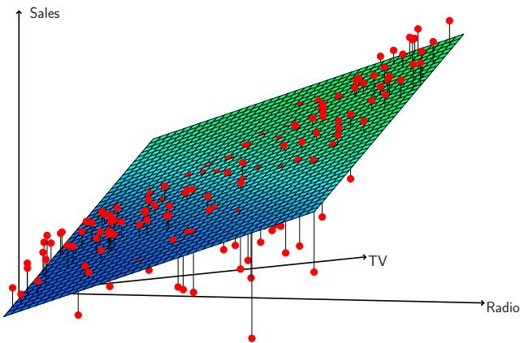

<details>
<summary>scatter_3d</summary>

| Series | TV (range) | Radio (range) | Sales (range) |
| --- | --- | --- | --- |
| Data Points | 0~100 | 0~100 | 0~100 |
</details>

FIGURE 3.5. For the Advertising data, a linear regression fit to sales using TV and radio as predictors. From the pattern of the residuals, we can see that there is a pronounced non-linear relationship in the data. The positive residuals (those visible above the surface), tend to lie along the 45-degree line, where TV and Radio budgets are split evenly. The negative residuals (most not visible), tend to lie away from this line, where budgets are more lopsided.

which simplifies to $(3.15)$ for a simple linear regression. Thus, models with more variables can have higher RSE if the decrease in RSS is small relative to the increase in p.

In addition to looking at the RSE and $R^{2}$ statistics just discussed, it can be useful to plot the data. Graphical summaries can reveal problems with a model that are not visible from numerical statistics. For example, Figure 3.5 displays a three-dimensional plot of TV and radio versus sales. We see that some observations lie above and some observations lie below the least squares regression plane. In particular, the linear model seems to overestimate sales for instances in which most of the advertising money was spent exclusively on either TV or radio. It underestimates sales for instances where the budget was split between the two media. This pronounced non-linear pattern suggests a synergy or interaction effect between the advertising media, whereby combining the media together results in a bigger boost to sales than using any single medium. In Section 3.3.2, we will discuss extending the linear model to accommodate such synergistic effects through the use of interaction terms.

interaction

# Four: Predictions

Once we have fit the multiple regression model, it is straightforward to apply $(3.21)$ in order to predict the response Y on the basis of a set of values for the predictors $X_{1}, X_{2}, \ldots, X_{p}$ . However, there are three sorts of uncertainty associated with this prediction.

1. The coefficient estimates $\hat{\beta}_0, \hat{\beta}_1, \ldots, \hat{\beta}_p$ are estimates for $\beta_0, \beta_1, \ldots, \beta_p$ . That is, the least squares plane

$$
\hat {Y} = \hat {\beta} _ {0} + \hat {\beta} _ {1} X _ {1} + \dots + \hat {\beta} _ {p} X _ {p}
$$

is only an estimate for the true population regression plane

$$
f (X) = \beta_ {0} + \beta_ {1} X _ {1} + \dots + \beta_ {p} X _ {p}.
$$

The inaccuracy in the coefficient estimates is related to the reducible error from Chapter 2. We can compute a confidence interval in order to determine how close $\hat{Y}$ will be to $f(X)$ .

2. Of course, in practice assuming a linear model for $f(X)$ is almost always an approximation of reality, so there is an additional source of potentially reducible error which we call model bias. So when we use a linear model, we are in fact estimating the best linear approximation to the true surface. However, here we will ignore this discrepancy, and operate as if the linear model were correct.  
3. Even if we knew $f(X)$ —that is, even if we knew the true values for $\beta_0, \beta_1, \ldots, \beta_p$ —the response value cannot be predicted perfectly because of the random error $\epsilon$ in the model (3.20). In Chapter 2, we referred to this as the irreducible error. How much will $Y$ vary from $\hat{Y}$ ? We use prediction intervals to answer this question. Prediction intervals are always wider than confidence intervals, because they incorporate both the error in the estimate for $f(X)$ (the reducible error) and the uncertainty as to how much an individual point will differ from the population regression plane (the irreducible error).

We use a confidence interval to quantify the uncertainty surrounding the average sales over a large number of cities. For example, given that 100,000 is spent on TV advertising and 20,000 is spent on radio advertising in each city, the 95% confidence interval is $[10,985, 11,528]$ . We interpret this to mean that 95% of intervals of this form will contain the true value of $f(X)$ . $^{9}$ On the other hand, a prediction interval can be used to quantify the uncertainty surrounding sales for a particular city. Given that 100,000 is spent on TV advertising and 20,000 is spent on radio advertising in that city the 95% prediction interval is $[7,930, 14,580]$ . We interpret this to mean that 95% of intervals of this form will contain the true value of Y for this city. Note that both intervals are centered at 11,256, but that the prediction interval is substantially wider than the confidence interval, reflecting the increased uncertainty about sales for a given city in comparison to the average sales over many locations.

# 3.3 Other Considerations in the Regression Model

# 3.3.1 Qualitative Predictors

In our discussion so far, we have assumed that all variables in our linear regression model are quantitative. But in practice, this is not necessarily the case; often some predictors are qualitative.

For example, the Credit data set displayed in Figure 3.6 records variables for a number of credit card holders. The response is balance (average credit card debt for each individual) and there are several quantitative predictors: age, cards (number of credit cards), education (years of education), income (in thousands of dollars), limit (credit limit), and rating (credit rating). Each panel of Figure 3.6 is a scatterplot for a pair of variables whose identities are given by the corresponding row and column labels. For example, the scatterplot directly to the right of the word “Balance” depicts balance versus age, while the plot directly to the right of “Age” corresponds to age versus cards. In addition to these quantitative variables, we also have four qualitative variables: own (house ownership), student (student status), status (marital status), and region (East, West or South).

# Predictors with Only Two Levels

Suppose that we wish to investigate differences in credit card balance between those who own a house and those who don't, ignoring the other variables for the moment. If a qualitative predictor (also known as a factor) only has two levels, or possible values, then incorporating it into a regression model is very simple. We simply create an indicator or dummy variable that takes on two possible numerical values. $^{10}$ For example, based on the own variable, we can create a new variable that takes the form

$$
x _ {i} = \left\{ \begin{array}{l l} 1 & \text {if ith person owns a house} \\ 0 & \text {if ith person does not own a house,} \end{array} \right. \tag {3.26}
$$

and use this variable as a predictor in the regression equation. This results in the model

$$
y _ {i} = \beta_ {0} + \beta_ {1} x _ {i} + \epsilon_ {i} = \left\{ \begin{array}{l l} \beta_ {0} + \beta_ {1} + \epsilon_ {i} & \text {if ith person owns a house} \\ \beta_ {0} + \epsilon_ {i} & \text {if ith person does not.} \end{array} \right. \tag {3.27}
$$

Now $\beta_{0}$ can be interpreted as the average credit card balance among those who do not own, $\beta_{0} + \beta_{1}$ as the average credit card balance among those who do own their house, and $\beta_{1}$ as the average difference in credit card balance between owners and non-owners.

Table 3.7 displays the coefficient estimates and other information associated with the model (3.27). The average credit card debt for non-owners is estimated to be \$509.80, whereas owners are estimated to carry \$19.73 in additional debt for a total of \$509.80 + \$19.73 = \$529.53. However, we

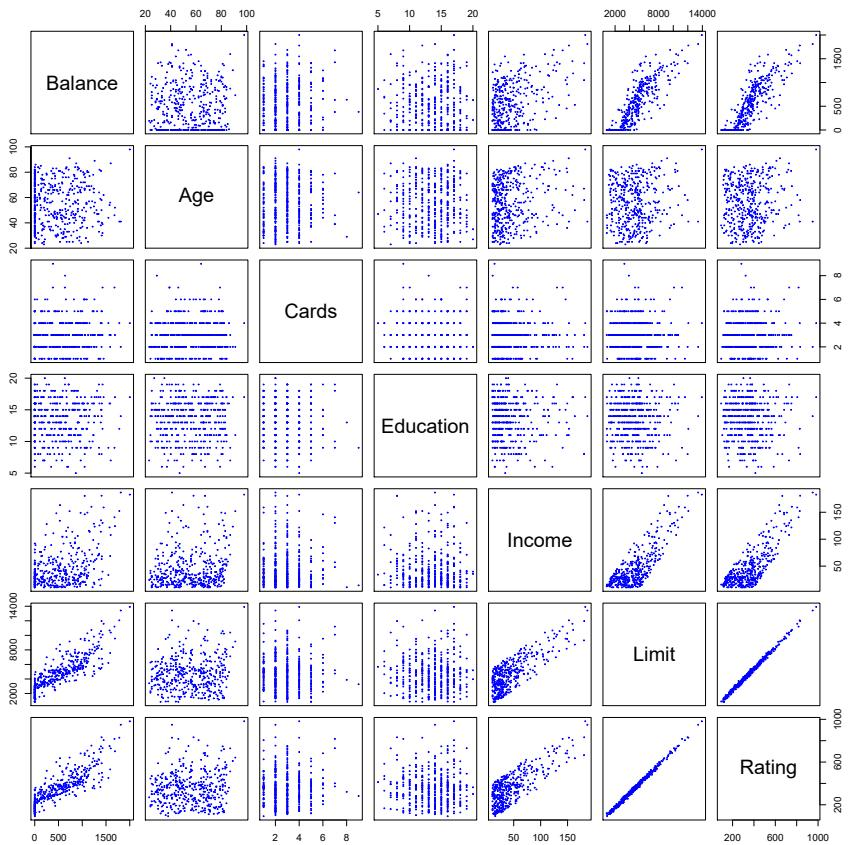

<details>
<summary>scatter</summary>

| Variable | X-axis (range) | Y-axis (range) |
| --- | --- | --- |
| Balance | 0~1500 | 20~100 |
| Age | 0~1500 | 20~100 |
| Cards | 0~1500 | 2~100 |
| Education | 0~1500 | 5~20 |
| Income | 0~1500 | 5~150 |
| Limit | 0~1500 | 2000~14000 |
| Rating | 0~1500 | 200~1000 |
</details>

FIGURE 3.6. The Credit data set contains information about balance, age, cards, education, income, limit, and rating for a number of potential customers.

notice that the p-value for the dummy variable is very high. This indicates that there is no statistical evidence of a difference in average credit card balance based on house ownership.

The decision to code owners as 1 and non-owners as 0 in (3.27) is arbitrary, and has no effect on the regression fit, but does alter the interpretation of the coefficients. If we had coded non-owners as 1 and owners as 0, then the estimates for $\beta_0$ and $\beta_1$ would have been 529.53 and $-19.73$ , respectively, leading once again to a prediction of credit card debt of $529.53 - 19.73 = 509.80$ for non-owners and a prediction of $529.53$ for owners. Alternatively, instead of a 0/1 coding scheme, we could create a dummy variable

$$
x _ {i} = \left\{ \begin{array}{c l} 1 & \text {if i th person owns a house} \\ - 1 & \text {if i th person does not own a house} \end{array} \right.
$$

and use this variable in the regression equation. This results in the model

$$
y _ {i} = \beta_ {0} + \beta_ {1} x _ {i} + \epsilon_ {i} = \left\{ \begin{array}{l l} \beta_ {0} + \beta_ {1} + \epsilon_ {i} & \text {if ith person owns a house} \\ \beta_ {0} - \beta_ {1} + \epsilon_ {i} & \text {if ith person does not own a house.} \end{array} \right.
$$

<table><tr><td></td><td>Coefficient</td><td>Std. error</td><td>t-statistic</td><td>p-value</td></tr><tr><td>Intercept</td><td>509.80</td><td>33.13</td><td>15.389</td><td>&lt; 0.0001</td></tr><tr><td>own[Yes]</td><td>19.73</td><td>46.05</td><td>0.429</td><td>0.6690</td></tr></table>

TABLE 3.7. Least squares coefficient estimates associated with the regression of balance onto own in the Credit data set. The linear model is given in (3.27). That is, ownership is encoded as a dummy variable, as in (3.26).

Now $\beta_{0}$ can be interpreted as the overall average credit card balance (ignoring the house ownership effect), and $\beta_{1}$ is the amount by which house owners and non-owners have credit card balances that are above and below the average, respectively. $^{11}$ In this example, the estimate for $\beta_{0}$ is \$519.665, halfway between the non-owner and owner averages of \$509.80 and \$529.53. The estimate for $\beta_{1}$ is \$9.865, which is half of \$19.73, the average difference between owners and non-owners. It is important to note that the final predictions for the credit balances of owners and non-owners will be identical regardless of the coding scheme used. The only difference is in the way that the coefficients are interpreted.

# Qualitative Predictors with More than Two Levels

When a qualitative predictor has more than two levels, a single dummy variable cannot represent all possible values. In this situation, we can create additional dummy variables. For example, for the region variable we create two dummy variables. The first could be

$$
x _ {i 1} = \left\{ \begin{array}{l l} 1 & \text {if ith person is from the South} \\ 0 & \text {if ith person is not from the South,} \end{array} \right. \tag {3.28}
$$

and the second could be

$$
x _ {i 2} = \left\{ \begin{array}{l l} 1 & \text {if ith person is from the West} \\ 0 & \text {if ith person is not from the West.} \end{array} \right. \tag {3.29}
$$

Then both of these variables can be used in the regression equation, in order to obtain the model

$$
y _ {i} = \beta_ {0} + \beta_ {1} x _ {i 1} + \beta_ {2} x _ {i 2} + \epsilon_ {i} = \left\{ \begin{array}{l l} \beta_ {0} + \beta_ {1} + \epsilon_ {i} & \text {if ith person is from the South} \\ \beta_ {0} + \beta_ {2} + \epsilon_ {i} & \text {if ith person is from the West} \\ \beta_ {0} + \epsilon_ {i} & \text {if ith person is from the East.} \end{array} \right. \tag {3.30}
$$

Now $\beta_{0}$ can be interpreted as the average credit card balance for individuals from the East, $\beta_{1}$ can be interpreted as the difference in the average balance between people from the South versus the East, and $\beta_{2}$ can be interpreted as the difference in the average balance between those from the West versus the East. There will always be one fewer dummy variable than the number of levels. The level with no dummy variable—East in this example—is known as the baseline.

baseline

<table><tr><td></td><td>Coefficient</td><td>Std. error</td><td>t-statistic</td><td>p-value</td></tr><tr><td>Intercept</td><td>531.00</td><td>46.32</td><td>11.464</td><td>&lt; 0.0001</td></tr><tr><td>region [South]</td><td>-12.50</td><td>56.68</td><td>-0.221</td><td>0.8260</td></tr><tr><td>region [West]</td><td>-18.69</td><td>65.02</td><td>-0.287</td><td>0.7740</td></tr></table>

TABLE 3.8. Least squares coefficient estimates associated with the regression of balance onto region in the Credit data set. The linear model is given in (3.30). That is, region is encoded via two dummy variables (3.28) and (3.29).

From Table 3.8, we see that the estimated balance for the baseline, East, is 531.00. It is estimated that those in the South will have 18.69 less debt than those in the East, and that those in the West will have 12.50 less debt than those in the East. However, the p-values associated with the coefficient estimates for the two dummy variables are very large, suggesting no statistical evidence of a real difference in average credit card balance between South and East or between West and East. $^{12}$ Once again, the level selected as the baseline category is arbitrary, and the final predictions for each group will be the same regardless of this choice. However, the coefficients and their p-values do depend on the choice of dummy variable coding. Rather than rely on the individual coefficients, we can use an F-test to test $H_{0} : \beta_{1} = \beta_{2} = 0$ ; this does not depend on the coding. This F-test has a p-value of 0.96, indicating that we cannot reject the null hypothesis that there is no relationship between balance and region.

Using this dummy variable approach presents no difficulties when incorporating both quantitative and qualitative predictors. For example, to regress balance on both a quantitative variable such as income and a qualitative variable such as student, we must simply create a dummy variable for student and then fit a multiple regression model using income and the dummy variable as predictors for credit card balance.

There are many different ways of coding qualitative variables besides the dummy variable approach taken here. All of these approaches lead to equivalent model fits, but the coefficients are different and have different interpretations, and are designed to measure particular contrasts. This topic is beyond the scope of the book.

contrast

# 3.3.2 Extensions of the Linear Model

The standard linear regression model (3.19) provides interpretable results and works quite well on many real-world problems. However, it makes several highly restrictive assumptions that are often violated in practice. Two of the most important assumptions state that the relationship between the predictors and response are additive and linear. The additivity assumption means that the association between a predictor $X_{j}$ and the response Y does not depend on the values of the other predictors. The linearity assumption states that the change in the response Y associated with a one-unit change in $X_{j}$ is constant, regardless of the value of $X_{j}$ . In later chapters of this book, we examine a number of sophisticated methods that relax these two

additive linear

assumptions. Here, we briefly examine some common classical approaches for extending the linear model.

# Removing the Additive Assumption

In our previous analysis of the Advertising data, we concluded that both TV and radio seem to be associated with sales. The linear models that formed the basis for this conclusion assumed that the effect on sales of increasing one advertising medium is independent of the amount spent on the other media. For example, the linear model (3.20) states that the average increase in sales associated with a one-unit increase in TV is always $\beta_{1}$ , regardless of the amount spent on radio.

However, this simple model may be incorrect. Suppose that spending money on radio advertising actually increases the effectiveness of TV advertising, so that the slope term for TV should increase as radio increases. In this situation, given a fixed budget of \$100,000, spending half on radio and half on TV may increase sales more than allocating the entire amount to either TV or to radio. In marketing, this is known as a synergy effect, and in statistics it is referred to as an interaction effect. Figure 3.5 suggests that such an effect may be present in the advertising data. Notice that when levels of either TV or radio are low, then the true sales are lower than predicted by the linear model. But when advertising is split between the two media, then the model tends to underestimate sales.

Consider the standard linear regression model with two variables,

$$
Y = \beta_ {0} + \beta_ {1} X _ {1} + \beta_ {2} X _ {2} + \epsilon .
$$

According to this model, a one-unit increase in $X_{1}$ is associated with an average increase in Y of $\beta_{1}$ units. Notice that the presence of $X_{2}$ does not alter this statement—that is, regardless of the value of $X_{2}$ , a one-unit increase in $X_{1}$ is associated with a $\beta_{1}$ -unit increase in Y. One way of extending this model is to include a third predictor, called an interaction term, which is constructed by computing the product of $X_{1}$ and $X_{2}$ . This results in the model

$$
Y = \beta_ {0} + \beta_ {1} X _ {1} + \beta_ {2} X _ {2} + \beta_ {3} X _ {1} X _ {2} + \epsilon . \tag {3.31}
$$

How does inclusion of this interaction term relax the additive assumption? Notice that (3.31) can be rewritten as

$$
\begin{array}{l} Y = \beta_ {0} + (\beta_ {1} + \beta_ {3} X _ {2}) X _ {1} + \beta_ {2} X _ {2} + \epsilon \tag {3.32} \\ = \beta_ {0} + \tilde {\beta} _ {1} X _ {1} + \beta_ {2} X _ {2} + \epsilon \\ \end{array}
$$

where $\tilde{\beta}_{1}=\beta_{1}+\beta_{3}X_{2}$ . Since $\tilde{\beta}_{1}$ is now a function of $X_{2}$ , the association between $X_{1}$ and Y is no longer constant: a change in the value of $X_{2}$ will change the association between $X_{1}$ and Y. A similar argument shows that a change in the value of $X_{1}$ changes the association between $X_{2}$ and Y.

For example, suppose that we are interested in studying the productivity of a factory. We wish to predict the number of units produced on the basis of the number of production lines and the total number of workers. It seems likely that the effect of increasing the number of production lines

<table><tr><td></td><td>Coefficient</td><td>Std. error</td><td>t-statistic</td><td>p-value</td></tr><tr><td>Intercept</td><td>6.7502</td><td>0.248</td><td>27.23</td><td>&lt; 0.0001</td></tr><tr><td>TV</td><td>0.0191</td><td>0.002</td><td>12.70</td><td>&lt; 0.0001</td></tr><tr><td>radio</td><td>0.0289</td><td>0.009</td><td>3.24</td><td>0.0014</td></tr><tr><td>TV×radio</td><td>0.0011</td><td>0.000</td><td>20.73</td><td>&lt; 0.0001</td></tr></table>

TABLE 3.9. For the Advertising data, least squares coefficient estimates associated with the regression of sales onto TV and radio, with an interaction term, as in (3.33).

will depend on the number of workers, since if no workers are available to operate the lines, then increasing the number of lines will not increase production. This suggests that it would be appropriate to include an interaction term between lines and workers in a linear model to predict units. Suppose that when we fit the model, we obtain

units $\approx 1.2 + 3.4 \times$ lines $+ 0.22 \times$ workers $+ 1.4 \times$ (lines $\times$ workers)

$$
= 1. 2 + (3. 4 + 1. 4 \times \text {workers}) \times \text {lines} + 0. 2 2 \times \text {workers}.
$$

In other words, adding an additional line will increase the number of units produced by $3.4 + 1.4 \times$ workers. Hence the more workers we have, the stronger will be the effect of lines.

We now return to the Advertising example. A linear model that uses radio, TV, and an interaction between the two to predict sales takes the form

$$
\begin{array}{l} \text {sales} = \beta_ {0} + \beta_ {1} \times \mathrm{TV} + \beta_ {2} \times \text {radio} + \beta_ {3} \times (\text {radio} \times \mathrm{TV}) + \epsilon \\ = \beta_ {0} + (\beta_ {1} + \beta_ {3} \times \text {radio}) \times \text {TV} + \beta_ {2} \times \text {radio} + \epsilon . \tag {3.33} \\ \end{array}
$$

We can interpret $\beta_{3}$ as the increase in the effectiveness of TV advertising associated with a one-unit increase in radio advertising (or vice-versa). The coefficients that result from fitting the model (3.33) are given in Table 3.9.

The results in Table 3.9 strongly suggest that the model that includes the interaction term is superior to the model that contains only main effects. The $p$ -value for the interaction term, TV×radio, is extremely low, indicating that there is strong evidence for $H_a : \beta_3 \neq 0$ . In other words, it is clear that the true relationship is not additive. The $R^2$ for the model (3.33) is 96.8%, compared to only 89.7% for the model that predicts sales using TV and radio without an interaction term. This means that $(96.8 - 89.7)/(100 - 89.7) = 69\%$ of the variability in sales that remains after fitting the additive model has been explained by the interaction term. The coefficient estimates in Table 3.9 suggest that an increase in TV advertising of \$1,000 is associated with increased sales of $(\hat{\beta}_1 + \hat{\beta}_3 \times \text{radio}) \times 1,000 = 19 + 1.1 \times \text{radio}$ units. And an increase in radio advertising of \$1,000 will be associated with an increase in sales of $(\hat{\beta}_2 + \hat{\beta}_3 \times \text{TV}) \times 1,000 = 29 + 1.1 \times \text{TV}$ units.

In this example, the p-values associated with TV, radio, and the interaction term all are statistically significant (Table 3.9), and so it is obvious that all three variables should be included in the model. However, it is sometimes the case that an interaction term has a very small p-value, but the associated main effects (in this case, TV and radio) do not. The hierarchical principle states that if we include an interaction in a model, we

should also include the main effects, even if the p-values associated with their coefficients are not significant. In other words, if the interaction between $X_{1}$ and $X_{2}$ seems important, then we should include both $X_{1}$ and $X_{2}$ in the model even if their coefficient estimates have large p-values. The rationale for this principle is that if $X_{1} \times X_{2}$ is related to the response, then whether or not the coefficients of $X_{1}$ or $X_{2}$ are exactly zero is of little interest. Also $X_{1} \times X_{2}$ is typically correlated with $X_{1}$ and $X_{2}$ , and so leaving them out tends to alter the meaning of the interaction.

In the previous example, we considered an interaction between TV and radio, both of which are quantitative variables. However, the concept of interactions applies just as well to qualitative variables, or to a combination of quantitative and qualitative variables. In fact, an interaction between a qualitative variable and a quantitative variable has a particularly nice interpretation. Consider the Credit data set from Section 3.3.1, and suppose that we wish to predict balance using the income (quantitative) and student (qualitative) variables. In the absence of an interaction term, the model takes the form

$$
\begin{array}{l} \begin{array}{r c l} \text {balance} _ {i} & \approx & \beta_ {0} + \beta_ {1} \times \text {income} _ {i} + \left\{ \begin{array}{l l} \beta_ {2} & \text {if ith person is a student} \\ 0 & \text {if ith person is not a student} \end{array} \right. \end{array} \\ = \quad \beta_ {1} \times \text {income} _ {i} + \left\{ \begin{array}{l l} \beta_ {0} + \beta_ {2} & \text {if ith person is a student} \\ \beta_ {0} & \text {if ith person is not a student.} \end{array} \right. \tag {3.34} \\ \end{array}
$$

Notice that this amounts to fitting two parallel lines to the data, one for students and one for non-students. The lines for students and non-students have different intercepts, $\beta_{0} + \beta_{2}$ versus $\beta_{0}$ , but the same slope, $\beta_{1}$ . This is illustrated in the left-hand panel of Figure 3.7. The fact that the lines are parallel means that the average effect on balance of a one-unit increase in income does not depend on whether or not the individual is a student. This represents a potentially serious limitation of the model, since in fact a change in income may have a very different effect on the credit card balance of a student versus a non-student.

This limitation can be addressed by adding an interaction variable, created by multiplying income with the dummy variable for student. Our model now becomes

$$
\begin{array}{l} \text {balance} _ {i} \approx \beta_ {0} + \beta_ {1} \times \text {income} _ {i} + \left\{ \begin{array}{l l} \beta_ {2} + \beta_ {3} \times \text {income} _ {i} & \text {if student} \\ 0 & \text {if not student} \end{array} \right. \\ = \left\{ \begin{array}{l l} \left(\beta_ {0} + \beta_ {2}\right) + \left(\beta_ {1} + \beta_ {3}\right) \times \text {income} _ {i} & \text {if student} \\ \beta_ {0} + \beta_ {1} \times \text {income} _ {i} & \text {if not student.} \end{array} \right. \tag {3.35} \\ \end{array}
$$

Once again, we have two different regression lines for the students and the non-students. But now those regression lines have different intercepts, $\beta_{0}+\beta_{2}$ versus $\beta_{0}$ , as well as different slopes, $\beta_{1}+\beta_{3}$ versus $\beta_{1}$ . This allows for the possibility that changes in income may affect the credit card balances of students and non-students differently. The right-hand panel of Figure 3.7

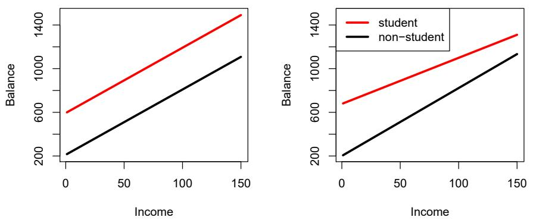  
FIGURE 3.7. For the Credit data, the least squares lines are shown for prediction of balance from income for students and non-students. Left: The model (3.34) was fit. There is no interaction between income and student. Right: The model (3.35) was fit. There is an interaction term between income and student.

shows the estimated relationships between income and balance for students and non-students in the model $(3.35)$ . We note that the slope for students is lower than the slope for non-students. This suggests that increases in income are associated with smaller increases in credit card balance among students as compared to non-students.

# Non-linear Relationships

As discussed previously, the linear regression model $(3.19)$ assumes a linear relationship between the response and predictors. But in some cases, the true relationship between the response and the predictors may be nonlinear. Here we present a very simple way to directly extend the linear model to accommodate non-linear relationships, using polynomial regression. In later chapters, we will present more complex approaches for performing non-linear fits in more general settings.

Consider Figure 3.8, in which the mpg (gas mileage in miles per gallon) versus horsepower is shown for a number of cars in the Auto data set. The orange line represents the linear regression fit. There is a pronounced relationship between mpg and horsepower, but it seems clear that this relationship is in fact non-linear: the data suggest a curved relationship. A simple approach for incorporating non-linear associations in a linear model is to include transformed versions of the predictors. For example, the points in Figure 3.8 seem to have a quadratic shape, suggesting that a model of the form

$$
\mathrm{mpg} = \beta_ {0} + \beta_ {1} \times \text {horsepower} + \beta_ {2} \times \text {horsepower} ^ {2} + \epsilon \tag {3.36}
$$

may provide a better fit. Equation 3.36 involves predicting mpg using a non-linear function of horsepower. But it is still a linear model! That is, (3.36) is simply a multiple linear regression model with $X_{1} = horsepower$ and $X_{2} = horsepower^{2}$ . So we can use standard linear regression software to estimate $\beta_{0}, \beta_{1}$ , and $\beta_{2}$ in order to produce a non-linear fit. The blue curve in Figure 3.8 shows the resulting quadratic fit to the data. The quadratic


<details>
<summary>scatter</summary>

| Series | Horsepower (range) | Miles per gallon (range) |
| --- | --- | --- |
| Data Points | 40~230 | 10~47 |
| Linear | 40~210 | 6~34 |
| Degree 2 | 40~230 | 13~41 |
| Degree 5 | 40~230 | 11~35 |
</details>

FIGURE 3.8. The Auto data set. For a number of cars, mpg and horsepower are shown. The linear regression fit is shown in orange. The linear regression fit for a model that includes horsepower $^{2}$ is shown as a blue curve. The linear regression fit for a model that includes all polynomials of horsepower up to fifth-degree is shown in green.

<table><tr><td></td><td>Coefficient</td><td>Std. error</td><td>t-statistic</td><td>p-value</td></tr><tr><td>Intercept</td><td>56.9001</td><td>1.8004</td><td>31.6</td><td>&lt; 0.0001</td></tr><tr><td>horsepower</td><td>-0.4662</td><td>0.0311</td><td>-15.0</td><td>&lt; 0.0001</td></tr><tr><td> $horsepower^2$ </td><td>0.0012</td><td>0.0001</td><td>10.1</td><td>&lt; 0.0001</td></tr></table>

TABLE 3.10. For the Auto data set, least squares coefficient estimates associated with the regression of mpg onto horsepower and horsepower $^{2}$ .

fit appears to be substantially better than the fit obtained when just the linear term is included. The $R^{2}$ of the quadratic fit is 0.688, compared to 0.606 for the linear fit, and the p-value in Table 3.10 for the quadratic term is highly significant.

If including horsepower $^{2}$ led to such a big improvement in the model, why not include horsepower $^{3}$ , horsepower $^{4}$ , or even horsepower $^{5}$ ? The green curve in Figure 3.8 displays the fit that results from including all polynomials up to fifth degree in the model (3.36). The resulting fit seems unnecessarily wiggly—that is, it is unclear that including the additional terms really has led to a better fit to the data.

The approach that we have just described for extending the linear model to accommodate non-linear relationships is known as polynomial regression, since we have included polynomial functions of the predictors in the regression model. We further explore this approach and other non-linear extensions of the linear model in Chapter 7.

# 3.3.3 Potential Problems

When we fit a linear regression model to a particular data set, many problems may occur. Most common among these are the following:

1. Non-linearity of the response-predictor relationships.  
2. Correlation of error terms.  
3. Non-constant variance of error terms.  
4. Outliers.  
5. High-leverage points.  
6. Collinearity.

In practice, identifying and overcoming these problems is as much an art as a science. Many pages in countless books have been written on this topic. Since the linear regression model is not our primary focus here, we will provide only a brief summary of some key points.

# 1. Non-linearity of the Data

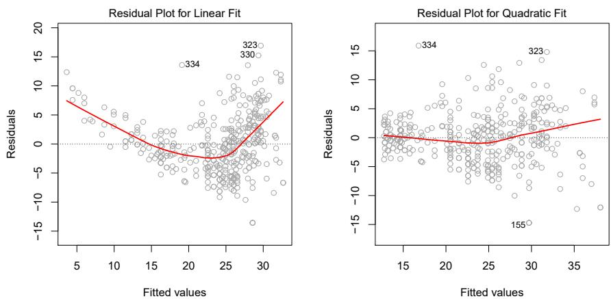  
FIGURE 3.9. Plots of residuals versus predicted (or fitted) values for the Auto data set. In each plot, the red line is a smooth fit to the residuals, intended to make it easier to identify a trend. Left: A linear regression of mpg on horsepower. A strong pattern in the residuals indicates non-linearity in the data. Right: A linear regression of mpg on horsepower and horsepower $^{2}$ . There is little pattern in the residuals.

The linear regression model assumes that there is a straight-line relationship between the predictors and the response. If the true relationship is far from linear, then virtually all of the conclusions that we draw from the fit are suspect. In addition, the prediction accuracy of the model can be significantly reduced.

Residual plots are a useful graphical tool for identifying non-linearity. Given a simple linear regression model, we can plot the residuals, $e_{i} =$

residual plot

$y_{i}-\hat{y}_{i}$ , versus the predictor $x_{i}$ . In the case of a multiple regression model, since there are multiple predictors, we instead plot the residuals versus the predicted (or fitted) values $\hat{y}_{i}$ . Ideally, the residual plot will show no discernible pattern. The presence of a pattern may indicate a problem with some aspect of the linear model.

The left panel of Figure 3.9 displays a residual plot from the linear regression of mpg onto horsepower on the Auto data set that was illustrated in Figure 3.8. The red line is a smooth fit to the residuals, which is displayed in order to make it easier to identify any trends. The residuals exhibit a clear U-shape, which provides a strong indication of non-linearity in the data. In contrast, the right-hand panel of Figure 3.9 displays the residual plot that results from the model (3.36), which contains a quadratic term. There appears to be little pattern in the residuals, suggesting that the quadratic term improves the fit to the data.

If the residual plot indicates that there are non-linear associations in the data, then a simple approach is to use non-linear transformations of the predictors, such as $\log X$ , $\sqrt{X}$ , and $X^{2}$ , in the regression model. In the later chapters of this book, we will discuss other more advanced non-linear approaches for addressing this issue.

# 2. Correlation of Error Terms

An important assumption of the linear regression model is that the error terms, $\epsilon_{1}, \epsilon_{2}, \ldots, \epsilon_{n}$ , are uncorrelated. What does this mean? For instance, if the errors are uncorrelated, then the fact that $\epsilon_{i}$ is positive provides little or no information about the sign of $\epsilon_{i+1}$ . The standard errors that are computed for the estimated regression coefficients or the fitted values are based on the assumption of uncorrelated error terms. If in fact there is correlation among the error terms, then the estimated standard errors will tend to underestimate the true standard errors. As a result, confidence and prediction intervals will be narrower than they should be. For example, a 95% confidence interval may in reality have a much lower probability than 0.95 of containing the true value of the parameter. In addition, p-values associated with the model will be lower than they should be; this could cause us to erroneously conclude that a parameter is statistically significant. In short, if the error terms are correlated, we may have an unwarranted sense of confidence in our model.

As an extreme example, suppose we accidentally doubled our data, leading to observations and error terms identical in pairs. If we ignored this, our standard error calculations would be as if we had a sample of size 2n, when in fact we have only n samples. Our estimated parameters would be the same for the 2n samples as for the n samples, but the confidence intervals would be narrower by a factor of $\sqrt{2}$ !

Why might correlations among the error terms occur? Such correlations frequently occur in the context of time series data, which consists of observations for which measurements are obtained at discrete points in time. In many cases, observations that are obtained at adjacent time points will have positively correlated errors. In order to determine if this is the case for a given data set, we can plot the residuals from our model as a function of time. If the errors are uncorrelated, then there should be no discernible pat-

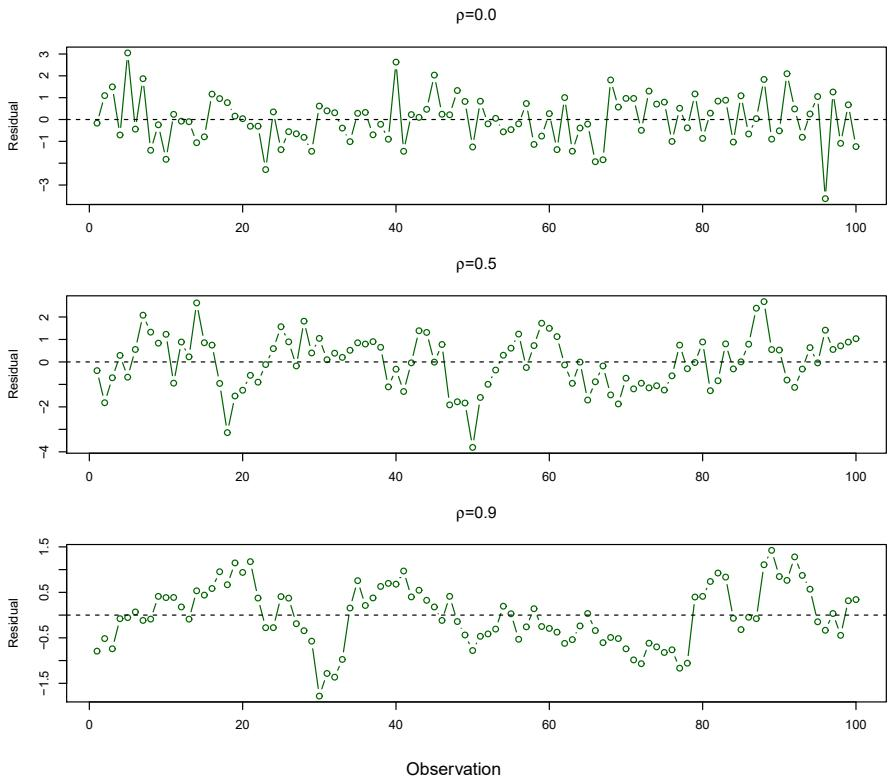  
FIGURE 3.10. Plots of residuals from simulated time series data sets generated with differing levels of correlation $\rho$ between error terms for adjacent time points.

tern. On the other hand, if the error terms are positively correlated, then we may see tracking in the residuals—that is, adjacent residuals may have similar values. Figure 3.10 provides an illustration. In the top panel, we see the residuals from a linear regression fit to data generated with uncorrelated errors. There is no evidence of a time-related trend in the residuals. In contrast, the residuals in the bottom panel are from a data set in which adjacent errors had a correlation of 0.9. Now there is a clear pattern in the residuals—adjacent residuals tend to take on similar values. Finally, the center panel illustrates a more moderate case in which the residuals had a correlation of 0.5. There is still evidence of tracking, but the pattern is less clear.

Many methods have been developed to properly take account of correlations in the error terms in time series data. Correlation among the error terms can also occur outside of time series data. For instance, consider a study in which individuals' heights are predicted from their weights. The assumption of uncorrelated errors could be violated if some of the individuals in the study are members of the same family, eat the same diet, or have been exposed to the same environmental factors. In general, the assumption of uncorrelated errors is extremely important for linear regression as well as for other statistical methods, and good experimental design is crucial in order to mitigate the risk of such correlations.

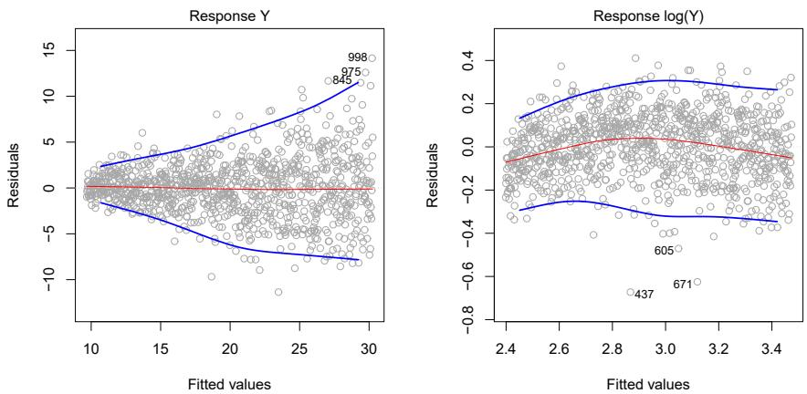  
FIGURE 3.11. Residual plots. In each plot, the red line is a smooth fit to the residuals, intended to make it easier to identify a trend. The blue lines track the outer quantiles of the residuals, and emphasize patterns. Left: The funnel shape indicates heteroscedasticity. Right: The response has been log transformed, and there is now no evidence of heteroscedasticity.

# 3. Non-constant Variance of Error Terms

Another important assumption of the linear regression model is that the error terms have a constant variance, $\operatorname{Var}(\epsilon_{i}) = \sigma^{2}$ . The standard errors, confidence intervals, and hypothesis tests associated with the linear model rely upon this assumption.

Unfortunately, it is often the case that the variances of the error terms are non-constant. For instance, the variances of the error terms may increase with the value of the response. One can identify non-constant variances in the errors, or heteroscedasticity, from the presence of a funnel shape in the residual plot. An example is shown in the left-hand panel of Figure 3.11, in which the magnitude of the residuals tends to increase with the fitted values. When faced with this problem, one possible solution is to transform the response Y using a concave function such as $\log Y$ or $\sqrt{Y}$ . Such a transformation results in a greater amount of shrinkage of the larger responses, leading to a reduction in heteroscedasticity. The right-hand panel of Figure 3.11 displays the residual plot after transforming the response using $\log Y$ . The residuals now appear to have constant variance, though there is some evidence of a slight non-linear relationship in the data.

Sometimes we have a good idea of the variance of each response. For example, the ith response could be an average of $n_{i}$ raw observations. If each of these raw observations is uncorrelated with variance $\sigma^{2}$ , then their average has variance $\sigma_{i}^{2} = \sigma^{2}/n_{i}$ . In this case a simple remedy is to fit our model by weighted least squares, with weights proportional to the inverse variances—i.e. $w_{i} = n_{i}$ in this case. Most linear regression software allows for observation weights.

hetero-
scedasticity

weighted
least squares

# 4. Outliers

An outlier is a point for which $y_{i}$ is far from the value predicted by the

outlier

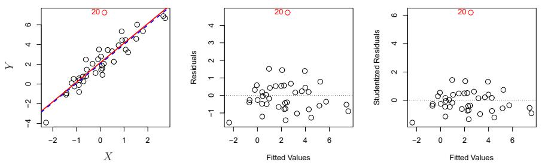  
FIGURE 3.12. Left: The least squares regression line is shown in red, and the regression line after removing the outlier is shown in blue. Center: The residual plot clearly identifies the outlier. Right: The outlier has a studentized residual of 6; typically we expect values between -3 and 3.

model. Outliers can arise for a variety of reasons, such as incorrect recording of an observation during data collection.

The red point (observation 20) in the left-hand panel of Figure 3.12 illustrates a typical outlier. The red solid line is the least squares regression fit, while the blue dashed line is the least squares fit after removal of the outlier. In this case, removing the outlier has little effect on the least squares line: it leads to almost no change in the slope, and a miniscule reduction in the intercept. It is typical for an outlier that does not have an unusual predictor value to have little effect on the least squares fit. However, even if an outlier does not have much effect on the least squares fit, it can cause other problems. For instance, in this example, the RSE is 1.09 when the outlier is included in the regression, but it is only 0.77 when the outlier is removed. Since the RSE is used to compute all confidence intervals and p-values, such a dramatic increase caused by a single data point can have implications for the interpretation of the fit. Similarly, inclusion of the outlier causes the $R^{2}$ to decline from 0.892 to 0.805.

Residual plots can be used to identify outliers. In this example, the outlier is clearly visible in the residual plot illustrated in the center panel of Figure 3.12. But in practice, it can be difficult to decide how large a residual needs to be before we consider the point to be an outlier. To address this problem, instead of plotting the residuals, we can plot the studentized residuals, computed by dividing each residual $e_{i}$ by its estimated standard error. Observations whose studentized residuals are greater than 3 in absolute value are possible outliers. In the right-hand panel of Figure 3.12, the outlier's studentized residual exceeds 6, while all other observations have studentized residuals between -2 and 2.

If we believe that an outlier has occurred due to an error in data collection or recording, then one solution is to simply remove the observation. However, care should be taken, since an outlier may instead indicate a deficiency with the model, such as a missing predictor.

# 5. High Leverage Points

We just saw that outliers are observations for which the response $y_{i}$ is unusual given the predictor $x_{i}$ . In contrast, observations with high leverage have an unusual value for $x_{i}$ . For example, observation 41 in the left-hand

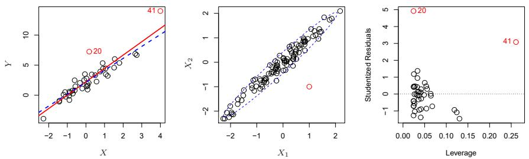  
FIGURE 3.13. Left: Observation 41 is a high leverage point, while 20 is not. The red line is the fit to all the data, and the blue line is the fit with observation 41 removed. Center: The red observation is not unusual in terms of its $X_{1}$ value or its $X_{2}$ value, but still falls outside the bulk of the data, and hence has high leverage. Right: Observation 41 has a high leverage and a high residual.

panel of Figure 3.13 has high leverage, in that the predictor value for this observation is large relative to the other observations. (Note that the data displayed in Figure 3.13 are the same as the data displayed in Figure 3.12, but with the addition of a single high leverage observation.) The red solid line is the least squares fit to the data, while the blue dashed line is the fit produced when observation 41 is removed. Comparing the left-hand panels of Figures 3.12 and 3.13, we observe that removing the high leverage observation has a much more substantial impact on the least squares line than removing the outlier. In fact, high leverage observations tend to have a sizable impact on the estimated regression line. It is cause for concern if the least squares line is heavily affected by just a couple of observations, because any problems with these points may invalidate the entire fit. For this reason, it is important to identify high leverage observations.

In a simple linear regression, high leverage observations are fairly easy to identify, since we can simply look for observations for which the predictor value is outside of the normal range of the observations. But in a multiple linear regression with many predictors, it is possible to have an observation that is well within the range of each individual predictor's values, but that is unusual in terms of the full set of predictors. An example is shown in the center panel of Figure 3.13, for a data set with two predictors, $X_{1}$ and $X_{2}$ . Most of the observations' predictor values fall within the blue dashed ellipse, but the red observation is well outside of this range. But neither its value for $X_{1}$ nor its value for $X_{2}$ is unusual. So if we examine just $X_{1}$ or just $X_{2}$ , we will fail to notice this high leverage point. This problem is more pronounced in multiple regression settings with more than two predictors, because then there is no simple way to plot all dimensions of the data simultaneously.

In order to quantify an observation's leverage, we compute the leverage statistic. A large value of this statistic indicates an observation with high leverage. For a simple linear regression,

leverage statistic

$$
h _ {i} = \frac {1}{n} + \frac {(x _ {i} - \bar {x}) ^ {2}}{\sum_ {i ^ {\prime} = 1} ^ {n} (x _ {i ^ {\prime}} - \bar {x}) ^ {2}}. \tag {3.37}
$$

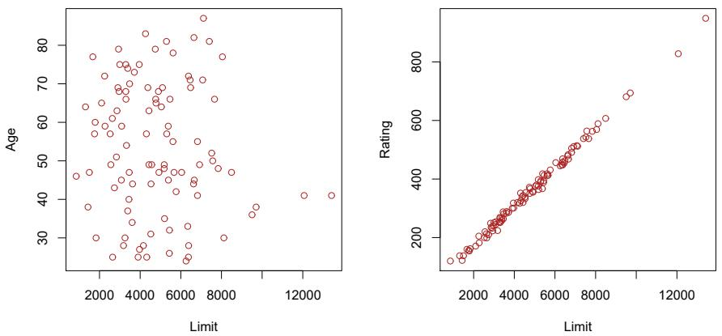  
FIGURE 3.14. Scatterplots of the observations from the Credit data set. Left: A plot of age versus limit. These two variables are not collinear. Right: A plot of rating versus limit. There is high collinearity.

It is clear from this equation that $h_{i}$ increases with the distance of $x_{i}$ from $\bar{x}$ . There is a simple extension of $h_{i}$ to the case of multiple predictors, though we do not provide the formula here. The leverage statistic $h_{i}$ is always between 1/n and 1, and the average leverage for all the observations is always equal to $(p+1)/n$ . So if a given observation has a leverage statistic that greatly exceeds $(p+1)/n$ , then we may suspect that the corresponding point has high leverage.

The right-hand panel of Figure 3.13 provides a plot of the studentized residuals versus $h_{i}$ for the data in the left-hand panel of Figure 3.13. Observation 41 stands out as having a very high leverage statistic as well as a high studentized residual. In other words, it is an outlier as well as a high leverage observation. This is a particularly dangerous combination! This plot also reveals the reason that observation 20 had relatively little effect on the least squares fit in Figure 3.12: it has low leverage.

# 6. Collinearity

Collinearity refers to the situation in which two or more predictor variables are closely related to one another. The concept of collinearity is illustrated in Figure 3.14 using the Credit data set. In the left-hand panel of Figure 3.14, the two predictors limit and age appear to have no obvious relationship. In contrast, in the right-hand panel of Figure 3.14, the predictors limit and rating are very highly correlated with each other, and we say that they are collinear. The presence of collinearity can pose problems in the regression context, since it can be difficult to separate out the individual effects of collinear variables on the response. In other words, since limit and rating tend to increase or decrease together, it can be difficult to determine how each one separately is associated with the response, balance.

Figure 3.15 illustrates some of the difficulties that can result from collinearity. The left-hand panel of Figure 3.15 is a contour plot of the RSS (3.22) associated with different possible coefficient estimates for the regression of balance on limit and age. Each ellipse represents a set of coefficients

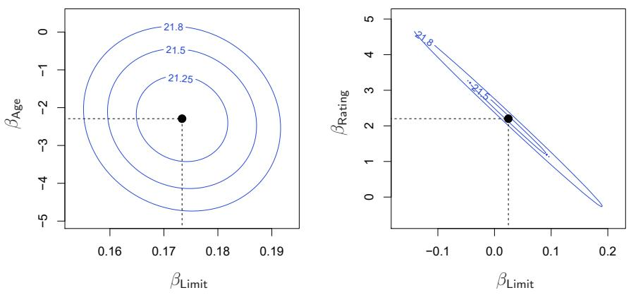  
FIGURE 3.15. Contour plots for the RSS values as a function of the parameters $\beta$ for various regressions involving the Credit data set. In each plot, the black dots represent the coefficient values corresponding to the minimum RSS. Left: A contour plot of RSS for the regression of balance onto age and limit. The minimum value is well defined. Right: A contour plot of RSS for the regression of balance onto rating and limit. Because of the collinearity, there are many pairs $(\beta_{\mathrm{Limit}}, \beta_{\mathrm{Rating}})$ with a similar value for RSS.

that correspond to the same RSS, with ellipses nearest to the center taking on the lowest values of RSS. The black dots and associated dashed lines represent the coefficient estimates that result in the smallest possible RSS—in other words, these are the least squares estimates. The axes for limit and age have been scaled so that the plot includes possible coefficient estimates that are up to four standard errors on either side of the least squares estimates. Thus the plot includes all plausible values for the coefficients. For example, we see that the true limit coefficient is almost certainly somewhere between 0.15 and 0.20.

In contrast, the right-hand panel of Figure 3.15 displays contour plots of the RSS associated with possible coefficient estimates for the regression of balance onto limit and rating, which we know to be highly collinear. Now the contours run along a narrow valley; there is a broad range of values for the coefficient estimates that result in equal values for RSS. Hence a small change in the data could cause the pair of coefficient values that yield the smallest RSS—that is, the least squares estimates—to move anywhere along this valley. This results in a great deal of uncertainty in the coefficient estimates. Notice that the scale for the limit coefficient now runs from roughly -0.2 to 0.2; this is an eight-fold increase over the plausible range of the limit coefficient in the regression with age. Interestingly, even though the limit and rating coefficients now have much more individual uncertainty, they will almost certainly lie somewhere in this contour valley. For example, we would not expect the true value of the limit and rating coefficients to be -0.1 and 1 respectively, even though such a value is plausible for each coefficient individually.

Since collinearity reduces the accuracy of the estimates of the regression coefficients, it causes the standard error for $\hat{\beta}_{j}$ to grow. Recall that the t-statistic for each predictor is calculated by dividing $\hat{\beta}_{j}$ by its standard

<table><tr><td colspan="2"></td><td>Coefficient</td><td>Std. error</td><td>t-statistic</td><td>p-value</td></tr><tr><td rowspan="3">Model 1</td><td>Intercept</td><td>-173.411</td><td>43.828</td><td>-3.957</td><td>&lt; 0.0001</td></tr><tr><td>age</td><td>-2.292</td><td>0.672</td><td>-3.407</td><td>0.0007</td></tr><tr><td>limit</td><td>0.173</td><td>0.005</td><td>34.496</td><td>&lt; 0.0001</td></tr><tr><td rowspan="3">Model 2</td><td>Intercept</td><td>-377.537</td><td>45.254</td><td>-8.343</td><td>&lt; 0.0001</td></tr><tr><td>rating</td><td>2.202</td><td>0.952</td><td>2.312</td><td>0.0213</td></tr><tr><td>limit</td><td>0.025</td><td>0.064</td><td>0.384</td><td>0.7012</td></tr></table>

TABLE 3.11. The results for two multiple regression models involving the Credit data set are shown. Model 1 is a regression of balance on age and limit, and Model 2 a regression of balance on rating and limit. The standard error of $\hat{\beta}_{limit}$ increases 12-fold in the second regression, due to collinearity.

error. Consequently, collinearity results in a decline in the t-statistic. As a result, in the presence of collinearity, we may fail to reject $H_{0} : \beta_{j} = 0$ . This means that the power of the hypothesis test—the probability of correctly detecting a non-zero coefficient—is reduced by collinearity.

Table 3.11 compares the coefficient estimates obtained from two separate multiple regression models. The first is a regression of balance on age and limit, and the second is a regression of balance on rating and limit. In the first regression, both age and limit are highly significant with very small p-values. In the second, the collinearity between limit and rating has caused the standard error for the limit coefficient estimate to increase by a factor of 12 and the p-value to increase to 0.701. In other words, the importance of the limit variable has been masked due to the presence of collinearity. To avoid such a situation, it is desirable to identify and address potential collinearity problems while fitting the model.

A simple way to detect collinearity is to look at the correlation matrix of the predictors. An element of this matrix that is large in absolute value indicates a pair of highly correlated variables, and therefore a collinearity problem in the data. Unfortunately, not all collinearity problems can be detected by inspection of the correlation matrix: it is possible for collinearity to exist between three or more variables even if no pair of variables has a particularly high correlation. We call this situation multicollinearity. Instead of inspecting the correlation matrix, a better way to assess multicollinearity is to compute the variance inflation factor (VIF). The VIF is the ratio of the variance of $\hat{\beta}_{j}$ when fitting the full model divided by the variance of $\hat{\beta}_{j}$ if fit on its own. The smallest possible value for VIF is 1, which indicates the complete absence of collinearity. Typically in practice there is a small amount of collinearity among the predictors. As a rule of thumb, a VIF value that exceeds 5 or 10 indicates a problematic amount of collinearity. The VIF for each variable can be computed using the formula

$$
\mathrm{VIF} (\hat {\beta} _ {j}) = \frac {1}{1 - R _ {X _ {j} | X _ {- j}} ^ {2}},
$$

where $R_{X_{j}|X_{-j}}^{2}$ is the $R^{2}$ from a regression of $X_{j}$ onto all of the other predictors. If $R_{X_{j}|X_{-j}}^{2}$ is close to one, then collinearity is present, and so the VIF will be large.

In the Credit data, a regression of balance on age, rating, and limit indicates that the predictors have VIF values of 1.01, 160.67, and 160.59. As we suspected, there is considerable collinearity in the data!

When faced with the problem of collinearity, there are two simple solutions. The first is to drop one of the problematic variables from the regression. This can usually be done without much compromise to the regression fit, since the presence of collinearity implies that the information that this variable provides about the response is redundant in the presence of the other variables. For instance, if we regress balance onto age and limit, without the rating predictor, then the resulting VIF values are close to the minimum possible value of 1, and the $R^{2}$ drops from 0.754 to 0.75. So dropping rating from the set of predictors has effectively solved the collinearity problem without compromising the fit. The second solution is to combine the collinear variables together into a single predictor. For instance, we might take the average of standardized versions of limit and rating in order to create a new variable that measures credit worthiness.

# 3.4 The Marketing Plan

We now briefly return to the seven questions about the Advertising data that we set out to answer at the beginning of this chapter.

1. Is there a relationship between sales and advertising budget?

This question can be answered by fitting a multiple regression model of sales onto TV, radio, and newspaper, as in $(3.20)$ , and testing the hypothesis $H_{0} : \beta_{TV} = \beta_{radio} = \beta_{newspaper} = 0$ . In Section 3.2.2, we showed that the F-statistic can be used to determine whether or not we should reject this null hypothesis. In this case the p-value corresponding to the F-statistic in Table 3.6 is very low, indicating clear evidence of a relationship between advertising and sales.

2. How strong is the relationship?

We discussed two measures of model accuracy in Section 3.1.3. First, the RSE estimates the standard deviation of the response from the population regression line. For the Advertising data, the RSE is 1.69 units while the mean value for the response is 14.022, indicating a percentage error of roughly 12%. Second, the $R^{2}$ statistic records the percentage of variability in the response that is explained by the predictors. The predictors explain almost 90% of the variance in sales. The RSE and $R^{2}$ statistics are displayed in Table 3.6.

3. Which media are associated with sales?

To answer this question, we can examine the p-values associated with each predictor's t-statistic (Section 3.1.2). In the multiple linear regression displayed in Table 3.4, the p-values for TV and radio are low, but the p-value for newspaper is not. This suggests that only TV and radio are related to sales. In Chapter 6 we explore this question in greater detail.

4. How large is the association between each medium and sales?

We saw in Section 3.1.2 that the standard error of $\hat{\beta}_{j}$ can be used to construct confidence intervals for $\beta_{j}$ . For the Advertising data, we can use the results in Table 3.4 to compute the 95% confidence intervals for the coefficients in a multiple regression model using all three media budgets as predictors. The confidence intervals are as follows: (0.043, 0.049) for TV, (0.172, 0.206) for radio, and (-0.013, 0.011) for newspaper. The confidence intervals for TV and radio are narrow and far from zero, providing evidence that these media are related to sales. But the interval for newspaper includes zero, indicating that the variable is not statistically significant given the values of TV and radio.

We saw in Section 3.3.3 that collinearity can result in very wide standard errors. Could collinearity be the reason that the confidence interval associated with newspaper is so wide? The VIF scores are 1.005, 1.145, and 1.145 for TV, radio, and newspaper, suggesting no evidence of collinearity.

In order to assess the association of each medium individually on sales, we can perform three separate simple linear regressions. Results are shown in Tables 3.1 and 3.3. There is evidence of an extremely strong association between TV and sales and between radio and sales. There is evidence of a mild association between newspaper and sales, when the values of TV and radio are ignored.

5. How accurately can we predict future sales?

The response can be predicted using $(3.21)$ . The accuracy associated with this estimate depends on whether we wish to predict an individual response, $Y = f(X) + \epsilon$ , or the average response, $f(X)$ (Section 3.2.2). If the former, we use a prediction interval, and if the latter, we use a confidence interval. Prediction intervals will always be wider than confidence intervals because they account for the uncertainty associated with $\epsilon$ , the irreducible error.

6. Is the relationship linear?

In Section 3.3.3, we saw that residual plots can be used in order to identify non-linearity. If the relationships are linear, then the residual plots should display no pattern. In the case of the Advertising data, we observe a non-linear effect in Figure 3.5, though this effect could also be observed in a residual plot. In Section 3.3.2, we discussed the inclusion of transformations of the predictors in the linear regression model in order to accommodate non-linear relationships.

7. Is there synergy among the advertising media?

The standard linear regression model assumes an additive relationship between the predictors and the response. An additive model is easy to interpret because the association between each predictor and the response is unrelated to the values of the other predictors. However, the additive assumption may be unrealistic for certain data sets. In Section 3.3.2, we showed how to include an interaction term

in the regression model in order to accommodate non-additive relationships. A small p-value associated with the interaction term indicates the presence of such relationships. Figure 3.5 suggested that the Advertising data may not be additive. Including an interaction term in the model results in a substantial increase in $R^{2}$ , from around 90% to almost 97%.

# 3.5 Comparison of Linear Regression with K-Nearest Neighbors

As discussed in Chapter 2, linear regression is an example of a parametric approach because it assumes a linear functional form for $f(X)$ . Parametric methods have several advantages. They are often easy to fit, because one need estimate only a small number of coefficients. In the case of linear regression, the coefficients have simple interpretations, and tests of statistical significance can be easily performed. But parametric methods do have a disadvantage: by construction, they make strong assumptions about the form of $f(X)$ . If the specified functional form is far from the truth, and prediction accuracy is our goal, then the parametric method will perform poorly. For instance, if we assume a linear relationship between X and Y but the true relationship is far from linear, then the resulting model will provide a poor fit to the data, and any conclusions drawn from it will be suspect.

In contrast, non-parametric methods do not explicitly assume a parametric form for $f(X)$ , and thereby provide an alternative and more flexible approach for performing regression. We discuss various non-parametric methods in this book. Here we consider one of the simplest and best-known non-parametric methods, K-nearest neighbors regression (KNN regression). The KNN regression method is closely related to the KNN classifier discussed in Chapter 2. Given a value for K and a prediction point $x_{0}$ , KNN regression first identifies the K training observations that are closest to $x_{0}$ , represented by $N_{0}$ . It then estimates $f(x_{0})$ using the average of all the training responses in $N_{0}$ . In other words,

$$
\hat {f} (x _ {0}) = \frac {1}{K} \sum_ {x _ {i} \in \mathcal {N} _ {0}} y _ {i}.
$$

Figure 3.16 illustrates two KNN fits on a data set with p = 2 predictors. The fit with K = 1 is shown in the left-hand panel, while the right-hand panel corresponds to K = 9. We see that when K = 1, the KNN fit perfectly interpolates the training observations, and consequently takes the form of a step function. When K = 9, the KNN fit still is a step function, but averaging over nine observations results in much smaller regions of constant prediction, and consequently a smoother fit. In general, the optimal value for K will depend on the bias-variance tradeoff, which we introduced in Chapter 2. A small value for K provides the most flexible fit, which will have low bias but high variance. This variance is due to the fact that the prediction in a given region is entirely dependent on just one observation.

K-nearest
neighbors
regression

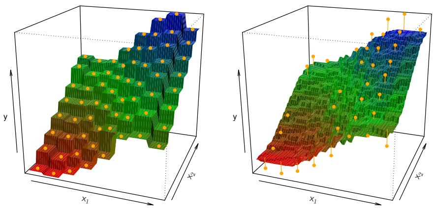  
FIGURE 3.16. Plots of $\hat{f}(X)$ using KNN regression on a two-dimensional data set with 64 observations (orange dots). Left: K = 1 results in a rough step function fit. Right: K = 9 produces a much smoother fit.

In contrast, larger values of K provide a smoother and less variable fit; the prediction in a region is an average of several points, and so changing one observation has a smaller effect. However, the smoothing may cause bias by masking some of the structure in $f(X)$ . In Chapter 5, we introduce several approaches for estimating test error rates. These methods can be used to identify the optimal value of K in KNN regression.

In what setting will a parametric approach such as least squares linear regression outperform a non-parametric approach such as KNN regression? The answer is simple: the parametric approach will outperform the non-parametric approach if the parametric form that has been selected is close to the true form of f. Figure 3.17 provides an example with data generated from a one-dimensional linear regression model. The black solid lines represent $f(X)$ , while the blue curves correspond to the KNN fits using K = 1 and K = 9. In this case, the K = 1 predictions are far too variable, while the smoother K = 9 fit is much closer to $f(X)$ . However, since the true relationship is linear, it is hard for a non-parametric approach to compete with linear regression: a non-parametric approach incurs a cost in variance that is not offset by a reduction in bias. The blue dashed line in the left-hand panel of Figure 3.18 represents the linear regression fit to the same data. It is almost perfect. The right-hand panel of Figure 3.18 reveals that linear regression outperforms KNN for this data. The green solid line, plotted as a function of 1/K, represents the test set mean squared error (MSE) for KNN. The KNN errors are well above the black dashed line, which is the test MSE for linear regression. When the value of K is large, then KNN performs only a little worse than least squares regression in terms of MSE. It performs far worse when K is small.

In practice, the true relationship between $X$ and $Y$ is rarely exactly linear. Figure 3.19 examines the relative performances of least squares regression and KNN under increasing levels of non-linearity in the relationship between $X$ and $Y$ . In the top row, the true relationship is nearly linear. In this case we see that the test MSE for linear regression is still superior

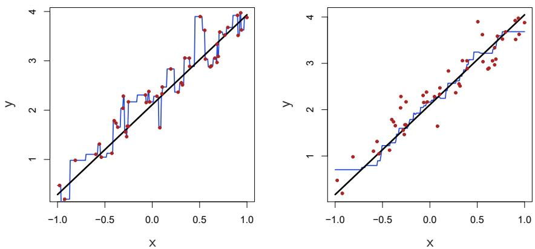  
FIGURE 3.17. Plots of $\hat{f}(X)$ using KNN regression on a one-dimensional data set with 50 observations. The true relationship is given by the black solid line. Left: The blue curve corresponds to K = 1 and interpolates (i.e. passes directly through) the training data. Right: The blue curve corresponds to K = 9, and represents a smoother fit.

  
FIGURE 3.18. The same data set shown in Figure 3.17 is investigated further. Left: The blue dashed line is the least squares fit to the data. Since $f(X)$ is in fact linear (displayed as the black line), the least squares regression line provides a very good estimate of $f(X)$ . Right: The dashed horizontal line represents the least squares test set MSE, while the green solid line corresponds to the MSE for KNN as a function of 1/K (on the log scale). Linear regression achieves a lower test MSE than does KNN regression, since $f(X)$ is in fact linear. For KNN regression, the best results occur with a very large value of K, corresponding to a small value of 1/K.

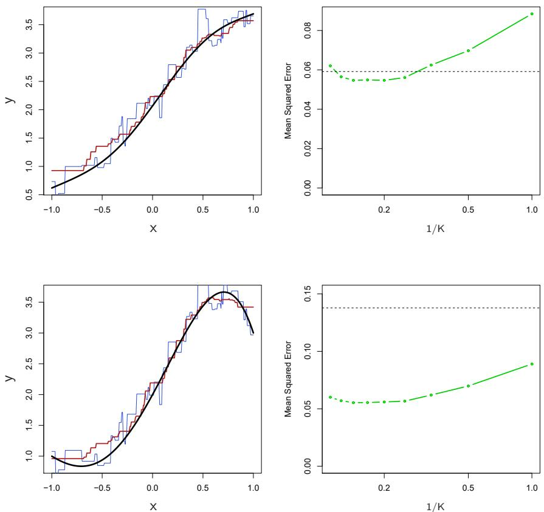  
FIGURE 3.19. Top Left: In a setting with a slightly non-linear relationship between X and Y (solid black line), the KNN fits with K = 1 (blue) and K = 9 (red) are displayed. Top Right: For the slightly non-linear data, the test set MSE for least squares regression (horizontal black) and KNN with various values of 1/K (green) are displayed. Bottom Left and Bottom Right: As in the top panel, but with a strongly non-linear relationship between X and Y.

to that of KNN for low values of K. However, for $K \geq 4$ , KNN outperforms linear regression. The second row illustrates a more substantial deviation from linearity. In this situation, KNN substantially outperforms linear regression for all values of K. Note that as the extent of non-linearity increases, there is little change in the test set MSE for the non-parametric KNN method, but there is a large increase in the test set MSE of linear regression.

Figures 3.18 and 3.19 display situations in which KNN performs slightly worse than linear regression when the relationship is linear, but much better than linear regression for nonlinear situations. In a real life situation in which the true relationship is unknown, one might suspect that KNN should be favored over linear regression because it will at worst be slightly inferior to linear regression if the true relationship is linear, and may give substantially better results if the true relationship is non-linear. But in reality, even when the true relationship is highly non-linear, KNN may still provide inferior results to linear regression. In particular, both Figures 3.18

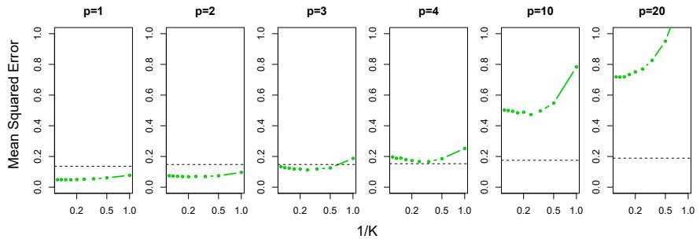

<details>
<summary>line</summary>

| 1/K | p=1 | p=2 | p=3 | p=4 | p=10 | p=20 |
| --- | --- | --- | --- | --- | --- | --- |
| 0.1 | ~0.05 | ~0.08 | ~0.14 | ~0.20 | ~0.50 | ~0.72 |
| 0.2 | ~0.05 | ~0.08 | ~0.13 | ~0.19 | ~0.49 | ~0.73 |
| 0.3 | ~0.06 | ~0.08 | ~0.12 | ~0.18 | ~0.48 | ~0.75 |
| 0.4 | ~0.06 | ~0.08 | ~0.12 | ~0.17 | ~0.47 | ~0.78 |
| 0.5 | ~0.07 | ~0.09 | ~0.13 | ~0.18 | ~0.50 | ~0.83 |
| 1.0 | ~0.09 | ~0.10 | ~0.19 | ~0.25 | ~0.78 | ~0.95 |
</details>

FIGURE 3.20. Test MSE for linear regression (black dashed lines) and KNN (green curves) as the number of variables p increases. The true function is nonlinear in the first variable, as in the lower panel in Figure 3.19, and does not depend on the additional variables. The performance of linear regression deteriorates slowly in the presence of these additional noise variables, whereas KNN's performance degrades much more quickly as p increases.

and 3.19 illustrate settings with p = 1 predictor. But in higher dimensions, KNN often performs worse than linear regression.

Figure 3.20 considers the same strongly non-linear situation as in the second row of Figure 3.19, except that we have added additional noise predictors that are not associated with the response. When p = 1 or p = 2, KNN outperforms linear regression. But for p = 3 the results are mixed, and for $p \geq 4$ linear regression is superior to KNN. In fact, the increase in dimension has only caused a small deterioration in the linear regression test set MSE, but it has caused more than a ten-fold increase in the MSE for KNN. This decrease in performance as the dimension increases is a common problem for KNN, and results from the fact that in higher dimensions there is effectively a reduction in sample size. In this data set there are 50 training observations; when p = 1, this provides enough information to accurately estimate $f(X)$ . However, spreading 50 observations over p = 20 dimensions results in a phenomenon in which a given observation has no nearby neighbors—this is the so-called curse of dimensionality. That is, the K observations that are nearest to a given test observation $x_{0}$ may be very far away from $x_{0}$ in p-dimensional space when p is large, leading to a very poor prediction of $f(x_{0})$ and hence a poor KNN fit. As a general rule, parametric methods will tend to outperform non-parametric approaches when there is a small number of observations per predictor.

Even when the dimension is small, we might prefer linear regression to KNN from an interpretability standpoint. If the test MSE of KNN is only slightly lower than that of linear regression, we might be willing to forego a little bit of prediction accuracy for the sake of a simple model that can be described in terms of just a few coefficients, and for which p-values are available.

curse of di-
mensionality

# 3.6 Lab: Linear Regression

# 3.6.1 Importing packages

We import our standard libraries at this top level.

In [1]:

```python
import numpy as np
import pandas as pd
from matplotlib.pyplot import subplots
```

# New imports

Throughout this lab we will introduce new functions and libraries. However, we will import them here to emphasize these are the new code objects in this lab. Keeping imports near the top of a notebook makes the code more readable, since scanning the first few lines tells us what libraries are used.

In [2]:

```python
import statsmodels.api as sm
```

We will provide relevant details about the functions below as they are needed.

Besides importing whole modules, it is also possible to import only a few items from a given module. This will help keep the namespace clean. We will use a few specific objects from the statsmodels package which we import here.

namespace
statsmodels

In [3]:

```python
from statsmodels.stats.outliers_influence \
    import variance_inflation_factor as VIF
from statsmodels.stats.anova import anova_lm
```

As one of the import statements above is quite a long line, we inserted a line break \ to ease readability.

We will also use some functions written for the labs in this book in the ISLP package.

In [4]:

```python
from ISLP import load_data
from ISLP.models import (ModelSpec as MS,
                           summarize,
                           poly)
```

# Inspecting Objects and Namespaces

The function dir() provides a list of objects in a namespace.

dir()

In [5]:

```txt
dir()
```

```python
Out[5]: ['In',
        'MS',
        '_',
        '--',
        '---',
        '__builtin__',
        '__builtins__',
        ...
```

```txt
'poly',
'quit',
'sm',
'summarize']
```

This shows you everything that Python can find at the top level. There are certain objects like \_\_builtin\_\_ that contain references to built-in functions like print().

Every python object has its own notion of namespace, also accessible with dir(). This will include both the attributes of the object as well as any methods associated with it. For instance, we see 'sum' in the listing for an array.

```txt
In [6]: A = np.array([3,5,11])
dir(A)
```

```python
Out[6]: ...
    'strides',
    'sum',
    'swapaxes',
    ...
```

This indicates that the object A.sum exists. In this case it is a method that can be used to compute the sum of the array A as can be seen by typing A.sum?.

```txt
In [7]: A.sum()
```

```txt
Out [7]: 19
```

# 3.6.2 Simple Linear Regression

In this section we will construct model matrices (also called design matrices) using the ModelSpec() transform from ISLP.models.

We will use the Boston housing data set, which is contained in the ISLP package. The Boston dataset records medv (median house value) for 506 neighborhoods around Boston. We will build a regression model to predict medv using 13 predictors such as rmvar (average number of rooms per house), age (proportion of owner-occupied units built prior to 1940), and lstat (percent of households with low socioeconomic status). We will use statsmodels for this task, a Python package that implements several commonly used regression methods.

We have included a simple loading function load\_data() in the ISLP package:

```txt
Boston = load_data("Boston")
Boston.columns
```

```python
Out[8]: Index(['crim', 'zn', 'indus', 'chas', 'nox', 'rm', 'age', 'dis',
        'rad', 'tax', 'ptratio', 'black', 'lstat', 'medv'],
        dtype='object')
```

Type Boston? to find out more about these data.

We start by using the sm.OLS() function to fit a simple linear regression model. Our response will be medv and lstat will be the single predictor. For this model, we can create the model matrix by hand.

```python
In [9]: X = pd.DataFrame({'intercept': np.ones(Boston.shape[0]),
                          'lstat': Boston['lstat']})
X[:4]
```

```txt
Out[9]:     intercept  lstat
    0         1.0  4.98
    1         1.0  9.14
    2         1.0  4.03
    3         1.0  2.94
```

We extract the response, and fit the model.

```python
In [10]: y = Boston['medv']
model = sm.OLS(y, X)
results = model.fit()
```

Note that sm.OLS() does not fit the model; it specifies the model, and then model.fit() does the actual fitting.

Our ISLP function summarize() produces a simple table of the parameter estimates, their standard errors, t-statistics and p-values. The function takes a single argument, such as the object results returned here by the fit method, and returns such a summary.

summarize()

```txt
In [11]: summarize(results)
```

```txt
Out[11]:
            coef std err      t P>|t|
    intercept 34.5538    0.563 61.415    0.0
    lstat   -0.9500    0.039 -24.528    0.0
```

Before we describe other methods for working with fitted models, we outline a more useful and general framework for constructing a model matrix X.

# Using Transformations: Fit and Transform

Our model above has a single predictor, and constructing X was straightforward. In practice we often fit models with more than one predictor, typically selected from an array or data frame. We may wish to introduce transformations to the variables before fitting the model, specify interactions between variables, and expand some particular variables into sets of variables (e.g. polynomials). The sklearn package has a particular notion for this type of task: a transform. A transform is an object that is created with some parameters as arguments. The object has two main methods: fit() and transform().

We provide a general approach for specifying models and constructing the model matrix through the transform ModelSpec() in the ISLP library. ModelSpec() (renamed MS() in the preamble) creates a transform object, and then a pair of methods transform() and fit() are used to construct a corresponding model matrix.

sklearn

```cmake
.fit()
.transform()
ModelSpec()
```

We first describe this process for our simple regression model using a single predictor lstat in the Boston data frame, but will use it repeatedly in more complex tasks in this and other labs in this book. In our case the transform is created by the expression design = MS(['lstat']).

The fit() method takes the original array and may do some initial computations on it, as specified in the transform object. For example, it may compute means and standard deviations for centering and scaling. The transform() method applies the fitted transformation to the array of data, and produces the model matrix.

```python
In [12]: design = MS(['lstat'])
design = design.fit(Boston)
X = design.transform(Boston)
X[:4]
```

```python
Out[12]:         intercept  lstat
         0         1.0   4.98
         1         1.0   9.14
         2         1.0   4.03
         3         1.0   2.94
```

In this simple case, the fit() method does very little; it simply checks that the variable 'lstat' specified in design exists in Boston. Then transform() constructs the model matrix with two columns: an intercept and the variable lstat.

These two operations can be combined with the fit\_transform() method.

```python
In [13]: design = MS(['lstat'])
    X = design.fit_transform(Boston)
    X[:4]
```

```txt
.fit_
transform()
```

```python
Out[13]:         intercept  lstat
         0         1.0   4.98
         1         1.0   9.14
         2         1.0   4.03
         3         1.0   2.94
```

Note that, as in the previous code chunk when the two steps were done separately, the design object is changed as a result of the fit() operation. The power of this pipeline will become clearer when we fit more complex models that involve interactions and transformations.

Let's return to our fitted regression model. The object results has several methods that can be used for inference. We already presented a function summarize() for showing the essentials of the fit. For a full and somewhat exhaustive summary of the fit, we can use the summary() method (output not shown).

```javascript
In [14]: results.summary()
```

The fitted coefficients can also be retrieved as the params attribute of results.

```txt
In [15]: results.params
```
```python
Out[15]: intercept      34.553841
    lstat         -0.950049
    dtype: float64
```

The get\_prediction() method can be used to obtain predictions, and produce confidence intervals and prediction intervals for the prediction of medv for given values of lstat.

.get\_
prediction()

We first create a new data frame, in this case containing only the variable lstat, with the values for this variable at which we wish to make predictions. We then use the transform() method of design to create the corresponding model matrix.

```python
new_df = pd.DataFrame({'lstat':[5, 10, 15]})
newX = design.transform(new_df)
newX
```

```txt
Out[16]:   intercept    lstat
         0       1.0       5
         1       1.0       10
         2       1.0       15
```

Next we compute the predictions at newX, and view them by extracting the predicted\_mean attribute.

```txt
In [17]: new_predictions = results.get_prediction(newX);
new_predictions.predicted_mean
```

Out[17]: array([29.80359411, 25.05334734, 20.30310057])

We can produce confidence intervals for the predicted values.

```txt
In [18]: new_predictions.conf_int(alpha=0.05)
```

```txt
Out[18]: array([[29.00741194, 30.59977628],
                  [24.47413202, 25.63256267],
                  [19.73158815, 20.87461299]])
```

Prediction intervals are computing by setting obs=True:

```txt
In [19]: new_predictions.conf_int(obs=True, alpha=0.05)
```

```txt
Out[19]: array([[17.56567478, 42.04151344],
       [12.82762635, 37.27906833],
       [ 8.0777421 , 32.52845905]])
```

For instance, the 95% confidence interval associated with an lstat value of 10 is (24.47, 25.63), and the 95% prediction interval is (12.82, 37.28). As expected, the confidence and prediction intervals are centered around the same point (a predicted value of 25.05 for medv when lstat equals 10), but the latter are substantially wider.

Next we will plot medv and lstat using DataFrame.plot.scatter(), and wish to add the regression line to the resulting plot.

.plot.
scatter()

# Defining Functions

While there is a function within the ISLP package that adds a line to an existing plot, we take this opportunity to define our first function to do so.

def

```python
def abline(ax, b, m):
    "Add a line with slope m and intercept b to ax"
    xlim = ax.get_xlim()
    ylim = [m * xlim[0] + b, m * xlim[1] + b]
    ax.plot(xlim, ylim)
```

A few things are illustrated above. First we see the syntax for defining a function: def funcname(...). The function has arguments ax, b, m where ax is an axis object for an existing plot, b is the intercept and m is the slope of the desired line. Other plotting options can be passed on to ax.plot by including additional optional arguments as follows:

```python
def abline(ax, b, m, *args, **kwargs):
    "Add a line with slope m and intercept b to ax"
    xlim = ax.get_xlim()
    ylim = [m * xlim[0] + b, m * xlim[1] + b]
    ax.plot(xlim, ylim, *args, **kwargs)
```

The addition of \*args allows any number of non-named arguments to abline, while \*kwargs allows any number of named arguments (such as linewidth=3) to abline. In our function, we pass these arguments verbatim to ax.plot above. Readers interested in learning more about functions are referred to the section on defining functions in docs.python.org/tutorial.

Let's use our new function to add this regression line to a plot of medv vs. lstat.

```python
In [22]: ax = Boston.plot.scatter('lstat', 'medv')
    abline(ax,
        results.params[0],
        results.params[1],
        'r--',
        linewidth=3)
```

Thus, the final call to ax.plot() is ax.plot(xlim, ylim, 'r--', linewidth=3). We have used the argument 'r--' to produce a red dashed line, and added an argument to make it of width 3. There is some evidence for non-linearity in the relationship between lstat and medv. We will explore this issue later in this lab.

As mentioned above, there is an existing function to add a line to a plot — ax.axline() — but knowing how to write such functions empowers us to create more expressive displays.

Next we examine some diagnostic plots, several of which were discussed in Section 3.3.3. We can find the fitted values and residuals of the fit as attributes of the results object. Various influence measures describing the regression model are computed with the get\_influence() method. As we will not use the fig component returned as the first value from subplots(), we simply capture the second returned value in ax below.

.get\_
influence()

```txt
In [23]: ax = subplots(figsize=(8,8))[1]
```

```txt
ax.scatter(results.fittedvalues, results.resid)
ax.set_xlabel('Fitted value')
ax.set_ylabel('Residual')
ax.axhline(0, c='k', ls='--');
```

We add a horizontal line at 0 for reference using the ax.axhline() method, indicating it should be black (c='k') and have a dashed linestyle (ls='--').

.axhline()

On the basis of the residual plot (not shown), there is some evidence of non-linearity. Leverage statistics can be computed for any number of predictors using the hat\_matrix\_diag attribute of the value returned by the get\_influence() method.

```python
In [24]: infl = results.get_influence()
    ax = subplots(figsize=(8,8))[1]
    ax.scatter(np.arange(X.shape[0]), infl.hat_matrix_diag)
    ax.set_xlabel('Index')
    ax.set_ylabel('Leverage')
    np.argmax(infl.hat_matrix_diag)
```

Out [24]: 374

The np.argmax() function identifies the index of the largest element of an array, optionally computed over an axis of the array. In this case, we maximized over the entire array to determine which observation has the largest leverage statistic.

# 3.6.3 Multiple Linear Regression

In order to fit a multiple linear regression model using least squares, we again use the ModelSpec() transform to construct the required model matrix and response. The arguments to ModelSpec() can be quite general, but in this case a list of column names suffice. We consider a fit here with the two variables lstat and age.

```python
In [25]: X = MS(['lstat', 'age']).fit_transform(Boston)
model1 = sm.OLS(y, X)
results1 = model1.fit()
summarize(results1)
```

```txt
Out[25]:
           coef   std err     t  P>|t|
    intercept  33.2228     0.731  45.458  0.000
    lstat  -1.0321     0.048  -21.416  0.000
    age   0.0345     0.012  2.826  0.005
```

Notice how we have compacted the first line into a succinct expression describing the construction of x.

The Boston data set contains 12 variables, and so it would be cumbersome to have to type all of these in order to perform a regression using all of the predictors. Instead, we can use the following short-hand:

```javascript
In [26]: terms = Boston.columns.drop('medv')
terms
```

.columns.
drop()

```python
Out[26]: Index(['crim', 'zn', 'indus', 'chas', 'nox', 'rm', 'age', 'dis',
        'rad', 'tax', 'ptratio', 'lstat'],
        dtype='object')
```

We can now fit the model with all the variables in terms using the same model matrix builder.

```txt
In [27]: X = MS(terms).fit_transform(Boston)
model = sm.OLS(y, X)
results = model.fit()
summarize(results)
```

```txt
Out[27]:                 coef   std err      t    P>|t|
    intercept  41.6173      4.936  8.431  0.000
    crim    -0.1214      0.033  -3.678  0.000
    zn      0.0470      0.014  3.384  0.001
    indus    0.0135      0.062  0.217  0.829
    chas    2.8400      0.870  3.264  0.001
    nox    -18.7580      3.851  -4.870  0.000
    rm      3.6581      0.420  8.705  0.000
    age    0.0036      0.013  0.271  0.787
    dis    -1.4908      0.202  -7.394  0.000
    rad      0.2894      0.067  4.325  0.000
    tax    -0.0127      0.004  -3.337  0.001
    ptratio  -0.9375      0.132  -7.091  0.000
    lstat    -0.5520      0.051  -10.897  0.000
```

What if we would like to perform a regression using all of the variables but one? For example, in the above regression output, age has a high p-value. So we may wish to run a regression excluding this predictor. The following syntax results in a regression using all predictors except age (output not shown).

```python
In [28]: minus_age = Boston.columns.drop(['medv', 'age'])
Xma = MS(minus_age).fit_transform(Boston)
model1 = sm.OLS(y, Xma)
summarize(model1.fit())
```

# 3.6.4 Multivariate Goodness of Fit

We can access the individual components of results by name (dir(results) shows us what is available). Hence results.rsquared gives us the $R^{2}$ , and np.sqrt(results.scale) gives us the RSE.

Variance inflation factors (section 3.3.3) are sometimes useful to assess the effect of collinearity in the model matrix of a regression model. We will compute the VIFs in our multiple regression fit, and use the opportunity to introduce the idea of list comprehension.

list comprehension

# List Comprehension

Often we encounter a sequence of objects which we would like to transform for some other task. Below, we compute the VIF for each feature in our x matrix and produce a data frame whose index agrees with the columns of x. The notion of list comprehension can often make such a task easier.

List comprehensions are simple and powerful ways to form lists of Python objects. The language also supports dictionary and generator comprehension, though these are beyond our scope here. Let's look at an example. We compute the VIF for each of the variables in the model matrix X, using the function variance\_inflation\_factor().

In [29]:

```python
vals = [VIF(X, i)
        for i in range(1, X.shape[1])]
vif = pd.DataFrame({'vif':vals},
                   index=X.columns[1:])
vif
```

```txt
variance_inflation_factor()
```

Out [29]:

```csv
vif
crim 1.767
zn 2.298
indus 3.987
chas 1.071
nox 4.369
rm 1.913
age 3.088
dis 3.954
rad 7.445
tax 9.002
ptratio 1.797
lstat 2.871
```

The function VIF() takes two arguments: a dataframe or array, and a variable column index. In the code above we call VIF() on the fly for all columns in x. We have excluded column 0 above (the intercept), which is not of interest. In this case the VIFs are not that exciting.

The object vals above could have been constructed with the following for loop:

In [30]:

```python
vals = []
for i in range(1, X.values.shape[1]):
    vals.append(VIF(X.values, i))
```

List comprehension allows us to perform such repetitive operations in a more straightforward way.

# 3.6.5 Interaction Terms

It is easy to include interaction terms in a linear model using ModelSpec(). Including a tuple ("lstat", "age") tells the model matrix builder to include an interaction term between lstat and age.

In [31]:

```python
X = MS(['lstat',
        'age',
        ('lstat', 'age')]).fit_transform(Boston)
model2 = sm.OLS(y, X)
summarize(model2.fit())
```

Out [31]:

```txt
coef   std err      t    P>|t|
intercept 36.0885     1.470  24.553  0.000
lstat  -1.3921     0.167  -8.313  0.000
```

```txt
age    -0.0007      0.020   -0.036   0.971
lstat:age    0.0042      0.002   2.244   0.025
```

# 3.6.6 Non-linear Transformations of the Predictors

The model matrix builder can include terms beyond just column names and interactions. For instance, the poly() function supplied in ISLP specifies that columns representing polynomial functions of its first argument are added to the model matrix.

```python
In [32]: X = MS([poly('lstat', degree=2), 'age']).fit_transform(Boston)
model3 = sm.OLS(y, X)
results3 = model3.fit()
summarize(results3)
```

```python
Out[32]:
            coef     std err     t      P>|t|
        intercept  17.7151     0.781  22.681     0.000
    poly(lstat, degree=2)[0] -179.2279     6.733 -26.620     0.000
    poly(lstat, degree=2)[1]  72.9908     5.482 13.315     0.000
        age    0.0703     0.011 6.471     0.000
```

The effectively zero p-value associated with the quadratic term (i.e. the third row above) suggests that it leads to an improved model.

By default, poly() creates a basis matrix for inclusion in the model matrix whose columns are orthogonal polynomials, which are designed for stable least squares computations. $^{13}$ Alternatively, had we included an argument raw=True in the above call to poly(), the basis matrix would consist simply of lstat and lstat\*\*2. Since either of these bases represent quadratic polynomials, the fitted values would not change in this case, just the polynomial coefficients. Also by default, the columns created by poly() do not include an intercept column as that is automatically added by MS().

We use the anova\_lm() function to further quantify the extent to which the quadratic fit is superior to the linear fit.

orthogonal polynomial

anova\_lm()

```txt
In [33]: anova_lm(results1, results3)
```

```python
Out[33]:        df_resid        ssr        df_diff      ss_diff        F       Pr(>F)
        0       503.0   19168.13       0.0       NaN       NaN       NaN
        1       502.0   14165.61       1.0   5002.52   177.28   7.47e-35
```

Here results1 represents the linear submodel containing predictors lstat and age, while results3 corresponds to the larger model above with a quadratic term in lstat. The anova\_lm() function performs a hypothesis test comparing the two models. The null hypothesis is that the quadratic term in the bigger model is not needed, and the alternative hypothesis is that the bigger model is superior. Here the $F$ -statistic is 177.28 and the associated $p$ -value is zero. In this case the $F$ -statistic is the square of the $t$ -statistic for the quadratic term in the linear model summary for results3 — a consequence of the fact that these nested models differ by one degree of

freedom. This provides very clear evidence that the quadratic polynomial in lstat improves the linear model. This is not surprising, since earlier we saw evidence for non-linearity in the relationship between medv and lstat.

The function anova\_lm() can take more than two nested models as input, in which case it compares every successive pair of models. That also explains why their are NaNs in the first row above, since there is no previous model with which to compare the first.

```txt
In [34]: ax = subplots(figsize=(8,8))[1]
ax.scatter(results3.fittedvalues, results3.resid)
ax.set_xlabel('Fitted value')
ax.set_ylabel('Residual')
ax.axhline(0, c='k', ls='--')
```

We see that when the quadratic term is included in the model, there is little discernible pattern in the residuals. In order to create a cubic or higher-degree polynomial fit, we can simply change the degree argument to poly().

# 3.6.7 Qualitative Predictors

Here we use the Carseats data, which is included in the ISLP package. We will attempt to predict Sales (child car seat sales) in 400 locations based on a number of predictors.

```python
In [35]: Carseats = load_data('Carseats')
Carseats.columns
```

```python
Out[35]: Index(['Sales', 'CompPrice', 'Income', 'Advertising',
        'Population', 'Price', 'ShelveLoc', 'Age', 'Education',
        'Urban', 'US'],
        dtype='object')
```

The Carseats data includes qualitative predictors such as ShelveLoc, an indicator of the quality of the shelving location — that is, the space within a store in which the car seat is displayed. The predictor ShelveLoc takes on three possible values, Bad, Medium, and Good. Given a qualitative variable such as ShelveLoc, ModelSpec() generates dummy variables automatically. These variables are often referred to as a one-hot encoding of the categorical feature. Their columns sum to one, so to avoid collinearity with an intercept, the first column is dropped. Below we see the column ShelveLoc[Bad] has been dropped, since Bad is the first level of ShelveLoc. Below we fit a multiple regression model that includes some interaction terms.

```python
In [36]: allvars = list(Carseats.columns.drop('Sales'))
y = Carseats['Sales']
final = allvars + [('Income', 'Advertising'),
            ('Price', 'Age')]
X = MS(final).fit_transform(Carseats)
model = sm.OLS(y, X)
summarize(model.fit())
```

one-hot
encoding

```python
Out[36]:
                    coef std err      t      P>|t|
    intercept     6.5756    1.009    6.519    0.000
```

<table><tr><td>CompPrice</td><td>0.0929</td><td>0.004</td><td>22.567</td><td>0.000</td></tr><tr><td>Income</td><td>0.0109</td><td>0.003</td><td>4.183</td><td>0.000</td></tr><tr><td>Advertising</td><td>0.0702</td><td>0.023</td><td>3.107</td><td>0.002</td></tr><tr><td>Population</td><td>0.0002</td><td>0.000</td><td>0.433</td><td>0.665</td></tr><tr><td>Price</td><td>-0.1008</td><td>0.007</td><td>-13.549</td><td>0.000</td></tr><tr><td>ShelveLoc[Good]</td><td>4.8487</td><td>0.153</td><td>31.724</td><td>0.000</td></tr><tr><td>ShelveLoc[Medium]</td><td>1.9533</td><td>0.126</td><td>15.531</td><td>0.000</td></tr><tr><td>Age</td><td>-0.0579</td><td>0.016</td><td>-3.633</td><td>0.000</td></tr><tr><td>Education</td><td>-0.0209</td><td>0.020</td><td>-1.063</td><td>0.288</td></tr><tr><td>Urban[Yes]</td><td>0.1402</td><td>0.112</td><td>1.247</td><td>0.213</td></tr><tr><td>US[Yes]</td><td>-0.1576</td><td>0.149</td><td>-1.058</td><td>0.291</td></tr><tr><td>Income:Advertising</td><td>0.0008</td><td>0.000</td><td>2.698</td><td>0.007</td></tr><tr><td>Price:Age</td><td>0.0001</td><td>0.000</td><td>0.801</td><td>0.424</td></tr></table>

In the first line above, we made allvars a list, so that we could add the interaction terms two lines down. Our model-matrix builder has created a ShelveLoc[Good] dummy variable that takes on a value of 1 if the shelving location is good, and 0 otherwise. It has also created a ShelveLoc[Medium] dummy variable that equals 1 if the shelving location is medium, and 0 otherwise. A bad shelving location corresponds to a zero for each of the two dummy variables. The fact that the coefficient for ShelveLoc[Good] in the regression output is positive indicates that a good shelving location is associated with high sales (relative to a bad location). And ShelveLoc[Medium] has a smaller positive coefficient, indicating that a medium shelving location leads to higher sales than a bad shelving location, but lower sales than a good shelving location.

# 3.7 Exercises

# Conceptual

1. Describe the null hypotheses to which the p-values given in Table 3.4 correspond. Explain what conclusions you can draw based on these p-values. Your explanation should be phrased in terms of sales, TV, radio, and newspaper, rather than in terms of the coefficients of the linear model.  
2. Carefully explain the differences between the KNN classifier and KNN regression methods.  
3. Suppose we have a data set with five predictors, $X_{1} = \mathrm{GPA}$ , $X_{2} = \mathrm{IQ}$ , $X_{3} = \mathrm{Level}$ (1 for College and 0 for High School), $X_{4} = \mathrm{Interaction}$ between GPA and IQ, and $X_{5} = \mathrm{Interaction}$ between GPA and Level. The response is starting salary after graduation (in thousands of dollars). Suppose we use least squares to fit the model, and get $\hat{\beta}_0 = 50$ , $\hat{\beta}_1 = 20$ , $\hat{\beta}_2 = 0.07$ , $\hat{\beta}_3 = 35$ , $\hat{\beta}_4 = 0.01$ , $\hat{\beta}_5 = -10$ .

(a) Which answer is correct, and why?

i. For a fixed value of IQ and GPA, high school graduates earn more, on average, than college graduates.  
ii. For a fixed value of IQ and GPA, college graduates earn more, on average, than high school graduates.

iii. For a fixed value of IQ and GPA, high school graduates earn more, on average, than college graduates provided that the GPA is high enough.

iv. For a fixed value of IQ and GPA, college graduates earn more, on average, than high school graduates provided that the GPA is high enough.

(b) Predict the salary of a college graduate with IQ of 110 and a GPA of 4.0.  
(c) True or false: Since the coefficient for the GPA/IQ interaction term is very small, there is very little evidence of an interaction effect. Justify your answer.

4. I collect a set of data ( $n = 100$ observations) containing a single predictor and a quantitative response. I then fit a linear regression model to the data, as well as a separate cubic regression, i.e. $Y = \beta_0 + \beta_1 X + \beta_2 X^2 + \beta_3 X^3 + \epsilon$ .

(a) Suppose that the true relationship between X and Y is linear, i.e. $Y = \beta_0 + \beta_1 X + \epsilon$ . Consider the training residual sum of squares (RSS) for the linear regression, and also the training RSS for the cubic regression. Would we expect one to be lower than the other, would we expect them to be the same, or is there not enough information to tell? Justify your answer.

(b) Answer (a) using test rather than training RSS.

(c) Suppose that the true relationship between X and Y is not linear, but we don't know how far it is from linear. Consider the training RSS for the linear regression, and also the training RSS for the cubic regression. Would we expect one to be lower than the other, would we expect them to be the same, or is there not enough information to tell? Justify your answer.

(d) Answer (c) using test rather than training RSS.

5. Consider the fitted values that result from performing linear regression without an intercept. In this setting, the $i$ th fitted value takes the form

$$
\hat {y} _ {i} = x _ {i} \hat {\beta},
$$

where

$$
\hat {\beta} = \left(\sum_ {i = 1} ^ {n} x _ {i} y _ {i}\right) / \left(\sum_ {i ^ {\prime} = 1} ^ {n} x _ {i ^ {\prime}} ^ {2}\right). \tag {3.38}
$$

Show that we can write

$$
\hat {y} _ {i} = \sum_ {i ^ {\prime} = 1} ^ {n} a _ {i ^ {\prime}} y _ {i ^ {\prime}}.
$$

What is $a_{i'}$ ?

Note: We interpret this result by saying that the fitted values from linear regression are linear combinations of the response values.

6. Using (3.4), argue that in the case of simple linear regression, the least squares line always passes through the point $(\bar{x},\bar{y})$ .

7. It is claimed in the text that in the case of simple linear regression of $Y$ onto $X$ , the $R^2$ statistic (3.17) is equal to the square of the correlation between $X$ and $Y$ (3.18). Prove that this is the case. For simplicity, you may assume that $\bar{x} = \bar{y} = 0$ .


# Applied

8. This question involves the use of simple linear regression on the Auto data set.

(a) Use the sm.OLS() function to perform a simple linear regression with mpg as the response and horsepower as the predictor. Use the summarize() function to print the results. Comment on the output. For example:  
i. Is there a relationship between the predictor and the response?  
ii. How strong is the relationship between the predictor and the response?  
iii. Is the relationship between the predictor and the response positive or negative?  
iv. What is the predicted mpg associated with a horsepower of 98? What are the associated $95\%$ confidence and prediction intervals?

(b) Plot the response and the predictor in a new set of axes ax. Use the ax.axline() method or the abline() function defined in the lab to display the least squares regression line.

(c) Produce some of diagnostic plots of the least squares regression fit as described in the lab. Comment on any problems you see with the fit.

9. This question involves the use of multiple linear regression on the Auto data set.

(a) Produce a scatterplot matrix which includes all of the variables in the data set.

(b) Compute the matrix of correlations between the variables using the DataFrame.corr() method.

(c) Use the sm.OLS() function to perform a multiple linear regression with mpg as the response and all other variables except name as the predictors. Use the summarize() function to print the results. Comment on the output. For instance:

i. Is there a relationship between the predictors and the response? Use the anova\_lm() function from statsmodels to answer this question.

.corr()

ii. Which predictors appear to have a statistically significant relationship to the response?

iii. What does the coefficient for the year variable suggest?

(d) Produce some of diagnostic plots of the linear regression fit as described in the lab. Comment on any problems you see with the fit. Do the residual plots suggest any unusually large outliers? Does the leverage plot identify any observations with unusually high leverage?  
(e) Fit some models with interactions as described in the lab. Do any interactions appear to be statistically significant?  
(f) Try a few different transformations of the variables, such as $\log (X),\sqrt{X},X^2$ . Comment on your findings.

10. This question should be answered using the Carseats data set.

(a) Fit a multiple regression model to predict Sales using Price, Urban, and US.  
(b) Provide an interpretation of each coefficient in the model. Be careful—some of the variables in the model are qualitative!  
(c) Write out the model in equation form, being careful to handle the qualitative variables properly.  
(d) For which of the predictors can you reject the null hypothesis $H_0: \beta_j = 0$ ?  
(e) On the basis of your response to the previous question, fit a smaller model that only uses the predictors for which there is evidence of association with the outcome.  
(f) How well do the models in (a) and (e) fit the data?  
(g) Using the model from (e), obtain 95% confidence intervals for the coefficient(s).  
(h) Is there evidence of outliers or high leverage observations in the model from (e)?

11. In this problem we will investigate the t-statistic for the null hypothesis $H_{0} : \beta = 0$ in simple linear regression without an intercept. To begin, we generate a predictor x and a response y as follows.

```python
rng = np.random.default_rng(1)
x = rng.normal(size=100)
y = 2 * x + rng.normal(size=100)
```

(a) Perform a simple linear regression of y onto x, without an intercept. Report the coefficient estimate $\hat{\beta}$ , the standard error of this coefficient estimate, and the t-statistic and p-value associated with the null hypothesis $H_{0} : \beta = 0$ . Comment on these results. (You can perform regression without an intercept using the keywords argument intercept=False to ModelSpec().)

(b) Now perform a simple linear regression of x onto y without an intercept, and report the coefficient estimate, its standard error, and the corresponding t-statistic and p-values associated with the null hypothesis $H_{0} : \beta = 0$ . Comment on these results.

(c) What is the relationship between the results obtained in (a) and (b)?

(d) For the regression of $Y$ onto $X$ without an intercept, the $t$ -statistic for $H_0: \beta = 0$ takes the form $\hat{\beta} / \mathrm{SE}(\hat{\beta})$ , where $\hat{\beta}$ is given by (3.38), and where


$$
\mathrm{SE} (\hat {\beta}) = \sqrt {\frac {\sum_ {i = 1} ^ {n} (y _ {i} - x _ {i} \hat {\beta}) ^ {2}}{(n - 1) \sum_ {i ^ {\prime} = 1} ^ {n} x _ {i ^ {\prime}} ^ {2}}}.
$$

(These formulas are slightly different from those given in Sections 3.1.1 and 3.1.2, since here we are performing regression without an intercept.) Show algebraically, and confirm numerically in $\mathbb{R}$ , that the $t$ -statistic can be written as

$$
\frac {(\sqrt {n - 1}) \sum_ {i = 1} ^ {n} x _ {i} y _ {i}}{\sqrt {(\sum_ {i = 1} ^ {n} x _ {i} ^ {2}) (\sum_ {i ^ {\prime} = 1} ^ {n} y _ {i ^ {\prime}} ^ {2}) - (\sum_ {i ^ {\prime} = 1} ^ {n} x _ {i ^ {\prime}} y _ {i ^ {\prime}}) ^ {2}}}.
$$

(e) Using the results from (d), argue that the $t$ -statistic for the regression of $\mathbf{y}$ onto $\mathbf{x}$ is the same as the $t$ -statistic for the regression of $\mathbf{x}$ onto $\mathbf{y}$ .

(f) In R, show that when regression is performed with an intercept, the t-statistic for $H_{0} : \beta_{1} = 0$ is the same for the regression of y onto x as it is for the regression of x onto y.

12. This problem involves simple linear regression without an intercept.

(a) Recall that the coefficient estimate $\hat{\beta}$ for the linear regression of $Y$ onto $X$ without an intercept is given by (3.38). Under what circumstance is the coefficient estimate for the regression of $X$ onto $Y$ the same as the coefficient estimate for the regression of $Y$ onto $X$ ?  
(b) Generate an example in Python with $n = 100$ observations in which the coefficient estimate for the regression of $X$ onto $Y$ is different from the coefficient estimate for the regression of $Y$ onto $X$ .  
(c) Generate an example in Python with $n = 100$ observations in which the coefficient estimate for the regression of $X$ onto $Y$ is the same as the coefficient estimate for the regression of $Y$ onto $X$ .

13. In this exercise you will create some simulated data and will fit simple linear regression models to it. Make sure to use the default random number generator with seed set to 1 prior to starting part (a) to ensure consistent results.

(a) Using the normal() method of your random number generator, create a vector, x, containing 100 observations drawn from a $N(0,1)$ distribution. This represents a feature, X.  
(b) Using the normal() method, create a vector, eps, containing 100 observations drawn from a $N(0,0.25)$ distribution—a normal distribution with mean zero and variance 0.25.  
(c) Using x and eps, generate a vector y according to the model

$$
Y = - 1 + 0. 5 X + \epsilon . \tag {3.39}
$$

What is the length of the vector y? What are the values of $\beta_{0}$ and $\beta_{1}$ in this linear model?

(d) Create a scatterplot displaying the relationship between x and y. Comment on what you observe.  
(e) Fit a least squares linear model to predict y using x. Comment on the model obtained. How do $\hat{\beta}_{0}$ and $\hat{\beta}_{1}$ compare to $\beta_{0}$ and $\beta_{1}$ ?  
(f) Display the least squares line on the scatterplot obtained in (d). Draw the population regression line on the plot, in a different color. Use the legend() method of the axes to create an appropriate legend.  
(g) Now fit a polynomial regression model that predicts $y$ using $x$ and $x^2$ . Is there evidence that the quadratic term improves the model fit? Explain your answer.  
(h) Repeat (a)-(f) after modifying the data generation process in such a way that there is less noise in the data. The model (3.39) should remain the same. You can do this by decreasing the variance of the normal distribution used to generate the error term $\epsilon$ in (b). Describe your results.  
(i) Repeat (a)-(f) after modifying the data generation process in such a way that there is more noise in the data. The model (3.39) should remain the same. You can do this by increasing the variance of the normal distribution used to generate the error term $\epsilon$ in (b). Describe your results.  
(j) What are the confidence intervals for $\beta_{0}$ and $\beta_{1}$ based on the original data set, the noisier data set, and the less noisy data set? Comment on your results.

14. This problem focuses on the collinearity problem.

(a) Perform the following commands in Python:

```python
rng = np.random.default_rng(10)
x1 = rng.uniform(0, 1, size=100)
x2 = 0.5 * x1 + rng.normal(size=100) / 10
y = 2 + 2 * x1 + 0.3 * x2 + rng.normal(size=100)
```

The last line corresponds to creating a linear model in which y is a function of x1 and x2. Write out the form of the linear model. What are the regression coefficients?

(b) What is the correlation between x1 and x2? Create a scatterplot displaying the relationship between the variables.  
(c) Using this data, fit a least squares regression to predict y using x1 and x2. Describe the results obtained. What are $\hat{\beta}_{0}$ , $\hat{\beta}_{1}$ , and $\hat{\beta}_{2}$ ? How do these relate to the true $\beta_{0}$ , $\beta_{1}$ , and $\beta_{2}$ ? Can you reject the null hypothesis $H_{0} : \beta_{1} = 0$ ? How about the null hypothesis $H_{0} : \beta_{2} = 0$ ?  
(d) Now fit a least squares regression to predict y using only x1. Comment on your results. Can you reject the null hypothesis $H_{0} : \beta_{1} = 0$ ?  
(e) Now fit a least squares regression to predict y using only x2. Comment on your results. Can you reject the null hypothesis $H_{0} : \beta_{1} = 0$ ?  
(f) Do the results obtained in (c)-(e) contradict each other? Explain your answer.  
(g) Suppose we obtain one additional observation, which was unfortunately mismeasured. We use the function np.concatenate() to add this additional observation to each of x1, x2 and y.

```txt
x1 = np.concatenate([x1, [0.1]])
x2 = np.concatenate([x2, [0.8]])
y = np.concatenate([y, [6]])
```

np.conca-
tenate()

Re-fit the linear models from (c) to (e) using this new data. What effect does this new observation have on the each of the models? In each model, is this observation an outlier? A high-leverage point? Both? Explain your answers.

15. This problem involves the Boston data set, which we saw in the lab for this chapter. We will now try to predict per capita crime rate using the other variables in this data set. In other words, per capita crime rate is the response, and the other variables are the predictors.

(a) For each predictor, fit a simple linear regression model to predict the response. Describe your results. In which of the models is there a statistically significant association between the predictor and the response? Create some plots to back up your assertions.  
(b) Fit a multiple regression model to predict the response using all of the predictors. Describe your results. For which predictors can we reject the null hypothesis $H_0: \beta_j = 0$ ?  
(c) How do your results from (a) compare to your results from (b)? Create a plot displaying the univariate regression coefficients from (a) on the $x$ -axis, and the multiple regression coefficients from (b) on the $y$ -axis. That is, each predictor is displayed as a single point in the plot. Its coefficient in a simple linear regression model is shown on the $x$ -axis, and its coefficient estimate in the multiple linear regression model is shown on the $y$ -axis.

(d) Is there evidence of non-linear association between any of the predictors and the response? To answer this question, for each predictor $X$ , fit a model of the form

$$
Y = \beta_ {0} + \beta_ {1} X + \beta_ {2} X ^ {2} + \beta_ {3} X ^ {3} + \epsilon .
$$

