The linear regression model discussed in Chapter 3 assumes that the response variable Y is quantitative. But in many situations, the response variable is instead qualitative. For example, eye color is qualitative. Often qualitative variables are referred to as categorical; we will use these terms interchangeably. In this chapter, we study approaches for predicting qualitative responses, a process that is known as classification. Predicting a qualitative response for an observation can be referred to as classifying that observation, since it involves assigning the observation to a category, or class. On the other hand, often the methods used for classification first predict the probability that the observation belongs to each of the categories of a qualitative variable, as the basis for making the classification. In this sense they also behave like regression methods.

There are many possible classification techniques, or classifiers, that one might use to predict a qualitative response. We touched on some of these in Sections 2.1.5 and 2.2.3. In this chapter we discuss some widely-used classifiers: logistic regression, linear discriminant analysis, quadratic discriminant analysis, naive Bayes, and K-nearest neighbors. The discussion of logistic regression is used as a jumping-off point for a discussion of generalized linear models, and in particular, Poisson regression. We discuss more computer-intensive classification methods in later chapters: these include generalized additive models (Chapter 7); trees, random forests, and boosting (Chapter 8); and support vector machines (Chapter 9).

# 4.1 An Overview of Classification

Classification problems occur often, perhaps even more so than regression problems. Some examples include:

1. A person arrives at the emergency room with a set of symptoms that could possibly be attributed to one of three medical conditions. Which of the three conditions does the individual have?  
2. An online banking service must be able to determine whether or not a transaction being performed on the site is fraudulent, on the basis of the user's IP address, past transaction history, and so forth.  
3. On the basis of DNA sequence data for a number of patients with and without a given disease, a biologist would like to figure out which DNA mutations are deleterious (disease-causing) and which are not.

Just as in the regression setting, in the classification setting we have a set of training observations $(x_{1}, y_{1}), \ldots, (x_{n}, y_{n})$ that we can use to build a classifier. We want our classifier to perform well not only on the training data, but also on test observations that were not used to train the classifier.

In this chapter, we will illustrate the concept of classification using the simulated Default data set. We are interested in predicting whether an individual will default on his or her credit card payment, on the basis of annual income and monthly credit card balance. The data set is displayed in Figure 4.1. In the left-hand panel of Figure 4.1, we have plotted annual income and monthly credit card balance for a subset of 10,000 individuals. The individuals who defaulted in a given month are shown in orange, and those who did not in blue. (The overall default rate is about 3%, so we have plotted only a fraction of the individuals who did not default.) It appears that individuals who defaulted tended to have higher credit card balances than those who did not. In the center and right-hand panels of Figure 4.1, two pairs of boxplots are shown. The first shows the distribution of balance split by the binary default variable; the second is a similar plot for income. In this chapter, we learn how to build a model to predict default (Y) for any given value of balance ( $X_{1}$ ) and income ( $X_{2}$ ). Since Y is not quantitative, the simple linear regression model of Chapter 3 is not a good choice: we will elaborate on this further in Section 4.2.

It is worth noting that Figure 4.1 displays a very pronounced relationship between the predictor balance and the response default. In most real applications, the relationship between the predictor and the response will not be nearly so strong. However, for the sake of illustrating the classification procedures discussed in this chapter, we use an example in which the relationship between the predictor and the response is somewhat exaggerated.

# 4.2 Why Not Linear Regression?

We have stated that linear regression is not appropriate in the case of a qualitative response. Why not?

Suppose that we are trying to predict the medical condition of a patient in the emergency room on the basis of her symptoms. In this simplified example, there are three possible diagnoses: stroke, drug overdose, and

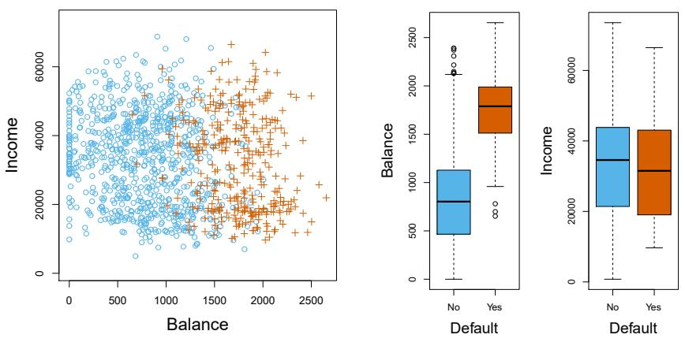  
FIGURE 4.1. The Default data set. Left: The annual incomes and monthly credit card balances of a number of individuals. The individuals who defaulted on their credit card payments are shown in orange, and those who did not are shown in blue. Center: Boxplots of balance as a function of default status. Right: Boxplots of income as a function of default status.

epileptic seizure. We could consider encoding these values as a quantitative response variable, Y, as follows:

$$
Y = \left\{ \begin{array}{l l} 1 & \text {if stroke;} \\ 2 & \text {if drug overdose;} \\ 3 & \text {if epileptic seizure.} \end{array} \right.
$$

Using this coding, least squares could be used to fit a linear regression model to predict Y on the basis of a set of predictors $X_{1},\ldots,X_{p}$ . Unfortunately, this coding implies an ordering on the outcomes, putting drug overdose in between stroke and epileptic seizure, and insisting that the difference between stroke and drug overdose is the same as the difference between drug overdose and epileptic seizure. In practice there is no particular reason that this needs to be the case. For instance, one could choose an equally reasonable coding,

$$
Y = \left\{ \begin{array}{l l} 1 & \text {if epileptic seizure;} \\ 2 & \text {if stroke;} \\ 3 & \text {if drug overdose,} \end{array} \right.
$$

which would imply a totally different relationship among the three conditions. Each of these codings would produce fundamentally different linear models that would ultimately lead to different sets of predictions on test observations.

If the response variable's values did take on a natural ordering, such as mild, moderate, and severe, and we felt the gap between mild and moderate was similar to the gap between moderate and severe, then a 1, 2, 3 coding would be reasonable. Unfortunately, in general there is no natural way to

convert a qualitative response variable with more than two levels into a quantitative response that is ready for linear regression.

For a binary (two level) qualitative response, the situation is better. For instance, perhaps there are only two possibilities for the patient's medical condition: stroke and drug overdose. We could then potentially use the dummy variable approach from Section 3.3.1 to code the response as follows:

binary

$$
Y = \left\{ \begin{array}{l l} 0 & \text {if stroke;} \\ 1 & \text {if drug overdose.} \end{array} \right.
$$

We could then fit a linear regression to this binary response, and predict drug overdose if $\hat{Y} > 0.5$ and stroke otherwise. In the binary case it is not hard to show that even if we flip the above coding, linear regression will produce the same final predictions.

For a binary response with a 0/1 coding as above, regression by least squares is not completely unreasonable: it can be shown that the $X\hat{\beta}$ obtained using linear regression is in fact an estimate of $\Pr(\text{drug overdose}|X)$ in this special case. However, if we use linear regression, some of our estimates might be outside the [0, 1] interval (see Figure 4.2), making them hard to interpret as probabilities! Nevertheless, the predictions provide an ordering and can be interpreted as crude probability estimates. Curiously, it turns out that the classifications that we get if we use linear regression to predict a binary response will be the same as for the linear discriminant analysis (LDA) procedure we discuss in Section 4.4.

To summarize, there are at least two reasons not to perform classification using a regression method: (a) a regression method cannot accommodate a qualitative response with more than two classes; (b) a regression method will not provide meaningful estimates of $\Pr(Y|X)$ , even with just two classes. Thus, it is preferable to use a classification method that is truly suited for qualitative response values. In the next section, we present logistic regression, which is well-suited for the case of a binary qualitative response; in later sections we will cover classification methods that are appropriate when the qualitative response has two or more classes.

# 4.3 Logistic Regression

Consider again the Default data set, where the response default falls into one of two categories, Yes or No. Rather than modeling this response Y directly, logistic regression models the probability that Y belongs to a particular category.

For the Default data, logistic regression models the probability of default. For example, the probability of default given balance can be written as

$$
\Pr (\text {default} = \text {Yes} | \text {balance}).
$$

The values of $\Pr(default = \text{Yes}|balance)$ , which we abbreviate $p(\text{balance})$ , will range between 0 and 1. Then for any given value of balance, a prediction can be made for default. For example, one might predict default = Yes

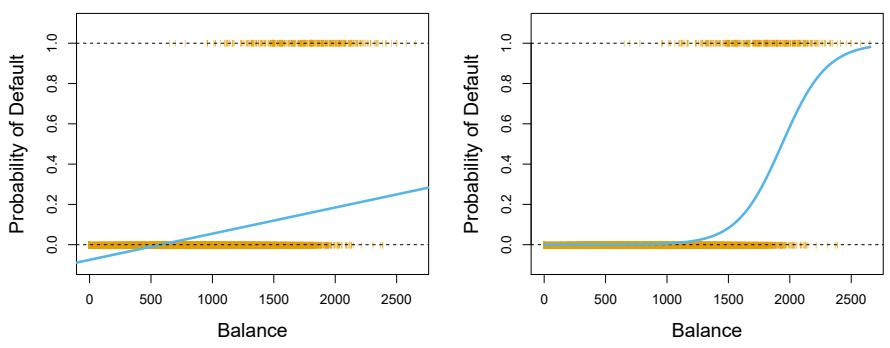  
FIGURE 4.2. Classification using the Default data. Left: Estimated probability of default using linear regression. Some estimated probabilities are negative! The orange ticks indicate the 0/1 values coded for default (No or Yes). Right: Predicted probabilities of default using logistic regression. All probabilities lie between 0 and 1.

for any individual for whom $p(\text{balance}) > 0.5$ . Alternatively, if a company wishes to be conservative in predicting individuals who are at risk for default, then they may choose to use a lower threshold, such as $p(\text{balance}) > 0.1$ .

# 4.3.1 The Logistic Model

How should we model the relationship between $p(X) = \Pr(Y = 1|X)$ and X? (For convenience we are using the generic 0/1 coding for the response.) In Section 4.2 we considered using a linear regression model to represent these probabilities:

$$
p (X) = \beta_ {0} + \beta_ {1} X. \tag {4.1}
$$

If we use this approach to predict default=Yes using balance, then we obtain the model shown in the left-hand panel of Figure 4.2. Here we see the problem with this approach: for balances close to zero we predict a negative probability of default; if we were to predict for very large balances, we would get values bigger than 1. These predictions are not sensible, since of course the true probability of default, regardless of credit card balance, must fall between 0 and 1. This problem is not unique to the credit default data. Any time a straight line is fit to a binary response that is coded as 0 or 1, in principle we can always predict $p(X) < 0$ for some values of X and $p(X) > 1$ for others (unless the range of X is limited).

To avoid this problem, we must model $p(X)$ using a function that gives outputs between 0 and 1 for all values of X. Many functions meet this description. In logistic regression, we use the logistic function,

$$
p (X) = \frac {e ^ {\beta_ {0} + \beta_ {1} X}}{1 + e ^ {\beta_ {0} + \beta_ {1} X}}. \tag {4.2}
$$

To fit the model (4.2), we use a method called maximum likelihood, which we discuss in the next section. The right-hand panel of Figure 4.2 illustrates the fit of the logistic regression model to the Default data. Notice that for

logistic function

maximum likelihood

low balances we now predict the probability of default as close to, but never below, zero. Likewise, for high balances we predict a default probability close to, but never above, one. The logistic function will always produce an S-shaped curve of this form, and so regardless of the value of X, we will obtain a sensible prediction. We also see that the logistic model is better able to capture the range of probabilities than is the linear regression model in the left-hand plot. The average fitted probability in both cases is 0.0333 (averaged over the training data), which is the same as the overall proportion of defaulters in the data set.

After a bit of manipulation of (4.2), we find that

$$
\frac {p (X)}{1 - p (X)} = e ^ {\beta_ {0} + \beta_ {1} X}. \tag {4.3}
$$

The quantity $p(X)/[1 - p(X)]$ is called the odds, and can take on any value between 0 and $\infty$ . Values of the odds close to 0 and $\infty$ indicate very low and very high probabilities of default, respectively. For example, on average 1 in 5 people with an odds of 1/4 will default, since $p(X) = 0.2$ implies an odds of $\frac{0.2}{1-0.2} = 1/4$ . Likewise, on average nine out of every ten people with an odds of 9 will default, since $p(X) = 0.9$ implies an odds of $\frac{0.9}{1-0.9} = 9$ . Odds are traditionally used instead of probabilities in horse-racing, since they relate more naturally to the correct betting strategy.

By taking the logarithm of both sides of (4.3), we arrive at

$$
\log \left(\frac {p (X)}{1 - p (X)}\right) = \beta_ {0} + \beta_ {1} X. \tag {4.4}
$$

The left-hand side is called the log odds or logit. We see that the logistic regression model (4.2) has a logit that is linear in $X$ .

Recall from Chapter 3 that in a linear regression model, $\beta_{1}$ gives the average change in Y associated with a one-unit increase in X. By contrast, in a logistic regression model, increasing X by one unit changes the log odds by $\beta_{1}$ (4.4). Equivalently, it multiplies the odds by $e^{\beta_{1}}$ (4.3). However, because the relationship between $p(X)$ and X in (4.2) is not a straight line, $\beta_{1}$ does not correspond to the change in $p(X)$ associated with a one-unit increase in X. The amount that $p(X)$ changes due to a one-unit change in X depends on the current value of X. But regardless of the value of X, if $\beta_{1}$ is positive then increasing X will be associated with increasing $p(X)$ , and if $\beta_{1}$ is negative then increasing X will be associated with decreasing $p(X)$ . The fact that there is not a straight-line relationship between $p(X)$ and X, and the fact that the rate of change in $p(X)$ per unit change in X depends on the current value of X, can also be seen by inspection of the right-hand panel of Figure 4.2.

# 4.3.2 Estimating the Regression Coefficients

The coefficients $\beta_{0}$ and $\beta_{1}$ in (4.2) are unknown, and must be estimated based on the available training data. In Chapter 3, we used the least squares approach to estimate the unknown linear regression coefficients. Although we could use (non-linear) least squares to fit the model (4.4), the more general method of maximum likelihood is preferred, since it has better statistical properties. The basic intuition behind using maximum likelihood

to fit a logistic regression model is as follows: we seek estimates for $\beta_{0}$ and $\beta_{1}$ such that the predicted probability $\hat{p}(x_{i})$ of default for each individual, using (4.2), corresponds as closely as possible to the individual's observed default status. In other words, we try to find $\hat{\beta}_{0}$ and $\hat{\beta}_{1}$ such that plugging these estimates into the model for $p(X)$ , given in (4.2), yields a number close to one for all individuals who defaulted, and a number close to zero for all individuals who did not. This intuition can be formalized using a mathematical equation called a likelihood function:

$$
\ell (\beta_ {0}, \beta_ {1}) = \prod_ {i: y _ {i} = 1} p (x _ {i}) \prod_ {i ^ {\prime}: y _ {i ^ {\prime}} = 0} (1 - p (x _ {i ^ {\prime}})). \tag {4.5}
$$

likelihood function

The estimates $\hat{\beta}_0$ and $\hat{\beta}_1$ are chosen to maximize this likelihood function.

Maximum likelihood is a very general approach that is used to fit many of the non-linear models that we examine throughout this book. In the linear regression setting, the least squares approach is in fact a special case of maximum likelihood. The mathematical details of maximum likelihood are beyond the scope of this book. However, in general, logistic regression and other models can be easily fit using statistical software such as R, and so we do not need to concern ourselves with the details of the maximum likelihood fitting procedure.

Table 4.1 shows the coefficient estimates and related information that result from fitting a logistic regression model on the Default data in order to predict the probability of default=Yes using balance. We see that $\hat{\beta}_{1}=0.0055$ ; this indicates that an increase in balance is associated with an increase in the probability of default. To be precise, a one-unit increase in balance is associated with an increase in the log odds of default by 0.0055 units.

Many aspects of the logistic regression output shown in Table 4.1 are similar to the linear regression output of Chapter 3. For example, we can measure the accuracy of the coefficient estimates by computing their standard errors. The z-statistic in Table 4.1 plays the same role as the t-statistic in the linear regression output, for example in Table 3.1 on page 77. For instance, the z-statistic associated with $\beta_{1}$ is equal to $\hat{\beta}_{1}/\mathrm{SE}(\hat{\beta}_{1})$ , and so a large (absolute) value of the z-statistic indicates evidence against the null hypothesis $H_{0}:\beta_{1}=0$ . This null hypothesis implies that $p(X)=\frac{e^{\beta_{0}}}{1+e^{\beta_{0}}}$ : in other words, that the probability of default does not depend on balance. Since the p-value associated with balance in Table 4.1 is tiny, we can reject $H_{0}$ . In other words, we conclude that there is indeed an association between balance and probability of default. The estimated intercept in Table 4.1 is typically not of interest; its main purpose is to adjust the average fitted probabilities to the proportion of ones in the data (in this case, the overall default rate).

# 4.3.3 Making Predictions

Once the coefficients have been estimated, we can compute the probability of default for any given credit card balance. For example, using the coefficient estimates given in Table 4.1, we predict that the default probability

<table><tr><td></td><td>Coefficient</td><td>Std. error</td><td>z-statistic</td><td>p-value</td></tr><tr><td>Intercept</td><td>-10.6513</td><td>0.3612</td><td>-29.5</td><td>&lt;0.0001</td></tr><tr><td>balance</td><td>0.0055</td><td>0.0002</td><td>24.9</td><td>&lt;0.0001</td></tr></table>

TABLE 4.1. For the Default data, estimated coefficients of the logistic regression model that predicts the probability of default using balance. A one-unit increase in balance is associated with an increase in the log odds of default by 0.0055 units.

<table><tr><td></td><td>Coefficient</td><td>Std. error</td><td>z-statistic</td><td>p-value</td></tr><tr><td>Intercept</td><td>-3.5041</td><td>0.0707</td><td>-49.55</td><td>&lt;0.0001</td></tr><tr><td>student [Yes]</td><td>0.4049</td><td>0.1150</td><td>3.52</td><td>0.0004</td></tr></table>

TABLE 4.2. For the Default data, estimated coefficients of the logistic regression model that predicts the probability of default using student status. Student status is encoded as a dummy variable, with a value of 1 for a student and a value of 0 for a non-student, and represented by the variable student[Yes] in the table.

for an individual with a balance of \$1,000 is

$$
\hat {p} (X) = \frac {e ^ {\hat {\beta} _ {0} + \hat {\beta} _ {1} X}}{1 + e ^ {\hat {\beta} _ {0} + \hat {\beta} _ {1} X}} = \frac {e ^ {- 1 0 . 6 5 1 3 + 0 . 0 0 5 5 \times 1 , 0 0 0}}{1 + e ^ {- 1 0 . 6 5 1 3 + 0 . 0 0 5 5 \times 1 , 0 0 0}} = 0. 0 0 5 7 6,
$$

which is below 1%. In contrast, the predicted probability of default for an individual with a balance of \$2,000 is much higher, and equals 0.586 or 58.6%.

One can use qualitative predictors with the logistic regression model using the dummy variable approach from Section 3.3.1. As an example, the Default data set contains the qualitative variable student. To fit a model that uses student status as a predictor variable, we simply create a dummy variable that takes on a value of 1 for students and 0 for non-students. The logistic regression model that results from predicting probability of default from student status can be seen in Table 4.2. The coefficient associated with the dummy variable is positive, and the associated p-value is statistically significant. This indicates that students tend to have higher default probabilities than non-students:

$$
\widehat {\mathrm{Pr}} (\text {default = Yes|student = Yes}) = \frac {e ^ {- 3 . 5 0 4 1 + 0 . 4 0 4 9 \times 1}}{1 + e ^ {- 3 . 5 0 4 1 + 0 . 4 0 4 9 \times 1}} = 0. 0 4 3 1,
$$

$$
\widehat {\Pr} (\text {default = Yes|student = No}) = \frac {e ^ {- 3 . 5 0 4 1 + 0 . 4 0 4 9 \times 0}}{1 + e ^ {- 3 . 5 0 4 1 + 0 . 4 0 4 9 \times 0}} = 0. 0 2 9 2.
$$

# 4.3.4 Multiple Logistic Regression

We now consider the problem of predicting a binary response using multiple predictors. By analogy with the extension from simple to multiple linear regression in Chapter 3, we can generalize $(4.4)$ as follows:

$$
\log \left(\frac {p (X)}{1 - p (X)}\right) = \beta_ {0} + \beta_ {1} X _ {1} + \dots + \beta_ {p} X _ {p}, \tag {4.6}
$$

where $X = (X_{1},\dots ,X_{p})$ are $p$ predictors. Equation 4.6 can be rewritten as

$$
p (X) = \frac {e ^ {\beta_ {0} + \beta_ {1} X _ {1} + \cdots + \beta_ {p} X _ {p}}}{1 + e ^ {\beta_ {0} + \beta_ {1} X _ {1} + \cdots + \beta_ {p} X _ {p}}}. \tag {4.7}
$$

<table><tr><td></td><td>Coefficient</td><td>Std. error</td><td>z-statistic</td><td>p-value</td></tr><tr><td>Intercept</td><td>-10.8690</td><td>0.4923</td><td>-22.08</td><td>&lt;0.0001</td></tr><tr><td>balance</td><td>0.0057</td><td>0.0002</td><td>24.74</td><td>&lt;0.0001</td></tr><tr><td>income</td><td>0.0030</td><td>0.0082</td><td>0.37</td><td>0.7115</td></tr><tr><td>student[Yes]</td><td>-0.6468</td><td>0.2362</td><td>-2.74</td><td>0.0062</td></tr></table>

TABLE 4.3. For the Default data, estimated coefficients of the logistic regression model that predicts the probability of default using balance, income, and student status. Student status is encoded as a dummy variable student[Yes], with a value of 1 for a student and a value of 0 for a non-student. In fitting this model, income was measured in thousands of dollars.

Just as in Section 4.3.2, we use the maximum likelihood method to estimate $\beta_0, \beta_1, \ldots, \beta_p$ .

Table 4.3 shows the coefficient estimates for a logistic regression model that uses balance, income (in thousands of dollars), and student status to predict probability of default. There is a surprising result here. The p-values associated with balance and the dummy variable for student status are very small, indicating that each of these variables is associated with the probability of default. However, the coefficient for the dummy variable is negative, indicating that students are less likely to default than non-students. In contrast, the coefficient for the dummy variable is positive in Table 4.2. How is it possible for student status to be associated with an increase in probability of default in Table 4.2 and a decrease in probability of default in Table 4.3? The left-hand panel of Figure 4.3 provides a graphical illustration of this apparent paradox. The orange and blue solid lines show the average default rates for students and non-students, respectively, as a function of credit card balance. The negative coefficient for student in the multiple logistic regression indicates that for a fixed value of balance and income, a student is less likely to default than a non-student. Indeed, we observe from the left-hand panel of Figure 4.3 that the student default rate is at or below that of the non-student default rate for every value of balance. But the horizontal broken lines near the base of the plot, which show the default rates for students and non-students averaged over all values of balance and income, suggest the opposite effect: the overall student default rate is higher than the non-student default rate. Consequently, there is a positive coefficient for student in the single variable logistic regression output shown in Table 4.2.

The right-hand panel of Figure 4.3 provides an explanation for this discrepancy. The variables student and balance are correlated. Students tend to hold higher levels of debt, which is in turn associated with higher probability of default. In other words, students are more likely to have large credit card balances, which, as we know from the left-hand panel of Figure 4.3, tend to be associated with high default rates. Thus, even though an individual student with a given credit card balance will tend to have a lower probability of default than a non-student with the same credit card balance, the fact that students on the whole tend to have higher credit card balances means that overall, students tend to default at a higher rate than non-students. This is an important distinction for a credit card company that is trying to determine to whom they should offer credit. A student is riskier than a non-student if no information about the student's credit card

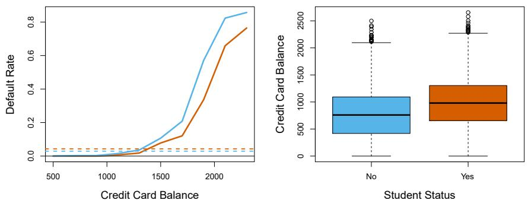  
FIGURE 4.3. Confounding in the Default data. Left: Default rates are shown for students (orange) and non-students (blue). The solid lines display default rate as a function of balance, while the horizontal broken lines display the overall default rates. Right: Boxplots of balance for students (orange) and non-students (blue) are shown.

balance is available. However, that student is less risky than a non-student with the same credit card balance!

This simple example illustrates the dangers and subtleties associated with performing regressions involving only a single predictor when other predictors may also be relevant. As in the linear regression setting, the results obtained using one predictor may be quite different from those obtained using multiple predictors, especially when there is correlation among the predictors. In general, the phenomenon seen in Figure 4.3 is known as confounding.

By substituting estimates for the regression coefficients from Table 4.3 into (4.7), we can make predictions. For example, a student with a credit card balance of \$1,500 and an income of \$40,000 has an estimated probability of default of

$$
\hat {p} (X) = \frac {e ^ {- 1 0 . 8 6 9 + 0 . 0 0 5 7 4 \times 1 , 5 0 0 + 0 . 0 0 3 \times 4 0 - 0 . 6 4 6 8 \times 1}}{1 + e ^ {- 1 0 . 8 6 9 + 0 . 0 0 5 7 4 \times 1 , 5 0 0 + 0 . 0 0 3 \times 4 0 - 0 . 6 4 6 8 \times 1}} = 0. 0 5 8. \tag {4.8}
$$

A non-student with the same balance and income has an estimated probability of default of

$$
\hat {p} (X) = \frac {e ^ {- 1 0 . 8 6 9 + 0 . 0 0 5 7 4 \times 1 , 5 0 0 + 0 . 0 0 3 \times 4 0 - 0 . 6 4 6 8 \times 0}}{1 + e ^ {- 1 0 . 8 6 9 + 0 . 0 0 5 7 4 \times 1 , 5 0 0 + 0 . 0 0 3 \times 4 0 - 0 . 6 4 6 8 \times 0}} = 0. 1 0 5. \tag {4.9}
$$

(Here we multiply the income coefficient estimate from Table 4.3 by 40, rather than by 40,000, because in that table the model was fit with income measured in units of \$1,000.)

# 4.3.5 Multinomial Logistic Regression

We sometimes wish to classify a response variable that has more than two classes. For example, in Section 4.2 we had three categories of medical condition in the emergency room: stroke, drug overdose, epileptic seizure. However, the logistic regression approach that we have seen in this section only allows for K = 2 classes for the response variable.

confounding

It turns out that it is possible to extend the two-class logistic regression approach to the setting of K > 2 classes. This extension is sometimes known as multinomial logistic regression. To do this, we first select a single class to serve as the baseline; without loss of generality, we select the Kth class for this role. Then we replace the model (4.7) with the model

$$
\Pr (Y = k | X = x) = \frac {e ^ {\beta_ {k 0} + \beta_ {k 1} x _ {1} + \cdots + \beta_ {k p} x _ {p}}}{1 + \sum_ {l = 1} ^ {K - 1} e ^ {\beta_ {l 0} + \beta_ {l 1} x _ {1} + \cdots + \beta_ {l p} x _ {p}}} \tag {4.10}
$$

for $k = 1,\dots ,K - 1$ , and

$$
\Pr (Y = K | X = x) = \frac {1}{1 + \sum_ {l = 1} ^ {K - 1} e ^ {\beta_ {l 0} + \beta_ {l 1} x _ {1} + \cdots + \beta_ {l p} x _ {p}}}. \tag {4.11}
$$

It is not hard to show that for $k = 1, \ldots, K - 1$ ,

$$
\log \left(\frac {\Pr (Y = k | X = x)}{\Pr (Y = K | X = x)}\right) = \beta_ {k 0} + \beta_ {k 1} x _ {1} + \dots + \beta_ {k p} x _ {p}. \tag {4.12}
$$

Notice that $(4.12)$ is quite similar to $(4.6)$ . Equation 4.12 indicates that once again, the log odds between any pair of classes is linear in the features.

It turns out that in (4.10)-(4.12), the decision to treat the $K$ th class as the baseline is unimportant. For example, when classifying emergency room visits into stroke, drug overdose, and epileptic seizure, suppose that we fit two multinomial logistic regression models: one treating stroke as the baseline, another treating drug overdose as the baseline. The coefficient estimates will differ between the two fitted models due to the differing choice of baseline, but the fitted values (predictions), the log odds between any pair of classes, and the other key model outputs will remain the same.

Nonetheless, interpretation of the coefficients in a multinomial logistic regression model must be done with care, since it is tied to the choice of baseline. For example, if we set epileptic seizure to be the baseline, then we can interpret $\beta_{stroke0}$ as the log odds of stroke versus epileptic seizure, given that $x_{1} = \cdots = x_{p} = 0$ . Furthermore, a one-unit increase in $X_{j}$ is associated with a $\beta_{strokej}$ increase in the log odds of stroke over epileptic seizure. Stated another way, if $X_{j}$ increases by one unit, then

$$
\frac {\Pr (Y = \text {stroke} | X = x)}{\Pr (Y = \text {epileptic seizure} | X = x)}
$$

increases by $e^{\beta_{\mathrm{stroke}j}}$ .

We now briefly present an alternative coding for multinomial logistic regression, known as the softmax coding. The softmax coding is equivalent to the coding just described in the sense that the fitted values, log odds between any pair of classes, and other key model outputs will remain the same, regardless of coding. But the softmax coding is used extensively in some areas of the machine learning literature (and will appear again in Chapter 10), so it is worth being aware of it. In the softmax coding, rather than selecting a baseline class, we treat all K classes symmetrically, and assume that for $k = 1, \ldots, K$ ,

$$
\Pr (Y = k | X = x) = \frac {e ^ {\beta_ {k 0} + \beta_ {k 1} x _ {1} + \cdots + \beta_ {k p} x _ {p}}}{\sum_ {l = 1} ^ {K} e ^ {\beta_ {l 0} + \beta_ {l 1} x _ {1} + \cdots + \beta_ {l p} x _ {p}}}. \tag {4.13}
$$

multinomial
logistic
regression

softmax

Thus, rather than estimating coefficients for $K - 1$ classes, we actually estimate coefficients for all $K$ classes. It is not hard to see that as a result of (4.13), the log odds ratio between the $k$ th and $k'$ th classes equals

$$
\log \left(\frac {\Pr (Y = k | X = x)}{\Pr (Y = k ^ {\prime} | X = x)}\right) = (\beta_ {k 0} - \beta_ {k ^ {\prime} 0}) + (\beta_ {k 1} - \beta_ {k ^ {\prime} 1}) x _ {1} + \dots + (\beta_ {k p} - \beta_ {k ^ {\prime} p}) x _ {p}. \tag {4.14}
$$

# 4.4 Generative Models for Classification

Logistic regression involves directly modeling $\Pr(Y=k|X=x)$ using the logistic function, given by (4.7) for the case of two response classes. In statistical jargon, we model the conditional distribution of the response Y, given the predictor(s) X. We now consider an alternative and less direct approach to estimating these probabilities. In this new approach, we model the distribution of the predictors X separately in each of the response classes (i.e. for each value of Y). We then use Bayes' theorem to flip these around into estimates for $\Pr(Y=k|X=x)$ . When the distribution of X within each class is assumed to be normal, it turns out that the model is very similar in form to logistic regression.

Why do we need another method, when we have logistic regression? There are several reasons:

- When there is substantial separation between the two classes, the parameter estimates for the logistic regression model are surprisingly unstable. The methods that we consider in this section do not suffer from this problem.  
- If the distribution of the predictors X is approximately normal in each of the classes and the sample size is small, then the approaches in this section may be more accurate than logistic regression.  
- The methods in this section can be naturally extended to the case of more than two response classes. (In the case of more than two response classes, we can also use multinomial logistic regression from Section 4.3.5.)

Suppose that we wish to classify an observation into one of K classes, where $K \geq 2$ . In other words, the qualitative response variable Y can take on K possible distinct and unordered values. Let $\pi_{k}$ represent the overall or prior probability that a randomly chosen observation comes from the kth class. Let $f_{k}(X) \equiv \Pr(X|Y = k)^{1}$ denote the density function of X for an observation that comes from the kth class. In other words, $f_{k}(x)$ is relatively large if there is a high probability that an observation in the kth class has $X \approx x$ , and $f_{k}(x)$ is small if it is very unlikely that an observation in the kth class has $X \approx x$ . Then Bayes' theorem states that

$$
\Pr (Y = k | X = x) = \frac {\pi_ {k} f _ {k} (x)}{\sum_ {l = 1} ^ {K} \pi_ {l} f _ {l} (x)}. \tag {4.15}
$$

In accordance with our earlier notation, we will use the abbreviation $p_{k}(x) = \Pr(Y = k | X = x)$ ; this is the posterior probability that an observation X = x belongs to the kth class. That is, it is the probability that the observation belongs to the kth class, given the predictor value for that observation.

Equation 4.15 suggests that instead of directly computing the posterior probability $p_{k}(x)$ as in Section 4.3.1, we can simply plug in estimates of $\pi_{k}$ and $f_{k}(x)$ into (4.15). In general, estimating $\pi_{k}$ is easy if we have a random sample from the population: we simply compute the fraction of the training observations that belong to the kth class. However, estimating the density function $f_{k}(x)$ is much more challenging. As we will see, to estimate $f_{k}(x)$ , we will typically have to make some simplifying assumptions.

We know from Chapter 2 that the Bayes classifier, which classifies an observation x to the class for which $p_{k}(x)$ is largest, has the lowest possible error rate out of all classifiers. (Of course, this is only true if all of the terms in (4.15) are correctly specified.) Therefore, if we can find a way to estimate $f_{k}(x)$ , then we can plug it into (4.15) in order to approximate the Bayes classifier.

In the following sections, we discuss three classifiers that use different estimates of $f_{k}(x)$ in (4.15) to approximate the Bayes classifier: linear discriminant analysis, quadratic discriminant analysis, and naive Bayes.

posterior

# 4.4.1 Linear Discriminant Analysis for $p = 1$

For now, assume that $p = 1$ —that is, we have only one predictor. We would like to obtain an estimate for $f_{k}(x)$ that we can plug into (4.15) in order to estimate $p_{k}(x)$ . We will then classify an observation to the class for which $p_{k}(x)$ is greatest. To estimate $f_{k}(x)$ , we will first make some assumptions about its form.

In particular, we assume that $f_{k}(x)$ is normal or Gaussian. In the one-dimensional setting, the normal density takes the form

$$
f _ {k} (x) = \frac {1}{\sqrt {2 \pi} \sigma_ {k}} \exp \left(- \frac {1}{2 \sigma_ {k} ^ {2}} (x - \mu_ {k}) ^ {2}\right), \tag {4.16}
$$

where $\mu_{k}$ and $\sigma_{k}^{2}$ are the mean and variance parameters for the kth class. For now, let us further assume that $\sigma_{1}^{2}=\cdots=\sigma_{K}^{2}$ : that is, there is a shared variance term across all K classes, which for simplicity we can denote by $\sigma^{2}$ . Plugging (4.16) into (4.15), we find that

$$
p _ {k} (x) = \frac {\pi_ {k} \frac {1}{\sqrt {2 \pi} \sigma} \exp \left(- \frac {1}{2 \sigma^ {2}} (x - \mu_ {k}) ^ {2}\right)}{\sum_ {l = 1} ^ {K} \pi_ {l} \frac {1}{\sqrt {2 \pi} \sigma} \exp \left(- \frac {1}{2 \sigma^ {2}} (x - \mu_ {l}) ^ {2}\right)}. \tag {4.17}
$$

(Note that in (4.17), $\pi_{k}$ denotes the prior probability that an observation belongs to the kth class, not to be confused with $\pi \approx 3.14159$ , the mathematical constant.) The Bayes classifier $^{2}$ involves assigning an observation

normal
Gaussian

  
FIGURE 4.4. Left: Two one-dimensional normal density functions are shown. The dashed vertical line represents the Bayes decision boundary. Right: 20 observations were drawn from each of the two classes, and are shown as histograms. The Bayes decision boundary is again shown as a dashed vertical line. The solid vertical line represents the LDA decision boundary estimated from the training data.

X = x to the class for which (4.17) is largest. Taking the log of (4.17) and rearranging the terms, it is not hard to show $^{3}$ that this is equivalent to assigning the observation to the class for which

$$
\delta_ {k} (x) = x \cdot \frac {\mu_ {k}}{\sigma^ {2}} - \frac {\mu_ {k} ^ {2}}{2 \sigma^ {2}} + \log (\pi_ {k}) \tag {4.18}
$$

is largest. For instance, if K = 2 and $\pi_{1} = \pi_{2}$ , then the Bayes classifier assigns an observation to class 1 if $2x(\mu_{1} - \mu_{2}) > \mu_{1}^{2} - \mu_{2}^{2}$ , and to class 2 otherwise. The Bayes decision boundary is the point for which $\delta_{1}(x) = \delta_{2}(x)$ ; one can show that this amounts to

$$
x = \frac {\mu_ {1} ^ {2} - \mu_ {2} ^ {2}}{2 (\mu_ {1} - \mu_ {2})} = \frac {\mu_ {1} + \mu_ {2}}{2}. \tag {4.19}
$$

An example is shown in the left-hand panel of Figure 4.4. The two normal density functions that are displayed, $f_{1}(x)$ and $f_{2}(x)$ , represent two distinct classes. The mean and variance parameters for the two density functions are $\mu_{1} = -1.25$ , $\mu_{2} = 1.25$ , and $\sigma_{1}^{2} = \sigma_{2}^{2} = 1$ . The two densities overlap, and so given that X = x, there is some uncertainty about the class to which the observation belongs. If we assume that an observation is equally likely to come from either class—that is, $\pi_{1} = \pi_{2} = 0.5$ —then by inspection of (4.19), we see that the Bayes classifier assigns the observation to class 1 if x < 0 and class 2 otherwise. Note that in this case, we can compute the Bayes classifier because we know that X is drawn from a Gaussian distribution within each class, and we know all of the parameters involved. In a real-life situation, we are not able to calculate the Bayes classifier.

In practice, even if we are quite certain of our assumption that X is drawn from a Gaussian distribution within each class, to apply the Bayes classifier we still have to estimate the parameters $\mu_{1},\ldots,\mu_{K},\pi_{1},\ldots,\pi_{K}$ , and $\sigma^{2}$ . The linear discriminant analysis (LDA) method approximates the Bayes classifier by plugging estimates for $\pi_{k},\mu_{k}$ , and $\sigma^{2}$ into (4.18). In

linear
discriminant
analysis

particular, the following estimates are used:

$$
\hat {\mu} _ {k} = \frac {1}{n _ {k}} \sum_ {i: y _ {i} = k} x _ {i}
$$

$$
\hat {\sigma} ^ {2} = \frac {1}{n - K} \sum_ {k = 1} ^ {K} \sum_ {i: y _ {i} = k} (x _ {i} - \hat {\mu} _ {k}) ^ {2} \tag {4.20}
$$

where n is the total number of training observations, and $n_{k}$ is the number of training observations in the kth class. The estimate for $\mu_{k}$ is simply the average of all the training observations from the kth class, while $\hat{\sigma}^{2}$ can be seen as a weighted average of the sample variances for each of the K classes. Sometimes we have knowledge of the class membership probabilities $\pi_{1},\ldots,\pi_{K}$ , which can be used directly. In the absence of any additional information, LDA estimates $\pi_{k}$ using the proportion of the training observations that belong to the kth class. In other words,

$$
\hat {\pi} _ {k} = n _ {k} / n. \tag {4.21}
$$

The LDA classifier plugs the estimates given in (4.20) and (4.21) into (4.18), and assigns an observation X = x to the class for which

$$
\hat {\delta} _ {k} (x) = x \cdot \frac {\hat {\mu} _ {k}}{\hat {\sigma} ^ {2}} - \frac {\hat {\mu} _ {k} ^ {2}}{2 \hat {\sigma} ^ {2}} + \log (\hat {\pi} _ {k}) \tag {4.22}
$$

is largest. The word linear in the classifier's name stems from the fact that the discriminant functions $\hat{\delta}_k(x)$ in (4.22) are linear functions of $x$ (as opposed to a more complex function of $x$ ).

The right-hand panel of Figure 4.4 displays a histogram of a random sample of 20 observations from each class. To implement LDA, we began by estimating $\pi_{k}, \mu_{k}$ , and $\sigma^{2}$ using (4.20) and (4.21). We then computed the decision boundary, shown as a black solid line, that results from assigning an observation to the class for which (4.22) is largest. All points to the left of this line will be assigned to the green class, while points to the right of this line are assigned to the purple class. In this case, since $n_{1} = n_{2} = 20$ , we have $\hat{\pi}_{1} = \hat{\pi}_{2}$ . As a result, the decision boundary corresponds to the midpoint between the sample means for the two classes, $(\hat{\mu}_{1} + \hat{\mu}_{2})/2$ . The figure indicates that the LDA decision boundary is slightly to the left of the optimal Bayes decision boundary, which instead equals $(\mu_{1} + \mu_{2})/2 = 0$ . How well does the LDA classifier perform on this data? Since this is simulated data, we can generate a large number of test observations in order to compute the Bayes error rate and the LDA test error rate. These are 10.6% and 11.1%, respectively. In other words, the LDA classifier's error rate is only 0.5% above the smallest possible error rate! This indicates that LDA is performing pretty well on this data set.

To reiterate, the LDA classifier results from assuming that the observations within each class come from a normal distribution with a class-specific mean and a common variance $\sigma^{2}$ , and plugging estimates for these parameters into the Bayes classifier. In Section 4.4.3, we will consider a less stringent set of assumptions, by allowing the observations in the kth class to have a class-specific variance, $\sigma_{k}^{2}$ .

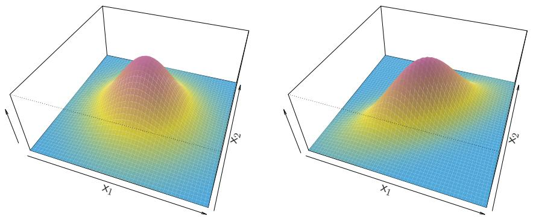  
FIGURE 4.5. Two multivariate Gaussian density functions are shown, with p = 2. Left: The two predictors are uncorrelated. Right: The two variables have a correlation of 0.7.

# 4.4.2 Linear Discriminant Analysis for $p > 1$

We now extend the LDA classifier to the case of multiple predictors. To do this, we will assume that $X = (X_{1}, X_{2}, \ldots, X_{p})$ is drawn from a multivariate Gaussian (or multivariate normal) distribution, with a class-specific mean vector and a common covariance matrix. We begin with a brief review of this distribution.

The multivariate Gaussian distribution assumes that each individual predictor follows a one-dimensional normal distribution, as in $(4.16)$ , with some correlation between each pair of predictors. Two examples of multivariate Gaussian distributions with p = 2 are shown in Figure 4.5. The height of the surface at any particular point represents the probability that both $X_{1}$ and $X_{2}$ fall in a small region around that point. In either panel, if the surface is cut along the $X_{1}$ axis or along the $X_{2}$ axis, the resulting cross-section will have the shape of a one-dimensional normal distribution. The left-hand panel of Figure 4.5 illustrates an example in which $\operatorname{Var}(X_{1}) = \operatorname{Var}(X_{2})$ and $\operatorname{Cor}(X_{1}, X_{2}) = 0$ ; this surface has a characteristic bell shape. However, the bell shape will be distorted if the predictors are correlated or have unequal variances, as is illustrated in the right-hand panel of Figure 4.5. In this situation, the base of the bell will have an elliptical, rather than circular, shape. To indicate that a p-dimensional random variable X has a multivariate Gaussian distribution, we write $X \sim N(\mu, \Sigma)$ . Here $\operatorname{E}(X) = \mu$ is the mean of X (a vector with p components), and $\operatorname{Cov}(X) = \Sigma$ is the $p \times p$ covariance matrix of X. Formally, the multivariate Gaussian density is defined as

$$
f (x) = \frac {1}{(2 \pi) ^ {p / 2} | \boldsymbol {\Sigma} | ^ {1 / 2}} \exp \left(- \frac {1}{2} (x - \mu) ^ {T} \boldsymbol {\Sigma} ^ {- 1} (x - \mu)\right). \tag {4.23}
$$

In the case of p > 1 predictors, the LDA classifier assumes that the observations in the kth class are drawn from a multivariate Gaussian distribution $N(\mu_{k}, \Sigma)$ , where $\mu_{k}$ is a class-specific mean vector, and $\Sigma$ is a covariance matrix that is common to all K classes. Plugging the density function for the kth class, $f_{k}(X = x)$ , into (4.15) and performing a little bit of algebra reveals that the Bayes classifier assigns an observation X = x

multivariate
Gaussian

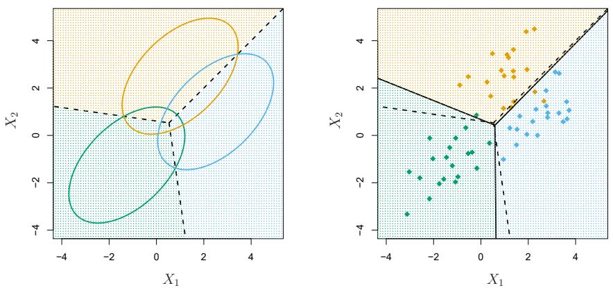  
FIGURE 4.6. An example with three classes. The observations from each class are drawn from a multivariate Gaussian distribution with p = 2, with a class-specific mean vector and a common covariance matrix. Left: Ellipses that contain 95 % of the probability for each of the three classes are shown. The dashed lines are the Bayes decision boundaries. Right: 20 observations were generated from each class, and the corresponding LDA decision boundaries are indicated using solid black lines. The Bayes decision boundaries are once again shown as dashed lines.

to the class for which

$$
\delta_ {k} (x) = x ^ {T} \boldsymbol {\Sigma} ^ {- 1} \mu_ {k} - \frac {1}{2} \mu_ {k} ^ {T} \boldsymbol {\Sigma} ^ {- 1} \mu_ {k} + \log \pi_ {k} \tag {4.24}
$$

is largest. This is the vector/matrix version of (4.18).

An example is shown in the left-hand panel of Figure 4.6. Three equally-sized Gaussian classes are shown with class-specific mean vectors and a common covariance matrix. The three ellipses represent regions that contain 95 % of the probability for each of the three classes. The dashed lines are the Bayes decision boundaries. In other words, they represent the set of values x for which $\delta_{k}(x)=\delta_{\ell}(x)$ ; i.e.

$$
x ^ {T} \boldsymbol {\Sigma} ^ {- 1} \mu_ {k} - \frac {1}{2} \mu_ {k} ^ {T} \boldsymbol {\Sigma} ^ {- 1} \mu_ {k} = x ^ {T} \boldsymbol {\Sigma} ^ {- 1} \mu_ {l} - \frac {1}{2} \mu_ {l} ^ {T} \boldsymbol {\Sigma} ^ {- 1} \mu_ {l} \tag {4.25}
$$

for $k \neq l$ . (The $\log \pi_{k}$ term from (4.24) has disappeared because each of the three classes has the same number of training observations; i.e. $\pi_{k}$ is the same for each class.) Note that there are three lines representing the Bayes decision boundaries because there are three pairs of classes among the three classes. That is, one Bayes decision boundary separates class 1 from class 2, one separates class 1 from class 3, and one separates class 2 from class 3. These three Bayes decision boundaries divide the predictor space into three regions. The Bayes classifier will classify an observation according to the region in which it is located.

Once again, we need to estimate the unknown parameters $\mu_1, \ldots, \mu_K$ , $\pi_1, \ldots, \pi_K$ , and $\Sigma$ ; the formulas are similar to those used in the one-dimensional case, given in (4.20). To assign a new observation $X = x$ , LDA plugs these estimates into (4.24) to obtain quantities $\hat{\delta}_k(x)$ , and classifies to the class for which $\hat{\delta}_k(x)$ is largest. Note that in (4.24) $\delta_k(x)$ is a linear function of $x$ ; that is, the LDA decision rule depends on $x$ only

<table><tr><td rowspan="2" colspan="2"></td><td colspan="3">True default status</td></tr><tr><td>No</td><td>Yes</td><td>Total</td></tr><tr><td rowspan="3">Predicted default status</td><td>No</td><td>9644</td><td>252</td><td>9896</td></tr><tr><td>Yes</td><td>23</td><td>81</td><td>104</td></tr><tr><td>Total</td><td>9667</td><td>333</td><td>10000</td></tr></table>

TABLE 4.4. A confusion matrix compares the LDA predictions to the true default statuses for the 10,000 training observations in the Default data set. Elements on the diagonal of the matrix represent individuals whose default statuses were correctly predicted, while off-diagonal elements represent individuals that were misclassified. LDA made incorrect predictions for 23 individuals who did not default and for 252 individuals who did default.

through a linear combination of its elements. As previously discussed, this is the reason for the word linear in LDA.

In the right-hand panel of Figure 4.6, 20 observations drawn from each of the three classes are displayed, and the resulting LDA decision boundaries are shown as solid black lines. Overall, the LDA decision boundaries are pretty close to the Bayes decision boundaries, shown again as dashed lines. The test error rates for the Bayes and LDA classifiers are 0.0746 and 0.0770, respectively. This indicates that LDA is performing well on this data.

We can perform LDA on the Default data in order to predict whether or not an individual will default on the basis of credit card balance and student status. $^{4}$ The LDA model fit to the 10,000 training samples results in a training error rate of 2.75%. This sounds like a low error rate, but two caveats must be noted.

- First of all, training error rates will usually be lower than test error rates, which are the real quantity of interest. In other words, we might expect this classifier to perform worse if we use it to predict whether or not a new set of individuals will default. The reason is that we specifically adjust the parameters of our model to do well on the training data. The higher the ratio of parameters $p$ to number of samples $n$ , the more we expect this overfitting to play a role. For these data we don't expect this to be a problem, since $p = 2$ and $n = 10,000$ .  
- Second, since only 3.33% of the individuals in the training sample defaulted, a simple but useless classifier that always predicts that an individual will not default, regardless of his or her credit card balance and student status, will result in an error rate of 3.33%. In other words, the trivial null classifier will achieve an error rate that is only a bit higher than the LDA training set error rate.

In practice, a binary classifier such as this one can make two types of errors: it can incorrectly assign an individual who defaults to the no default category, or it can incorrectly assign an individual who does not default to

overfitting

null

the default category. It is often of interest to determine which of these two types of errors are being made. A confusion matrix, shown for the Default data in Table 4.4, is a convenient way to display this information. The table reveals that LDA predicted that a total of 104 people would default. Of these people, 81 actually defaulted and 23 did not. Hence only 23 out of 9,667 of the individuals who did not default were incorrectly labeled. This looks like a pretty low error rate! However, of the 333 individuals who defaulted, 252 (or 75.7%) were missed by LDA. So while the overall error rate is low, the error rate among individuals who defaulted is very high. From the perspective of a credit card company that is trying to identify high-risk individuals, an error rate of $252/333 = 75.7\%$ among individuals who default may well be unacceptable.

Class-specific performance is also important in medicine and biology, where the terms sensitivity and specificity characterize the performance of a classifier or screening test. In this case the sensitivity is the percentage of true defaulters that are identified; it equals 24.3%. The specificity is the percentage of non-defaulters that are correctly identified; it equals $(1 - 23/9667) = 99.8\%$ .

Why does LDA do such a poor job of classifying the customers who default? In other words, why does it have such low sensitivity? As we have seen, LDA is trying to approximate the Bayes classifier, which has the lowest total error rate out of all classifiers. That is, the Bayes classifier will yield the smallest possible total number of misclassified observations, regardless of the class from which the errors stem. Some misclassifications will result from incorrectly assigning a customer who does not default to the default class, and others will result from incorrectly assigning a customer who defaults to the non-default class. In contrast, a credit card company might particularly wish to avoid incorrectly classifying an individual who will default, whereas incorrectly classifying an individual who will not default, though still to be avoided, is less problematic. We will now see that it is possible to modify LDA in order to develop a classifier that better meets the credit card company's needs.

The Bayes classifier works by assigning an observation to the class for which the posterior probability $p_{k}(X)$ is greatest. In the two-class case, this amounts to assigning an observation to the default class if

$$
\Pr (\text {default} = \text {Yes} | X = x) > 0. 5. \tag {4.26}
$$

Thus, the Bayes classifier, and by extension LDA, uses a threshold of 50% for the posterior probability of default in order to assign an observation to the default class. However, if we are concerned about incorrectly predicting the default status for individuals who default, then we can consider lowering this threshold. For instance, we might label any customer with a posterior probability of default above 20% to the default class. In other words, instead of assigning an observation to the default class if $(4.26)$ holds, we could instead assign an observation to this class if

$$
\Pr (\text {default} = \text {Yes} | X = x) > 0. 2. \tag {4.27}
$$

The error rates that result from taking this approach are shown in Table 4.5. Now LDA predicts that 430 individuals will default. Of the 333 individuals who default, LDA correctly predicts all but 138, or 41.4%. This is a vast

<table><tr><td rowspan="2" colspan="2"></td><td colspan="3">True default status</td></tr><tr><td>No</td><td>Yes</td><td>Total</td></tr><tr><td rowspan="3">Predicted default status</td><td>No</td><td>9432</td><td>138</td><td>9570</td></tr><tr><td>Yes</td><td>235</td><td>195</td><td>430</td></tr><tr><td>Total</td><td>9667</td><td>333</td><td>10000</td></tr></table>

TABLE 4.5. A confusion matrix compares the LDA predictions to the true default statuses for the 10,000 training observations in the Default data set, using a modified threshold value that predicts default for any individuals whose posterior default probability exceeds 20 %.

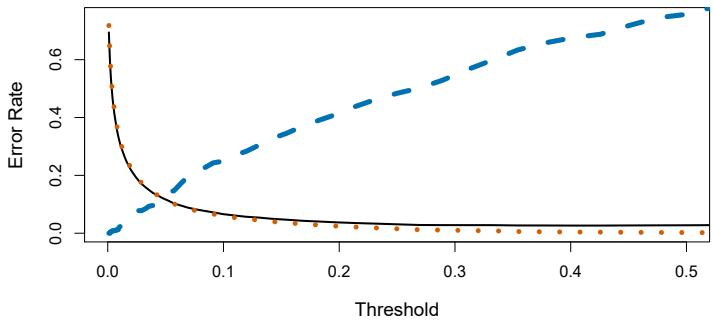

<details>
<summary>roc</summary>

| Threshold | Error Rate (Solid Line) | Error Rate (Dashed Line) |
| --- | --- | --- |
| 0.00 | ~0.68 | 0.00 |
| 0.01 | ~0.45 | ~0.01 |
| 0.02 | ~0.30 | ~0.02 |
| 0.03 | ~0.22 | ~0.08 |
| 0.04 | ~0.18 | ~0.10 |
| 0.05 | ~0.15 | ~0.15 |
| 0.06 | ~0.13 | ~0.18 |
| 0.07 | ~0.11 | ~0.22 |
| 0.08 | ~0.10 | ~0.24 |
| 0.09 | ~0.09 | ~0.26 |
| 0.10 | ~0.08 | ~0.28 |
| 0.11 | ~0.07 | ~0.30 |
| 0.12 | ~0.06 | ~0.32 |
| 0.13 | ~0.06 | ~0.34 |
| 0.14 | ~0.05 | ~0.36 |
| 0.15 | ~0.05 | ~0.38 |
| 0.16 | ~0.04 | ~0.40 |
| 0.17 | ~0.04 | ~0.42 |
| 0.18 | ~0.04 | ~0.44 |
| 0.19 | ~0.03 | ~0.46 |
| 0.20 | ~0.03 | ~0.48 |
| 0.21 | ~0.03 | ~0.50 |
| 0.22 | ~0.03 | ~0.52 |
| 0.23 | ~0.02 | ~0.54 |
| 0.24 | ~0.02 | ~0.56 |
| 0.25 | ~0.02 | ~0.58 |
| 0.26 | ~0.02 | ~0.60 |
| 0.27 | ~0.02 | ~0.62 |
| 0.28 | ~0.02 | ~0.64 |
| 0.29 | ~0.02 | ~0.66 |
| 0.30 | ~0.02 | ~0.68 |
| 0.31 | ~0.02 | ~0.70 |
| 0.32 | ~0.02 | ~0.72 |
| 0.33 | ~0.02 | ~0.74 |
| 0.34 | ~0.02 | ~0.76 |
| 0.35 | ~0.02 | ~0.78 |
| 0.36 | ~0.02 | ~0.80 |
| 0.37 | ~0.02 | ~0.82 |
| 0.38 | ~0.02 | ~0.84 |
| 0.39 | ~0.02 | ~0.86 |
| 0.40 | ~0.02 | ~0.88 |
| 0.41 | ~0.02 | ~0.90 |
| 0.42 | ~0.02 | ~0.92 |
| 0.43 | ~0.02 | ~0.94 |
| 0.44 | ~0.02 | ~0.96 |
| 0.45 | ~0.02 | ~0.98 |
| 0.46 | ~0.02 | ~1.00 |
| 0.47 | ~0.02 | ~1.02 |
| 0.48 | ~0.02 | ~1.04 |
| 0.49 | ~0.02 | ~1.06 |
| 0.50 | ~0.02 | ~1.08 |
</details>

FIGURE 4.7. For the Default data set, error rates are shown as a function of the threshold value for the posterior probability that is used to perform the assignment. The black solid line displays the overall error rate. The blue dashed line represents the fraction of defaulting customers that are incorrectly classified, and the orange dotted line indicates the fraction of errors among the non-defaulting customers.

improvement over the error rate of 75.7% that resulted from using the threshold of 50%. However, this improvement comes at a cost: now 235 individuals who do not default are incorrectly classified. As a result, the overall error rate has increased slightly to 3.73%. But a credit card company may consider this slight increase in the total error rate to be a small price to pay for more accurate identification of individuals who do indeed default.

Figure 4.7 illustrates the trade-off that results from modifying the threshold value for the posterior probability of default. Various error rates are shown as a function of the threshold value. Using a threshold of 0.5, as in $(4.26)$ , minimizes the overall error rate, shown as a black solid line. This is to be expected, since the Bayes classifier uses a threshold of 0.5 and is known to have the lowest overall error rate. But when a threshold of 0.5 is used, the error rate among the individuals who default is quite high (blue dashed line). As the threshold is reduced, the error rate among individuals who default decreases steadily, but the error rate among the individuals who do not default increases. How can we decide which threshold value is best? Such a decision must be based on domain knowledge, such as detailed information about the costs associated with default.

The ROC curve is a popular graphic for simultaneously displaying the two types of errors for all possible thresholds. The name “ROC” is historic, and comes from communications theory. It is an acronym for receiver operating characteristics. Figure 4.8 displays the ROC curve for the LDA classifier on the training data. The overall performance of a classifier, sum-

ROC curve


<details>
<summary>roc</summary>

| False positive rate | True positive rate |
| --- | --- |
| 0.0 | 0.0 |
| ~0.01 | ~0.48 |
| ~0.02 | ~0.62 |
| ~0.03 | ~0.70 |
| ~0.05 | ~0.78 |
| ~0.08 | ~0.84 |
| ~0.12 | ~0.88 |
| ~0.15 | ~0.90 |
| ~0.18 | ~0.92 |
| ~0.22 | ~0.94 |
| ~0.25 | ~0.96 |
| ~0.30 | ~0.97 |
| ~0.35 | ~0.98 |
| ~0.40 | ~0.99 |
| ~0.50 | ~0.99 |
| ~0.60 | ~1.0 |
| 1.0 | 1.0 |
</details>

FIGURE 4.8. A ROC curve for the LDA classifier on the Default data. It traces out two types of error as we vary the threshold value for the posterior probability of default. The actual thresholds are not shown. The true positive rate is the sensitivity: the fraction of defaulters that are correctly identified, using a given threshold value. The false positive rate is 1-specificity: the fraction of non-defaulters that we classify incorrectly as defaulters, using that same threshold value. The ideal ROC curve hugs the top left corner, indicating a high true positive rate and a low false positive rate. The dotted line represents the “no information” classifier; this is what we would expect if student status and credit card balance are not associated with probability of default.

marized over all possible thresholds, is given by the area under the (ROC) curve (AUC). An ideal ROC curve will hug the top left corner, so the larger the AUC the better the classifier. For this data the AUC is 0.95, which is close to the maximum of 1.0, so would be considered very good. We expect a classifier that performs no better than chance to have an AUC of 0.5 (when evaluated on an independent test set not used in model training). ROC curves are useful for comparing different classifiers, since they take into account all possible thresholds. It turns out that the ROC curve for the logistic regression model of Section 4.3.4 fit to these data is virtually indistinguishable from this one for the LDA model, so we do not display it here.

As we have seen above, varying the classifier threshold changes its true positive and false positive rate. These are also called the sensitivity and one minus the specificity of our classifier. Since there is an almost bewildering array of terms used in this context, we now give a summary. Table 4.6 shows the possible results when applying a classifier (or diagnostic test) to a population. To make the connection with the epidemiology literature, we think of “+” as the “disease” that we are trying to detect, and “−” as the “non-disease” state. To make the connection to the classical hypothesis testing literature, we think of “−” as the null hypothesis and “+” as the

area under
the (ROC)
curve

sensitivity
specificity

<table><tr><td rowspan="5">Predicted class</td><td rowspan="2"></td><td colspan="3">True class</td></tr><tr><td>- or Null</td><td>+ or Non-null</td><td>Total</td></tr><tr><td>- or Null</td><td>True Neg. (TN)</td><td>False Neg. (FN)</td><td> $N^*$ </td></tr><tr><td>+ or Non-null</td><td>False Pos. (FP)</td><td>True Pos. (TP)</td><td> $P^*$ </td></tr><tr><td>Total</td><td>N</td><td>P</td><td></td></tr></table>

TABLE 4.6. Possible results when applying a classifier or diagnostic test to a population.

<table><tr><td>Name</td><td>Definition</td><td>Synonyms</td></tr><tr><td>False Pos. rate</td><td>FP/N</td><td>Type I error, 1-Specificity</td></tr><tr><td>True Pos. rate</td><td>TP/P</td><td>1-Type II error, power, sensitivity, recall</td></tr><tr><td>Pos. Pred. value</td><td>TP/P*</td><td>Precision, 1-false discovery proportion</td></tr><tr><td>Neg. Pred. value</td><td>TN/N*</td><td></td></tr></table>

TABLE 4.7. Important measures for classification and diagnostic testing, derived from quantities in Table 4.6.

alternative (non-null) hypothesis. In the context of the Default data, “+” indicates an individual who defaults, and “−” indicates one who does not.

Table 4.7 lists many of the popular performance measures that are used in this context. The denominators for the false positive and true positive rates are the actual population counts in each class. In contrast, the denominators for the positive predictive value and the negative predictive value are the total predicted counts for each class.

# 4.4.3 Quadratic Discriminant Analysis

As we have discussed, LDA assumes that the observations within each class are drawn from a multivariate Gaussian distribution with a class-specific mean vector and a covariance matrix that is common to all K classes. Quadratic discriminant analysis (QDA) provides an alternative approach. Like LDA, the QDA classifier results from assuming that the observations from each class are drawn from a Gaussian distribution, and plugging estimates for the parameters into Bayes' theorem in order to perform prediction. However, unlike LDA, QDA assumes that each class has its own covariance matrix. That is, it assumes that an observation from the kth class is of the form $X \sim N(\mu_k, \Sigma_k)$ , where $\Sigma_k$ is a covariance matrix for the kth class. Under this assumption, the Bayes classifier assigns an observation X = x to the class for which

$$
\begin{array}{l} \delta_ {k} (x) = - \frac {1}{2} (x - \mu_ {k}) ^ {T} \boldsymbol {\Sigma} _ {k} ^ {- 1} (x - \mu_ {k}) - \frac {1}{2} \log | \boldsymbol {\Sigma} _ {k} | + \log \pi_ {k} \\ = - \frac {1}{2} x ^ {T} \boldsymbol {\Sigma} _ {k} ^ {- 1} x + x ^ {T} \boldsymbol {\Sigma} _ {k} ^ {- 1} \mu_ {k} - \frac {1}{2} \mu_ {k} ^ {T} \boldsymbol {\Sigma} _ {k} ^ {- 1} \mu_ {k} - \frac {1}{2} \log | \boldsymbol {\Sigma} _ {k} | + \log \pi_ {k} \tag {4.28} \\ \end{array}
$$

is largest. So the QDA classifier involves plugging estimates for $\Sigma_{k}$ , $\mu_{k}$ , and $\pi_{k}$ into (4.28), and then assigning an observation X = x to the class for which this quantity is largest. Unlike in (4.24), the quantity x appears as a quadratic function in (4.28). This is where QDA gets its name.

Why does it matter whether or not we assume that the K classes share a common covariance matrix? In other words, why would one prefer LDA to

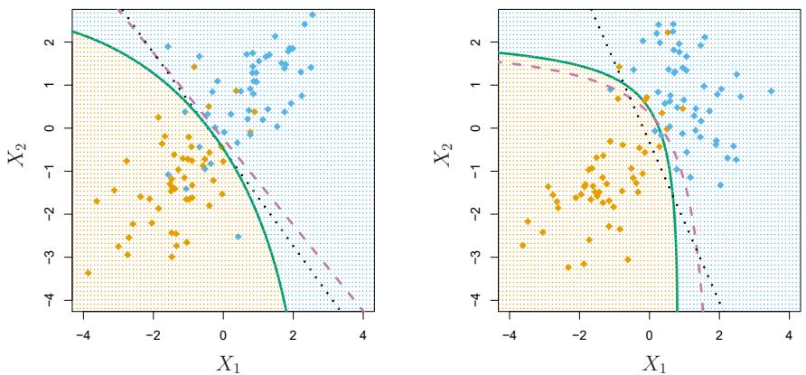  
FIGURE 4.9. Left: The Bayes (purple dashed), LDA (black dotted), and QDA (green solid) decision boundaries for a two-class problem with $\Sigma_{1} = \Sigma_{2}$ . The shading indicates the QDA decision rule. Since the Bayes decision boundary is linear, it is more accurately approximated by LDA than by QDA. Right: Details are as given in the left-hand panel, except that $\Sigma_{1} \neq \Sigma_{2}$ . Since the Bayes decision boundary is non-linear, it is more accurately approximated by QDA than by LDA.

QDA, or vice-versa? The answer lies in the bias-variance trade-off. When there are $p$ predictors, then estimating a covariance matrix requires estimating $p(p + 1) / 2$ parameters. QDA estimates a separate covariance matrix for each class, for a total of $Kp(p + 1) / 2$ parameters. With 50 predictors this is some multiple of 1,275, which is a lot of parameters. By instead assuming that the $K$ classes share a common covariance matrix, the LDA model becomes linear in $x$ , which means there are $Kp$ linear coefficients to estimate. Consequently, LDA is a much less flexible classifier than QDA, and so has substantially lower variance. This can potentially lead to improved prediction performance. But there is a trade-off: if LDA's assumption that the $K$ classes share a common covariance matrix is badly off, then LDA can suffer from high bias. Roughly speaking, LDA tends to be a better bet than QDA if there are relatively few training observations and so reducing variance is crucial. In contrast, QDA is recommended if the training set is very large, so that the variance of the classifier is not a major concern, or if the assumption of a common covariance matrix for the $K$ classes is clearly untenable.

Figure 4.9 illustrates the performances of LDA and QDA in two scenarios. In the left-hand panel, the two Gaussian classes have a common correlation of 0.7 between $X_{1}$ and $X_{2}$ . As a result, the Bayes decision boundary is linear and is accurately approximated by the LDA decision boundary. The QDA decision boundary is inferior, because it suffers from higher variance without a corresponding decrease in bias. In contrast, the right-hand panel displays a situation in which the orange class has a correlation of 0.7 between the variables and the blue class has a correlation of -0.7. Now the Bayes decision boundary is quadratic, and so QDA more accurately approximates this boundary than does LDA.

# 4.4.4 Naive Bayes

In previous sections, we used Bayes' theorem (4.15) to develop the LDA and QDA classifiers. Here, we use Bayes' theorem to motivate the popular naive Bayes classifier.

Recall that Bayes' theorem (4.15) provides an expression for the posterior probability $p_k(x) = \Pr(Y = k|X = x)$ in terms of $\pi_1, \ldots, \pi_K$ and $f_1(x), \ldots, f_K(x)$ . To use (4.15) in practice, we need estimates for $\pi_1, \ldots, \pi_K$ and $f_1(x), \ldots, f_K(x)$ . As we saw in previous sections, estimating the prior probabilities $\pi_1, \ldots, \pi_K$ is typically straightforward: for instance, we can estimate $\hat{\pi}_k$ as the proportion of training observations belonging to the $k$ th class, for $k = 1, \ldots, K$ .

However, estimating $f_{1}(x),\ldots,f_{K}(x)$ is more subtle. Recall that $f_{k}(x)$ is the p-dimensional density function for an observation in the kth class, for $k=1,\ldots,K$ . In general, estimating a p-dimensional density function is challenging. In LDA, we make a very strong assumption that greatly simplifies the task: we assume that $f_{k}$ is the density function for a multivariate normal random variable with class-specific mean $\mu_{k}$ , and shared covariance matrix $\Sigma$ . By contrast, in QDA, we assume that $f_{k}$ is the density function for a multivariate normal random variable with class-specific mean $\mu_{k}$ , and class-specific covariance matrix $\Sigma_{k}$ . By making these very strong assumptions, we are able to replace the very challenging problem of estimating K p-dimensional density functions with the much simpler problem of estimating K p-dimensional mean vectors and one (in the case of LDA) or K (in the case of QDA) $(p\times p)$ -dimensional covariance matrices.

The naive Bayes classifier takes a different tack for estimating $f_{1}(x),\ldots,f_{K}(x)$ . Instead of assuming that these functions belong to a particular family of distributions (e.g. multivariate normal), we instead make a single assumption:

Within the kth class, the p predictors are independent.

Stated mathematically, this assumption means that for $k = 1, \ldots, K$ ,

$$
f _ {k} (x) = f _ {k 1} (x _ {1}) \times f _ {k 2} (x _ {2}) \times \dots \times f _ {k p} (x _ {p}), \tag {4.29}
$$

where $f_{kj}$ is the density function of the $j$ th predictor among observations in the $k$ th class.

Why is this assumption so powerful? Essentially, estimating a p-dimensional density function is challenging because we must consider not only the marginal distribution of each predictor — that is, the distribution of each predictor on its own — but also the joint distribution of the predictors — that is, the association between the different predictors. In the case of a multivariate normal distribution, the association between the different predictors is summarized by the off-diagonal elements of the covariance matrix. However, in general, this association can be very hard to characterize, and exceedingly challenging to estimate. But by assuming that the p covariates are independent within each class, we completely eliminate the need to worry about the association between the p predictors, because we have simply assumed that there is no association between the predictors!

Do we really believe the naive Bayes assumption that the p covariates are independent within each class? In most settings, we do not. But even though this modeling assumption is made for convenience, it often leads to

naive Bayes

marginal
distribution
joint
distribution

pretty decent results, especially in settings where n is not large enough relative to p for us to effectively estimate the joint distribution of the predictors within each class. In fact, since estimating a joint distribution requires such a huge amount of data, naive Bayes is a good choice in a wide range of settings. Essentially, the naive Bayes assumption introduces some bias, but reduces variance, leading to a classifier that works quite well in practice as a result of the bias-variance trade-off.

Once we have made the naive Bayes assumption, we can plug (4.29) into (4.15) to obtain an expression for the posterior probability,

$$
\Pr (Y = k | X = x) = \frac {\pi_ {k} \times f _ {k 1} (x _ {1}) \times f _ {k 2} (x _ {2}) \times \cdots \times f _ {k p} (x _ {p})}{\sum_ {l = 1} ^ {K} \pi_ {l} \times f _ {l 1} (x _ {1}) \times f _ {l 2} (x _ {2}) \times \cdots \times f _ {l p} (x _ {p})} \tag {4.30}
$$

for $k = 1,\dots ,K$

To estimate the one-dimensional density function $f_{kj}$ using training data $x_{1j}, \ldots, x_{nj}$ , we have a few options.

- If $X_{j}$ is quantitative, then we can assume that $X_{j}|Y = k \sim N(\mu_{jk}, \sigma_{jk}^{2})$ . In other words, we assume that within each class, the $j$ th predictor is drawn from a (univariate) normal distribution. While this may sound a bit like QDA, there is one key difference, in that here we are assuming that the predictors are independent; this amounts to QDA with an additional assumption that the class-specific covariance matrix is diagonal.  
- If $X_{j}$ is quantitative, then another option is to use a non-parametric estimate for $f_{kj}$ . A very simple way to do this is by making a histogram for the observations of the $j$ th predictor within each class. Then we can estimate $f_{kj}(x_{j})$ as the fraction of the training observations in the $k$ th class that belong to the same histogram bin as $x_{j}$ . Alternatively, we can use a kernel density estimator, which is essentially a smoothed version of a histogram.  
- If $X_{j}$ is qualitative, then we can simply count the proportion of training observations for the $j$ th predictor corresponding to each class. For instance, suppose that $X_{j} \in \{1,2,3\}$ , and we have 100 observations in the $k$ th class. Suppose that the $j$ th predictor takes on values of 1, 2, and 3 in 32, 55, and 13 of those observations, respectively. Then we can estimate $f_{kj}$ as

$$
\hat {f} _ {k j} (x _ {j}) = \left\{ \begin{array}{l l} 0. 3 2 & \text {if} x _ {j} = 1 \\ 0. 5 5 & \text {if} x _ {j} = 2 \\ 0. 1 3 & \text {if} x _ {j} = 3. \end{array} \right.
$$

We now consider the naive Bayes classifier in a toy example with p = 3 predictors and K = 2 classes. The first two predictors are quantitative, and the third predictor is qualitative with three levels. Suppose further that $\hat{\pi}_{1} = \hat{\pi}_{2} = 0.5$ . The estimated density functions $\hat{f}_{kj}$ for k = 1, 2 and j = 1, 2, 3 are displayed in Figure 4.10. Now suppose that we wish to classify a new observation, $x^{*} = (0.4, 1.5, 1)^{T}$ . It turns out that in this

Density estimates for class k=1  
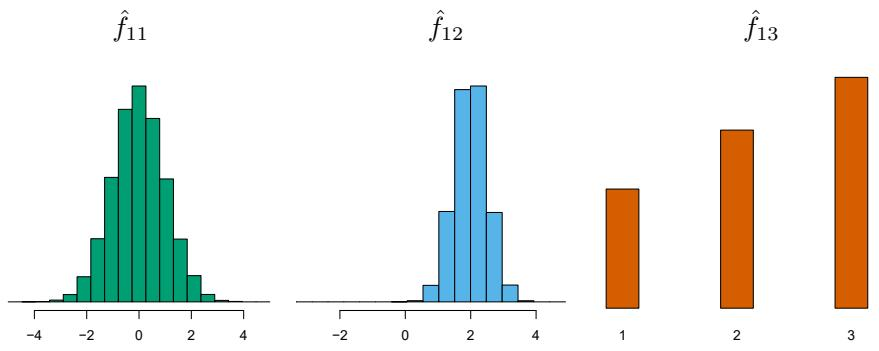

Density estimates for class k=2  
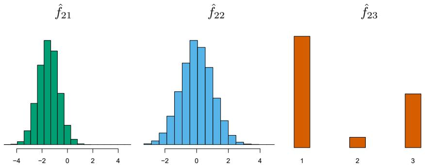

FIGURE 4.10. In the toy example in Section 4.4.4, we generate data with p = 3 predictors and K = 2 classes. The first two predictors are quantitative, and the third predictor is qualitative with three levels. In each class, the estimated density for each of the three predictors is displayed. If the prior probabilities for the two classes are equal, then the observation $x^{*} = (0.4, 1.5, 1)^{T}$ has a 94.4% posterior probability of belonging to the first class.

<table><tr><td rowspan="2" colspan="2"></td><td colspan="3">True default status</td></tr><tr><td>No</td><td>Yes</td><td>Total</td></tr><tr><td rowspan="3">Predicted default status</td><td>No</td><td>9621</td><td>244</td><td>9865</td></tr><tr><td>Yes</td><td>46</td><td>89</td><td>135</td></tr><tr><td>Total</td><td>9667</td><td>333</td><td>10000</td></tr></table>

TABLE 4.8. Comparison of the naive Bayes predictions to the true default status for the 10,000 training observations in the Default data set, when we predict default for any observation for which $P(Y = \text{default}|X = x) > 0.5$ .

example, $\hat{f}_{11}(0.4)=0.368$ , $\hat{f}_{12}(1.5)=0.484$ , $\hat{f}_{13}(1)=0.226$ , and $\hat{f}_{21}(0.4)=0.030$ , $\hat{f}_{22}(1.5)=0.130$ , $\hat{f}_{23}(1)=0.616$ . Plugging these estimates into (4.30) results in posterior probability estimates of $\Pr(Y=1|X=x^{*})=0.944$ and $\Pr(Y=2|X=x^{*})=0.056$ .

Table 4.8 provides the confusion matrix resulting from applying the naive Bayes classifier to the Default data set, where we predict a default if the posterior probability of a default — that is, $P(Y = \text{default} | X = x)$ — exceeds 0.5. Comparing this to the results for LDA in Table 4.4, our findings are mixed. While LDA has a slightly lower overall error rate, naive Bayes

<table><tr><td rowspan="2" colspan="2"></td><td colspan="3">True default status</td></tr><tr><td>No</td><td>Yes</td><td>Total</td></tr><tr><td rowspan="3">Predicted default status</td><td>No</td><td>9339</td><td>130</td><td>9469</td></tr><tr><td>Yes</td><td>328</td><td>203</td><td>531</td></tr><tr><td>Total</td><td>9667</td><td>333</td><td>10000</td></tr></table>

TABLE 4.9. Comparison of the naive Bayes predictions to the true default status for the 10,000 training observations in the Default data set, when we predict default for any observation for which $P(Y = \text{default}|X = x) > 0.2$ .

correctly predicts a higher fraction of the true defaulters. In this implementation of naive Bayes, we have assumed that each quantitative predictor is drawn from a Gaussian distribution (and, of course, that within each class, each predictor is independent).

Just as with LDA, we can easily adjust the probability threshold for predicting a default. For example, Table 4.9 provides the confusion matrix resulting from predicting a default if $P(Y = \text{default} | X = x) > 0.2$ . Again, the results are mixed relative to LDA with the same threshold (Table 4.5). Naive Bayes has a higher error rate, but correctly predicts almost two-thirds of the true defaults.

In this example, it should not be too surprising that naive Bayes does not convincingly outperform LDA: this data set has n = 10,000 and p = 2, and so the reduction in variance resulting from the naive Bayes assumption is not necessarily worthwhile. We expect to see a greater pay-off to using naive Bayes relative to LDA or QDA in instances where p is larger or n is smaller, so that reducing the variance is very important.

# 4.5 A Comparison of Classification Methods

# 4.5.1 An Analytical Comparison

We now perform an analytical (or mathematical) comparison of LDA, QDA, naive Bayes, and logistic regression. We consider these approaches in a setting with K classes, so that we assign an observation to the class that maximizes $\Pr(Y = k|X = x)$ . Equivalently, we can set K as the baseline class and assign an observation to the class that maximizes

$$
\log \left(\frac {\Pr (Y = k | X = x)}{\Pr (Y = K | X = x)}\right) \tag {4.31}
$$

for $k = 1, \ldots, K$ . Examining the specific form of (4.31) for each method provides a clear understanding of their similarities and differences.

First, for LDA, we can make use of Bayes' theorem (4.15) as well as the assumption that the predictors within each class are drawn from a multivariate normal density (4.23) with class-specific mean and shared co-

variance matrix in order to show that

$$
\begin{array}{l} \log \left(\frac {\Pr (Y = k | X = x)}{\Pr (Y = K | X = x)}\right) = \log \left(\frac {\pi_ {k} f _ {k} (x)}{\pi_ {K} f _ {K} (x)}\right) \\ = \log \left(\frac {\pi_ {k} \exp \left(- \frac {1}{2} (x - \mu_ {k}) ^ {T} \boldsymbol {\Sigma} ^ {- 1} (x - \mu_ {k})\right)}{\pi_ {K} \exp \left(- \frac {1}{2} (x - \mu_ {K}) ^ {T} \boldsymbol {\Sigma} ^ {- 1} (x - \mu_ {K})\right)}\right) \\ = \log \left(\frac {\pi_ {k}}{\pi_ {K}}\right) - \frac {1}{2} (x - \mu_ {k}) ^ {T} \boldsymbol {\Sigma} ^ {- 1} (x - \mu_ {k}) \\ + \frac {1}{2} (x - \mu_ {K}) ^ {T} \pmb {\Sigma} ^ {- 1} (x - \mu_ {K}) \\ = \log \left(\frac {\pi_ {k}}{\pi_ {K}}\right) - \frac {1}{2} (\mu_ {k} + \mu_ {K}) ^ {T} \boldsymbol {\Sigma} ^ {- 1} (\mu_ {k} - \mu_ {K}) \\ + x ^ {T} \pmb {\Sigma} ^ {- 1} (\mu_ {k} - \mu_ {K}) \\ = a _ {k} + \sum_ {j = 1} ^ {p} b _ {k j} x _ {j}, \tag {4.32} \\ \end{array}
$$

where $a_{k} = \log \left(\frac{\pi_{k}}{\pi_{K}}\right) - \frac{1}{2} (\mu_{k} + \mu_{K})^{T}\mathbf{\Sigma}^{-1}(\mu_{k} - \mu_{K})$ and $b_{kj}$ is the $j$ th component of $\mathbf{\Sigma}^{-1}(\mu_k - \mu_K)$ . Hence LDA, like logistic regression, assumes that the log odds of the posterior probabilities is linear in $x$ .

Using similar calculations, in the QDA setting (4.31) becomes

$$
\log \left(\frac {\Pr (Y = k | X = x)}{\Pr (Y = K | X = x)}\right) = a _ {k} + \sum_ {j = 1} ^ {p} b _ {k j} x _ {j} + \sum_ {j = 1} ^ {p} \sum_ {l = 1} ^ {p} c _ {k j l} x _ {j} x _ {l}, \tag {4.33}
$$

where $a_{k}, b_{kj}$ , and $c_{kjl}$ are functions of $\pi_{k}, \pi_{K}, \mu_{k}, \mu_{K}, \Sigma_{k}$ and $\Sigma_{K}$ . Again, as the name suggests, QDA assumes that the log odds of the posterior probabilities is quadratic in x.

Finally, we examine (4.31) in the naive Bayes setting. Recall that in this setting, $f_{k}(x)$ is modeled as a product of $p$ one-dimensional functions $f_{kj}(x_j)$ for $j = 1, \dots, p$ . Hence,

$$
\begin{array}{l} \log \left(\frac {\Pr (Y = k | X = x)}{\Pr (Y = K | X = x)}\right) = \log \left(\frac {\pi_ {k} f _ {k} (x)}{\pi_ {K} f _ {K} (x)}\right) \\ = \log \left(\frac {\pi_ {k} \prod_ {j = 1} ^ {p} f _ {k j} (x _ {j})}{\pi_ {K} \prod_ {j = 1} ^ {p} f _ {K j} (x _ {j})}\right) \\ = \log \left(\frac {\pi_ {k}}{\pi_ {K}}\right) + \sum_ {j = 1} ^ {p} \log \left(\frac {f _ {k j} (x _ {j})}{f _ {K j} (x _ {j})}\right) \\ = a _ {k} + \sum_ {j = 1} ^ {p} g _ {k j} (x _ {j}), \tag {4.34} \\ \end{array}
$$

where $a_{k} = \log \left( \frac{\pi_{k}}{\pi_{K}} \right)$ and $g_{kj}(x_{j}) = \log \left( \frac{f_{kj}(x_{j})}{f_{Kj}(x_{j})} \right)$ . Hence, the right-hand side of (4.34) takes the form of a generalized additive model, a topic that is discussed further in Chapter 7.

Inspection of $(4.32)$ , $(4.33)$ , and $(4.34)$ yields the following observations about LDA, QDA, and naive Bayes:

- LDA is a special case of QDA with $c_{kjl} = 0$ for all $j = 1, \dots, p$ , $l = 1, \dots, p$ , and $k = 1, \dots, K$ . (Of course, this is not surprising, since LDA is simply a restricted version of QDA with $\boldsymbol{\Sigma}_1 = \dots = \boldsymbol{\Sigma}_K = \boldsymbol{\Sigma}$ .)  
- Any classifier with a linear decision boundary is a special case of naive Bayes with $g_{kj}(x_{j}) = b_{kj}x_{j}$ . In particular, this means that LDA is a special case of naive Bayes! This is not at all obvious from the descriptions of LDA and naive Bayes earlier in this chapter, since each method makes very different assumptions: LDA assumes that the features are normally distributed with a common within-class covariance matrix, and naive Bayes instead assumes independence of the features.  
- If we model $f_{kj}(x_j)$ in the naive Bayes classifier using a one-dimensional Gaussian distribution $N(\mu_{kj}, \sigma_j^2)$ , then we end up with $g_{kj}(x_j) = b_{kj}x_j$ where $b_{kj} = (\mu_{kj} - \mu_{Kj}) / \sigma_j^2$ . In this case, naive Bayes is actually a special case of LDA with $\Sigma$ restricted to be a diagonal matrix with jth diagonal element equal to $\sigma_j^2$ .  
- Neither QDA nor naive Bayes is a special case of the other. Naive Bayes can produce a more flexible fit, since any choice can be made for $g_{kj}(x_j)$ . However, it is restricted to a purely additive fit, in the sense that in (4.34), a function of $x_j$ is added to a function of $x_l$ , for $j \neq l$ ; however, these terms are never multiplied. By contrast, QDA includes multiplicative terms of the form $c_{kj}x_jx_l$ . Therefore, QDA has the potential to be more accurate in settings where interactions among the predictors are important in discriminating between classes.

None of these methods uniformly dominates the others: in any setting, the choice of method will depend on the true distribution of the predictors in each of the K classes, as well as other considerations, such as the values of n and p. The latter ties into the bias-variance trade-off.

How does logistic regression tie into this story? Recall from $(4.12)$ that multinomial logistic regression takes the form

$$
\log \left(\frac {\Pr (Y = k | X = x)}{\Pr (Y = K | X = x)}\right) = \beta_ {k 0} + \sum_ {j = 1} ^ {p} \beta_ {k j} x _ {j}.
$$

This is identical to the linear form of LDA (4.32): in both cases, $\log\left(\frac{\Pr(Y=k|X=x)}{\Pr(Y=K|X=x)}\right)$ is a linear function of the predictors. In LDA, the coefficients in this linear function are functions of estimates for $\pi_{k}$ , $\pi_{K}$ , $\mu_{k}$ , $\mu_{K}$ , and $\Sigma$ obtained by assuming that $X_{1},\ldots,X_{p}$ follow a normal distribution within each class. By contrast, in logistic regression, the coefficients are chosen to maximize the likelihood function (4.5). Thus, we expect LDA to outperform logistic regression when the normality assumption (approximately) holds, and we expect logistic regression to perform better when it does not.

We close with a brief discussion of K-nearest neighbors (KNN), introduced in Chapter 2. Recall that KNN takes a completely different approach from the classifiers seen in this chapter. In order to make a prediction for an observation X = x, the training observations that are closest to x are identified. Then X is assigned to the class to which the plurality of these observations belong. Hence KNN is a completely non-parametric approach: no assumptions are made about the shape of the decision boundary. We make the following observations about KNN:

- Because KNN is completely non-parametric, we can expect this approach to dominate LDA and logistic regression when the decision boundary is highly non-linear, provided that n is very large and p is small.  
- In order to provide accurate classification, KNN requires a lot of observations relative to the number of predictors—that is, n much larger than p. This has to do with the fact that KNN is non-parametric, and thus tends to reduce the bias while incurring a lot of variance.  
- In settings where the decision boundary is non-linear but n is only modest, or p is not very small, then QDA may be preferred to KNN. This is because QDA can provide a non-linear decision boundary while taking advantage of a parametric form, which means that it requires a smaller sample size for accurate classification, relative to KNN.  
- Unlike logistic regression, KNN does not tell us which predictors are important: we don't get a table of coefficients as in Table 4.3.

# 4.5.2 An Empirical Comparison

We now compare the empirical (practical) performance of logistic regression, LDA, QDA, naive Bayes, and KNN. We generated data from six different scenarios, each of which involves a binary (two-class) classification problem. In three of the scenarios, the Bayes decision boundary is linear, and in the remaining scenarios it is non-linear. For each scenario, we produced 100 random training data sets. On each of these training sets, we fit each method to the data and computed the resulting test error rate on a large test set. Results for the linear scenarios are shown in Figure 4.11, and the results for the non-linear scenarios are in Figure 4.12. The KNN method requires selection of K, the number of neighbors (not to be confused with the number of classes in earlier sections of this chapter). We performed KNN with two values of K: K = 1, and a value of K that was chosen automatically using an approach called cross-validation, which we discuss further in Chapter 5. We applied naive Bayes assuming univariate Gaussian densities for the features within each class (and, of course — since this is the key characteristic of naive Bayes — assuming independence of the features).

In each of the six scenarios, there were $p = 2$ quantitative predictors. The scenarios were as follows:

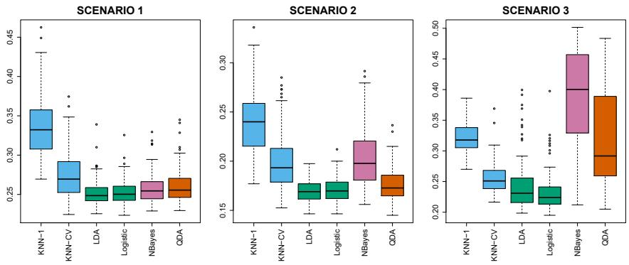  
FIGURE 4.11. Boxplots of the test error rates for each of the linear scenarios described in the main text.

Scenario 1: There were 20 training observations in each of two classes. The observations within each class were uncorrelated random normal variables with a different mean in each class. The left-hand panel of Figure 4.11 shows that LDA performed well in this setting, as one would expect since this is the model assumed by LDA. Logistic regression also performed quite well, since it assumes a linear decision boundary. KNN performed poorly because it paid a price in terms of variance that was not offset by a reduction in bias. QDA also performed worse than LDA, since it fit a more flexible classifier than necessary. The performance of naive Bayes was slightly better than QDA, because the naive Bayes assumption of independent predictors is correct.

Scenario 2: Details are as in Scenario 1, except that within each class, the two predictors had a correlation of -0.5. The center panel of Figure 4.11 indicates that the performance of most methods is similar to the previous scenario. The notable exception is naive Bayes, which performs very poorly here, since the naive Bayes assumption of independent predictors is violated.

Scenario 3: As in the previous scenario, there is substantial negative correlation between the predictors within each class. However, this time we generated $X_{1}$ and $X_{2}$ from the t-distribution, with 50 observations per class. The t-distribution has a similar shape to the normal distribution, but it has a tendency to yield more extreme points—that is, more points that are far from the mean. In this setting, the decision boundary was still linear, and so fit into the logistic regression framework. The set-up violated the assumptions of LDA, since the observations were not drawn from a normal distribution. The right-hand panel of Figure 4.11 shows that logistic regression outperformed LDA, though both methods were superior to the other approaches. In particular, the QDA results deteriorated considerably as a consequence of non-normality. Naive Bayes performed very poorly because the independence assumption is violated.

Scenario 4: The data were generated from a normal distribution, with a correlation of 0.5 between the predictors in the first class, and correlation of -0.5 between the predictors in the second class. This setup corresponded to the QDA assumption, and resulted in quadratic decision boundaries. The left-hand panel of Figure 4.12 shows that QDA outperformed all of the

  
FIGURE 4.12. Boxplots of the test error rates for each of the non-linear scenarios described in the main text.

other approaches. The naive Bayes assumption of independent predictors is violated, so naive Bayes performs poorly.

Scenario 5: The data were generated from a normal distribution with uncorrelated predictors. Then the responses were sampled from the logistic function applied to a complicated non-linear function of the predictors. The center panel of Figure 4.12 shows that both QDA and naive Bayes gave slightly better results than the linear methods, while the much more flexible KNN-CV method gave the best results. But KNN with K = 1 gave the worst results out of all methods. This highlights the fact that even when the data exhibits a complex non-linear relationship, a non-parametric method such as KNN can still give poor results if the level of smoothness is not chosen correctly.

Scenario 6: The observations were generated from a normal distribution with a different diagonal covariance matrix for each class. However, the sample size was very small: just n = 6 in each class. Naive Bayes performed very well, because its assumptions are met. LDA and logistic regression performed poorly because the true decision boundary is non-linear, due to the unequal covariance matrices. QDA performed a bit worse than naive Bayes, because given the very small sample size, the former incurred too much variance in estimating the correlation between the predictors within each class. KNN's performance also suffered due to the very small sample size.

These six examples illustrate that no one method will dominate the others in every situation. When the true decision boundaries are linear, then the LDA and logistic regression approaches will tend to perform well. When the boundaries are moderately non-linear, QDA or naive Bayes may give better results. Finally, for much more complicated decision boundaries, a non-parametric approach such as KNN can be superior. But the level of smoothness for a non-parametric approach must be chosen carefully. In the next chapter we examine a number of approaches for choosing the correct level of smoothness and, in general, for selecting the best overall method.

Finally, recall from Chapter 3 that in the regression setting we can accommodate a non-linear relationship between the predictors and the response by performing regression using transformations of the predictors. A similar approach could be taken in the classification setting. For instance, we could

<table><tr><td></td><td>Coefficient</td><td>Std. error</td><td>t-statistic</td><td>p-value</td></tr><tr><td>Intercept</td><td>73.60</td><td>5.13</td><td>14.34</td><td>0.00</td></tr><tr><td>workingday</td><td>1.27</td><td>1.78</td><td>0.71</td><td>0.48</td></tr><tr><td>temp</td><td>157.21</td><td>10.26</td><td>15.32</td><td>0.00</td></tr><tr><td>weathersit[cloudy/misty]</td><td>-12.89</td><td>1.96</td><td>-6.56</td><td>0.00</td></tr><tr><td>weathersit[light rain/snow]</td><td>-66.49</td><td>2.97</td><td>-22.43</td><td>0.00</td></tr><tr><td>weathersit[heavy rain/snow]</td><td>-109.75</td><td>76.67</td><td>-1.43</td><td>0.15</td></tr></table>

TABLE 4.10. Results for a least squares linear model fit to predict bikers in the Bikeshare data. The predictors mnth and hr are omitted from this table due to space constraints, and can be seen in Figure 4.13. For the qualitative variable weathersit, the baseline level corresponds to clear skies.

create a more flexible version of logistic regression by including $X^2$ , $X^3$ , and even $X^4$ as predictors. This may or may not improve logistic regression's performance, depending on whether the increase in variance due to the added flexibility is offset by a sufficiently large reduction in bias. We could do the same for LDA. If we added all possible quadratic terms and cross-products to LDA, the form of the model would be the same as the QDA model, although the parameter estimates would be different. This device allows us to move somewhere between an LDA and a QDA model.

# 4.6 Generalized Linear Models

In Chapter 3, we assumed that the response Y is quantitative, and explored the use of least squares linear regression to predict Y. Thus far in this chapter, we have instead assumed that Y is qualitative. However, we may sometimes be faced with situations in which Y is neither qualitative nor quantitative, and so neither linear regression from Chapter 3 nor the classification approaches covered in this chapter is applicable.

As a concrete example, we consider the Bikeshare data set. The response is bikers, the number of hourly users of a bike sharing program in Washington, DC. This response value is neither qualitative nor quantitative: instead, it takes on non-negative integer values, or counts. We will consider predicting bikers using the covariates mnth (month of the year), hr (hour of the day, from 0 to 23), workingday (an indicator variable that equals 1 if it is neither a weekend nor a holiday), temp (the normalized temperature, in Celsius), and weathersit (a qualitative variable that takes on one of four possible values: clear; misty or cloudy; light rain or light snow; or heavy rain or heavy snow.)

In the analyses that follow, we will treat mnth, hr, and weathersit as qualitative variables.

# 4.6.1 Linear Regression on the Bikeshare Data

To begin, we consider predicting bikers using linear regression. The results are shown in Table 4.10.

We see, for example, that a progression of weather from clear to cloudy results in, on average, 12.89 fewer bikers per hour; however, if the weather progresses further to rain or snow, then this further results in 53.60 fewer bikers per hour. Figure 4.13 displays the coefficients associated with mnth

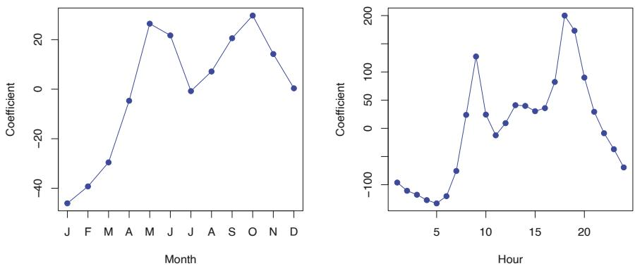  
FIGURE 4.13. A least squares linear regression model was fit to predict bikers in the Bikeshare data set. Left: The coefficients associated with the month of the year. Bike usage is highest in the spring and fall, and lowest in the winter. Right: The coefficients associated with the hour of the day. Bike usage is highest during peak commute times, and lowest overnight.

and the coefficients associated with hr. We see that bike usage is highest in the spring and fall, and lowest during the winter months. Furthermore, bike usage is greatest around rush hour (9 AM and 6 PM), and lowest overnight. Thus, at first glance, fitting a linear regression model to the Bikeshare data set seems to provide reasonable and intuitive results.

But upon more careful inspection, some issues become apparent. For example, 9.6% of the fitted values in the Bikeshare data set are negative: that is, the linear regression model predicts a negative number of users during 9.6% of the hours in the data set. This calls into question our ability to perform meaningful predictions on the data, and it also raises concerns about the accuracy of the coefficient estimates, confidence intervals, and other outputs of the regression model.

Furthermore, it is reasonable to suspect that when the expected value of bikers is small, the variance of bikers should be small as well. For instance, at 2 AM during a heavy December snow storm, we expect that extremely few people will use a bike, and moreover that there should be little variance associated with the number of users during those conditions. This is borne out in the data: between 1 AM and 4 AM, in December, January, and February, when it is raining, there are 5.05 users, on average, with a standard deviation of 3.73. By contrast, between 7 AM and 10 AM, in April, May, and June, when skies are clear, there are 243.59 users, on average, with a standard deviation of 131.7. The mean-variance relationship is displayed in the left-hand panel of Figure 4.14. This is a major violation of the assumptions of a linear model, which state that $Y = \sum_{j=1}^{p} X_{j} \beta_{j} + \epsilon$ , where $\epsilon$ is a mean-zero error term with variance $\sigma^{2}$ that is constant, and not a function of the covariates. Therefore, the heteroscedasticity of the data calls into question the suitability of a linear regression model.

Finally, the response bikers is integer-valued. But under a linear model, $Y = \beta_{0} + \sum_{j=1}^{p} X_{j} \beta_{j} + \epsilon$ , where $\epsilon$ is a continuous-valued error term. This means that in a linear model, the response Y is necessarily continuous-valued (quantitative). Thus, the integer nature of the response bikers suggests that a linear regression model is not entirely satisfactory for this data set.

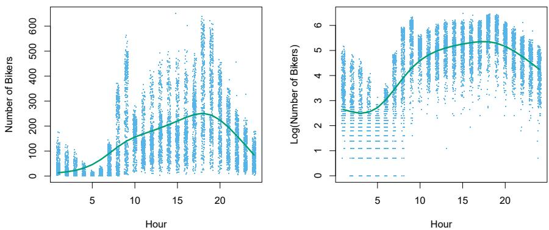  
FIGURE 4.14. Left: On the Bikeshare dataset, the number of bikers is displayed on the y-axis, and the hour of the day is displayed on the x-axis. Jitter was applied for ease of visualization. For the most part, as the mean number of bikers increases, so does the variance in the number of bikers. A smoothing spline fit is shown in green. Right: The log of the number of bikers is now displayed on the y-axis.

Some of the problems that arise when fitting a linear regression model to the Bikeshare data can be overcome by transforming the response; for instance, we can fit the model

$$
\log (Y) = \sum_ {j = 1} ^ {p} X _ {j} \beta_ {j} + \epsilon .
$$

Transforming the response avoids the possibility of negative predictions, and it overcomes much of the heteroscedasticity in the untransformed data, as is shown in the right-hand panel of Figure 4.14. However, it is not quite a satisfactory solution, since predictions and inference are made in terms of the log of the response, rather than the response. This leads to challenges in interpretation, e.g. “a one-unit increase in $X_{j}$ is associated with an increase in the mean of the log of Y by an amount $\beta_{j}$ ”. Furthermore, a log transformation of the response cannot be applied in settings where the response can take on a value of 0. Thus, while fitting a linear model to a transformation of the response may be an adequate approach for some count-valued data sets, it often leaves something to be desired. We will see in the next section that a Poisson regression model provides a much more natural and elegant approach for this task.

# 4.6.2 Poisson Regression on the Bikeshare Data

To overcome the inadequacies of linear regression for analyzing the Bikeshare data set, we will make use of an alternative approach, called Poisson regression. Before we can talk about Poisson regression, we must first introduce the Poisson distribution.

Suppose that a random variable $Y$ takes on nonnegative integer values, i.e. $Y \in \{0, 1, 2, \ldots\}$ . If $Y$ follows the Poisson distribution, then

$$
\Pr (Y = k) = \frac {e ^ {- \lambda} \lambda^ {k}}{k !} \text {for} k = 0, 1, 2, \dots . \tag {4.35}
$$


Poisson
regression
Poisson
distribution

Here, $\lambda > 0$ is the expected value of Y, i.e. $\mathrm{E}(Y)$ . It turns out that $\lambda$ also equals the variance of Y, i.e. $\lambda = \mathrm{E}(Y) = \mathrm{Var}(Y)$ . This means that if Y follows the Poisson distribution, then the larger the mean of Y, the larger its variance. (In (4.35), the notation $k!$ , pronounced “k factorial”, is defined as $k! = k \times (k - 1) \times (k - 2) \times \ldots \times 3 \times 2 \times 1$ .)

The Poisson distribution is typically used to model counts; this is a natural choice for a number of reasons, including the fact that counts, like the Poisson distribution, take on nonnegative integer values. To see how we might use the Poisson distribution in practice, let $Y$ denote the number of users of the bike sharing program during a particular hour of the day, under a particular set of weather conditions, and during a particular month of the year. We might model $Y$ as a Poisson distribution with mean $\mathrm{E}(Y) = \lambda = 5$ . This means that the probability of no users during this particular hour is $\Pr(Y = 0) = \frac{e^{-55^0}}{0!} = e^{-5} = 0.0067$ (where $0! = 1$ by convention). The probability that there is exactly one user is $\Pr(Y = 1) = \frac{e^{-55^1}}{1!} = 5e^{-5} = 0.034$ , the probability of two users is $\Pr(Y = 2) = \frac{e^{-55^2}}{2!} = 0.084$ , and so on.

Of course, in reality, we expect the mean number of users of the bike sharing program, $\lambda = \mathrm{E}(Y)$ , to vary as a function of the hour of the day, the month of the year, the weather conditions, and so forth. So rather than modeling the number of bikers, Y, as a Poisson distribution with a fixed mean value like $\lambda = 5$ , we would like to allow the mean to vary as a function of the covariates. In particular, we consider the following model for the mean $\lambda = \mathrm{E}(Y)$ , which we now write as $\lambda(X_{1}, \ldots, X_{p})$ to emphasize that it is a function of the covariates $X_{1}, \ldots, X_{p}$ :

$$
\log (\lambda (X _ {1}, \dots , X _ {p})) = \beta_ {0} + \beta_ {1} X _ {1} + \dots + \beta_ {p} X _ {p} \tag {4.36}
$$

or equivalently

$$
\lambda (X _ {1}, \dots , X _ {p}) = e ^ {\beta_ {0} + \beta_ {1} X _ {1} + \dots + \beta_ {p} X _ {p}}. \tag {4.37}
$$

Here, $\beta_0, \beta_1, \ldots, \beta_p$ are parameters to be estimated. Together, (4.35) and (4.36) define the Poisson regression model. Notice that in (4.36), we take the log of $\lambda(X_1, \ldots, X_p)$ to be linear in $X_1, \ldots, X_p$ , rather than having $\lambda(X_1, \ldots, X_p)$ itself be linear in $X_1, \ldots, X_p$ ; this ensures that $\lambda(X_1, \ldots, X_p)$ takes on nonnegative values for all values of the covariates.

To estimate the coefficients $\beta_{0},\beta_{1},\ldots,\beta_{p}$ , we use the same maximum likelihood approach that we adopted for logistic regression in Section 4.3.2. Specifically, given n independent observations from the Poisson regression model, the likelihood takes the form

$$
\ell (\beta_ {0}, \beta_ {1}, \dots , \beta_ {p}) = \prod_ {i = 1} ^ {n} \frac {e ^ {- \lambda (x _ {i})} \lambda (x _ {i}) ^ {y _ {i}}}{y _ {i} !}, \tag {4.38}
$$

where $\lambda(x_{i}) = e^{\beta_{0} + \beta_{1}x_{i1} + \cdots + \beta_{p}x_{ip}}$ , due to (4.37). We estimate the coefficients that maximize the likelihood $\ell(\beta_{0}, \beta_{1}, \ldots, \beta_{p})$ , i.e. that make the observed data as likely as possible.

We now fit a Poisson regression model to the Bikeshare data set. The results are shown in Table 4.11 and Figure 4.15. Qualitatively, the results are similar to those from linear regression in Section 4.6.1. We again see that bike usage is highest in the spring and fall and during rush hour,

<table><tr><td></td><td>Coefficient</td><td>Std. error</td><td>z-statistic</td><td>p-value</td></tr><tr><td>Intercept</td><td>4.12</td><td>0.01</td><td>683.96</td><td>0.00</td></tr><tr><td>workingday</td><td>0.01</td><td>0.00</td><td>7.5</td><td>0.00</td></tr><tr><td>temp</td><td>0.79</td><td>0.01</td><td>68.43</td><td>0.00</td></tr><tr><td>weathersit[cloudy/misty]</td><td>-0.08</td><td>0.00</td><td>-34.53</td><td>0.00</td></tr><tr><td>weathersit[light rain/snow]</td><td>-0.58</td><td>0.00</td><td>-141.91</td><td>0.00</td></tr><tr><td>weathersit[heavy rain/snow]</td><td>-0.93</td><td>0.17</td><td>-5.55</td><td>0.00</td></tr></table>

TABLE 4.11. Results for a Poisson regression model fit to predict bikers in the Bikeshare data. The predictors mnth and hr are omitted from this table due to space constraints, and can be seen in Figure 4.15. For the qualitative variable weathersit, the baseline corresponds to clear skies.

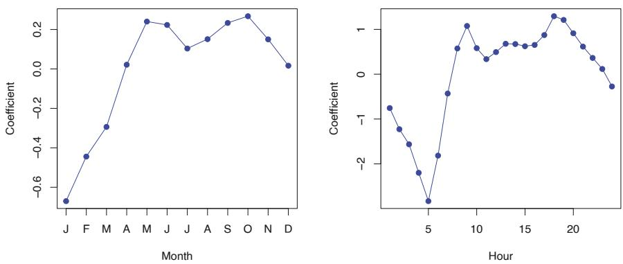  
FIGURE 4.15. A Poisson regression model was fit to predict bikers in the Bikeshare data set. Left: The coefficients associated with the month of the year. Bike usage is highest in the spring and fall, and lowest in the winter. Right: The coefficients associated with the hour of the day. Bike usage is highest during peak commute times, and lowest overnight.

and lowest during the winter and in the early morning hours. Moreover, bike usage increases as the temperature increases, and decreases as the weather worsens. Interestingly, the coefficient associated with workingday is statistically significant under the Poisson regression model, but not under the linear regression model.

Some important distinctions between the Poisson regression model and the linear regression model are as follows:

\- Interpretation: To interpret the coefficients in the Poisson regression model, we must pay close attention to (4.37), which states that an increase in $X_{j}$ by one unit is associated with a change in $\mathrm{E}(Y) = \lambda$ by a factor of $\exp (\beta_j)$ . For example, a change in weather from clear to cloudy skies is associated with a change in mean bike usage by a factor of $\exp (-0.08) = 0.923$ , i.e. on average, only $92.3\%$ as many people will use bikes when it is cloudy relative to when it is clear. If the weather worsens further and it begins to rain, then the mean bike usage will further change by a factor of $\exp (-0.5) = 0.607$ , i.e. on average only $60.7\%$ as many people will use bikes when it is rainy relative to when it is cloudy.

\- Mean-variance relationship: As mentioned earlier, under the Poisson model, $\lambda = \mathrm{E}(Y) = \mathrm{Var}(Y)$ . Thus, by modeling bike usage with a Poisson regression, we implicitly assume that mean bike usage in a given hour equals the variance of bike usage during that hour. By contrast, under a linear regression model, the variance of bike usage always takes on a constant value. Recall from Figure 4.14 that in the Bikeshare data, when biking conditions are favorable, both the mean and the variance in bike usage are much higher than when conditions are unfavorable. Thus, the Poisson regression model is able to handle the mean-variance relationship seen in the Bikeshare data in a way that the linear regression model is not. $^{5}$

\- nonnegative fitted values: There are no negative predictions using the Poisson regression model. This is because the Poisson model itself only allows for nonnegative values; see (4.35). By contrast, when we fit a linear regression model to the Bikeshare data set, almost 10% of the predictions were negative.

overdispersion

# 4.6.3 Generalized Linear Models in Greater Generality

We have now discussed three types of regression models: linear, logistic and Poisson. These approaches share some common characteristics:


1. Each approach uses predictors $X_{1},\ldots ,X_{p}$ to predict a response $Y$ . We assume that, conditional on $X_{1},\ldots ,X_{p}$ , $Y$ belongs to a certain family of distributions. For linear regression, we typically assume that $Y$ follows a Gaussian or normal distribution. For logistic regression, we assume that $Y$ follows a Bernoulli distribution. Finally, for Poisson regression, we assume that $Y$ follows a Poisson distribution.

2. Each approach models the mean of $Y$ as a function of the predictors. In linear regression, the mean of $Y$ takes the form

$$
\mathrm{E} (Y | X _ {1}, \dots , X _ {p}) = \beta_ {0} + \beta_ {1} X _ {1} + \dots + \beta_ {p} X _ {p}, \tag {4.39}
$$

i.e. it is a linear function of the predictors. For logistic regression, the mean instead takes the form

$$
\begin{array}{l} \mathrm{E} (Y | X _ {1}, \dots , X _ {p}) = \Pr (Y = 1 | X _ {1}, \dots , X _ {p}) \\ = \frac {e ^ {\beta_ {0} + \beta_ {1} X _ {1} + \cdots + \beta_ {p} X _ {p}}}{1 + e ^ {\beta_ {0} + \beta_ {1} X _ {1} + \cdots + \beta_ {p} X _ {p}}}, \tag {4.40} \\ \end{array}
$$

while for Poisson regression it takes the form

$$
\mathrm{E} (Y | X _ {1}, \dots , X _ {p}) = \lambda (X _ {1}, \dots , X _ {p}) = e ^ {\beta_ {0} + \beta_ {1} X _ {1} + \dots + \beta_ {p} X _ {p}}. \tag {4.41}
$$

Equations (4.39)-(4.41) can be expressed using a link function, $\eta$ , which

link function

applies a transformation to $\operatorname{E}(Y|X_1, \ldots, X_p)$ so that the transformed mean is a linear function of the predictors. That is,

$$
\eta (\mathrm{E} (Y | X _ {1}, \dots , X _ {p})) = \beta_ {0} + \beta_ {1} X _ {1} + \dots + \beta_ {p} X _ {p}. \tag {4.42}
$$

The link functions for linear, logistic and Poisson regression are $\eta(\mu) = \mu$ , $\eta(\mu) = \log(\mu/(1 - \mu))$ , and $\eta(\mu) = \log(\mu)$ , respectively.

The Gaussian, Bernoulli and Poisson distributions are all members of a wider class of distributions, known as the exponential family. Other well-known members of this family are the exponential distribution, the Gamma distribution, and the negative binomial distribution. In general, we can perform a regression by modeling the response Y as coming from a particular member of the exponential family, and then transforming the mean of the response so that the transformed mean is a linear function of the predictors via $(4.42)$ . Any regression approach that follows this very general recipe is known as a generalized linear model (GLM). Thus, linear regression, logistic regression, and Poisson regression are three examples of GLMs. Other examples not covered here include Gamma regression and negative binomial regression.

exponential
family
exponential
Gamma
negative
binomial

generalized linear model

# 4.7 Lab: Logistic Regression, LDA, QDA, and KNN

# 4.7.1 The Stock Market Data

In this lab we will examine the Smarket data, which is part of the ISLP library. This data set consists of percentage returns for the S&P 500 stock index over 1,250 days, from the beginning of 2001 until the end of 2005. For each date, we have recorded the percentage returns for each of the five previous trading days, Lag1 through Lag5. We have also recorded Volume (the number of shares traded on the previous day, in billions), Today (the percentage return on the date in question) and Direction (whether the market was Up or Down on this date).

We start by importing our libraries at this top level; these are all imports we have seen in previous labs.

In [1]:  
```python
import numpy as np
import pandas as pd
from matplotlib.pyplot import subplots
import statsmodels.api as sm
from ISLP import load_data
from ISLP.models import (ModelSpec as MS,
                              summarize)
```

We also collect together the new imports needed for this lab.

In [2]:  
```python
from ISLP import confusion_table
from ISLP.models import contrast
from sklearn.discriminant_analysis import \
    (LinearDiscriminantAnalysis as LDA,
        QuadraticDiscriminantAnalysis as QDA)
from sklearn.naive_bayes import GaussianNB
from sklearn.neighbors import KNeighborsClassifier
from sklearn.preprocessing import StandardScaler
```

```python
from sklearn.model_selection import train_test_split
from sklearn.linear_model import LogisticRegression
```

Now we are ready to load the Smarket data.

```python
In [3]: Smarket = load_data('Smarket')
    Smarket
```

This gives a truncated listing of the data, which we do not show here. We can see what the variable names are.

```txt
In [4]: Smarket.columns
```

```javascript
Out[4]: Index(['Year', 'Lag1', 'Lag2', 'Lag3', 'Lag4', 'Lag5', 'Volume',
            'Today', 'Direction'],
        dtype='object')
```

We compute the correlation matrix using the corr() method for data frames, which produces a matrix that contains all of the pairwise correlations among the variables. (We suppress the output here.) The pandas library does not report a correlation for the Direction variable because it is qualitative.

```txt
In [5]: Smarket.corr()
```

As one would expect, the correlations between the lagged return variables and today's return are close to zero. The only substantial correlation is between Year and Volume. By plotting the data we see that Volume is increasing over time. In other words, the average number of shares traded daily increased from 2001 to 2005.

```javascript
In [6]: Smarket.plot(y='Volume');
```

# 4.7.2 Logistic Regression

Next, we will fit a logistic regression model in order to predict Direction using Lag1 through Lag5 and Volume. The sm.GLM() function fits generalized linear models, a class of models that includes logistic regression. Alternatively, the function sm.Logit() fits a logistic regression model directly. The syntax of sm.GLM() is similar to that of sm.OLS(), except that we must pass in the argument family=sm.families.Binomial() in order to tell statsmodels to run a logistic regression rather than some other type of generalized linear model.

```python
In [7]: allvars = Smarket.columns.drop(['Today', 'Direction', 'Year'])
design = MS(allvars)
X = design.fit_transform(Smarket)
y = Smarket.Direction == 'Up'
glm = sm.GLM(y,
                       X,
                       family=sm.families.Binomial())
results = glm.fit()
summarize(results)
```

.corr()

sm.GLM()
generalized
linear model

<table><tr><td>Out[7]:</td><td>coef</td><td>std err</td><td>z</td><td>P&gt;|z|</td></tr><tr><td>intercept</td><td>-0.1260</td><td>0.241</td><td>-0.523</td><td>0.601</td></tr><tr><td>Lag1</td><td>-0.0731</td><td>0.050</td><td>-1.457</td><td>0.145</td></tr><tr><td>Lag2</td><td>-0.0423</td><td>0.050</td><td>-0.845</td><td>0.398</td></tr><tr><td>Lag3</td><td>0.0111</td><td>0.050</td><td>0.222</td><td>0.824</td></tr><tr><td>Lag4</td><td>0.0094</td><td>0.050</td><td>0.187</td><td>0.851</td></tr><tr><td>Lag5</td><td>0.0103</td><td>0.050</td><td>0.208</td><td>0.835</td></tr><tr><td>Volume</td><td>0.1354</td><td>0.158</td><td>0.855</td><td>0.392</td></tr></table>

The smallest p-value here is associated with Lag1. The negative coefficient for this predictor suggests that if the market had a positive return yesterday, then it is less likely to go up today. However, at a value of 0.15, the p-value is still relatively large, and so there is no clear evidence of a real association between Lag1 and Direction.

We use the params attribute of results in order to access just the coefficients for this fitted model.

In [8]: results.params  
```txt
Out[8]: intercept      -0.126000
        Lag1            -0.073074
        Lag2            -0.042301
        Lag3            0.011085
        Lag4            0.009359
        Lag5            0.010313
        Volume        0.135441
        dtype: float64
```

Likewise we can use the pvalues attribute to access the p-values for the coefficients (not shown).

In [9]: results.pvalues

The predict() method of results can be used to predict the probability that the market will go up, given values of the predictors. This method returns predictions on the probability scale. If no data set is supplied to the predict() function, then the probabilities are computed for the training data that was used to fit the logistic regression model. As with linear regression, one can pass an optional exog argument consistent with a design matrix if desired. Here we have printed only the first ten probabilities.

```txt
In [10]: probs = results.predict()
    probs[:10]
```

```txt
Out[10]: array([0.5070841, 0.4814679, 0.4811388, 0.5152223, 0.5107812,
       0.5069565, 0.4926509, 0.5092292, 0.5176135, 0.4888378])
```

In order to make a prediction as to whether the market will go up or down on a particular day, we must convert these predicted probabilities into class labels, Up or Down. The following two commands create a vector of class predictions based on whether the predicted probability of a market increase is greater than or less than 0.5.

```python
In [11]: labels = np.array(['Down']*1250)
labels[probs>0.5] = "Up"
```

The confusion\_table() function from the ISLP package summarizes these predictions, showing how many observations were correctly or incorrectly classified. Our function, which is adapted from a similar function in the module sklearn.metrics, transposes the resulting matrix and includes row and column labels. The confusion\_table() function takes as first argument the predicted labels, and second argument the true labels.

confusion\_
table()

```txt
In [12]: confusion_table(labels, Smarket.Direction)
```

```txt
Out[12]:         Truth  Down      Up
        Predicted
        Down      145     141
        Up      457     507
```

The diagonal elements of the confusion matrix indicate correct predictions, while the off-diagonals represent incorrect predictions. Hence our model correctly predicted that the market would go up on 507 days and that it would go down on 145 days, for a total of $507 + 145 = 652$ correct predictions. The np.mean() function can be used to compute the fraction of days for which the prediction was correct. In this case, logistic regression correctly predicted the movement of the market 52.2% of the time.

```javascript
In [13]: (507+145)/1250, np.mean(labels == Smarket.Direction)
```

```javascript
Out[13]: (0.5216, 0.5216)
```

At first glance, it appears that the logistic regression model is working a little better than random guessing. However, this result is misleading because we trained and tested the model on the same set of 1,250 observations. In other words, $100 - 52.2 = 47.8\%$ is the training error rate. As we have seen previously, the training error rate is often overly optimistic — it tends to underestimate the test error rate. In order to better assess the accuracy of the logistic regression model in this setting, we can fit the model using part of the data, and then examine how well it predicts the held out data. This will yield a more realistic error rate, in the sense that in practice we will be interested in our model's performance not on the data that we used to fit the model, but rather on days in the future for which the market's movements are unknown.

To implement this strategy, we first create a Boolean vector corresponding to the observations from 2001 through 2004. We then use this vector to create a held out data set of observations from 2005.

```txt
train = (Smarket.Year < 2005)
Smarket_train = Smarket.loc[train]
Smarket_test = Smarket.loc[~train]
Smarket_test.shape
```

```javascript
Out[14]: (252, 9)
```

The object train is a vector of 1,250 elements, corresponding to the observations in our data set. The elements of the vector that correspond to observations that occurred before 2005 are set to True, whereas those that correspond to observations in 2005 are set to False. Hence train is a boolean array, since its elements are True and False. Boolean arrays can be used to obtain a subset of the rows or columns of a data frame using the

loc method. For instance, the command Smarket.loc[train] would pick out a submatrix of the stock market data set, corresponding only to the dates before 2005, since those are the ones for which the elements of train are True. The $\sim$ symbol can be used to negate all of the elements of a Boolean vector. That is, $\sim$ train is a vector similar to train, except that the elements that are True in train get swapped to False in $\sim$ train, and vice versa. Therefore, Smarket.loc[ $\sim$ train] yields a subset of the rows of the data frame of the stock market data containing only the observations for which train is False. The output above indicates that there are 252 such observations.

We now fit a logistic regression model using only the subset of the observations that correspond to dates before 2005. We then obtain predicted probabilities of the stock market going up for each of the days in our test set — that is, for the days in 2005.

```python
In [15]: X_train, X_test = X.loc[train], X.loc[~train]
y_train, y_test = y.loc[train], y.loc[~train]
glm_train = sm.GLM(y_train,
                          X_train,
                          family=sm.families.Binomial())
results = glm_train.fit()
probs = results.predict(exog=X_test)
```

Notice that we have trained and tested our model on two completely separate data sets: training was performed using only the dates before 2005, and testing was performed using only the dates in 2005.

Finally, we compare the predictions for 2005 to the actual movements of the market over that time period. We will first store the test and training labels (recall y\_test is binary).

```python
In [16]: D = Smarket.Direction
    L_train, L_test = D.loc[train], D.loc[~train]
```

Now we threshold the fitted probability at 50% to form our predicted labels.

```python
In [17]: labels = np.array(['Down']*252)
labels[probs>0.5] = 'Up'
confusion_table(labels, L_test)
```

```txt
Out[17]:         Truth  Down  Up
        Predicted
        Down      77  97
        Up      34  44
```

The test accuracy is about 48% while the error rate is about 52%

```txt
In [18]: np.mean(labels == L_test), np.mean(labels != L_test)
```

```javascript
Out[18]: (0.4802, 0.5198)
```

The != notation means not equal to, and so the last command computes the test set error rate. The results are rather disappointing: the test error rate is 52%, which is worse than random guessing! Of course this result is not all that surprising, given that one would not generally expect to be able to use previous days' returns to predict future market performance. (After all, if it were possible to do so, then the authors of this book would be out striking it rich rather than writing a statistics textbook.)

We recall that the logistic regression model had very underwhelming p-values associated with all of the predictors, and that the smallest p-value, though not very small, corresponded to Lag1. Perhaps by removing the variables that appear not to be helpful in predicting Direction, we can obtain a more effective model. After all, using predictors that have no relationship with the response tends to cause a deterioration in the test error rate (since such predictors cause an increase in variance without a corresponding decrease in bias), and so removing such predictors may in turn yield an improvement. Below we refit the logistic regression using just Lag1 and Lag2, which seemed to have the highest predictive power in the original logistic regression model.

```python
model = MS(['Lag1', 'Lag2']).fit(Smarket)
X = model.transform(Smarket)
X_train, X_test = X.loc[train], X.loc[~train]
glm_train = sm.GLM(y_train,
                          X_train,
                          family=sm.families.Binomial())
results = glm_train.fit()
probs = results.predict(exog=X_test)
labels = np.array(['Down']*252)
labels[probs>0.5] = 'Up'
confusion_table(labels, L_test)
```

```txt
Out[19]:         Truth  Down      Up
        Predicted
        Down       35     35
        Up       76     106
```

Let's evaluate the overall accuracy as well as the accuracy within the days when logistic regression predicts an increase.

```javascript
In [20]: (35+106)/252,106/(106+76)
```

```javascript
Out[20]: (0.5595, 0.5824)
```

Now the results appear to be a little better: 56% of the daily movements have been correctly predicted. It is worth noting that in this case, a much simpler strategy of predicting that the market will increase every day will also be correct 56% of the time! Hence, in terms of overall error rate, the logistic regression method is no better than the naive approach. However, the confusion matrix shows that on days when logistic regression predicts an increase in the market, it has a 58% accuracy rate. This suggests a possible trading strategy of buying on days when the model predicts an increasing market, and avoiding trades on days when a decrease is predicted. Of course one would need to investigate more carefully whether this small improvement was real or just due to random chance.

Suppose that we want to predict the returns associated with particular values of Lag1 and Lag2. In particular, we want to predict Direction on a day when Lag1 and Lag2 equal 1.2 and 1.1, respectively, and on a day when they equal 1.5 and -0.8. We do this using the predict() function.

```txt
In [21]: newdata = pd.DataFrame({'Lag1':[1.2, 1.5],
                          'Lag2':[1.1, -0.8]});
```

```txt
newX = model.transform(newdata)
results.predict(newX)
```

```txt
Out[21]: 0      0.4791
      1      0.4961
      dtype: float64
```

# 4.7.3 Linear Discriminant Analysis

We begin by performing LDA on the Smarket data, using the function LinearDiscriminantAnalysis(), which we have abbreviated LDA(). We fit the model using only the observations before 2005.

```txt
Linear
Discriminant
Analysis()
```

```txt
In [22]: lda = LDA(store_covariance=True)
```

Since the LDA estimator automatically adds an intercept, we should remove the column corresponding to the intercept in both X\_train and X\_test. We can also directly use the labels rather than the Boolean vectors y\_train.

```python
In [23]: X_train, X_test = [M.drop(columns=['intercept'])
                   for M in [X_train, X_test]]
    lda.fit(X_train, L_train)
```

```txt
Out[23]: LinearDiscriminantAnalysis(store_covariance=True)
```

Here we have used the list comprehensions introduced in Section 3.6.4. Looking at our first line above, we see that the right-hand side is a list of length two. This is because the code for M in [X\_train, X\_test] iterates over a list of length two. While here we loop over a list, the list comprehension method works when looping over any iterable object. We then apply the drop() method to each element in the iteration, collecting the result in a list. The left-hand side tells Python to unpack this list of length two, assigning its elements to the variables X\_train and X\_test. Of course, this overwrites the previous values of X\_train and X\_test.

```txt
.drop()
```

Having fit the model, we can extract the means in the two classes with the means\_ attribute. These are the average of each predictor within each class, and are used by LDA as estimates of $\mu_{k}$ . These suggest that there is a tendency for the previous 2 days' returns to be negative on days when the market increases, and a tendency for the previous days' returns to be positive on days when the market declines.

```txt
In [24]: lda.means_
```

```txt
Out[24]: array([[ 0.04,  0.03],
                  [-0.04, -0.03]])
```

The estimated prior probabilities are stored in the priors\_ attribute. The package sklearn typically uses this trailing \_ to denote a quantity estimated when using the fit() method. We can be sure of which entry corresponds to which label by looking at the classes\_ attribute.

```txt
In [25]: lda.classes_
```

```txt
Out[25]: array(['Down', 'Up'], dtype='<U4')
```

The LDA output indicates that $\hat{\pi}_{Down} = 0.492$ and $\hat{\pi}_{Up} = 0.508$ .

```txt
In [26]: lda.priors_
```

```txt
Out[26]: array([0.492, 0.508])
```

The linear discriminant vectors can be found in the scalings\_ attribute:

```txt
In [27]: lda.scalings_
```

```python
Out[27]: array([[-0.642],
            [-0.513]])
```

These values provide the linear combination of Lag1 and Lag2 that are used to form the LDA decision rule. In other words, these are the multipliers of the elements of X = x in $(4.24)$ . If $-0.64 \times \text{Lag1} - 0.51 \times \text{Lag2}$ is large, then the LDA classifier will predict a market increase, and if it is small, then the LDA classifier will predict a market decline.

```python
In [28]: lda_pred = lda.predict(X_test)
```

As we observed in our comparison of classification methods (Section 4.5), the LDA and logistic regression predictions are almost identical.

```txt
In [29]: confusion_table(lda_pred, L_test)
```

```python
Out[29]:         Truth      Down      Up
        Predicted
        Down         35     35
        Up         76     106
```

We can also estimate the probability of each class for each point in a training set. Applying a 50% threshold to the posterior probabilities of being in class one allows us to recreate the predictions contained in lda\_pred.

```python
In [30]: lda_prob = lda.predict_proba(X_test)
    np.all(
        np.where(lda_prob[:,1] >= 0.5, 'Up','Down') == lda_pred
        )
```

```txt
Out[30]: True
```

Above, we used the np.where() function that creates an array with value 'Up' for indices where the second column of lda\_prob (the estimated posterior probability of 'Up') is greater than 0.5. For problems with more than two classes the labels are chosen as the class whose posterior probability is highest:

```python
In [31]: np.all(
            [lda.classes_ [i] for i in np.argmax(lda_prob, 1)] ==
            lda_pred
        )
```

```txt
Out[31]: True
```

If we wanted to use a posterior probability threshold other than 50% in order to make predictions, then we could easily do so. For instance, suppose that we wish to predict a market decrease only if we are very certain that the

market will indeed decrease on that day — say, if the posterior probability is at least 90%. We know that the first column of lda\_prob corresponds to the label Down after having checked the classes\_ attribute, hence we use the column index 0 rather than 1 as we did above.

```txt
In [32]: np.sum(lda_prob[:,0] > 0.9)
```

```ocaml
Out [32] : 0
```

No days in 2005 meet that threshold! In fact, the greatest posterior probability of decrease in all of 2005 was 52.02%.

The LDA classifier above is the first classifier from the sklearn library. We will use several other objects from this library. The objects follow a common structure that simplifies tasks such as cross-validation, which we will see in Chapter 5. Specifically, the methods first create a generic classifier without referring to any data. This classifier is then fit to data with the fit() method and predictions are always produced with the predict() method. This pattern of first instantiating the classifier, followed by fitting it, and then producing predictions is an explicit design choice of sklearn. This uniformity makes it possible to cleanly copy the classifier so that it can be fit on different data; e.g. different training sets arising in cross-validation. This standard pattern also allows for a predictable formation of workflows.

# 4.7.4 Quadratic Discriminant Analysis

We will now fit a QDA model to the Smarket data. QDA is implemented via QuadraticDiscriminantAnalysis() in the sklearn package, which we abbreviate to QDA(). The syntax is very similar to LDA().

Quadratic
Discriminant
Analysis()

```python
In [33]: qda = QDA(store_covariance=True)
qda.fit(X_train, L_train)
```

```python
Out[33]: QuadraticDiscriminantAnalysis(store_covariance=True)
```

The QDA() function will again compute means\_ and priors\_.

```txt
In [34]: qda.means_, qda.priors_
```

```python
Out[34]: (array([[ 0.04279022,  0.03389409],
                  [-0.03954635, -0.03132544]]),
        array([0.49198397, 0.50801603]))
```

The QDA() classifier will estimate one covariance per class. Here is the estimated covariance in the first class:

```txt
In [35]: qda.covariance_[0]
```

```python
Out[35]: array([[ 1.50662277, -0.03924806],
                  [-0.03924806,  1.53559498]])
```

The output contains the group means. But it does not contain the coefficients of the linear discriminants, because the QDA classifier involves a quadratic, rather than a linear, function of the predictors. The predict() function works in exactly the same fashion as for LDA.

```python
In [36]: qda_pred = qda.predict(X_test)
    confusion_table(qda_pred, L_test)
```

```txt
Out[36]:         Truth      Down      Up
        Predicted
        Down       30      20
        Up       81      121
```

Interestingly, the QDA predictions are accurate almost 60% of the time, even though the 2005 data was not used to fit the model.

```txt
In [37]: np.mean(qda_pred == L_test)
```

```txt
Out [37]: 0.599
```

This level of accuracy is quite impressive for stock market data, which is known to be quite hard to model accurately. This suggests that the quadratic form assumed by QDA may capture the true relationship more accurately than the linear forms assumed by LDA and logistic regression. However, we recommend evaluating this method's performance on a larger test set before betting that this approach will consistently beat the market!

# 4.7.5 Naive Bayes

Next, we fit a naive Bayes model to the Smarket data. The syntax is similar to that of LDA() and QDA(). By default, this implementation GaussianNB() of the naive Bayes classifier models each quantitative feature using a Gaussian distribution. However, a kernel density method can also be used to estimate the distributions.

GaussianNB()

```python
In [38]: NB = GaussianNB()
NB.fit(X_train, L_train)
```

```javascript
Out[38]: GaussianNB()
```

The classes are stored as classes\_.

```txt
In [39]: NB.classes_
```

```txt
Out[39]: array(['Down', 'Up'], dtype=<U4')
```

The class prior probabilities are stored in the class\_prior\_ attribute.

```txt
In [40]: NB.class_prior_
```

```txt
Out[40]: array([0.49, 0.51])
```

The parameters of the features can be found in the theta\_ and var\_ attributes. The number of rows is equal to the number of classes, while the number of columns is equal to the number of features. We see below that the mean for feature Lag1 in the Down class is 0.043.

```txt
In [41]: NB.theta_
```

```python
Out[41]: array([[ 0.043,  0.034],
              [-0.040, -0.031]])
```

Its variance is 1.503.

```txt
In [42]: NB.var_
```

```python
Out[42]: array([[1.503, 1.532],
              [1.514, 1.487]])
```

How do we know the names of these attributes? We use NB? (or ?NB).

We can easily verify the mean computation:

```python
In [43]: X_train[L_train == 'Down'].mean()
```

```python
Out[43]: Lag1      0.042790
        Lag2      0.033894
        dtype: float64
```

Similarly for the variance:

```python
In [44]: X_train[L_train == 'Down'].var(ddof=0)
```

```python
Out[44]: Lag1      1.503554
        Lag2      1.532467
        dtype: float64
```

The GaussianNB() function calculates variances using the 1/n formula. $^{6}$ Since NB() is a classifier in the sklearn library, making predictions uses the same syntax as for LDA() and QDA() above.

```python
In [45]: nb_labels = NB.predict(X_test)
    confusion_table(nb_labels, L_test)
```

```txt
Out[45]:         Truth      Down      Up
        Predicted
        Down       29      20
        Up       82      121
```

Naive Bayes performs well on these data, with accurate predictions over 59% of the time. This is slightly worse than QDA, but much better than LDA.

As for LDA, the predict\_proba() method estimates the probability that each observation belongs to a particular class.

```python
In [46]: NB.predict_proba(X_test)[:5]
```

```python
Out[46]: array([[0.4873, 0.5127],
               [0.4762, 0.5238],
               [0.4653, 0.5347],
               [0.4748, 0.5252],
               [0.4902, 0.5098]])
```

# 4.7.6 K-Nearest Neighbors

We will now perform KNN using the KNeighborsClassifier() function. This

KNeighbors
Classifier()
function works similarly to the other model-fitting functions that we have encountered thus far.

As is the case for LDA and QDA, we fit the classifier using the fit method. New predictions are formed using the predict method of the object returned by fit().

```txt
knn1 = KNeighborsClassifier(n_neighbors=1)
knn1.fit(X_train, L_train)
knn1_pred = knn1.predict(X_test)
confusion_table(knn1_pred, L_test)
```

```txt
Out[47]:         Truth      Down   Up
        Predicted
        Down       43   58
        Up       68   83
```

The results using K = 1 are not very good, since only 50% of the observations are correctly predicted. Of course, it may be that K = 1 results in an overly-flexible fit to the data.

```javascript
In [48]: (83+43)/252, np.mean(knn1_pred == L_test)
```

```txt
Out[48]: (0.5, 0.5)
```

We repeat the analysis below using K = 3.

```txt
knn3 = KNeighborsClassifier(n_neighbors=3)
knn3_pred = knn3.fit(X_train, L_train).predict(X_test)
np.mean(knn3_pred == L_test)
```

```txt
Out [49]: 0.532
```

The results have improved slightly. But increasing K further provides no further improvements. It appears that for these data, and this train/test split, QDA gives the best results of the methods that we have examined so far.

KNN does not perform well on the Smarket data, but it often does provide impressive results. As an example we will apply the KNN approach to the Caravan data set, which is part of the ISLP library. This data set includes 85 predictors that measure demographic characteristics for 5,822 individuals. The response variable is Purchase, which indicates whether or not a given individual purchases a caravan insurance policy. In this data set, only 6% of people purchased caravan insurance.

```python
In [50]: Caravan = load_data('Caravan')
Purchase = Caravan.Purchase
Purchase.value_counts()
```

```txt
Out[50]: No      5474
    Yes      348
    Name: Purchase, dtype: int64
```

The method value\_counts() takes a pd.Series or pd.DataFrame and returns a pd.Series with the corresponding counts for each unique element. In this case Purchase has only Yes and No values and returns how many values of each there are.

```txt
In [51]: 348 / 5822
```

```txt
Out[51]:0.0598
```

Our features will include all columns except Purchase.

```python
In [52]: feature_df = Caravan.drop(columns=['Purchase'])
```

Because the KNN classifier predicts the class of a given test observation by identifying the observations that are nearest to it, the scale of the variables matters. Any variables that are on a large scale will have a much larger effect on the distance between the observations, and hence on the KNN classifier, than variables that are on a small scale. For instance, imagine a data set that contains two variables, salary and age (measured in dollars and years, respectively). As far as KNN is concerned, a difference of 1,000 USD in salary is enormous compared to a difference of 50 years in age. Consequently, salary will drive the KNN classification results, and age will have almost no effect. This is contrary to our intuition that a salary difference of 1,000 USD is quite small compared to an age difference of 50 years. Furthermore, the importance of scale to the KNN classifier leads to another issue: if we measured salary in Japanese yen, or if we measured age in minutes, then we'd get quite different classification results from what we get if these two variables are measured in dollars and years.

A good way to handle this problem is to standardize the data so that all variables are given a mean of zero and a standard deviation of one. Then all variables will be on a comparable scale. This is accomplished using the StandardScaler() transformation.

standardize

```python
In [53]: scaler = StandardScaler(with_mean=True,
                               with_std=True,
                               copy=True)
```

Standard
Scaler()

The argument with\_mean indicates whether or not we should subtract the mean, while with\_std indicates whether or not we should scale the columns to have standard deviation of 1 or not. Finally, the argument copy=True indicates that we will always copy data, rather than trying to do calculations in place where possible.

This transformation can be fit and then applied to arbitrary data. In the first line below, the parameters for the scaling are computed and stored in scaler, while the second line actually constructs the standardized set of features.

```python
In [54]: scaler.fit(feature_df)
    X_std = scaler.transform(feature_df)
```

Now every column of feature\_std below has a standard deviation of one and a mean of zero.

```python
In [55]: feature_std = pd.DataFrame(
                          X_std,
                          columns=feature_df.columns);
feature_std.std()
```

```txt
Out[55]: MOSTYPE          1.000086
        MAANTHUI       1.000086
```

```txt
MGEMOMV          1.000086
MGEMLEEF       1.000086
MOSHOOFD       1.000086
        ...
AZEILPL       1.000086
APLEZIER       1.000086
AFIETS       1.000086
AINBOED       1.000086
ABYSTAND       1.000086
Length: 85, dtype: float64
```

Notice that the standard deviations are not quite 1 here; this is again due to some procedures using the 1/n convention for variances (in this case scaler()), while others use $1/(n-1)$ (the std() method). See the footnote on page 183. In this case it does not matter, as long as the variables are all on the same scale.

.std()

Using the function train\_test\_split() we now split the observations into a test set, containing 1000 observations, and a training set containing the remaining observations. The argument random\_state=0 ensures that we get the same split each time we rerun the code.

train\_test\_
split()

In [56]:  
```python
(X_train,
  X_test,
  y_train,
  y_test) = train_test_split(feature_std,
                               Purchase,
                               test_size=1000,
                               random_state=0)
```

?train\_test\_split reveals that the non-keyword arguments can be lists, arrays, pandas dataframes etc that all have the same length (shape[0]) and hence are indexable. In this case they are the dataframe feature\_std and the response variable Purchase. We fit a KNN model on the training data using $K = 1$ , and evaluate its performance on the test data.

indexable

In [57]:  
```python
knn1 = KNeighborsClassifier(n_neighbors=1)
knn1_pred = knn1.fit(X_train, y_train).predict(X_test)
np.mean(y_test != knn1_pred), np.mean(y_test != "No")
```  
Out[57]: (0.111, 0.067)

The KNN error rate on the 1,000 test observations is about 11%. At first glance, this may appear to be fairly good. However, since just over 6% of customers purchased insurance, we could get the error rate down to almost 6% by always predicting No regardless of the values of the predictors! This is known as the null rate.

null rate

Suppose that there is some non-trivial cost to trying to sell insurance to a given individual. For instance, perhaps a salesperson must visit each potential customer. If the company tries to sell insurance to a random selection of customers, then the success rate will be only 6%, which may be far too low given the costs involved. Instead, the company would like to try to sell insurance only to customers who are likely to buy it. So the overall error rate is not of interest. Instead, the fraction of individuals that are correctly predicted to buy insurance is of interest.

In [58]:  
```python
confusion_table(knn1_pred, y_test)
```

```txt
Out[58]:         Truth    No    Yes
        Predicted
            No    880    58
            Yes    53    9
```

It turns out that KNN with K = 1 does far better than random guessing among the customers that are predicted to buy insurance. Among 62 such customers, 9, or 14.5%, actually do purchase insurance. This is double the rate that one would obtain from random guessing.

```txt
In [59]: 9/(53+9)
```

```txt
Out [59]: 0.145
```

# Tuning Parameters

The number of neighbors in KNN is referred to as a tuning parameter, also referred to as a hyperparameter. We do not know a priori what value to use. It is therefore of interest to see how the classifier performs on test data as we vary these parameters. This can be achieved with a for loop, described in Section 2.3.8. Here we use a for loop to look at the accuracy of our classifier in the group predicted to purchase insurance as we vary the number of neighbors from 1 to 5:

tuning
parameter
hyper-
parameter

```python
for K in range(1,6):
    knn = KNeighborsClassifier(n_neighbors=K)
    knn_pred = knn.fit(X_train, y_train).predict(X_test)
    C = confusion_table(knn_pred, y_test)
    templ = ('K={0:d}: # predicted to rent: {1:>2},' +
        '    # who did rent {2:d}, accuracy {3:.1%}')
    pred = C.loc['Yes'].sum()
    did_rent = C.loc['Yes','Yes']
    print(templ.format(
        K,
        pred,
        did_rent,
        did_rent / pred))
```

```txt
K=1: # predicted to rent: 62,# who did rent 9, accuracy 14.5%
K=2: # predicted to rent: 6,# who did rent 1, accuracy 16.7%
K=3: # predicted to rent: 20,# who did rent 3, accuracy 15.0%
K=4: # predicted to rent: 3,# who did rent 0, accuracy 0.0%
K=5: # predicted to rent: 7,# who did rent 1, accuracy 14.3%
```

We see some variability — the numbers for K=4 are very different from the rest.

# Comparison to Logistic Regression

As a comparison, we can also fit a logistic regression model to the data. This can also be done with sklearn, though by default it fits something like the ridge regression version of logistic regression, which we introduce in Chapter 6. This can be modified by appropriately setting the argument C below. Its default value is 1 but by setting it to a very large number, the algorithm converges to the same solution as the usual (unregularized) logistic regression estimator discussed above.

Unlike the statsmodels package, sklearn focuses less on inference and more on classification. Hence, the summary methods seen in statsmodels and our simplified version seen with summarize are not generally available for the classifiers in sklearn.

```python
In [61]: logit = LogisticRegression(C=1e10, solver='liblinear')
    logit.fit(X_train, y_train)
    logit_pred = logit.predict_proba(X_test)
    logit_labels = np.where(logit_pred[:,1] > 5, 'Yes', 'No')
    confusion_table(logit_labels, y_test)
```

```txt
Out[61]:         Truth    No    Yes
        Predicted
            No    933    67
            Yes    0      0
```

We used the argument solver='liblinear' above to avoid a warning with the default solver which would indicate that the algorithm does not converge.

If we use 0.5 as the predicted probability cut-off for the classifier, then we have a problem: none of the test observations are predicted to purchase insurance. However, we are not required to use a cut-off of 0.5. If we instead predict a purchase any time the predicted probability of purchase exceeds 0.25, we get much better results: we predict that 29 people will purchase insurance, and we are correct for about 31% of these people. This is almost five times better than random guessing!

```python
In [62]: logit_labels = np.where(logit_pred[:,1]>0.25, 'Yes', 'No')
confusion_table(logit_labels, y_test)
```

```txt
Out [62]:         Truth    No    Yes
        Predicted
            No    913    58
            Yes    20    9
```

```txt
In [63]: 9/(20+9)
```

```txt
Out [63]: 0.310
```

# 4.7.7 Linear and Poisson Regression on the Bikeshare Data

Here we fit linear and Poisson regression models to the Bikeshare data, as described in Section 4.6. The response bikers measures the number of bike rentals per hour in Washington, DC in the period 2010–2012.

```javascript
In [64]: Bike = load_data('Bikeshare')
```

Let's have a peek at the dimensions and names of the variables in this dataframe.

```txt
In [65]: Bike.shape, Bike.columns
```

```python
Out[65]: ((8645, 15),
        Index(['season', 'mnth', 'day', 'hr', 'holiday', 'weekday',
            'workingday', 'weathersit', 'temp', 'atemp', 'hum',
            'windspeed', 'casual', 'registered', 'bikers'],
            dtype='object'))
```

# Linear Regression

We begin by fitting a linear regression model to the data.

```python
In [66]: X = MS(['mnth',
                      'hr',
                      'workingday',
                      'temp',
                      'weathersit']).fit_transform(Bike)
Y = Bike['bikers']
M_lm = sm.OLS(Y, X).fit()
summarize(M_lm)
```

```txt
Out[66]:                          coef std err      t P>|t|
    intercept      -68.6317     5.307 -12.932 0.000
    mnth[Feb]       6.8452     4.287  1.597 0.110
    mnth[March]   16.5514     4.301  3.848 0.000
    mnth[April]   41.4249     4.972  8.331 0.000
    mnth[May]       72.5571     5.641 12.862 0.000
    mnth[June]   67.8187     6.544 10.364 0.000
    mnth[July]   45.3245     7.081  6.401 0.000
    mnth[Aug]       53.2430     6.640  8.019 0.000
    mnth[Sept]   66.6783     5.925 11.254 0.000
    mnth[Oct]   75.8343     4.950 15.319 0.000
    mnth[Nov]   60.3100     4.610 13.083 0.000
    mnth[Dec]   46.4577     4.271 10.878 0.000
    hr[1]           -14.5793     5.699 -2.558 0.011
    hr[2]           -21.5791     5.733 -3.764 0.000
    hr[3]           -31.1408     5.778 -5.389 0.000
    .... ....          .... ....          .... ....          ....
```

There are 24 levels in hr and 40 rows in all, so we have truncated the summary. In M\_1m, the first levels hr[0] and mnth[Jan] are treated as the baseline values, and so no coefficient estimates are provided for them: implicitly, their coefficient estimates are zero, and all other levels are measured relative to these baselines. For example, the Feb coefficient of 6.845 signifies that, holding all other variables constant, there are on average about 7 more riders in February than in January. Similarly there are about 16.5 more riders in March than in January.

The results seen in Section 4.6.1 used a slightly different coding of the variables hr and mnth, as follows:

```python
In [67]: hr_encode = contrast('hr', 'sum')
    mnth_encode = contrast('mnth', 'sum')
```

# Refitting again:

```txt
In [68]: X2 = MS([mnth_encode,
                      hr_encode,
                      'workingday',
                      'temp',
```

```matlab
'weathersit']).fit_transform(Bike)
M2_1m = sm.OLS(Y, X2).fit()
S2 = summarize(M2_1m)
S2
```

<table><tr><td colspan="2">Out [68]:</td><td>coef</td><td>std err</td><td>t</td><td>P&gt;|t|</td></tr><tr><td colspan="2">intercept</td><td>73.5974</td><td>5.132</td><td>14.340</td><td>0.000</td></tr><tr><td colspan="2">mnth [Jan]</td><td>-46.0871</td><td>4.085</td><td>-11.281</td><td>0.000</td></tr><tr><td colspan="2">mnth [Feb]</td><td>-39.2419</td><td>3.539</td><td>-11.088</td><td>0.000</td></tr><tr><td colspan="2">mnth [March]</td><td>-29.5357</td><td>3.155</td><td>-9.361</td><td>0.000</td></tr><tr><td colspan="2">mnth [April]</td><td>-4.6622</td><td>2.741</td><td>-1.701</td><td>0.089</td></tr><tr><td colspan="2">mnth [May]</td><td>26.4700</td><td>2.851</td><td>9.285</td><td>0.000</td></tr><tr><td colspan="2">mnth [June]</td><td>21.7317</td><td>3.465</td><td>6.272</td><td>0.000</td></tr><tr><td colspan="2">mnth [July]</td><td>-0.7626</td><td>3.908</td><td>-0.195</td><td>0.845</td></tr><tr><td colspan="2">mnth [Aug]</td><td>7.1560</td><td>3.535</td><td>2.024</td><td>0.043</td></tr><tr><td colspan="2">mnth [Sept]</td><td>20.5912</td><td>3.046</td><td>6.761</td><td>0.000</td></tr><tr><td colspan="2">mnth [Oct]</td><td>29.7472</td><td>2.700</td><td>11.019</td><td>0.000</td></tr><tr><td colspan="2">mnth [Nov]</td><td>14.2229</td><td>2.860</td><td>4.972</td><td>0.000</td></tr><tr><td colspan="2">hr [0]</td><td>-96.1420</td><td>3.955</td><td>-24.307</td><td>0.000</td></tr><tr><td colspan="2">hr [1]</td><td>-110.7213</td><td>3.966</td><td>-27.916</td><td>0.000</td></tr><tr><td colspan="2">hr [2]</td><td>-117.7212</td><td>4.016</td><td>-29.310</td><td>0.000</td></tr><tr><td colspan="2">......</td><td>......</td><td>......</td><td>......</td><td>......</td></tr></table>

What is the difference between the two codings? In M2\_lm, a coefficient estimate is reported for all but level 23 of hr and level Dec of mnth. Importantly, in M2\_lm, the (unreported) coefficient estimate for the last level of mnth is not zero: instead, it equals the negative of the sum of the coefficient estimates for all of the other levels. Similarly, in M2\_lm, the coefficient estimate for the last level of hr is the negative of the sum of the coefficient estimates for all of the other levels. This means that the coefficients of hr and mnth in M2\_lm will always sum to zero, and can be interpreted as the difference from the mean level. For example, the coefficient for January of -46.087 indicates that, holding all other variables constant, there are typically 46 fewer riders in January relative to the yearly average.

It is important to realize that the choice of coding really does not matter, provided that we interpret the model output correctly in light of the coding used. For example, we see that the predictions from the linear model are the same regardless of coding:

```txt
In [69]: np.sum((M_lm.fittedvalues - M2_lm.fittedvalues)**2)
```

```txt
Out[69]: 1.53e-20
```

The sum of squared differences is zero. We can also see this using the np.allclose() function:

```python
In [70]: np.allclose(M_lm.fittedvalues, M2_lm.fittedvalues)
```

```txt
np.allclose()
```

```txt
Out[70]: True
```

To reproduce the left-hand side of Figure 4.13 we must first obtain the coefficient estimates associated with mnth. The coefficients for January through November can be obtained directly from the M2\_lm object. The coefficient for December must be explicitly computed as the negative sum of all the other months. We first extract all the coefficients for month from the coefficients of M2\_lm.

```python
In [71]: coef_month = S2[S2.index.str.contains('mnth')]['coef']
coef_month
```

```txt
Out[71]: mnth[Jan]        -46.0871
        mnth[Feb]        -39.2419
        mnth[March]    -29.5357
        mnth[April]    -4.6622
        mnth[May]        26.4700
        mnth[June]    21.7317
        mnth[July]    -0.7626
        mnth[Aug]        7.1560
        mnth[Sept]    20.5912
        mnth[Oct]    29.7472
        mnth[Nov]    14.2229
    Name: coef, dtype: float64
```

Next, we append Dec as the negative of the sum of all other months.

```python
In [72]: months = Bike['mnth'].dtype.categories
    coef_month = pd.concat([
        coef_month,
        pd.Series([-coef_month.sum()],
            index=['mnth[Dec]'
            ])
        ])
    coef_month
```

```python
Out[72]: mnth[Jan]        -46.0871
        mnth[Feb]        -39.2419
        mnth[March]    -29.5357
        mnth[April]      -4.6622
        mnth[May]        26.4700
        mnth[June]      21.7317
        mnth[July]      -0.7626
        mnth[Aug]        7.1560
        mnth[Sept]      20.5912
        mnth[Oct]      29.7472
        mnth[Nov]      14.2229
        mnth[Dec]        0.3705
        Name: coef, dtype: float64
```

Finally, to make the plot neater, we'll just use the first letter of each month, which is the 6th entry of each of the labels in the index.

```python
fig_month, ax_month = subplots(figsize=(8,8))
x_month = np.arange(coef_month.shape[0])
ax_month.plot(x_month, coef_month, marker='o', ms=10)
ax_month.set_xticks(x_month)
ax_month.set_xticklabels([1[5] for l in coef_month.index], fontsize =20)
ax_month.set_xlabel('Month', fontsize=20)
ax_month.set_ylabel('Coefficient', fontsize=20);
```

Reproducing the right-hand plot in Figure 4.13 follows a similar process.

```python
In [74]: coef_hr = S2[S2.index.str.contains('hr')]['coef']
coef_hr = coef_hr.reindex(['hr[{0}]'.format(h) for h in range(23)])
coef_hr = pd.concat([coef_hr,
```

```txt
pd.Series([-coef_hr.sum()], index=['hr[23]'])
])
```

We now make the hour plot.

```python
In [75]: fig_hr, ax_hr = subplots(figsize=(8,8))
    x_hr = np.arange(coef_hr.shape[0])
    ax_hr.plot(x_hr, coef_hr, marker='o', ms=10)
    ax_hr.set_xticks(x_hr[::2])
    ax_hr.set_xticklabels(range(24)[::2], fontsize=20)
    ax_hr.set_xlabel('Hour', fontsize=20)
    ax_hr.set_ylabel('Coefficient', fontsize=20);
```

# Poisson Regression

Now we fit instead a Poisson regression model to the Bikeshare data. Very little changes, except that we now use the function sm.GLM() with the Poisson family specified:

```python
In [76]: M_pois = sm.GLM(Y, X2, family=sm.families.Poisson()).fit()
```

We can plot the coefficients associated with mnth and hr, in order to reproduce Figure 4.15. We first complete these coefficients as before.

```python
S_pois = summarize(M_pois)
coef_month = S_pois[S_pois.index.str.contains('mnth')]['coef']
coef_month = pd.concat([coef_month,
            pd.Series([-coef_month.sum(In),
                index=['mnth[Dec]'))])
coef_hr = S_pois[S_pois.index.str.contains('hr')]['coef']
coef_hr = pd.concat([coef_hr,
            pd.Series([-coef_hr.sum(In),
            index=['hr[23]'))])
```

The plotting is as before.

```python
fig_pois, (ax_month, ax_hr) = subplots(1, 2, figsize=(16,8))
ax_month.plot(x_month, coef_month, marker='o', ms=10)
ax_month.set_xticks(x_month)
ax_month.set_xticklabels([1[5] for 1 in coef_month.index], fontsize =20)
ax_month.set_xlabel('Month', fontsize=20)
ax_month.set_ylabel('Coefficient', fontsize=20)
ax_hr.plot(x_hr, coef_hr, marker='o', ms=10)
ax_hr.set_xticklabels(range(24)[::2], fontsize=20)
ax_hr.set_xlabel('Hour', fontsize=20)
ax_hr.set_ylabel('Coefficient', fontsize=20);
```

We compare the fitted values of the two models. The fitted values are stored in the fittedvalues attribute returned by the fit() method for both the linear regression and the Poisson fits. The linear predictors are stored as the attribute lin\_pred.

```python
In [79]: fig, ax = subplots(figsize=(8, 8))
    ax.scatter(M2_lm.fittedvalues,
             M_pois.fittedvalues,
             s=20)
    ax.set_xlabel('Linear Regression Fit', fontsize=20)
```

```txt
ax.set_ylabel('Poisson Regression Fit', fontsize=20)
ax.axline([0,0], c='black', linewidth=3,
         linestyle='--', slope=1);
```

The predictions from the Poisson regression model are correlated with those from the linear model; however, the former are non-negative. As a result the Poisson regression predictions tend to be larger than those from the linear model for either very low or very high levels of ridership.

In this section, we fit Poisson regression models using the sm.GLM() function with the argument family=sm.families.Poisson(). Earlier in this lab we used the sm.GLM() function with family=sm.families.Binomial() to perform logistic regression. Other choices for the family argument can be used to fit other types of GLMs. For instance, family=sm.families.Gamma() fits a Gamma regression model.

# 4.8 Exercises

# Conceptual

1. Using a little bit of algebra, prove that $(4.2)$ is equivalent to $(4.3)$ . In other words, the logistic function representation and logit representation for the logistic regression model are equivalent.  
2. It was stated in the text that classifying an observation to the class for which $(4.17)$ is largest is equivalent to classifying an observation to the class for which $(4.18)$ is largest. Prove that this is the case. In other words, under the assumption that the observations in the kth class are drawn from a $N(\mu_{k}, \sigma^{2})$ distribution, the Bayes classifier assigns an observation to the class for which the discriminant function is maximized.  
3. This problem relates to the QDA model, in which the observations within each class are drawn from a normal distribution with a class-specific mean vector and a class specific covariance matrix. We consider the simple case where p = 1; i.e. there is only one feature.  
Suppose that we have K classes, and that if an observation belongs to the kth class then X comes from a one-dimensional normal distribution, $X \sim N(\mu_{k}, \sigma_{k}^{2})$ . Recall that the density function for the one-dimensional normal distribution is given in (4.16). Prove that in this case, the Bayes classifier is not linear. Argue that it is in fact quadratic.  
Hint: For this problem, you should follow the arguments laid out in Section 4.4.1, but without making the assumption that $\sigma_{1}^{2}=\cdots=\sigma_{K}^{2}$ .  
4. When the number of features p is large, there tends to be a deterioration in the performance of KNN and other local approaches that perform prediction using only observations that are near the test observation for which a prediction must be made. This phenomenon is known as the curse of dimensionality, and it ties into the fact that non-parametric approaches often perform poorly when p is large. We will now investigate this curse.

  
curse of di-
mensionality

(a) Suppose that we have a set of observations, each with measurements on $p = 1$ feature, $X$ . We assume that $X$ is uniformly (evenly) distributed on [0, 1]. Associated with each observation is a response value. Suppose that we wish to predict a test observation's response using only observations that are within $10\%$ of the range of $X$ closest to that test observation. For instance, in order to predict the response for a test observation with $X = 0.6$ , we will use observations in the range [0.55, 0.65]. On average, what fraction of the available observations will we use to make the prediction?

(b) Now suppose that we have a set of observations, each with measurements on $p = 2$ features, $X_{1}$ and $X_{2}$ . We assume that $(X_{1}, X_{2})$ are uniformly distributed on $[0,1] \times [0,1]$ . We wish to predict a test observation's response using only observations that are within $10\%$ of the range of $X_{1}$ and within $10\%$ of the range of $X_{2}$ closest to that test observation. For instance, in order to predict the response for a test observation with $X_{1} = 0.6$ and $X_{2} = 0.35$ , we will use observations in the range $[0.55, 0.65]$ for $X_{1}$ and in the range $[0.3, 0.4]$ for $X_{2}$ . On average, what fraction of the available observations will we use to make the prediction?

(c) Now suppose that we have a set of observations on $p = 100$ features. Again the observations are uniformly distributed on each feature, and again each feature ranges in value from 0 to 1. We wish to predict a test observation's response using observations within the $10\%$ of each feature's range that is closest to that test observation. What fraction of the available observations will we use to make the prediction?

(d) Using your answers to parts (a)–(c), argue that a drawback of KNN when p is large is that there are very few training observations “near” any given test observation.

(e) Now suppose that we wish to make a prediction for a test observation by creating a $p$ -dimensional hypercube centered around the test observation that contains, on average, $10\%$ of the training observations. For $p = 1, 2$ , and 100, what is the length of each side of the hypercube? Comment on your answer.

Note: A hypercube is a generalization of a cube to an arbitrary number of dimensions. When p = 1, a hypercube is simply a line segment, when p = 2 it is a square, and when p = 100 it is a 100-dimensional cube.

5. We now examine the differences between LDA and QDA.

(a) If the Bayes decision boundary is linear, do we expect LDA or QDA to perform better on the training set? On the test set?

(b) If the Bayes decision boundary is non-linear, do we expect LDA or QDA to perform better on the training set? On the test set?

(c) In general, as the sample size $n$ increases, do we expect the test prediction accuracy of QDA relative to LDA to improve, decline, or be unchanged? Why?  
(d) True or False: Even if the Bayes decision boundary for a given problem is linear, we will probably achieve a superior test error rate using QDA rather than LDA because QDA is flexible enough to model a linear decision boundary. Justify your answer.

6. Suppose we collect data for a group of students in a statistics class with variables $X_{1}=$ hours studied, $X_{2}=$ undergrad GPA, and Y= receive an A. We fit a logistic regression and produce estimated coefficient, $\hat{\beta}_{0}=-6$ , $\hat{\beta}_{1}=0.05$ , $\hat{\beta}_{2}=1$ .

(a) Estimate the probability that a student who studies for $40\mathrm{h}$ and has an undergrad GPA of 3.5 gets an A in the class.  
(b) How many hours would the student in part (a) need to study to have a $50\%$ chance of getting an A in the class?

7. Suppose that we wish to predict whether a given stock will issue a dividend this year (“Yes” or “No”) based on X, last year’s percent profit. We examine a large number of companies and discover that the mean value of X for companies that issued a dividend was $\bar{X} = 10$ , while the mean for those that didn’t was $\bar{X} = 0$ . In addition, the variance of X for these two sets of companies was $\hat{\sigma}^{2} = 36$ . Finally, 80% of companies issued dividends. Assuming that X follows a normal distribution, predict the probability that a company will issue a dividend this year given that its percentage profit was X = 4 last year.

Hint: Recall that the density function for a normal random variable is $f(x) = \frac{1}{\sqrt{2\pi\sigma^2}} e^{-(x - \mu)^2 / 2\sigma^2}$ . You will need to use Bayes' theorem.

8. Suppose that we take a data set, divide it into equally-sized training and test sets, and then try out two different classification procedures. First we use logistic regression and get an error rate of 20% on the training data and 30% on the test data. Next we use 1-nearest neighbors (i.e. K = 1) and get an average error rate (averaged over both test and training data sets) of 18%. Based on these results, which method should we prefer to use for classification of new observations? Why?

9. This problem has to do with odds.

(a) On average, what fraction of people with an odds of 0.37 of defaulting on their credit card payment will in fact default?  
(b) Suppose that an individual has a $16\%$ chance of defaulting on her credit card payment. What are the odds that she will default?

10. Equation 4.32 derived an expression for $\log \left(\frac{\Pr(Y = k|X = x)}{\Pr(Y = K|X = x)}\right)$ in the setting where $p > 1$ , so that the mean for the $k$ th class, $\mu_{k}$ , is a $p$ -dimensional vector, and the shared covariance $\Sigma$ is a $p \times p$ matrix. However, in the setting with $p = 1$ , (4.32) takes a simpler form, since the means $\mu_{1}, \ldots, \mu_{K}$ and the variance $\sigma^{2}$ are scalars. In this simpler setting, repeat the calculation in (4.32), and provide expressions for $a_{k}$ and $b_{kj}$ in terms of $\pi_{k}, \pi_{K}, \mu_{k}, \mu_{K}$ , and $\sigma^{2}$ .


11. Work out the detailed forms of $a_{k}$ , $b_{kj}$ , and $b_{kjl}$ in (4.33). Your answer should involve $\pi_{k}$ , $\pi_{K}$ , $\mu_{k}$ , $\mu_{K}$ , $\Sigma_{k}$ , and $\Sigma_{K}$ .


12. Suppose that you wish to classify an observation $X \in \mathbb{R}$ into apples and oranges. You fit a logistic regression model and find that

$$
\widehat {\mathrm{Pr}} (Y = \mathrm{orange} | X = x) = \frac {\exp (\hat {\beta} _ {0} + \hat {\beta} _ {1} x)}{1 + \exp (\hat {\beta} _ {0} + \hat {\beta} _ {1} x)}.
$$

Your friend fits a logistic regression model to the same data using the softmax formulation in (4.13), and finds that

$$
\begin{array}{l} \widehat {\mathrm{Pr}} (Y = \text {orange} | X = x) = \\ \frac {\exp (\hat {\alpha} _ {\text {orange0}} + \hat {\alpha} _ {\text {orange1}} x)}{\exp (\hat {\alpha} _ {\text {orange0}} + \hat {\alpha} _ {\text {orange1}} x) + \exp (\hat {\alpha} _ {\text {apple0}} + \hat {\alpha} _ {\text {apple1}} x)}. \\ \end{array}
$$

(a) What is the log odds of orange versus apple in your model?  
(b) What is the log odds of orange versus apple in your friend's model?  
(c) Suppose that in your model, $\hat{\beta}_0 = 2$ and $\hat{\beta}_1 = -1$ . What are the coefficient estimates in your friend's model? Be as specific as possible.  
(d) Now suppose that you and your friend fit the same two models on a different data set. This time, your friend gets the coefficient estimates $\hat{\alpha}_{\mathrm{orange0}} = 1.2$ , $\hat{\alpha}_{\mathrm{orange1}} = -2$ , $\hat{\alpha}_{\mathrm{orange0}} = 3$ , $\hat{\alpha}_{\mathrm{orange1}} = 0.6$ . What are the coefficient estimates in your model?  
(e) Finally, suppose you apply both models from (d) to a data set with 2,000 test observations. What fraction of the time do you expect the predicted class labels from your model to agree with those from your friend's model? Explain your answer.

# Applied

13. This question should be answered using the Weekly data set, which is part of the ISLP package. This data is similar in nature to the Smarket data from this chapter's lab, except that it contains 1,089 weekly returns for 21 years, from the beginning of 1990 to the end of 2010.

(a) Produce some numerical and graphical summaries of the Weekly data. Do there appear to be any patterns?

(b) Use the full data set to perform a logistic regression with Direction as the response and the five lag variables plus Volume as predictors. Use the summary function to print the results. Do any of the predictors appear to be statistically significant? If so, which ones?  
(c) Compute the confusion matrix and overall fraction of correct predictions. Explain what the confusion matrix is telling you about the types of mistakes made by logistic regression.  
(d) Now fit the logistic regression model using a training data period from 1990 to 2008, with Lag2 as the only predictor. Compute the confusion matrix and the overall fraction of correct predictions for the held out data (that is, the data from 2009 and 2010).

(e) Repeat (d) using LDA.

(f) Repeat (d) using QDA.

(g) Repeat (d) using KNN with $K = 1$ .

(h) Repeat (d) using naive Bayes.

(i) Which of these methods appears to provide the best results on this data?  
(j) Experiment with different combinations of predictors, including possible transformations and interactions, for each of the methods. Report the variables, method, and associated confusion matrix that appears to provide the best results on the held out data. Note that you should also experiment with values for K in the KNN classifier.

14. In this problem, you will develop a model to predict whether a given car gets high or low gas mileage based on the Auto data set.

(a) Create a binary variable, mpg01, that contains a 1 if mpg contains a value above its median, and a 0 if mpg contains a value below its median. You can compute the median using the median() method of the data frame. Note you may find it helpful to add a column mpg01 to the data frame by assignment. Assuming you have stored the data frame as Auto, this can be done as follows:

```python
Auto['mpg01'] = mpg01
```

(b) Explore the data graphically in order to investigate the association between mpg01 and the other features. Which of the other features seem most likely to be useful in predicting mpg01? Scatterplots and boxplots may be useful tools to answer this question. Describe your findings.  
(c) Split the data into a training set and a test set.  
(d) Perform LDA on the training data in order to predict mpg01 using the variables that seemed most associated with mpg01 in (b). What is the test error of the model obtained?

(e) Perform QDA on the training data in order to predict mpg01 using the variables that seemed most associated with mpg01 in (b). What is the test error of the model obtained?  
(f) Perform logistic regression on the training data in order to predict mpg01 using the variables that seemed most associated with mpg01 in (b). What is the test error of the model obtained?  
(g) Perform naive Bayes on the training data in order to predict mpg01 using the variables that seemed most associated with mpg01 in (b). What is the test error of the model obtained?  
(h) Perform KNN on the training data, with several values of K, in order to predict mpg01. Use only the variables that seemed most associated with mpg01 in (b). What test errors do you obtain? Which value of K seems to perform the best on this data set?

15. This problem involves writing functions.

(a) Write a function, Power(), that prints out the result of raising 2 to the 3rd power. In other words, your function should compute $2^{3}$ and print out the results.  
Hint: Recall that x\*\*a raises x to the power a. Use the print() function to display the result.

(b) Create a new function, Power2(), that allows you to pass any two numbers, x and a, and prints out the value of x\*\*a. You can do this by beginning your function with the line

```txt
def Power2(x, a):
```

You should be able to call your function by entering, for instance, Power2(3, 8)

on the command line. This should output the value of $3^{8}$ , namely, 6, 561.

(c) Using the Power2() function that you just wrote, compute $10^{3}$ , $8^{17}$ , and $131^{3}$ .  
(d) Now create a new function, Power3(), that actually returns the result x\*\*a as a Python object, rather than simply printing it to the screen. That is, if you store the value x\*\*a in an object called result within your function, then you can simply return this result, using the following line:

```txt
return result
```

Note that the line above should be the last line in your function, and it should be indented 4 spaces.

(e) Now using the Power3() function, create a plot of $f(x) = x^{2}$ . The x-axis should display a range of integers from 1 to 10, and the y-axis should display $x^{2}$ . Label the axes appropriately, and use an appropriate title for the figure. Consider displaying either the x-axis, the y-axis, or both on the log-scale. You can do this by using the ax.set\_xscale() and ax.set\_yscale() methods of the axes you are plotting to.

return

.set\_xscale()

.set\_yscale()

(f) Create a function, PlotPower(), that allows you to create a plot of x against x\*\*a for a fixed a and a sequence of values of x. For instance, if you call

```txt
PlotPower(np.arange(1, 11), 3)
```

then a plot should be created with an $x$ -axis taking on values $1, 2, \ldots, 10$ , and a $y$ -axis taking on values $1^3, 2^3, \ldots, 10^3$ .

16. Using the Boston data set, fit classification models in order to predict whether a given suburb has a crime rate above or below the median. Explore logistic regression, LDA, naive Bayes, and KNN models using various subsets of the predictors. Describe your findings.

Hint: You will have to create the response variable yourself, using the variables that are contained in the Boston data set.

