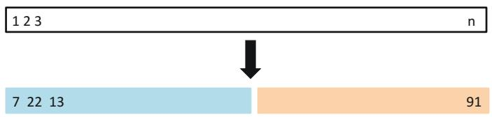
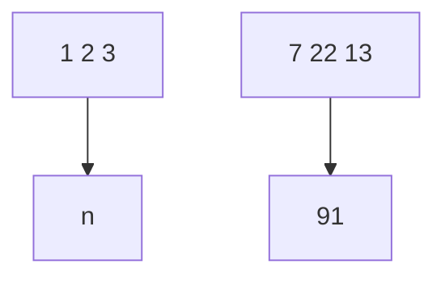
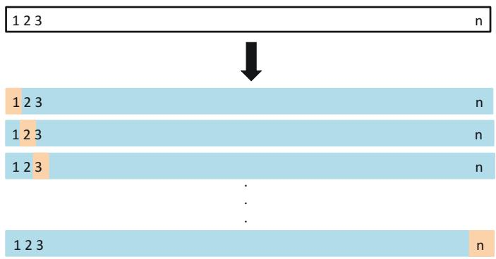
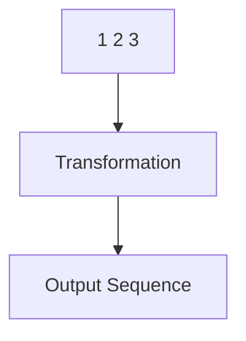
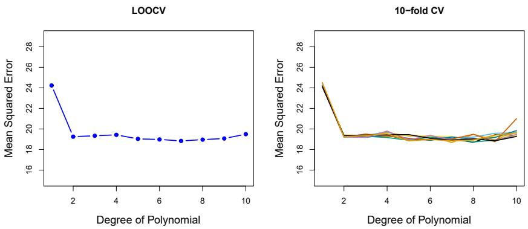
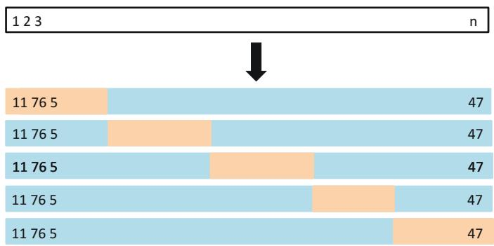
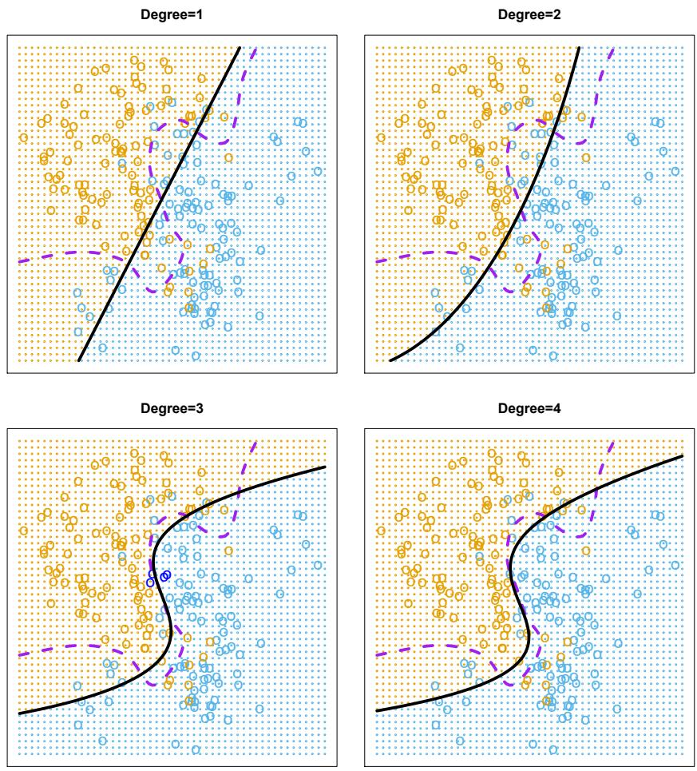
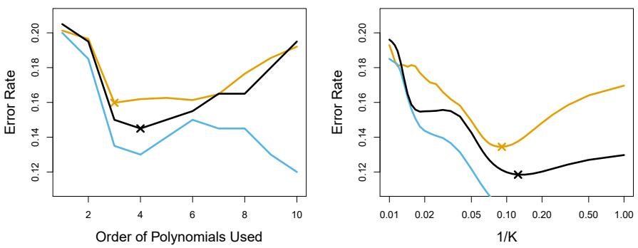
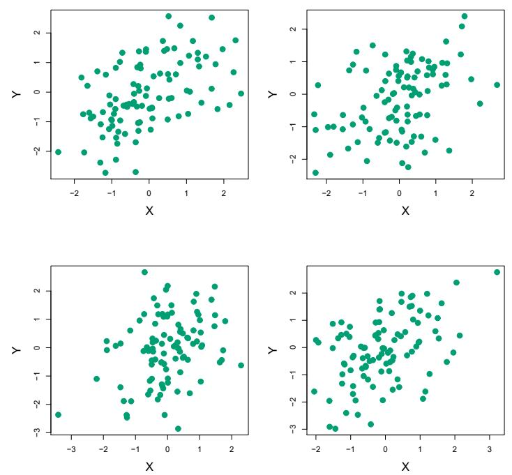
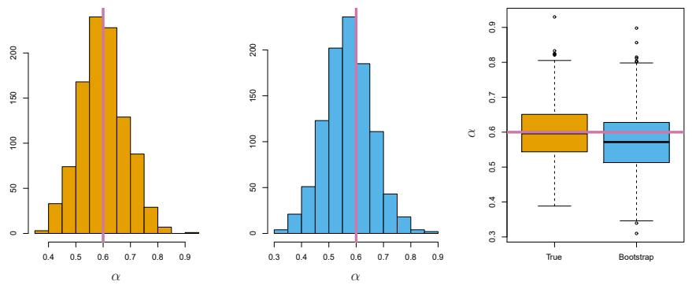

Resampling methods are an indispensable tool in modern statistics. They involve repeatedly drawing samples from a training set and refitting a model of interest on each sample in order to obtain additional information about the fitted model. For example, in order to estimate the variability of a linear regression fit, we can repeatedly draw different samples from the training data, fit a linear regression to each new sample, and then examine the extent to which the resulting fits differ. Such an approach may allow us to obtain information that would not be available from fitting the model only once using the original training sample.

Resampling approaches can be computationally expensive, because they involve fitting the same statistical method multiple times using different subsets of the training data. However, due to recent advances in computing power, the computational requirements of resampling methods generally are not prohibitive. In this chapter, we discuss two of the most commonly used resampling methods, cross-validation and the bootstrap. Both methods are important tools in the practical application of many statistical learning procedures. For example, cross-validation can be used to estimate the test error associated with a given statistical learning method in order to evaluate its performance, or to select the appropriate level of flexibility. The process of evaluating a model's performance is known as model assessment, whereas the process of selecting the proper level of flexibility for a model is known as model selection. The bootstrap is used in several contexts, most commonly to provide a measure of accuracy of a parameter estimate or of a given statistical learning method.

model
assessment
model
selection

# 5.1 Cross-Validation

In Chapter 2 we discuss the distinction between the test error rate and the training error rate. The test error is the average error that results from using a statistical learning method to predict the response on a new observation—that is, a measurement that was not used in training the method. Given a data set, the use of a particular statistical learning method is warranted if it results in a low test error. The test error can be easily calculated if a designated test set is available. Unfortunately, this is usually not the case. In contrast, the training error can be easily calculated by applying the statistical learning method to the observations used in its training. But as we saw in Chapter 2, the training error rate often is quite different from the test error rate, and in particular the former can dramatically underestimate the latter.

In the absence of a very large designated test set that can be used to directly estimate the test error rate, a number of techniques can be used to estimate this quantity using the available training data. Some methods make a mathematical adjustment to the training error rate in order to estimate the test error rate. Such approaches are discussed in Chapter 6. In this section, we instead consider a class of methods that estimate the test error rate by holding out a subset of the training observations from the fitting process, and then applying the statistical learning method to those held out observations.

In Sections 5.1.1–5.1.4, for simplicity we assume that we are interested in performing regression with a quantitative response. In Section 5.1.5 we consider the case of classification with a qualitative response. As we will see, the key concepts remain the same regardless of whether the response is quantitative or qualitative.

# 5.1.1 The Validation Set Approach

Suppose that we would like to estimate the test error associated with fitting a particular statistical learning method on a set of observations. The validation set approach, displayed in Figure 5.1, is a very simple strategy for this task. It involves randomly dividing the available set of observations into two parts, a training set and a validation set or hold-out set. The model is fit on the training set, and the fitted model is used to predict the responses for the observations in the validation set. The resulting validation set error rate—typically assessed using MSE in the case of a quantitative response—provides an estimate of the test error rate.

We illustrate the validation set approach on the Auto data set. Recall from Chapter 3 that there appears to be a non-linear relationship between mpg and horsepower, and that a model that predicts mpg using horsepower and horsepower $^{2}$ gives better results than a model that uses only a linear term. It is natural to wonder whether a cubic or higher-order fit might provide even better results. We answer this question in Chapter 3 by looking at the p-values associated with a cubic term and higher-order polynomial terms in a linear regression. But we could also answer this question using the validation method. We randomly split the 392 observations into two

validation
set approach
validation
set
hold-out set



<details>
<summary>flowchart</summary>


</details>

FIGURE 5.1. A schematic display of the validation set approach. A set of n observations are randomly split into a training set (shown in blue, containing observations 7, 22, and 13, among others) and a validation set (shown in beige, and containing observation 91, among others). The statistical learning method is fit on the training set, and its performance is evaluated on the validation set.

sets, a training set containing 196 of the data points, and a validation set containing the remaining 196 observations. The validation set error rates that result from fitting various regression models on the training sample and evaluating their performance on the validation sample, using MSE as a measure of validation set error, are shown in the left-hand panel of Figure 5.2. The validation set MSE for the quadratic fit is considerably smaller than for the linear fit. However, the validation set MSE for the cubic fit is actually slightly larger than for the quadratic fit. This implies that including a cubic term in the regression does not lead to better prediction than simply using a quadratic term.

Recall that in order to create the left-hand panel of Figure 5.2, we randomly divided the data set into two parts, a training set and a validation set. If we repeat the process of randomly splitting the sample set into two parts, we will get a somewhat different estimate for the test MSE. As an illustration, the right-hand panel of Figure 5.2 displays ten different validation set MSE curves from the Auto data set, produced using ten different random splits of the observations into training and validation sets. All ten curves indicate that the model with a quadratic term has a dramatically smaller validation set MSE than the model with only a linear term. Furthermore, all ten curves indicate that there is not much benefit in including cubic or higher-order polynomial terms in the model. But it is worth noting that each of the ten curves results in a different test MSE estimate for each of the ten regression models considered. And there is no consensus among the curves as to which model results in the smallest validation set MSE. Based on the variability among these curves, all that we can conclude with any confidence is that the linear fit is not adequate for this data.

The validation set approach is conceptually simple and is easy to implement. But it has two potential drawbacks:

1. As is shown in the right-hand panel of Figure 5.2, the validation estimate of the test error rate can be highly variable, depending on precisely which observations are included in the training set and which observations are included in the validation set.  
2. In the validation approach, only a subset of the observations—those that are included in the training set rather than in the validation set—are used to fit the model. Since statistical methods tend to perform worse when trained on fewer observations, this suggests that the

  
FIGURE 5.2. The validation set approach was used on the Auto data set in order to estimate the test error that results from predicting mpg using polynomial functions of horsepower. Left: Validation error estimates for a single split into training and validation data sets. Right: The validation method was repeated ten times, each time using a different random split of the observations into a training set and a validation set. This illustrates the variability in the estimated test MSE that results from this approach.

validation set error rate may tend to overestimate the test error rate for the model fit on the entire data set.

In the coming subsections, we will present cross-validation, a refinement of the validation set approach that addresses these two issues.

# 5.1.2 Leave-One-Out Cross-Validation

Leave-one-out cross-validation (LOOCV) is closely related to the validation set approach of Section 5.1.1, but it attempts to address that method's drawbacks.

Like the validation set approach, LOOCV involves splitting the set of observations into two parts. However, instead of creating two subsets of comparable size, a single observation $(x_{1}, y_{1})$ is used for the validation set, and the remaining observations $\{(x_{2}, y_{2}), \ldots, (x_{n}, y_{n})\}$ make up the training set. The statistical learning method is fit on the n-1 training observations, and a prediction $\hat{y}_{1}$ is made for the excluded observation, using its value $x_{1}$ . Since $(x_{1}, y_{1})$ was not used in the fitting process, $\mathrm{MSE}_{1} = (y_{1} - \hat{y}_{1})^{2}$ provides an approximately unbiased estimate for the test error. But even though $MSE_{1}$ is unbiased for the test error, it is a poor estimate because it is highly variable, since it is based upon a single observation $(x_{1}, y_{1})$ .

We can repeat the procedure by selecting $(x_{2},y_{2})$ for the validation data, training the statistical learning procedure on the n-1 observations $\{(x_{1},y_{1}),(x_{3},y_{3}),\ldots,(x_{n},y_{n})\}$ , and computing $\mathrm{MSE}_{2}=(y_{2}-\hat{y}_{2})^{2}$ . Repeating this approach n times produces n squared errors, $MSE_{1},\ldots,MSE_{n}$ . The LOOCV estimate for the test MSE is the average of these n test error estimates:

$$
\mathrm{CV} _ {(n)} = \frac {1}{n} \sum_ {i = 1} ^ {n} \mathrm{MSE} _ {i}. \tag {5.1}
$$



<details>
<summary>flowchart</summary>


</details>

FIGURE 5.3. A schematic display of LOOCV. A set of n data points is repeatedly split into a training set (shown in blue) containing all but one observation, and a validation set that contains only that observation (shown in beige). The test error is then estimated by averaging the n resulting MSEs. The first training set contains all but observation 1, the second training set contains all but observation 2, and so forth.

A schematic of the LOOCV approach is illustrated in Figure 5.3.

LOOCV has a couple of major advantages over the validation set approach. First, it has far less bias. In LOOCV, we repeatedly fit the statistical learning method using training sets that contain n - 1 observations, almost as many as are in the entire data set. This is in contrast to the validation set approach, in which the training set is typically around half the size of the original data set. Consequently, the LOOCV approach tends not to overestimate the test error rate as much as the validation set approach does. Second, in contrast to the validation approach which will yield different results when applied repeatedly due to randomness in the training/validation set splits, performing LOOCV multiple times will always yield the same results: there is no randomness in the training/validation set splits.

We used LOOCV on the Auto data set in order to obtain an estimate of the test set MSE that results from fitting a linear regression model to predict mpg using polynomial functions of horsepower. The results are shown in the left-hand panel of Figure 5.4.

LOOCV has the potential to be expensive to implement, since the model has to be fit n times. This can be very time consuming if n is large, and if each individual model is slow to fit. With least squares linear or polynomial regression, an amazing shortcut makes the cost of LOOCV the same as that of a single model fit! The following formula holds:

$$
\mathrm{CV} _ {(n)} = \frac {1}{n} \sum_ {i = 1} ^ {n} \left(\frac {y _ {i} - \hat {y} _ {i}}{1 - h _ {i}}\right) ^ {2}, \tag {5.2}
$$

  
FIGURE 5.4. Cross-validation was used on the Auto data set in order to estimate the test error that results from predicting mpg using polynomial functions of horsepower. Left: The LOOCV error curve. Right: 10-fold CV was run nine separate times, each with a different random split of the data into ten parts. The figure shows the nine slightly different CV error curves.

where $\hat{y}_{i}$ is the ith fitted value from the original least squares fit, and $h_{i}$ is the leverage defined in (3.37) on page 105. $^{1}$ This is like the ordinary MSE, except the ith residual is divided by $1 - h_{i}$ . The leverage lies between 1/n and 1, and reflects the amount that an observation influences its own fit. Hence the residuals for high-leverage points are inflated in this formula by exactly the right amount for this equality to hold.

LOOCV is a very general method, and can be used with any kind of predictive modeling. For example we could use it with logistic regression or linear discriminant analysis, or any of the methods discussed in later chapters. The magic formula $(5.2)$ does not hold in general, in which case the model has to be refit n times.

# 5.1.3 k-Fold Cross-Validation

An alternative to LOOCV is k-fold CV. This approach involves randomly dividing the set of observations into k groups, or folds, of approximately equal size. The first fold is treated as a validation set, and the method is fit on the remaining k - 1 folds. The mean squared error, $MSE_{1}$ , is then computed on the observations in the held-out fold. This procedure is repeated k times; each time, a different group of observations is treated as a validation set. This process results in k estimates of the test error, $MSE_{1}, MSE_{2}, \ldots, MSE_{k}$ . The k-fold CV estimate is computed by averaging these values,

$$
\mathrm{CV} _ {(k)} = \frac {1}{k} \sum_ {i = 1} ^ {k} \mathrm{MSE} _ {i}. \tag {5.3}
$$

Figure 5.5 illustrates the $k$ -fold CV approach.

k-fold CV



<details>
<summary>bar_stacked</summary>

| Category | Segment 1 | Segment 2 | Total |
| --- | --- | --- | --- |
| Group 1 | 11 | 76 | 47 |
| Group 2 | 11 | 76 | 47 |
| Group 3 | 11 | 76 | 47 |
| Group 4 | 11 | 76 | 47 |
| Group 5 | 11 | 76 | 47 |
</details>

FIGURE 5.5. A schematic display of 5-fold CV. A set of n observations is randomly split into five non-overlapping groups. Each of these fifths acts as a validation set (shown in beige), and the remainder as a training set (shown in blue). The test error is estimated by averaging the five resulting MSE estimates.

It is not hard to see that LOOCV is a special case of k-fold CV in which k is set to equal n. In practice, one typically performs k-fold CV using k = 5 or k = 10. What is the advantage of using k = 5 or k = 10 rather than k = n? The most obvious advantage is computational. LOOCV requires fitting the statistical learning method n times. This has the potential to be computationally expensive (except for linear models fit by least squares, in which case formula $(5.2)$ can be used). But cross-validation is a very general approach that can be applied to almost any statistical learning method. Some statistical learning methods have computationally intensive fitting procedures, and so performing LOOCV may pose computational problems, especially if n is extremely large. In contrast, performing 10-fold CV requires fitting the learning procedure only ten times, which may be much more feasible. As we see in Section 5.1.4, there also can be other non-computational advantages to performing 5-fold or 10-fold CV, which involve the bias-variance trade-off.

The right-hand panel of Figure 5.4 displays nine different 10-fold CV estimates for the Auto data set, each resulting from a different random split of the observations into ten folds. As we can see from the figure, there is some variability in the CV estimates as a result of the variability in how the observations are divided into ten folds. But this variability is typically much lower than the variability in the test error estimates that results from the validation set approach (right-hand panel of Figure 5.2).

When we examine real data, we do not know the true test MSE, and so it is difficult to determine the accuracy of the cross-validation estimate. However, if we examine simulated data, then we can compute the true test MSE, and can thereby evaluate the accuracy of our cross-validation results. In Figure 5.6, we plot the cross-validation estimates and true test error rates that result from applying smoothing splines to the simulated data sets illustrated in Figures 2.9–2.11 of Chapter 2. The true test MSE is displayed in blue. The black dashed and orange solid lines respectively show the estimated LOOCV and 10-fold CV estimates. In all three plots, the two cross-validation estimates are very similar. In the right-hand panel

  
FIGURE 5.6. True and estimated test MSE for the simulated data sets in Figures 2.9 (left), 2.10 (center), and 2.11 (right). The true test MSE is shown in blue, the LOOCV estimate is shown as a black dashed line, and the 10-fold CV estimate is shown in orange. The crosses indicate the minimum of each of the MSE curves.

of Figure 5.6, the true test MSE and the cross-validation curves are almost identical. In the center panel of Figure 5.6, the two sets of curves are similar at the lower degrees of flexibility, while the CV curves overestimate the test set MSE for higher degrees of flexibility. In the left-hand panel of Figure 5.6, the CV curves have the correct general shape, but they underestimate the true test MSE.

When we perform cross-validation, our goal might be to determine how well a given statistical learning procedure can be expected to perform on independent data; in this case, the actual estimate of the test MSE is of interest. But at other times we are interested only in the location of the minimum point in the estimated test MSE curve. This is because we might be performing cross-validation on a number of statistical learning methods, or on a single method using different levels of flexibility, in order to identify the method that results in the lowest test error. For this purpose, the location of the minimum point in the estimated test MSE curve is important, but the actual value of the estimated test MSE is not. We find in Figure 5.6 that despite the fact that they sometimes underestimate the true test MSE, all of the CV curves come close to identifying the correct level of flexibility—that is, the flexibility level corresponding to the smallest test MSE.

# 5.1.4 Bias-Variance Trade-Off for k-Fold Cross-Validation

We mentioned in Section 5.1.3 that k-fold CV with k < n has a computational advantage to LOOCV. But putting computational issues aside, a less obvious but potentially more important advantage of k-fold CV is that it often gives more accurate estimates of the test error rate than does LOOCV. This has to do with a bias-variance trade-off.

It was mentioned in Section 5.1.1 that the validation set approach can lead to overestimates of the test error rate, since in this approach the training set used to fit the statistical learning method contains only half the observations of the entire data set. Using this logic, it is not hard to see

that LOOCV will give approximately unbiased estimates of the test error, since each training set contains n-1 observations, which is almost as many as the number of observations in the full data set. And performing k-fold CV for, say, k=5 or k=10 will lead to an intermediate level of bias, since each training set contains approximately $(k-1)n/k$ observations—fewer than in the LOOCV approach, but substantially more than in the validation set approach. Therefore, from the perspective of bias reduction, it is clear that LOOCV is to be preferred to k-fold CV.

However, we know that bias is not the only source for concern in an estimating procedure; we must also consider the procedure's variance. It turns out that LOOCV has higher variance than does k-fold CV with k < n. Why is this the case? When we perform LOOCV, we are in effect averaging the outputs of n fitted models, each of which is trained on an almost identical set of observations; therefore, these outputs are highly (positively) correlated with each other. In contrast, when we perform k-fold CV with k < n, we are averaging the outputs of k fitted models that are somewhat less correlated with each other, since the overlap between the training sets in each model is smaller. Since the mean of many highly correlated quantities has higher variance than does the mean of many quantities that are not as highly correlated, the test error estimate resulting from LOOCV tends to have higher variance than does the test error estimate resulting from k-fold CV.

To summarize, there is a bias-variance trade-off associated with the choice of k in k-fold cross-validation. Typically, given these considerations, one performs k-fold cross-validation using k = 5 or k = 10, as these values have been shown empirically to yield test error rate estimates that suffer neither from excessively high bias nor from very high variance.

# 5.1.5 Cross-Validation on Classification Problems

In this chapter so far, we have illustrated the use of cross-validation in the regression setting where the outcome Y is quantitative, and so have used MSE to quantify test error. But cross-validation can also be a very useful approach in the classification setting when Y is qualitative. In this setting, cross-validation works just as described earlier in this chapter, except that rather than using MSE to quantify test error, we instead use the number of misclassified observations. For instance, in the classification setting, the LOOCV error rate takes the form

$$
\mathrm{CV} _ {(n)} = \frac {1}{n} \sum_ {i = 1} ^ {n} \mathrm{Err} _ {i}, \tag {5.4}
$$

where $\mathrm{Err}_i = I(y_i \neq \hat{y}_i)$ . The $k$ -fold CV error rate and validation set error rates are defined analogously.

As an example, we fit various logistic regression models on the two-dimensional classification data displayed in Figure 2.13. In the top-left panel of Figure 5.7, the black solid line shows the estimated decision boundary resulting from fitting a standard logistic regression model to this data set. Since this is simulated data, we can compute the true test error rate, which takes a value of 0.201 and so is substantially larger than the Bayes

  
FIGURE 5.7. Logistic regression fits on the two-dimensional classification data displayed in Figure 2.13. The Bayes decision boundary is represented using a purple dashed line. Estimated decision boundaries from linear, quadratic, cubic and quartic (degrees 1–4) logistic regressions are displayed in black. The test error rates for the four logistic regression fits are respectively 0.201, 0.197, 0.160, and 0.162, while the Bayes error rate is 0.133.

error rate of 0.133. Clearly logistic regression does not have enough flexibility to model the Bayes decision boundary in this setting. We can easily extend logistic regression to obtain a non-linear decision boundary by using polynomial functions of the predictors, as we did in the regression setting in Section 3.3.2. For example, we can fit a quadratic logistic regression model, given by

$$
\log \left(\frac {p}{1 - p}\right) = \beta_ {0} + \beta_ {1} X _ {1} + \beta_ {2} X _ {1} ^ {2} + \beta_ {3} X _ {2} + \beta_ {4} X _ {2} ^ {2}. \tag {5.5}
$$

The top-right panel of Figure 5.7 displays the resulting decision boundary, which is now curved. However, the test error rate has improved only slightly, to 0.197. A much larger improvement is apparent in the bottom-left panel

  
FIGURE 5.8. Test error (brown), training error (blue), and 10-fold CV error (black) on the two-dimensional classification data displayed in Figure 5.7. Left: Logistic regression using polynomial functions of the predictors. The order of the polynomials used is displayed on the x-axis. Right: The KNN classifier with different values of K, the number of neighbors used in the KNN classifier.

of Figure 5.7, in which we have fit a logistic regression model involving cubic polynomials of the predictors. Now the test error rate has decreased to 0.160. Going to a quartic polynomial (bottom-right) slightly increases the test error.

In practice, for real data, the Bayes decision boundary and the test error rates are unknown. So how might we decide between the four logistic regression models displayed in Figure 5.7? We can use cross-validation in order to make this decision. The left-hand panel of Figure 5.8 displays in black the 10-fold CV error rates that result from fitting ten logistic regression models to the data, using polynomial functions of the predictors up to tenth order. The true test errors are shown in brown, and the training errors are shown in blue. As we have seen previously, the training error tends to decrease as the flexibility of the fit increases. (The figure indicates that though the training error rate doesn't quite decrease monotonically, it tends to decrease on the whole as the model complexity increases.) In contrast, the test error displays a characteristic U-shape. The 10-fold CV error rate provides a pretty good approximation to the test error rate. While it somewhat underestimates the error rate, it reaches a minimum when fourth-order polynomials are used, which is very close to the minimum of the test curve, which occurs when third-order polynomials are used. In fact, using fourth-order polynomials would likely lead to good test set performance, as the true test error rate is approximately the same for third, fourth, fifth, and sixth-order polynomials.

The right-hand panel of Figure 5.8 displays the same three curves using the KNN approach for classification, as a function of the value of K (which in this context indicates the number of neighbors used in the KNN classifier, rather than the number of CV folds used). Again the training error rate declines as the method becomes more flexible, and so we see that the training error rate cannot be used to select the optimal value for K. Though the cross-validation error curve slightly underestimates the test error rate, it takes on a minimum very close to the best value for K.

# 5.2 The Bootstrap

The bootstrap is a widely applicable and extremely powerful statistical tool that can be used to quantify the uncertainty associated with a given estimator or statistical learning method. As a simple example, the bootstrap can be used to estimate the standard errors of the coefficients from a linear regression fit. In the specific case of linear regression, this is not particularly useful, since we saw in Chapter 3 that standard statistical software such as R outputs such standard errors automatically. However, the power of the bootstrap lies in the fact that it can be easily applied to a wide range of statistical learning methods, including some for which a measure of variability is otherwise difficult to obtain and is not automatically output by statistical software.

In this section we illustrate the bootstrap on a toy example in which we wish to determine the best investment allocation under a simple model. In Section 5.3 we explore the use of the bootstrap to assess the variability associated with the regression coefficients in a linear model fit.

Suppose that we wish to invest a fixed sum of money in two financial assets that yield returns of X and Y, respectively, where X and Y are random quantities. We will invest a fraction $\alpha$ of our money in X, and will invest the remaining $1 - \alpha$ in Y. Since there is variability associated with the returns on these two assets, we wish to choose $\alpha$ to minimize the total risk, or variance, of our investment. In other words, we want to minimize $\text{Var}(\alpha X + (1 - \alpha)Y)$ . One can show that the value that minimizes the risk is given by

$$
\alpha = \frac {\sigma_ {Y} ^ {2} - \sigma_ {X Y}}{\sigma_ {X} ^ {2} + \sigma_ {Y} ^ {2} - 2 \sigma_ {X Y}}, \tag {5.6}
$$

where $\sigma_X^2 = \mathrm{Var}(X),\sigma_Y^2 = \mathrm{Var}(Y)$ , and $\sigma_{XY} = \mathrm{Cov}(X,Y)$ .

In reality, the quantities $\sigma_{X}^{2}$ , $\sigma_{Y}^{2}$ , and $\sigma_{XY}$ are unknown. We can compute estimates for these quantities, $\hat{\sigma}_{X}^{2}$ , $\hat{\sigma}_{Y}^{2}$ , and $\hat{\sigma}_{XY}$ , using a data set that contains past measurements for X and Y. We can then estimate the value of $\alpha$ that minimizes the variance of our investment using

$$
\hat {\alpha} = \frac {\hat {\sigma} _ {Y} ^ {2} - \hat {\sigma} _ {X Y}}{\hat {\sigma} _ {X} ^ {2} + \hat {\sigma} _ {Y} ^ {2} - 2 \hat {\sigma} _ {X Y}}. \tag {5.7}
$$

Figure 5.9 illustrates this approach for estimating $\alpha$ on a simulated data set. In each panel, we simulated 100 pairs of returns for the investments X and Y. We used these returns to estimate $\sigma_{X}^{2}, \sigma_{Y}^{2}$ , and $\sigma_{XY}$ , which we then substituted into (5.7) in order to obtain estimates for $\alpha$ . The value of $\hat{\alpha}$ resulting from each simulated data set ranges from 0.532 to 0.657.

It is natural to wish to quantify the accuracy of our estimate of $\alpha$ . To estimate the standard deviation of $\hat{\alpha}$ , we repeated the process of simulating 100 paired observations of X and Y, and estimating $\alpha$ using (5.7), 1,000 times. We thereby obtained 1,000 estimates for $\alpha$ , which we can call $\hat{\alpha}_{1}, \hat{\alpha}_{2}, \ldots, \hat{\alpha}_{1,000}$ . The left-hand panel of Figure 5.10 displays a histogram of the resulting estimates. For these simulations the parameters were set to $\sigma_{X}^{2} = 1$ , $\sigma_{Y}^{2} = 1.25$ , and $\sigma_{XY} = 0.5$ , and so we know that the true value of $\alpha$ is 0.6. We indicated this value using a solid vertical line on the histogram.

  
FIGURE 5.9. Each panel displays 100 simulated returns for investments X and Y. From left to right and top to bottom, the resulting estimates for $\alpha$ are 0.576, 0.532, 0.657, and 0.651.

The mean over all 1,000 estimates for $\alpha$ is

$$
\bar {\alpha} = \frac {1}{1 0 0 0} \sum_ {r = 1} ^ {1 0 0 0} \hat {\alpha} _ {r} = 0. 5 9 9 6,
$$

very close to $\alpha = 0.6$ , and the standard deviation of the estimates is

$$
\sqrt {\frac {1}{1 0 0 0 - 1} \sum_ {r = 1} ^ {1 0 0 0} \left(\hat {\alpha} _ {r} - \bar {\alpha}\right) ^ {2}} = 0. 0 8 3.
$$

This gives us a very good idea of the accuracy of $\hat{\alpha}$ : $\mathrm{SE}(\hat{\alpha}) \approx 0.083$ . So roughly speaking, for a random sample from the population, we would expect $\hat{\alpha}$ to differ from $\alpha$ by approximately 0.08, on average.

In practice, however, the procedure for estimating $\mathrm{SE}(\hat{\alpha})$ outlined above cannot be applied, because for real data we cannot generate new samples from the original population. However, the bootstrap approach allows us to use a computer to emulate the process of obtaining new sample sets, so that we can estimate the variability of $\hat{\alpha}$ without generating additional samples. Rather than repeatedly obtaining independent data sets from the population, we instead obtain distinct data sets by repeatedly sampling observations from the original data set.

This approach is illustrated in Figure 5.11 on a simple data set, which we call Z, that contains only n = 3 observations. We randomly select n observations from the data set in order to produce a bootstrap data set,

  
FIGURE 5.10. Left: A histogram of the estimates of $\alpha$ obtained by generating 1,000 simulated data sets from the true population. Center: A histogram of the estimates of $\alpha$ obtained from 1,000 bootstrap samples from a single data set. Right: The estimates of $\alpha$ displayed in the left and center panels are shown as boxplots. In each panel, the pink line indicates the true value of $\alpha$ .

$Z^{*1}$ . The sampling is performed with replacement, which means that the same observation can occur more than once in the bootstrap data set. In this example, $Z^{*1}$ contains the third observation twice, the first observation once, and no instances of the second observation. Note that if an observation is contained in $Z^{*1}$ , then both its X and Y values are included. We can use $Z^{*1}$ to produce a new bootstrap estimate for $\alpha$ , which we call $\hat{\alpha}^{*1}$ . This procedure is repeated B times for some large value of B, in order to produce B different bootstrap data sets, $Z^{*1}, Z^{*2}, \ldots, Z^{*B}$ , and B corresponding $\alpha$ estimates, $\hat{\alpha}^{*1}, \hat{\alpha}^{*2}, \ldots, \hat{\alpha}^{*B}$ . We can compute the standard error of these bootstrap estimates using the formula

$$
\mathrm{SE} _ {B} (\hat {\alpha}) = \sqrt {\frac {1}{B - 1} \sum_ {r = 1} ^ {B} \left(\hat {\alpha} ^ {* r} - \frac {1}{B} \sum_ {r ^ {\prime} = 1} ^ {B} \hat {\alpha} ^ {* r ^ {\prime}}\right) ^ {2}}. \tag {5.8}
$$

This serves as an estimate of the standard error of $\hat{\alpha}$ estimated from the original data set.

The bootstrap approach is illustrated in the center panel of Figure 5.10, which displays a histogram of 1,000 bootstrap estimates of $\alpha$ , each computed using a distinct bootstrap data set. This panel was constructed on the basis of a single data set, and hence could be created using real data. Note that the histogram looks very similar to the left-hand panel, which displays the idealized histogram of the estimates of $\alpha$ obtained by generating 1,000 simulated data sets from the true population. In particular the bootstrap estimate $\mathrm{SE}(\hat{\alpha})$ from (5.8) is 0.087, very close to the estimate of 0.083 obtained using 1,000 simulated data sets. The right-hand panel displays the information in the center and left panels in a different way, via boxplots of the estimates for $\alpha$ obtained by generating 1,000 simulated data sets from the true population and using the bootstrap approach. Again, the boxplots have similar spreads, indicating that the bootstrap approach can be used to effectively estimate the variability associated with $\hat{\alpha}$ .


<details>
<summary>flowchart</summary>

This diagram illustrates a hierarchical classification or decision tree structure with two main branches (Z*1 and Z*B) and their corresponding sub-classes (Obs, X, Y, 3, 1, 3) and associated coefficients (α*, α*).
</details>

FIGURE 5.11. A graphical illustration of the bootstrap approach on a small sample containing n = 3 observations. Each bootstrap data set contains n observations, sampled with replacement from the original data set. Each bootstrap data set is used to obtain an estimate of $\alpha$ .

# 5.3 Lab: Cross-Validation and the Bootstrap

In this lab, we explore the resampling techniques covered in this chapter. Some of the commands in this lab may take a while to run on your computer.

We again begin by placing most of our imports at this top level.

In [1]:

```python
import numpy as np
import statsmodels.api as sm
from ISLP import load_data
from ISLP.models import (ModelSpec as MS,
                           summarize,
                           poly)
from sklearn.model_selection import train_test_split
```

There are several new imports needed for this lab.

In [2]:

```python
from functools import partial
from sklearn.model_selection import \
    (cross_validate,
        KFold,
        ShuffleSplit)
from sklearn.base import clone
from ISLP.models import sklearn_sm
```

# 5.3.1 The Validation Set Approach

We explore the use of the validation set approach in order to estimate the test error rates that result from fitting various linear models on the Auto data set.

We use the function train\_test\_split() to split the data into training and validation sets. As there are 392 observations, we split into two equal sets of size 196 using the argument test\_size=196. It is generally a good idea to set a random seed when performing operations like this that contain an element of randomness, so that the results obtained can be reproduced precisely at a later time. We set the random seed of the splitter with the argument random\_state=0.

train\_test\_
split()

```python
In [3]: Auto = load_data('Auto')
    Auto_train, Auto_valid = train_test_split(Auto,
                               test_size=196,
                               random_state=0)
```

Now we can fit a linear regression using only the observations corresponding to the training set Auto\_train.

```python
In [4]: hp_mm = MS(['horsepower'])
    X_train = hp_mm.fit_transform(Auto_train)
    y_train = Auto_train['mpg']
    model = sm.OLS(y_train, X_train)
    results = model.fit()
```

We now use the predict() method of results evaluated on the model matrix for this model created using the validation data set. We also calculate the validation MSE of our model.

```python
In [5]: X_valid = hp_mm.transform(Auto_valid)
    y_valid = Auto_valid['mpg']
    valid_pred = results.predict(X_valid)
    np.mean((y_valid - valid_pred)**2)
```

Out[5]:23.6166

Hence our estimate for the validation MSE of the linear regression fit is 23.62.

We can also estimate the validation error for higher-degree polynomial regressions. We first provide a function evalMSE() that takes a model string as well as a training and test set and returns the MSE on the test set.

```python
def evalMSE(terms,
                    response,
                    train,
                    test):

    mm = MS(terms)
    X_train = mm.fit_transform(train)
    y_train = train[response]

    X_test = mm.transform(test)
    y_test = test[response]
```

```lua
results = sm.OLS(y_train, X_train).fit()
test_pred = results.predict(X_test)

return np.mean((y_test - test_pred)**2)
```

Let's use this function to estimate the validation MSE using linear, quadratic and cubic fits. We use the enumerate() function here, which gives both the values and indices of objects as one iterates over a for loop.

enumerate()

```python
In [7]: MSE = np.zeros(3)
    for idx, degree in enumerate(range(1, 4)):
        MSE[idx] = evalMSE([poly('horsepower', degree)],
                          'mpg',
                          Auto_train,
                          Auto_valid)
    MSE
```  
Out[7]: array([23.62, 18.76, 18.80])

These error rates are 23.62, 18.76, and 18.80, respectively. If we choose a different training/validation split instead, then we can expect somewhat different errors on the validation set.

```python
In [8]: Auto_train, Auto_valid = train_test_split(Auto,
                               test_size=196,
                               random_state=3)
MSE = np.zeros(3)
for idx, degree in enumerate(range(1, 4)):
    MSE[idx] = evalMSE([poly('horsepower', degree)],
                               'mpg',
                               Auto_train,
                               Auto_valid)
MSE
```  
Out[8]: array([20.76, 16.95, 16.97])

Using this split of the observations into a training set and a validation set, we find that the validation set error rates for the models with linear, quadratic, and cubic terms are 20.76, 16.95, and 16.97, respectively.

These results are consistent with our previous findings: a model that predicts mpg using a quadratic function of horsepower performs better than a model that involves only a linear function of horsepower, and there is no evidence of an improvement in using a cubic function of horsepower.

# 5.3.2 Cross-Validation

In theory, the cross-validation estimate can be computed for any generalized linear model. In practice, however, the simplest way to cross-validate in Python is to use sklearn, which has a different interface or API than statsmodels, the code we have been using to fit GLMs.

This is a problem which often confronts data scientists: “I have a function to do task A, and need to feed it into something that performs task B, so that I can compute $B(A(D))$ , where D is my data.” When A and B don’t naturally speak to each other, this requires the use of a wrapper. In the ISLP

wrapper

package, we provide a wrapper, sklearn\_sm(), that enables us to easily use the cross-validation tools of sklearn with models fit by statsmodels.

sklearn\_sm()

The class sklearn\_sm() has as its first argument a model from statsmodels. It can take two additional optional arguments: model\_str which can be used to specify a formula, and model\_args which should be a dictionary of additional arguments used when fitting the model. For example, to fit a logistic regression model we have to specify a family argument. This is passed as model\_args={'family':sm.families.Binomial()}.

Here is our wrapper in action:

```python
In [9]: hp_model = sklearn_sm(sm.OLS,
                          MS(['horsepower'])) X, Y = Auto.drop(columns=['mpg')), Auto['mpg']
cv_results = cross_validate(hp_model,
                          X,
                          Y,
                          cv=Auto.shape[0])
cv_err = np.mean(cv_results['test_score'])
cv_err
```  
Out [9]: 24.2315

The arguments to cross\_validate() are as follows: an object with the appropriate fit(), predict(), and score() methods, an array of features X and a response Y. We also included an additional argument cv to cross\_validate(); specifying an integer K results in K-fold cross-validation. We have provided a value corresponding to the total number of observations, which results in leave-one-out cross-validation (LOOCV). The cross\_validate() function produces a dictionary with several components; we simply want the cross-validated test score here (MSE), which is estimated to be 24.23.

cross\_
validate()

We can repeat this procedure for increasingly complex polynomial fits. To automate the process, we again use a for loop which iteratively fits polynomial regressions of degree 1 to 5, computes the associated cross-validation error, and stores it in the ith element of the vector cv\_error. The variable d in the for loop corresponds to the degree of the polynomial. We begin by initializing the vector. This command may take a couple of seconds to run.

```python
cv_error = np.zeros(5)
H = np.array(Auto['horsepower'])
M = sklearn_sm(sm.OLS)
for i, d in enumerate(range(1,6)):
    X = np.power.outer(H, np.arange(d+1))
    M_CV = cross_validate(M,
                             X,
                             Y,
                             cv=Auto.shape[0])
    cv_error[i] = np.mean(M_CV['test_score'])
cv_error
```  
Out[10]: array([24.2315, 19.2482, 19.3350, 19.4244, 19.0332])

As in Figure 5.4, we see a sharp drop in the estimated test MSE between the linear and quadratic fits, but then no clear improvement from using higher-degree polynomials.

Above we introduced the outer() method of the np.power() function. The outer() method is applied to an operation that has two arguments, such as add(), min(), or power(). It has two arrays as arguments, and then forms a larger array where the operation is applied to each pair of elements of the two arrays.

.outer()
np.power()

```python
In [11]: A = np.array([3, 5, 9])
B = np.array([2, 4])
np.add.outer(A, B)
```

```txt
Out[11]: array([[ 5,  7],
                  [ 7,  9],
                  [11, 13]])
```

In the CV example above, we used K = n, but of course we can also use K < n. The code is very similar to the above (and is significantly faster). Here we use KFold() to partition the data into K = 10 random groups. We use random\_state to set a random seed and initialize a vector cv\_error in which we will store the CV errors corresponding to the polynomial fits of degrees one to five.

KFold()

```python
cv_error = np.zeros(5)
cv = KFold(n_splits=10,
            shuffle=True,
            random_state=0) # use same splits for each degree
for i, d in enumerate(range(1,6)):
    X = np.power.outer(H, np.arange(d+1))
    M_CV = cross_validate(M,
                            X,
                            Y,
                            cv=cv)
    cv_error[i] = np.mean(M_CV['test_score'])
cv_error
```  
Out[12]: array([24.2077, 19.1853, 19.2763, 19.4785, 19.1372])

Notice that the computation time is much shorter than that of LOOCV. (In principle, the computation time for LOOCV for a least squares linear model should be faster than for K-fold CV, due to the availability of the formula $(5.2)$ for LOOCV; however, the generic cross\_validate() function does not make use of this formula.) We still see little evidence that using cubic or higher-degree polynomial terms leads to a lower test error than simply using a quadratic fit.

The cross\_validate() function is flexible and can take different splitting mechanisms as an argument. For instance, one can use the ShuffleSplit() function to implement the validation set approach just as easily as K-fold cross-validation.

Shuffle
Split()

```javascript
In [13]: validation = ShuffleSplit(n_splits=1,
                               test_size=196,
                               random_state=0)
results = cross_validate(hp_model,
                               Auto.drop(['mpg'], axis=1),
                               Auto['mpg'],
                               cv=validation);
results['test_score']
```

```javascript
Out[13]: array([23.6166])
```

One can estimate the variability in the test error by running the following:

In [14]:  
```python
validation = ShuffleSplit(n_splits=10,
                       test_size=196,
                       random_state=0)
results = cross_validate(hp_model,
                       Auto.drop(['mpg'], axis=1),
                       Auto['mpg'],
                       cv=validation)
results['test_score'].mean(), results['test_score'].std()
```  
Out[14]: (23.8022, 1.4218)

Note that this standard deviation is not a valid estimate of the sampling variability of the mean test score or the individual scores, since the randomly-selected training samples overlap and hence introduce correlations. But it does give an idea of the Monte Carlo variation incurred by picking different random folds.

# 5.3.3 The Bootstrap

We illustrate the use of the bootstrap in the simple example of Section 5.2, as well as on an example involving estimating the accuracy of the linear regression model on the Auto data set.

# Estimating the Accuracy of a Statistic of Interest

One of the great advantages of the bootstrap approach is that it can be applied in almost all situations. No complicated mathematical calculations are required. While there are several implementations of the bootstrap in Python, its use for estimating standard error is simple enough that we write our own function below for the case when our data is stored in a dataframe.

To illustrate the bootstrap, we start with a simple example. The Portfolio data set in the ISLP package is described in Section 5.2. The goal is to estimate the sampling variance of the parameter $\alpha$ given in formula (5.7). We will create a function alpha\_func(), which takes as input a dataframe D assumed to have columns X and Y, as well as a vector idx indicating which observations should be used to estimate $\alpha$ . The function then outputs the estimate for $\alpha$ based on the selected observations.

In [15]:  
```python
Portfolio = load_data('Portfolio')
def alpha_func(D, idx):
    cov_ = np.cov(D[['X','Y']].loc[idx], rowvar=False)
    return ((cov_[1,1] - cov_[0,1]) /
        (cov_[0,0]+cov_[1,1]-2*cov_[0,1]))
```

This function returns an estimate for $\alpha$ based on applying the minimum variance formula (5.7) to the observations indexed by the argument idx. For instance, the following command estimates $\alpha$ using all 100 observations.

In [16]:  
```txt
alpha_func(Portfolio, range(100))
```

```txt
Out[16]:0.5758
```

Next we randomly select 100 observations from range(100), with replacement. This is equivalent to constructing a new bootstrap data set and recomputing $\hat{\alpha}$ based on the new data set.

In [17]:  
```python
rng = np.random.default_rng(0)
alpha_func(Portfolio,
        rng.choice(100,
                       100,
                       replace=True))
```  
Out[17]:0.6074

This process can be generalized to create a simple function boot\_SE() for computing the bootstrap standard error for arbitrary functions that take only a data frame as an argument.

In [18]:  
```python
def boot_SE(func,
        D,
        n=None,
        B=1000,
        seed=0):
    rng = np.random.default_rng(seed)
    first_, second_ = 0, 0
    n = n or D.shape[0]
    for _ in range(B):
        idx = rng.choice(D.index,
                                    n,
                                    replace=True)
        value = func(D, idx)
        first_ += value
        second_ += value**2
    return np.sqrt(second_ / B - (first_ / B)**2)
```

Notice the use of \_ as a loop variable in for \_ in range(B). This is often used if the value of the counter is unimportant and simply makes sure the loop is executed B times.

Let's use our function to evaluate the accuracy of our estimate of $\alpha$ using $B = 1,000$ bootstrap replications.

In [19]:  
```txt
alpha_SE = boot_SE(alpha_func,
                               Portfolio,
                               B=1000,
                               seed=0)
alpha_SE
```  
Out[19]:0.0912

The final output shows that the bootstrap estimate for $\mathrm{SE}(\hat{\alpha})$ is 0.0912.

# Estimating the Accuracy of a Linear Regression Model

The bootstrap approach can be used to assess the variability of the coefficient estimates and predictions from a statistical learning method. Here we use the bootstrap approach in order to assess the variability of the

estimates for $\beta_{0}$ and $\beta_{1}$ , the intercept and slope terms for the linear regression model that uses horsepower to predict mpg in the Auto data set. We will compare the estimates obtained using the bootstrap to those obtained using the formulas for $\mathrm{SE}(\hat{\beta}_{0})$ and $\mathrm{SE}(\hat{\beta}_{1})$ described in Section 3.1.2.

To use our boot\_SE() function, we must write a function (its first argument) that takes a data frame D and indices idx as its only arguments. But here we want to bootstrap a specific regression model, specified by a model formula and data. We show how to do this in a few simple steps.

We start by writing a generic function boot\_OLS() for bootstrapping a regression model that takes a formula to define the corresponding regression. We use the clone() function to make a copy of the formula that can be refit to the new dataframe. This means that any derived features such as those defined by poly() (which we will see shortly), will be re-fit on the resampled data frame.

clone()

```python
def boot_OLS(model_matrix, response, D, idx):
    D_ = D.loc[idx]
    Y_ = D_[response]
    X_ = clone(model_matrix).fit_transform(D_)
    return sm.OLS(Y_, X_).fit().params
```

This is not quite what is needed as the first argument to boot\_SE(). The first two arguments which specify the model will not change in the bootstrap process, and we would like to freeze them. The function partial() from the functools module does precisely this: it takes a function as an argument, and freezes some of its arguments, starting from the left. We use it to freeze the first two model-formula arguments of boot\_OLS().

partial()

```python
In [21]: hp_func = partial(boot_OLS, MS(['horsepower'], 'mpg')
```

Typing hp\_func? will show that it has two arguments D and idx — it is a version of boot\_OLS() with the first two arguments frozen — and hence is ideal as the first argument for boot\_SE().

The hp\_func() function can now be used in order to create bootstrap estimates for the intercept and slope terms by randomly sampling from among the observations with replacement. We first demonstrate its utility on 10 bootstrap samples.

```python
rng = np.random.default_rng(0)
np.array([hp_func(Auto,
                  rng.choice(392,
                          392,
                          replace=True)) for _ in range(10)])
```

```txt
Out[22]: array([[39.8806, -0.1568],
         [38.733 , -0.147 ],
         [38.3173, -0.1444],
         [39.9145, -0.1578],
         [39.4335, -0.1507],
         [40.3663, -0.1591],
         [39.6233, -0.1545],
         [39.0581, -0.1495],
         [38.6669, -0.1452],
         [39.6428, -0.1556]])
```

Next, we use the boot\_SE() function to compute the standard errors of 1,000 bootstrap estimates for the intercept and slope terms.

```python
In [23]: hp_se = boot_SE(hp_func,
                               Auto,
                               B=1000,
                               seed=10)
        hp_se
```

```txt
Out[23]: intercept      0.8488
        horsepower     0.0074
        dtype: float64
```

This indicates that the bootstrap estimate for $\mathrm{SE}(\hat{\beta}_{0})$ is 0.85, and that the bootstrap estimate for $\mathrm{SE}(\hat{\beta}_{1})$ is 0.0074. As discussed in Section 3.1.2, standard formulas can be used to compute the standard errors for the regression coefficients in a linear model. These can be obtained using the summarize() function from ISLP.sm.

```python
In [24]: hp_model.fit(Auto, Auto['mpg'])
model_se = summarize(hp_model.results_)['std err']
model_se
```

```python
Out[24]: intercept      0.717
        horsepower     0.006
        Name: std err, dtype: float64
```

The standard error estimates for $\hat{\beta}_{0}$ and $\hat{\beta}_{1}$ obtained using the formulas from Section 3.1.2 are 0.717 for the intercept and 0.006 for the slope. Interestingly, these are somewhat different from the estimates obtained using the bootstrap. Does this indicate a problem with the bootstrap? In fact, it suggests the opposite. Recall that the standard formulas given in Equation 3.8 on page 75 rely on certain assumptions. For example, they depend on the unknown parameter $\sigma^{2}$ , the noise variance. We then estimate $\sigma^{2}$ using the RSS. Now although the formula for the standard errors do not rely on the linear model being correct, the estimate for $\sigma^{2}$ does. We see in Figure 3.8 on page 99 that there is a non-linear relationship in the data, and so the residuals from a linear fit will be inflated, and so will $\hat{\sigma}^{2}$ . Secondly, the standard formulas assume (somewhat unrealistically) that the $x_{i}$ are fixed, and all the variability comes from the variation in the errors $\epsilon_{i}$ . The bootstrap approach does not rely on any of these assumptions, and so it is likely giving a more accurate estimate of the standard errors of $\hat{\beta}_{0}$ and $\hat{\beta}_{1}$ than the results from sm.OLS.

Below we compute the bootstrap standard error estimates and the standard linear regression estimates that result from fitting the quadratic model to the data. Since this model provides a good fit to the data (Figure 3.8), there is now a better correspondence between the bootstrap estimates and the standard estimates of $\mathrm{SE}(\hat{\beta}_{0})$ , $\mathrm{SE}(\hat{\beta}_{1})$ and $\mathrm{SE}(\hat{\beta}_{2})$ .

```python
In [25]: quad_model = MS([poly('horsepower', 2, raw=True)])
quad_func = partial(boot_OLS,
                       quad_model,
                       'mpg')
boot_SE(quad_func, Auto, B=1000)
```

```python
Out[25]: intercept                          2.067840
    poly(horsepower, 2, raw=True)[0]    0.033019
    poly(horsepower, 2, raw=True)[1]    0.000120
    dtype: float64
```

We compare the results to the standard errors computed using sm.OLS().

```python
In [26]: M = sm.OLS(Auto['mpg'],
                       quad_model.fit_transform(Auto))
    summarize(M.fit())['std err']
```

```python
Out[26]: intercept                          1.800
    poly(horsepower, 2, raw=True)[0]    0.031
    poly(horsepower, 2, raw=True)[1]    0.000
    Name: std err, dtype: float64
```

# 5.4 Exercises

# Conceptual

1. Using basic statistical properties of the variance, as well as single-variable calculus, derive (5.6). In other words, prove that $\alpha$ given by (5.6) does indeed minimize $\mathrm{Var}(\alpha X + (1 - \alpha)Y)$ .

2. We will now derive the probability that a given observation is part of a bootstrap sample. Suppose that we obtain a bootstrap sample from a set of $n$ observations.

(a) What is the probability that the first bootstrap observation is not the $j$ th observation from the original sample? Justify your answer.  
(b) What is the probability that the second bootstrap observation is not the $j$ th observation from the original sample?  
(c) Argue that the probability that the $j$ th observation is not in the bootstrap sample is $(1 - 1 / n)^n$ .  
(d) When $n = 5$ , what is the probability that the $j$ th observation is in the bootstrap sample?  
(e) When $n = 100$ , what is the probability that the $j$ th observation is in the bootstrap sample?  
(f) When $n = 10,000$ , what is the probability that the $j$ th observation is in the bootstrap sample?  
(g) Create a plot that displays, for each integer value of $n$ from 1 to 100,000, the probability that the $j$ th observation is in the bootstrap sample. Comment on what you observe.  
(h) We will now investigate numerically the probability that a bootstrap sample of size $n = 100$ contains the $j$ th observation. Here $j = 4$ . We first create an array store with values that will subsequently be overwritten using the function np.empty(). We then

repeatedly create bootstrap samples, and each time we record whether or not the fifth observation is contained in the bootstrap sample.

```python
rng = np.random.default_rng(10)
store = np.empty(10000)
for i in range(10000):
    store[i] = np.sum(rng.choice(100, replace=True) == 4)
        > 0
np.mean(store)
```

Comment on the results obtained.

3. We now review k-fold cross-validation.

(a) Explain how $k$ -fold cross-validation is implemented.  
(b) What are the advantages and disadvantages of $k$ -fold cross-validation relative to:

i. The validation set approach?

ii. LOOCV?

4. Suppose that we use some statistical learning method to make a prediction for the response Y for a particular value of the predictor X. Carefully describe how we might estimate the standard deviation of our prediction.

# Applied

5. In Chapter 4, we used logistic regression to predict the probability of default using income and balance on the Default data set. We will now estimate the test error of this logistic regression model using the validation set approach. Do not forget to set a random seed before beginning your analysis.

(a) Fit a logistic regression model that uses income and balance to predict default.  
(b) Using the validation set approach, estimate the test error of this model. In order to do this, you must perform the following steps:

i. Split the sample set into a training set and a validation set.  
ii. Fit a multiple logistic regression model using only the training observations.  
iii. Obtain a prediction of default status for each individual in the validation set by computing the posterior probability of default for that individual, and classifying the individual to the default category if the posterior probability is greater than 0.5.  
iv. Compute the validation set error, which is the fraction of the observations in the validation set that are misclassified.

(c) Repeat the process in (b) three times, using three different splits of the observations into a training set and a validation set. Comment on the results obtained.

(d) Now consider a logistic regression model that predicts the probability of default using income, balance, and a dummy variable for student. Estimate the test error for this model using the validation set approach. Comment on whether or not including a dummy variable for student leads to a reduction in the test error rate.

6. We continue to consider the use of a logistic regression model to predict the probability of default using income and balance on the Default data set. In particular, we will now compute estimates for the standard errors of the income and balance logistic regression coefficients in two different ways: (1) using the bootstrap, and (2) using the standard formula for computing the standard errors in the sm.GLM() function. Do not forget to set a random seed before beginning your analysis.

(a) Using the summarize() and sm.GLM() functions, determine the estimated standard errors for the coefficients associated with income and balance in a multiple logistic regression model that uses both predictors.  
(b) Write a function, boot\_fn(), that takes as input the Default data set as well as an index of the observations, and that outputs the coefficient estimates for income and balance in the multiple logistic regression model.  
(c) Following the bootstrap example in the lab, use your boot\_fn() function to estimate the standard errors of the logistic regression coefficients for income and balance.  
(d) Comment on the estimated standard errors obtained using the sm.GLM() function and using the bootstrap.

7. In Sections 5.1.2 and 5.1.3, we saw that the cross\_validate() function can be used in order to compute the LOOCV test error estimate. Alternatively, one could compute those quantities using just sm.GLM() and the predict() method of the fitted model within a for loop. You will now take this approach in order to compute the LOOCV error for a simple logistic regression model on the Weekly data set. Recall that in the context of classification problems, the LOOCV error is given in (5.4).

(a) Fit a logistic regression model that predicts Direction using Lag1 and Lag2.  
(b) Fit a logistic regression model that predicts Direction using Lag1 and Lag2 using all but the first observation.  
(c) Use the model from (b) to predict the direction of the first observation. You can do this by predicting that the first observation will go up if $P(\text{Direction} = \text{"Up"}|\text{Lag1}, \text{Lag2}) > 0.5$ . Was this observation correctly classified?

(d) Write a for loop from $i = 1$ to $i = n$ , where $n$ is the number of observations in the data set, that performs each of the following steps:

i. Fit a logistic regression model using all but the ith observation to predict Direction using Lag1 and Lag2.  
ii. Compute the posterior probability of the market moving up for the $i$ th observation.  
iii. Use the posterior probability for the $i$ th observation in order to predict whether or not the market moves up.  
iv. Determine whether or not an error was made in predicting the direction for the $i$ th observation. If an error was made, then indicate this as a 1, and otherwise indicate it as a 0.

(e) Take the average of the $n$ numbers obtained in (d)iv in order to obtain the LOOCV estimate for the test error. Comment on the results.

8. We will now perform cross-validation on a simulated data set.

(a) Generate a simulated data set as follows:

```python
rng = np.random.default_rng(1)
x = rng.normal(size=100)
y = x - 2 * x**2 + rng.normal(size=100)
```

In this data set, what is n and what is p? Write out the model used to generate the data in equation form.

(b) Create a scatterplot of $X$ against $Y$ . Comment on what you find.

(c) Set a random seed, and then compute the LOOCV errors that result from fitting the following four models using least squares:

i. $Y = \beta_0 + \beta_1X + \epsilon$  
ii. $Y = \beta_{0} + \beta_{1}X + \beta_{2}X^{2} + \epsilon$  
iii. $Y = \beta_0 + \beta_1X + \beta_2X^2 +\beta_3X^3 +\epsilon$  
iv. $Y = \beta_0 + \beta_1X + \beta_2X^2 +\beta_3X^3 +\beta_4X^4 +\epsilon .$

Note you may find it helpful to use the data.frame() function to create a single data set containing both X and Y.

(d) Repeat (c) using another random seed, and report your results. Are your results the same as what you got in (c)? Why?  
(e) Which of the models in (c) had the smallest LOOCV error? Is this what you expected? Explain your answer.  
(f) Comment on the statistical significance of the coefficient estimates that results from fitting each of the models in (c) using least squares. Do these results agree with the conclusions drawn based on the cross-validation results?

9. We will now consider the Boston housing data set, from the ISLP library.

(a) Based on this data set, provide an estimate for the population mean of medv. Call this estimate $\hat{\mu}$ .

(b) Provide an estimate of the standard error of $\hat{\mu}$ . Interpret this result.  
Hint: We can compute the standard error of the sample mean by dividing the sample standard deviation by the square root of the number of observations.

(c) Now estimate the standard error of $\hat{\mu}$ using the bootstrap. How does this compare to your answer from (b)?

(d) Based on your bootstrap estimate from (c), provide a 95% confidence interval for the mean of medv. Compare it to the results obtained by using Boston['medv'].std() and the two standard error rule (3.9).

Hint: You can approximate a 95% confidence interval using the formula $[\hat{\mu}-2\mathrm{SE}(\hat{\mu}),\hat{\mu}+2\mathrm{SE}(\hat{\mu})]$ .

(e) Based on this data set, provide an estimate, $\hat{\mu}_{med}$ , for the median value of medv in the population.

(f) We now would like to estimate the standard error of $\hat{\mu}_{med}$ . Unfortunately, there is no simple formula for computing the standard error of the median. Instead, estimate the standard error of the median using the bootstrap. Comment on your findings.

(g) Based on this data set, provide an estimate for the tenth percentile of medv in Boston census tracts. Call this quantity $\hat{\mu}_{0.1}$ . (You can use the np.percentile() function.)

(h) Use the bootstrap to estimate the standard error of $\hat{\mu}_{0.1}$ . Comment on your findings.

np.
percentile()

