In the regression setting, the standard linear model

$$
Y = \beta_ {0} + \beta_ {1} X _ {1} + \dots + \beta_ {p} X _ {p} + \epsilon \tag {6.1}
$$

is commonly used to describe the relationship between a response Y and a set of variables $X_{1}, X_{2}, \ldots, X_{p}$ . We have seen in Chapter 3 that one typically fits this model using least squares.

In the chapters that follow, we consider some approaches for extending the linear model framework. In Chapter 7 we generalize $(6.1)$ in order to accommodate non-linear, but still additive, relationships, while in Chapters 8 and 10 we consider even more general non-linear models. However, the linear model has distinct advantages in terms of inference and, on real-world problems, is often surprisingly competitive in relation to non-linear methods. Hence, before moving to the non-linear world, we discuss in this chapter some ways in which the simple linear model can be improved, by replacing plain least squares fitting with some alternative fitting procedures.

Why might we want to use another fitting procedure instead of least squares? As we will see, alternative fitting procedures can yield better prediction accuracy and model interpretability.

\- Prediction Accuracy: Provided that the true relationship between the response and the predictors is approximately linear, the least squares estimates will have low bias. If $n \gg p$ —that is, if $n$ , the number of observations, is much larger than $p$ , the number of variables—then the least squares estimates tend to also have low variance, and hence will perform well on test observations. However, if $n$ is not much larger than $p$ , then there can be a lot of variability in the least squares fit, resulting in overfitting and consequently poor predictions on future observations not used in model training. And if $p > n$ , then there is no longer a unique least squares coefficient estimate: there are infinitely

many solutions. Each of these least squares solutions gives zero error on the training data, but typically very poor test set performance due to extremely high variance. $^{1}$ By constraining or shrinking the estimated coefficients, we can often substantially reduce the variance at the cost of a negligible increase in bias. This can lead to substantial improvements in the accuracy with which we can predict the response for observations not used in model training.

\- Model Interpretability: It is often the case that some or many of the variables used in a multiple regression model are in fact not associated with the response. Including such irrelevant variables leads to unnecessary complexity in the resulting model. By removing these variables—that is, by setting the corresponding coefficient estimates to zero—we can obtain a model that is more easily interpreted. Now least squares is extremely unlikely to yield any coefficient estimates that are exactly zero. In this chapter, we see some approaches for automatically performing feature selection or variable selection—that is, for excluding irrelevant variables from a multiple regression model.

There are many alternatives, both classical and modern, to using least squares to fit $(6.1)$ . In this chapter, we discuss three important classes of methods.

feature
selection
variable
selection

- Subset Selection. This approach involves identifying a subset of the p predictors that we believe to be related to the response. We then fit a model using least squares on the reduced set of variables.  
- Shrinkage. This approach involves fitting a model involving all p predictors. However, the estimated coefficients are shrunken towards zero relative to the least squares estimates. This shrinkage (also known as regularization) has the effect of reducing variance. Depending on what type of shrinkage is performed, some of the coefficients may be estimated to be exactly zero. Hence, shrinkage methods can also perform variable selection.  
- Dimension Reduction. This approach involves projecting the p predictors into an M-dimensional subspace, where M < p. This is achieved by computing M different linear combinations, or projections, of the variables. Then these M projections are used as predictors to fit a linear regression model by least squares.

In the following sections we describe each of these approaches in greater detail, along with their advantages and disadvantages. Although this chapter describes extensions and modifications to the linear model for regression seen in Chapter 3, the same concepts apply to other methods, such as the classification models seen in Chapter 4.

# 6.1 Subset Selection

In this section we consider some methods for selecting subsets of predictors. These include best subset and stepwise model selection procedures.

# 6.1.1 Best Subset Selection

To perform best subset selection, we fit a separate least squares regression for each possible combination of the p predictors. That is, we fit all p models that contain exactly one predictor, all $\binom{p}{2}=p(p-1)/2$ models that contain exactly two predictors, and so forth. We then look at all of the resulting models, with the goal of identifying the one that is best.

The problem of selecting the best model from among the $2^{p}$ possibilities considered by best subset selection is not trivial. This is usually broken up into two stages, as described in Algorithm 6.1.

best subset selection

# Algorithm 6.1 Best subset selection

1. Let $\mathcal{M}_0$ denote the null model, which contains no predictors. This model simply predicts the sample mean for each observation.  
2. For $k = 1, 2, \ldots, p$ :  
(a) Fit all $\binom{p}{k}$ models that contain exactly $k$ predictors.  
(b) Pick the best among these $\binom{p}{k}$ models, and call it $\mathcal{M}_k$ . Here best is defined as having the smallest RSS, or equivalently largest $R^2$ .  
3. Select a single best model from among $\mathcal{M}_0, \ldots, \mathcal{M}_p$ using using the prediction error on a validation set, $C_p$ (AIC), BIC, or adjusted $R^2$ . Or use the cross-validation method.

In Algorithm 6.1, Step 2 identifies the best model (on the training data) for each subset size, in order to reduce the problem from one of $2^{p}$ possible models to one of $p + 1$ possible models. In Figure 6.1, these models form the lower frontier depicted in red.

Now in order to select a single best model, we must simply choose among these $p + 1$ options. This task must be performed with care, because the RSS of these $p + 1$ models decreases monotonically, and the $R^{2}$ increases monotonically, as the number of features included in the models increases. Therefore, if we use these statistics to select the best model, then we will always end up with a model involving all of the variables. The problem is that a low RSS or a high $R^{2}$ indicates a model with a low training error, whereas we wish to choose a model that has a low test error. (As shown in Chapter 2 in Figures 2.9–2.11, training error tends to be quite a bit smaller than test error, and a low training error by no means guarantees a low test error.) Therefore, in Step 3, we use the error on a validation set, $C_{p}$ , BIC, or adjusted $R^{2}$ in order to select among $M_{0}, M_{1}, \ldots, M_{p}$ . If cross-validation is used to select the best model, then Step 2 is repeated on each training fold, and the validation errors are averaged to select the best value of k.

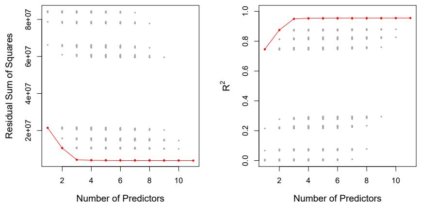  
FIGURE 6.1. For each possible model containing a subset of the ten predictors in the Credit data set, the RSS and $R^{2}$ are displayed. The red frontier tracks the best model for a given number of predictors, according to RSS and $R^{2}$ . Though the data set contains only ten predictors, the x-axis ranges from 1 to 11, since one of the variables is categorical and takes on three values, leading to the creation of two dummy variables.

Then the model $\mathcal{M}_k$ fit on the full training set is delivered for the chosen $k$ . These approaches are discussed in Section 6.1.3.

An application of best subset selection is shown in Figure 6.1. Each plotted point corresponds to a least squares regression model fit using a different subset of the 10 predictors in the Credit data set, discussed in Chapter 3. Here the variable region is a three-level qualitative variable, and so is represented by two dummy variables, which are selected separately in this case. Hence, there are a total of 11 possible variables which can be included in the model. We have plotted the RSS and $R^{2}$ statistics for each model, as a function of the number of variables. The red curves connect the best models for each model size, according to RSS or $R^{2}$ . The figure shows that, as expected, these quantities improve as the number of variables increases; however, from the three-variable model on, there is little improvement in RSS and $R^{2}$ as a result of including additional predictors.

Although we have presented best subset selection here for least squares regression, the same ideas apply to other types of models, such as logistic regression. In the case of logistic regression, instead of ordering models by RSS in Step 2 of Algorithm 6.1, we instead use the deviance, a measure that plays the role of RSS for a broader class of models. The deviance is negative two times the maximized log-likelihood; the smaller the deviance, the better the fit.

While best subset selection is a simple and conceptually appealing approach, it suffers from computational limitations. The number of possible models that must be considered grows rapidly as p increases. In general, there are $2^{p}$ models that involve subsets of p predictors. So if p = 10, then there are approximately 1,000 possible models to be considered, and if p = 20, then there are over one million possibilities! Consequently, best subset selection becomes computationally infeasible for values of p greater than

deviance

# Algorithm 6.2 Forward stepwise selection

1. Let $\mathcal{M}_0$ denote the null model, which contains no predictors.  
2. For $k = 0, \dots, p - 1$ :  
(a) Consider all $p - k$ models that augment the predictors in $\mathcal{M}_k$ with one additional predictor.  
(b) Choose the best among these $p - k$ models, and call it $\mathcal{M}_{k + 1}$ . Here best is defined as having smallest RSS or highest $R^2$ .  
3. Select a single best model from among $\mathcal{M}_0, \ldots, \mathcal{M}_p$ using the prediction error on a validation set, $C_p$ (AIC), BIC, or adjusted $R^2$ . Or use the cross-validation method.

around 40, even with extremely fast modern computers. There are computational shortcuts—so called branch-and-bound techniques—for eliminating some choices, but these have their limitations as p gets large. They also only work for least squares linear regression. We present computationally efficient alternatives to best subset selection next.

# 6.1.2 Stepwise Selection

For computational reasons, best subset selection cannot be applied with very large p. Best subset selection may also suffer from statistical problems when p is large. The larger the search space, the higher the chance of finding models that look good on the training data, even though they might not have any predictive power on future data. Thus an enormous search space can lead to overfitting and high variance of the coefficient estimates.

For both of these reasons, stepwise methods, which explore a far more restricted set of models, are attractive alternatives to best subset selection.

# Forward Stepwise Selection

Forward stepwise selection is a computationally efficient alternative to best subset selection. While the best subset selection procedure considers all $2^{p}$ possible models containing subsets of the p predictors, forward stepwise considers a much smaller set of models. Forward stepwise selection begins with a model containing no predictors, and then adds predictors to the model, one-at-a-time, until all of the predictors are in the model. In particular, at each step the variable that gives the greatest additional improvement to the fit is added to the model. More formally, the forward stepwise selection procedure is given in Algorithm 6.2.

Unlike best subset selection, which involved fitting $2^{p}$ models, forward stepwise selection involves fitting one null model, along with p-k models in the kth iteration, for $k=0,\ldots,p-1$ . This amounts to a total of $1+\sum_{k=0}^{p-1}(p-k)=1+p(p+1)/2$ models. This is a substantial difference: when

<table><tr><td># Variables</td><td>Best subset</td><td>Forward stepwise</td></tr><tr><td>One</td><td>rating</td><td>rating</td></tr><tr><td>Two</td><td>rating, income</td><td>rating, income</td></tr><tr><td>Three</td><td>rating, income, student</td><td>rating, income, student</td></tr><tr><td>Four</td><td>cards, income</td><td>rating, income,</td></tr><tr><td></td><td>student, limit</td><td>student, limit</td></tr></table>

TABLE 6.1. The first four selected models for best subset selection and forward stepwise selection on the Credit data set. The first three models are identical but the fourth models differ.

p = 20, best subset selection requires fitting 1,048,576 models, whereas forward stepwise selection requires fitting only 211 models. $^{2}$

In Step 2(b) of Algorithm 6.2, we must identify the best model from among those p-k that augment $M_{k}$ with one additional predictor. We can do this by simply choosing the model with the lowest RSS or the highest $R^{2}$ . However, in Step 3, we must identify the best model among a set of models with different numbers of variables. This is more challenging, and is discussed in Section 6.1.3.

Forward stepwise selection's computational advantage over best subset selection is clear. Though forward stepwise tends to do well in practice, it is not guaranteed to find the best possible model out of all $2^{p}$ models containing subsets of the $p$ predictors. For instance, suppose that in a given data set with $p = 3$ predictors, the best possible one-variable model contains $X_{1}$ , and the best possible two-variable model instead contains $X_{2}$ and $X_{3}$ . Then forward stepwise selection will fail to select the best possible two-variable model, because $\mathcal{M}_1$ will contain $X_{1}$ , so $\mathcal{M}_2$ must also contain $X_{1}$ together with one additional variable.

Table 6.1, which shows the first four selected models for best subset and forward stepwise selection on the Credit data set, illustrates this phenomenon. Both best subset selection and forward stepwise selection choose rating for the best one-variable model and then include income and student for the two- and three-variable models. However, best subset selection replaces rating by cards in the four-variable model, while forward stepwise selection must maintain rating in its four-variable model. In this example, Figure 6.1 indicates that there is not much difference between the three- and four-variable models in terms of RSS, so either of the four-variable models will likely be adequate.

Forward stepwise selection can be applied even in the high-dimensional setting where n < p; however, in this case, it is possible to construct submodels $M_{0}, \ldots, M_{n-1}$ only, since each submodel is fit using least squares, which will not yield a unique solution if $p \geq n$ .

# Backward Stepwise Selection

Like forward stepwise selection, backward stepwise selection provides an

backward
stepwise
selection

efficient alternative to best subset selection. However, unlike forward stepwise selection, it begins with the full least squares model containing all p predictors, and then iteratively removes the least useful predictor, one-at-a-time. Details are given in Algorithm 6.3.

# Algorithm 6.3 Backward stepwise selection

1. Let $\mathcal{M}_p$ denote the full model, which contains all $p$ predictors.

2. For $k = p, p - 1, \ldots, 1$ :

(a) Consider all $k$ models that contain all but one of the predictors in $\mathcal{M}_k$ , for a total of $k - 1$ predictors.  
(b) Choose the best among these $k$ models, and call it $\mathcal{M}_{k-1}$ . Here best is defined as having smallest RSS or highest $R^2$ .

3. Select a single best model from among $\mathcal{M}_0, \ldots, \mathcal{M}_p$ using the prediction error on a validation set, $C_p$ (AIC), BIC, or adjusted $R^2$ . Or use the cross-validation method.

Like forward stepwise selection, the backward selection approach searches through only $1 + p(p + 1)/2$ models, and so can be applied in settings where p is too large to apply best subset selection. $^{3}$ Also like forward stepwise selection, backward stepwise selection is not guaranteed to yield the best model containing a subset of the p predictors.

Backward selection requires that the number of samples n is larger than the number of variables p (so that the full model can be fit). In contrast, forward stepwise can be used even when n < p, and so is the only viable subset method when p is very large.

# Hybrid Approaches

The best subset, forward stepwise, and backward stepwise selection approaches generally give similar but not identical models. As another alternative, hybrid versions of forward and backward stepwise selection are available, in which variables are added to the model sequentially, in analogy to forward selection. However, after adding each new variable, the method may also remove any variables that no longer provide an improvement in the model fit. Such an approach attempts to more closely mimic best subset selection while retaining the computational advantages of forward and backward stepwise selection.

# 6.1.3 Choosing the Optimal Model

Best subset selection, forward selection, and backward selection result in the creation of a set of models, each of which contains a subset of the p

predictors. To apply these methods, we need a way to determine which of these models is best. As we discussed in Section 6.1.1, the model containing all of the predictors will always have the smallest RSS and the largest $R^{2}$ , since these quantities are related to the training error. Instead, we wish to choose a model with a low test error. As is evident here, and as we show in Chapter 2, the training error can be a poor estimate of the test error. Therefore, RSS and $R^{2}$ are not suitable for selecting the best model among a collection of models with different numbers of predictors.

In order to select the best model with respect to test error, we need to estimate this test error. There are two common approaches:

1. We can indirectly estimate test error by making an adjustment to the training error to account for the bias due to overfitting.  
2. We can directly estimate the test error, using either a validation set approach or a cross-validation approach, as discussed in Chapter 5.

We consider both of these approaches below.

# $C_{p}$ , AIC, BIC, and Adjusted $R^{2}$

We show in Chapter 2 that the training set MSE is generally an underestimate of the test MSE. (Recall that MSE = RSS/n.) This is because when we fit a model to the training data using least squares, we specifically estimate the regression coefficients such that the training RSS (but not the test RSS) is as small as possible. In particular, the training error will decrease as more variables are included in the model, but the test error may not. Therefore, training set RSS and training set $R^{2}$ cannot be used to select from among a set of models with different numbers of variables.

However, a number of techniques for adjusting the training error for the model size are available. These approaches can be used to select among a set of models with different numbers of variables. We now consider four such approaches: $C_{p}$ , Akaike information criterion (AIC), Bayesian information criterion (BIC), and adjusted $R^{2}$ . Figure 6.2 displays $C_{p}$ , BIC, and adjusted $R^{2}$ for the best model of each size produced by best subset selection on the Credit data set.

For a fitted least squares model containing d predictors, the $C_{p}$ estimate of test MSE is computed using the equation

$$
C _ {p} = \frac {1}{n} \left(\mathrm{RSS} + 2 d \hat {\sigma} ^ {2}\right), \tag {6.2}
$$

where $\hat{\sigma}^{2}$ is an estimate of the variance of the error $\epsilon$ associated with each response measurement in (6.1). $^{4}$ Typically $\hat{\sigma}^{2}$ is estimated using the full model containing all predictors. Essentially, the $C_{p}$ statistic adds a penalty of $2d\hat{\sigma}^{2}$ to the training RSS in order to adjust for the fact that the training error tends to underestimate the test error. Clearly, the penalty increases as the number of predictors in the model increases; this is intended to adjust

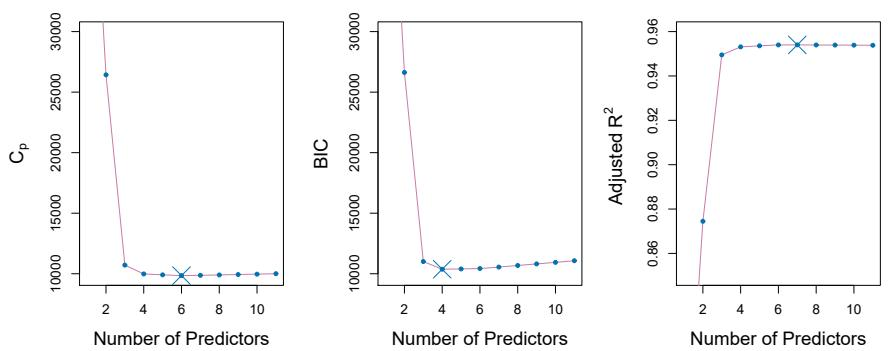  
FIGURE 6.2. $C_{p}$ , BIC, and adjusted $R^{2}$ are shown for the best models of each size for the Credit data set (the lower frontier in Figure 6.1). $C_{p}$ and BIC are estimates of test MSE. In the middle plot we see that the BIC estimate of test error shows an increase after four variables are selected. The other two plots are rather flat after four variables are included.

for the corresponding decrease in training RSS. Though it is beyond the scope of this book, one can show that if $\hat{\sigma}^{2}$ is an unbiased estimate of $\sigma^{2}$ in (6.2), then $C_{p}$ is an unbiased estimate of test MSE. As a consequence, the $C_{p}$ statistic tends to take on a small value for models with a low test error, so when determining which of a set of models is best, we choose the model with the lowest $C_{p}$ value. In Figure 6.2, $C_{p}$ selects the six-variable model containing the predictors income, limit, rating, cards, age and student.

The AIC criterion is defined for a large class of models fit by maximum likelihood. In the case of the model $(6.1)$ with Gaussian errors, maximum likelihood and least squares are the same thing. In this case AIC is given by

$$
\mathrm{AIC} = \frac {1}{n} \left(\mathrm{RSS} + 2 d \hat {\sigma} ^ {2}\right),
$$

where, for simplicity, we have omitted irrelevant constants. $^{5}$ Hence for least squares models, $C_{p}$ and AIC are proportional to each other, and so only $C_{p}$ is displayed in Figure 6.2.

BIC is derived from a Bayesian point of view, but ends up looking similar to $C_{p}$ (and AIC) as well. For the least squares model with d predictors, the BIC is, up to irrelevant constants, given by

$$
\mathrm{BIC} = \frac {1}{n} \left(\mathrm{RSS} + \log (n) d \hat {\sigma} ^ {2}\right). \tag {6.3}
$$

Like $C_p$ , the BIC will tend to take on a small value for a model with a low test error, and so generally we select the model that has the lowest BIC value. Notice that BIC replaces the $2d\hat{\sigma}^2$ used by $C_p$ with a $\log (n)d\hat{\sigma}^2$ term, where $n$ is the number of observations. Since $\log n > 2$ for any $n > 7$ ,

the BIC statistic generally places a heavier penalty on models with many variables, and hence results in the selection of smaller models than $C_{p}$ . In Figure 6.2, we see that this is indeed the case for the Credit data set; BIC chooses a model that contains only the four predictors income, limit, cards, and student. In this case the curves are very flat and so there does not appear to be much difference in accuracy between the four-variable and six-variable models.

The adjusted $R^{2}$ statistic is another popular approach for selecting among a set of models that contain different numbers of variables. Recall from Chapter 3 that the usual $R^{2}$ is defined as 1 - RSS/TSS, where $\mathrm{TSS} = \sum(y_{i} - \overline{y})^{2}$ is the total sum of squares for the response. Since RSS always decreases as more variables are added to the model, the $R^{2}$ always increases as more variables are added. For a least squares model with d variables, the adjusted $R^{2}$ statistic is calculated as

$$
\text {Adjusted} R ^ {2} = 1 - \frac {\mathrm{RSS} / (n - d - 1)}{\mathrm{TSS} / (n - 1)}. \tag {6.4}
$$

Unlike $C_{p}$ , AIC, and BIC, for which a small value indicates a model with a low test error, a large value of adjusted $R^{2}$ indicates a model with a small test error. Maximizing the adjusted $R^{2}$ is equivalent to minimizing $\frac{RSS}{n-d-1}$ . While RSS always decreases as the number of variables in the model increases, $\frac{RSS}{n-d-1}$ may increase or decrease, due to the presence of d in the denominator.

The intuition behind the adjusted $R^{2}$ is that once all of the correct variables have been included in the model, adding additional noise variables will lead to only a very small decrease in RSS. Since adding noise variables leads to an increase in d, such variables will lead to an increase in $\frac{RSS}{n-d-1}$ , and consequently a decrease in the adjusted $R^{2}$ . Therefore, in theory, the model with the largest adjusted $R^{2}$ will have only correct variables and no noise variables. Unlike the $R^{2}$ statistic, the adjusted $R^{2}$ statistic pays a price for the inclusion of unnecessary variables in the model. Figure 6.2 displays the adjusted $R^{2}$ for the Credit data set. Using this statistic results in the selection of a model that contains seven variables, adding own to the model selected by $C_{p}$ and AIC.

$C_{p}$ , AIC, and BIC all have rigorous theoretical justifications that are beyond the scope of this book. These justifications rely on asymptotic arguments (scenarios where the sample size n is very large). Despite its popularity, and even though it is quite intuitive, the adjusted $R^{2}$ is not as well motivated in statistical theory as AIC, BIC, and $C_{p}$ . All of these measures are simple to use and compute. Here we have presented their formulas in the case of a linear model fit using least squares; however, AIC and BIC can also be defined for more general types of models.

# Validation and Cross-Validation

As an alternative to the approaches just discussed, we can directly estimate the test error using the validation set and cross-validation methods discussed in Chapter 5. We can compute the validation set error or the cross-validation error for each model under consideration, and then select

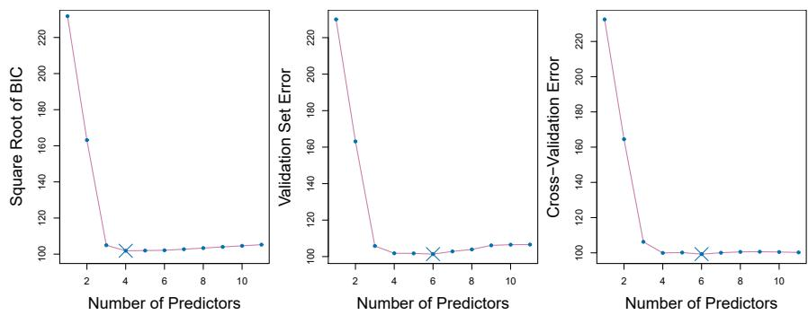  
FIGURE 6.3. For the Credit data set, three quantities are displayed for the best model containing d predictors, for d ranging from 1 to 11. The overall best model, based on each of these quantities, is shown as a blue cross. Left: Square root of BIC. Center: Validation set errors. Right: Cross-validation errors.

the model for which the resulting estimated test error is smallest. This procedure has an advantage relative to AIC, BIC, $C_{p}$ , and adjusted $R^{2}$ , in that it provides a direct estimate of the test error, and makes fewer assumptions about the true underlying model. It can also be used in a wider range of model selection tasks, even in cases where it is hard to pinpoint the model degrees of freedom (e.g. the number of predictors in the model) or hard to estimate the error variance $\sigma^{2}$ . Note that when cross-validation is used, the sequence of models $M_{k}$ in Algorithms 6.1–6.3 is determined separately for each training fold, and the validation errors are averaged over all folds for each model size k. This means, for example with best-subset regression, that $M_{k}$ , the best subset of size k, can differ across the folds. Once the best size k is chosen, we find the best model of that size on the full data set.

In the past, performing cross-validation was computationally prohibitive for many problems with large p and/or large n, and so AIC, BIC, $C_{p}$ , and adjusted $R^{2}$ were more attractive approaches for choosing among a set of models. However, nowadays with fast computers, the computations required to perform cross-validation are hardly ever an issue. Thus, cross-validation is a very attractive approach for selecting from among a number of models under consideration.

Figure 6.3 displays, as a function of d, the BIC, validation set errors, and cross-validation errors on the Credit data, for the best d-variable model. The validation errors were calculated by randomly selecting three-quarters of the observations as the training set, and the remainder as the validation set. The cross-validation errors were computed using k = 10 folds. In this case, the validation and cross-validation methods both result in a six-variable model. However, all three approaches suggest that the four-, five-, and six-variable models are roughly equivalent in terms of their test errors.

In fact, the estimated test error curves displayed in the center and right-hand panels of Figure 6.3 are quite flat. While a three-variable model clearly has lower estimated test error than a two-variable model, the estimated test errors of the 3- to 11-variable models are quite similar. Furthermore, if we

repeated the validation set approach using a different split of the data into a training set and a validation set, or if we repeated cross-validation using a different set of cross-validation folds, then the precise model with the lowest estimated test error would surely change. In this setting, we can select a model using the one-standard-error rule. We first calculate the standard error of the estimated test MSE for each model size, and then select the smallest model for which the estimated test error is within one standard error of the lowest point on the curve. The rationale here is that if a set of models appear to be more or less equally good, then we might as well choose the simplest model—that is, the model with the smallest number of predictors. In this case, applying the one-standard-error rule to the validation set or cross-validation approach leads to selection of the three-variable model.

one-
standard-
error
rule

# 6.2 Shrinkage Methods

The subset selection methods described in Section 6.1 involve using least squares to fit a linear model that contains a subset of the predictors. As an alternative, we can fit a model containing all p predictors using a technique that constrains or regularizes the coefficient estimates, or equivalently, that shrinks the coefficient estimates towards zero. It may not be immediately obvious why such a constraint should improve the fit, but it turns out that shrinking the coefficient estimates can significantly reduce their variance. The two best-known techniques for shrinking the regression coefficients towards zero are ridge regression and the lasso.

# 6.2.1 Ridge Regression

Recall from Chapter 3 that the least squares fitting procedure estimates $\beta_0, \beta_1, \ldots, \beta_p$ using the values that minimize

$$
\mathrm{RSS} = \sum_ {i = 1} ^ {n} \left(y _ {i} - \beta_ {0} - \sum_ {j = 1} ^ {p} \beta_ {j} x _ {i j}\right) ^ {2}.
$$

Ridge regression is very similar to least squares, except that the coefficients are estimated by minimizing a slightly different quantity. In particular, the ridge regression coefficient estimates $\hat{\beta}^{R}$ are the values that minimize

$$
\sum_ {i = 1} ^ {n} \left(y _ {i} - \beta_ {0} - \sum_ {j = 1} ^ {p} \beta_ {j} x _ {i j}\right) ^ {2} + \lambda \sum_ {j = 1} ^ {p} \beta_ {j} ^ {2} = \mathrm{RSS} + \lambda \sum_ {j = 1} ^ {p} \beta_ {j} ^ {2}, \tag {6.5}
$$

where $\lambda \geq 0$ is a tuning parameter, to be determined separately. Equation 6.5 trades off two different criteria. As with least squares, ridge regression seeks coefficient estimates that fit the data well, by making the RSS small. However, the second term, $\lambda \sum_{j} \beta_{j}^{2}$ , called a shrinkage penalty, is small when $\beta_{1}, \ldots, \beta_{p}$ are close to zero, and so it has the effect of shrinking the estimates of $\beta_{j}$ towards zero. The tuning parameter $\lambda$ serves to control

ridge
regression

tuning parameter

shrinkage
penalty

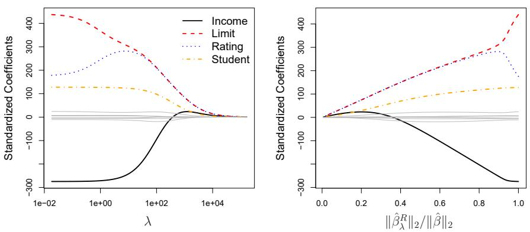  
FIGURE 6.4. The standardized ridge regression coefficients are displayed for the Credit data set, as a function of $\lambda$ and $\|\hat{\beta}_{\lambda}^{R}\|_{2}/\|\hat{\beta}\|_{2}$ .

the relative impact of these two terms on the regression coefficient estimates. When $\lambda = 0$ , the penalty term has no effect, and ridge regression will produce the least squares estimates. However, as $\lambda \to \infty$ , the impact of the shrinkage penalty grows, and the ridge regression coefficient estimates will approach zero. Unlike least squares, which generates only one set of coefficient estimates, ridge regression will produce a different set of coefficient estimates, $\hat{\beta}_{\lambda}^{R}$ , for each value of $\lambda$ . Selecting a good value for $\lambda$ is critical; we defer this discussion to Section 6.2.3, where we use cross-validation.

Note that in (6.5), the shrinkage penalty is applied to $\beta_{1},\ldots ,\beta_{p}$ , but not to the intercept $\beta_0$ . We want to shrink the estimated association of each variable with the response; however, we do not want to shrink the intercept, which is simply a measure of the mean value of the response when $x_{i1} = x_{i2} = \ldots = x_{ip} = 0$ . If we assume that the variables—that is, the columns of the data matrix $\mathbf{X}$ —have been centered to have mean zero before ridge regression is performed, then the estimated intercept will take the form $\hat{\beta}_0 = \bar{y} = \sum_{i = 1}^n y_i / n$ .

# An Application to the Credit Data

In Figure 6.4, the ridge regression coefficient estimates for the Credit data set are displayed. In the left-hand panel, each curve corresponds to the ridge regression coefficient estimate for one of the ten variables, plotted as a function of $\lambda$ . For example, the black solid line represents the ridge regression estimate for the income coefficient, as $\lambda$ is varied. At the extreme left-hand side of the plot, $\lambda$ is essentially zero, and so the corresponding ridge coefficient estimates are the same as the usual least squares estimates. But as $\lambda$ increases, the ridge coefficient estimates shrink towards zero. When $\lambda$ is extremely large, then all of the ridge coefficient estimates are basically zero; this corresponds to the null model that contains no predictors. In this plot, the income, limit, rating, and student variables are displayed in distinct colors, since these variables tend to have by far the largest coefficient estimates. While the ridge coefficient estimates tend to decrease in aggregate as $\lambda$ increases, individual coefficients, such as rating and income, may occasionally increase as $\lambda$ increases.

The right-hand panel of Figure 6.4 displays the same ridge coefficient estimates as the left-hand panel, but instead of displaying $\lambda$ on the x-axis, we now display $\|\hat{\beta}_{\lambda}^{R}\|_{2}/\|\hat{\beta}\|_{2}$ , where $\hat{\beta}$ denotes the vector of least squares coefficient estimates. The notation $\|\beta\|_{2}$ denotes the $\ell_{2}$ norm (pronounced “ell 2”) of a vector, and is defined as $\|\beta\|_{2}=\sqrt{\sum_{j=1}^{p}\beta_{j}^{2}}$ . It measures the distance of $\beta$ from zero. As $\lambda$ increases, the $\ell_{2}$ norm of $\hat{\beta}_{\lambda}^{R}$ will always decrease, and so will $\|\hat{\beta}_{\lambda}^{R}\|_{2}/\|\hat{\beta}\|_{2}$ . The latter quantity ranges from 1 (when $\lambda=0$ , in which case the ridge regression coefficient estimate is the same as the least squares estimate, and so their $\ell_{2}$ norms are the same) to 0 (when $\lambda=\infty$ , in which case the ridge regression coefficient estimate is a vector of zeros, with $\ell_{2}$ norm equal to zero). Therefore, we can think of the x-axis in the right-hand panel of Figure 6.4 as the amount that the ridge regression coefficient estimates have been shrunken towards zero; a small value indicates that they have been shrunken very close to zero.

The standard least squares coefficient estimates discussed in Chapter 3 are scale equivariant: multiplying $X_{j}$ by a constant c simply leads to a scaling of the least squares coefficient estimates by a factor of 1/c. In other words, regardless of how the jth predictor is scaled, $X_{j}\hat{\beta}_{j}$ will remain the same. In contrast, the ridge regression coefficient estimates can change substantially when multiplying a given predictor by a constant. For instance, consider the income variable, which is measured in dollars. One could reasonably have measured income in thousands of dollars, which would result in a reduction in the observed values of income by a factor of 1,000. Now due to the sum of squared coefficients term in the ridge regression formulation (6.5), such a change in scale will not simply cause the ridge regression coefficient estimate for income to change by a factor of 1,000. In other words, $X_{j}\hat{\beta}_{j,\lambda}^{R}$ will depend not only on the value of $\lambda$ , but also on the scaling of the jth predictor. In fact, the value of $X_{j}\hat{\beta}_{j,\lambda}^{R}$ may even depend on the scaling of the other predictors! Therefore, it is best to apply ridge regression after standardizing the predictors, using the formula

$$
\tilde {x} _ {i j} = \frac {x _ {i j}}{\sqrt {\frac {1}{n} \sum_ {i = 1} ^ {n} (x _ {i j} - \overline {{x}} _ {j}) ^ {2}}}, \tag {6.6}
$$

so that they are all on the same scale. In $(6.6)$ , the denominator is the estimated standard deviation of the jth predictor. Consequently, all of the standardized predictors will have a standard deviation of one. As a result the final fit will not depend on the scale on which the predictors are measured. In Figure 6.4, the y-axis displays the standardized ridge regression coefficient estimates—that is, the coefficient estimates that result from performing ridge regression using standardized predictors.

# Why Does Ridge Regression Improve Over Least Squares?

Ridge regression's advantage over least squares is rooted in the bias-variance trade-off. As $\lambda$ increases, the flexibility of the ridge regression fit decreases, leading to decreased variance but increased bias. This is illustrated in the left-hand panel of Figure 6.5, using a simulated data set containing $p = 45$ predictors and $n = 50$ observations. The green curve in the left-hand panel

  
FIGURE 6.5. Squared bias (black), variance (green), and test mean squared error (purple) for the ridge regression predictions on a simulated data set, as a function of $\lambda$ and $\|\hat{\beta}_{\lambda}^{R}\|_{2}/\|\hat{\beta}\|_{2}$ . The horizontal dashed lines indicate the minimum possible MSE. The purple crosses indicate the ridge regression models for which the MSE is smallest.

of Figure 6.5 displays the variance of the ridge regression predictions as a function of $\lambda$ . At the least squares coefficient estimates, which correspond to ridge regression with $\lambda = 0$ , the variance is high but there is no bias. But as $\lambda$ increases, the shrinkage of the ridge coefficient estimates leads to a substantial reduction in the variance of the predictions, at the expense of a slight increase in bias. Recall that the test mean squared error (MSE), plotted in purple, is closely related to the variance plus the squared bias. For values of $\lambda$ up to about 10, the variance decreases rapidly, with very little increase in bias, plotted in black. Consequently, the MSE drops considerably as $\lambda$ increases from 0 to 10. Beyond this point, the decrease in variance due to increasing $\lambda$ slows, and the shrinkage on the coefficients causes them to be significantly underestimated, resulting in a large increase in the bias. The minimum MSE is achieved at approximately $\lambda = 30$ . Interestingly, because of its high variance, the MSE associated with the least squares fit, when $\lambda = 0$ , is almost as high as that of the null model for which all coefficient estimates are zero, when $\lambda = \infty$ . However, for an intermediate value of $\lambda$ , the MSE is considerably lower.

The right-hand panel of Figure 6.5 displays the same curves as the left-hand panel, this time plotted against the $\ell_{2}$ norm of the ridge regression coefficient estimates divided by the $\ell_{2}$ norm of the least squares estimates. Now as we move from left to right, the fits become more flexible, and so the bias decreases and the variance increases.

In general, in situations where the relationship between the response and the predictors is close to linear, the least squares estimates will have low bias but may have high variance. This means that a small change in the training data can cause a large change in the least squares coefficient estimates. In particular, when the number of variables p is almost as large as the number of observations n, as in the example in Figure 6.5, the least squares estimates will be extremely variable. And if p > n, then the least squares estimates do not even have a unique solution, whereas ridge regression can still perform well by trading off a small increase in bias for a

large decrease in variance. Hence, ridge regression works best in situations where the least squares estimates have high variance.

Ridge regression also has substantial computational advantages over best subset selection, which requires searching through $2^{p}$ models. As we discussed previously, even for moderate values of p, such a search can be computationally infeasible. In contrast, for any fixed value of $\lambda$ , ridge regression only fits a single model, and the model-fitting procedure can be performed quite quickly. In fact, one can show that the computations required to solve (6.5), simultaneously for all values of $\lambda$ , are almost identical to those for fitting a model using least squares.

# 6.2.2 The Lasso

Ridge regression does have one obvious disadvantage. Unlike best subset, forward stepwise, and backward stepwise selection, which will generally select models that involve just a subset of the variables, ridge regression will include all p predictors in the final model. The penalty $\lambda\sum\beta_{j}^{2}$ in (6.5) will shrink all of the coefficients towards zero, but it will not set any of them exactly to zero (unless $\lambda=\infty$ ). This may not be a problem for prediction accuracy, but it can create a challenge in model interpretation in settings in which the number of variables p is quite large. For example, in the Credit data set, it appears that the most important variables are income, limit, rating, and student. So we might wish to build a model including just these predictors. However, ridge regression will always generate a model involving all ten predictors. Increasing the value of $\lambda$ will tend to reduce the magnitudes of the coefficients, but will not result in exclusion of any of the variables.

The lasso is a relatively recent alternative to ridge regression that overcomes this disadvantage. The lasso coefficients, $\hat{\beta}_{\lambda}^{L}$ , minimize the quantity

lasso

$$
\sum_ {i = 1} ^ {n} \left(y _ {i} - \beta_ {0} - \sum_ {j = 1} ^ {p} \beta_ {j} x _ {i j}\right) ^ {2} + \lambda \sum_ {j = 1} ^ {p} | \beta_ {j} | = \mathrm{RSS} + \lambda \sum_ {j = 1} ^ {p} | \beta_ {j} |. \tag {6.7}
$$

Comparing (6.7) to (6.5), we see that the lasso and ridge regression have similar formulations. The only difference is that the $\beta_{j}^{2}$ term in the ridge regression penalty (6.5) has been replaced by $|\beta_{j}|$ in the lasso penalty (6.7). In statistical parlance, the lasso uses an $\ell_{1}$ (pronounced “ell 1”) penalty instead of an $\ell_{2}$ penalty. The $\ell_{1}$ norm of a coefficient vector $\beta$ is given by $\|\beta\|_{1} = \sum |\beta_{j}|$ .

As with ridge regression, the lasso shrinks the coefficient estimates towards zero. However, in the case of the lasso, the $\ell_{1}$ penalty has the effect of forcing some of the coefficient estimates to be exactly equal to zero when the tuning parameter $\lambda$ is sufficiently large. Hence, much like best subset selection, the lasso performs variable selection. As a result, models generated from the lasso are generally much easier to interpret than those produced by ridge regression. We say that the lasso yields sparse models—that is, models that involve only a subset of the variables. As in ridge regression, selecting a good value of $\lambda$ for the lasso is critical; we defer this discussion to Section 6.2.3, where we use cross-validation.

sparse

  
FIGURE 6.6. The standardized lasso coefficients on the Credit data set are shown as a function of $\lambda$ and $\|\hat{\beta}_{\lambda}^{L}\|_{1}/\|\hat{\beta}\|_{1}$ .

As an example, consider the coefficient plots in Figure 6.6, which are generated from applying the lasso to the Credit data set. When $\lambda = 0$ , then the lasso simply gives the least squares fit, and when $\lambda$ becomes sufficiently large, the lasso gives the null model in which all coefficient estimates equal zero. However, in between these two extremes, the ridge regression and lasso models are quite different from each other. Moving from left to right in the right-hand panel of Figure 6.6, we observe that at first the lasso results in a model that contains only the rating predictor. Then student and limit enter the model almost simultaneously, shortly followed by income. Eventually, the remaining variables enter the model. Hence, depending on the value of $\lambda$ , the lasso can produce a model involving any number of variables. In contrast, ridge regression will always include all of the variables in the model, although the magnitude of the coefficient estimates will depend on $\lambda$ .

# Another Formulation for Ridge Regression and the Lasso

One can show that the lasso and ridge regression coefficient estimates solve the problems

$$
\text {minimize} \left\{\sum_ {i = 1} ^ {n} \left(y _ {i} - \beta_ {0} - \sum_ {j = 1} ^ {p} \beta_ {j} x _ {i j}\right) ^ {2} \right\} \quad \text {subject to} \quad \sum_ {j = 1} ^ {p} | \beta_ {j} | \leq s \tag {6.8}
$$

and

$$
\text {minimize} \left\{\sum_ {i = 1} ^ {n} \left(y _ {i} - \beta_ {0} - \sum_ {j = 1} ^ {p} \beta_ {j} x _ {i j}\right) ^ {2} \right\} \quad \text {subject to} \quad \sum_ {j = 1} ^ {p} \beta_ {j} ^ {2} \leq s, \tag {6.9}
$$

respectively. In other words, for every value of $\lambda$ , there is some s such that the Equations (6.7) and (6.8) will give the same lasso coefficient estimates. Similarly, for every value of $\lambda$ there is a corresponding s such that Equations (6.5) and (6.9) will give the same ridge regression coefficient estimates.

When $p = 2$ , then (6.8) indicates that the lasso coefficient estimates have the smallest RSS out of all points that lie within the diamond defined by $|\beta_1| + |\beta_2| \leq s$ . Similarly, the ridge regression estimates have the smallest RSS out of all points that lie within the circle defined by $\beta_1^2 + \beta_2^2 \leq s$ .

We can think of $(6.8)$ as follows. When we perform the lasso we are trying to find the set of coefficient estimates that lead to the smallest RSS, subject to the constraint that there is a budget s for how large $\sum_{j=1}^{p} |\beta_{j}|$ can be. When s is extremely large, then this budget is not very restrictive, and so the coefficient estimates can be large. In fact, if s is large enough that the least squares solution falls within the budget, then $(6.8)$ will simply yield the least squares solution. In contrast, if s is small, then $\sum_{j=1}^{p} |\beta_{j}|$ must be small in order to avoid violating the budget. Similarly, $(6.9)$ indicates that when we perform ridge regression, we seek a set of coefficient estimates such that the RSS is as small as possible, subject to the requirement that $\sum_{i=1}^{p} \beta_{i}^{2}$ not exceed the budget s.

The formulations (6.8) and (6.9) reveal a close connection between the lasso, ridge regression, and best subset selection. Consider the problem

$$
\text {minimize} \left\{\sum_ {i = 1} ^ {n} \left(y _ {i} - \beta_ {0} - \sum_ {j = 1} ^ {p} \beta_ {j} x _ {i j}\right) ^ {2} \right\} \quad \text {subject to} \quad \sum_ {j = 1} ^ {p} I (\beta_ {j} \neq 0) \leq s. \tag {6.10}
$$

Here $I(\beta_j \neq 0)$ is an indicator variable: it takes on a value of 1 if $\beta_j \neq 0$ , and equals zero otherwise. Then (6.10) amounts to finding a set of coefficient estimates such that RSS is as small as possible, subject to the constraint that no more than $s$ coefficients can be nonzero. The problem (6.10) is equivalent to best subset selection. Unfortunately, solving (6.10) is computationally infeasible when $p$ is large, since it requires considering all $\binom{p}{s}$ models containing $s$ predictors. Therefore, we can interpret ridge regression and the lasso as computationally feasible alternatives to best subset selection that replace the intractable form of the budget in (6.10) with forms that are much easier to solve. Of course, the lasso is much more closely related to best subset selection, since the lasso performs feature selection for $s$ sufficiently small in (6.8), while ridge regression does not.

# The Variable Selection Property of the Lasso

Why is it that the lasso, unlike ridge regression, results in coefficient estimates that are exactly equal to zero? The formulations (6.8) and (6.9) can be used to shed light on the issue. Figure 6.7 illustrates the situation. The least squares solution is marked as $\hat{\beta}$ , while the blue diamond and circle represent the lasso and ridge regression constraints in (6.8) and (6.9), respectively. If s is sufficiently large, then the constraint regions will contain $\hat{\beta}$ , and so the ridge regression and lasso estimates will be the same as the least squares estimates. (Such a large value of s corresponds to $\lambda = 0$ in (6.5) and (6.7).) However, in Figure 6.7 the least squares estimates lie outside of the diamond and the circle, and so the least squares estimates are not the same as the lasso and ridge regression estimates.

Each of the ellipses centered around $\hat{\beta}$ represents a contour: this means that all of the points on a particular ellipse have the same RSS value. As

contour

  
FIGURE 6.7. Contours of the error and constraint functions for the lasso (left) and ridge regression (right). The solid blue areas are the constraint regions, $|\beta_{1}| + |\beta_{2}| \leq s$ and $\beta_{1}^{2} + \beta_{2}^{2} \leq s$ , while the red ellipses are the contours of the RSS.

the ellipses expand away from the least squares coefficient estimates, the RSS increases. Equations (6.8) and (6.9) indicate that the lasso and ridge regression coefficient estimates are given by the first point at which an ellipse contacts the constraint region. Since ridge regression has a circular constraint with no sharp points, this intersection will not generally occur on an axis, and so the ridge regression coefficient estimates will be exclusively non-zero. However, the lasso constraint has corners at each of the axes, and so the ellipse will often intersect the constraint region at an axis. When this occurs, one of the coefficients will equal zero. In higher dimensions, many of the coefficient estimates may equal zero simultaneously. In Figure 6.7, the intersection occurs at $\beta_{1}=0$ , and so the resulting model will only include $\beta_{2}$ .

In Figure 6.7, we considered the simple case of p = 2. When p = 3, then the constraint region for ridge regression becomes a sphere, and the constraint region for the lasso becomes a polyhedron. When p > 3, the constraint for ridge regression becomes a hypersphere, and the constraint for the lasso becomes a polytope. However, the key ideas depicted in Figure 6.7 still hold. In particular, the lasso leads to feature selection when p > 2 due to the sharp corners of the polyhedron or polytope.

# Comparing the Lasso and Ridge Regression

It is clear that the lasso has a major advantage over ridge regression, in that it produces simpler and more interpretable models that involve only a subset of the predictors. However, which method leads to better prediction accuracy? Figure 6.8 displays the variance, squared bias, and test MSE of the lasso applied to the same simulated data as in Figure 6.5. Clearly the lasso leads to qualitatively similar behavior to ridge regression, in that as $\lambda$ increases, the variance decreases and the bias increases. In the right-hand

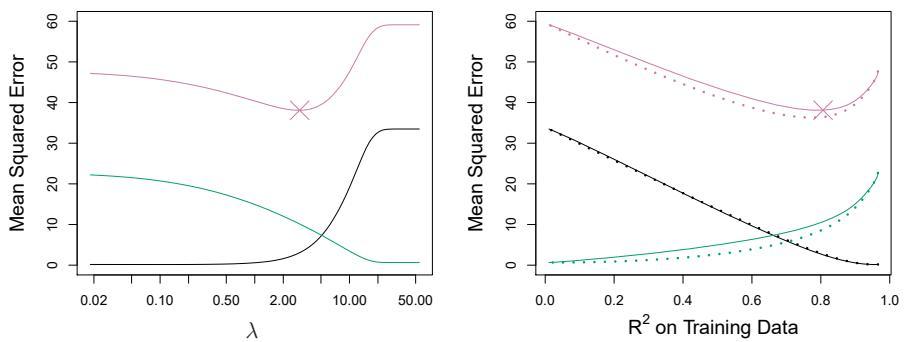  
FIGURE 6.8. Left: Plots of squared bias (black), variance (green), and test MSE (purple) for the lasso on a simulated data set. Right: Comparison of squared bias, variance, and test MSE between lasso (solid) and ridge (dotted). Both are plotted against their $R^{2}$ on the training data, as a common form of indexing. The crosses in both plots indicate the lasso model for which the MSE is smallest.

panel of Figure 6.8, the dotted lines represent the ridge regression fits. Here we plot both against their $R^{2}$ on the training data. This is another useful way to index models, and can be used to compare models with different types of regularization, as is the case here. In this example, the lasso and ridge regression result in almost identical biases. However, the variance of ridge regression is slightly lower than the variance of the lasso. Consequently, the minimum MSE of ridge regression is slightly smaller than that of the lasso.

However, the data in Figure 6.8 were generated in such a way that all 45 predictors were related to the response—that is, none of the true coefficients $\beta_{1},\ldots,\beta_{45}$ equaled zero. The lasso implicitly assumes that a number of the coefficients truly equal zero. Consequently, it is not surprising that ridge regression outperforms the lasso in terms of prediction error in this setting. Figure 6.9 illustrates a similar situation, except that now the response is a function of only 2 out of 45 predictors. Now the lasso tends to outperform ridge regression in terms of bias, variance, and MSE.

These two examples illustrate that neither ridge regression nor the lasso will universally dominate the other. In general, one might expect the lasso to perform better in a setting where a relatively small number of predictors have substantial coefficients, and the remaining predictors have coefficients that are very small or that equal zero. Ridge regression will perform better when the response is a function of many predictors, all with coefficients of roughly equal size. However, the number of predictors that is related to the response is never known a priori for real data sets. A technique such as cross-validation can be used in order to determine which approach is better on a particular data set.

As with ridge regression, when the least squares estimates have excessively high variance, the lasso solution can yield a reduction in variance at the expense of a small increase in bias, and consequently can generate more accurate predictions. Unlike ridge regression, the lasso performs variable selection, and hence results in models that are easier to interpret.
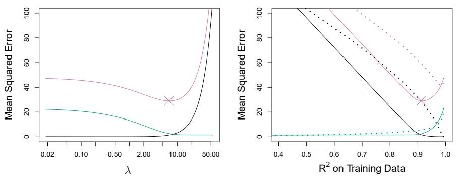  
FIGURE 6.9. Left: Plots of squared bias (black), variance (green), and test MSE (purple) for the lasso. The simulated data is similar to that in Figure 6.8, except that now only two predictors are related to the response. Right: Comparison of squared bias, variance, and test MSE between lasso (solid) and ridge (dotted). Both are plotted against their $R^{2}$ on the training data, as a common form of indexing. The crosses in both plots indicate the lasso model for which the MSE is smallest.

There are very efficient algorithms for fitting both ridge and lasso models; in both cases the entire coefficient paths can be computed with about the same amount of work as a single least squares fit. We will explore this further in the lab at the end of this chapter.

# A Simple Special Case for Ridge Regression and the Lasso

In order to obtain a better intuition about the behavior of ridge regression and the lasso, consider a simple special case with $n = p$ , and $\mathbf{X}$ a diagonal matrix with 1's on the diagonal and 0's in all off-diagonal elements. To simplify the problem further, assume also that we are performing regression without an intercept. With these assumptions, the usual least squares problem simplifies to finding $\beta_1, \ldots, \beta_p$ that minimize

$$
\sum_ {j = 1} ^ {p} (y _ {j} - \beta_ {j}) ^ {2}. \tag {6.11}
$$

In this case, the least squares solution is given by

$$
\hat {\beta} _ {j} = y _ {j}.
$$

And in this setting, ridge regression amounts to finding $\beta_{1},\ldots ,\beta_{p}$ such that

$$
\sum_ {j = 1} ^ {p} (y _ {j} - \beta_ {j}) ^ {2} + \lambda \sum_ {j = 1} ^ {p} \beta_ {j} ^ {2} \tag {6.12}
$$

is minimized, and the lasso amounts to finding the coefficients such that

$$
\sum_ {j = 1} ^ {p} (y _ {j} - \beta_ {j}) ^ {2} + \lambda \sum_ {j = 1} ^ {p} | \beta_ {j} | \tag {6.13}
$$

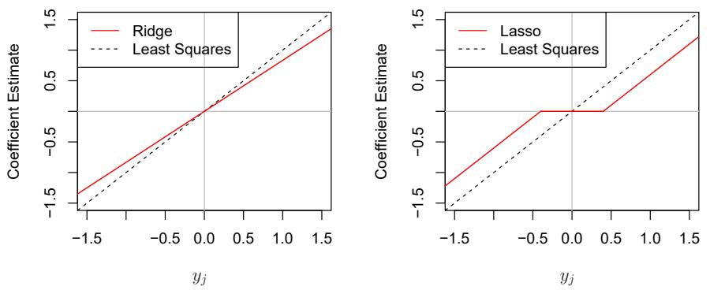  
FIGURE 6.10. The ridge regression and lasso coefficient estimates for a simple setting with n = p and X a diagonal matrix with 1's on the diagonal. Left: The ridge regression coefficient estimates are shrunken proportionally towards zero, relative to the least squares estimates. Right: The lasso coefficient estimates are soft-thresholded towards zero.

is minimized. One can show that in this setting, the ridge regression estimates take the form

$$
\hat {\beta} _ {j} ^ {R} = y _ {j} / (1 + \lambda), \tag {6.14}
$$

and the lasso estimates take the form

$$
\hat {\beta} _ {j} ^ {L} = \left\{ \begin{array}{l l} y _ {j} - \lambda / 2 & \text {if} y _ {j} > \lambda / 2; \\ y _ {j} + \lambda / 2 & \text {if} y _ {j} <   - \lambda / 2; \\ 0 & \text {if} | y _ {j} | \leq \lambda / 2. \end{array} \right. \tag {6.15}
$$

Figure 6.10 displays the situation. We can see that ridge regression and the lasso perform two very different types of shrinkage. In ridge regression, each least squares coefficient estimate is shrunken by the same proportion. In contrast, the lasso shrinks each least squares coefficient towards zero by a constant amount, $\lambda/2$ ; the least squares coefficients that are less than $\lambda/2$ in absolute value are shrunken entirely to zero. The type of shrinkage performed by the lasso in this simple setting (6.15) is known as soft-thresholding. The fact that some lasso coefficients are shrunken entirely to zero explains why the lasso performs feature selection.

In the case of a more general data matrix X, the story is a little more complicated than what is depicted in Figure 6.10, but the main ideas still hold approximately: ridge regression more or less shrinks every dimension of the data by the same proportion, whereas the lasso more or less shrinks all coefficients toward zero by a similar amount, and sufficiently small coefficients are shrunken all the way to zero.

# Bayesian Interpretation of Ridge Regression and the Lasso

soft-
thresholding

We now show that one can view ridge regression and the lasso through a Bayesian lens. A Bayesian viewpoint for regression assumes that the coefficient vector $\beta$ has some prior distribution, say $p(\beta)$ , where $\beta = (\beta_{0}, \beta_{1}, \ldots, \beta_{p})^{T}$ . The likelihood of the data can be written as $f(Y|X, \beta)$ ,


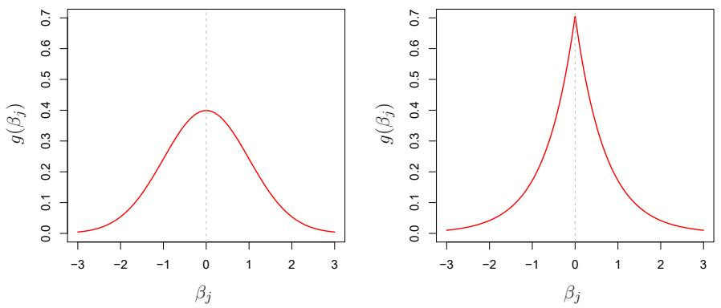  
FIGURE 6.11. Left: Ridge regression is the posterior mode for $\beta$ under a Gaussian prior. Right: The lasso is the posterior mode for $\beta$ under a double-exponential prior.

where $X = (X_{1}, \ldots, X_{p})$ . Multiplying the prior distribution by the likelihood gives us (up to a proportionality constant) the posterior distribution, which takes the form

posterior distribution

$$
p (\beta | X, Y) \propto f (Y | X, \beta) p (\beta | X) = f (Y | X, \beta) p (\beta),
$$

where the proportionality above follows from Bayes' theorem, and the equality above follows from the assumption that $X$ is fixed.

We assume the usual linear model,

$$
Y = \beta_ {0} + X _ {1} \beta_ {1} + \dots + X _ {p} \beta_ {p} + \epsilon ,
$$

and suppose that the errors are independent and drawn from a normal distribution. Furthermore, assume that $p(\beta) = \prod_{j=1}^{p} g(\beta_j)$ , for some density function g. It turns out that ridge regression and the lasso follow naturally from two special cases of g:

- If $g$ is a Gaussian distribution with mean zero and standard deviation a function of $\lambda$ , then it follows that the posterior mode for $\beta$ —that is, the most likely value for $\beta$ , given the data—is given by the ridge regression solution. (In fact, the ridge regression solution is also the posterior mean.)  
- If $g$ is a double-exponential (Laplace) distribution with mean zero and scale parameter a function of $\lambda$ , then it follows that the posterior mode for $\beta$ is the lasso solution. (However, the lasso solution is not the posterior mean, and in fact, the posterior mean does not yield a sparse coefficient vector.)

The Gaussian and double-exponential priors are displayed in Figure 6.11. Therefore, from a Bayesian viewpoint, ridge regression and the lasso follow directly from assuming the usual linear model with normal errors, together with a simple prior distribution for $\beta$ . Notice that the lasso prior is steeply peaked at zero, while the Gaussian is flatter and fatter at zero. Hence, the lasso expects a priori that many of the coefficients are (exactly) zero, while ridge assumes the coefficients are randomly distributed about zero.

posterior
mode

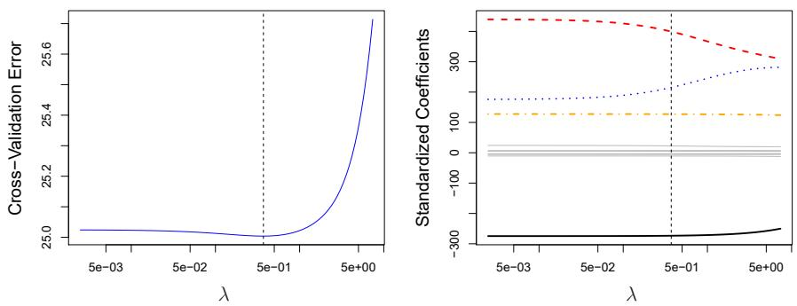  
FIGURE 6.12. Left: Cross-validation errors that result from applying ridge regression to the Credit data set with various values of $\lambda$ . Right: The coefficient estimates as a function of $\lambda$ . The vertical dashed lines indicate the value of $\lambda$ selected by cross-validation.

# 6.2.3 Selecting the Tuning Parameter

Just as the subset selection approaches considered in Section 6.1 require a method to determine which of the models under consideration is best, implementing ridge regression and the lasso requires a method for selecting a value for the tuning parameter $\lambda$ in (6.5) and (6.7), or equivalently, the value of the constraint s in (6.9) and (6.8). Cross-validation provides a simple way to tackle this problem. We choose a grid of $\lambda$ values, and compute the cross-validation error for each value of $\lambda$ , as described in Chapter 5. We then select the tuning parameter value for which the cross-validation error is smallest. Finally, the model is re-fit using all of the available observations and the selected value of the tuning parameter.

Figure 6.12 displays the choice of $\lambda$ that results from performing leave-one-out cross-validation on the ridge regression fits from the Credit data set. The dashed vertical lines indicate the selected value of $\lambda$ . In this case the value is relatively small, indicating that the optimal fit only involves a small amount of shrinkage relative to the least squares solution. In addition, the dip is not very pronounced, so there is rather a wide range of values that would give a very similar error. In a case like this we might simply use the least squares solution.

Figure 6.13 provides an illustration of ten-fold cross-validation applied to the lasso fits on the sparse simulated data from Figure 6.9. The left-hand panel of Figure 6.13 displays the cross-validation error, while the right-hand panel displays the coefficient estimates. The vertical dashed lines indicate the point at which the cross-validation error is smallest. The two colored lines in the right-hand panel of Figure 6.13 represent the two predictors that are related to the response, while the grey lines represent the unrelated predictors; these are often referred to as signal and noise variables, respectively. Not only has the lasso correctly given much larger coefficient estimates to the two signal predictors, but also the minimum cross-validation error corresponds to a set of coefficient estimates for which only the signal variables are non-zero. Hence cross-validation together with the lasso has correctly identified the two signal variables in the model, even though this is a challenging setting, with p = 45 variables and only n = 50

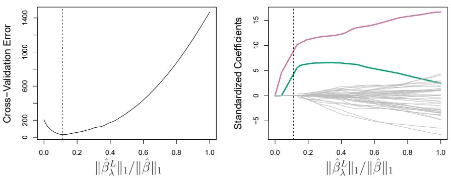  
FIGURE 6.13. Left: Ten-fold cross-validation MSE for the lasso, applied to the sparse simulated data set from Figure 6.9. Right: The corresponding lasso coefficient estimates are displayed. The two signal variables are shown in color, and the noise variables are in gray. The vertical dashed lines indicate the lasso fit for which the cross-validation error is smallest.

observations. In contrast, the least squares solution—displayed on the far right of the right-hand panel of Figure 6.13—assigns a large coefficient estimate to only one of the two signal variables.

# 6.3 Dimension Reduction Methods

The methods that we have discussed so far in this chapter have controlled variance in two different ways, either by using a subset of the original variables, or by shrinking their coefficients toward zero. All of these methods are defined using the original predictors, $X_{1}, X_{2}, \ldots, X_{p}$ . We now explore a class of approaches that transform the predictors and then fit a least squares model using the transformed variables. We will refer to these techniques as dimension reduction methods.

Let $Z_{1}, Z_{2}, \ldots, Z_{M}$ represent $M < p$ linear combinations of our original $p$ predictors. That is,

$$
Z _ {m} = \sum_ {j = 1} ^ {p} \phi_ {j m} X _ {j} \tag {6.16}
$$

for some constants $\phi_{1m},\phi_{2m}\ldots ,\phi_{pm}$ , $m = 1,\dots ,M$ . We can then fit the linear regression model

$$
y _ {i} = \theta_ {0} + \sum_ {m = 1} ^ {M} \theta_ {m} z _ {i m} + \epsilon_ {i}, \quad i = 1, \dots , n, \tag {6.17}
$$

using least squares. Note that in (6.17), the regression coefficients are given by $\theta_{0}, \theta_{1}, \ldots, \theta_{M}$ . If the constants $\phi_{1m}, \phi_{2m}, \ldots, \phi_{pm}$ are chosen wisely, then such dimension reduction approaches can often outperform least squares regression. In other words, fitting (6.17) using least squares can lead to better results than fitting (6.1) using least squares.

The term dimension reduction comes from the fact that this approach reduces the problem of estimating the $p+1$ coefficients $\beta_{0}, \beta_{1}, \ldots, \beta_{p}$ to the

dimension
reduction
linear
combination

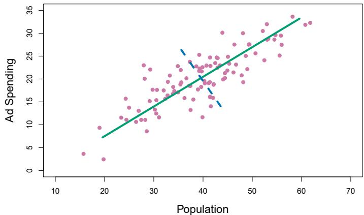

<details>
<summary>scatter</summary>

| Population | Ad Spending |
| --- | --- |
| ~15 | ~4 |
| ~19 | ~2.5 |
| ~19 | ~9.5 |
| ~23 | ~11.5 |
| ~24 | ~16 |
| ~25 | ~11 |
| ~26 | ~13.5 |
| ~27 | ~11 |
| ~28 | ~11 |
| ~28 | ~20 |
| ~28 | ~23 |
| ~29 | ~8.5 |
| ~29 | ~15 |
| ~30 | ~17.5 |
| ~30 | ~18 |
| ~31 | ~12 |
| ~31 | ~17.5 |
| ~32 | ~17.5 |
| ~33 | ~19 |
| ~34 | ~17 |
| ~35 | ~18 |
| ~36 | ~20 |
| ~37 | ~22 |
| ~38 | ~16 |
| ~39 | ~13.5 |
| ~39 | ~23 |
| ~40 | ~18 |
| ~40 | ~22 |
| ~40 | ~25 |
| ~41 | ~11.5 |
| ~41 | ~19 |
| ~41 | ~22 |
| ~42 | ~19 |
| ~42 | ~24 |
| ~43 | ~16 |
| ~43 | ~19 |
| ~43 | ~25 |
| ~44 | ~14 |
| ~44 | ~20 |
| ~44 | ~23 |
| ~45 | ~20 |
| ~45 | ~22 |
| ~46 | ~20 |
| ~46 | ~25 |
| ~47 | ~27.5 |
| ~48 | ~20 |
| ~48 | ~25 |
| ~49 | ~27.5 |
| ~50 | ~25.5 |
| ~51 | ~24 |
| ~52 | ~29 |
| ~53 | ~30.5 |
| ~54 | ~29 |
| ~55 | ~29.5 |
| ~56 | ~27.5 |
| ~57 | ~33.5 |
| ~58 | ~32 |
| ~60 | ~32.5 |
</details>

FIGURE 6.14. The population size (pop) and ad spending (ad) for 100 different cities are shown as purple circles. The green solid line indicates the first principal component, and the blue dashed line indicates the second principal component.

simpler problem of estimating the $M + 1$ coefficients $\theta_0, \theta_1, \ldots, \theta_M$ , where $M < p$ . In other words, the dimension of the problem has been reduced from $p + 1$ to $M + 1$ .

Notice that from (6.16),

$$
\sum_ {m = 1} ^ {M} \theta_ {m} z _ {i m} = \sum_ {m = 1} ^ {M} \theta_ {m} \sum_ {j = 1} ^ {p} \phi_ {j m} x _ {i j} = \sum_ {j = 1} ^ {p} \sum_ {m = 1} ^ {M} \theta_ {m} \phi_ {j m} x _ {i j} = \sum_ {j = 1} ^ {p} \beta_ {j} x _ {i j},
$$

where

$$
\beta_ {j} = \sum_ {m = 1} ^ {M} \theta_ {m} \phi_ {j m}. \tag {6.18}
$$

Hence (6.17) can be thought of as a special case of the original linear regression model given by (6.1). Dimension reduction serves to constrain the estimated $\beta_{j}$ coefficients, since now they must take the form (6.18). This constraint on the form of the coefficients has the potential to bias the coefficient estimates. However, in situations where p is large relative to n, selecting a value of $M \ll p$ can significantly reduce the variance of the fitted coefficients. If M = p, and all the $Z_{m}$ are linearly independent, then (6.18) poses no constraints. In this case, no dimension reduction occurs, and so fitting (6.17) is equivalent to performing least squares on the original p predictors.

All dimension reduction methods work in two steps. First, the transformed predictors $Z_{1}, Z_{2}, \ldots, Z_{M}$ are obtained. Second, the model is fit using these M predictors. However, the choice of $Z_{1}, Z_{2}, \ldots, Z_{M}$ , or equivalently, the selection of the $\phi_{jm}$ 's, can be achieved in different ways. In this chapter, we will consider two approaches for this task: principal components and partial least squares.

# 6.3.1 Principal Components Regression

Principal components analysis (PCA) is a popular approach for deriving

a low-dimensional set of features from a large set of variables. PCA is discussed in greater detail as a tool for unsupervised learning in Chapter 12. Here we describe its use as a dimension reduction technique for regression.

# An Overview of Principal Components Analysis

PCA is a technique for reducing the dimension of an $n \times p$ data matrix X. The first principal component direction of the data is that along which the observations vary the most. For instance, consider Figure 6.14, which shows population size (pop) in tens of thousands of people, and ad spending for a particular company (ad) in thousands of dollars, for 100 cities. $^{6}$ The green solid line represents the first principal component direction of the data. We can see by eye that this is the direction along which there is the greatest variability in the data. That is, if we projected the 100 observations onto this line (as shown in the left-hand panel of Figure 6.15), then the resulting projected observations would have the largest possible variance; projecting the observations onto any other line would yield projected observations with lower variance. Projecting a point onto a line simply involves finding the location on the line which is closest to the point.

The first principal component is displayed graphically in Figure 6.14, but how can it be summarized mathematically? It is given by the formula

$$
Z _ {1} = 0. 8 3 9 \times (\mathrm{pop} - \overline {{\mathrm{pop}}}) + 0. 5 4 4 \times (\mathrm{ad} - \overline {{\mathrm{ad}}}). \tag {6.19}
$$

Here $\phi_{11}=0.839$ and $\phi_{21}=0.544$ are the principal component loadings, which define the direction referred to above. In (6.19), $\overline{pop}$ indicates the mean of all pop values in this data set, and $\overline{ad}$ indicates the mean of all advertising spending. The idea is that out of every possible linear combination of pop and ad such that $\phi_{11}^{2}+\phi_{21}^{2}=1$ , this particular linear combination yields the highest variance: i.e. this is the linear combination for which $\mathrm{Var}(\phi_{11}\times(\mathrm{pop}-\overline{\mathrm{pop}})+\phi_{21}\times(\mathrm{ad}-\overline{\mathrm{ad}}))$ is maximized. It is necessary to consider only linear combinations of the form $\phi_{11}^{2}+\phi_{21}^{2}=1$ , since otherwise we could increase $\phi_{11}$ and $\phi_{21}$ arbitrarily in order to blow up the variance. In (6.19), the two loadings are both positive and have similar size, and so $Z_{1}$ is almost an average of the two variables.

Since $n = 100$ , pop and ad are vectors of length 100, and so is $Z_{1}$ in (6.19). For instance,

$$
z _ {i 1} = 0. 8 3 9 \times (\mathrm{pop} _ {i} - \overline {{\mathrm{pop}}}) + 0. 5 4 4 \times (\mathrm{ad} _ {i} - \overline {{\mathrm{ad}}}). \tag {6.20}
$$

The values of $z_{11}, \ldots, z_{n1}$ are known as the principal component scores, and can be seen in the right-hand panel of Figure 6.15.

There is also another interpretation of PCA: the first principal component vector defines the line that is as close as possible to the data. For instance, in Figure 6.14, the first principal component line minimizes the sum of the squared perpendicular distances between each point and the line. These distances are plotted as dashed line segments in the left-hand

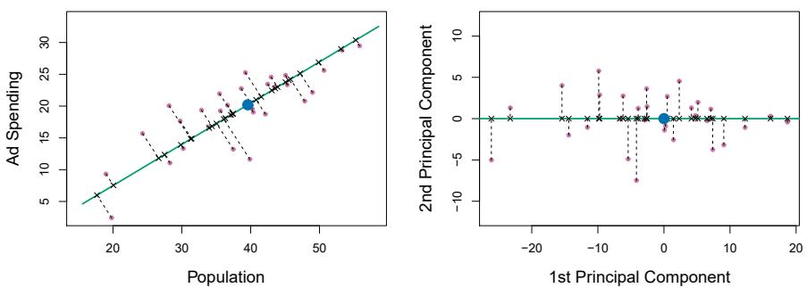  
FIGURE 6.15. A subset of the advertising data. The mean pop and ad budgets are indicated with a blue circle. Left: The first principal component direction is shown in green. It is the dimension along which the data vary the most, and it also defines the line that is closest to all n of the observations. The distances from each observation to the principal component are represented using the black dashed line segments. The blue dot represents $(\overline{\mathrm{pop}}, \overline{\mathrm{ad}})$ . Right: The left-hand panel has been rotated so that the first principal component direction coincides with the x-axis.

panel of Figure 6.15, in which the crosses represent the projection of each point onto the first principal component line. The first principal component has been chosen so that the projected observations are as close as possible to the original observations.

In the right-hand panel of Figure 6.15, the left-hand panel has been rotated so that the first principal component direction coincides with the x-axis. It is possible to show that the first principal component score for the ith observation, given in (6.20), is the distance in the x-direction of the ith cross from zero. So for example, the point in the bottom-left corner of the left-hand panel of Figure 6.15 has a large negative principal component score, $z_{i1} = -26.1$ , while the point in the top-right corner has a large positive score, $z_{i1} = 18.7$ . These scores can be computed directly using (6.20).

We can think of the values of the principal component $Z_{1}$ as single-number summaries of the joint pop and ad budgets for each location. In this example, if $z_{i1} = 0.839 \times (\text{pop}_{i} - \overline{\text{pop}}) + 0.544 \times (\text{ad}_{i} - \overline{\text{ad}}) < 0$ , then this indicates a city with below-average population size and below-average ad spending. A positive score suggests the opposite. How well can a single number represent both pop and ad? In this case, Figure 6.14 indicates that pop and ad have approximately a linear relationship, and so we might expect that a single-number summary will work well. Figure 6.16 displays $z_{i1}$ versus both pop and ad. $^{7}$ The plots show a strong relationship between the first principal component and the two features. In other words, the first principal component appears to capture most of the information contained in the pop and ad predictors.

So far we have concentrated on the first principal component. In general, one can construct up to p distinct principal components. The second

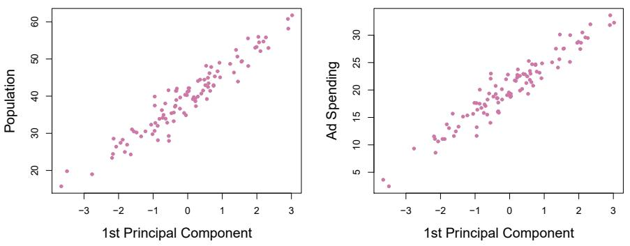  
FIGURE 6.16. Plots of the first principal component scores $z_{i1}$ versus pop and ad. The relationships are strong.

principal component $Z_{2}$ is a linear combination of the variables that is uncorrelated with $Z_{1}$ , and has largest variance subject to this constraint. The second principal component direction is illustrated as a dashed blue line in Figure 6.14. It turns out that the zero correlation condition of $Z_{1}$ with $Z_{2}$ is equivalent to the condition that the direction must be perpendicular, or orthogonal, to the first principal component direction. The second principal component is given by the formula

perpen-
dicular
orthogonal

$$
Z _ {2} = 0. 5 4 4 \times (\text {pop} - \overline {{\text {pop}}}) - 0. 8 3 9 \times (\text {ad} - \overline {{\text {ad}}}).
$$

Since the advertising data has two predictors, the first two principal components contain all of the information that is in pop and ad. However, by construction, the first component will contain the most information. Consider, for example, the much larger variability of $z_{i1}$ (the x-axis) versus $z_{i2}$ (the y-axis) in the right-hand panel of Figure 6.15. The fact that the second principal component scores are much closer to zero indicates that this component captures far less information. As another illustration, Figure 6.17 displays $z_{i2}$ versus pop and ad. There is little relationship between the second principal component and these two predictors, again suggesting that in this case, one only needs the first principal component in order to accurately represent the pop and ad budgets.

With two-dimensional data, such as in our advertising example, we can construct at most two principal components. However, if we had other predictors, such as population age, income level, education, and so forth, then additional components could be constructed. They would successively maximize variance, subject to the constraint of being uncorrelated with the preceding components.

# The Principal Components Regression Approach

The principal components regression (PCR) approach involves constructing the first M principal components, $Z_{1}, \ldots, Z_{M}$ , and then using these components as the predictors in a linear regression model that is fit using least squares. The key idea is that often a small number of principal components suffice to explain most of the variability in the data, as well as the relationship with the response. In other words, we assume that the

principal
components
regression

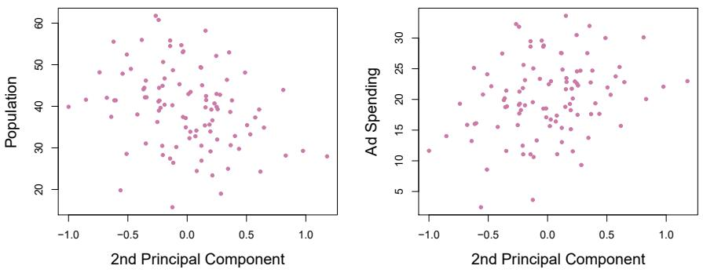  
FIGURE 6.17. Plots of the second principal component scores $z_{i2}$ versus pop and ad. The relationships are weak.

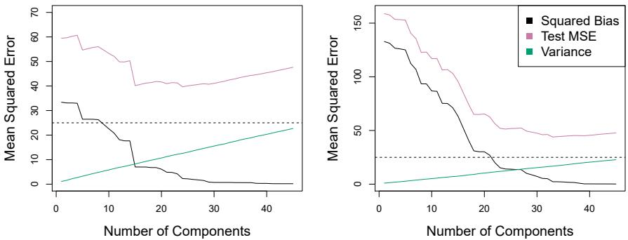  
FIGURE 6.18. PCR was applied to two simulated data sets. In each panel, the horizontal dashed line represents the irreducible error. Left: Simulated data from Figure 6.8. Right: Simulated data from Figure 6.9.

directions in which $X_{1},\ldots,X_{p}$ show the most variation are the directions that are associated with Y. While this assumption is not guaranteed to be true, it often turns out to be a reasonable enough approximation to give good results.

If the assumption underlying PCR holds, then fitting a least squares model to $Z_{1},\ldots,Z_{M}$ will lead to better results than fitting a least squares model to $X_{1},\ldots,X_{p}$ , since most or all of the information in the data that relates to the response is contained in $Z_{1},\ldots,Z_{M}$ , and by estimating only $M\ll p$ coefficients we can mitigate overfitting. In the advertising data, the first principal component explains most of the variance in both pop and ad, so a principal component regression that uses this single variable to predict some response of interest, such as sales, will likely perform quite well.

Figure 6.18 displays the PCR fits on the simulated data sets from Figures 6.8 and 6.9. Recall that both data sets were generated using n = 50 observations and p = 45 predictors. However, while the response in the first data set was a function of all the predictors, the response in the second data set was generated using only two of the predictors. The curves are plotted as a function of M, the number of principal components used as predictors in the regression model. As more principal components are used

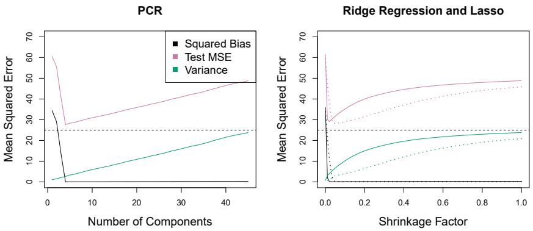  
FIGURE 6.19. PCR, ridge regression, and the lasso were applied to a simulated data set in which the first five principal components of X contain all the information about the response Y. In each panel, the irreducible error $\operatorname{Var}(\epsilon)$ is shown as a horizontal dashed line. Left: Results for PCR. Right: Results for lasso (solid) and ridge regression (dotted). The x-axis displays the shrinkage factor of the coefficient estimates, defined as the $\ell_{2}$ norm of the shrunken coefficient estimates divided by the $\ell_{2}$ norm of the least squares estimate.

in the regression model, the bias decreases, but the variance increases. This results in a typical U-shape for the mean squared error. When M = p = 45, then PCR amounts simply to a least squares fit using all of the original predictors. The figure indicates that performing PCR with an appropriate choice of M can result in a substantial improvement over least squares, especially in the left-hand panel. However, by examining the ridge regression and lasso results in Figures 6.5, 6.8, and 6.9, we see that PCR does not perform as well as the two shrinkage methods in this example.

The relatively worse performance of PCR in Figure 6.18 is a consequence of the fact that the data were generated in such a way that many principal components are required in order to adequately model the response. In contrast, PCR will tend to do well in cases when the first few principal components are sufficient to capture most of the variation in the predictors as well as the relationship with the response. The left-hand panel of Figure 6.19 illustrates the results from another simulated data set designed to be more favorable to PCR. Here the response was generated in such a way that it depends exclusively on the first five principal components. Now the bias drops to zero rapidly as M, the number of principal components used in PCR, increases. The mean squared error displays a clear minimum at M = 5. The right-hand panel of Figure 6.19 displays the results on these data using ridge regression and the lasso. All three methods offer a significant improvement over least squares. However, PCR and ridge regression slightly outperform the lasso.

We note that even though PCR provides a simple way to perform regression using $M < p$ predictors, it is not a feature selection method. This is because each of the $M$ principal components used in the regression is a linear combination of all $p$ of the original features. For instance, in (6.19), $Z_{1}$ was a linear combination of both pop and ad. Therefore, while PCR often performs quite well in many practical settings, it does not result in the

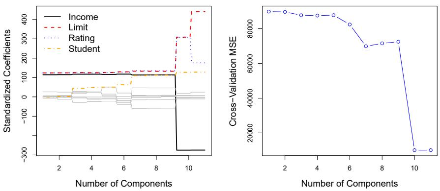  
FIGURE 6.20. Left: PCR standardized coefficient estimates on the Credit data set for different values of M. Right: The ten-fold cross-validation MSE obtained using PCR, as a function of M.

development of a model that relies upon a small set of the original features. In this sense, PCR is more closely related to ridge regression than to the lasso. In fact, one can show that PCR and ridge regression are very closely related. One can even think of ridge regression as a continuous version of PCR! $^{8}$

In PCR, the number of principal components, M, is typically chosen by cross-validation. The results of applying PCR to the Credit data set are shown in Figure 6.20; the right-hand panel displays the cross-validation errors obtained, as a function of M. On these data, the lowest cross-validation error occurs when there are M = 10 components; this corresponds to almost no dimension reduction at all, since PCR with M = 11 is equivalent to simply performing least squares.

When performing PCR, we generally recommend standardizing each predictor, using $(6.6)$ , prior to generating the principal components. This standardization ensures that all variables are on the same scale. In the absence of standardization, the high-variance variables will tend to play a larger role in the principal components obtained, and the scale on which the variables are measured will ultimately have an effect on the final PCR model. However, if the variables are all measured in the same units (say, kilograms, or inches), then one might choose not to standardize them.

# 6.3.2 Partial Least Squares

The PCR approach that we just described involves identifying linear combinations, or directions, that best represent the predictors $X_{1},\ldots,X_{p}$ . These directions are identified in an unsupervised way, since the response Y is not used to help determine the principal component directions. That is, the response does not supervise the identification of the principal components. Consequently, PCR suffers from a drawback: there is no guarantee

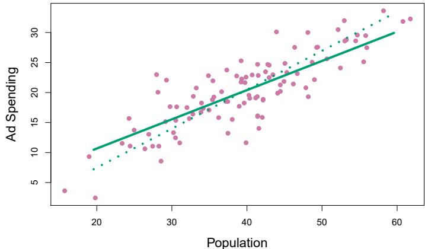

<details>
<summary>scatter</summary>

| Population | Ad Spending |
| --- | --- |
| ~16 | ~3.5 |
| ~19 | ~9.5 |
| ~19 | ~2.5 |
| ~20 | ~10.5 |
| ~23 | ~11.5 |
| ~24 | ~15.5 |
| ~25 | ~11.5 |
| ~26 | ~11.5 |
| ~27 | ~13.5 |
| ~28 | ~11.5 |
| ~28 | ~11.5 |
| ~28 | ~20.5 |
| ~28 | ~23.5 |
| ~29 | ~11.5 |
| ~29 | ~8.5 |
| ~30 | ~17.5 |
| ~30 | ~17.5 |
| ~31 | ~12.5 |
| ~31 | ~13.5 |
| ~31 | ~17.5 |
| ~32 | ~11.5 |
| ~33 | ~19.5 |
| ~34 | ~17.5 |
| ~34 | ~18.5 |
| ~35 | ~19.5 |
| ~35 | ~21.5 |
| ~36 | ~16.5 |
| ~36 | ~19.5 |
| ~37 | ~19.5 |
| ~37 | ~23.5 |
| ~38 | ~13.5 |
| ~39 | ~18.5 |
| ~39 | ~22.5 |
| ~40 | ~18.5 |
| ~40 | ~22.5 |
| ~40 | ~25.5 |
| ~41 | ~11.5 |
| ~41 | ~19.5 |
| ~41 | ~22.5 |
| ~42 | ~14.5 |
| ~42 | ~19.5 |
| ~42 | ~22.5 |
| ~43 | ~16.5 |
| ~43 | ~19.5 |
| ~43 | ~24.5 |
| ~44 | ~20.5 |
| ~44 | ~22.5 |
| ~44 | ~25.5 |
| ~45 | ~20.5 |
| ~45 | ~22.5 |
| ~45 | ~30.5 |
| ~46 | ~21.5 |
| ~47 | ~27.5 |
| ~48 | ~19.5 |
| ~48 | ~22.5 |
| ~49 | ~27.5 |
| ~49 | ~30.5 |
| ~50 | ~25.5 |
| ~51 | ~24.5 |
| ~52 | ~28.5 |
| ~53 | ~29.5 |
| ~54 | ~29.5 |
| ~55 | ~25.5 |
| ~56 | ~27.5 |
| ~57 | ~33.5 |
| ~58 | ~32.5 |
| ~59 | ~32.5 |
</details>

FIGURE 6.21. For the advertising data, the first PLS direction (solid line) and first PCR direction (dotted line) are shown.

that the directions that best explain the predictors will also be the best directions to use for predicting the response. Unsupervised methods are discussed further in Chapter 12.

We now present partial least squares (PLS), a supervised alternative to PCR. Like PCR, PLS is a dimension reduction method, which first identifies a new set of features $Z_{1}, \ldots, Z_{M}$ that are linear combinations of the original features, and then fits a linear model via least squares using these M new features. But unlike PCR, PLS identifies these new features in a supervised way—that is, it makes use of the response Y in order to identify new features that not only approximate the old features well, but also that are related to the response. Roughly speaking, the PLS approach attempts to find directions that help explain both the response and the predictors.

We now describe how the first PLS direction is computed. After standardizing the p predictors, PLS computes the first direction $Z_{1}$ by setting each $\phi_{j1}$ in (6.16) equal to the coefficient from the simple linear regression of Y onto $X_{j}$ . One can show that this coefficient is proportional to the correlation between Y and $X_{j}$ . Hence, in computing $Z_{1} = \sum_{j=1}^{p} \phi_{j1} X_{j}$ , PLS places the highest weight on the variables that are most strongly related to the response.

Figure 6.21 displays an example of PLS on a synthetic dataset with Sales in each of 100 regions as the response, and two predictors; Population Size and Advertising Spending. The solid green line indicates the first PLS direction, while the dotted line shows the first principal component direction. PLS has chosen a direction that has less change in the ad dimension per unit change in the pop dimension, relative to PCA. This suggests that pop is more highly correlated with the response than is ad. The PLS direction does not fit the predictors as closely as does PCA, but it does a better job explaining the response.

To identify the second PLS direction we first adjust each of the variables for $Z_{1}$ , by regressing each variable on $Z_{1}$ and taking residuals. These residuals can be interpreted as the remaining information that has not been explained by the first PLS direction. We then compute $Z_{2}$ using this or-

thogonalized data in exactly the same fashion as $Z_{1}$ was computed based on the original data. This iterative approach can be repeated M times to identify multiple PLS components $Z_{1},\ldots,Z_{M}$ . Finally, at the end of this procedure, we use least squares to fit a linear model to predict Y using $Z_{1},\ldots,Z_{M}$ in exactly the same fashion as for PCR.

As with PCR, the number M of partial least squares directions used in PLS is a tuning parameter that is typically chosen by cross-validation. We generally standardize the predictors and response before performing PLS.

PLS is popular in the field of chemometrics, where many variables arise from digitized spectrometry signals. In practice it often performs no better than ridge regression or PCR. While the supervised dimension reduction of PLS can reduce bias, it also has the potential to increase variance, so that the overall benefit of PLS relative to PCR is a wash.

# 6.4 Considerations in High Dimensions

# 6.4.1 High-Dimensional Data

Most traditional statistical techniques for regression and classification are intended for the low-dimensional setting in which n, the number of observations, is much greater than p, the number of features. This is due in part to the fact that throughout most of the field's history, the bulk of scientific problems requiring the use of statistics have been low-dimensional. For instance, consider the task of developing a model to predict a patient's blood pressure on the basis of his or her age, sex, and body mass index (BMI). There are three predictors, or four if an intercept is included in the model, and perhaps several thousand patients for whom blood pressure and age, sex, and BMI are available. Hence $n \gg p$ , and so the problem is low-dimensional. (By dimension here we are referring to the size of p.)

In the past 20 years, new technologies have changed the way that data are collected in fields as diverse as finance, marketing, and medicine. It is now commonplace to collect an almost unlimited number of feature measurements (p very large). While p can be extremely large, the number of observations n is often limited due to cost, sample availability, or other considerations. Two examples are as follows:

1. Rather than predicting blood pressure on the basis of just age, sex, and BMI, one might also collect measurements for half a million single nucleotide polymorphisms (SNPs; these are individual DNA mutations that are relatively common in the population) for inclusion in the predictive model. Then $n \approx 200$ and $p \approx 500,000$ .  
2. A marketing analyst interested in understanding people's online shopping patterns could treat as features all of the search terms entered by users of a search engine. This is sometimes known as the “bag-of-words” model. The same researcher might have access to the search histories of only a few hundred or a few thousand search engine users who have consented to share their information with the researcher. For a given user, each of the $p$ search terms is scored present (0) or

absent (1), creating a large binary feature vector. Then $n \approx 1,000$ and $p$ is much larger.

Data sets containing more features than observations are often referred to as high-dimensional. Classical approaches such as least squares linear regression are not appropriate in this setting. Many of the issues that arise in the analysis of high-dimensional data were discussed earlier in this book, since they apply also when n > p: these include the role of the bias-variance trade-off and the danger of overfitting. Though these issues are always relevant, they can become particularly important when the number of features is very large relative to the number of observations.

We have defined the high-dimensional setting as the case where the number of features p is larger than the number of observations n. But the considerations that we will now discuss certainly also apply if p is slightly smaller than n, and are best always kept in mind when performing supervised learning.

# 6.4.2 What Goes Wrong in High Dimensions?

In order to illustrate the need for extra care and specialized techniques for regression and classification when p > n, we begin by examining what can go wrong if we apply a statistical technique not intended for the high-dimensional setting. For this purpose, we examine least squares regression. But the same concepts apply to logistic regression, linear discriminant analysis, and other classical statistical approaches.

When the number of features p is as large as, or larger than, the number of observations n, least squares as described in Chapter 3 cannot (or rather, should not) be performed. The reason is simple: regardless of whether or not there truly is a relationship between the features and the response, least squares will yield a set of coefficient estimates that result in a perfect fit to the data, such that the residuals are zero.

An example is shown in Figure 6.22 with p = 1 feature (plus an intercept) in two cases: when there are 20 observations, and when there are only two observations. When there are 20 observations, n > p and the least squares regression line does not perfectly fit the data; instead, the regression line seeks to approximate the 20 observations as well as possible. On the other hand, when there are only two observations, then regardless of the values of those observations, the regression line will fit the data exactly. This is problematic because this perfect fit will almost certainly lead to overfitting of the data. In other words, though it is possible to perfectly fit the training data in the high-dimensional setting, the resulting linear model will perform extremely poorly on an independent test set, and therefore does not constitute a useful model. In fact, we can see that this happened in Figure 6.22: the least squares line obtained in the right-hand panel will perform very poorly on a test set comprised of the observations in the left-hand panel. The problem is simple: when p > n or $p \approx n$ , a simple least squares regression line is too flexible and hence overfits the data.

Figure 6.23 further illustrates the risk of carelessly applying least squares when the number of features p is large. Data were simulated with n = 20 observations, and regression was performed with between 1 and 20 features,

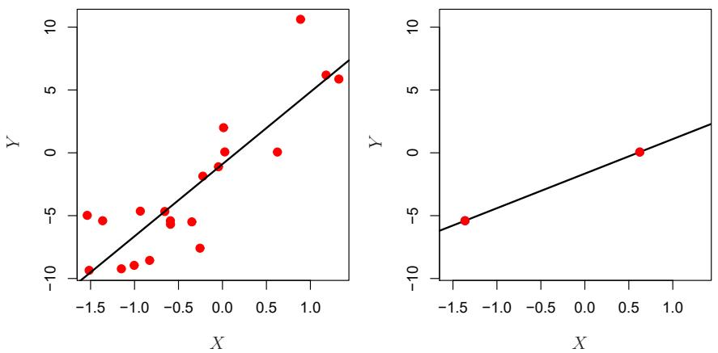  
FIGURE 6.22. Left: Least squares regression in the low-dimensional setting. Right: Least squares regression with n = 2 observations and two parameters to be estimated (an intercept and a coefficient).

  
FIGURE 6.23. On a simulated example with n = 20 training observations, features that are completely unrelated to the outcome are added to the model. Left: The $R^{2}$ increases to 1 as more features are included. Center: The training set MSE decreases to 0 as more features are included. Right: The test set MSE increases as more features are included.

each of which was completely unrelated to the response. As shown in the figure, the model $R^{2}$ increases to 1 as the number of features included in the model increases, and correspondingly the training set MSE decreases to 0 as the number of features increases, even though the features are completely unrelated to the response. On the other hand, the MSE on an independent test set becomes extremely large as the number of features included in the model increases, because including the additional predictors leads to a vast increase in the variance of the coefficient estimates. Looking at the test set MSE, it is clear that the best model contains at most a few variables. However, someone who carelessly examines only the $R^{2}$ or the training set MSE might erroneously conclude that the model with the greatest number of variables is best. This indicates the importance of applying extra care when analyzing data sets with a large number of variables, and of always evaluating model performance on an independent test set.

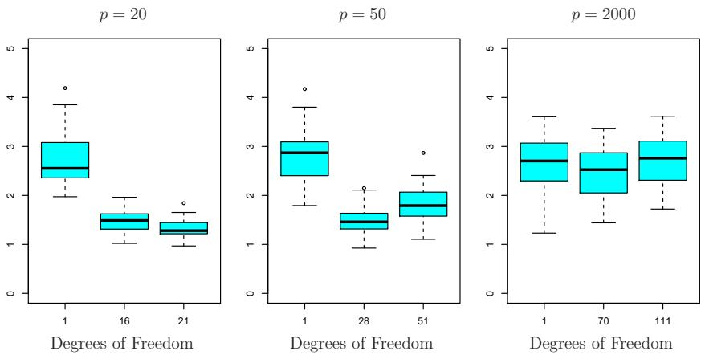  
FIGURE 6.24. The lasso was performed with n = 100 observations and three values of p, the number of features. Of the p features, 20 were associated with the response. The boxplots show the test MSEs that result using three different values of the tuning parameter $\lambda$ in (6.7). For ease of interpretation, rather than reporting $\lambda$ , the degrees of freedom are reported; for the lasso this turns out to be simply the number of estimated non-zero coefficients. When p = 20, the lowest test MSE was obtained with the smallest amount of regularization. When p = 50, the lowest test MSE was achieved when there is a substantial amount of regularization. When p = 2,000 the lasso performed poorly regardless of the amount of regularization, due to the fact that only 20 of the 2,000 features truly are associated with the outcome.

In Section 6.1.3, we saw a number of approaches for adjusting the training set RSS or $R^{2}$ in order to account for the number of variables used to fit a least squares model. Unfortunately, the $C_{p}$ , AIC, and BIC approaches are not appropriate in the high-dimensional setting, because estimating $\hat{\sigma}^{2}$ is problematic. (For instance, the formula for $\hat{\sigma}^{2}$ from Chapter 3 yields an estimate $\hat{\sigma}^{2}=0$ in this setting.) Similarly, problems arise in the application of adjusted $R^{2}$ in the high-dimensional setting, since one can easily obtain a model with an adjusted $R^{2}$ value of 1. Clearly, alternative approaches that are better-suited to the high-dimensional setting are required.

# 6.4.3 Regression in High Dimensions

It turns out that many of the methods seen in this chapter for fitting less flexible least squares models, such as forward stepwise selection, ridge regression, the lasso, and principal components regression, are particularly useful for performing regression in the high-dimensional setting. Essentially, these approaches avoid overfitting by using a less flexible fitting approach than least squares.

Figure 6.24 illustrates the performance of the lasso in a simple simulated example. There are p = 20, 50, or 2,000 features, of which 20 are truly associated with the outcome. The lasso was performed on n = 100 training observations, and the mean squared error was evaluated on an independent test set. As the number of features increases, the test set error increases. When p = 20, the lowest validation set error was achieved when $\lambda$ in

(6.7) was small; however, when p was larger then the lowest validation set error was achieved using a larger value of $\lambda$ . In each boxplot, rather than reporting the values of $\lambda$ used, the degrees of freedom of the resulting lasso solution is displayed; this is simply the number of non-zero coefficient estimates in the lasso solution, and is a measure of the flexibility of the lasso fit. Figure 6.24 highlights three important points: (1) regularization or shrinkage plays a key role in high-dimensional problems, (2) appropriate tuning parameter selection is crucial for good predictive performance, and (3) the test error tends to increase as the dimensionality of the problem (i.e. the number of features or predictors) increases, unless the additional features are truly associated with the response.

The third point above is in fact a key principle in the analysis of high-dimensional data, which is known as the curse of dimensionality. One might think that as the number of features used to fit a model increases, the quality of the fitted model will increase as well. However, comparing the left-hand and right-hand panels in Figure 6.24, we see that this is not necessarily the case: in this example, the test set MSE almost doubles as $p$ increases from 20 to 2,000. In general, adding additional signal features that are truly associated with the response will improve the fitted model, in the sense of leading to a reduction in test set error. However, adding noise features that are not truly associated with the response will lead to a deterioration in the fitted model, and consequently an increased test set error. This is because noise features increase the dimensionality of the problem, exacerbating the risk of overfitting (since noise features may be assigned nonzero coefficients due to chance associations with the response on the training set) without any potential upside in terms of improved test set error. Thus, we see that new technologies that allow for the collection of measurements for thousands or millions of features are a double-edged sword: they can lead to improved predictive models if these features are in fact relevant to the problem at hand, but will lead to worse results if the features are not relevant. Even if they are relevant, the variance incurred in fitting their coefficients may outweigh the reduction in bias that they bring.

curse of di-
mensionality

# 6.4.4 Interpreting Results in High Dimensions

When we perform the lasso, ridge regression, or other regression procedures in the high-dimensional setting, we must be quite cautious in the way that we report the results obtained. In Chapter 3, we learned about multicollinearity, the concept that the variables in a regression might be correlated with each other. In the high-dimensional setting, the multicollinearity problem is extreme: any variable in the model can be written as a linear combination of all of the other variables in the model. Essentially, this means that we can never know exactly which variables (if any) truly are predictive of the outcome, and we can never identify the best coefficients for use in the regression. At most, we can hope to assign large regression coefficients to variables that are correlated with the variables that truly are predictive of the outcome.

For instance, suppose that we are trying to predict blood pressure on the basis of half a million SNPs, and that forward stepwise selection indicates that 17 of those SNPs lead to a good predictive model on the training data. It would be incorrect to conclude that these 17 SNPs predict blood pressure more effectively than the other SNPs not included in the model. There are likely to be many sets of 17 SNPs that would predict blood pressure just as well as the selected model. If we were to obtain an independent data set and perform forward stepwise selection on that data set, we would likely obtain a model containing a different, and perhaps even non-overlapping, set of SNPs. This does not detract from the value of the model obtained—for instance, the model might turn out to be very effective in predicting blood pressure on an independent set of patients, and might be clinically useful for physicians. But we must be careful not to overstate the results obtained, and to make it clear that what we have identified is simply one of many possible models for predicting blood pressure, and that it must be further validated on independent data sets.

It is also important to be particularly careful in reporting errors and measures of model fit in the high-dimensional setting. We have seen that when p > n, it is easy to obtain a useless model that has zero residuals. Therefore, one should never use sum of squared errors, p-values, $R^{2}$ statistics, or other traditional measures of model fit on the training data as evidence of a good model fit in the high-dimensional setting. For instance, as we saw in Figure 6.23, one can easily obtain a model with $R^{2} = 1$ when p > n. Reporting this fact might mislead others into thinking that a statistically valid and useful model has been obtained, whereas in fact this provides absolutely no evidence of a compelling model. It is important to instead report results on an independent test set, or cross-validation errors. For instance, the MSE or $R^{2}$ on an independent test set is a valid measure of model fit, but the MSE on the training set certainly is not.

# 6.5 Lab: Linear Models and Regularization Methods

In this lab we implement many of the techniques discussed in this chapter. We import some of our libraries at this top level.

In [1]:

```python
import numpy as np
import pandas as pd
from matplotlib.pyplot import subplots
from statsmodels.api import OLS
import sklearn.model_selection as skm
import sklearn.linear_model as skl
from sklearn.preprocessing import StandardScaler
from ISLP import load_data
from ISLP.models import ModelSpec as MS
from functools import partial
```

We again collect the new imports needed for this lab.

In [2]:

```python
from sklearn.pipeline import Pipeline
from sklearn.decomposition import PCA
```

```python
from sklearn.cross_decomposition import PLSRegression
from ISLP.models import \
    (Stepwise,
        sklearn_selected,
        sklearn_selection_path)
!pip install l0bnb
from l0bnb import fit_path
```

We have installed the package 10bnb on the fly. Note the escaped !pip install — this is run as a separate system command.

# 6.5.1 Subset Selection Methods

Here we implement methods that reduce the number of parameters in a model by restricting the model to a subset of the input variables.

# Forward Selection

We will apply the forward-selection approach to the Hitters data. We wish to predict a baseball player's Salary on the basis of various statistics associated with performance in the previous year.

First of all, we note that the Salary variable is missing for some of the players. The np.isnan() function can be used to identify the missing observations. It returns an array of the same shape as the input vector, with a True for any elements that are missing, and a False for non-missing elements. The sum() method can then be used to count all of the missing elements.

```txt
np.isnan()

sum()
```

```python
In [3]: Hitters = load_data('Hitters')
np.isnan(Hitters['Salary']).sum()
```

```txt
Out [3]: 59
```

We see that Salary is missing for 59 players. The dropna() method of data frames removes all of the rows that have missing values in any variable (by default — see Hitters.dropna?).

```javascript
In [4]: Hitters = Hitters.dropna();
Hitters.shape
```

```txt
Out[4]: (263, 20)
```

We first choose the best model using forward selection based on $C_{p}$ (6.2). This score is not built in as a metric to sklearn. We therefore define a function to compute it ourselves, and use it as a scorer. By default, sklearn tries to maximize a score, hence our scoring function computes the negative $C_{p}$ statistic.

```python
def nCp(sigma2, estimator, X, Y):
    "Negative Cp statistic"
    n, p = X.shape
    Yhat = estimator.predict(X)
    RSS = np.sum((Y - Yhat)**2)
    return -(RSS + 2 * p * sigma2) / n
```

We need to estimate the residual variance $\sigma^{2}$ , which is the first argument in our scoring function above. We will fit the biggest model, using all the variables, and estimate $\sigma^{2}$ based on its MSE.

```txt
design = MS(Hitters.columns.drop('Salary')).fit(Hitters)
Y = np.array(Hitters['Salary'])
X = design.transform(Hitters)
sigma2 = OLS(Y,X).fit().scale
```

The function sklearn\_selected() expects a scorer with just three arguments — the last three in the definition of nCp() above. We use the function partial() first seen in Section 5.3.3 to freeze the first argument with our estimate of $\sigma^{2}$ .

```python
In [7]: neg_Cp = partial(nCp, sigma2)
```

We can now use neg\_Cp() as a scorer for model selection.

Along with a score we need to specify the search strategy. This is done through the object Stepwise() in the ISLP.models package. The method Stepwise.first\_peak() runs forward stepwise until any further additions to the model do not result in an improvement in the evaluation score. Similarly, the method Stepwise.fixed\_steps() runs a fixed number of steps of stepwise search.

```python
In [8]: strategy = Stepwise.first_peak(design,
                               direction='forward',
                               max_terms=len(design.terms))
```

We now fit a linear regression model with Salary as outcome using forward selection. To do so, we use the function sklearn\_selected() from the ISLP.models package. This takes a model from statsmodels along with a search strategy and selects a model with its fit method. Without specifying a scoring argument, the score defaults to MSE, and so all 19 variables will be selected (output not shown).

sklearn\_
selected()

```txt
In [9]: hitters_MSE = sklearn_selected(OLS,
                                      strategy)
    hitters_MSE.fit(Hitters, Y)
    hitters_MSE.selected_state_
```

Using neg\_Cp results in a smaller model, as expected, with just 10 variables selected.

```python
In [10]: hitters_Cp = sklearn_selected(OLS,
                               strategy,
                               scoring=neg_Cp)
hitters_Cp.fit(Hitters, Y)
hitters_Cp.selected_state_
```

```javascript
Out[10]: ('Assists',
            'AtBat',
            'CAtBat',
            'CRBI',
            'CRuns',
            'CWalks',
            'Division',
```

```txt
'Hits',
'PutOuts',
'Walks')
```

# Choosing Among Models Using the Validation Set Approach and Cross-Validation

As an alternative to using $C_{p}$ , we might try cross-validation to select a model in forward selection. For this, we need a method that stores the full path of models found in forward selection, and allows predictions for each of these. This can be done with the sklearn\_selection\_path() estimator from ISLP.models. The function cross\_val\_predict() from ISLP.models computes the cross-validated predictions for each of the models along the path, which we can use to evaluate the cross-validated MSE along the path.

Here we define a strategy that fits the full forward selection path. While there are various parameter choices for sklearn\_selection\_path(), we use the defaults here, which selects the model at each step based on the biggest reduction in RSS.

```txt
sklearn_
selection_
path()
cross_val_
predict()
```

```python
In [11]: strategy = Stepwise.fixed_steps(design,
                                      len(design.terms),
                                      direction='forward')
full_path = sklearn_selection_path(OLS, strategy)
```

We now fit the full forward-selection path on the Hitters data and compute the fitted values.

```txt
In [12]: full_path.fit(Hitters, Y)
Yhat_in = full_path.predict(Hitters)
Yhat_in.shape
```

```javascript
Out[12]: (263, 20)
```

This gives us an array of fitted values — 20 steps in all, including the fitted mean for the null model — which we can use to evaluate in-sample MSE. As expected, the in-sample MSE improves each step we take, indicating we must use either the validation or cross-validation approach to select the number of steps. We fix the y-axis to range from 50,000 to 250,000 to compare to the cross-validation and validation set MSE below, as well as other methods such as ridge regression, lasso and principal components regression.

```python
In [13]: mse_fig, ax = subplots(figsize=(8,8))
    insample_mse = ((Yhat_in - Y[:,None])**2).mean(0)
    n_steps = insample_mse.shape[0]
    ax.plot(np.arange(n_steps),
        insample_mse,
        'k', # color black
        label='In-sample')
    ax.set_ylabel('MSE',
        fontsize=20)
    ax.set_xlabel('# steps of forward stepwise',
        fontsize=20)
    ax.set_xticks(np.arange(n_steps)[::2])
    ax.legend()
```

```javascript
ax.set_ylim([50000,250000]);
```

Notice the expression None in Y[:,None] above. This adds an axis (dimension) to the one-dimensional array Y, which allows it to be recycled when subtracted from the two-dimensional Yhat\_in.

We are now ready to use cross-validation to estimate test error along the model path. We must use only the training observations to perform all aspects of model-fitting — including variable selection. Therefore, the determination of which model of a given size is best must be made using only the training observations in each training fold. This point is subtle but important. If the full data set is used to select the best subset at each step, then the validation set errors and cross-validation errors that we obtain will not be accurate estimates of the test error.

We now compute the cross-validated predicted values using 5-fold cross-validation.

In [14]:  
```python
K = 5
kfold = skm.KFold(K,
                      random_state=0,
                      shuffle=True)
Yhat_cv = skm.cross_val_predict(full_path,
                           Hitters,
                           Y,
                           cv=kfold)
Yhat_cv.shape
```  
Out[14]: (263, 20)

The prediction matrix $Yhat\_cv$ is the same shape as $Yhat\_in$ ; the difference is that the predictions in each row, corresponding to a particular sample index, were made from models fit on a training fold that did not include that row.

At each model along the path, we compute the MSE in each of the cross-validation folds. These we will average to get the mean MSE, and can also use the individual values to compute a crude estimate of the standard error of the mean. $^{9}$ Hence we must know the test indices for each cross-validation split. This can be found by using the split() method of kfold. Because we fixed the random state above, whenever we split any array with the same number of rows as Y we recover the same training and test indices, though we simply ignore the training indices below.

In [15]:  
```python
cv_mse = []
for train_idx, test_idx in kfold.split(Y):
    errors = (Yhat_cv[test_idx] - Y[test_idx,None])**2
    cv_mse.append(errors.mean(0)) # column means
cv_mse = np.array(cv_mse).T
cv_mse.shape
```  
Out[15]: (20, 5)

```txt
skm.KFold()
skm.cross_
val_predict()
```

We now add the cross-validation error estimates to our MSE plot. We include the mean error across the five folds, and the estimate of the standard error of the mean.

In [16]:  
```python
ax.errorbar(np.arange(n_steps),
        cv_mse.mean(1),
        cv_mse.std(1) / np.sqrt(K),
        label='Cross-validated',
        c='r') # color red
ax.set_ylim([50000,250000])
ax.legend()
mse_fig
```

To repeat the above using the validation set approach, we simply change our cv argument to a validation set: one random split of the data into a test and training. We choose a test size of 20%, similar to the size of each test set in 5-fold cross-validation.

skm.Shuffle
Split()  
In [17]:  
```python
validation = skm.ShuffleSplit(n_splits=1,
                               test_size=0.2,
                               random_state=0)
for train_idx, test_idx in validation.split(Y):
    full_path.fit(Hitters.iloc[train_idx],
                       Y[train_idx])
    Yhat_val = full_path.predict(Hitters.iloc[test_idx])
    errors = (Yhat_val - Y[test_idx,None])**2
    validation_mse = errors.mean(0)
```

As for the in-sample MSE case, the validation set approach does not provide standard errors.

In [18]:  
```python
ax.plot(np.arange(n_steps),
        validation_mse,
        'b--', # color blue, broken line
        label='Validation')
ax.set_xticks(np.arange(n_steps)[::2])
ax.set_ylim([50000,250000])
ax.legend()
mse_fig
```

# Best Subset Selection

Forward stepwise is a greedy selection procedure; at each step it augments the current set by including one additional variable. We now apply best subset selection to the Hitters data, which for every subset size, searches for the best set of predictors.

We will use a package called 10bnb to perform best subset selection. Instead of constraining the subset to be a given size, this package produces a path of solutions using the subset size as a penalty rather than a constraint. Although the distinction is subtle, the difference comes when we cross-validate.

In [19]:  
```python
D = design.fit_transform(Hitters)
D = D.drop('intercept', axis=1)
X = np.asarray(D)
```

Here we excluded the first column corresponding to the intercept, as 10bnb will fit the intercept separately. We can find a path using the fit\_path() function.

```javascript
In [20]: path = fit_path(X,
                          Y,
                          max_nonzeros=X.shape[1])
```

The function fit\_path() returns a list whose values include the fitted coefficients as B, an intercept as B0, as well as a few other attributes related to the particular path algorithm used. Such details are beyond the scope of this book.

```txt
In [21]: path [3]
```

```txt
Out[21]:{'B': array([0.          , 3.254844, 0.          , 0.          , 0.          ,
         0.          , 0.          , 0.          , 0.          , 0.          ,
         0.          , 0.677753 , 0.          , 0.          , 0.          ,
         0.          , 0.          , 0.          , 0.          ]),          ,
'B0': -38.98216739555494,
'lambda_0': 0.011416248027450194,
'M': 0.5829861733382011,
'Time_exceeded': False}
```

In the example above, we see that at the fourth step in the path, we have two nonzero coefficients in 'B', corresponding to the value 0.114 for the penalty parameter lambda\_0. We could make predictions using this sequence of fits on a validation set as a function of lambda\_0, or with more work using cross-validation.

# 6.5.2 Ridge Regression and the Lasso

We will use the sklearn.linear\_model package (for which we use skl as shorthand below) to fit ridge and lasso regularized linear models on the Hitters data. We start with the model matrix X (without an intercept) that we computed in the previous section on best subset regression.

# Ridge Regression

We will use the function skl.ElasticNet() to fit both ridge and the lasso. To fit a path of ridge regressions models, we use skl.ElasticNet.path(), which can fit both ridge and lasso, as well as a hybrid mixture; ridge regression corresponds to l1\_ratio=0. It is good practice to standardize the columns of X in these applications, if the variables are measured in different units. Since skl.ElasticNet() does no normalization, we have to take care of that ourselves. Since we standardize first, in order to find coefficient estimates on the original scale, we must unstandardize the coefficient estimates. The parameter $\lambda$ in (6.5) and (6.7) is called alphas in sklearn. In order to be consistent with the rest of this chapter, we use lambdas rather than alphas in what follows. $^{10}$

skl.Elastic
Net()
skl.Elastic
Net.path()

```python
In [22]: Xs = X - X.mean(0)[None,:]
        X_scale = X.std(0)
        Xs = Xs / X_scale[None,:]
        lambdas = 10**np.linspace(8, -2, 100) / Y.std()
        soln_array = skl.ElasticNet.path(Xs,
                                    Y,
                                    l1_ratio=0.,,
                                    alphas=lambda) [1]
        soln_array.shape
```  
Out[22]:(19, 100)

Here we extract the array of coefficients corresponding to the solutions along the regularization path. By default the skl.ElasticNet.path method fits a path along an automatically selected range of $\lambda$ values, except for the case when $l1\_ratio=0$ , which results in ridge regression (as is the case here). $^{11}$ So here we have chosen to implement the function over a grid of values ranging from $\lambda=10^{8}$ to $\lambda=10^{-2}$ scaled by the standard deviation of y, essentially covering the full range of scenarios from the null model containing only the intercept, to the least squares fit.

Associated with each value of $\lambda$ is a vector of ridge regression coefficients, that can be accessed by a column of soln\_array. In this case, soln\_array is a $19 \times 100$ matrix, with 19 rows (one for each predictor) and 100 columns (one for each value of $\lambda$ ).

We transpose this matrix and turn it into a data frame to facilitate viewing and plotting.

```python
In [23]: soln_path = pd.DataFrame(soln_array.T,
                               columns=D.columns,
                               index=-np.log(lambda))
soln_path.index.name = 'negative log(lambda)'
soln_path
```

```txt
Out[23]:
        negative
log(lambda)
-12.310855    0.000800    0.000889    0.000695    0.000851    ...
-12.078271    0.001010    0.001122    0.000878    0.001074    ...
-11.845686    0.001274    0.001416    0.001107    0.001355    ...
-11.613102    0.001608    0.001787    0.001397    0.001710    ...
-11.380518    0.002029    0.002255    0.001763    0.002158    ...
...         ...         ...         ...         ...         ...
100 rows × 19 columns
```

We plot the paths to get a sense of how the coefficients vary with $\lambda$ . To control the location of the legend we first set legend to False in the plot method, adding it afterward with the legend() method of ax.

```python
In [24]: path_fig, ax = subplots(figsize=(8,8))
    soln_path.plot(ax=ax, legend=False)
    ax.set_xlabel('\$-\log(\lambda)$', fontsize=20)
```

```javascript
ax.set_ylabel('Standardized coefficients', fontsize=20)
ax.legend(loc='upper left');
```

(We have used latex formatting in the horizontal label, in order to format the Greek $\lambda$ appropriately.) We expect the coefficient estimates to be much smaller, in terms of $\ell_{2}$ norm, when a large value of $\lambda$ is used, as compared to when a small value of $\lambda$ is used. (Recall that the $\ell_{2}$ norm is the square root of the sum of squared coefficient values.) We display the coefficients at the 40th step, where $\lambda$ is 25.535.

```txt
In [25]: beta_hat = soln_path.loc[soln_path.index[39]]
    lambdas[39], beta_hat
```

```txt
Out[25]: (25.535,
        AtBat          5.433750
        Hits          6.223582
        HmRun       4.585498
        Runs          5.880855
        RBI          6.195921
        Walks       6.277975
        Years       5.299767
        ...          ...
```

Let's compute the $\ell_2$ norm of the standardized coefficients.

```txt
In [26]: np.linalg.norm(beta_hat)
```

```txt
Out [26]: 24.17
```

In contrast, here is the $\ell_{2}$ norm when $\lambda$ is 2.44e-01. Note the much larger $\ell_{2}$ norm of the coefficients associated with this smaller value of $\lambda$ .

```python
In [27]: beta_hat = soln_path.loc[soln_path.index[59]]
    lambdas[59], np.linalg.norm(beta_hat)
```

```javascript
Out[27]: (0.2437, 160.4237)
```

Above we normalized X upfront, and fit the ridge model using Xs. The Pipeline() object in sklearn provides a clear way to separate feature normalization from the fitting of the ridge model itself.

```python
In [28]: ridge = skl.ElasticNet(alpha=lambda[59], l1_ratio=0)
    scaler = StandardScaler(with_mean=True,  with_std=True)
    pipe = Pipeline(steps=[('scaler', scaler), ('ridge', ridge)])
    pipe.fit(X, Y)
```

We show that it gives the same $\ell_{2}$ norm as in our previous fit on the standardized data.

```txt
In [29]: np.linalg.norm(ridge.coef_)
```

```txt
Out[29]: 160.4237
```

Notice that the operation pipe.fit(X, Y) above has changed the ridge object, and in particular has added attributes such as coef\_ that were not there before.

# Estimating Test Error of Ridge Regression

Choosing an a priori value of $\lambda$ for ridge regression is difficult if not impossible. We will want to use the validation method or cross-validation to select the tuning parameter. The reader may not be surprised that the Pipeline() approach can be used in skm.cross\_validate() with either a validation method (i.e. validation) or k-fold cross-validation.

We fix the random state of the splitter so that the results obtained will be reproducible.

```python
In [30]: validation = skm.ShuffleSplit(n_splits=1,
                               test_size=0.5,
                               random_state=0)
ridge.alpha = 0.01
results = skm.cross_validate(ridge,
                               X,
                               Y,
                               scoring='neg_mean_squared_error',
                               cv=validation)
-results['test_score']
```  
Out[30]: array([134214.0])

The test MSE is $1.342e+05$ . Note that if we had instead simply fit a model with just an intercept, we would have predicted each test observation using the mean of the training observations. We can get the same result by fitting a ridge regression model with a very large value of $\lambda$ . Note that 1e10 means $10^{10}$ .

```python
In [31]: ridge.alpha = 1e10
results = skm.cross_validate(ridge,
                            X,
                            Y,
                            scoring='neg_mean_squared_error',
                            cv=validation)
-results['test_score']
```  
Out[31]: array([231788.32])

Obviously choosing $\lambda = 0.01$ is arbitrary, so we will use cross-validation or the validation-set approach to choose the tuning parameter $\lambda$ . The object GridSearchCV() allows exhaustive grid search to choose such a parameter.

We first use the validation set method to choose $\lambda$ .

Grid
SearchCV()  
```python
param_grid = {'ridge__alpha': lambdas}
grid = skm.GridSearchCV(pipe,
                               param_grid,
                               cv=validation,
                               scoring='neg_mean_squared_error')
grid.fit(X, Y)
grid.best_params_['ridge__alpha']
grid.best_estimator_
```  
Out[32]: Pipeline(steps=[('scaler', StandardScaler()),
          ('ridge', ElasticNet(alpha=0.005899, l1\_ratio=0))])

Alternatively, we can use 5-fold cross-validation.

In [33]:

```python
grid = skm.GridSearchCV(pipe,
                               param_grid,
                               cv=kfold,
                               scoring='neg_mean_squared_error')
grid.fit(X, Y)
grid.best_params Device['ridge__alpha']
grid.best_estimator_
```

Recall we set up the kfold object for 5-fold cross-validation on page 271. We now plot the cross-validated MSE as a function of $-\log(\lambda)$ , which has shrinkage decreasing from left to right.

In [34]:

```python
ridge_fig, ax = subplots(figsize=(8,8))
ax.errorbar(-np.log(lambda),
        -grid.cv_results_['mean_test_score'],
        yerr=grid.cv_results_['std_test_score'] / np.sqrt(K))
ax.set_ylim([50000,250000])
ax.set_xlabel('\$-\log(\lambda)$', fontsize=20)
ax.set_ylabel('Cross-validated MSE', fontsize=20);
```

One can cross-validate different metrics to choose a parameter. The default metric for skl.ElasticNet() is test $R^2$ . Let's compare $R^2$ to MSE for cross-validation here.

In [35]:

```python
grid_r2 = skm.GridSearchCV(pipe,
                                      param_grid,
                                      cv=kfold)
grid_r2.fit(X, Y)
```

Finally, let's plot the results for cross-validated $R^2$ .

In [36]:

```python
r2_fig, ax = subplots(figsize=(8,8))
ax.errorbar(-np.log(lambda),
    grid_r2.cv_results_['mean_test_score'],
    yerr=grid_r2.cv_results_['std_test_score'] / np.sqrt(K)
)
ax.set_xlabel('\$-\log(\lambda)\$', fontsize=20)
ax.set_ylabel('Cross-validated \$R^2$', fontsize=20);
```

# Fast Cross-Validation for Solution Paths

The ridge, lasso, and elastic net can be efficiently fit along a sequence of $\lambda$ values, creating what is known as a solution path or regularization path. Hence there is specialized code to fit such paths, and to choose a suitable value of $\lambda$ using cross-validation. Even with identical splits the results will not agree exactly with our grid above because the standardization of each feature in grid is carried out on each fold, while in pipeCV below it is carried out only once. Nevertheless, the results are similar as the normalization is relatively stable across folds.

In [37]:

```python
ridgeCV = skl.ElasticNetCV(alphas=lambda, l1_ratio=0, cv=kfold)
pipeCV = Pipeline(steps=[('scaler', scaler),
```

```txt
('ridge', ridgeCV)])
pipeCV.fit(X, Y)
```

Let's produce a plot again of the cross-validation error to see that it is similar to using skm.GridSearchCV.

```javascript
In [38]: tuned_ridge = pipeCV.named_steps['ridge']
ridgeCV_fig, ax = subplots(figsize=(8,8))
ax.errorbar(-np.log(lambda), tuned_ridge.mse_path_.mean(1), yerr=tuned_ridge.mse_path_.std(1) / np.sqrt(K))
ax.axvline(-np.log(tuned_ridge.alpha_), c='k', ls='--')
ax.set_ylim([50000,250000])
ax.set_xlabel('\$-\log(\lambda)$', fontsize=20)
ax.set_ylabel('Cross-validated MSE', fontsize=20);
```

We see that the value of $\lambda$ that results in the smallest cross-validation error is 1.19e-02, available as the value tuned\_ridge.alpha\_. What is the test MSE associated with this value of $\lambda$ ?

```python
In [39]: np.min(tuned_ridge.mse_path_.mean(1))
```

```javascript
Out[39]: 115526.71
```

This represents a further improvement over the test MSE that we got using $\lambda = 4$ . Finally, tuned\_ridge.coef\_ has the coefficients fit on the entire data set at this value of $\lambda$ .

```txt
In [40]: tuned_ridge.coef_
```

```txt
Out[40]: array([-222.80877051, 238.77246614, 3.21103754, -2.93050845,
          3.64888723, 108.90953869, -50.81896152, -105.15731984,
          122.00714801, 57.1859509, 210.35170348, 118.05683748,
          -150.21959435, 30.36634231, -61.62459095, 77.73832472,
          40.07350744, -25.02151514, -13.68429544])
```

As expected, none of the coefficients are zero—ridge regression does not perform variable selection!

# Evaluating Test Error of Cross-Validated Ridge

Choosing $\lambda$ using cross-validation provides a single regression estimator, similar to fitting a linear regression model as we saw in Chapter 3. It is therefore reasonable to estimate what its test error is. We run into a problem here in that cross-validation will have touched all of its data in choosing $\lambda$ , hence we have no further data to estimate test error. A compromise is to do an initial split of the data into two disjoint sets: a training set and a test set. We then fit a cross-validation tuned ridge regression on the training set, and evaluate its performance on the test set. We might call this cross-validation nested within the validation set approach. A priori there is no reason to use half of the data for each of the two sets in validation. Below, we use 75% for training and 25% for test, with the estimator being ridge regression tuned using 5-fold cross-validation. This can be achieved in code as follows:

```txt
outer_valid = skm.ShuffleSplit(n_splits=1,
                               test_size=0.25,
                               random_state=1)
inner_cv = skm.KFold(n_splits=5,
                               shuffle=True,
                               random_state=2)
ridgeCV = skl.ElasticNetCV(alphas=lambda,
                               l1_ratio=0,
                               cv=inner_cv)
pipeCV = Pipeline(steps=[('scaler', scaler),
                               ('ridge', ridgeCV)]);
```

```python
In [42]: results = skm.cross_validate(pipeCV,
                               X,
                               Y,
                               cv=outer_valid,
                               scoring='neg_mean_squared_error')
-results['test_score']
```

```txt
Out[42]: array([132393.84])
```

# The Lasso

We saw that ridge regression with a wise choice of $\lambda$ can outperform least squares as well as the null model on the Hitters data set. We now ask whether the lasso can yield either a more accurate or a more interpretable model than ridge regression. In order to fit a lasso model, we once again use the ElasticNetCV() function; however, this time we use the argument 11\_ratio=1. Other than that change, we proceed just as we did in fitting a ridge model.

```python
In [43]: lassoCV = skl.ElasticNetCV(n_alphas=100,
                               l1_ratio=1,
                               cv=kfold)
pipeCV = Pipeline(steps=[('scaler', scaler),
                               ('lasso', lassoCV)])
pipeCV.fit(X, Y)
tuned_lasso = pipeCV.named_steps['lasso']
tuned_lasso.alpha_
```

```txt
Out [43]: 3.147
```

```python
In [44]: lambdas, soln_array = skl.Lasso.path(Xs,
                               Y,
                               l1_ratio=1,
                               n_alphas=100)[:2]
    soln_path = pd.DataFrame(soln_array.T,
                               columns=D.columns,
                               index=-np.log(lambdaas))
```

We can see from the coefficient plot of the standardized coefficients that depending on the choice of tuning parameter, some of the coefficients will be exactly equal to zero.

```python
In [45]: path_fig, ax = subplots(figsize=(8,8))
    soln_path.plot(ax=ax, legend=False)
    ax.legend(loc='upper left')
    ax.set_xlabel('\$-\log(\lambda)\$', fontsize=20)
    ax.set_ylabel('Standardized coefficients', fontsize=20);
```

The smallest cross-validated error is lower than the test set MSE of the null model and of least squares, and very similar to the test MSE of 115526.71 of ridge regression (page 278) with $\lambda$ chosen by cross-validation.

```python
In [46]: np.min(tuned_lasso.mse_path_.mean(1))
```

```javascript
Out[46]: 114690.73
```

Let's again produce a plot of the cross-validation error.

```python
In [47]: lassoCV_fig, ax = subplots(figsize=(8,8))
    ax.errorbar(-np.log(tuned_lasso.alphas_);
        tuned_lasso.mse_path_.mean(1),
        yerr=tuned_lasso.mse_path_.std(1) / np.sqrt(K))
    ax.axvline(-np.log(tuned_lasso.alpha_), c='k', ls='--')
    ax.set_ylim([50000,250000])
    ax.set_xlabel('\$-\log(\lambda)$', fontsize=20)
    ax.set_ylabel('Cross-validated MSE', fontsize=20);
```

However, the lasso has a substantial advantage over ridge regression in that the resulting coefficient estimates are sparse. Here we see that 6 of the 19 coefficient estimates are exactly zero. So the lasso model with $\lambda$ chosen by cross-validation contains only 13 variables.

```txt
In [48]: tuned_lasso.coef_
```

```txt
Out[48]: array([-210.01008773, 243.4550306, 0., 0.,,
0., 97.69397357, -41.52283116, -0.,,
0., 39.62298193, 205.75273856, 124.55456561,
-126.29986768, 15.70262427, -59.50157967, 75.24590036,
21.62698014, -12.04423675, -0.])
```

As in ridge regression, we could evaluate the test error of cross-validated lasso by first splitting into test and training sets and internally running cross-validation on the training set. We leave this as an exercise.

# 6.5.3 PCR and PLS Regression

# Principal Components Regression

Principal components regression (PCR) can be performed using PCA() from the sklearn.decomposition module. We now apply PCR to the Hitters data, in order to predict Salary. Again, ensure that the missing values have been removed from the data, as described in Section 6.5.1.

We use LinearRegression() to fit the regression model here. Note that it fits an intercept by default, unlike the OLS() function seen earlier in Section 6.5.1.

PCA()

Linear
Regression()

```python
In [49]: pca = PCA(n_components=2)
    linreg = skl.LinearRegression()
    pipe = Pipeline([('pca', pca),
                          ('linreg', linreg)])
    pipe.fit(X, Y)
    pipe.named_steps['linreg'].coef_
```  
Out[49]: array([0.09846131, 0.4758765])

When performing PCA, the results vary depending on whether the data has been standardized or not. As in the earlier examples, this can be accomplished by including an additional step in the pipeline.

```python
In [50]: pipe = Pipeline([('scaler', scaler),
                              ('pca', pca),
                              ('linreg', linreg)])
pipe.fit(X, Y)
pipe.named_steps['linreg'].coef_
```  
Out[50]: array([106.36859204, -21.60350456])

We can of course use CV to choose the number of components, by using skm.GridSearchCV, in this case fixing the parameters to vary the n\_components.

```python
param_grid = {'pca__n_components': range(1, 20)}
grid = skm.GridSearchCV(pipe,
                               param_grid,
                               cv=kfold,
                               scoring='neg_mean_squared_error')
grid.fit(X, Y)
```

Let's plot the results as we have for other methods.

```python
In [52]:
    pcr_fig, ax = subplots(figsize=(8,8))
    n_comp = param_grid['pca__n_components']
    ax.errorbar(n_comp,
        -grid.cv_results_['mean_test_score'],
        grid.cv_results_['std_test_score'] / np.sqrt(K))
    ax.set_ylabel('Cross-validated MSE', fontsize=20)
    ax.set_xlabel('# principal components', fontsize=20)
    ax.set_xticks(n_comp[::2])
    ax.set_ylim([50000,250000]);
```

We see that the smallest cross-validation error occurs when 17 components are used. However, from the plot we also see that the cross-validation error is roughly the same when only one component is included in the model. This suggests that a model that uses just a small number of components might suffice.

The CV score is provided for each possible number of components from 1 to 19 inclusive. The PCA() method complains if we try to fit an intercept only with n\_components=0 so we also compute the MSE for just the null model with these splits.

```python
In [53]: Xn = np.zeros((X.shape[0], 1))
cv_null = skm.cross_validate(linreg,
```

```python
Xn,
        Y,
        cv=kfold,
        scoring='neg_mean_squared_error')
-cv_null['test_score'].mean()
```  
Out [53]: 204139.31

The explained\_variance\_ratio\_ attribute of our PCA object provides the percentage of variance explained in the predictors and in the response using different numbers of components. This concept is discussed in greater detail in Section 12.2.

```txt
In [54]: pipe.named_steps['pca'].explained_variance_ratio_
```  
Out[54]: array([0.3831424, 0.21841076])

Briefly, we can think of this as the amount of information about the predictors that is captured using M principal components. For example, setting M = 1 only captures 38.31% of the variance, while M = 2 captures an additional 21.84%, for a total of 60.15% of the variance. By M = 6 it increases to 88.63%. Beyond this the increments continue to diminish, until we use all M = p = 19 components, which captures all 100% of the variance.

# Partial Least Squares

Partial least squares (PLS) is implemented in the PLSRegression() function.

```python
In [55]: pls = PLSRegression(n_components=2,
                             scale=True)
    pls.fit(X, Y)
```

PLS

Regression()

As was the case in PCR, we will want to use CV to choose the number of components.

```python
param_grid = {'n_components':range(1, 20)}
grid = skm.GridSearchCV(pls,
                               param_grid,
                               cv=kfold,
                               scoring='neg_mean_squared_error')
grid.fit(X, Y)
```

As for our other methods, we plot the MSE.

```python
In [57]: pls_fig, ax = subplots(figsize=(8,8))
    n_comp = param_grid['n_components']
    ax.errorbar(n_comp,
        -grid.cv_results_['mean_test_score'],
        grid.cv_results_['std_test_score'] / np.sqrt(K))
    ax.set_ylabel('Cross-validated MSE', fontsize=20)
    ax.set_xlabel('# principal components', fontsize=20)
    ax.set_xticks(n_comp[::2])
    ax.set_ylim([50000,250000]);
```

CV error is minimized at 12, though there is little noticeable difference between this point and a much lower number like 2 or 3 components.

# 6.6 Exercises

# Conceptual

1. We perform best subset, forward stepwise, and backward stepwise selection on a single data set. For each approach, we obtain $p + 1$ models, containing $0, 1, 2, \ldots, p$ predictors. Explain your answers:

(a) Which of the three models with $k$ predictors has the smallest training RSS?  
(b) Which of the three models with $k$ predictors has the smallest test RSS?  
(c) True or False:

i. The predictors in the $k$ -variable model identified by forward stepwise are a subset of the predictors in the $(k + 1)$ -variable model identified by forward stepwise selection.  
ii. The predictors in the $k$ -variable model identified by backward stepwise are a subset of the predictors in the $(k + 1)$ -variable model identified by backward stepwise selection.  
iii. The predictors in the $k$ -variable model identified by backward stepwise are a subset of the predictors in the $(k + 1)$ -variable model identified by forward stepwise selection.  
iv. The predictors in the $k$ -variable model identified by forward stepwise are a subset of the predictors in the $(k + 1)$ -variable model identified by backward stepwise selection.  
v. The predictors in the $k$ -variable model identified by best subset are a subset of the predictors in the $(k + 1)$ -variable model identified by best subset selection.

2. For parts (a) through (c), indicate which of i. through iv. is correct. Justify your answer.

(a) The lasso, relative to least squares, is:

i. More flexible and hence will give improved prediction accuracy when its increase in bias is less than its decrease in variance.  
ii. More flexible and hence will give improved prediction accuracy when its increase in variance is less than its decrease in bias.  
iii. Less flexible and hence will give improved prediction accuracy when its increase in bias is less than its decrease in variance.  
iv. Less flexible and hence will give improved prediction accuracy when its increase in variance is less than its decrease in bias.

(b) Repeat (a) for ridge regression relative to least squares.  
(c) Repeat (a) for non-linear methods relative to least squares.

3. Suppose we estimate the regression coefficients in a linear regression model by minimizing

$$
\sum_ {i = 1} ^ {n} \left(y _ {i} - \beta_ {0} - \sum_ {j = 1} ^ {p} \beta_ {j} x _ {i j}\right) ^ {2} \quad \text {subject to} \quad \sum_ {j = 1} ^ {p} | \beta_ {j} | \leq s
$$

for a particular value of s. For parts (a) through (e), indicate which of i. through v. is correct. Justify your answer.

(a) As we increase $s$ from 0, the training RSS will:

i. Increase initially, and then eventually start decreasing in an inverted U shape.  
ii. Decrease initially, and then eventually start increasing in a U shape.  
iii. Steadily increase.  
iv. Steadily decrease.  
v. Remain constant.

(b) Repeat (a) for test RSS.  
(c) Repeat (a) for variance.  
(d) Repeat (a) for (squared) bias.  
(e) Repeat (a) for the irreducible error.

4. Suppose we estimate the regression coefficients in a linear regression model by minimizing

$$
\sum_ {i = 1} ^ {n} \left(y _ {i} - \beta_ {0} - \sum_ {j = 1} ^ {p} \beta_ {j} x _ {i j}\right) ^ {2} + \lambda \sum_ {j = 1} ^ {p} \beta_ {j} ^ {2}
$$

for a particular value of $\lambda$ . For parts (a) through (e), indicate which of i. through v. is correct. Justify your answer.

(a) As we increase $\lambda$ from 0, the training RSS will:

i. Increase initially, and then eventually start decreasing in an inverted U shape.  
ii. Decrease initially, and then eventually start increasing in a U shape.  
iii. Steadily increase.  
iv. Steadily decrease.  
v. Remain constant.

(b) Repeat (a) for test RSS.  
(c) Repeat (a) for variance.  
(d) Repeat (a) for (squared) bias.  
(e) Repeat (a) for the irreducible error.


5. It is well-known that ridge regression tends to give similar coefficient values to correlated variables, whereas the lasso may give quite different coefficient values to correlated variables. We will now explore this property in a very simple setting.

Suppose that n = 2, p = 2, $x_{11} = x_{12}$ , $x_{21} = x_{22}$ . Furthermore, suppose that $y_{1} + y_{2} = 0$ and $x_{11} + x_{21} = 0$ and $x_{12} + x_{22} = 0$ , so that the estimate for the intercept in a least squares, ridge regression, or lasso model is zero: $\hat{\beta}_{0} = 0$ .

(a) Write out the ridge regression optimization problem in this setting.  
(b) Argue that in this setting, the ridge coefficient estimates satisfy $\hat{\beta}_1 = \hat{\beta}_2$ .  
(c) Write out the lasso optimization problem in this setting.  
(d) Argue that in this setting, the lasso coefficients $\hat{\beta}_1$ and $\hat{\beta}_2$ are not unique—in other words, there are many possible solutions to the optimization problem in (c). Describe these solutions.

6. We will now explore (6.12) and (6.13) further.

(a) Consider (6.12) with $p = 1$ . For some choice of $y_{1}$ and $\lambda > 0$ , plot (6.12) as a function of $\beta_{1}$ . Your plot should confirm that (6.12) is solved by (6.14).  
(b) Consider (6.13) with $p = 1$ . For some choice of $y_{1}$ and $\lambda > 0$ , plot (6.13) as a function of $\beta_{1}$ . Your plot should confirm that (6.13) is solved by (6.15).

7. We will now derive the Bayesian connection to the lasso and ridge regression discussed in Section 6.2.2.


(a) Suppose that $y_{i} = \beta_{0} + \sum_{j=1}^{p} x_{ij} \beta_{j} + \epsilon_{i}$ where $\epsilon_{1}, \ldots, \epsilon_{n}$ are independent and identically distributed from a $N(0, \sigma^{2})$ distribution. Write out the likelihood for the data.  
(b) Assume the following prior for $\beta$ : $\beta_{1},\ldots ,\beta_{p}$ are independent and identically distributed according to a double-exponential distribution with mean 0 and common scale parameter $b$ : i.e. $p(\beta) = \frac{1}{2b}\exp (-|\beta | / b)$ . Write out the posterior for $\beta$ in this setting.  
(c) Argue that the lasso estimate is the mode for $\beta$ under this posterior distribution.  
(d) Now assume the following prior for $\beta: \beta_1, \ldots, \beta_p$ are independent and identically distributed according to a normal distribution with mean zero and variance $c$ . Write out the posterior for $\beta$ in this setting.  
(e) Argue that the ridge regression estimate is both the mode and the mean for $\beta$ under this posterior distribution.

# Applied

8. In this exercise, we will generate simulated data, and will then use this data to perform forward and backward stepwise selection.

(a) Create a random number generator and use its normal() method to generate a predictor X of length n = 100, as well as a noise vector $\epsilon$ of length n = 100.

(b) Generate a response vector $Y$ of length $n = 100$ according to the model

$$
Y = \beta_ {0} + \beta_ {1} X + \beta_ {2} X ^ {2} + \beta_ {3} X ^ {3} + \epsilon ,
$$

where $\beta_{0}$ , $\beta_{1}$ , $\beta_{2}$ , and $\beta_{3}$ are constants of your choice.

(c) Use forward stepwise selection in order to select a model containing the predictors $X, X^2, \ldots, X^{10}$ . What is the model obtained according to $C_p$ ? Report the coefficients of the model obtained.

(d) Repeat (c), using backwards stepwise selection. How does your answer compare to the results in (c)?

(e) Now fit a lasso model to the simulated data, again using $X, X^{2}, \ldots, X^{10}$ as predictors. Use cross-validation to select the optimal value of $\lambda$ . Create plots of the cross-validation error as a function of $\lambda$ . Report the resulting coefficient estimates, and discuss the results obtained.

(f) Now generate a response vector $Y$ according to the model

$$
Y = \beta_ {0} + \beta_ {7} X ^ {7} + \epsilon ,
$$

and perform forward stepwise selection and the lasso. Discuss the results obtained.

9. In this exercise, we will predict the number of applications received using the other variables in the College data set.

(a) Split the data set into a training set and a test set.  
(b) Fit a linear model using least squares on the training set, and report the test error obtained.  
(c) Fit a ridge regression model on the training set, with $\lambda$ chosen by cross-validation. Report the test error obtained.  
(d) Fit a lasso model on the training set, with $\lambda$ chosen by cross-validation. Report the test error obtained, along with the number of non-zero coefficient estimates.  
(e) Fit a PCR model on the training set, with $M$ chosen by cross-validation. Report the test error obtained, along with the value of $M$ selected by cross-validation.  
(f) Fit a PLS model on the training set, with $M$ chosen by cross-validation. Report the test error obtained, along with the value of $M$ selected by cross-validation.

(g) Comment on the results obtained. How accurately can we predict the number of college applications received? Is there much difference among the test errors resulting from these five approaches?

10. We have seen that as the number of features used in a model increases, the training error will necessarily decrease, but the test error may not. We will now explore this in a simulated data set.

(a) Generate a data set with $p = 20$ features, $n = 1,000$ observations, and an associated quantitative response vector generated according to the model

$$
Y = X \beta + \epsilon ,
$$

where $\beta$ has some elements that are exactly equal to zero.

(b) Split your data set into a training set containing 100 observations and a test set containing 900 observations.

(c) Perform best subset selection on the training set, and plot the training set MSE associated with the best model of each size.

(d) Plot the test set MSE associated with the best model of each size.

(e) For which model size does the test set MSE take on its minimum value? Comment on your results. If it takes on its minimum value for a model containing only an intercept or a model containing all of the features, then play around with the way that you are generating the data in (a) until you come up with a scenario in which the test set MSE is minimized for an intermediate model size.

(f) How does the model at which the test set MSE is minimized compare to the true model used to generate the data? Comment on the coefficient values.

(g) Create a plot displaying $\sqrt{\sum_{j=1}^{p}(\beta_j - \hat{\beta}_j^r)^2}$ for a range of values of $r$ , where $\hat{\beta}_j^r$ is the $j$ th coefficient estimate for the best model containing $r$ coefficients. Comment on what you observe. How does this compare to the test MSE plot from (d)?

11. We will now try to predict per capita crime rate in the Boston data set.

(a) Try out some of the regression methods explored in this chapter, such as best subset selection, the lasso, ridge regression, and PCR. Present and discuss results for the approaches that you consider.

(b) Propose a model (or set of models) that seem to perform well on this data set, and justify your answer. Make sure that you are evaluating model performance using validation set error, cross-validation, or some other reasonable alternative, as opposed to using training error.

6. Linear Model Selection and Regularization

(c) Does your chosen model involve all of the features in the data set? Why or why not?

