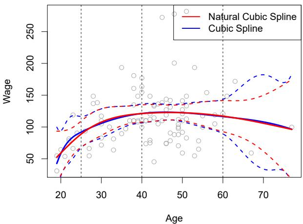
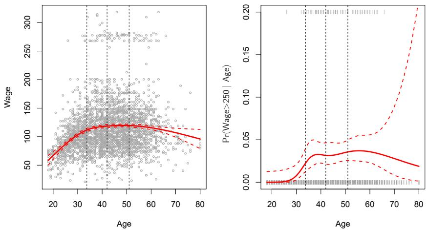
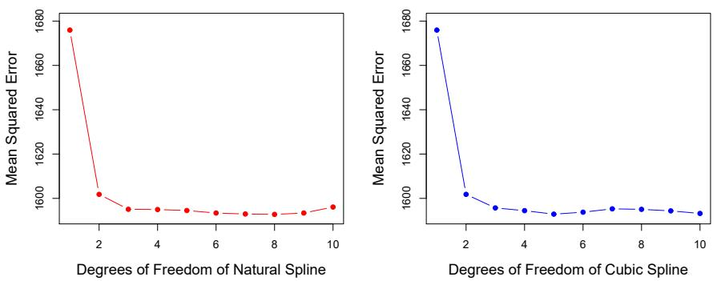
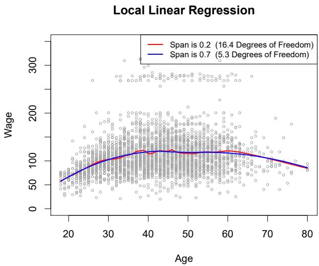
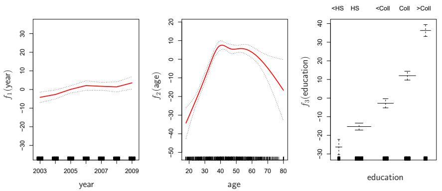
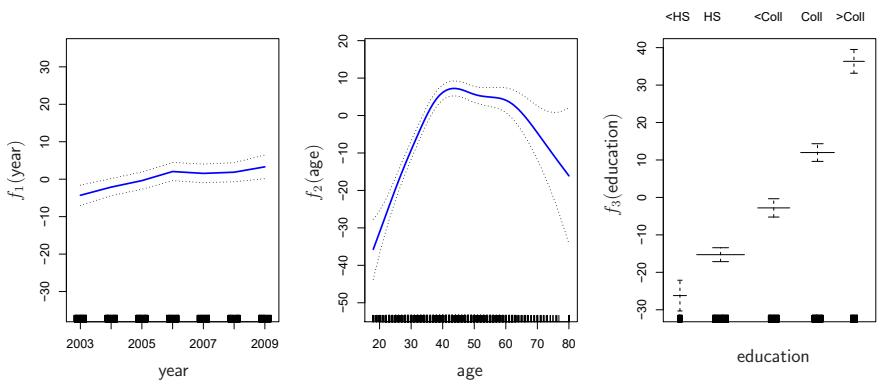
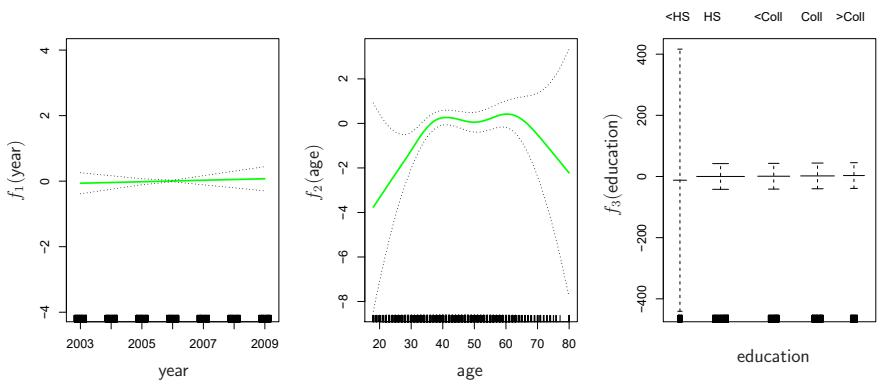
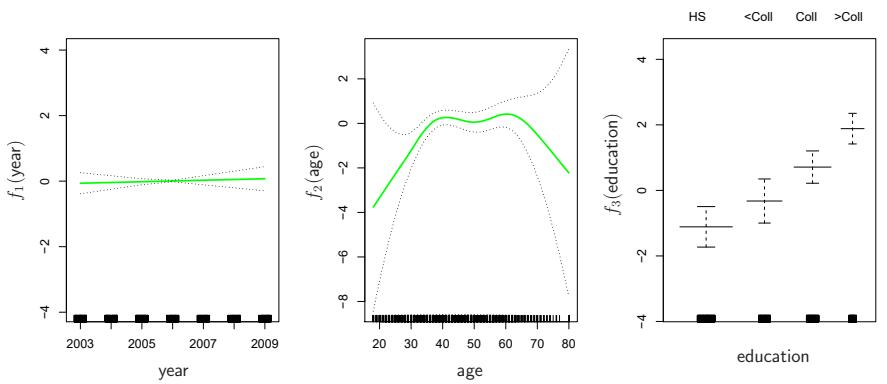

So far in this book, we have mostly focused on linear models. Linear models are relatively simple to describe and implement, and have advantages over other approaches in terms of interpretation and inference. However, standard linear regression can have significant limitations in terms of predictive power. This is because the linearity assumption is almost always an approximation, and sometimes a poor one. In Chapter 6 we see that we can improve upon least squares using ridge regression, the lasso, principal components regression, and other techniques. In that setting, the improvement is obtained by reducing the complexity of the linear model, and hence the variance of the estimates. But we are still using a linear model, which can only be improved so far! In this chapter we relax the linearity assumption while still attempting to maintain as much interpretability as possible. We do this by examining very simple extensions of linear models like polynomial regression and step functions, as well as more sophisticated approaches such as splines, local regression, and generalized additive models.

- Polynomial regression extends the linear model by adding extra predictors, obtained by raising each of the original predictors to a power. For example, a cubic regression uses three variables, $X$ , $X^2$ , and $X^3$ , as predictors. This approach provides a simple way to provide a nonlinear fit to data.  
- Step functions cut the range of a variable into $K$ distinct regions in order to produce a qualitative variable. This has the effect of fitting a piecewise constant function.  
- Regression splines are more flexible than polynomials and step functions, and in fact are an extension of the two. They involve dividing the range of $X$ into $K$ distinct regions. Within each region, a polynomial function is fit to the data. However, these polynomials are

constrained so that they join smoothly at the region boundaries, or knots. Provided that the interval is divided into enough regions, this can produce an extremely flexible fit.

- Smoothing splines are similar to regression splines, but arise in a slightly different situation. Smoothing splines result from minimizing a residual sum of squares criterion subject to a smoothness penalty.  
- Local regression is similar to splines, but differs in an important way. The regions are allowed to overlap, and indeed they do so in a very smooth way.  
- Generalized additive models allow us to extend the methods above to deal with multiple predictors.

In Sections 7.1-7.6, we present a number of approaches for modeling the relationship between a response $Y$ and a single predictor $X$ in a flexible way. In Section 7.7, we show that these approaches can be seamlessly integrated in order to model a response $Y$ as a function of several predictors $X_{1},\ldots ,X_{p}$ .

# 7.1 Polynomial Regression

Historically, the standard way to extend linear regression to settings in which the relationship between the predictors and the response is nonlinear has been to replace the standard linear model

$$
y _ {i} = \beta_ {0} + \beta_ {1} x _ {i} + \epsilon_ {i}
$$

with a polynomial function

$$
y _ {i} = \beta_ {0} + \beta_ {1} x _ {i} + \beta_ {2} x _ {i} ^ {2} + \beta_ {3} x _ {i} ^ {3} + \dots + \beta_ {d} x _ {i} ^ {d} + \epsilon_ {i}, \tag {7.1}
$$

where $\epsilon_{i}$ is the error term. This approach is known as polynomial regression, and in fact we saw an example of this method in Section 3.3.2. For large enough degree d, a polynomial regression allows us to produce an extremely non-linear curve. Notice that the coefficients in (7.1) can be easily estimated using least squares linear regression because this is just a standard linear model with predictors $x_{i}, x_{i}^{2}, x_{i}^{3}, \ldots, x_{i}^{d}$ . Generally speaking, it is unusual to use d greater than 3 or 4 because for large values of d, the polynomial curve can become overly flexible and can take on some very strange shapes. This is especially true near the boundary of the X variable.

The left-hand panel in Figure 7.1 is a plot of wage against age for the Wage data set, which contains income and demographic information for males who reside in the central Atlantic region of the United States. We see the results of fitting a degree-4 polynomial using least squares (solid blue curve). Even though this is a linear regression model like any other, the individual coefficients are not of particular interest. Instead, we look at the entire fitted function across a grid of 63 values for age from 18 to 80 in order to understand the relationship between age and wage.

Degree-4 Polynomial  
  
FIGURE 7.1. The Wage data. Left: The solid blue curve is a degree-4 polynomial of wage (in thousands of dollars) as a function of age, fit by least squares. The dashed curves indicate an estimated 95% confidence interval. Right: We model the binary event wage>250 using logistic regression, again with a degree-4 polynomial. The fitted posterior probability of wage exceeding \$250,000 is shown in blue, along with an estimated 95% confidence interval.

In Figure 7.1, a pair of dashed curves accompanies the fit; these are $(2\times)$ standard error curves. Let's see how these arise. Suppose we have computed the fit at a particular value of age, $x_{0}$ :

$$
\hat {f} (x _ {0}) = \hat {\beta} _ {0} + \hat {\beta} _ {1} x _ {0} + \hat {\beta} _ {2} x _ {0} ^ {2} + \hat {\beta} _ {3} x _ {0} ^ {3} + \hat {\beta} _ {4} x _ {0} ^ {4}. \tag {7.2}
$$

What is the variance of the fit, i.e. $\operatorname{Var}\hat{f}(x_{0})$ ? Least squares returns variance estimates for each of the fitted coefficients $\hat{\beta}_{j}$ , as well as the covariances between pairs of coefficient estimates. We can use these to compute the estimated variance of $\hat{f}(x_{0})$ . $^{1}$ The estimated pointwise standard error of $\hat{f}(x_{0})$ is the square-root of this variance. This computation is repeated at each reference point $x_{0}$ , and we plot the fitted curve, as well as twice the standard error on either side of the fitted curve. We plot twice the standard error because, for normally distributed error terms, this quantity corresponds to an approximate 95% confidence interval.

It seems like the wages in Figure 7.1 are from two distinct populations: there appears to be a high earners group earning more than \$250,000 per annum, as well as a low earners group. We can treat wage as a binary variable by splitting it into these two groups. Logistic regression can then be used to predict this binary response, using polynomial functions of age

as predictors. In other words, we fit the model

$$
\Pr (y _ {i} > 2 5 0 | x _ {i}) = \frac {\exp (\beta_ {0} + \beta_ {1} x _ {i} + \beta_ {2} x _ {i} ^ {2} + \cdots + \beta_ {d} x _ {i} ^ {d})}{1 + \exp (\beta_ {0} + \beta_ {1} x _ {i} + \beta_ {2} x _ {i} ^ {2} + \cdots + \beta_ {d} x _ {i} ^ {d})}. \tag {7.3}
$$

The result is shown in the right-hand panel of Figure 7.1. The gray marks on the top and bottom of the panel indicate the ages of the high earners and the low earners. The solid blue curve indicates the fitted probabilities of being a high earner, as a function of age. The estimated 95% confidence interval is shown as well. We see that here the confidence intervals are fairly wide, especially on the right-hand side. Although the sample size for this data set is substantial (n = 3,000), there are only 79 high earners, which results in a high variance in the estimated coefficients and consequently wide confidence intervals.

# 7.2 Step Functions

Using polynomial functions of the features as predictors in a linear model imposes a global structure on the non-linear function of X. We can instead use step functions in order to avoid imposing such a global structure. Here we break the range of X into bins, and fit a different constant in each bin. This amounts to converting a continuous variable into an ordered categorical variable.

In greater detail, we create cutpoints $c_{1}, c_{2}, \ldots, c_{K}$ in the range of $X$ , and then construct $K + 1$ new variables

step
function

ordered
categorical
variable

$$
\begin{array}{l} C _ {0} (X) \quad = \quad I (X <   c _ {1}), \\ C _ {1} (X) \quad = \quad I (c _ {1} \leq X <   c _ {2}), \\ \begin{array}{r c l} C _ {2} (X) & = & I (c _ {2} \leq X <   c _ {3}), \\ & \vdots \end{array} \tag {7.4} \\ \end{array}
$$

$$
C _ {K - 1} (X) = I (c _ {K - 1} \leq X <   c _ {K}),
$$

$$
C _ {K} (X) \quad = \quad I (c _ {K} \leq X),
$$

where $I(\cdot)$ is an indicator function that returns a 1 if the condition is true, and returns a 0 otherwise. For example, $I(c_{K} \leq X)$ equals 1 if $c_{K} \leq X$ , and equals 0 otherwise. These are sometimes called dummy variables. Notice that for any value of X, $C_{0}(X) + C_{1}(X) + \cdots + C_{K}(X) = 1$ , since X must be in exactly one of the $K + 1$ intervals. We then use least squares to fit a linear model using $C_{1}(X)$ , $C_{2}(X)$ , $\ldots$ , $C_{K}(X)$ as predictors $^{2}$ :

$$
y _ {i} = \beta_ {0} + \beta_ {1} C _ {1} (x _ {i}) + \beta_ {2} C _ {2} (x _ {i}) + \dots + \beta_ {K} C _ {K} (x _ {i}) + \epsilon_ {i}. \tag {7.5}
$$

For a given value of $X$ , at most one of $C_1, C_2, \ldots, C_K$ can be non-zero. Note that when $X < c_1$ , all of the predictors in (7.5) are zero, so $\beta_0$ can

indicator
function

Piecewise Constant  
  
FIGURE 7.2. The Wage data. Left: The solid curve displays the fitted value from a least squares regression of wage (in thousands of dollars) using step functions of age. The dashed curves indicate an estimated 95% confidence interval. Right: We model the binary event wage>250 using logistic regression, again using step functions of age. The fitted posterior probability of wage exceeding \$250,000 is shown, along with an estimated 95% confidence interval.

be interpreted as the mean value of Y for $X < c_{1}$ . By comparison, (7.5) predicts a response of $\beta_{0} + \beta_{j}$ for $c_{j} \leq X < c_{j+1}$ , so $\beta_{j}$ represents the average increase in the response for X in $c_{j} \leq X < c_{j+1}$ relative to $X < c_{1}$ .

An example of fitting step functions to the Wage data from Figure 7.1 is shown in the left-hand panel of Figure 7.2. We also fit the logistic regression model

$$
\Pr (y _ {i} > 2 5 0 | x _ {i}) = \frac {\exp (\beta_ {0} + \beta_ {1} C _ {1} (x _ {i}) + \cdots + \beta_ {K} C _ {K} (x _ {i}))}{1 + \exp (\beta_ {0} + \beta_ {1} C _ {1} (x _ {i}) + \cdots + \beta_ {K} C _ {K} (x _ {i}))} \tag {7.6}
$$

in order to predict the probability that an individual is a high earner on the basis of age. The right-hand panel of Figure 7.2 displays the fitted posterior probabilities obtained using this approach.

Unfortunately, unless there are natural breakpoints in the predictors, piecewise-constant functions can miss the action. For example, in the left-hand panel of Figure 7.2, the first bin clearly misses the increasing trend of wage with age. Nevertheless, step function approaches are very popular in biostatistics and epidemiology, among other disciplines. For example, 5-year age groups are often used to define the bins.

# 7.3 Basis Functions

Polynomial and piecewise-constant regression models are in fact special cases of a basis function approach. The idea is to have at hand a fam-

ily of functions or transformations that can be applied to a variable $X$ : $b_{1}(X), b_{2}(X), \ldots, b_{K}(X)$ . Instead of fitting a linear model in $X$ , we fit the model

$$
y _ {i} = \beta_ {0} + \beta_ {1} b _ {1} (x _ {i}) + \beta_ {2} b _ {2} (x _ {i}) + \beta_ {3} b _ {3} (x _ {i}) + \dots + \beta_ {K} b _ {K} (x _ {i}) + \epsilon_ {i}. \tag {7.7}
$$

Note that the basis functions $b_{1}(\cdot), b_{2}(\cdot), \ldots, b_{K}(\cdot)$ are fixed and known. (In other words, we choose the functions ahead of time.) For polynomial regression, the basis functions are $b_{j}(x_{i}) = x_{i}^{j}$ , and for piecewise constant functions they are $b_{j}(x_{i}) = I(c_{j} \leq x_{i} < c_{j+1})$ . We can think of (7.7) as a standard linear model with predictors $b_{1}(x_{i}), b_{2}(x_{i}), \ldots, b_{K}(x_{i})$ . Hence, we can use least squares to estimate the unknown regression coefficients in (7.7). Importantly, this means that all of the inference tools for linear models that are discussed in Chapter 3, such as standard errors for the coefficient estimates and F-statistics for the model's overall significance, are available in this setting.

Thus far we have considered the use of polynomial functions and piecewise constant functions for our basis functions; however, many alternatives are possible. For instance, we can use wavelets or Fourier series to construct basis functions. In the next section, we investigate a very common choice for a basis function: regression splines.

regression
spline

# 7.4 Regression Splines

Now we discuss a flexible class of basis functions that extends upon the polynomial regression and piecewise constant regression approaches that we have just seen.

# 7.4.1 Piecewise Polynomials

Instead of fitting a high-degree polynomial over the entire range of X, piecewise polynomial regression involves fitting separate low-degree polynomials over different regions of X. For example, a piecewise cubic polynomial works by fitting a cubic regression model of the form

$$
y _ {i} = \beta_ {0} + \beta_ {1} x _ {i} + \beta_ {2} x _ {i} ^ {2} + \beta_ {3} x _ {i} ^ {3} + \epsilon_ {i}, \tag {7.8}
$$

where the coefficients $\beta_0, \beta_1, \beta_2$ , and $\beta_3$ differ in different parts of the range of $X$ . The points where the coefficients change are called knots.

For example, a piecewise cubic with no knots is just a standard cubic polynomial, as in (7.1) with $d = 3$ . A piecewise cubic polynomial with a single knot at a point $c$ takes the form

$$
y _ {i} = \left\{ \begin{array}{l l} \beta_ {0 1} + \beta_ {1 1} x _ {i} + \beta_ {2 1} x _ {i} ^ {2} + \beta_ {3 1} x _ {i} ^ {3} + \epsilon_ {i} & \text {if} x _ {i} <   c \\ \beta_ {0 2} + \beta_ {1 2} x _ {i} + \beta_ {2 2} x _ {i} ^ {2} + \beta_ {3 2} x _ {i} ^ {3} + \epsilon_ {i} & \text {if} x _ {i} \geq c. \end{array} \right.
$$

In other words, we fit two different polynomial functions to the data, one on the subset of the observations with $x_{i} < c$ , and one on the subset of the observations with $x_{i} \geq c$ . The first polynomial function has coefficients

piecewise
polynomial
regression

knot

  
FIGURE 7.3. Various piecewise polynomials are fit to a subset of the Wage data, with a knot at age=50. Top Left: The cubic polynomials are unconstrained. Top Right: The cubic polynomials are constrained to be continuous at age=50. Bottom Left: The cubic polynomials are constrained to be continuous, and to have continuous first and second derivatives. Bottom Right: A linear spline is shown, which is constrained to be continuous.

$\beta_{01}, \beta_{11}, \beta_{21}$ , and $\beta_{31}$ , and the second has coefficients $\beta_{02}, \beta_{12}, \beta_{22}$ , and $\beta_{32}$ . Each of these polynomial functions can be fit using least squares applied to simple functions of the original predictor.

Using more knots leads to a more flexible piecewise polynomial. In general, if we place K different knots throughout the range of X, then we will end up fitting $K + 1$ different cubic polynomials. Note that we do not need to use a cubic polynomial. For example, we can instead fit piecewise linear functions. In fact, our piecewise constant functions of Section 7.2 are piecewise polynomials of degree 0!

The top left panel of Figure 7.3 shows a piecewise cubic polynomial fit to a subset of the wage data, with a single knot at age=50. We immediately see a problem: the function is discontinuous and looks ridiculous! Since each polynomial has four parameters, we are using a total of eight degrees of freedom in fitting this piecewise polynomial model.

degrees of freedom

# 7.4.2 Constraints and Splines

The top left panel of Figure 7.3 looks wrong because the fitted curve is just too flexible. To remedy this problem, we can fit a piecewise polynomial under the constraint that the fitted curve must be continuous. In other words, there cannot be a jump when age=50. The top right plot in Figure 7.3 shows the resulting fit. This looks better than the top left plot, but the V-shaped join looks unnatural.

In the lower left plot, we have added two additional constraints: now both the first and second derivatives of the piecewise polynomials are continuous at age=50. In other words, we are requiring that the piecewise polynomial be not only continuous when age=50, but also very smooth. Each constraint that we impose on the piecewise cubic polynomials effectively frees up one degree of freedom, by reducing the complexity of the resulting piecewise polynomial fit. So in the top left plot, we are using eight degrees of freedom, but in the bottom left plot we imposed three constraints (continuity, continuity of the first derivative, and continuity of the second derivative) and so are left with five degrees of freedom. The curve in the bottom left plot is called a cubic spline. $^{3}$ In general, a cubic spline with K knots uses a total of $4 + K$ degrees of freedom.

In Figure 7.3, the lower right plot is a linear spline, which is continuous at age=50. The general definition of a degree-d spline is that it is a piecewise degree-d polynomial, with continuity in derivatives up to degree d-1 at each knot. Therefore, a linear spline is obtained by fitting a line in each region of the predictor space defined by the knots, requiring continuity at each knot.

In Figure 7.3, there is a single knot at age=50. Of course, we could add more knots, and impose continuity at each.

# 7.4.3 The Spline Basis Representation

The regression splines that we just saw in the previous section may have seemed somewhat complex: how can we fit a piecewise degree-d polynomial under the constraint that it (and possibly its first d-1 derivatives) be continuous? It turns out that we can use the basis model (7.7) to represent a regression spline. A cubic spline with K knots can be modeled as

$$
y _ {i} = \beta_ {0} + \beta_ {1} b _ {1} (x _ {i}) + \beta_ {2} b _ {2} (x _ {i}) + \dots + \beta_ {K + 3} b _ {K + 3} (x _ {i}) + \epsilon_ {i}, \tag {7.9}
$$

for an appropriate choice of basis functions $b_{1}, b_{2}, \ldots, b_{K+3}$ . The model (7.9) can then be fit using least squares.

Just as there were several ways to represent polynomials, there are also many equivalent ways to represent cubic splines using different choices of basis functions in (7.9). The most direct way to represent a cubic spline using (7.9) is to start off with a basis for a cubic polynomial—namely, $x, x^2$ , and $x^3$ —and then add one truncated power basis function per knot.



<details>
<summary>scatter</summary>

| Age | Natural Cubic Spline (Wage) | Cubic Spline (Wage) |
| --- | --- | --- |
| 20 | ~45 | ~45 |
| 25 | ~85 | ~85 |
| 30 | ~105 | ~105 |
| 35 | ~115 | ~115 |
| 40 | ~120 | ~120 |
| 45 | ~120 | ~120 |
| 50 | ~120 | ~120 |
| 55 | ~115 | ~115 |
| 60 | ~110 | ~110 |
| 65 | ~105 | ~105 |
| 70 | ~100 | ~100 |
</details>

FIGURE 7.4. A cubic spline and a natural cubic spline, with three knots, fit to a subset of the Wage data. The dashed lines denote the knot locations.

A truncated power basis function is defined as

$$
h (x, \xi) = (x - \xi) _ {+} ^ {3} = \left\{ \begin{array}{c l} (x - \xi) ^ {3} & \text {if} x > \xi \\ 0 & \text {otherwise,} \end{array} \right. \tag {7.10}
$$

where $\xi$ is the knot. One can show that adding a term of the form $\beta_{4}h(x,\xi)$ to the model (7.8) for a cubic polynomial will lead to a discontinuity in only the third derivative at $\xi$ ; the function will remain continuous, with continuous first and second derivatives, at each of the knots.

In other words, in order to fit a cubic spline to a data set with K knots, we perform least squares regression with an intercept and $3 + K$ predictors, of the form $X, X^{2}, X^{3}, h(X, \xi_{1}), h(X, \xi_{2}), \ldots, h(X, \xi_{K})$ , where $\xi_{1}, \ldots, \xi_{K}$ are the knots. This amounts to estimating a total of $K + 4$ regression coefficients; for this reason, fitting a cubic spline with K knots uses $K + 4$ degrees of freedom.

Unfortunately, splines can have high variance at the outer range of the predictors—that is, when X takes on either a very small or very large value. Figure 7.4 shows a fit to the Wage data with three knots. We see that the confidence bands in the boundary region appear fairly wild. A natural spline is a regression spline with additional boundary constraints: the function is required to be linear at the boundary (in the region where X is smaller than the smallest knot, or larger than the largest knot). This additional constraint means that natural splines generally produce more stable estimates at the boundaries. In Figure 7.4, a natural cubic spline is also displayed as a red line. Note that the corresponding confidence intervals are narrower.

natural
spline

# 7.4.4 Choosing the Number and Locations of the Knots

When we fit a spline, where should we place the knots? The regression spline is most flexible in regions that contain a lot of knots, because in those regions the polynomial coefficients can change rapidly. Hence, one

Natural Cubic Spline  
  
FIGURE 7.5. A natural cubic spline function with four degrees of freedom is fit to the Wage data. Left: A spline is fit to wage (in thousands of dollars) as a function of age. Right: Logistic regression is used to model the binary event wage>250 as a function of age. The fitted posterior probability of wage exceeding \$250,000 is shown. The dashed lines denote the knot locations.

option is to place more knots in places where we feel the function might vary most rapidly, and to place fewer knots where it seems more stable. While this option can work well, in practice it is common to place knots in a uniform fashion. One way to do this is to specify the desired degrees of freedom, and then have the software automatically place the corresponding number of knots at uniform quantiles of the data.

Figure 7.5 shows an example on the Wage data. As in Figure 7.4, we have fit a natural cubic spline with three knots, except this time the knot locations were chosen automatically as the 25th, 50th, and 75th percentiles of age. This was specified by requesting four degrees of freedom. The argument by which four degrees of freedom leads to three interior knots is somewhat technical. $^{4}$

How many knots should we use, or equivalently how many degrees of freedom should our spline contain? One option is to try out different numbers of knots and see which produces the best looking curve. A somewhat more objective approach is to use cross-validation, as discussed in Chapters 5 and 6. With this method, we remove a portion of the data (say 10%), fit a spline with a certain number of knots to the remaining data, and then use the spline to make predictions for the held-out portion. We repeat this process multiple times until each observation has been left out once, and

  
FIGURE 7.6. Ten-fold cross-validated mean squared errors for selecting the degrees of freedom when fitting splines to the Wage data. The response is wage and the predictor age. Left: A natural cubic spline. Right: A cubic spline.

then compute the overall cross-validated RSS. This procedure can be repeated for different numbers of knots K. Then the value of K giving the smallest RSS is chosen.

Figure 7.6 shows ten-fold cross-validated mean squared errors for splines with various degrees of freedom fit to the Wage data. The left-hand panel corresponds to a natural cubic spline and the right-hand panel to a cubic spline. The two methods produce almost identical results, with clear evidence that a one-degree fit (a linear regression) is not adequate. Both curves flatten out quickly, and it seems that three degrees of freedom for the natural spline and four degrees of freedom for the cubic spline are quite adequate.

In Section 7.7 we fit additive spline models simultaneously on several variables at a time. This could potentially require the selection of degrees of freedom for each variable. In cases like this we typically adopt a more pragmatic approach and set the degrees of freedom to a fixed number, say four, for all terms.

# 7.4.5 Comparison to Polynomial Regression

Figure 7.7 compares a natural cubic spline with 15 degrees of freedom to a degree-15 polynomial on the Wage data set. The extra flexibility in the polynomial produces undesirable results at the boundaries, while the natural cubic spline still provides a reasonable fit to the data. Regression splines often give superior results to polynomial regression. This is because unlike polynomials, which must use a high degree (exponent in the highest monomial term, e.g. $X^{15}$ ) to produce flexible fits, splines introduce flexibility by increasing the number of knots but keeping the degree fixed. Generally, this approach produces more stable estimates. Splines also allow us to place more knots, and hence flexibility, over regions where the function f seems to be changing rapidly, and fewer knots where f appears more stable.


<details>
<summary>scatter</summary>

| Age | Wage (Scatter) | Wage (Natural Cubic Spline) | Wage (Polynomial) |
| --- | --- | --- | --- |
| ~18 | ~75 | ~55 | ~75 |
| ~20 | ~60 | ~60 | ~60 |
| ~30 | ~100 | ~100 | ~100 |
| ~40 | ~120 | ~120 | ~120 |
| ~50 | ~115 | ~115 | ~115 |
| ~60 | ~120 | ~120 | ~120 |
| ~70 | ~100 | ~100 | ~100 |
| ~80 | ~80 | ~80 | ~140 |
</details>

FIGURE 7.7. On the Wage data set, a natural cubic spline with 15 degrees of freedom is compared to a degree-15 polynomial. Polynomials can show wild behavior, especially near the tails.

# 7.5 Smoothing Splines

In the last section we discussed regression splines, which we create by specifying a set of knots, producing a sequence of basis functions, and then using least squares to estimate the spline coefficients. We now introduce a somewhat different approach that also produces a spline.

# 7.5.1 An Overview of Smoothing Splines

In fitting a smooth curve to a set of data, what we really want to do is find some function, say $g(x)$ , that fits the observed data well: that is, we want $\mathrm{RSS} = \sum_{i=1}^{n}(y_i - g(x_i))^2$ to be small. However, there is a problem with this approach. If we don't put any constraints on $g(x_i)$ , then we can always make RSS zero simply by choosing $g$ such that it interpolates all of the $y_i$ . Such a function would woefully overfit the data—it would be far too flexible. What we really want is a function $g$ that makes RSS small, but that is also smooth.

How might we ensure that g is smooth? There are a number of ways to do this. A natural approach is to find the function g that minimizes

$$
\sum_ {i = 1} ^ {n} (y _ {i} - g (x _ {i})) ^ {2} + \lambda \int g ^ {\prime \prime} (t) ^ {2} d t \tag {7.11}
$$

where $\lambda$ is a nonnegative tuning parameter. The function $g$ that minimizes (7.11) is known as a smoothing spline.

What does (7.11) mean? Equation 7.11 takes the “Loss+Penalty” formulation that we encounter in the context of ridge regression and the lasso in Chapter 6. The term $\sum_{i=1}^{n}(y_{i}-g(x_{i}))^{2}$ is a loss function that encourages g to fit the data well, and the term $\lambda\int g''(t)^{2}dt$ is a penalty term that penalizes the variability in g. The notation $g''(t)$ indicates the second derivative of the function g. The first derivative $g'(t)$ measures the slope

smoothing
spline

loss function

of a function at $t$ , and the second derivative corresponds to the amount by which the slope is changing. Hence, broadly speaking, the second derivative of a function is a measure of its roughness: it is large in absolute value if $g(t)$ is very wiggly near $t$ , and it is close to zero otherwise. (The second derivative of a straight line is zero; note that a line is perfectly smooth.) The $\int$ notation is an integral, which we can think of as a summation over the range of $t$ . In other words, $\int g''(t)^2 dt$ is simply a measure of the total change in the function $g'(t)$ , over its entire range. If $g$ is very smooth, then $g'(t)$ will be close to constant and $\int g''(t)^2 dt$ will take on a small value. Conversely, if $g$ is jumpy and variable then $g'(t)$ will vary significantly and $\int g''(t)^2 dt$ will take on a large value. Therefore, in (7.11), $\lambda \int g''(t)^2 dt$ encourages $g$ to be smooth. The larger the value of $\lambda$ , the smoother $g$ will be.

When $\lambda = 0$ , then the penalty term in (7.11) has no effect, and so the function g will be very jumpy and will exactly interpolate the training observations. When $\lambda \to \infty$ , g will be perfectly smooth—it will just be a straight line that passes as closely as possible to the training points. In fact, in this case, g will be the linear least squares line, since the loss function in (7.11) amounts to minimizing the residual sum of squares. For an intermediate value of $\lambda$ , g will approximate the training observations but will be somewhat smooth. We see that $\lambda$ controls the bias-variance trade-off of the smoothing spline.

The function $g(x)$ that minimizes (7.11) can be shown to have some special properties: it is a piecewise cubic polynomial with knots at the unique values of $x_{1},\ldots ,x_{n}$ , and continuous first and second derivatives at each knot. Furthermore, it is linear in the region outside of the extreme knots. In other words, the function $g(x)$ that minimizes (7.11) is a natural cubic spline with knots at $x_{1},\ldots ,x_{n}!$ However, it is not the same natural cubic spline that one would get if one applied the basis function approach described in Section 7.4.3 with knots at $x_{1},\ldots ,x_{n}$ —rather, it is a shrunken version of such a natural cubic spline, where the value of the tuning parameter $\lambda$ in (7.11) controls the level of shrinkage.

# 7.5.2 Choosing the Smoothing Parameter $\lambda$

We have seen that a smoothing spline is simply a natural cubic spline with knots at every unique value of $x_{i}$ . It might seem that a smoothing spline will have far too many degrees of freedom, since a knot at each data point allows a great deal of flexibility. But the tuning parameter $\lambda$ controls the roughness of the smoothing spline, and hence the effective degrees of freedom. It is possible to show that as $\lambda$ increases from 0 to $\infty$ , the effective degrees of freedom, which we write $df_{\lambda}$ , decrease from n to 2.

In the context of smoothing splines, why do we discuss effective degrees of freedom instead of degrees of freedom? Usually degrees of freedom refer to the number of free parameters, such as the number of coefficients fit in a polynomial or cubic spline. Although a smoothing spline has n parameters and hence n nominal degrees of freedom, these n parameters are heavily constrained or shrunk down. Hence $df_{\lambda}$ is a measure of the flexibility of the smoothing spline—the higher it is, the more flexible (and the lower-bias but higher-variance) the smoothing spline. The definition of effective degrees of

effective
degrees of
freedom

freedom is somewhat technical. We can write

$$
\hat {\mathbf {g}} _ {\lambda} = \mathbf {S} _ {\lambda} \mathbf {y}, \tag {7.12}
$$

where $\hat{g}_{\lambda}$ is the solution to (7.11) for a particular choice of $\lambda$ —that is, it is an n-vector containing the fitted values of the smoothing spline at the training points $x_{1},\ldots,x_{n}$ . Equation 7.12 indicates that the vector of fitted values when applying a smoothing spline to the data can be written as a $n \times n$ matrix $S_{\lambda}$ (for which there is a formula) times the response vector y. Then the effective degrees of freedom is defined to be

$$
d f _ {\lambda} = \sum_ {i = 1} ^ {n} \{\mathbf {S} _ {\lambda} \} _ {i i}, \tag {7.13}
$$

the sum of the diagonal elements of the matrix $S_{\lambda}$ .

In fitting a smoothing spline, we do not need to select the number or location of the knots—there will be a knot at each training observation, $x_{1}, \ldots, x_{n}$ . Instead, we have another problem: we need to choose the value of $\lambda$ . It should come as no surprise that one possible solution to this problem is cross-validation. In other words, we can find the value of $\lambda$ that makes the cross-validated RSS as small as possible. It turns out that the leave-one-out cross-validation error (LOOCV) can be computed very efficiently for smoothing splines, with essentially the same cost as computing a single fit, using the following formula:

$$
\mathrm{RSS} _ {c v} (\lambda) = \sum_ {i = 1} ^ {n} (y _ {i} - \hat {g} _ {\lambda} ^ {(- i)} (x _ {i})) ^ {2} = \sum_ {i = 1} ^ {n} \left[ \frac {y _ {i} - \hat {g} _ {\lambda} (x _ {i})}{1 - \{\mathbf {S} _ {\lambda} \} _ {i i}} \right] ^ {2}.
$$

The notation $\hat{g}_{\lambda}^{(-i)}(x_{i})$ indicates the fitted value for this smoothing spline evaluated at $x_{i}$ , where the fit uses all of the training observations except for the ith observation $(x_{i}, y_{i})$ . In contrast, $\hat{g}_{\lambda}(x_{i})$ indicates the smoothing spline function fit to all of the training observations and evaluated at $x_{i}$ . This remarkable formula says that we can compute each of these leave-one-out fits using only $\hat{g}_{\lambda}$ , the original fit to all of the data! $^{5}$ We have a very similar formula (5.2) on page 205 in Chapter 5 for least squares linear regression. Using (5.2), we can very quickly perform LOOCV for the regression splines discussed earlier in this chapter, as well as for least squares regression using arbitrary basis functions.

Figure 7.8 shows the results from fitting a smoothing spline to the Wage data. The red curve indicates the fit obtained from pre-specifying that we would like a smoothing spline with 16 effective degrees of freedom. The blue curve is the smoothing spline obtained when $\lambda$ is chosen using LOOCV; in this case, the value of $\lambda$ chosen results in 6.8 effective degrees of freedom (computed using (7.13)). For this data, there is little discernible difference between the two smoothing splines, beyond the fact that the one with 16 degrees of freedom seems slightly wigglier. Since there is little difference between the two fits, the smoothing spline fit with 6.8 degrees of freedom


<details>
<summary>scatter</summary>

| Series | Age (range) | Wage (range) |
| --- | --- | --- |
| Data Points | 18~80 | 20~320 |
| 16 Degrees of Freedom | 18~80 | 60~120 |
| 6.8 Degrees of Freedom (LOOCV) | 18~80 | 60~120 |
</details>

FIGURE 7.8. Smoothing spline fits to the Wage data. The red curve results from specifying 16 effective degrees of freedom. For the blue curve, $\lambda$ was found automatically by leave-one-out cross-validation, which resulted in 6.8 effective degrees of freedom.

is preferable, since in general simpler models are better unless the data provides evidence in support of a more complex model.

# 7.6 Local Regression

Local regression is a different approach for fitting flexible non-linear functions, which involves computing the fit at a target point $x_0$ using only the nearby training observations. Figure 7.9 illustrates the idea on some simulated data, with one target point near 0.4, and another near the boundary at 0.05. In this figure the blue line represents the function $f(x)$ from which the data were generated, and the light orange line corresponds to the local regression estimate $\hat{f}(x)$ . Local regression is described in Algorithm 7.1.

Note that in Step 3 of Algorithm 7.1, the weights $K_{i0}$ will differ for each value of $x_{0}$ . In other words, in order to obtain the local regression fit at a new point, we need to fit a new weighted least squares regression model by minimizing (7.14) for a new set of weights. Local regression is sometimes referred to as a memory-based procedure, because like nearest-neighbors, we need all the training data each time we wish to compute a prediction. We will avoid getting into the technical details of local regression here—there are books written on the topic.

In order to perform local regression, there are a number of choices to be made, such as how to define the weighting function K, and whether to fit a linear, constant, or quadratic regression in Step 3. (Equation 7.14 corresponds to a linear regression.) While all of these choices make some difference, the most important choice is the span s, which is the proportion of points used to compute the local regression at $x_{0}$ , as defined in Step 1 above. The span plays a role like that of the tuning parameter $\lambda$ in smooth-

Local Regression  
  
FIGURE 7.9. Local regression illustrated on some simulated data, where the blue curve represents $f(x)$ from which the data were generated, and the light orange curve corresponds to the local regression estimate $\hat{f}(x)$ . The orange colored points are local to the target point $x_{0}$ , represented by the orange vertical line. The yellow bell-shape superimposed on the plot indicates weights assigned to each point, decreasing to zero with distance from the target point. The fit $\hat{f}(x_{0})$ at $x_{0}$ is obtained by fitting a weighted linear regression (orange line segment), and using the fitted value at $x_{0}$ (orange solid dot) as the estimate $\hat{f}(x_{0})$ .

ing splines: it controls the flexibility of the non-linear fit. The smaller the value of s, the more local and wiggly will be our fit; alternatively, a very large value of s will lead to a global fit to the data using all of the training observations. We can again use cross-validation to choose s, or we can specify it directly. Figure 7.10 displays local linear regression fits on the Wage data, using two values of s: 0.7 and 0.2. As expected, the fit obtained using s = 0.7 is smoother than that obtained using s = 0.2.

The idea of local regression can be generalized in many different ways. In a setting with multiple features $X_{1}, X_{2}, \ldots, X_{p}$ , one very useful generalization involves fitting a multiple linear regression model that is global in some variables, but local in another, such as time. Such varying coefficient models are a useful way of adapting a model to the most recently gathered data. Local regression also generalizes very naturally when we want to fit models that are local in a pair of variables $X_{1}$ and $X_{2}$ , rather than one. We can simply use two-dimensional neighborhoods, and fit bivariate linear regression models using the observations that are near each target point in two-dimensional space. Theoretically the same approach can be implemented in higher dimensions, using linear regressions fit to p-dimensional neighborhoods. However, local regression can perform poorly if p is much larger than about 3 or 4 because there will generally be very few training observations close to $x_{0}$ . Nearest-neighbors regression, discussed in Chapter 3, suffers from a similar problem in high dimensions.

varying
coefficient
model

# Algorithm 7.1 Local Regression At $X = x_0$

1. Gather the fraction $s = k / n$ of training points whose $x_{i}$ are closest to $x_0$ .  
2. Assign a weight $K_{i0} = K(x_i, x_0)$ to each point in this neighborhood, so that the point furthest from $x_0$ has weight zero, and the closest has the highest weight. All but these $k$ nearest neighbors get weight zero.  
3. Fit a weighted least squares regression of the $y_{i}$ on the $x_{i}$ using the aforementioned weights, by finding $\hat{\beta}_0$ and $\hat{\beta}_1$ that minimize

$$
\sum_ {i = 1} ^ {n} K _ {i 0} (y _ {i} - \beta_ {0} - \beta_ {1} x _ {i}) ^ {2}. \tag {7.14}
$$

4. The fitted value at $x_0$ is given by $\hat{f}(x_0) = \hat{\beta}_0 + \hat{\beta}_1x_0$ .



<details>
<summary>scatter</summary>

| Series | Age (range) | Wage (range) |
| --- | --- | --- |
| Data Points | 18~80 | 20~320 |
| Red Line (Span is 0.2) | 18~80 | 60~120 |
| Blue Line (Span is 0.7) | 18~80 | 60~110 |
</details>

FIGURE 7.10. Local linear fits to the Wage data. The span specifies the fraction of the data used to compute the fit at each target point.

# 7.7 Generalized Additive Models

In Sections 7.1–7.6, we present a number of approaches for flexibly predicting a response Y on the basis of a single predictor X. These approaches can be seen as extensions of simple linear regression. Here we explore the problem of flexibly predicting Y on the basis of several predictors, $X_{1}, \ldots, X_{p}$ . This amounts to an extension of multiple linear regression.

Generalized additive models (GAMs) provide a general framework for extending a standard linear model by allowing non-linear functions of each of the variables, while maintaining additivity. Just like linear models, GAMs can be applied with both quantitative and qualitative responses. We first

generalized
additive
model
additivity

  
FIGURE 7.11. For the Wage data, plots of the relationship between each feature and the response, wage, in the fitted model (7.16). Each plot displays the fitted function and pointwise standard errors. The first two functions are natural splines in year and age, with four and five degrees of freedom, respectively. The third function is a step function, fit to the qualitative variable education.

examine GAMs for a quantitative response in Section 7.7.1, and then for a qualitative response in Section 7.7.2.

# 7.7.1 GAMs for Regression Problems

A natural way to extend the multiple linear regression model

$$
y _ {i} = \beta_ {0} + \beta_ {1} x _ {i 1} + \beta_ {2} x _ {i 2} + \dots + \beta_ {p} x _ {i p} + \epsilon_ {i}
$$

in order to allow for non-linear relationships between each feature and the response is to replace each linear component $\beta_{j}x_{ij}$ with a (smooth) nonlinear function $f_{j}(x_{ij})$ . We would then write the model as

$$
\begin{array}{l} y _ {i} = \beta_ {0} + \sum_ {j = 1} ^ {p} f _ {j} (x _ {i j}) + \epsilon_ {i} \\ = \beta_ {0} + f _ {1} (x _ {i 1}) + f _ {2} (x _ {i 2}) + \dots + f _ {p} (x _ {i p}) + \epsilon_ {i}. \tag {7.15} \\ \end{array}
$$

This is an example of a GAM. It is called an additive model because we calculate a separate $f_{j}$ for each $X_{j}$ , and then add together all of their contributions.

In Sections 7.1–7.6, we discuss many methods for fitting functions to a single variable. The beauty of GAMs is that we can use these methods as building blocks for fitting an additive model. In fact, for most of the methods that we have seen so far in this chapter, this can be done fairly trivially. Take, for example, natural splines, and consider the task of fitting the model

$$
\text {wage} = \beta_ {0} + f _ {1} (\text {year}) + f _ {2} (\text {age}) + f _ {3} (\text {education}) + \epsilon \tag {7.16}
$$

on the Wage data. Here year and age are quantitative variables, while the variable education is qualitative with five levels: <HS, HS, <Coll, Coll, >Coll, referring to the amount of high school or college education that an individual has completed. We fit the first two functions using natural splines. We

  
FIGURE 7.12. Details are as in Figure 7.11, but now $f_{1}$ and $f_{2}$ are smoothing splines with four and five degrees of freedom, respectively.

fit the third function using a separate constant for each level, via the usual dummy variable approach of Section 3.3.1.

Figure 7.11 shows the results of fitting the model (7.16) using least squares. This is easy to do, since as discussed in Section 7.4, natural splines can be constructed using an appropriately chosen set of basis functions. Hence the entire model is just a big regression onto spline basis variables and dummy variables, all packed into one big regression matrix.

Figure 7.11 can be easily interpreted. The left-hand panel indicates that holding age and education fixed, wage tends to increase slightly with year; this may be due to inflation. The center panel indicates that holding education and year fixed, wage tends to be highest for intermediate values of age, and lowest for the very young and very old. The right-hand panel indicates that holding year and age fixed, wage tends to increase with education: the more educated a person is, the higher their salary, on average. All of these findings are intuitive.

Figure 7.12 shows a similar triple of plots, but this time $f_{1}$ and $f_{2}$ are smoothing splines with four and five degrees of freedom, respectively. Fitting a GAM with a smoothing spline is not quite as simple as fitting a GAM with a natural spline, since in the case of smoothing splines, least squares cannot be used. However, standard software such as the Python package pygam can be used to fit GAMs using smoothing splines, via an approach known as backfitting. This method fits a model involving multiple predictors by repeatedly updating the fit for each predictor in turn, holding the others fixed. The beauty of this approach is that each time we update a function, we simply apply the fitting method for that variable to a partial residual. $^{6}$

The fitted functions in Figures 7.11 and 7.12 look rather similar. In most situations, the differences in the GAMs obtained using smoothing splines versus natural splines are small.

We do not have to use splines as the building blocks for GAMs: we can just as well use local regression, polynomial regression, or any combination of the approaches seen earlier in this chapter in order to create a GAM. GAMs are investigated in further detail in the lab at the end of this chapter.

# Pros and Cons of GAMs

Before we move on, let us summarize the advantages and limitations of a GAM.

▲ GAMs allow us to fit a non-linear $f_{j}$ to each $X_{j}$ , so that we can automatically model non-linear relationships that standard linear regression will miss. This means that we do not need to manually try out many different transformations on each variable individually.  
The non-linear fits can potentially make more accurate predictions for the response Y.  
▲ Because the model is additive, we can examine the effect of each $X_{j}$ on Y individually while holding all of the other variables fixed.  
The smoothness of the function $f_{j}$ for the variable $X_{j}$ can be summarized via degrees of freedom.  
The main limitation of GAMs is that the model is restricted to be additive. With many variables, important interactions can be missed. However, as with linear regression, we can manually add interaction terms to the GAM model by including additional predictors of the form $X_{j} \times X_{k}$ . In addition we can add low-dimensional interaction functions of the form $f_{jk}(X_{j}, X_{k})$ into the model; such terms can be fit using two-dimensional smoothers such as local regression, or two-dimensional splines (not covered here).

For fully general models, we have to look for even more flexible approaches such as random forests and boosting, described in Chapter 8. GAMs provide a useful compromise between linear and fully nonparametric models.

# 7.7.2 GAMs for Classification Problems

GAMs can also be used in situations where Y is qualitative. For simplicity, here we assume Y takes on values 0 or 1, and let $p(X) = \Pr(Y = 1|X)$ be the conditional probability (given the predictors) that the response equals one. Recall the logistic regression model (4.6):

$$
\log \left(\frac {p (X)}{1 - p (X)}\right) = \beta_ {0} + \beta_ {1} X _ {1} + \beta_ {2} X _ {2} + \dots + \beta_ {p} X _ {p}. \tag {7.17}
$$

The left-hand side is the log of the odds of $P(Y = 1|X)$ versus $P(Y = 0|X)$ , which (7.17) represents as a linear function of the predictors. A natural way to extend (7.17) to allow for non-linear relationships is to use the model

$$
\log \left(\frac {p (X)}{1 - p (X)}\right) = \beta_ {0} + f _ {1} (X _ {1}) + f _ {2} (X _ {2}) + \dots + f _ {p} (X _ {p}). \tag {7.18}
$$

  
FIGURE 7.13. For the Wage data, the logistic regression GAM given in (7.19) is fit to the binary response I(wage>250). Each plot displays the fitted function and pointwise standard errors. The first function is linear in year, the second function a smoothing spline with five degrees of freedom in age, and the third a step function for education. There are very wide standard errors for the first level <HS of education.

Equation 7.18 is a logistic regression GAM. It has all the same pros and cons as discussed in the previous section for quantitative responses.

We fit a GAM to the Wage data in order to predict the probability that an individual's income exceeds \$250,000 per year. The GAM that we fit takes the form

$$
\log \left(\frac {p (X)}{1 - p (X)}\right) = \beta_ {0} + \beta_ {1} \times \text {year} + f _ {2} (\text {age}) + f _ {3} (\text {education}), \tag {7.19}
$$

where

$$
p (X) = \Pr (\text {wage} > 2 5 0 | \text {year, age, education}).
$$

Once again $f_2$ is fit using a smoothing spline with five degrees of freedom, and $f_3$ is fit as a step function, by creating dummy variables for each of the levels of education. The resulting fit is shown in Figure 7.13. The last panel looks suspicious, with very wide confidence intervals for level <HS. In fact, no response values equal one for that category: no individuals with less than a high school education make more than \$250,000 per year. Hence we refit the GAM, excluding the individuals with less than a high school education. The resulting model is shown in Figure 7.14. As in Figures 7.11 and 7.12, all three panels have similar vertical scales. This allows us to visually assess the relative contributions of each of the variables. We observe that age and education have a much larger effect than year on the probability of being a high earner.

# 7.8 Lab: Non-Linear Modeling

In this lab, we demonstrate some of the nonlinear models discussed in this chapter. We use the Wage data as a running example, and show that many of the complex non-linear fitting procedures discussed can easily be implemented in Python.

  
FIGURE 7.14. The same model is fit as in Figure 7.13, this time excluding the observations for which education is <HS. Now we see that increased education tends to be associated with higher salaries.

As usual, we start with some of our standard imports.

In [1]:  
```python
import numpy as np, pandas as pd
from matplotlib.pyplot import subplots
import statsmodels.api as sm
from ISLP import load_data
from ISLP.models import (summarize,
                      poly,
                      ModelSpec as MS)
from statsmodels.stats.anova import anova_lm
```

We again collect the new imports needed for this lab. Many of these are developed specifically for the ISLP package.

In [2]:  
```python
from pygam import (s as s_gam,
                       l as l_gam,
                       f as f_gam,
                       LinearGAM,
                       LogisticGAM)

from ISLP.transforms import (BSpline,
                       NaturalSpline)
from ISLP.models import bs, ns
from ISLP.pygam import (approx_lam,
                       degrees_of_freedom,
                       plot as plot_gam,
                       anova as anova_gam)
```

# 7.8.1 Polynomial Regression and Step Functions

We start by demonstrating how Figure 7.1 can be reproduced. Let's begin by loading the data.

In [3]:  
```python
Wage = load_data('Wage')
y = Wage['wage']
age = Wage['age']
```

Throughout most of this lab, our response is Wage['wage'], which we have stored as y above. As in Section 3.6.6, we will use the poly() function to create a model matrix that will fit a 4th degree polynomial in age.

```python
In [4]: poly_age = MS([poly('age', degree=4)]).fit(Wage)
M = sm.OLS(y, poly_age.transform(Wage)).fit()
summarize(M)
```

```python
Out[4]:
                    coef std err      t P>|t|
        intercept 111.7036     0.729 153.283 0.000
    poly(age, degree=4)[0] 447.0679    39.915 11.201 0.000
    poly(age, degree=4)[1] -478.3158    39.915 -11.983 0.000
    poly(age, degree=4)[2] 125.5217    39.915 3.145 0.002
    poly(age, degree=4)[3] -77.9112    39.915 -1.952 0.051
```

This polynomial is constructed using the function poly(), which creates a special transformer Poly() (using sklearn terminology for feature transformations such as PCA() seen in Section 6.5.3) which allows for easy evaluation of the polynomial at new data points. Here poly() is referred to as a helper function, and sets up the transformation; Poly() is the actual workhorse that computes the transformation. See also the discussion of transformations on page 118.

In the code above, the first line executes the fit() method using the dataframe Wage. This recomputes and stores as attributes any parameters needed by Poly() on the training data, and these will be used on all subsequent evaluations of the transform() method. For example, it is used on the second line, as well as in the plotting function developed below.

We now create a grid of values for age at which we want predictions.

```python
In [5]: age_grid = np.linspace(age.min(),
                                      age.max(),
                                      100)
age_df = pd.DataFrame({'age': age_grid})
```

Finally, we wish to plot the data and add the fit from the fourth-degree polynomial. As we will make several similar plots below, we first write a function to create all the ingredients and produce the plot. Our function takes in a model specification (here a basis specified by a transform), as well as a grid of age values. The function produces a fitted curve as well as 95% confidence bands. By using an argument for basis we can produce and plot the results with several different transforms, such as the splines we will see shortly.

```python
def plot_wage_fit(age_df,
                    basis,
                    title):

    X = basis.transform(Wage)
    Xnew = basis.transform(age_df)
    M = sm.OLS(y, X).fit()
    preds = M.get_prediction(Xnew)
    bands = preds.conf_int(alpha=0.05)
    fig, ax = subplots(figsize=(8,8))
    ax.scatter(age,
                    y,
```

```python
facecolor='gray',
alpha=0.5)
for val, ls in zip([preds.predicted_mean,
    bands[:,0],
    bands[:,1]],
    ['b','r--','r--']).:
    ax.plot(age_df.values, val, ls, linewidth=3)
ax.set_title(title, fontsize=20)
ax.set_xlabel('Age', fontsize=20)
ax.set_ylabel('Wage', fontsize=20);
return ax
```

We include an argument alpha to ax.scatter() to add some transparency to the points. This provides a visual indication of density. Notice the use of the zip() function in the for loop above (see Section 2.3.8). We have three lines to plot, each with different colors and line types. Here zip() conveniently bundles these together as iterators in the loop. $^{7}$

We now plot the fit of the fourth-degree polynomial using this function.

iterator

In [7]:

```txt
plot_wage_fit(age_df,
            poly_age,
            'Degree-4 Polynomial');
```

With polynomial regression we must decide on the degree of the polynomial to use. Sometimes we just wing it, and decide to use second or third degree polynomials, simply to obtain a nonlinear fit. But we can make such a decision in a more systematic way. One way to do this is through hypothesis tests, which we demonstrate here. We now fit a series of models ranging from linear (degree-one) to degree-five polynomials, and look to determine the simplest model that is sufficient to explain the relationship between wage and age. We use the anova\_lm() function, which performs a series of ANOVA tests. An analysis of variance or ANOVA tests the null hypothesis that a model $M_{1}$ is sufficient to explain the data against the alternative hypothesis that a more complex model $M_{2}$ is required. The determination is based on an F-test. To perform the test, the models $M_{1}$ and $M_{2}$ must be nested: the space spanned by the predictors in $M_{1}$ must be a subspace of the space spanned by the predictors in $M_{2}$ . In this case, we fit five different polynomial models and sequentially compare the simpler model to the more complex model.

analysis of variance

In [8]:

```python
models = [MS([poly('age', degree=d)])
        for d in range(1, 6)]
Xs = [model.fit_transform(Wage) for model in models]
anova_lm(*[sm.OLS(y, X_).fit()
        for X_ in Xs])
```

Out [8]:

<table><tr><td></td><td>df_resid</td><td>ssr</td><td>df_diff</td><td>ss_diff</td><td>F</td><td>Pr(&gt;F)</td></tr><tr><td>0</td><td>2998.0</td><td>5.022e+06</td><td>0.0</td><td>NaN</td><td>NaN</td><td>NaN</td></tr><tr><td>1</td><td>2997.0</td><td>4.793e+06</td><td>1.0</td><td>228786.010</td><td>143.593</td><td>2.364e-32</td></tr><tr><td>2</td><td>2996.0</td><td>4.778e+06</td><td>1.0</td><td>15755.694</td><td>9.889</td><td>1.679e-03</td></tr><tr><td>3</td><td>2995.0</td><td>4.772e+06</td><td>1.0</td><td>6070.152</td><td>3.810</td><td>5.105e-02</td></tr></table>
```txt
4 2994.0 4.770e+06 1.0 1282.563 0.805 3.697e-01
```

Notice the \* in the anova\_lm() line above. This function takes a variable number of non-keyword arguments, in this case fitted models. When these models are provided as a list (as is done here), it must be prefixed by \*.

The p-value comparing the linear models[0] to the quadratic models[1] is essentially zero, indicating that a linear fit is not sufficient. $^{8}$ Similarly the p-value comparing the quadratic models[1] to the cubic models[2] is very low (0.0017), so the quadratic fit is also insufficient. The p-value comparing the cubic and degree-four polynomials, models[2] and models[3], is approximately $5\%$ , while the degree-five polynomial models[4] seems unnecessary because its p-value is 0.37. Hence, either a cubic or a quartic polynomial appear to provide a reasonable fit to the data, but lower- or higher-order models are not justified.

In this case, instead of using the anova() function, we could have obtained these p-values more succinctly by exploiting the fact that poly() creates orthogonal polynomials.

In [9]: summarize(M)  
```python
Out[9]:
        coef std err      t P>|t|
    intercept         111.7036     0.729  153.283  0.000
    poly(age, degree=4)[0] 447.0679     39.915  11.201  0.000
    poly(age, degree=4)[1] -478.3158     39.915 -11.983  0.000
    poly(age, degree=4)[2] 125.5217     39.915  3.145  0.002
    poly(age, degree=4)[3] -77.9112     39.915 -1.952  0.051
```

Notice that the p-values are the same, and in fact the square of the t-statistics are equal to the F-statistics from the anova\_lm() function; for example:

In [10]:  (-11.983)\*\*2

Out[10]: 143.59228

However, the ANOVA method works whether or not we used orthogonal polynomials, provided the models are nested. For example, we can use anova\_lm() to compare the following three models, which all have a linear term in education and a polynomial in age of different degrees:

```python
In [11]: models = [MS(['education', poly('age', degree=d)])
        for d in range(1, 4)]
XEs = [model.fit_transform(Wage)
        for model in models]
anova_lm(*[sm.OLS(y, X_).fit() for X_ in XEs])
```

```python
Out[11]:        df_resid        ssr df_diff     ss_diff       F       Pr(>F)
        0       2997.0 3.902e+06       0.0         NaN       NaN         NaN
        1       2996.0 3.759e+06       1.0 142862.701 113.992 3.838e-26
        2       2995.0 3.754e+06       1.0 5926.207 4.729 2.974e-02
```

As an alternative to using hypothesis tests and ANOVA, we could choose the polynomial degree using cross-validation, as discussed in Chapter 5.

Next we consider the task of predicting whether an individual earns more than \$250,000 per year. We proceed much as before, except that first we create the appropriate response vector, and then apply the glm() function using the binomial family in order to fit a polynomial logistic regression model.

```python
In [12]: X = poly_age.transform(Wage)
    high_earn = Wage['high_earn'] = y > 250 # shorthand
    glm = sm.GLM(y > 250,
                       X,
                       family=sm.families.Binomial())
    B = glm.fit()
    summarize(B)
```

```txt
Out[12]:
                    coef std err      z    P>|z|
        intercept  -4.3012     0.345 -12.457  0.000
    poly(age, degree=4)[0] 71.9642     26.133   2.754  0.006
    poly(age, degree=4)[1] -85.7729     35.929   -2.387  0.017
    poly(age, degree=4)[2] 34.1626     19.697   1.734  0.083
    poly(age, degree=4)[3] -47.4008     24.105   -1.966  0.049
```

Once again, we make predictions using the get\_prediction() method.

```txt
newX = poly_age.transform(age_df)
preds = B.get_prediction(newX)
bands = preds.conf_int(alpha=0.05)
```

We now plot the estimated relationship.

```python
In [14]: fig, ax = subplots(figsize=(8,8))
rng = np.random.default_rng(0)
ax.scatter(age +
        0.2 * rng.uniform(size=y.shape[0]),
        np.where(high_earn, 0.198, 0.002),
        fc='gray',
        marker='|')
for val, ls in zip([preds.predicted_mean,
            bands[:,0],
            bands[:,1]],
            ['b','r--','r--']).:
    ax.plot(age_df.values, val, ls, linewidth=3)
ax.set_title('Degree-4 Polynomial', fontsize=20)
ax.set_xlabel('Age', fontsize=20)
ax.set_ylim([0,0.2])
ax.set_ylabel('P(Wage > 250)', fontsize=20);
```

We have drawn the age values corresponding to the observations with wage values above 250 as gray marks on the top of the plot, and those with wage values below 250 are shown as gray marks on the bottom of the plot. We added a small amount of noise to jitter the age values a bit so that observations with the same age value do not cover each other up. This type of plot is often called a rug plot.

In order to fit a step function, as discussed in Section 7.2, we first use the pd.qcut() function to discretize age based on quantiles. Then we use

rug plot

pd.qcut()

pd.get\_dummies() to create the columns of the model matrix for this categorical variable. Note that this function will include all columns for a given categorical, rather than the usual approach which drops one of the levels.

pd.get\_
dummies()

```python
In [15]: cut_age = pd.qcut(age, 4)
    summarize(sm.OLS(y, pd.get_dummies(cut_age)).fit())
```

```python
Out[15]:
            coef std err     t P>|t|
(17.999, 33.75]    94.1584    1.478 63.692    0.0
(33.75, 42.0]    116.6608    1.470 79.385    0.0
(42.0, 51.0]    119.1887    1.416 84.147    0.0
(51.0, 80.0]    116.5717    1.559 74.751    0.0
```

Here pd.qcut() automatically picked the cutpoints based on the quantiles 25%, 50% and 75%, which results in four regions. We could also have specified our own quantiles directly instead of the argument 4. For cuts not based on quantiles we would use the pd.cut() function. The function pd.qcut() (and pd.cut()) returns an ordered categorical variable. The regression model then creates a set of dummy variables for use in the regression. Since age is the only variable in the model, the value \$94,158.40 is the average salary for those under 33.75 years of age, and the other coefficients are the average salary for those in the other age groups. We can produce predictions and plots just as we did in the case of the polynomial fit.

pd.cut()

# 7.8.2 Splines

In order to fit regression splines, we use transforms from the ISLP package. The actual spline evaluation functions are in the scipy.interpolate package; we have simply wrapped them as transforms similar to Poly() and PCA().

In Section 7.4, we saw that regression splines can be fit by constructing an appropriate matrix of basis functions. The BSpline() function generates the entire matrix of basis functions for splines with the specified set of knots. By default, the B-splines produced are cubic. To change the degree, use the argument degree.

BSpline()

```python
In [16]: bs_ = BSpline(internal_knots=[25,40,60], intercept=True).fit(age)
    bs_age = bs_.transform(age)
    bs_age.shape
```

```javascript
Out[16]: (3000, 7)
```

This results in a seven-column matrix, which is what is expected for a cubic-spline basis with 3 interior knots. We can form this same matrix using the bs() object, which facilitates adding this to a model-matrix builder (as in poly() versus its workhorse Poly()) described in Section 7.8.1.

We now fit a cubic spline model to the Wage data.

```python
In [17]: bs_age = MS([bs('age', internal_knots=[25,40,60)])])
Xbs = bs_age.fit_transform(Wage)
M = sm.OLS(y, Xbs).fit()
summarize(M)
```

```python
Out[17]:
                    coef std err ...
                    intercept 60.494 9.460 ...
    bs(age, internal_knots=[25, 40, 60])[0] 3.980 12.538 ...
    bs(age, internal_knots=[25, 40, 60])[1] 44.631 9.626 ...
    bs(age, internal_knots=[25, 40, 60])[2] 62.839 10.755 ...
    bs(age, internal_knots=[25, 40, 60])[3] 55.991 10.706 ...
    bs(age, internal_knots=[25, 40, 60])[4] 50.688 14.402 ...
    bs(age, internal_knots=[25, 40, 60])[5] 16.606 19.126 ...
```

The column names are a little cumbersome, and have caused us to truncate the printed summary. They can be set on construction using the name argument as follows.

```python
In [18]: bs_age = MS([bs('age',
                          internal_knots=[25,40,60],
                          name='bs(age)'))])
Xbs = bs_age.fit_transform(Wage)
M = sm.OLS(y, Xbs).fit()
summarize(M)
```

```txt
Out[18]:
                    coef std err      t    P>|t|
        intercept      60.494   9.460  6.394   0.000
    bs(age, knots)[0]      3.981   12.538  0.317   0.751
    bs(age, knots)[1]      44.631   9.626  4.636   0.000
    bs(age, knots)[2]      62.839   10.755  5.843   0.000
    bs(age, knots)[3]      55.991   10.706  5.230   0.000
    bs(age, knots)[4]      50.688   14.402  3.520   0.000
    bs(age, knots)[5]      16.606   19.126  0.868   0.385
```

Notice that there are 6 spline coefficients rather than 7. This is because, by default, bs() assumes intercept=False, since we typically have an overall intercept in the model. So it generates the spline basis with the given knots, and then discards one of the basis functions to account for the intercept.

We could also use the df (degrees of freedom) option to specify the complexity of the spline. We see above that with 3 knots, the spline basis has 6 columns or degrees of freedom. When we specify df=6 rather than the actual knots, bs() will produce a spline with 3 knots chosen at uniform quantiles of the training data. We can see these chosen knots most easily using Bspline() directly:

```txt
In [19]: BSpline(df=6).fit(age).internal_knots_
```

```txt
Out[19]: array([33.75, 42.0, 51.0])
```

When asking for six degrees of freedom, the transform chooses knots at ages 33.75, 42.0, and 51.0, which correspond to the 25th, 50th, and 75th percentiles of age.

When using B-splines we need not limit ourselves to cubic polynomials (i.e. degree=3). For instance, using degree=0 results in piecewise constant functions, as in our example with pd.qcut() above.

```python
In [20]: bs_age0 = MS([bs('age',
                     df=3,
                     degree=0)]).fit(Wage)
Xbs0 = bs_age0.transform(Wage)
summarize(sm.OLS(y, Xbs0).fit())
```

Out [20]:

<table><tr><td></td><td>coef</td><td>std err</td><td>t</td><td>P&gt;|t|</td></tr><tr><td>intercept</td><td>94.158</td><td>1.478</td><td>63.687</td><td>0.0</td></tr><tr><td>bs(age, df=3, degree=0)[0]</td><td>22.349</td><td>2.152</td><td>10.388</td><td>0.0</td></tr><tr><td>bs(age, df=3, degree=0)[1]</td><td>24.808</td><td>2.044</td><td>12.137</td><td>0.0</td></tr><tr><td>bs(age, df=3, degree=0)[2]</td><td>22.781</td><td>2.087</td><td>10.917</td><td>0.0</td></tr></table>

This fit should be compared with cell [15] where we use qcut() to create four bins by cutting at the 25%, 50% and 75% quantiles of age. Since we specified df=3 for degree-zero splines here, there will also be knots at the same three quantiles. Although the coefficients appear different, we see that this is a result of the different coding. For example, the first coefficient is identical in both cases, and is the mean response in the first bin. For the second coefficient, we have $94.158 + 22.349 = 116.507 \approx 116.611$ , the latter being the mean in the second bin in cell [15]. Here the intercept is coded by a column of ones, so the second, third and fourth coefficients are increments for those bins. Why is the sum not exactly the same? It turns out that the qcut() uses $\leq$ , while bs() uses < when deciding bin membership.

In order to fit a natural spline, we use the NaturalSpline() transform with the corresponding helper ns(). Here we fit a natural spline with five degrees of freedom (excluding the intercept) and plot the results.

Natural
Spline()

```python
In [21]: ns_age = MS([ns('age', df=5)]).fit(Wage)
M_ns = sm.OLS(y, ns_age.transform(Wage)).fit()
summarize(M_ns)
```

```python
Out[21]:
            coef std err      t    P>|t|
    intercept      60.475     4.708    12.844    0.000
    ns(age, df=5)[0]     61.527     4.709    13.065    0.000
    ns(age, df=5)[1]     55.691     5.717    9.741    0.000
    ns(age, df=5)[2]     46.818     4.948    9.463    0.000
    ns(age, df=5)[3]     83.204     11.918    6.982    0.000
    ns(age, df=5)[4]     6.877     9.484    0.725    0.468
```

We now plot the natural spline using our plotting function.

```txt
In [22]: plot_wage_fit(age_df,
                      ns_age,
                      'Natural spline, df=5');
```

# 7.8.3 Smoothing Splines and GAMs

A smoothing spline is a special case of a GAM with squared-error loss and a single feature. To fit GAMs in Python we will use the pygam package which can be installed via pip install pygam. The estimator LinearGAM() uses squared-error loss. The GAM is specified by associating each column of a model matrix with a particular smoothing operation: s for smoothing spline; l for linear, and f for factor or categorical variables. The argument 0 passed to s below indicates that this smoother will apply to the first column of a feature matrix. Below, we pass it a matrix with a single column: X\_age. The argument lam is the penalty parameter $\lambda$ as discussed in Section 7.5.2.

pygam
LinearGAM()

```python
In [23]: X_age = np.asarray(age).reshape((-1,1))
gam = LinearGAM(s_gam(0, lam=0.6))
gam.fit(X_age, y)
```

```python
Out[23]: LinearGAM(callbacks=[Deviance(), Diffs()], fit_intercept=True,
        max_iter=100, scale=None, terms=s(0) + intercept, tol=0.0001,
        verbose=False)
```

The pygam library generally expects a matrix of features so we reshape age to be a matrix (a two-dimensional array) instead of a vector (i.e. a one-dimensional array). The -1 in the call to the reshape() method tells numpy to impute the size of that dimension based on the remaining entries of the shape tuple.

Let's investigate how the fit changes with the smoothing parameter lam. The function np.logspace() is similar to np.linspace() but spaces points evenly on the log-scale. Below we vary lam from $10^{-2}$ to $10^{6}$ .

np.logspace()

```python
In [24]: fig, ax = subplots(figsize=(8,8))
    ax.scatter(age, y, facecolor='gray', alpha=0.5)
    for lam in np.logspace(-2, 6, 5):
        gam = LinearGAM(s_gam(0, lam=lam)).fit(X_age, y)
        ax.plot(age_grid,
            gam.predict(age_grid),
            label='{:.1e}'.format(lam),
            linewidth=3)
    ax.set_xlabel('Age', fontsize=20)
    ax.set_ylabel('Wage', fontsize=20);
    ax.legend(title='\$\lambda\$');
```

The pygam package can perform a search for an optimal smoothing parameter.

```python
In [25]: gam_opt = gam.gridsearch(X_age, y)
    ax.plot(age_grid,
        gam_opt.predict(age_grid),
        label='Grid search',
        linewidth=4)
    ax.legend()
    fig
```

Alternatively, we can fix the degrees of freedom of the smoothing spline using a function included in the ISLP.pygam package. Below we find a value of $\lambda$ that gives us roughly four degrees of freedom. We note here that these degrees of freedom include the unpenalized intercept and linear term of the smoothing spline, hence there are at least two degrees of freedom.

```python
In [26]: age_term = gam.terms[0]
lam_4 = approx_lam(X_age, age_term, 4)
age_term.lam = lam_4
degrees_of_freedom(X_age, age_term)
```

Out[26]: 4.000000100004728

Let's vary the degrees of freedom in a similar plot to above. We choose the degrees of freedom as the desired degrees of freedom plus one to account for the fact that these smoothing splines always have an intercept term. Hence, a value of one for df is just a linear fit.

```txt
In [27]: fig, ax = subplots(figsize=(8,8))
ax.scatter(X_age,
                       y,
```

```python
facecolor='gray',
    alpha=0.3)
for df in [1,3,4,8,15]:
    lam = approx_lam(X_age, age_term, df+1)
    age_term.lam = lam
    gam.fit(X_age, y)
    ax.plot(age_grid,
        gam.predict(age_grid),
        label='{:d}'.format(df),
        linewidth=4)
ax.set_xlabel('Age', fontsize=20)
ax.set_ylabel('Wage', fontsize=20);
ax.legend(title='Degrees of freedom');
```

# Additive Models with Several Terms

The strength of generalized additive models lies in their ability to fit multivariate regression models with more flexibility than linear models. We demonstrate two approaches: the first in a more manual fashion using natural splines and piecewise constant functions, and the second using the pygam package and smoothing splines.

We now fit a GAM by hand to predict wage using natural spline functions of year and age, treating education as a qualitative predictor, as in $(7.16)$ . Since this is just a big linear regression model using an appropriate choice of basis functions, we can simply do this using the sm.OLS() function.

We will build the model matrix in a more manual fashion here, since we wish to access the pieces separately when constructing partial dependence plots.

```python
In [28]: ns_age = NaturalSpline(df=4).fit(age)
    ns_year = NaturalSpline(df=5).fit(Wage['year'])
    Xs = [ns_age.transform(age),
        ns_year.transform(Wage['year']),
        pd.get_dummies(Wage['education']).values]
    X_bh = np.hstack(Xs)
    gam_bh = sm.OLS(y, X_bh).fit()
```

Here the function NaturalSpline() is the workhorse supporting the ns() helper function. We chose to use all columns of the indicator matrix for the categorical variable education, making an intercept redundant. Finally, we stacked the three component matrices horizontally to form the model matrix X\_bh.

We now show how to construct partial dependence plots for each of the terms in our rudimentary GAM. We can do this by hand, given grids for age and year. We simply predict with new X matrices, fixing all but one of the features at a time.

```python
In [29]: age_grid = np.linspace(age.min(),
                          age.max(),
                          100)
X_age_bh = X_bh.copy()[:100]
X_age_bh[:] = X_bh[:].mean(0)[None,:] 
X_age_bh[:,:4] = ns_age.transform(age_grid)
preds = gam_bh.get_prediction(X_age_bh)
bounds_age = preds.conf_int(alpha=0.05)
```

```txt
partial_age = preds.predicted_mean
center = partial_age.mean()
partial_age -= center
bounds_age -= center
fig, ax = subplots(figsize=(8,8))
ax.plot(age_grid, partial_age, 'b', linewidth=3)
ax.plot(age_grid, bounds_age[:,0], 'r--', linewidth=3)
ax.plot(age_grid, bounds_age[:,1], 'r--', linewidth=3)
ax.set_xlabel('Age')
ax.set_ylabel('Effect on wage')
ax.set_title('Partial dependence of age on wage', fontsize=20);
```

Let's explain in some detail what we did above. The idea is to create a new prediction matrix, where all but the columns belonging to age are constant (and set to their training-data means). The four columns for age are filled in with the natural spline basis evaluated at the 100 values in age\_grid.

1. We made a grid of length 100 in age, and created a matrix X\_age\_bh with 100 rows and the same number of columns as X\_bh.  
2. We replaced every row of this matrix with the column means of the original.  
3. We then replace just the first four columns representing age with the natural spline basis computed at the values in age\_grid.

The remaining steps should by now be familiar.

We also look at the effect of year on wage; the process is the same.

In [30]:

```python
year_grid = np.linspace(2003, 2009, 100)
year_grid = np.linspace(Wage['year'].min(),
                      Wage['year'].max(),
                      100)
X_year_bh = X_bh.copy()[:100]
X_year_bh[:] = X_bh[:].mean(0)[None,:]
X_year_bh[:,4:9] = ns_year.transform(year_grid)
preds = gam_bh.get_prediction(X_year_bh)
bounds_year = preds.conf_int(alpha=0.05)
partial_year = preds.predicted_mean
center = partial_year.mean()
partial_year -= center
bounds_year -= center
fig, ax = subplots(figsize=(8,8))
ax.plot(year_grid, partial_year, 'b', linewidth=3)
ax.plot(year_grid, bounds_year[:,0], 'r--', linewidth=3)
ax.plot(year_grid, bounds_year[:,1], 'r--', linewidth=3)
ax.set_xlabel('Year')
ax.set_ylabel('Effect on wage')
ax.set_title('Partial dependence of year on wage', fontsize=20);
```

We now fit the model $(7.16)$ using smoothing splines rather than natural splines. All of the terms in $(7.16)$ are fit simultaneously, taking each other into account to explain the response. The pygam package only works with matrices, so we must convert the categorical series education to its array representation, which can be found with the cat.codes attribute of education. As year only has 7 unique values, we use only seven basis functions for it.

In [31]:

```python
gam_full = LinearGAM(s_gam(0) +
            s_gam(1, n_splines=7) +
            f_gam(2, lam=0))
Xgam = np.column_stack([age,
                    Wage['year'],
                    Wage['education'].cat.codes])
gam_full = gam_full.fit(Xgam, y)
```

The two s\_gam() terms result in smoothing spline fits, and use a default value for $\lambda$ (lam=0.6), which is somewhat arbitrary. For the categorical term education, specified using a f\_gam() term, we specify lam=0 to avoid any shrinkage. We produce the partial dependence plot in age to see the effect of these choices.

The values for the plot are generated by the pygam package. We provide a plot\_gam() function for partial-dependence plots in ISLP.pygam, which makes this job easier than in our last example with natural splines.

plot\_gam()

In [32]:

```txt
fig, ax = subplots(figsize=(8,8))
plot_gam(gam_full, 0, ax=ax)
ax.set_xlabel('Age')
ax.set_ylabel('Effect on wage')
ax.set_title('Partial dependence of age on wage - default lam=0.6',
    fontsize=20);
```

We see that the function is somewhat wiggly. It is more natural to specify the df than a value for lam. We refit a GAM using four degrees of freedom each for age and year. Recall that the addition of one below takes into account the intercept of the smoothing spline.

In [33]:

```txt
age_term = gam_full.terms[0]
age_term.lam = approx_lam(Xgam, age_term, df=4+1)
year_term = gam_full.terms[1]
year_term.lam = approx_lam(Xgam, year_term, df=4+1)
gam_full = gam_full.fit(Xgam, y)
```

Note that updating age\_term.lam above updates it in gam\_full.terms[0] as well! Likewise for year\_term.lam.

Repeating the plot for age, we see that it is much smoother. We also produce the plot for year.

In [34]:

```python
fig, ax = subplots(figsize=(8,8))
plot_gam(gam_full,
         1,
         ax=ax)
ax.set_xlabel('Year')
ax.set_ylabel('Effect on wage')
ax.set_title('Partial dependence of year on wage', fontsize=20)
```

Finally we plot education, which is categorical. The partial dependence plot is different, and more suitable for the set of fitted constants for each level of this variable.

In [35]:

```python
fig, ax = subplots(figsize=(8, 8))
ax = plot_gam(gam_full, 2)
ax.set_xlabel('Education')
ax.set_ylabel('Effect on wage')
```

```javascript
ax.set_title('Partial dependence of wage on education',
                     fontsize=20);
ax.set_xticklabels(Wage['education'].cat.categories, fontsize=8);
```

# ANOVA Tests for Additive Models

In all of our models, the function of year looks rather linear. We can perform a series of ANOVA tests in order to determine which of these three models is best: a GAM that excludes year $(\mathcal{M}_{1})$ , a GAM that uses a linear function of year $(\mathcal{M}_{2})$ , or a GAM that uses a spline function of year $(\mathcal{M}_{3})$ .

```python
In [36]: gam_0 = LinearGAM(age_term + f_gam(2, lam=0))
gam_0.fit(Xgam, y)
gam_linear = LinearGAM(age_term +
                       l_gam(1, lam=0) +
                       f_gam(2, lam=0))
gam_linear.fit(Xgam, y)
```

```python
Out[36]: LinearGAM(callbacks=[Deviance(), Diffs()], fit_intercept=True,
        max_iter=100, scale=None, terms=s(0) + l(1) + f(2) + intercept,
        tol=0.0001, verbose=False)
```

Notice our use of age\_term in the expressions above. We do this because earlier we set the value for lam in this term to achieve four degrees of freedom.

To directly assess the effect of year we run an ANOVA on the three models fit above.

```txt
In [37]: anova_gam(gam_0, gam_linear, gam_full)
```

Out [37]:  
```csv
deviance df deviance_diff df_diff F pvalue
0 3714362.366 2991.004 NaN NaN NaN NaN
1 3696745.823 2990.005 17616.543 0.999 14.265 0.002
2 3693142.930 2987.007 3602.894 2.998 0.972 0.436
```

We find that there is compelling evidence that a GAM with a linear function in year is better than a GAM that does not include year at all (p-value=0.002). However, there is no evidence that a non-linear function of year is needed (p-value=0.435). In other words, based on the results of this ANOVA, $M_{2}$ is preferred.

We can repeat the same process for age as well. We see there is very clear evidence that a non-linear term is required for age.

```python
In [38]: gam_0 = LinearGAM(year_term +
                       f_gam(2, lam=0))
gam_linear = LinearGAM(1_gam(0, lam=0) +
                       year_term +
                       f_gam(2, lam=0))
gam_0.fit(Xgam, y)
gam_linear.fit(Xgam, y)
anova_gam(gam_0, gam_linear, gam_full)
```

<table><tr><td>Out [38]:</td><td>deviance</td><td colspan="2">df deviance_diff</td><td>df_diff</td><td>F</td><td>pvalue</td></tr><tr><td>0</td><td>3975443.045</td><td>2991.001</td><td>NaN</td><td>NaN</td><td>NaN</td><td>NaN</td></tr><tr><td>1</td><td>3850246.908</td><td>2990.001</td><td>125196.137</td><td>1.000</td><td>101.270</td><td>0.000</td></tr><tr><td>2</td><td>3693142.930</td><td>2987.007</td><td>157103.978</td><td>2.993</td><td>42.448</td><td>0.000</td></tr></table>

There is a (verbose) summary() method for the GAM fit. (We do not reproduce it here.)

```txt
In [39]: gam_full.summary()
```

We can make predictions from gam objects, just like from lm objects, using the predict() method for the class gam. Here we make predictions on the training set.

```python
In [40]: Yhat = gam_full.predict(Xgam)
```

In order to fit a logistic regression GAM, we use LogisticGAM() from pygam.

LogisticGAM()

```python
In [41]: gam_logit = LogisticGAM(age_term +
                               l_gam(1, lam=0) +
                               f_gam(2, lam=0))
gam_logit.fit(Xgam, high_earn)
```

```python
Out[41]: LogisticGAM(callbacks=[Deviance(), Diffs(), Accuracy)],
        fit_intercept=True, max_iter=100,
        terms=s(0) + l(1) + f(2) + intercept, tol=0.0001, verbose=False)
```

```python
fig, ax = subplots(figsize=(8, 8))
    ax = plot_gam(gam_logit, 2)
    ax.set_xlabel('Education')
    ax.set_ylabel('Effect on wage')
    ax.set_title('Partial dependence of wage on education',
            fontsize=20);
    ax.set_xticklabels(Wage['education'].cat.categories, fontsize=8);
```

The model seems to be very flat, with especially high error bars for the first category. Let's look at the data a bit more closely.

```javascript
In [43]: pd.crosstab(Wage['high_earn'], Wage['education'])
```

We see that there are no high earners in the first category of education, meaning that the model will have a hard time fitting. We will fit a logistic regression GAM excluding all observations falling into this category. This provides more sensible results.

To do so, we could subset the model matrix, though this will not remove the column from Xgam. While we can deduce which column corresponds to this feature, for reproducibility's sake we reform the model matrix on this smaller subset.

```python
In [44]: only_hs = Wage['education'] == '1. < HS Grad'
Wage_ = Wage.loc[~only_hs]
Xgam_ = np.column_stack([Wage_['age'],
Wage_['year'],
Wage_['education'].cat.codes-1])
high_earn_ = Wage_['high_earn']
```

In the second-to-last line above, we subtract one from the codes of the category, due to a bug in pygam. It just relabels the education values and hence has no effect on the fit.

We now fit the model.

In [45]:

```python
gam_logit_ = LogisticGAM(age_term +
                       year_term +
                       f_gam(2, lam=0))
gam_logit_.fit(Xgam_, high_earn_)
```

Out[45]: LogisticGAM(callbacks=[Deviance(), Diffs(), Accuracy()],

```python
fit_intercept=True, max_iter=100,
terms=s(0) + s(1) + f(2) + intercept, tol=0.0001, verbose=False)
```

Let's look at the effect of education, year and age on high earner status now that we've removed those observations.

In [46]:

```txt
fig, ax = subplots(figsize=(8, 8))
ax = plot_gam(gam_logit_, 2)
ax.set_xlabel('Education')
ax.set_ylabel('Effect on wage')
ax.set_title('Partial dependence of high earner status on education
    ', fontsize=20);
ax.set_xticklabels(Wage['education'].cat.categories[1:], fontsize=8);
```

In [47]:

```python
fig, ax = subplots(figsize=(8, 8))
ax = plot_gam(gam_logit_, 1)
ax.set_xlabel('Year')
ax.set_ylabel('Effect on wage')
ax.set_title('Partial dependence of high earner status on year',
                     fontsize=20);
```

In [48]:

```python
fig, ax = subplots(figsize=(8, 8))
ax = plot_gam(gam_logit_, 0)
ax.set_xlabel('Age')
ax.set_ylabel('Effect on wage')
ax.set_title('Partial dependence of high earner status on age',
    fontsize=20);
```

# 7.8.4 Local Regression

We illustrate the use of local regression using the lowess() function from sm.nonparametric. Some implementations of GAMs allow terms to be local regression operators; this is not the case in pygam.

Here we fit local linear regression models using spans of 0.2 and 0.5; that is, each neighborhood consists of 20% or 50% of the observations. As expected, using a span of 0.5 is smoother than 0.2.

In [49]:

```python
lowess = sm.nonparametric.lowess
fig, ax = subplots(figsize=(8,8))
ax.scatter(age, y, facecolor='gray', alpha=0.5)
for span in [0.2, 0.5]:
    fitted = lowess(y,
```

```txt
age,
        frac=span,
        xvals=age_grid)
    ax.plot(age_grid,
        fitted,
        label='{:.1f}'.format(span),
        linewidth=4)
ax.set_xlabel('Age', fontsize=20)
ax.set_ylabel('Wage', fontsize=20);
ax.legend(title='span', fontsize=15);
```

# 7.9 Exercises

# Conceptual

1. It was mentioned in this chapter that a cubic regression spline with one knot at $\xi$ can be obtained using a basis of the form $x$ , $x^2$ , $x^3$ , $(x - \xi)_+^3$ , where $(x - \xi)_+^3 = (x - \xi)^3$ if $x > \xi$ and equals 0 otherwise. We will now show that a function of the form

$$
f (x) = \beta_ {0} + \beta_ {1} x + \beta_ {2} x ^ {2} + \beta_ {3} x ^ {3} + \beta_ {4} (x - \xi) _ {+} ^ {3}
$$


is indeed a cubic regression spline, regardless of the values of $\beta_{0}, \beta_{1}, \beta_{2}, \beta_{3}, \beta_{4}$ .

(a) Find a cubic polynomial

$$
f _ {1} (x) = a _ {1} + b _ {1} x + c _ {1} x ^ {2} + d _ {1} x ^ {3}
$$

such that $f(x) = f_{1}(x)$ for all $x \leq \xi$ . Express $a_{1}, b_{1}, c_{1}, d_{1}$ in terms of $\beta_{0}, \beta_{1}, \beta_{2}, \beta_{3}, \beta_{4}$ .

(b) Find a cubic polynomial

$$
f _ {2} (x) = a _ {2} + b _ {2} x + c _ {2} x ^ {2} + d _ {2} x ^ {3}
$$

such that $f(x) = f_{2}(x)$ for all $x > \xi$ . Express $a_{2}, b_{2}, c_{2}, d_{2}$ in terms of $\beta_{0}, \beta_{1}, \beta_{2}, \beta_{3}, \beta_{4}$ . We have now established that $f(x)$ is a piecewise polynomial.

(c) Show that $f_{1}(\xi) = f_{2}(\xi)$ . That is, $f(x)$ is continuous at $\xi$ .  
(d) Show that $f_1'(\xi) = f_2'(\xi)$ . That is, $f'(x)$ is continuous at $\xi$ .  
(e) Show that $f_1''(\xi) = f_2''(\xi)$ . That is, $f''(x)$ is continuous at $\xi$ .

Therefore, $f(x)$ is indeed a cubic spline.

Hint: Parts (d) and (e) of this problem require knowledge of single-variable calculus. As a reminder, given a cubic polynomial

$$
f _ {1} (x) = a _ {1} + b _ {1} x + c _ {1} x ^ {2} + d _ {1} x ^ {3},
$$

the first derivative takes the form

$$
f _ {1} ^ {\prime} (x) = b _ {1} + 2 c _ {1} x + 3 d _ {1} x ^ {2}
$$

and the second derivative takes the form

$$
f _ {1} ^ {\prime \prime} (x) = 2 c _ {1} + 6 d _ {1} x.
$$

2. Suppose that a curve $\hat{g}$ is computed to smoothly fit a set of $n$ points using the following formula:

$$
\hat {g} = \arg \min _ {g} \left(\sum_ {i = 1} ^ {n} (y _ {i} - g (x _ {i})) ^ {2} + \lambda \int \left[ g ^ {(m)} (x) \right] ^ {2} d x\right),
$$

where $g^{(m)}$ represents the mth derivative of g (and $g^{(0)} = g$ ). Provide example sketches of $\hat{g}$ in each of the following scenarios.

(a) $\lambda = \infty, m = 0.$  
(b) $\lambda = \infty, m = 1.$  
(c) $\lambda = \infty, m = 2.$  
(d) $\lambda = \infty, m = 3.$  
(e) $\lambda = 0, m = 3.$

3. Suppose we fit a curve with basis functions $b_{1}(X) = X$ , $b_{2}(X) = (X - 1)^{2}I(X \geq 1)$ . (Note that $I(X \geq 1)$ equals 1 for $X \geq 1$ and 0 otherwise.) We fit the linear regression model

$$
Y = \beta_ {0} + \beta_ {1} b _ {1} (X) + \beta_ {2} b _ {2} (X) + \epsilon ,
$$

and obtain coefficient estimates $\hat{\beta}_{0}=1,\hat{\beta}_{1}=1,\hat{\beta}_{2}=-2$ . Sketch the estimated curve between X=-2 and X=2. Note the intercepts, slopes, and other relevant information.

4. Suppose we fit a curve with basis functions $b_{1}(X) = I(0 \leq X \leq 2) - (X - 1)I(1 \leq X \leq 2)$ , $b_{2}(X) = (X - 3)I(3 \leq X \leq 4) + I(4 < X \leq 5)$ . We fit the linear regression model

$$
Y = \beta_ {0} + \beta_ {1} b _ {1} (X) + \beta_ {2} b _ {2} (X) + \epsilon ,
$$

and obtain coefficient estimates $\hat{\beta}_{0}=1,\hat{\beta}_{1}=1,\hat{\beta}_{2}=3$ . Sketch the estimated curve between X=-2 and X=6. Note the intercepts, slopes, and other relevant information.

5. Consider two curves, $\hat{g}_1$ and $\hat{g}_2$ , defined by

$$
\begin{array}{l} \hat {g} _ {1} = \arg \min _ {g} \left(\sum_ {i = 1} ^ {n} (y _ {i} - g (x _ {i})) ^ {2} + \lambda \int \left[ g ^ {(3)} (x) \right] ^ {2} d x\right), \\ \hat {g} _ {2} = \arg \min _ {g} \left(\sum_ {i = 1} ^ {n} (y _ {i} - g (x _ {i})) ^ {2} + \lambda \int \left[ g ^ {(4)} (x) \right] ^ {2} d x\right), \\ \end{array}
$$

where $g^{(m)}$ represents the $m$ th derivative of $g$ .

(a) As $\lambda \to \infty$ , will $\hat{g}_1$ or $\hat{g}_2$ have the smaller training RSS?  
(b) As $\lambda \to \infty$ , will $\hat{g}_1$ or $\hat{g}_2$ have the smaller test RSS?  
(c) For $\lambda = 0$ , will $\hat{g}_1$ or $\hat{g}_2$ have the smaller training and test RSS?

# Applied

6. In this exercise, you will further analyze the Wage data set considered throughout this chapter.

(a) Perform polynomial regression to predict wage using age. Use cross-validation to select the optimal degree $d$ for the polynomial. What degree was chosen, and how does this compare to the results of hypothesis testing using ANOVA? Make a plot of the resulting polynomial fit to the data.  
(b) Fit a step function to predict wage using age, and perform cross-validation to choose the optimal number of cuts. Make a plot of the fit obtained.

7. The Wage data set contains a number of other features not explored in this chapter, such as marital status (maritl), job class (jobclass), and others. Explore the relationships between some of these other predictors and wage, and use non-linear fitting techniques in order to fit flexible models to the data. Create plots of the results obtained, and write a summary of your findings.

8. Fit some of the non-linear models investigated in this chapter to the Auto data set. Is there evidence for non-linear relationships in this data set? Create some informative plots to justify your answer.

9. This question uses the variables dis (the weighted mean of distances to five Boston employment centers) and nox (nitrogen oxides concentration in parts per 10 million) from the Boston data. We will treat dis as the predictor and nox as the response.

(a) Use the poly() function from the ISLP.models module to fit a cubic polynomial regression to predict nox using dis. Report the regression output, and plot the resulting data and polynomial fits.  
(b) Plot the polynomial fits for a range of different polynomial degrees (say, from 1 to 10), and report the associated residual sum of squares.  
(c) Perform cross-validation or another approach to select the optimal degree for the polynomial, and explain your results.  
(d) Use the bs() function from the ISLP.models module to fit a regression spline to predict nox using dis. Report the output for the fit using four degrees of freedom. How did you choose the knots? Plot the resulting fit.  
(e) Now fit a regression spline for a range of degrees of freedom, and plot the resulting fits and report the resulting RSS. Describe the results obtained.  
(f) Perform cross-validation or another approach in order to select the best degrees of freedom for a regression spline on this data. Describe your results.

10. This question relates to the College data set.

(a) Split the data into a training set and a test set. Using out-of-state tuition as the response and the other variables as the predictors, perform forward stepwise selection on the training set in order to identify a satisfactory model that uses just a subset of the predictors.  
(b) Fit a GAM on the training data, using out-of-state tuition as the response and the features selected in the previous step as the predictors. Plot the results, and explain your findings.  
(c) Evaluate the model obtained on the test set, and explain the results obtained.  
(d) For which variables, if any, is there evidence of a non-linear relationship with the response?

11. In Section 7.7, it was mentioned that GAMs are generally fit using a backfitting approach. The idea behind backfitting is actually quite simple. We will now explore backfitting in the context of multiple linear regression.

Suppose that we would like to perform multiple linear regression, but we do not have software to do so. Instead, we only have software to perform simple linear regression. Therefore, we take the following iterative approach: we repeatedly hold all but one coefficient estimate fixed at its current value, and update only that coefficient estimate using a simple linear regression. The process is continued until convergence—that is, until the coefficient estimates stop changing.

We now try this out on a toy example.

(a) Generate a response $Y$ and two predictors $X_{1}$ and $X_{2}$ , with $n = 100$ .  
(b) Write a function simple\_reg() that takes two arguments outcome and feature, fits a simple linear regression model with this outcome and feature, and returns the estimated intercept and slope.  
(c) Initialize beta1 to take on a value of your choice. It does not matter what value you choose.  
(d) Keeping beta1 fixed, use your function simple\_reg() to fit the model:

$$
Y - \text { beta1 } \cdot X _ {1} = \beta_ {0} + \beta_ {2} X _ {2} + \epsilon .
$$

Store the resulting values as beta0 and beta2.

(e) Keeping beta2 fixed, fit the model

$$
Y - \text { beta2 } \cdot X _ {2} = \beta_ {0} + \beta_ {1} X _ {1} + \epsilon .
$$

Store the result as beta0 and beta1 (overwriting their previous values).

(f) Write a for loop to repeat (c) and (d) 1,000 times. Report the estimates of beta0, beta1, and beta2 at each iteration of the for loop. Create a plot in which each of these values is displayed, with beta0, beta1, and beta2.

(g) Compare your answer in (e) to the results of simply performing multiple linear regression to predict Y using $X_{1}$ and $X_{2}$ . Use axline() method to overlay those multiple linear regression coefficient estimates on the plot obtained in (e).  
(h) On this data set, how many backfitting iterations were required in order to obtain a “good” approximation to the multiple regression coefficient estimates?

12. This problem is a continuation of the previous exercise. In a toy example with p = 100, show that one can approximate the multiple linear regression coefficient estimates by repeatedly performing simple linear regression in a backfitting procedure. How many backfitting iterations are required in order to obtain a “good” approximation to the multiple regression coefficient estimates? Create a plot to justify your answer.

