In this chapter, we describe tree-based methods for regression and classification. These involve stratifying or segmenting the predictor space into a number of simple regions. In order to make a prediction for a given observation, we typically use the mean or the mode response value for the training observations in the region to which it belongs. Since the set of splitting rules used to segment the predictor space can be summarized in a tree, these types of approaches are known as decision tree methods.

Tree-based methods are simple and useful for interpretation. However, they typically are not competitive with the best supervised learning approaches, such as those seen in Chapters 6 and 7, in terms of prediction accuracy. Hence in this chapter we also introduce bagging, random forests, boosting, and Bayesian additive regression trees. Each of these approaches involves producing multiple trees which are then combined to yield a single consensus prediction. We will see that combining a large number of trees can often result in dramatic improvements in prediction accuracy, at the expense of some loss in interpretation.

decision tree

# 8.1 The Basics of Decision Trees

Decision trees can be applied to both regression and classification problems. We first consider regression problems, and then move on to classification.

# 8.1.1 Regression Trees

In order to motivate regression trees, we begin with a simple example.

regression
tree

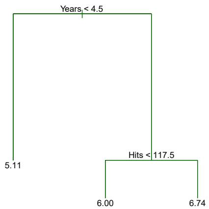

<details>
<summary>flowchart</summary>

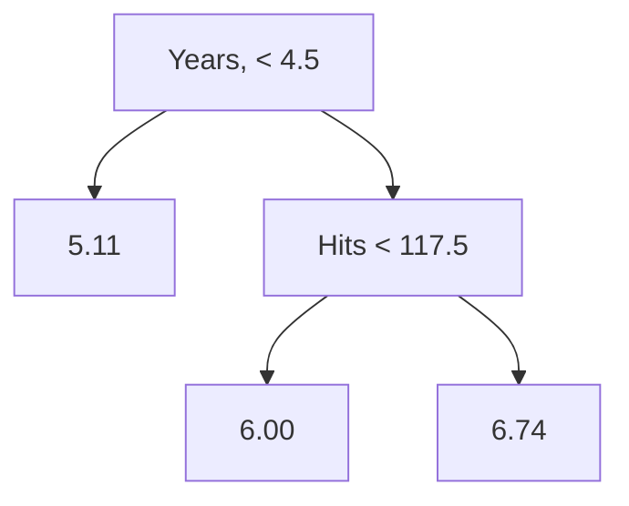
</details>

FIGURE 8.1. For the Hitters data, a regression tree for predicting the log salary of a baseball player, based on the number of years that he has played in the major leagues and the number of hits that he made in the previous year. At a given internal node, the label (of the form $X_{j} < t_{k}$ ) indicates the left-hand branch emanating from that split, and the right-hand branch corresponds to $X_{j} \geq t_{k}$ . For instance, the split at the top of the tree results in two large branches. The left-hand branch corresponds to Years<4.5, and the right-hand branch corresponds to Years>=4.5. The tree has two internal nodes and three terminal nodes, or leaves. The number in each leaf is the mean of the response for the observations that fall there.

# Predicting Baseball Players' Salaries Using Regression Trees

We use the Hitters data set to predict a baseball player's Salary based on Years (the number of years that he has played in the major leagues) and Hits (the number of hits that he made in the previous year). We first remove observations that are missing Salary values, and log-transform Salary so that its distribution has more of a typical bell-shape. (Recall that Salary is measured in thousands of dollars.)

Figure 8.1 shows a regression tree fit to this data. It consists of a series of splitting rules, starting at the top of the tree. The top split assigns observations having Years<4.5 to the left branch. $^{1}$ The predicted salary for these players is given by the mean response value for the players in the data set with Years<4.5. For such players, the mean log salary is 5.107, and so we make a prediction of $e^{5.107}$ thousands of dollars, i.e. \$165,174, for these players. Players with Years>=4.5 are assigned to the right branch, and then that group is further subdivided by Hits. Overall, the tree stratifies or segments the players into three regions of predictor space: players who have played for four or fewer years, players who have played for five or more years and who made fewer than 118 hits last year, and players who have played for five or more years and who made at least 118 hits last year. These three regions can be written as $R_1 = \{X \mid \text{Years}<4.5\}$ , $R_2 = \{X \mid \text{Years}>=4.5$ , Hits<117.5}, and $R_3 = \{X \mid \text{Years}>=4.5$ , Hits>=117.5}. Figure 8.2 illustrates


<details>
<summary>scatter</summary>

| Category | Years (range) | Hits (range) |
| --- | --- | --- |
| R1 | 1~4.5 | 117.5~238 |
| R2 | 4.5~24 | 1~238 |
| R3 | 4.5~24 | 117.5~238 |
</details>

FIGURE 8.2. The three-region partition for the Hitters data set from the regression tree illustrated in Figure 8.1.

the regions as a function of Years and Hits. The predicted salaries for these three groups are $1,000 \times e^{5.107} = 165,174$ , $1,000 \times e^{5.999} = 402,834$ , and $1,000 \times e^{6.740} = 845,346$ respectively.

In keeping with the tree analogy, the regions $R_{1}$ , $R_{2}$ , and $R_{3}$ are known as terminal nodes or leaves of the tree. As is the case for Figure 8.1, decision trees are typically drawn upside down, in the sense that the leaves are at the bottom of the tree. The points along the tree where the predictor space is split are referred to as internal nodes. In Figure 8.1, the two internal nodes are indicated by the text Years<4.5 and Hits<117.5. We refer to the segments of the trees that connect the nodes as branches.

We might interpret the regression tree displayed in Figure 8.1 as follows: Years is the most important factor in determining Salary, and players with less experience earn lower salaries than more experienced players. Given that a player is less experienced, the number of hits that he made in the previous year seems to play little role in his salary. But among players who have been in the major leagues for five or more years, the number of hits made in the previous year does affect salary, and players who made more hits last year tend to have higher salaries. The regression tree shown in Figure 8.1 is likely an over-simplification of the true relationship between Hits, Years, and Salary. However, it has advantages over other types of regression models (such as those seen in Chapters 3 and 6): it is easier to interpret, and has a nice graphical representation.

# Prediction via Stratification of the Feature Space

We now discuss the process of building a regression tree. Roughly speaking, there are two steps.

1. We divide the predictor space — that is, the set of possible values for $X_{1}, X_{2}, \ldots, X_{p}$ — into $J$ distinct and non-overlapping regions, $R_{1}, R_{2}, \ldots, R_{J}$ .

2. For every observation that falls into the region $R_{j}$ , we make the same prediction, which is simply the mean of the response values for the training observations in $R_{j}$ .

For instance, suppose that in Step 1 we obtain two regions, $R_{1}$ and $R_{2}$ , and that the response mean of the training observations in the first region is 10, while the response mean of the training observations in the second region is 20. Then for a given observation X = x, if $x \in R_{1}$ we will predict a value of 10, and if $x \in R_{2}$ we will predict a value of 20.

We now elaborate on Step 1 above. How do we construct the regions $R_{1},\ldots,R_{J}$ ? In theory, the regions could have any shape. However, we choose to divide the predictor space into high-dimensional rectangles, or boxes, for simplicity and for ease of interpretation of the resulting predictive model. The goal is to find boxes $R_{1},\ldots,R_{J}$ that minimize the RSS, given by

$$
\sum_ {j = 1} ^ {J} \sum_ {i \in R _ {j}} (y _ {i} - \hat {y} _ {R _ {j}}) ^ {2}, \tag {8.1}
$$

where $\hat{y}_{R_{j}}$ is the mean response for the training observations within the jth box. Unfortunately, it is computationally infeasible to consider every possible partition of the feature space into J boxes. For this reason, we take a top-down, greedy approach that is known as recursive binary splitting. The approach is top-down because it begins at the top of the tree (at which point all observations belong to a single region) and then successively splits the predictor space; each split is indicated via two new branches further down on the tree. It is greedy because at each step of the tree-building process, the best split is made at that particular step, rather than looking ahead and picking a split that will lead to a better tree in some future step.

In order to perform recursive binary splitting, we first select the predictor $X_{j}$ and the cutpoint s such that splitting the predictor space into the regions $\{X|X_{j}<s\}$ and $\{X|X_{j}\geq s\}$ leads to the greatest possible reduction in RSS. (The notation $\{X|X_{j}<s\}$ means the region of predictor space in which $X_{j}$ takes on a value less than s.) That is, we consider all predictors $X_{1},\ldots,X_{p}$ , and all possible values of the cutpoint s for each of the predictors, and then choose the predictor and cutpoint such that the resulting tree has the lowest RSS. In greater detail, for any j and s, we define the pair of half-planes

$$
R _ {1} (j, s) = \{X | X _ {j} <   s \} \text {and} R _ {2} (j, s) = \{X | X _ {j} \geq s \}, \tag {8.2}
$$

and we seek the value of j and s that minimize the equation

$$
\sum_ {i: x _ {i} \in R _ {1} (j, s)} \left(y _ {i} - \hat {y} _ {R _ {1}}\right) ^ {2} + \sum_ {i: x _ {i} \in R _ {2} (j, s)} \left(y _ {i} - \hat {y} _ {R _ {2}}\right) ^ {2}, \tag {8.3}
$$

where $\hat{y}_{R_{1}}$ is the mean response for the training observations in $R_{1}(j,s)$ , and $\hat{y}_{R_{2}}$ is the mean response for the training observations in $R_{2}(j,s)$ . Finding the values of j and s that minimize (8.3) can be done quite quickly, especially when the number of features p is not too large.

Next, we repeat the process, looking for the best predictor and best cutpoint in order to split the data further so as to minimize the RSS within

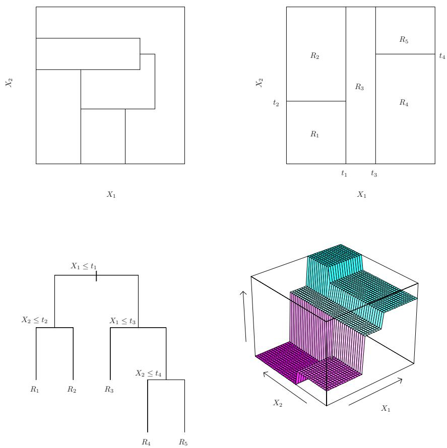  
FIGURE 8.3. Top Left: A partition of two-dimensional feature space that could not result from recursive binary splitting. Top Right: The output of recursive binary splitting on a two-dimensional example. Bottom Left: A tree corresponding to the partition in the top right panel. Bottom Right: A perspective plot of the prediction surface corresponding to that tree.

each of the resulting regions. However, this time, instead of splitting the entire predictor space, we split one of the two previously identified regions. We now have three regions. Again, we look to split one of these three regions further, so as to minimize the RSS. The process continues until a stopping criterion is reached; for instance, we may continue until no region contains more than five observations.

Once the regions $R_{1},\ldots,R_{J}$ have been created, we predict the response for a given test observation using the mean of the training observations in the region to which that test observation belongs.

A five-region example of this approach is shown in Figure 8.3.

# Tree Pruning

The process described above may produce good predictions on the training set, but is likely to overfit the data, leading to poor test set performance. This is because the resulting tree might be too complex. A smaller tree

with fewer splits (that is, fewer regions $R_{1},\ldots,R_{J}$ ) might lead to lower variance and better interpretation at the cost of a little bias. One possible alternative to the process described above is to build the tree only so long as the decrease in the RSS due to each split exceeds some (high) threshold. This strategy will result in smaller trees, but is too short-sighted since a seemingly worthless split early on in the tree might be followed by a very good split—that is, a split that leads to a large reduction in RSS later on.

Therefore, a better strategy is to grow a very large tree $T_{0}$ , and then prune it back in order to obtain a subtree. How do we determine the best way to prune the tree? Intuitively, our goal is to select a subtree that leads to the lowest test error rate. Given a subtree, we can estimate its test error using cross-validation or the validation set approach. However, estimating the cross-validation error for every possible subtree would be too cumbersome, since there is an extremely large number of possible subtrees. Instead, we need a way to select a small set of subtrees for consideration.

Cost complexity pruning—also known as weakest link pruning—gives us a way to do just this. Rather than considering every possible subtree, we consider a sequence of trees indexed by a nonnegative tuning parameter $\alpha$ . For each value of $\alpha$ there corresponds a subtree $T \subset T_{0}$ such that

$$
\sum_ {m = 1} ^ {| T |} \sum_ {i: x _ {i} \in R _ {m}} (y _ {i} - \hat {y} _ {R _ {m}}) ^ {2} + \alpha | T | \tag {8.4}
$$

is as small as possible. Here $|T|$ indicates the number of terminal nodes of the tree T, $R_{m}$ is the rectangle (i.e. the subset of predictor space) corresponding to the mth terminal node, and $\hat{y}_{R_{m}}$ is the predicted response associated with $R_{m}$ —that is, the mean of the training observations in $R_{m}$ . The tuning parameter $\alpha$ controls a trade-off between the subtree's complexity and its fit to the training data. When $\alpha = 0$ , then the subtree T will simply equal $T_{0}$ , because then (8.4) just measures the training error. However, as $\alpha$ increases, there is a price to pay for having a tree with many terminal nodes, and so the quantity (8.4) will tend to be minimized for a smaller subtree. Equation 8.4 is reminiscent of the lasso (6.7) from Chapter 6, in which a similar formulation was used in order to control the complexity of a linear model.

It turns out that as we increase $\alpha$ from zero in (8.4), branches get pruned from the tree in a nested and predictable fashion, so obtaining the whole sequence of subtrees as a function of $\alpha$ is easy. We can select a value of $\alpha$ using a validation set or using cross-validation. We then return to the full data set and obtain the subtree corresponding to $\alpha$ . This process is summarized in Algorithm 8.1.

Figures 8.4 and 8.5 display the results of fitting and pruning a regression tree on the Hitters data, using nine of the features. First, we randomly divided the data set in half, yielding 132 observations in the training set and 131 observations in the test set. We then built a large regression tree on the training data and varied $\alpha$ in (8.4) in order to create subtrees with different numbers of terminal nodes. Finally, we performed six-fold cross-validation in order to estimate the cross-validated MSE of the trees as

# Algorithm 8.1 Building a Regression Tree

1. Use recursive binary splitting to grow a large tree on the training data, stopping only when each terminal node has fewer than some minimum number of observations.  
2. Apply cost complexity pruning to the large tree in order to obtain a sequence of best subtrees, as a function of $\alpha$ .  
3. Use K-fold cross-validation to choose $\alpha$ . That is, divide the training observations into K folds. For each $k = 1, \ldots, K$ :  
(a) Repeat Steps 1 and 2 on all but the kth fold of the training data.  
(b) Evaluate the mean squared prediction error on the data in the left-out $k$ th fold, as a function of $\alpha$ .  
Average the results for each value of $\alpha$ , and pick $\alpha$ to minimize the average error.  
4. Return the subtree from Step 2 that corresponds to the chosen value of $\alpha$ .

a function of $\alpha$ . (We chose to perform six-fold cross-validation because 132 is an exact multiple of six.) The unpruned regression tree is shown in Figure 8.4. The green curve in Figure 8.5 shows the CV error as a function of the number of leaves, $^{2}$ while the orange curve indicates the test error. Also shown are standard error bars around the estimated errors. For reference, the training error curve is shown in black. The CV error is a reasonable approximation of the test error: the CV error takes on its minimum for a three-node tree, while the test error also dips down at the three-node tree (though it takes on its lowest value at the ten-node tree). The pruned tree containing three terminal nodes is shown in Figure 8.1.

# 8.1.2 Classification Trees

A classification tree is very similar to a regression tree, except that it is used to predict a qualitative response rather than a quantitative one. Recall that for a regression tree, the predicted response for an observation is given by the mean response of the training observations that belong to the same terminal node. In contrast, for a classification tree, we predict that each observation belongs to the most commonly occurring class of training observations in the region to which it belongs. In interpreting the results of a classification tree, we are often interested not only in the class prediction corresponding to a particular terminal node region, but also in the class proportions among the training observations that fall into that region.

The task of growing a classification tree is quite similar to the task of growing a regression tree. Just as in the regression setting, we use recursive

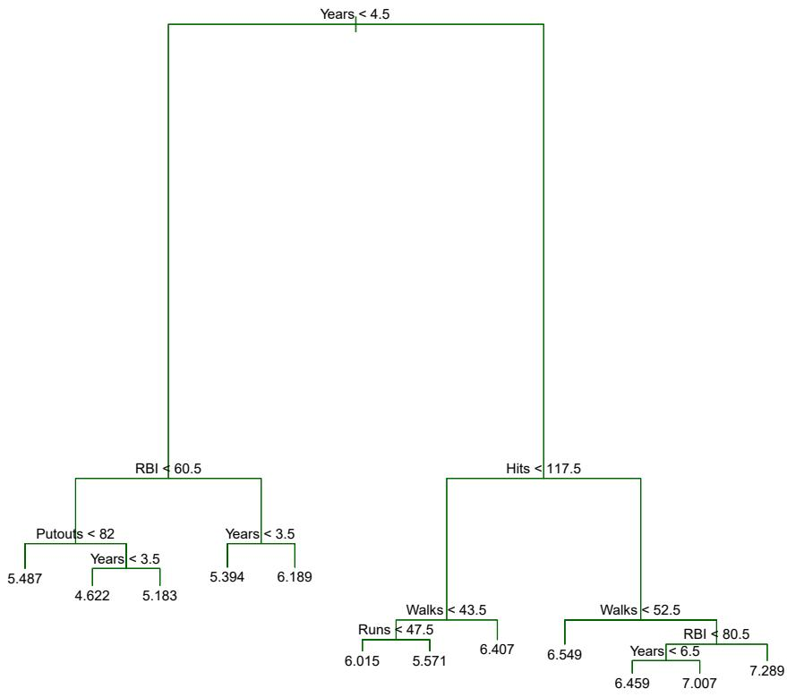

<details>
<summary>flowchart</summary>

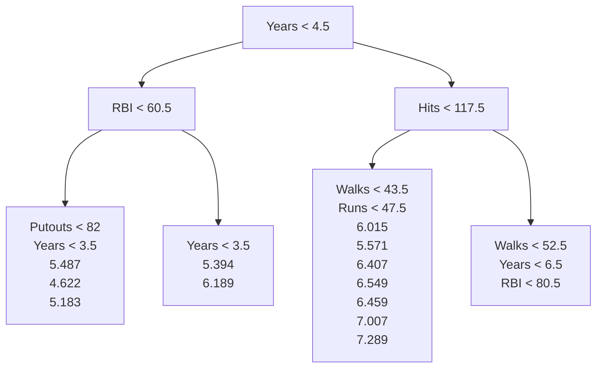
</details>

FIGURE 8.4. Regression tree analysis for the Hitters data. The unpruned tree that results from top-down greedy splitting on the training data is shown.

binary splitting to grow a classification tree. However, in the classification setting, RSS cannot be used as a criterion for making the binary splits. A natural alternative to RSS is the classification error rate. Since we plan to assign an observation in a given region to the most commonly occurring class of training observations in that region, the classification error rate is simply the fraction of the training observations in that region that do not belong to the most common class:

$$
E = 1 - \max _ {k} (\hat {p} _ {m k}). \tag {8.5}
$$

Here $\hat{p}_{mk}$ represents the proportion of training observations in the mth region that are from the kth class. However, it turns out that classification error is not sufficiently sensitive for tree-growing, and in practice two other measures are preferable.

The Gini index is defined by

classification
error rate

Gini index

$$
G = \sum_ {k = 1} ^ {K} \hat {p} _ {m k} (1 - \hat {p} _ {m k}), \tag {8.6}
$$

a measure of total variance across the $K$ classes. It is not hard to see that the Gini index takes on a small value if all of the $\hat{p}_{mk}$ 's are close to zero or one. For this reason the Gini index is referred to as a measure of


<details>
<summary>line</summary>

| Tree Size | Training | Cross-Validation | Test |
| --- | --- | --- | --- |
| 1 | ~0.73 | ~0.74 | ~0.87 |
| 2 | ~0.43 | ~0.48 | ~0.45 |
| 3 | ~0.34 | ~0.41 | ~0.36 |
| 4 | ~0.30 | ~0.42 | ~0.36 |
| 5 | ~0.28 | ~0.44 | ~0.38 |
| 6 | ~0.26 | ~0.47 | ~0.39 |
| 7 | ~0.25 | ~0.51 | ~0.39 |
| 8 | ~0.24 | ~0.51 | ~0.37 |
| 9 | ~0.23 | ~0.50 | ~0.34 |
| 10 | ~0.22 | ~0.50 | ~0.33 |
</details>

FIGURE 8.5. Regression tree analysis for the Hitters data. The training, cross-validation, and test MSE are shown as a function of the number of terminal nodes in the pruned tree. Standard error bands are displayed. The minimum cross-validation error occurs at a tree size of three.

node purity—a small value indicates that a node contains predominantly observations from a single class.

An alternative to the Gini index is entropy, given by

entropy

$$
D = - \sum_ {k = 1} ^ {K} \hat {p} _ {m k} \log \hat {p} _ {m k}. \tag {8.7}
$$

Since $0 \leq \hat{p}_{mk} \leq 1$ , it follows that $0 \leq -\hat{p}_{mk} \log \hat{p}_{mk}$ . One can show that the entropy will take on a value near zero if the $\hat{p}_{mk}$ 's are all near zero or near one. Therefore, like the Gini index, the entropy will take on a small value if the mth node is pure. In fact, it turns out that the Gini index and the entropy are quite similar numerically.

When building a classification tree, either the Gini index or the entropy are typically used to evaluate the quality of a particular split, since these two approaches are more sensitive to node purity than is the classification error rate. Any of these three approaches might be used when pruning the tree, but the classification error rate is preferable if prediction accuracy of the final pruned tree is the goal.

Figure 8.6 shows an example on the Heart data set. These data contain a binary outcome HD for 303 patients who presented with chest pain. An outcome value of Yes indicates the presence of heart disease based on an angiographic test, while No means no heart disease. There are 13 predictors including Age, Sex, Chol (a cholesterol measurement), and other heart and lung function measurements. Cross-validation results in a tree with six terminal nodes.

In our discussion thus far, we have assumed that the predictor variables take on continuous values. However, decision trees can be constructed even in the presence of qualitative predictor variables. For instance, in the Heart data, some of the predictors, such as Sex, Thal (Thallium stress test),

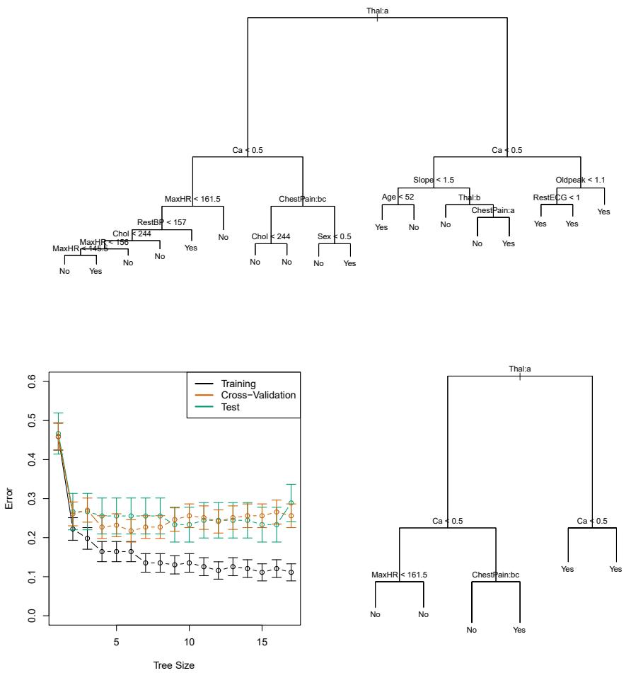  
FIGURE 8.6. Heart data. Top: The unpruned tree. Bottom Left: Cross-validation error, training, and test error, for different sizes of the pruned tree. Bottom Right: The pruned tree corresponding to the minimal cross-validation error.

and ChestPain, are qualitative. Therefore, a split on one of these variables amounts to assigning some of the qualitative values to one branch and assigning the remaining to the other branch. In Figure 8.6, some of the internal nodes correspond to splitting qualitative variables. For instance, the top internal node corresponds to splitting Thal. The text Thal:a indicates that the left-hand branch coming out of that node consists of observations with the first value of the Thal variable (normal), and the right-hand node consists of the remaining observations (fixed or reversible defects). The text ChestPain:bc two splits down the tree on the left indicates that the left-hand branch coming out of that node consists of observations with the second and third values of the ChestPain variable, where the possible values are typical angina, atypical angina, non-anginal pain, and asymptomatic.

Figure 8.6 has a surprising characteristic: some of the splits yield two terminal nodes that have the same predicted value. For instance, consider the split RestECG<1 near the bottom right of the unpruned tree. Regardless of the value of RestECG, a response value of Yes is predicted for those ob-

servations. Why, then, is the split performed at all? The split is performed because it leads to increased node purity. That is, all 9 of the observations corresponding to the right-hand leaf have a response value of Yes, whereas 7/11 of those corresponding to the left-hand leaf have a response value of Yes. Why is node purity important? Suppose that we have a test observation that belongs to the region given by that right-hand leaf. Then we can be pretty certain that its response value is Yes. In contrast, if a test observation belongs to the region given by the left-hand leaf, then its response value is probably Yes, but we are much less certain. Even though the split RestECG<1 does not reduce the classification error, it improves the Gini index and the entropy, which are more sensitive to node purity.

# 8.1.3 Trees Versus Linear Models

Regression and classification trees have a very different flavor from the more classical approaches for regression and classification presented in Chapters 3 and 4. In particular, linear regression assumes a model of the form

$$
f (X) = \beta_ {0} + \sum_ {j = 1} ^ {p} X _ {j} \beta_ {j}, \tag {8.8}
$$

whereas regression trees assume a model of the form

$$
f (X) = \sum_ {m = 1} ^ {M} c _ {m} \cdot 1 _ {(X \in R _ {m})} \tag {8.9}
$$

where $R_{1},\ldots ,R_{M}$ represent a partition of feature space, as in Figure 8.3.

Which model is better? It depends on the problem at hand. If the relationship between the features and the response is well approximated by a linear model as in $(8.8)$ , then an approach such as linear regression will likely work well, and will outperform a method such as a regression tree that does not exploit this linear structure. If instead there is a highly nonlinear and complex relationship between the features and the response as indicated by model $(8.9)$ , then decision trees may outperform classical approaches. An illustrative example is displayed in Figure 8.7. The relative performances of tree-based and classical approaches can be assessed by estimating the test error, using either cross-validation or the validation set approach (Chapter 5).

Of course, other considerations beyond simply test error may come into play in selecting a statistical learning method; for instance, in certain settings, prediction using a tree may be preferred for the sake of interpretability and visualization.

# 8.1.4 Advantages and Disadvantages of Trees

Decision trees for regression and classification have a number of advantages over the more classical approaches seen in Chapters 3 and 4:

▲ Trees are very easy to explain to people. In fact, they are even easier to explain than linear regression!

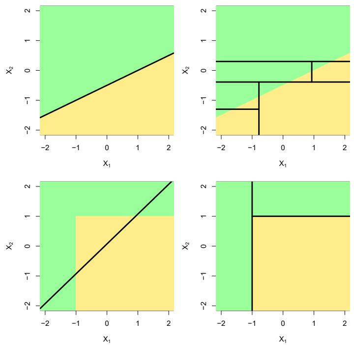  
FIGURE 8.7. Top Row: A two-dimensional classification example in which the true decision boundary is linear, and is indicated by the shaded regions. A classical approach that assumes a linear boundary (left) will outperform a decision tree that performs splits parallel to the axes (right). Bottom Row: Here the true decision boundary is non-linear. Here a linear model is unable to capture the true decision boundary (left), whereas a decision tree is successful (right).

▲ Some people believe that decision trees more closely mirror human decision-making than do the regression and classification approaches seen in previous chapters.  
▲ Trees can be displayed graphically, and are easily interpreted even by a non-expert (especially if they are small).  
▲ Trees can easily handle qualitative predictors without the need to create dummy variables.  
▼ Unfortunately, trees generally do not have the same level of predictive accuracy as some of the other regression and classification approaches seen in this book.  
Additionally, trees can be very non-robust. In other words, a small change in the data can cause a large change in the final estimated tree.

However, by aggregating many decision trees, using methods like bagging, random forests, and boosting, the predictive performance of trees can be substantially improved. We introduce these concepts in the next section.

# 8.2 Bagging, Random Forests, Boosting, and Bayesian Additive Regression Trees

An ensemble method is an approach that combines many simple “building block” models in order to obtain a single and potentially very powerful model. These simple building block models are sometimes known as weak learners, since they may lead to mediocre predictions on their own.

We will now discuss bagging, random forests, boosting, and Bayesian additive regression trees. These are ensemble methods for which the simple building block is a regression or a classification tree.

ensemble

weak
learners

# 8.2.1 Bagging

The bootstrap, introduced in Chapter 5, is an extremely powerful idea. It is used in many situations in which it is hard or even impossible to directly compute the standard deviation of a quantity of interest. We see here that the bootstrap can be used in a completely different context, in order to improve statistical learning methods such as decision trees.

The decision trees discussed in Section 8.1 suffer from high variance. This means that if we split the training data into two parts at random, and fit a decision tree to both halves, the results that we get could be quite different. In contrast, a procedure with low variance will yield similar results if applied repeatedly to distinct data sets; linear regression tends to have low variance, if the ratio of n to p is moderately large. Bootstrap aggregation, or bagging, is a general-purpose procedure for reducing the variance of a statistical learning method; we introduce it here because it is particularly useful and frequently used in the context of decision trees.

Recall that given a set of n independent observations $Z_{1},\ldots,Z_{n}$ , each with variance $\sigma^{2}$ , the variance of the mean $\bar{Z}$ of the observations is given by $\sigma^{2}/n$ . In other words, averaging a set of observations reduces variance. Hence a natural way to reduce the variance and increase the test set accuracy of a statistical learning method is to take many training sets from the population, build a separate prediction model using each training set, and average the resulting predictions. In other words, we could calculate $\hat{f}^{1}(x),\hat{f}^{2}(x),\ldots,\hat{f}^{B}(x)$ using B separate training sets, and average them in order to obtain a single low-variance statistical learning model, given by

$$
\hat {f} _ {\mathrm{avg}} (x) = \frac {1}{B} \sum_ {b = 1} ^ {B} \hat {f} ^ {b} (x).
$$

Of course, this is not practical because we generally do not have access to multiple training sets. Instead, we can bootstrap, by taking repeated samples from the (single) training data set. In this approach we generate B different bootstrapped training data sets. We then train our method on the bth bootstrapped training set in order to get $\hat{f}^{*b}(x)$ , and finally average all the predictions, to obtain

$$
\hat {f} _ {\mathrm{bag}} (x) = \frac {1}{B} \sum_ {b = 1} ^ {B} \hat {f} ^ {* b} (x).
$$

bagging


<details>
<summary>line</summary>

| Number of Trees | Test: Bagging | Test: RandomForest | OOB: Bagging | OOB: RandomForest |
| --- | --- | --- | --- | --- |
| 0 | ~0.26 | ~0.26 | ~0.26 | ~0.26 |
| 50 | ~0.25 | ~0.22 | ~0.19 | ~0.17 |
| 100 | ~0.25 | ~0.22 | ~0.20 | ~0.16 |
| 150 | ~0.25 | ~0.22 | ~0.20 | ~0.16 |
| 200 | ~0.24 | ~0.22 | ~0.19 | ~0.16 |
| 250 | ~0.24 | ~0.22 | ~0.19 | ~0.16 |
| 300 | ~0.24 | ~0.22 | ~0.18 | ~0.16 |
</details>

FIGURE 8.8. Bagging and random forest results for the Heart data. The test error (black and orange) is shown as a function of B, the number of bootstrapped training sets used. Random forests were applied with $m = \sqrt{p}$ . The dashed line indicates the test error resulting from a single classification tree. The green and blue traces show the OOB error, which in this case is — by chance — considerably lower.

This is called bagging.

While bagging can improve predictions for many regression methods, it is particularly useful for decision trees. To apply bagging to regression trees, we simply construct B regression trees using B bootstrapped training sets, and average the resulting predictions. These trees are grown deep, and are not pruned. Hence each individual tree has high variance, but low bias. Averaging these B trees reduces the variance. Bagging has been demonstrated to give impressive improvements in accuracy by combining together hundreds or even thousands of trees into a single procedure.

Thus far, we have described the bagging procedure in the regression context, to predict a quantitative outcome Y. How can bagging be extended to a classification problem where Y is qualitative? In that situation, there are a few possible approaches, but the simplest is as follows. For a given test observation, we can record the class predicted by each of the B trees, and take a majority vote: the overall prediction is the most commonly occurring class among the B predictions.

Figure 8.8 shows the results from bagging trees on the Heart data. The test error rate is shown as a function of B, the number of trees constructed using bootstrapped training data sets. We see that the bagging test error rate is slightly lower in this case than the test error rate obtained from a single tree. The number of trees B is not a critical parameter with bagging; using a very large value of B will not lead to overfitting. In practice we

majority
vote

use a value of B sufficiently large that the error has settled down. Using B = 100 is sufficient to achieve good performance in this example.

# Out-of-Bag Error Estimation

It turns out that there is a very straightforward way to estimate the test error of a bagged model, without the need to perform cross-validation or the validation set approach. Recall that the key to bagging is that trees are repeatedly fit to bootstrapped subsets of the observations. One can show that on average, each bagged tree makes use of around two-thirds of the observations. $^{3}$ The remaining one-third of the observations not used to fit a given bagged tree are referred to as the out-of-bag (OOB) observations. We can predict the response for the ith observation using each of the trees in which that observation was OOB. This will yield around B/3 predictions for the ith observation. In order to obtain a single prediction for the ith observation, we can average these predicted responses (if regression is the goal) or can take a majority vote (if classification is the goal). This leads to a single OOB prediction for the ith observation. An OOB prediction can be obtained in this way for each of the n observations, from which the overall OOB MSE (for a regression problem) or classification error (for a classification problem) can be computed. The resulting OOB error is a valid estimate of the test error for the bagged model, since the response for each observation is predicted using only the trees that were not fit using that observation. Figure 8.8 displays the OOB error on the Heart data. It can be shown that with B sufficiently large, OOB error is virtually equivalent to leave-one-out cross-validation error. The OOB approach for estimating the test error is particularly convenient when performing bagging on large data sets for which cross-validation would be computationally onerous.

out-of-bag

# Variable Importance Measures

As we have discussed, bagging typically results in improved accuracy over prediction using a single tree. Unfortunately, however, it can be difficult to interpret the resulting model. Recall that one of the advantages of decision trees is the attractive and easily interpreted diagram that results, such as the one displayed in Figure 8.1. However, when we bag a large number of trees, it is no longer possible to represent the resulting statistical learning procedure using a single tree, and it is no longer clear which variables are most important to the procedure. Thus, bagging improves prediction accuracy at the expense of interpretability.

Although the collection of bagged trees is much more difficult to interpret than a single tree, one can obtain an overall summary of the importance of each predictor using the RSS (for bagging regression trees) or the Gini index (for bagging classification trees). In the case of bagging regression trees, we can record the total amount that the RSS (8.1) is decreased due to splits over a given predictor, averaged over all B trees. A large value indicates an important predictor. Similarly, in the context of bagging classification


<details>
<summary>bar</summary>

| Variable | Importance |
| --- | --- |
| Fbs | ~2 |
| RestECG | ~6 |
| ExAng | ~9 |
| Sex | ~11 |
| Slope | ~19 |
| Chol | ~22 |
| Age | ~22 |
| RestBP | ~24 |
| MaxHR | ~31 |
| Oldpeak | ~36 |
| ChestPain | ~44 |
| Ca | ~55 |
| Thal | 100 |
</details>

FIGURE 8.9. A variable importance plot for the Heart data. Variable importance is computed using the mean decrease in Gini index, and expressed relative to the maximum.

trees, we can add up the total amount that the Gini index (8.6) is decreased by splits over a given predictor, averaged over all B trees.

A graphical representation of the variable importances in the Heart data is shown in Figure 8.9. We see the mean decrease in Gini index for each variable, relative to the largest. The variables with the largest mean decrease in Gini index are Thal, Ca, and ChestPain.

variable
importance

# 8.2.2 Random Forests

Random forests provide an improvement over bagged trees by way of a small tweak that decorrelates the trees. As in bagging, we build a number of decision trees on bootstrapped training samples. But when building these decision trees, each time a split in a tree is considered, a random sample of m predictors is chosen as split candidates from the full set of p predictors. The split is allowed to use only one of those m predictors. A fresh sample of m predictors is taken at each split, and typically we choose $m \approx \sqrt{p}$ —that is, the number of predictors considered at each split is approximately equal to the square root of the total number of predictors (4 out of the 13 for the Heart data).

In other words, in building a random forest, at each split in the tree, the algorithm is not even allowed to consider a majority of the available predictors. This may sound crazy, but it has a clever rationale. Suppose that there is one very strong predictor in the data set, along with a number of other moderately strong predictors. Then in the collection of bagged trees, most or all of the trees will use this strong predictor in the top split. Consequently, all of the bagged trees will look quite similar to each other.

random
forest

Hence the predictions from the bagged trees will be highly correlated. Unfortunately, averaging many highly correlated quantities does not lead to as large of a reduction in variance as averaging many uncorrelated quantities. In particular, this means that bagging will not lead to a substantial reduction in variance over a single tree in this setting.

Random forests overcome this problem by forcing each split to consider only a subset of the predictors. Therefore, on average $(p - m)/p$ of the splits will not even consider the strong predictor, and so other predictors will have more of a chance. We can think of this process as decorrelating the trees, thereby making the average of the resulting trees less variable and hence more reliable.

The main difference between bagging and random forests is the choice of predictor subset size m. For instance, if a random forest is built using m = p, then this amounts simply to bagging. On the Heart data, random forests using $m = \sqrt{p}$ leads to a reduction in both test error and OOB error over bagging (Figure 8.8).

Using a small value of m in building a random forest will typically be helpful when we have a large number of correlated predictors. We applied random forests to a high-dimensional biological data set consisting of expression measurements of 4,718 genes measured on tissue samples from 349 patients. There are around 20,000 genes in humans, and individual genes have different levels of activity, or expression, in particular cells, tissues, and biological conditions. In this data set, each of the patient samples has a qualitative label with 15 different levels: either normal or 1 of 14 different types of cancer. Our goal was to use random forests to predict cancer type based on the 500 genes that have the largest variance in the training set. We randomly divided the observations into a training and a test set, and applied random forests to the training set for three different values of the number of splitting variables m. The results are shown in Figure 8.10. The error rate of a single tree is 45.7%, and the null rate is 75.4%. $^{4}$ We see that using 400 trees is sufficient to give good performance, and that the choice $m = \sqrt{p}$ gave a small improvement in test error over bagging (m = p) in this example. As with bagging, random forests will not overfit if we increase B, so in practice we use a value of B sufficiently large for the error rate to have settled down.

# 8.2.3 Boosting

We now discuss boosting, yet another approach for improving the predictions resulting from a decision tree. Like bagging, boosting is a general approach that can be applied to many statistical learning methods for regression or classification. Here we restrict our discussion of boosting to the context of decision trees.

Recall that bagging involves creating multiple copies of the original training data set using the bootstrap, fitting a separate decision tree to each copy, and then combining all of the trees in order to create a single predic-

boosting

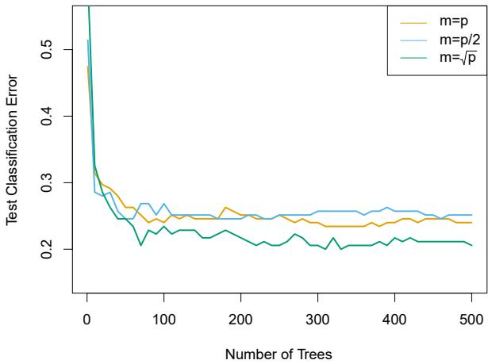

<details>
<summary>line</summary>

| Number of Trees | m=p | m=p/2 | \(m=\sqrt{p}\) |
| --- | --- | --- | --- |
| 0 | ~0.48 | ~0.51 | ~0.56 |
| 25 | ~0.30 | ~0.28 | ~0.29 |
| 50 | ~0.27 | ~0.25 | ~0.25 |
| 75 | ~0.26 | ~0.27 | ~0.21 |
| 100 | ~0.24 | ~0.27 | ~0.23 |
| 125 | ~0.25 | ~0.25 | ~0.23 |
| 150 | ~0.25 | ~0.25 | ~0.22 |
| 175 | ~0.26 | ~0.25 | ~0.23 |
| 200 | ~0.25 | ~0.25 | ~0.22 |
| 225 | ~0.25 | ~0.25 | ~0.21 |
| 250 | ~0.25 | ~0.25 | ~0.21 |
| 275 | ~0.24 | ~0.25 | ~0.22 |
| 300 | ~0.24 | ~0.25 | ~0.21 |
| 325 | ~0.24 | ~0.26 | ~0.20 |
| 350 | ~0.24 | ~0.26 | ~0.21 |
| 375 | ~0.24 | ~0.26 | ~0.21 |
| 400 | ~0.24 | ~0.26 | ~0.21 |
| 425 | ~0.25 | ~0.26 | ~0.22 |
| 450 | ~0.25 | ~0.25 | ~0.21 |
| 475 | ~0.25 | ~0.25 | ~0.21 |
| 500 | ~0.24 | ~0.25 | ~0.21 |
</details>

FIGURE 8.10. Results from random forests for the 15-class gene expression data set with p = 500 predictors. The test error is displayed as a function of the number of trees. Each colored line corresponds to a different value of m, the number of predictors available for splitting at each interior tree node. Random forests (m < p) lead to a slight improvement over bagging (m = p). A single classification tree has an error rate of 45.7%.

tive model. Notably, each tree is built on a bootstrap data set, independent of the other trees. Boosting works in a similar way, except that the trees are grown sequentially: each tree is grown using information from previously grown trees. Boosting does not involve bootstrap sampling; instead each tree is fit on a modified version of the original data set.

Consider first the regression setting. Like bagging, boosting involves combining a large number of decision trees, $\hat{f}^{1},\ldots,\hat{f}^{B}$ . Boosting is described in Algorithm 8.2.

What is the idea behind this procedure? Unlike fitting a single large decision tree to the data, which amounts to fitting the data hard and potentially overfitting, the boosting approach instead learns slowly. Given the current model, we fit a decision tree to the residuals from the model. That is, we fit a tree using the current residuals, rather than the outcome Y, as the response. We then add this new decision tree into the fitted function in order to update the residuals. Each of these trees can be rather small, with just a few terminal nodes, determined by the parameter d in the algorithm. By fitting small trees to the residuals, we slowly improve $\hat{f}$ in areas where it does not perform well. The shrinkage parameter $\lambda$ slows the process down even further, allowing more and different shaped trees to attack the residuals. In general, statistical learning approaches that learn slowly tend to perform well. Note that in boosting, unlike in bagging, the construction of each tree depends strongly on the trees that have already been grown.

We have just described the process of boosting regression trees. Boosting classification trees proceeds in a similar but slightly more complex way, and the details are omitted here.

# Algorithm 8.2 Boosting for Regression Trees

1. Set $\hat{f}(x) = 0$ and $r_i = y_i$ for all $i$ in the training set.

2. For $b = 1, 2, \ldots, B$ , repeat:

(a) Fit a tree $\hat{f}^b$ with $d$ splits ( $d + 1$ terminal nodes) to the training data $(X, r)$ .  
(b) Update $\hat{f}$ by adding in a shrunken version of the new tree:

$$
\hat {f} (x) \leftarrow \hat {f} (x) + \lambda \hat {f} ^ {b} (x). \tag {8.10}
$$

(c) Update the residuals,

$$
r _ {i} \leftarrow r _ {i} - \lambda \hat {f} ^ {b} (x _ {i}). \tag {8.11}
$$

3. Output the boosted model,

$$
\hat {f} (x) = \sum_ {b = 1} ^ {B} \lambda \hat {f} ^ {b} (x). \tag {8.12}
$$

Boosting has three tuning parameters:

1. The number of trees $B$ . Unlike bagging and random forests, boosting can overfit if $B$ is too large, although this overfitting tends to occur slowly if at all. We use cross-validation to select $B$ .  
2. The shrinkage parameter $\lambda$ , a small positive number. This controls the rate at which boosting learns. Typical values are 0.01 or 0.001, and the right choice can depend on the problem. Very small $\lambda$ can require using a very large value of B in order to achieve good performance.  
3. The number d of splits in each tree, which controls the complexity of the boosted ensemble. Often d = 1 works well, in which case each tree is a stump, consisting of a single split. In this case, the boosted ensemble is fitting an additive model, since each term involves only a single variable. More generally d is the interaction depth, and controls the interaction order of the boosted model, since d splits can involve at most d variables.

In Figure 8.11, we applied boosting to the 15-class cancer gene expression data set, in order to develop a classifier that can distinguish the normal class from the 14 cancer classes. We display the test error as a function of the total number of trees and the interaction depth d. We see that simple stumps with an interaction depth of one perform well if enough of them are included. This model outperforms the depth-two model, and both outperform a random forest. This highlights one difference between boosting and random forests: in boosting, because the growth of a particular tree takes into account the other trees that have already been grown, smaller

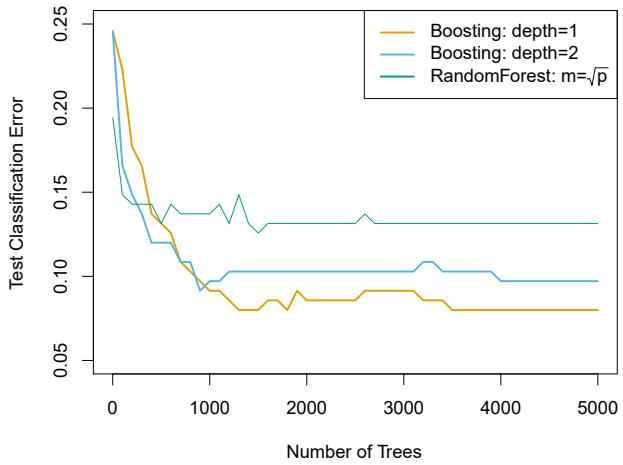

<details>
<summary>line</summary>

| Number of Trees | Boosting: depth=1 | Boosting: depth=2 | RandomForest: \(m=\sqrt{p}\) |
| --- | --- | --- | --- |
| 0 | ~0.245 | ~0.245 | ~0.195 |
| 250 | ~0.175 | ~0.145 | ~0.145 |
| 500 | ~0.135 | ~0.120 | ~0.140 |
| 750 | ~0.110 | ~0.110 | ~0.135 |
| 1000 | ~0.095 | ~0.095 | ~0.135 |
| 1250 | ~0.090 | ~0.100 | ~0.140 |
| 1500 | ~0.080 | ~0.100 | ~0.130 |
| 1750 | ~0.085 | ~0.100 | ~0.130 |
| 2000 | ~0.085 | ~0.100 | ~0.130 |
| 2250 | ~0.085 | ~0.100 | ~0.130 |
| 2500 | ~0.090 | ~0.100 | ~0.130 |
| 2750 | ~0.090 | ~0.100 | ~0.130 |
| 3000 | ~0.090 | ~0.100 | ~0.130 |
| 3250 | ~0.085 | ~0.105 | ~0.130 |
| 3500 | ~0.080 | ~0.100 | ~0.130 |
| 3750 | ~0.080 | ~0.100 | ~0.130 |
| 4000 | ~0.080 | ~0.100 | ~0.130 |
| 4250 | ~0.080 | ~0.100 | ~0.130 |
| 4500 | ~0.080 | ~0.100 | ~0.130 |
| 4750 | ~0.080 | ~0.100 | ~0.130 |
| 5000 | ~0.080 | ~0.100 | ~0.130 |
</details>

FIGURE 8.11. Results from performing boosting and random forests on the 15-class gene expression data set in order to predict cancer versus normal. The test error is displayed as a function of the number of trees. For the two boosted models, $\lambda = 0.01$ . Depth-1 trees slightly outperform depth-2 trees, and both outperform the random forest, although the standard errors are around 0.02, making none of these differences significant. The test error rate for a single tree is 24%.

trees are typically sufficient. Using smaller trees can aid in interpretability as well; for instance, using stumps leads to an additive model.

# 8.2.4 Bayesian Additive Regression Trees

Finally, we discuss Bayesian additive regression trees (BART), another ensemble method that uses decision trees as its building blocks. For simplicity, we present BART for regression (as opposed to classification).

Recall that bagging and random forests make predictions from an average of regression trees, each of which is built using a random sample of data and/or predictors. Each tree is built separately from the others. By contrast, boosting uses a weighted sum of trees, each of which is constructed by fitting a tree to the residual of the current fit. Thus, each new tree attempts to capture signal that is not yet accounted for by the current set of trees. BART is related to both approaches: each tree is constructed in a random manner as in bagging and random forests, and each tree tries to capture signal not yet accounted for by the current model, as in boosting. The main novelty in BART is the way in which new trees are generated.

Before we introduce the BART algorithm, we define some notation. We let K denote the number of regression trees, and B the number of iterations for which the BART algorithm will be run. The notation $\hat{f}_{k}^{b}(x)$ represents the prediction at x for the kth regression tree used in the bth iteration. At the end of each iteration, the K trees from that iteration will be summed, i.e. $\hat{f}^{b}(x)=\sum_{k=1}^{K}\hat{f}_{k}^{b}(x)$ for $b=1,\ldots,B$ .

In the first iteration of the BART algorithm, all trees are initialized to have a single root node, with $\hat{f}_{k}^{1}(x)=\frac{1}{nK}\sum_{i=1}^{n}y_{i}$ , the mean of the response

Bayesian
additive
regression
trees

(a): $\hat{f}_{k}^{b-1}(X)$  
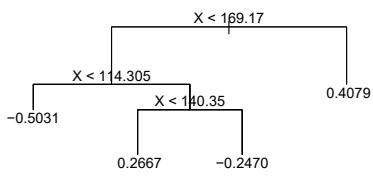

<details>
<summary>flowchart</summary>


</details>

(c): Possibility #2 for $\hat{f}_{k}^{b}(X)$

(b): Possibility #1 for $\hat{f}_{k}^{b}(X)$  
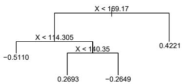

<details>
<summary>flowchart</summary>

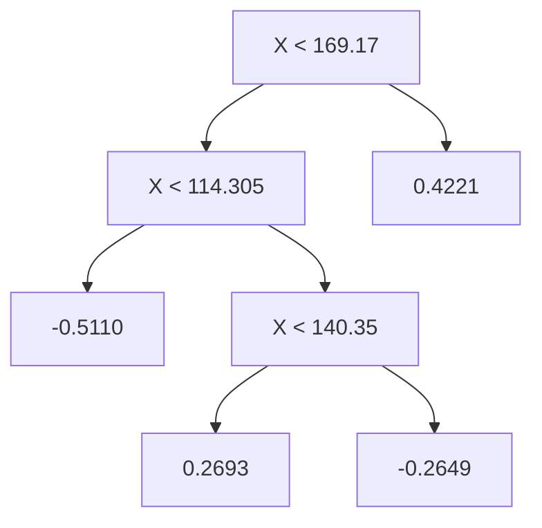
</details>

(d): Possibility #3 for $\hat{f}_k^b (X)$

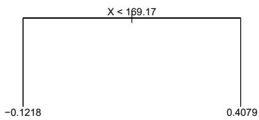

<details>
<summary>wireframe</summary>

| X | Y |
| --- | --- |
| 169.17 | -0.1218 |
| 169.17 | 0.4079 |
</details>

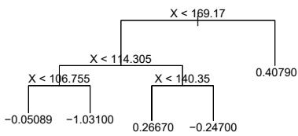

<details>
<summary>flowchart</summary>

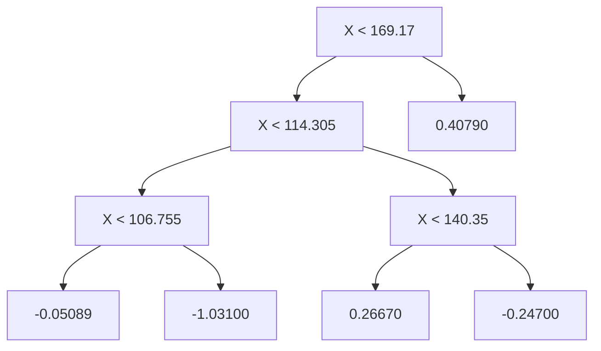
</details>

FIGURE 8.12. A schematic of perturbed trees from the BART algorithm. (a): The kth tree at the $(b-1)$ st iteration, $\hat{f}_{k}^{b-1}(X)$ , is displayed. Panels (b)–(d) display three of many possibilities for $\hat{f}_{k}^{b}(X)$ , given the form of $\hat{f}_{k}^{b-1}(X)$ . (b): One possibility is that $\hat{f}_{k}^{b}(X)$ has the same structure as $\hat{f}_{k}^{b-1}(X)$ , but with different predictions at the terminal nodes. (c): Another possibility is that $\hat{f}_{k}^{b}(X)$ results from pruning $\hat{f}_{k}^{b-1}(X)$ . (d): Alternatively, $\hat{f}_{k}^{b}(X)$ may have more terminal nodes than $\hat{f}_{k}^{b-1}(X)$ .

values divided by the total number of trees. Thus, $\hat{f}^1 (x) = \sum_{k = 1}^{K}\hat{f}_k^1 (x) = \frac{1}{n}\sum_{i = 1}^{n}y_i$ .

In subsequent iterations, BART updates each of the K trees, one at a time. In the bth iteration, to update the kth tree, we subtract from each response value the predictions from all but the kth tree, in order to obtain a partial residual

$$
r _ {i} = y _ {i} - \sum_ {k ^ {\prime} <   k} \hat {f} _ {k ^ {\prime}} ^ {b} (x _ {i}) - \sum_ {k ^ {\prime} > k} \hat {f} _ {k ^ {\prime}} ^ {b - 1} (x _ {i})
$$

for the ith observation, $i = 1, \ldots, n$ . Rather than fitting a fresh tree to this partial residual, BART randomly chooses a perturbation to the tree from the previous iteration ( $\hat{f}_{k}^{b-1}$ ) from a set of possible perturbations, favoring ones that improve the fit to the partial residual. There are two components to this perturbation:

1. We may change the structure of the tree by adding or pruning branches.  
2. We may change the prediction in each terminal node of the tree.

Figure 8.12 illustrates examples of possible perturbations to a tree.

The output of BART is a collection of prediction models,

$$
\hat {f} ^ {b} (x) = \sum_ {k = 1} ^ {K} \hat {f} _ {k} ^ {b} (x), \text {for} b = 1, 2, \dots , B.
$$

# Algorithm 8.3 Bayesian Additive Regression Trees

1. Let $\hat{f}_{1}^{1}(x)=\hat{f}_{2}^{1}(x)=\cdots=\hat{f}_{K}^{1}(x)=\frac{1}{nK}\sum_{i=1}^{n}y_{i}.$  
2. Compute $\hat{f}^1 (x) = \sum_{k = 1}^{K}\hat{f}_k^1 (x) = \frac{1}{n}\sum_{i = 1}^{n}y_i$  
3. For $b = 2, \dots, B$ :

(a) For $k = 1, 2, \ldots, K$ :

i. For $i = 1, \dots, n$ , compute the current partial residual

$$
r _ {i} = y _ {i} - \sum_ {k ^ {\prime} <   k} \hat {f} _ {k ^ {\prime}} ^ {b} (x _ {i}) - \sum_ {k ^ {\prime} > k} \hat {f} _ {k ^ {\prime}} ^ {b - 1} (x _ {i}).
$$

ii. Fit a new tree, $\hat{f}_k^b (x)$ , to $r_i$ , by randomly perturbing the $k$ th tree from the previous iteration, $\hat{f}_k^{b - 1}(x)$ . Perturbations that improve the fit are favored.

(b) Compute $\hat{f}^b (x) = \sum_{k = 1}^{K}\hat{f}_k^b (x)$

4. Compute the mean after $L$ burn-in samples,

$$
\hat {f} (x) = \frac {1}{B - L} \sum_ {b = L + 1} ^ {B} \hat {f} ^ {b} (x).
$$

We typically throw away the first few of these prediction models, since models obtained in the earlier iterations — known as the burn-in period — tend not to provide very good results. We can let L denote the number of burn-in iterations; for instance, we might take L = 200. Then, to obtain a single prediction, we simply take the average after the burn-in iterations, $\hat{f}(x) = \frac{1}{B-L} \sum_{b=L+1}^{B} \hat{f}^{b}(x)$ . However, it is also possible to compute quantities other than the average: for instance, the percentiles of $\hat{f}^{L+1}(x), \ldots, \hat{f}^{B}(x)$ provide a measure of uncertainty in the final prediction. The overall BART procedure is summarized in Algorithm 8.3.

A key element of the BART approach is that in Step 3(a)ii., we do not fit a fresh tree to the current partial residual: instead, we try to improve the fit to the current partial residual by slightly modifying the tree obtained in the previous iteration (see Figure 8.12). Roughly speaking, this guards against overfitting since it limits how “hard” we fit the data in each iteration. Furthermore, the individual trees are typically quite small. We limit the tree size in order to avoid overfitting the data, which would be more likely to occur if we grew very large trees.

Figure 8.13 shows the result of applying BART to the Heart data, using K = 200 trees, as the number of iterations is increased to 10,000. During the initial iterations, the test and training errors jump around a bit. After this initial burn-in period, the error rates settle down. We note that there is only a small difference between the training error and the test error, indicating that the tree perturbation process largely avoids overfitting.

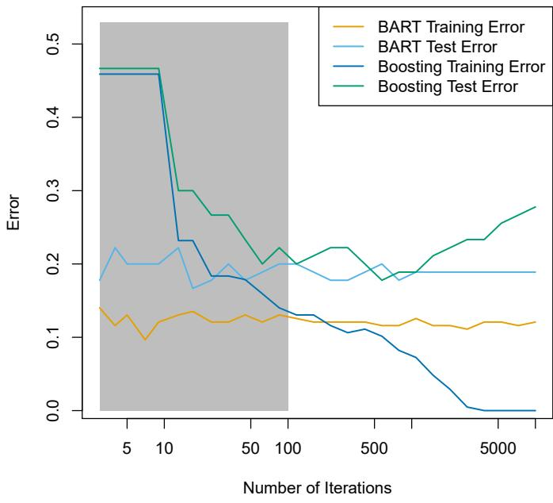

<details>
<summary>line</summary>

| Number of Iterations | BART Training Error | BART Test Error | Boosting Training Error | Boosting Test Error |
| --- | --- | --- | --- | --- |
| 2 | ~0.14 | ~0.18 | ~0.46 | ~0.47 |
| 5 | ~0.12 | ~0.22 | ~0.46 | ~0.47 |
| 10 | ~0.13 | ~0.20 | ~0.46 | ~0.47 |
| 20 | ~0.10 | ~0.20 | ~0.23 | ~0.30 |
| 30 | ~0.12 | ~0.22 | ~0.23 | ~0.30 |
| 40 | ~0.13 | ~0.17 | ~0.18 | ~0.27 |
| 50 | ~0.12 | ~0.18 | ~0.18 | ~0.27 |
| 60 | ~0.13 | ~0.20 | ~0.18 | ~0.24 |
| 70 | ~0.12 | ~0.18 | ~0.17 | ~0.20 |
| 80 | ~0.13 | ~0.19 | ~0.16 | ~0.22 |
| 100 | ~0.13 | ~0.20 | ~0.14 | ~0.20 |
| 200 | ~0.12 | ~0.18 | ~0.13 | ~0.22 |
| 300 | ~0.12 | ~0.18 | ~0.11 | ~0.22 |
| 400 | ~0.12 | ~0.19 | ~0.11 | ~0.20 |
| 500 | ~0.12 | ~0.20 | ~0.10 | ~0.18 |
| 600 | ~0.12 | ~0.18 | ~0.09 | ~0.19 |
| 700 | ~0.13 | ~0.19 | ~0.08 | ~0.19 |
| 800 | ~0.12 | ~0.19 | ~0.07 | ~0.21 |
| 900 | ~0.12 | ~0.19 | ~0.05 | ~0.22 |
| 1000 | ~0.12 | ~0.19 | ~0.03 | ~0.23 |
| 2000 | ~0.12 | ~0.19 | ~0.01 | ~0.23 |
| 3000 | ~0.12 | ~0.19 | ~0.00 | ~0.25 |
| 4000 | ~0.12 | ~0.19 | ~0.00 | ~0.26 |
| 5000 | ~0.12 | ~0.19 | ~0.00 | ~0.28 |
</details>

FIGURE 8.13. BART and boosting results for the Heart data. Both training and test errors are displayed. After a burn-in period of 100 iterations (shown in gray), the error rates for BART settle down. Boosting begins to overfit after a few hundred iterations.

The training and test errors for boosting are also displayed in Figure 8.13. We see that the test error for boosting approaches that of BART, but then begins to increase as the number of iterations increases. Furthermore, the training error for boosting decreases as the number of iterations increases, indicating that boosting has overfit the data.

Though the details are outside of the scope of this book, it turns out that the BART method can be viewed as a Bayesian approach to fitting an ensemble of trees: each time we randomly perturb a tree in order to fit the residuals, we are in fact drawing a new tree from a posterior distribution. (Of course, this Bayesian connection is the motivation for BART's name.) Furthermore, Algorithm 8.3 can be viewed as a Markov chain Monte Carlo algorithm for fitting the BART model.

When we apply BART, we must select the number of trees K, the number of iterations B, and the number of burn-in iterations L. We typically choose large values for B and K, and a moderate value for L: for instance, K = 200, B = 1,000, and L = 100 is a reasonable choice. BART has been shown to have very impressive out-of-box performance — that is, it performs well with minimal tuning.

# 8.2.5 Summary of Tree Ensemble Methods

Trees are an attractive choice of weak learner for an ensemble method for a number of reasons, including their flexibility and ability to handle

Markov
chain Monte
Carlo

predictors of mixed types (i.e. qualitative as well as quantitative). We have now seen four approaches for fitting an ensemble of trees: bagging, random forests, boosting, and BART.

- In bagging, the trees are grown independently on random samples of the observations. Consequently, the trees tend to be quite similar to each other. Thus, bagging can get caught in local optima and can fail to thoroughly explore the model space.  
- In random forests, the trees are once again grown independently on random samples of the observations. However, each split on each tree is performed using a random subset of the features, thereby decorrelating the trees, and leading to a more thorough exploration of model space relative to bagging.  
- In boosting, we only use the original data, and do not draw any random samples. The trees are grown successively, using a “slow” learning approach: each new tree is fit to the signal that is left over from the earlier trees, and shrunken down before it is used.  
- In BART, we once again only make use of the original data, and we grow the trees successively. However, each tree is perturbed in order to avoid local minima and achieve a more thorough exploration of the model space.

# 8.3 Lab: Tree-Based Methods

We import some of our usual libraries at this top level.

In [1]:  
```python
import numpy as np
import pandas as pd
from matplotlib.pyplot import subplots
from statsmodels.datasets import get_rdataset
import sklearn.model_selection as skm
from ISLP import load_data, confusion_table
from ISLP.models import ModelSpec as MS
```

We also collect the new imports needed for this lab.

In [2]:  
```python
from sklearn.tree import (DecisionTreeClassifier as DTC,
                               DecisionTreeRegressor as DTR,
                               plot_tree,
                               export_text)
from sklearn.metrics import (accuracy_score,
                               log_loss)
from sklearn.ensemble import \
    (RandomForestRegressor as RF,
       GradientBoostingRegressor as GBR)
from ISLP.bart import BART
```

# 8.3.1 Fitting Classification Trees

We first use classification trees to analyze the Carseats data set. In these data, Sales is a continuous variable, and so we begin by recoding it as a binary variable. We use the where() function to create a variable, called High, which takes on a value of Yes if the Sales variable exceeds 8, and takes on a value of No otherwise.

where()

```python
In [3]: Carseats = load_data('Carseats')
    High = np.where(Carseats.Sales > 8,
                          "Yes",
                          "No")
```

We now use DecisionTreeClassifier() to fit a classification tree in order to predict High using all variables but Sales. To do so, we must form a model matrix as we did when fitting regression models.

DecisionTree
Classifier()

```python
model = MS(Carseats.columns.drop('Sales'), intercept=False)
D = model.fit_transform(Carseats)
feature_names = list(D.columns)
X = np.asarray(D)
```

We have converted D from a data frame to an array X, which is needed in some of the analysis below. We also need the feature\_names for annotating our plots later.

There are several options needed to specify the classifier, such as max\_depth (how deep to grow the tree), min\_samples\_split (minimum number of observations in a node to be eligible for splitting) and criterion (whether to use Gini or cross-entropy as the split criterion). We also set random\_state for reproducibility; ties in the split criterion are broken at random.

```python
clf = DTC(criterion='entropy',
                       max_depth=3,
                       random_state=0)
clf.fit(X, High)
```

Out[5]: DecisionTreeClassifier(criterion='entropy', max\_depth=3)

In our discussion of qualitative features in Section 3.3, we noted that for a linear regression model such a feature could be represented by including a matrix of dummy variables (one-hot-encoding) in the model matrix, using the formula notation of statsmodels. As mentioned in Section 8.1, there is a more natural way to handle qualitative features when building a decision tree, that does not require such dummy variables; each split amounts to partitioning the levels into two groups. However, the sklearn implementation of decision trees does not take advantage of this approach; instead it simply treats the one-hot-encoded levels as separate variables.

```txt
In [6]: accuracy_score(High, clf.predict(X))
```

Out[6]:0.7275

With only the default arguments, the training error rate is 21%. For classification trees, we can access the value of the deviance using log\_loss(),

log\_loss()

$$
- 2 \sum_ {m} \sum_ {k} n _ {m k} \log \hat {p} _ {m k},
$$

where $n_{mk}$ is the number of observations in the mth terminal node that belong to the kth class.

```python
resid_dev = np.sum(log_loss(High, clf.predict_proba(X)))
resid_dev
```

```txt
Out[7]:0.4711
```

This is closely related to the entropy, defined in (8.7). A small deviance indicates a tree that provides a good fit to the (training) data.

One of the most attractive properties of trees is that they can be graphically displayed. Here we use the plot() function to display the tree structure (not shown here).

```python
In [8]: ax = subplots(figsize=(12,12))[1]
plot_tree(clf,
              feature_names=feature_names,
              ax=ax);
```

The most important indicator of Sales appears to be ShelveLoc.

We can see a text representation of the tree using export\_text(), which displays the split criterion (e.g. Price <= 92.5) for each branch. For leaf nodes it shows the overall prediction (Yes or No). We can also see the number of observations in that leaf that take on values of Yes and No by specifying show\_weights=True.

export\_text()

```python
In [9]: print (export_text(clf,
                          feature_names=feature_names,
                          show_weights=True))
```

```scala
Out[9]: |--- ShelveLoc[Good] <= 0.50
    |   |--- Price <= 92.50
    |   |   |--- Income <= 57.00
    |   |   |   |--- weights: [7.00, 3.00] class: No
    |   |   |--- Income >  57.00
    |   |   |   |--- weights: [7.00, 29.00] class: Yes
    |--- Price >  92.50
    |   |   |--- Advertising <= 13.50
    |   |   |   |--- weights: [183.00, 41.00] class: No
    |   |   |--- Advertising >  13.50
    |   |   |   |--- weights: [20.00, 25.00] class: Yes
    |--- ShelveLoc[Good] >  0.50
    |   |--- Price <= 135.00
    |   |   |--- US[Yes] <= 0.50
    |   |   |   |--- weights: [6.00, 11.00] class: Yes
    |   |   |--- US[Yes] >  0.50
    |   |   |   |--- weights: [2.00, 49.00] class: Yes
    |--- Price >  135.00
    |   |   |--- Income <= 46.00
    |   |   |   |--- weights: [6.00, 0.00] class: No
    |   |   |--- Income >  46.00
    |   |   |   |--- weights: [5.00, 6.00] class: Yes
```

In order to properly evaluate the performance of a classification tree on these data, we must estimate the test error rather than simply computing the training error. We split the observations into a training set and a test set, build the tree using the training set, and evaluate its performance on the test data. This pattern is similar to that in Chapter 6, with the linear models replaced here by decision trees — the code for validation is almost identical. This approach leads to correct predictions for 68.5% of the locations in the test data set.

In [10]:  
```python
validation = skm.ShuffleSplit(n_splits=1,
                               test_size=200,
                               random_state=0)
results = skm.cross_validate(clf,
                               D,
                               High,
                               cv=validation)
results['test_score']
```  
Out[10]: array([0.685])

Next, we consider whether pruning the tree might lead to improved classification performance. We first split the data into a training and test set. We will use cross-validation to prune the tree on the training set, and then evaluate the performance of the pruned tree on the test set.

In [11]:  
```python
(X_train,
  X_test,
  High_train,
  High_test) = skm.train_test_split(X,
                               High,
                               test_size=0.5,
                               random_state=0)
```

We first refit the full tree on the training set; here we do not set a max\_depth parameter, since we will learn that through cross-validation.

In [12]:  
```python
clf = DTC(criterion='entropy', random_state=0)
clf.fit(X_train, High_train)
accuracy_score(High_test, clf.predict(X_test))
```  
Out [12]: 0.735

Next we use the cost\_complexity\_pruning\_path() method of clf to extract cost-complexity values.

In [13]:  
```python
ccp_path = clf.cost_complexity_pruning_path(X_train, High_train)
kfold = skm.KFold(10,
                   random_state=1,
                   shuffle=True)
```

This yields a set of impurities and $\alpha$ values from which we can extract an optimal one by cross-validation.

In [14]:  
```python
grid = skm.GridSearchCV(clf,
                          {'ccp_alpha': ccp_path.ccp_alphas},
                          refit=True,
```

```txt
cost_
complexity_
pruning_
path()
```

```python
cv=kfold,
scoring='accuracy')
grid.fit(X_train, High_train)
grid.best_score_
```  
Out [14]: 0.685

Let's take a look at the pruned true.

```python
In [15]: ax = subplots(figsize=(12, 12))[1]
    best_ = grid.best_estimator_
    plot_tree(best_,
        feature_names=feature_names,
        ax=ax);
```

This is quite a bushy tree. We could count the leaves, or query best\_ instead.

```txt
In [16]: best_.tree_.n_leaves
```  
Out [16]: 30

The tree with 30 terminal nodes results in the lowest cross-validation error rate, with an accuracy of 68.5%. How well does this pruned tree perform on the test data set? Once again, we apply the predict() function.

```python
In [17]: print(accuracy_score(High_test,
                          best_.predict(X_test)))
confusion = confusion_table(best_.predict(X_test),
                          High_test)
confusion
```

Out [17]: 0.72  
```txt
Truth      No  Yes
Predicted
    No    108   61
    Yes    10   21
```

Now 72.0% of the test observations are correctly classified, which is slightly worse than the error for the full tree (with 35 leaves). So cross-validation has not helped us much here; it only pruned off 5 leaves, at a cost of a slightly worse error. These results would change if we were to change the random number seeds above; even though cross-validation gives an unbiased approach to model selection, it does have variance.

# 8.3.2 Fitting Regression Trees

Here we fit a regression tree to the Boston data set. The steps are similar to those for classification trees.

```python
Boston = load_data("Boston")
model = MS(Boston.columns.drop('medv'), intercept=False)
D = model.fit_transform(Boston)
feature_names = list(D.columns)
X = np.asarray(D)
```

First, we split the data into training and test sets, and fit the tree to the training data. Here we use 30% of the data for the test set.

In [19]:

```python
(X_train,
X_test,
y_train,
y_test) = skm.train_test_split(X,
Boston['medv'],
test_size=0.3,
random_state=0)
```

Having formed our training and test data sets, we fit the regression tree.

In [20]:

```python
reg = DTR(max_depth=3)
reg.fit(X_train, y_train)
ax = subplots(figsize=(12,12))[1]
plot_tree(reg,
        feature_names=feature_names,
        ax=ax);
```

The variable lstat measures the percentage of individuals with lower socioeconomic status. The tree indicates that lower values of lstat correspond to more expensive houses. The tree predicts a median house price of \$12,042 for small-sized homes (rm < 6.8), in suburbs in which residents have low socioeconomic status (lstat > 14.4) and the crime-rate is moderate (crim > 5.8).

Now we use the cross-validation function to see whether pruning the tree will improve performance.

In [21]:

```python
ccp_path = reg.cost_complexity_pruning_path(X_train, y_train)
kfold = skm.KFold(5,
        shuffle=True,
        random_state=10)
grid = skm.GridSearchCV(reg,
            {'ccp_alpha': ccp_path.ccp_alphas},
            refit=True,
            cv=kfold,
            scoring='neg_mean_squared_error')
G = grid.fit(X_train, y_train)
```

In keeping with the cross-validation results, we use the pruned tree to make predictions on the test set.

In [22]:

```python
best_ = grid.best_estimator_
np.mean((y_test - best_.predict(X_test))**2)
```

Out [22]: 28.07

In other words, the test set MSE associated with the regression tree is 28.07. The square root of the MSE is therefore around 5.30, indicating that this model leads to test predictions that are within around \$5300 of the true median home value for the suburb.

Let's plot the best tree to see how interpretable it is.

In [23]:

```txt
ax = subplots(figsize=(12,12))[1]
plot_tree(G.best_estimator_,
    feature_names=feature_names,
    ax=ax);
```

# 8.3.3 Bagging and Random Forests

Here we apply bagging and random forests to the Boston data, using the RandomForestRegressor() from the sklearn.ensemble package. Recall that bagging is simply a special case of a random forest with m = p. Therefore, the RandomForestRegressor() function can be used to perform both bagging and random forests. We start with bagging.

RandomForest
Regressor()
sklearn.
ensemble

```javascript
In [24]: bag_boston = RF(max_features=X_train.shape[1], random_state=0)
bag_boston.fit(X_train, y_train)
```  
Out[24]: RandomForestRegressor(max\_features=12, random\_state=0)

The argument max\_features indicates that all 12 predictors should be considered for each split of the tree — in other words, that bagging should be done. How well does this bagged model perform on the test set?

```python
In [25]: ax = subplots(figsize=(8,8))[1]
y_hat_bag = bag_boston.predict(X_test)
ax.scatter(y_hat_bag, y_test)
np.mean((y_test - y_hat_bag)**2)
```  
Out [25]: 14.63

The test set MSE associated with the bagged regression tree is 14.63, about half that obtained using an optimally-pruned single tree. We could change the number of trees grown from the default of 100 by using the n\_estimators argument:

```python
In [26]: bag_boston = RF(max_features=X_train.shape[1],
                       n_estimators=500,
                       random_state=0).fit(X_train, y_train)
y_hat_bag = bag_boston.predict(X_test)
np.mean((y_test - y_hat_bag)**2)
```  
Out [26]: 14.61

There is not much change. Bagging and random forests cannot overfit by increasing the number of trees, but can underfit if the number is too small.

Growing a random forest proceeds in exactly the same way, except that we use a smaller value of the max\_features argument. By default, RandomForestRegressor() uses p variables when building a random forest of regression trees (i.e. it defaults to bagging), and RandomForestClassifier() uses $\sqrt{p}$ variables when building a random forest of classification trees. Here we use max\_features=6.

```python
In [27]: RF_boston = RF(max_features=6,
                      random_state=0).fit(X_train, y_train)
y_hat_RF = RF_boston.predict(X_test)
np.mean((y_test - y_hat_RF)**2)
```  
Out [27]: 20.04

The test set MSE is 20.04; this indicates that random forests did somewhat worse than bagging in this case. Extracting the feature\_importances\_values from the fitted model, we can view the importance of each variable.

```python
In [28]: feature_imp = pd.DataFrame(
        {'importance':RF_boston.feature_importances_},
        index=feature_names)
feature_imp.sort_values(by='importance', ascending=False)
```

```txt
Out[28]:
            importance
    lstat    0.368683
    rm      0.333842
    ptratio    0.057306
    indus     0.053303
    crim      0.052426
    dis      0.042493
    nox      0.034410
    age      0.024327
    tax      0.022368
    rad      0.005048
    zn      0.003238
    chas      0.002557
```

This is a relative measure of the total decrease in node impurity that results from splits over that variable, averaged over all trees (this was plotted in Figure 8.9 for a model fit to the Heart data).

The results indicate that across all of the trees considered in the random forest, the wealth level of the community (lstat) and the house size (rm) are by far the two most important variables.

# 8.3.4 Boosting

Here we use GradientBoostingRegressor() from sklearn.ensemble to fit boosted regression trees to the Boston data set. For classification we would use GradientBoostingClassifier(). The argument n\_estimators=5000 indicates that we want 5000 trees, and the option max\_depth=3 limits the depth of each tree. The argument learning\_rate is the $\lambda$ mentioned earlier in the description of boosting.

Gradient
Boosting
Regressor()
Gradient
Boosting
Classifier()

```python
boost_boston = GBR(n_estimators=5000,
                       learning_rate=0.001,
                       max_depth=3,
                       random_state=0)
boost_boston.fit(X_train, y_train)
```

We can see how the training error decreases with the train\_score\_ attribute. To get an idea of how the test error decreases we can use the staged\_predict() method to get the predicted values along the path.

```python
In [30]: test_error = np.zeros_like(boost_boston.train_score_)
    for idx, y_ in enumerate(boost_boston.staged_predict(X_test)):
        test_error[idx] = np.mean((y_test - y_)**2)

    plot_idx = np.arange(boost_boston.train_score_.shape[0])
    ax = subplots(figsize=(8,8))[1]
    ax.plot(plot_idx,
        boost_boston.train_score_,
        'b',
        label='Training')
```

```python
ax.plot(plot_idx,
            test_error,
            'r',
            label='Test')
ax.legend();
```

We now use the boosted model to predict medv on the test set:

```txt
In [31]: y_hat_boost = boost_boston.predict(X_test);
np.mean((y_test - y_hat_boost)**2)
```  
Out[31]:14.48

The test MSE obtained is 14.48, similar to the test MSE for bagging. If we want to, we can perform boosting with a different value of the shrinkage parameter $\lambda$ in (8.10). The default value is 0.001, but this is easily modified. Here we take $\lambda = 0.2$ .

```python
boost_boston = GBR(n_estimators=5000,
                        learning_rate=0.2,
                        max_depth=3,
                        random_state=0)
boost_boston.fit(X_train,
                        y_train)
y_hat_boost = boost_boston.predict(X_test);
np.mean((y_test - y_hat_boost)**2)
```  
Out [32]: 14.50

In this case, using $\lambda = 0.2$ leads to a almost the same test MSE as when using $\lambda = 0.001$ .

# 8.3.5 Bayesian Additive Regression Trees

In this section we demonstrate a Python implementation of BART found in the ISLP.bart package. We fit a model to the Boston housing data set. This BART() estimator is designed for quantitative outcome variables, though other implementations are available for fitting logistic and probit models to categorical outcomes.

BART()

```txt
bart_boston = BART(random_state=0, burnin=5, ndraw=15)
bart_boston.fit(X_train, y_train)
```  
Out[33]: BART(burnin=5, ndraw=15, random\_state=0)

On this data set, with this split into test and training, we see that the test error of BART is similar to that of random forest.

```python
In [34]: yhat_test = bart_boston.predict(X_test.astype(np.float32))
np.mean((y_test - yhat_test)**2)
```  
Out [34]: 20.92

We can check how many times each variable appeared in the collection of trees. This gives a summary similar to the variable importance plot for boosting and random forests.

```txt
In [35]: var_inclusion = pd.Series(bart_boston.variable_inclusion_.mean(0),
                                      index=D.columns)
var_inclusion
```

```txt
Out[35]:    crim     25.333333
        zn       27.000000
        indus     21.266667
        chas     20.466667
        nox     25.400000
        rm       32.400000
        age     26.133333
        dis     25.666667
        rad     24.666667
        tax     23.933333
    ptratio     25.000000
    lstat     31.866667
dtype: float64
```

# 8.4 Exercises

# Conceptual

1. Draw an example (of your own invention) of a partition of two-dimensional feature space that could result from recursive binary splitting. Your example should contain at least six regions. Draw a decision tree corresponding to this partition. Be sure to label all aspects of your figures, including the regions $R_{1}, R_{2}, \ldots$ , the cutpoints $t_{1}, t_{2}, \ldots$ , and so forth.

Hint: Your result should look something like Figures 8.1 and 8.2.

2. It is mentioned in Section 8.2.3 that boosting using depth-one trees (or stumps) leads to an additive model: that is, a model of the form

$$
f (X) = \sum_ {j = 1} ^ {p} f _ {j} (X _ {j}).
$$

Explain why this is the case. You can begin with (8.12) in Algorithm 8.2.

3. Consider the Gini index, classification error, and entropy in a simple classification setting with two classes. Create a single plot that displays each of these quantities as a function of $\hat{p}_{m1}$ . The x-axis should display $\hat{p}_{m1}$ , ranging from 0 to 1, and the y-axis should display the value of the Gini index, classification error, and entropy.

Hint: In a setting with two classes, $\hat{p}_{m1} = 1 - \hat{p}_{m2}$ . You could make this plot by hand, but it will be much easier to make in $\mathbb{R}$ .

4. This question relates to the plots in Figure 8.14.

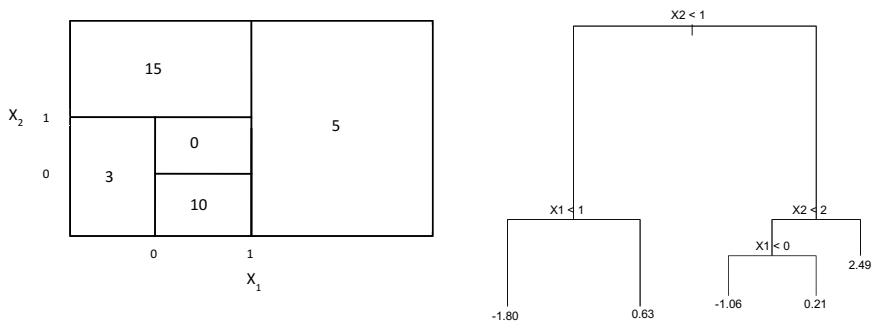  
FIGURE 8.14. Left: A partition of the predictor space corresponding to Exercise 4a. Right: A tree corresponding to Exercise 4b.

(a) Sketch the tree corresponding to the partition of the predictor space illustrated in the left-hand panel of Figure 8.14. The numbers inside the boxes indicate the mean of $Y$ within each region.  
(b) Create a diagram similar to the left-hand panel of Figure 8.14, using the tree illustrated in the right-hand panel of the same figure. You should divide up the predictor space into the correct regions, and indicate the mean for each region.

5. Suppose we produce ten bootstrapped samples from a data set containing red and green classes. We then apply a classification tree to each bootstrapped sample and, for a specific value of X, produce 10 estimates of $P(\text{Class is Red}|X)$ :

$$
0. 1, 0. 1 5, 0. 2, 0. 2, 0. 5 5, 0. 6, 0. 6, 0. 6 5, 0. 7, \text {and} 0. 7 5.
$$

There are two common ways to combine these results together into a single class prediction. One is the majority vote approach discussed in this chapter. The second approach is to classify based on the average probability. In this example, what is the final classification under each of these two approaches?

6. Provide a detailed explanation of the algorithm that is used to fit a regression tree.

# Applied

7. In Section 8.3.3, we applied random forests to the Boston data using max\_features = 6 and using n\_estimators = 100 and n\_estimators = 500. Create a plot displaying the test error resulting from random forests on this data set for a more comprehensive range of values for max\_features and n\_estimators. You can model your plot after Figure 8.10. Describe the results obtained.  
8. In the lab, a classification tree was applied to the Carseats data set after converting Sales into a qualitative response variable. Now we will seek to predict Sales using regression trees and related approaches, treating the response as a quantitative variable.

(a) Split the data set into a training set and a test set.  
(b) Fit a regression tree to the training set. Plot the tree, and interpret the results. What test MSE do you obtain?  
(c) Use cross-validation in order to determine the optimal level of tree complexity. Does pruning the tree improve the test MSE?  
(d) Use the bagging approach in order to analyze this data. What test MSE do you obtain? Use the feature\_importance\_values to determine which variables are most important.  
(e) Use random forests to analyze this data. What test MSE do you obtain? Use the feature\_importance\_ values to determine which variables are most important. Describe the effect of $m$ , the number of variables considered at each split, on the error rate obtained.  
(f) Now analyze the data using BART, and report your results.

9. This problem involves the 0J data set which is part of the ISLP package.

(a) Create a training set containing a random sample of 800 observations, and a test set containing the remaining observations.  
(b) Fit a tree to the training data, with Purchase as the response and the other variables as predictors. What is the training error rate?  
(c) Create a plot of the tree, and interpret the results. How many terminal nodes does the tree have?  
(d) Use the export\_tree() function to produce a text summary of the fitted tree. Pick one of the terminal nodes, and interpret the information displayed.  
(e) Predict the response on the test data, and produce a confusion matrix comparing the test labels to the predicted test labels. What is the test error rate?  
(f) Use cross-validation on the training set in order to determine the optimal tree size.  
(g) Produce a plot with tree size on the $x$ -axis and cross-validated classification error rate on the $y$ -axis.  
(h) Which tree size corresponds to the lowest cross-validated classification error rate?  
(i) Produce a pruned tree corresponding to the optimal tree size obtained using cross-validation. If cross-validation does not lead to selection of a pruned tree, then create a pruned tree with five terminal nodes.  
(j) Compare the training error rates between the pruned and unpruned trees. Which is higher?  
(k) Compare the test error rates between the pruned and unpruned trees. Which is higher?

10. We now use boosting to predict Salary in the Hitters data set.

(a) Remove the observations for whom the salary information is unknown, and then log-transform the salaries.  
(b) Create a training set consisting of the first 200 observations, and a test set consisting of the remaining observations.  
(c) Perform boosting on the training set with 1,000 trees for a range of values of the shrinkage parameter $\lambda$ . Produce a plot with different shrinkage values on the $x$ -axis and the corresponding training set MSE on the $y$ -axis.  
(d) Produce a plot with different shrinkage values on the $x$ -axis and the corresponding test set MSE on the $y$ -axis.  
(e) Compare the test MSE of boosting to the test MSE that results from applying two of the regression approaches seen in Chapters 3 and 6.  
(f) Which variables appear to be the most important predictors in the boosted model?  
(g) Now apply bagging to the training set. What is the test set MSE for this approach?

11. This question uses the Caravan data set.

(a) Create a training set consisting of the first 1,000 observations, and a test set consisting of the remaining observations.  
(b) Fit a boosting model to the training set with Purchase as the response and the other variables as predictors. Use 1,000 trees, and a shrinkage value of 0.01. Which predictors appear to be the most important?  
(c) Use the boosting model to predict the response on the test data. Predict that a person will make a purchase if the estimated probability of purchase is greater than 20%. Form a confusion matrix. What fraction of the people predicted to make a purchase do in fact make one? How does this compare with the results obtained from applying KNN or logistic regression to this data set?

12. Apply boosting, bagging, random forests, and BART to a data set of your choice. Be sure to fit the models on a training set and to evaluate their performance on a test set. How accurate are the results compared to simple methods like linear or logistic regression? Which of these approaches yields the best performance?

