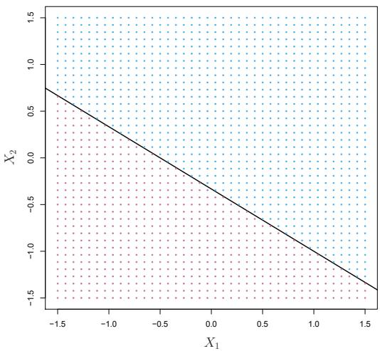
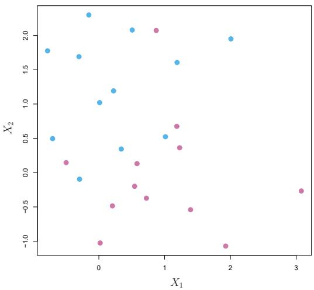
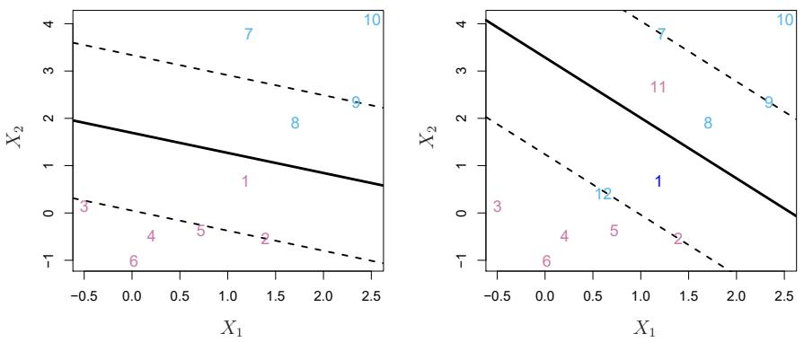
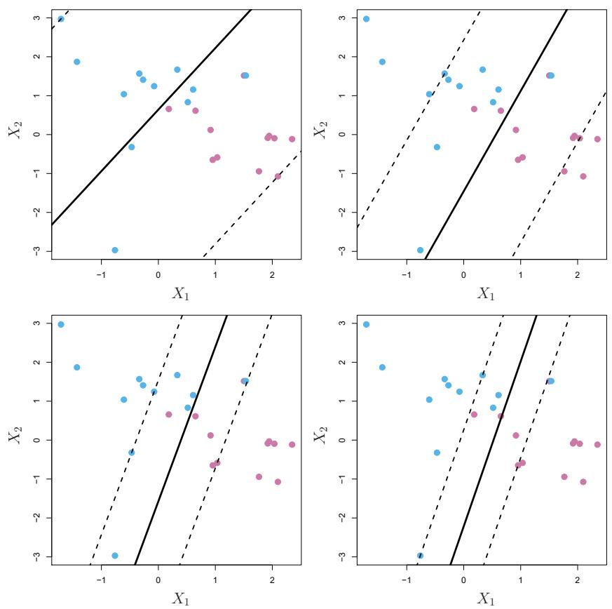
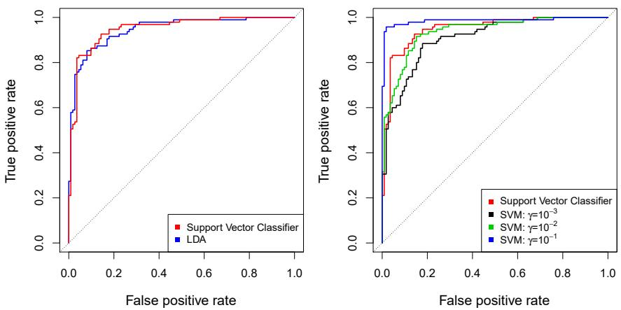
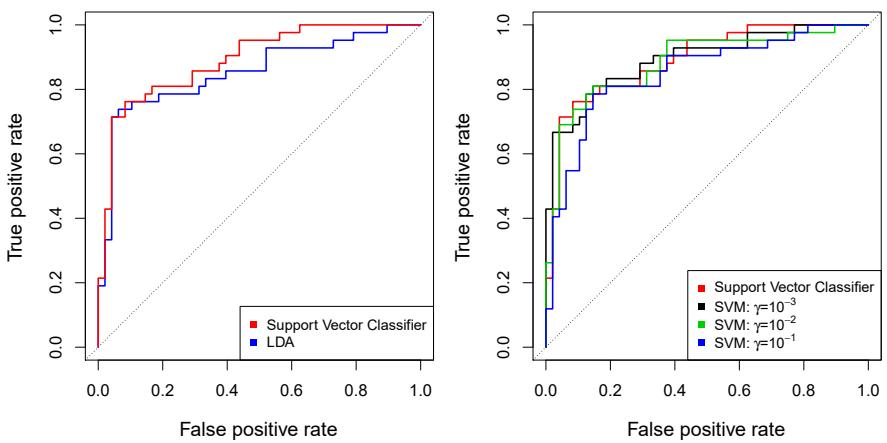

In this chapter, we discuss the support vector machine (SVM), an approach for classification that was developed in the computer science community in the 1990s and that has grown in popularity since then. SVMs have been shown to perform well in a variety of settings, and are often considered one of the best “out of the box” classifiers.

The support vector machine is a generalization of a simple and intuitive classifier called the maximal margin classifier, which we introduce in Section 9.1. Though it is elegant and simple, we will see that this classifier unfortunately cannot be applied to most data sets, since it requires that the classes be separable by a linear boundary. In Section 9.2, we introduce the support vector classifier, an extension of the maximal margin classifier that can be applied in a broader range of cases. Section 9.3 introduces the support vector machine, which is a further extension of the support vector classifier in order to accommodate non-linear class boundaries. Support vector machines are intended for the binary classification setting in which there are two classes; in Section 9.4 we discuss extensions of support vector machines to the case of more than two classes. In Section 9.5 we discuss the close connections between support vector machines and other statistical methods such as logistic regression.

People often loosely refer to the maximal margin classifier, the support vector classifier, and the support vector machine as “support vector machines”. To avoid confusion, we will carefully distinguish between these three notions in this chapter.

# 9.1 Maximal Margin Classifier

In this section, we define a hyperplane and introduce the concept of an optimal separating hyperplane.

# 9.1.1 What Is a Hyperplane?

In a p-dimensional space, a hyperplane is a flat affine subspace of dimension p - 1. $^{1}$ For instance, in two dimensions, a hyperplane is a flat one-dimensional subspace—in other words, a line. In three dimensions, a hyperplane is a flat two-dimensional subspace—that is, a plane. In p > 3 dimensions, it can be hard to visualize a hyperplane, but the notion of a $(p - 1)$ -dimensional flat subspace still applies.

The mathematical definition of a hyperplane is quite simple. In two dimensions, a hyperplane is defined by the equation

$$
\beta_ {0} + \beta_ {1} X _ {1} + \beta_ {2} X _ {2} = 0 \tag {9.1}
$$

for parameters $\beta_{0},\beta_{1}$ , and $\beta_{2}$ . When we say that (9.1) “defines” the hyperplane, we mean that any $X=(X_{1},X_{2})^{T}$ for which (9.1) holds is a point on the hyperplane. Note that (9.1) is simply the equation of a line, since indeed in two dimensions a hyperplane is a line.

Equation 9.1 can be easily extended to the $p$ -dimensional setting:

$$
\beta_ {0} + \beta_ {1} X _ {1} + \beta_ {2} X _ {2} + \dots + \beta_ {p} X _ {p} = 0 \tag {9.2}
$$

defines a $p$ -dimensional hyperplane, again in the sense that if a point $X = (X_{1}, X_{2}, \ldots, X_{p})^{T}$ in $p$ -dimensional space (i.e. a vector of length $p$ ) satisfies (9.2), then $X$ lies on the hyperplane.

Now, suppose that $X$ does not satisfy (9.2); rather,

$$
\beta_ {0} + \beta_ {1} X _ {1} + \beta_ {2} X _ {2} + \dots + \beta_ {p} X _ {p} > 0. \tag {9.3}
$$

Then this tells us that $X$ lies to one side of the hyperplane. On the other hand, if

$$
\beta_ {0} + \beta_ {1} X _ {1} + \beta_ {2} X _ {2} + \dots + \beta_ {p} X _ {p} <   0, \tag {9.4}
$$

then X lies on the other side of the hyperplane. So we can think of the hyperplane as dividing p-dimensional space into two halves. One can easily determine on which side of the hyperplane a point lies by simply calculating the sign of the left-hand side of $(9.2)$ . A hyperplane in two-dimensional space is shown in Figure 9.1.

# 9.1.2 Classification Using a Separating Hyperplane

Now suppose that we have an $n \times p$ data matrix X that consists of n training observations in p-dimensional space,

$$
x _ {1} = \left( \begin{array}{c} x _ {1 1} \\ \vdots \\ x _ {1 p} \end{array} \right), \dots , x _ {n} = \left( \begin{array}{c} x _ {n 1} \\ \vdots \\ x _ {n p} \end{array} \right), \tag {9.5}
$$

and that these observations fall into two classes—that is, $y_{1},\ldots ,y_{n}\in \{-1,1\}$ where $-1$ represents one class and 1 the other class. We also have a



<details>
<summary>scatter</summary>

| Series | X1 (range) | X2 (range) |
| --- | --- | --- |
| Blue | -1.5~1.6 | 0.7~1.5 |
| Red | -1.5~1.6 | -1.5~0.7 |
</details>

FIGURE 9.1. The hyperplane $1 + 2X_{1} + 3X_{2} = 0$ is shown. The blue region is the set of points for which $1 + 2X_{1} + 3X_{2} > 0$ , and the purple region is the set of points for which $1 + 2X_{1} + 3X_{2} < 0$ .

test observation, a p-vector of observed features $x^{*} = \left( x_{1}^{*} \quad \ldots \quad x_{p}^{*} \right)^{T}$ . Our goal is to develop a classifier based on the training data that will correctly classify the test observation using its feature measurements. We have seen a number of approaches for this task, such as linear discriminant analysis and logistic regression in Chapter 4, and classification trees, bagging, and boosting in Chapter 8. We will now see a new approach that is based upon the concept of a separating hyperplane.

Suppose that it is possible to construct a hyperplane that separates the training observations perfectly according to their class labels. Examples of three such separating hyperplanes are shown in the left-hand panel of Figure 9.2. We can label the observations from the blue class as $y_{i}=1$ and those from the purple class as $y_{i}=-1$ . Then a separating hyperplane has the property that

$$
\beta_ {0} + \beta_ {1} x _ {i 1} + \beta_ {2} x _ {i 2} + \dots + \beta_ {p} x _ {i p} > 0 \text {if} y _ {i} = 1, \tag {9.6}
$$

and

$$
\beta_ {0} + \beta_ {1} x _ {i 1} + \beta_ {2} x _ {i 2} + \dots + \beta_ {p} x _ {i p} <   0 \text {if} y _ {i} = - 1. \tag {9.7}
$$

Equivalently, a separating hyperplane has the property that

$$
y _ {i} (\beta_ {0} + \beta_ {1} x _ {i 1} + \beta_ {2} x _ {i 2} + \dots + \beta_ {p} x _ {i p}) > 0 \tag {9.8}
$$

for all $i = 1,\dots ,n$

If a separating hyperplane exists, we can use it to construct a very natural classifier: a test observation is assigned a class depending on which side of the hyperplane it is located. The right-hand panel of Figure 9.2 shows an example of such a classifier. That is, we classify the test observation $x^{*}$ based on the sign of $f(x^{*}) = \beta_{0} + \beta_{1}x_{1}^{*} + \beta_{2}x_{2}^{*} + \cdots + \beta_{p}x_{p}^{*}$ . If $f(x^{*})$ is positive, then we assign the test observation to class 1, and if $f(x^{*})$ is negative, then we assign it to class -1. We can also make use of the magnitude of $f(x^{*})$ . If

  
FIGURE 9.2. Left: There are two classes of observations, shown in blue and in purple, each of which has measurements on two variables. Three separating hyperplanes, out of many possible, are shown in black. Right: A separating hyperplane is shown in black. The blue and purple grid indicates the decision rule made by a classifier based on this separating hyperplane: a test observation that falls in the blue portion of the grid will be assigned to the blue class, and a test observation that falls into the purple portion of the grid will be assigned to the purple class.

$f(x^{*})$ is far from zero, then this means that $x^{*}$ lies far from the hyperplane, and so we can be confident about our class assignment for $x^{*}$ . On the other hand, if $f(x^{*})$ is close to zero, then $x^{*}$ is located near the hyperplane, and so we are less certain about the class assignment for $x^{*}$ . Not surprisingly, and as we see in Figure 9.2, a classifier that is based on a separating hyperplane leads to a linear decision boundary.

# 9.1.3 The Maximal Margin Classifier

In general, if our data can be perfectly separated using a hyperplane, then there will in fact exist an infinite number of such hyperplanes. This is because a given separating hyperplane can usually be shifted a tiny bit up or down, or rotated, without coming into contact with any of the observations. Three possible separating hyperplanes are shown in the left-hand panel of Figure 9.2. In order to construct a classifier based upon a separating hyperplane, we must have a reasonable way to decide which of the infinite possible separating hyperplanes to use.

A natural choice is the maximal margin hyperplane (also known as the optimal separating hyperplane), which is the separating hyperplane that is farthest from the training observations. That is, we can compute the (perpendicular) distance from each training observation to a given separating hyperplane; the smallest such distance is the minimal distance from the observations to the hyperplane, and is known as the margin. The maximal margin hyperplane is the separating hyperplane for which the margin is largest—that is, it is the hyperplane that has the farthest minimum distance to the training observations. We can then classify a test observation based on which side of the maximal margin hyperplane it lies. This is known

maximal
margin
hyperplane
optimal
separating
hyperplane
margin


<details>
<summary>scatter</summary>

| Series | X1 (range) | X2 (range) |
| --- | --- | --- |
| Blue | -1.5~1.5 | -1.5~3.5 |
| Pink | 0.5~3.5 | -1.5~0.7 |
</details>

FIGURE 9.3. There are two classes of observations, shown in blue and in purple. The maximal margin hyperplane is shown as a solid line. The margin is the distance from the solid line to either of the dashed lines. The two blue points and the purple point that lie on the dashed lines are the support vectors, and the distance from those points to the hyperplane is indicated by arrows. The purple and blue grid indicates the decision rule made by a classifier based on this separating hyperplane.

as the maximal margin classifier. We hope that a classifier that has a large margin on the training data will also have a large margin on the test data, and hence will classify the test observations correctly. Although the maximal margin classifier is often successful, it can also lead to overfitting when p is large.

If $\beta_{0},\beta_{1},\ldots,\beta_{p}$ are the coefficients of the maximal margin hyperplane, then the maximal margin classifier classifies the test observation $x^{*}$ based on the sign of $f(x^{*})=\beta_{0}+\beta_{1}x_{1}^{*}+\beta_{2}x_{2}^{*}+\cdots+\beta_{p}x_{p}^{*}$ .

Figure 9.3 shows the maximal margin hyperplane on the data set of Figure 9.2. Comparing the right-hand panel of Figure 9.2 to Figure 9.3, we see that the maximal margin hyperplane shown in Figure 9.3 does indeed result in a greater minimal distance between the observations and the separating hyperplane—that is, a larger margin. In a sense, the maximal margin hyperplane represents the mid-line of the widest “slab” that we can insert between the two classes.

Examining Figure 9.3, we see that three training observations are equidistant from the maximal margin hyperplane and lie along the dashed lines indicating the width of the margin. These three observations are known as support vectors, since they are vectors in p-dimensional space (in Figure 9.3, p = 2) and they “support” the maximal margin hyperplane in the sense that if these points were moved slightly then the maximal margin hyperplane would move as well. Interestingly, the maximal margin hyperplane depends directly on the support vectors, but not on the other observations: a movement to any of the other observations would not affect the separating hyperplane, provided that the observation’s movement does not cause it to

cross the boundary set by the margin. The fact that the maximal margin hyperplane depends directly on only a small subset of the observations is an important property that will arise later in this chapter when we discuss the support vector classifier and support vector machines.

# 9.1.4 Construction of the Maximal Margin Classifier

We now consider the task of constructing the maximal margin hyperplane based on a set of n training observations $x_{1},\ldots,x_{n}\in R^{p}$ and associated class labels $y_{1},\ldots,y_{n}\in\{-1,1\}$ . Briefly, the maximal margin hyperplane is the solution to the optimization problem

$$
\underset {\beta_ {0}, \beta_ {1}, \dots , \beta_ {p}, M} {\text {maximize}} M \tag {9.9}
$$

$$
\text {subject to} \sum_ {j = 1} ^ {p} \beta_ {j} ^ {2} = 1, \tag {9.10}
$$

$$
y _ {i} (\beta_ {0} + \beta_ {1} x _ {i 1} + \beta_ {2} x _ {i 2} + \dots + \beta_ {p} x _ {i p}) \geq M \forall i = 1, \dots , n. \tag {9.11}
$$

This optimization problem (9.9)-(9.11) is actually simpler than it looks. First of all, the constraint in (9.11) that

$$
y _ {i} (\beta_ {0} + \beta_ {1} x _ {i 1} + \beta_ {2} x _ {i 2} + \dots + \beta_ {p} x _ {i p}) \geq M \forall i = 1, \dots , n
$$

guarantees that each observation will be on the correct side of the hyperplane, provided that M is positive. (Actually, for each observation to be on the correct side of the hyperplane we would simply need $y_{i}(\beta_{0} + \beta_{1}x_{i1} + \beta_{2}x_{i2} + \cdots + \beta_{p}x_{ip}) > 0$ , so the constraint in (9.11) in fact requires that each observation be on the correct side of the hyperplane, with some cushion, provided that M is positive.)

Second, note that (9.10) is not really a constraint on the hyperplane, since if $\beta_{0} + \beta_{1}x_{i1} + \beta_{2}x_{i2} + \cdots + \beta_{p}x_{ip} = 0$ defines a hyperplane, then so does $k(\beta_{0} + \beta_{1}x_{i1} + \beta_{2}x_{i2} + \cdots + \beta_{p}x_{ip}) = 0$ for any $k \neq 0$ . However, (9.10) adds meaning to (9.11); one can show that with this constraint the perpendicular distance from the ith observation to the hyperplane is given by

$$
y _ {i} (\beta_ {0} + \beta_ {1} x _ {i 1} + \beta_ {2} x _ {i 2} + \dots + \beta_ {p} x _ {i p}).
$$

Therefore, the constraints (9.10) and (9.11) ensure that each observation is on the correct side of the hyperplane and at least a distance $M$ from the hyperplane. Hence, $M$ represents the margin of our hyperplane, and the optimization problem chooses $\beta_0, \beta_1, \ldots, \beta_p$ to maximize $M$ . This is exactly the definition of the maximal margin hyperplane! The problem (9.9)-(9.11) can be solved efficiently, but details of this optimization are outside of the scope of this book.

# 9.1.5 The Non-separable Case

The maximal margin classifier is a very natural way to perform classification, if a separating hyperplane exists. However, as we have hinted, in many cases no separating hyperplane exists, and so there is no maximal



<details>
<summary>scatter</summary>

| Series | X1 | X2 |
| --- | --- | --- |
| Blue | ~-0.8 | ~1.8 |
| Blue | ~-0.7 | ~0.5 |
| Blue | ~-0.3 | ~1.7 |
| Blue | ~-0.2 | ~-0.1 |
| Blue | ~-0.1 | ~2.3 |
| Blue | ~0.0 | ~1.0 |
| Blue | ~0.2 | ~1.2 |
| Blue | ~0.3 | ~0.35 |
| Blue | ~0.5 | ~2.1 |
| Blue | ~1.0 | ~0.5 |
| Blue | ~1.1 | ~1.6 |
| Blue | ~2.0 | ~2.0 |
| Pink | ~-0.6 | ~0.15 |
| Pink | ~0.0 | ~-1.0 |
| Pink | ~0.2 | ~-0.5 |
| Pink | ~0.5 | ~0.15 |
| Pink | ~0.6 | ~-0.2 |
| Pink | ~0.7 | ~-0.4 |
| Pink | ~0.9 | ~2.1 |
| Pink | ~1.1 | ~0.65 |
| Pink | ~1.2 | ~0.35 |
| Pink | ~1.3 | ~-0.5 |
| Pink | ~1.9 | ~-1.1 |
| Pink | ~3.1 | ~-0.3 |
</details>

FIGURE 9.4. There are two classes of observations, shown in blue and in purple. In this case, the two classes are not separable by a hyperplane, and so the maximal margin classifier cannot be used.

margin classifier. In this case, the optimization problem (9.9)-(9.11) has no solution with $M > 0$ . An example is shown in Figure 9.4. In this case, we cannot exactly separate the two classes. However, as we will see in the next section, we can extend the concept of a separating hyperplane in order to develop a hyperplane that almost separates the classes, using a so-called soft margin. The generalization of the maximal margin classifier to the non-separable case is known as the support vector classifier.

# 9.2 Support Vector Classifiers

# 9.2.1 Overview of the Support Vector Classifier

In Figure 9.4, we see that observations that belong to two classes are not necessarily separable by a hyperplane. In fact, even if a separating hyperplane does exist, then there are instances in which a classifier based on a separating hyperplane might not be desirable. A classifier based on a separating hyperplane will necessarily perfectly classify all of the training observations; this can lead to sensitivity to individual observations. An example is shown in Figure 9.5. The addition of a single observation in the right-hand panel of Figure 9.5 leads to a dramatic change in the maximal margin hyperplane. The resulting maximal margin hyperplane is not satisfactory—for one thing, it has only a tiny margin. This is problematic because as discussed previously, the distance of an observation from the hyperplane can be seen as a measure of our confidence that the observation was correctly classified. Moreover, the fact that the maximal margin hyperplane is extremely sensitive to a change in a single observation suggests that it may have overfit the training data.

In this case, we might be willing to consider a classifier based on a hyperplane that does not perfectly separate the two classes, in the interest of

  
FIGURE 9.5. Left: Two classes of observations are shown in blue and in purple, along with the maximal margin hyperplane. Right: An additional blue observation has been added, leading to a dramatic shift in the maximal margin hyperplane shown as a solid line. The dashed line indicates the maximal margin hyperplane that was obtained in the absence of this additional point.

- Greater robustness to individual observations, and  
- Better classification of most of the training observations.

That is, it could be worthwhile to misclassify a few training observations in order to do a better job in classifying the remaining observations.

The support vector classifier, sometimes called a soft margin classifier, does exactly this. Rather than seeking the largest possible margin so that every observation is not only on the correct side of the hyperplane but also on the correct side of the margin, we instead allow some observations to be on the incorrect side of the margin, or even the incorrect side of the hyperplane. (The margin is soft because it can be violated by some of the training observations.) An example is shown in the left-hand panel of Figure 9.6. Most of the observations are on the correct side of the margin. However, a small subset of the observations are on the wrong side of the margin.

An observation can be not only on the wrong side of the margin, but also on the wrong side of the hyperplane. In fact, when there is no separating hyperplane, such a situation is inevitable. Observations on the wrong side of the hyperplane correspond to training observations that are misclassified by the support vector classifier. The right-hand panel of Figure 9.6 illustrates such a scenario.

# 9.2.2 Details of the Support Vector Classifier

The support vector classifier classifies a test observation depending on which side of a hyperplane it lies. The hyperplane is chosen to correctly separate most of the training observations into the two classes, but may

support
vector
classifier
soft margin
classifier

  
FIGURE 9.6. Left: A support vector classifier was fit to a small data set. The hyperplane is shown as a solid line and the margins are shown as dashed lines. Purple observations: Observations 3, 4, 5, and 6 are on the correct side of the margin, observation 2 is on the margin, and observation 1 is on the wrong side of the margin. Blue observations: Observations 7 and 10 are on the correct side of the margin, observation 9 is on the margin, and observation 8 is on the wrong side of the margin. No observations are on the wrong side of the hyperplane. Right: Same as left panel with two additional points, 11 and 12. These two observations are on the wrong side of the hyperplane and the wrong side of the margin.

misclassify a few observations. It is the solution to the optimization problem

$$
\underset {\beta_ {0}, \beta_ {1}, \dots , \beta_ {p}, \epsilon_ {1}, \dots , \epsilon_ {n}, M} {\text {maximize}} M \tag {9.12}
$$

$$
\text {subject to} \quad \sum_ {j = 1} ^ {p} \beta_ {j} ^ {2} = 1, \tag {9.13}
$$

$$
y _ {i} (\beta_ {0} + \beta_ {1} x _ {i 1} + \beta_ {2} x _ {i 2} + \dots + \beta_ {p} x _ {i p}) \geq M (1 - \epsilon_ {i}), \tag {9.14}
$$

$$
\epsilon_ {i} \geq 0, \sum_ {i = 1} ^ {n} \epsilon_ {i} \leq C, \tag {9.15}
$$

where C is a nonnegative tuning parameter. As in (9.11), M is the width of the margin; we seek to make this quantity as large as possible. In (9.14), $\epsilon_{1},\ldots,\epsilon_{n}$ are slack variables that allow individual observations to be on the wrong side of the margin or the hyperplane; we will explain them in greater detail momentarily. Once we have solved (9.12)–(9.15), we classify a test observation $x^{*}$ as before, by simply determining on which side of the hyperplane it lies. That is, we classify the test observation based on the sign of $f(x^{*})=\beta_{0}+\beta_{1}x_{1}^{*}+\cdots+\beta_{p}x_{p}^{*}$ .

The problem (9.12)-(9.15) seems complex, but insight into its behavior can be made through a series of simple observations presented below. First of all, the slack variable $\epsilon_{i}$ tells us where the $i$ th observation is located, relative to the hyperplane and relative to the margin. If $\epsilon_{i} = 0$ then the $i$ th observation is on the correct side of the margin, as we saw in Section 9.1.4. If $\epsilon_{i} > 0$ then the $i$ th observation is on the wrong side of the margin, and we say that the $i$ th observation has $violated$ the margin. If $\epsilon_{i} > 1$ then it is on the wrong side of the hyperplane.

We now consider the role of the tuning parameter C. In (9.15), C bounds the sum of the $\epsilon_{i}$ 's, and so it determines the number and severity of the violations to the margin (and to the hyperplane) that we will tolerate. We can think of C as a budget for the amount that the margin can be violated by the n observations. If C = 0 then there is no budget for violations to the margin, and it must be the case that $\epsilon_{1} = \cdots = \epsilon_{n} = 0$ , in which case (9.12)–(9.15) simply amounts to the maximal margin hyperplane optimization problem (9.9)–(9.11). (Of course, a maximal margin hyperplane exists only if the two classes are separable.) For C > 0 no more than C observations can be on the wrong side of the hyperplane, because if an observation is on the wrong side of the hyperplane then $\epsilon_{i} > 1$ , and (9.15) requires that $\sum_{i=1}^{n} \epsilon_{i} \leq C$ . As the budget C increases, we become more tolerant of violations to the margin, and so the margin will widen. Conversely, as C decreases, we become less tolerant of violations to the margin and so the margin narrows. An example is shown in Figure 9.7.

In practice, C is treated as a tuning parameter that is generally chosen via cross-validation. As with the tuning parameters that we have seen throughout this book, C controls the bias-variance trade-off of the statistical learning technique. When C is small, we seek narrow margins that are rarely violated; this amounts to a classifier that is highly fit to the data, which may have low bias but high variance. On the other hand, when C is larger, the margin is wider and we allow more violations to it; this amounts to fitting the data less hard and obtaining a classifier that is potentially more biased but may have lower variance.

The optimization problem (9.12)-(9.15) has a very interesting property: it turns out that only observations that either lie on the margin or that violate the margin will affect the hyperplane, and hence the classifier obtained. In other words, an observation that lies strictly on the correct side of the margin does not affect the support vector classifier! Changing the position of that observation would not change the classifier at all, provided that its position remains on the correct side of the margin. Observations that lie directly on the margin, or on the wrong side of the margin for their class, are known as support vectors. These observations do affect the support vector classifier.

The fact that only support vectors affect the classifier is in line with our previous assertion that C controls the bias-variance trade-off of the support vector classifier. When the tuning parameter C is large, then the margin is wide, many observations violate the margin, and so there are many support vectors. In this case, many observations are involved in determining the hyperplane. The top left panel in Figure 9.7 illustrates this setting: this classifier has low variance (since many observations are support vectors) but potentially high bias. In contrast, if C is small, then there will be fewer support vectors and hence the resulting classifier will have low bias but high variance. The bottom right panel in Figure 9.7 illustrates this setting, with only eight support vectors.

The fact that the support vector classifier's decision rule is based only on a potentially small subset of the training observations (the support vectors) means that it is quite robust to the behavior of observations that are far away from the hyperplane. This property is distinct from some of

  
FIGURE 9.7. A support vector classifier was fit using four different values of the tuning parameter C in (9.12)-(9.15). The largest value of C was used in the top left panel, and smaller values were used in the top right, bottom left, and bottom right panels. When C is large, then there is a high tolerance for observations being on the wrong side of the margin, and so the margin will be large. As C decreases, the tolerance for observations being on the wrong side of the margin decreases, and the margin narrows.

the other classification methods that we have seen in preceding chapters, such as linear discriminant analysis. Recall that the LDA classification rule depends on the mean of all of the observations within each class, as well as the within-class covariance matrix computed using all of the observations. In contrast, logistic regression, unlike LDA, has very low sensitivity to observations far from the decision boundary. In fact we will see in Section 9.5 that the support vector classifier and logistic regression are closely related.

# 9.3 Support Vector Machines

We first discuss a general mechanism for converting a linear classifier into one that produces non-linear decision boundaries. We then introduce the support vector machine, which does this in an automatic way.
  
FIGURE 9.8. Left: The observations fall into two classes, with a non-linear boundary between them. Right: The support vector classifier seeks a linear boundary, and consequently performs very poorly.

# 9.3.1 Classification with Non-Linear Decision Boundaries

The support vector classifier is a natural approach for classification in the two-class setting, if the boundary between the two classes is linear. However, in practice we are sometimes faced with non-linear class boundaries. For instance, consider the data in the left-hand panel of Figure 9.8. It is clear that a support vector classifier or any linear classifier will perform poorly here. Indeed, the support vector classifier shown in the right-hand panel of Figure 9.8 is useless here.

In Chapter 7, we are faced with an analogous situation. We see there that the performance of linear regression can suffer when there is a nonlinear relationship between the predictors and the outcome. In that case, we consider enlarging the feature space using functions of the predictors, such as quadratic and cubic terms, in order to address this non-linearity. In the case of the support vector classifier, we could address the problem of possibly non-linear boundaries between classes in a similar way, by enlarging the feature space using quadratic, cubic, and even higher-order polynomial functions of the predictors. For instance, rather than fitting a support vector classifier using p features

$$
X _ {1}, X _ {2}, \ldots , X _ {p},
$$

we could instead fit a support vector classifier using 2p features

$$
X _ {1}, X _ {1} ^ {2}, X _ {2}, X _ {2} ^ {2}, \ldots , X _ {p}, X _ {p} ^ {2}.
$$

Then (9.12)-(9.15) would become

$$
\underset {\beta_ {0}, \beta_ {1 1}, \beta_ {1 2}, \dots , \beta_ {p 1}, \beta_ {p 2}, \epsilon_ {1}, \dots , \epsilon_ {n}, M} {\text {maximize}} M \tag {9.16}
$$

$$
\text {subject to} y _ {i} \left(\beta_ {0} + \sum_ {j = 1} ^ {p} \beta_ {j 1} x _ {i j} + \sum_ {j = 1} ^ {p} \beta_ {j 2} x _ {i j} ^ {2}\right) \geq M (1 - \epsilon_ {i}),
$$

$$
\sum_ {i = 1} ^ {n} \epsilon_ {i} \leq C, \epsilon_ {i} \geq 0, \sum_ {j = 1} ^ {p} \sum_ {k = 1} ^ {2} \beta_ {j k} ^ {2} = 1.
$$

Why does this lead to a non-linear decision boundary? In the enlarged feature space, the decision boundary that results from $(9.16)$ is in fact linear. But in the original feature space, the decision boundary is of the form $q(x) = 0$ , where q is a quadratic polynomial, and its solutions are generally non-linear. One might additionally want to enlarge the feature space with higher-order polynomial terms, or with interaction terms of the form $X_{j}X_{j'}$ for $j \neq j'$ . Alternatively, other functions of the predictors could be considered rather than polynomials. It is not hard to see that there are many possible ways to enlarge the feature space, and that unless we are careful, we could end up with a huge number of features. Then computations would become unmanageable. The support vector machine, which we present next, allows us to enlarge the feature space used by the support vector classifier in a way that leads to efficient computations.

# 9.3.2 The Support Vector Machine

The support vector machine (SVM) is an extension of the support vector classifier that results from enlarging the feature space in a specific way, using kernels. We will now discuss this extension, the details of which are somewhat complex and beyond the scope of this book. However, the main idea is described in Section 9.3.1: we may want to enlarge our feature space in order to accommodate a non-linear boundary between the classes. The kernel approach that we describe here is simply an efficient computational approach for enacting this idea.

We have not discussed exactly how the support vector classifier is computed because the details become somewhat technical. However, it turns out that the solution to the support vector classifier problem (9.12)-(9.15) involves only the inner products of the observations (as opposed to the observations themselves). The inner product of two $r$ -vectors $a$ and $b$ is defined as $\langle a, b \rangle = \sum_{i=1}^{r} a_i b_i$ . Thus the inner product of two observations $x_i$ , $x_{i'}$ is given by

$$
\langle x _ {i}, x _ {i ^ {\prime}} \rangle = \sum_ {j = 1} ^ {p} x _ {i j} x _ {i ^ {\prime} j}. \tag {9.17}
$$

It can be shown that

\- The linear support vector classifier can be represented as

$$
f (x) = \beta_ {0} + \sum_ {i = 1} ^ {n} \alpha_ {i} \langle x, x _ {i} \rangle , \tag {9.18}
$$

where there are n parameters $\alpha_{i}$ , $i = 1, \ldots, n$ , one per training observation.

\- To estimate the parameters $\alpha_{1},\ldots ,\alpha_{n}$ and $\beta_0$ , all we need are the $\binom{n}{2}$ inner products $\langle x_i,x_{i'}\rangle$ between all pairs of training observations. (The notation $\binom{n}{2}$ means $n(n - 1) / 2$ , and gives the number of pairs among a set of $n$ items.)

Notice that in (9.18), in order to evaluate the function $f(x)$ , we need to compute the inner product between the new point x and each of the training points $x_{i}$ . However, it turns out that $\alpha_{i}$ is nonzero only for the support vectors in the solution—that is, if a training observation is not a support vector, then its $\alpha_{i}$ equals zero. So if S is the collection of indices of these support points, we can rewrite any solution function of the form (9.18) as

$$
f (x) = \beta_ {0} + \sum_ {i \in \mathcal {S}} \alpha_ {i} \langle x, x _ {i} \rangle , \tag {9.19}
$$

which typically involves far fewer terms than in (9.18). $^{2}$

To summarize, in representing the linear classifier $f(x)$ , and in computing its coefficients, all we need are inner products.

Now suppose that every time the inner product (9.17) appears in the representation (9.18), or in a calculation of the solution for the support vector classifier, we replace it with a generalization of the inner product of the form

$$
K (x _ {i}, x _ {i ^ {\prime}}), \tag {9.20}
$$

where K is some function that we will refer to as a kernel. A kernel is a function that quantifies the similarity of two observations. For instance, we could simply take

$$
K (x _ {i}, x _ {i ^ {\prime}}) = \sum_ {j = 1} ^ {p} x _ {i j} x _ {i ^ {\prime} j}, \tag {9.21}
$$

which would just give us back the support vector classifier. Equation 9.21 is known as a linear kernel because the support vector classifier is linear in the features; the linear kernel essentially quantifies the similarity of a pair of observations using Pearson (standard) correlation. But one could instead choose another form for (9.20). For instance, one could replace every instance of $\sum_{j=1}^{p} x_{ij} x_{i'j}$ with the quantity

$$
K (x _ {i}, x _ {i ^ {\prime}}) = (1 + \sum_ {j = 1} ^ {p} x _ {i j} x _ {i ^ {\prime} j}) ^ {d}. \tag {9.22}
$$

This is known as a polynomial kernel of degree $d$ , where $d$ is a positive integer. Using such a kernel with $d > 1$ , instead of the standard linear kernel (9.21), in the support vector classifier algorithm leads to a much more flexible decision boundary. It essentially amounts to fitting a support vector

  
FIGURE 9.9. Left: An SVM with a polynomial kernel of degree 3 is applied to the non-linear data from Figure 9.8, resulting in a far more appropriate decision rule. Right: An SVM with a radial kernel is applied. In this example, either kernel is capable of capturing the decision boundary.

classifier in a higher-dimensional space involving polynomials of degree d, rather than in the original feature space. When the support vector classifier is combined with a non-linear kernel such as $(9.22)$ , the resulting classifier is known as a support vector machine. Note that in this case the (non-linear) function has the form

$$
f (x) = \beta_ {0} + \sum_ {i \in \mathcal {S}} \alpha_ {i} K (x, x _ {i}). \tag {9.23}
$$

The left-hand panel of Figure 9.9 shows an example of an SVM with a polynomial kernel applied to the non-linear data from Figure 9.8. The fit is a substantial improvement over the linear support vector classifier. When d = 1, then the SVM reduces to the support vector classifier seen earlier in this chapter.

The polynomial kernel shown in $(9.22)$ is one example of a possible non-linear kernel, but alternatives abound. Another popular choice is the radial kernel, which takes the form

radial kernel

$$
K (x _ {i}, x _ {i ^ {\prime}}) = \exp (- \gamma \sum_ {j = 1} ^ {p} (x _ {i j} - x _ {i ^ {\prime} j}) ^ {2}). \tag {9.24}
$$

In (9.24), $\gamma$ is a positive constant. The right-hand panel of Figure 9.9 shows an example of an SVM with a radial kernel on this non-linear data; it also does a good job in separating the two classes.

How does the radial kernel (9.24) actually work? If a given test observation $x^{*} = (x_{1}^{*},\dots,x_{p}^{*})^{T}$ is far from a training observation $x_{i}$ in terms of Euclidean distance, then $\sum_{j = 1}^{p}(x_{j}^{*} - x_{ij})^{2}$ will be large, and so $K(x^{*},x_{i}) = \exp (-\gamma \sum_{j = 1}^{p}(x_{j}^{*} - x_{ij})^{2})$ will be tiny. This means that in (9.23), $x_{i}$ will play virtually no role in $f(x^{*})$ . Recall that the predicted class label for the test observation $x^{*}$ is based on the sign of $f(x^{*})$ . In other words, training observations that are far from $x^{*}$ will play essentially no role in the predicted class label for $x^{*}$ . This means that the radial kernel has very local

  
FIGURE 9.10. ROC curves for the Heart data training set. Left: The support vector classifier and LDA are compared. Right: The support vector classifier is compared to an SVM using a radial basis kernel with $\gamma = 10^{-3}$ , $10^{-2}$ , and $10^{-1}$ .

behavior, in the sense that only nearby training observations have an effect on the class label of a test observation.

What is the advantage of using a kernel rather than simply enlarging the feature space using functions of the original features, as in (9.16)? One advantage is computational, and it amounts to the fact that using kernels, one need only compute $K(x_{i}, x_{i}^{\prime})$ for all $\binom{n}{2}$ distinct pairs $i$ , $i^{\prime}$ . This can be done without explicitly working in the enlarged feature space. This is important because in many applications of SVMs, the enlarged feature space is so large that computations are intractable. For some kernels, such as the radial kernel (9.24), the feature space is implicit and infinite-dimensional, so we could never do the computations there anyway!

# 9.3.3 An Application to the Heart Disease Data

In Chapter 8 we apply decision trees and related methods to the Heart data. The aim is to use 13 predictors such as Age, Sex, and Chol in order to predict whether an individual has heart disease. We now investigate how an SVM compares to LDA on this data. After removing 6 missing observations, the data consist of 297 subjects, which we randomly split into 207 training and 90 test observations.

We first fit LDA and the support vector classifier to the training data. Note that the support vector classifier is equivalent to an SVM using a polynomial kernel of degree d = 1. The left-hand panel of Figure 9.10 displays ROC curves (described in Section 4.4.2) for the training set predictions for both LDA and the support vector classifier. Both classifiers compute scores of the form $\hat{f}(X) = \hat{\beta}_{0} + \hat{\beta}_{1}X_{1} + \hat{\beta}_{2}X_{2} + \cdots + \hat{\beta}_{p}X_{p}$ for each observation. For any given cutoff t, we classify observations into the heart disease or no heart disease categories depending on whether $\hat{f}(X) < t$ or $\hat{f}(X) \geq t$ . The ROC curve is obtained by forming these predictions and computing the false positive and true positive rates for a range of values of t. An optimal classifier will hug the top left corner of the ROC plot. In this instance

  
FIGURE 9.11. ROC curves for the test set of the Heart data. Left: The support vector classifier and LDA are compared. Right: The support vector classifier is compared to an SVM using a radial basis kernel with $\gamma = 10^{-3}$ , $10^{-2}$ , and $10^{-1}$ .

LDA and the support vector classifier both perform well, though there is a suggestion that the support vector classifier may be slightly superior.

The right-hand panel of Figure 9.10 displays ROC curves for SVMs using a radial kernel, with various values of $\gamma$ . As $\gamma$ increases and the fit becomes more non-linear, the ROC curves improve. Using $\gamma = 10^{-1}$ appears to give an almost perfect ROC curve. However, these curves represent training error rates, which can be misleading in terms of performance on new test data. Figure 9.11 displays ROC curves computed on the 90 test observations. We observe some differences from the training ROC curves. In the left-hand panel of Figure 9.11, the support vector classifier appears to have a small advantage over LDA (although these differences are not statistically significant). In the right-hand panel, the SVM using $\gamma = 10^{-1}$ , which showed the best results on the training data, produces the worst estimates on the test data. This is once again evidence that while a more flexible method will often produce lower training error rates, this does not necessarily lead to improved performance on test data. The SVMs with $\gamma = 10^{-2}$ and $\gamma = 10^{-3}$ perform comparably to the support vector classifier, and all three outperform the SVM with $\gamma = 10^{-1}$ .

# 9.4 SVMs with More than Two Classes

So far, our discussion has been limited to the case of binary classification: that is, classification in the two-class setting. How can we extend SVMs to the more general case where we have some arbitrary number of classes? It turns out that the concept of separating hyperplanes upon which SVMs are based does not lend itself naturally to more than two classes. Though a number of proposals for extending SVMs to the K-class case have been made, the two most popular are the one-versus-one and one-versus-all approaches. We briefly discuss those two approaches here.

# 9.4.1 One-Versus-One Classification

Suppose that we would like to perform classification using SVMs, and there are K > 2 classes. A one-versus-one or all-pairs approach constructs $\binom{K}{2}$ SVMs, each of which compares a pair of classes. For example, one such SVM might compare the kth class, coded as +1, to the $k'$ th class, coded as -1. We classify a test observation using each of the $\binom{K}{2}$ classifiers, and we tally the number of times that the test observation is assigned to each of the K classes. The final classification is performed by assigning the test observation to the class to which it was most frequently assigned in these $\binom{K}{2}$ pairwise classifications.

one-versus-one

# 9.4.2 One-Versus-All Classification

The one-versus-all approach (also referred to as one-versus-rest) is an alternative procedure for applying SVMs in the case of K > 2 classes. We fit K SVMs, each time comparing one of the K classes to the remaining K - 1 classes. Let $\beta_{0k}, \beta_{1k}, \ldots, \beta_{pk}$ denote the parameters that result from fitting an SVM comparing the kth class (coded as +1) to the others (coded as -1). Let $x^{*}$ denote a test observation. We assign the observation to the class for which $\beta_{0k} + \beta_{1k}x_{1}^{*} + \beta_{2k}x_{2}^{*} + \cdots + \beta_{pk}x_{p}^{*}$ is largest, as this amounts to a high level of confidence that the test observation belongs to the kth class rather than to any of the other classes.

one-versus-all
one-versus-rest

# 9.5 Relationship to Logistic Regression

When SVMs were first introduced in the mid-1990s, they made quite a splash in the statistical and machine learning communities. This was due in part to their good performance, good marketing, and also to the fact that the underlying approach seemed both novel and mysterious. The idea of finding a hyperplane that separates the data as well as possible, while allowing some violations to this separation, seemed distinctly different from classical approaches for classification, such as logistic regression and linear discriminant analysis. Moreover, the idea of using a kernel to expand the feature space in order to accommodate non-linear class boundaries appeared to be a unique and valuable characteristic.

However, since that time, deep connections between SVMs and other more classical statistical methods have emerged. It turns out that one can rewrite the criterion (9.12)-(9.15) for fitting the support vector classifier $f(X) = \beta_0 + \beta_1 X_1 + \dots + \beta_p X_p$ as

$$
\text {minimize} _ {\beta_ {0}, \beta_ {1}, \dots , \beta_ {p}} \left\{\sum_ {i = 1} ^ {n} \max \left[ 0, 1 - y _ {i} f (x _ {i}) \right] + \lambda \sum_ {j = 1} ^ {p} \beta_ {j} ^ {2} \right\}, \tag {9.25}
$$

where $\lambda$ is a nonnegative tuning parameter. When $\lambda$ is large then $\beta_{1},\ldots,\beta_{p}$ are small, more violations to the margin are tolerated, and a low-variance but high-bias classifier will result. When $\lambda$ is small then few violations to the margin will occur; this amounts to a high-variance but low-bias


classifier. Thus, a small value of $\lambda$ in (9.25) amounts to a small value of C in (9.15). Note that the $\lambda\sum_{j=1}^{p}\beta_{j}^{2}$ term in (9.25) is the ridge penalty term from Section 6.2.1, and plays a similar role in controlling the bias-variance trade-off for the support vector classifier.

Now (9.25) takes the “Loss + Penalty” form that we have seen repeatedly throughout this book:

$$
\underset {\beta_ {0}, \beta_ {1}, \dots , \beta_ {p}} {\text {minimize}} \left\{L (\mathbf {X}, \mathbf {y}, \beta) + \lambda P (\beta) \right\}. \tag {9.26}
$$

In (9.26), $L(\mathbf{X}, \mathbf{y}, \beta)$ is some loss function quantifying the extent to which the model, parametrized by $\beta$ , fits the data $(\mathbf{X}, \mathbf{y})$ , and $P(\beta)$ is a penalty function on the parameter vector $\beta$ whose effect is controlled by a nonnegative tuning parameter $\lambda$ . For instance, ridge regression and the lasso both take this form with

$$
L (\mathbf {X}, \mathbf {y}, \beta) = \sum_ {i = 1} ^ {n} \left(y _ {i} - \beta_ {0} - \sum_ {j = 1} ^ {p} x _ {i j} \beta_ {j}\right) ^ {2}
$$

and with $P(\beta) = \sum_{j=1}^{p} \beta_j^2$ for ridge regression and $P(\beta) = \sum_{j=1}^{p} |\beta_j|$ for the lasso. In the case of (9.25) the loss function instead takes the form

$$
L (\mathbf {X}, \mathbf {y}, \beta) = \sum_ {i = 1} ^ {n} \max \left[ 0, 1 - y _ {i} (\beta_ {0} + \beta_ {1} x _ {i 1} + \dots + \beta_ {p} x _ {i p}) \right].
$$

This is known as hinge loss, and is depicted in Figure 9.12. However, it turns out that the hinge loss function is closely related to the loss function used in logistic regression, also shown in Figure 9.12.

An interesting characteristic of the support vector classifier is that only support vectors play a role in the classifier obtained; observations on the correct side of the margin do not affect it. This is due to the fact that the loss function shown in Figure 9.12 is exactly zero for observations for which $y_{i}(\beta_{0} + \beta_{1}x_{i1} + \cdots + \beta_{p}x_{ip}) \geq 1$ ; these correspond to observations that are on the correct side of the margin. $^{3}$ In contrast, the loss function for logistic regression shown in Figure 9.12 is not exactly zero anywhere. But it is very small for observations that are far from the decision boundary. Due to the similarities between their loss functions, logistic regression and the support vector classifier often give very similar results. When the classes are well separated, SVMs tend to behave better than logistic regression; in more overlapping regimes, logistic regression is often preferred.

When the support vector classifier and SVM were first introduced, it was thought that the tuning parameter C in $(9.15)$ was an unimportant “nuisance” parameter that could be set to some default value, like 1. However, the “Loss + Penalty” formulation $(9.25)$ for the support vector classifier indicates that this is not the case. The choice of tuning parameter is very important and determines the extent to which the model underfits or overfits the data, as illustrated, for example, in Figure 9.7.


<details>
<summary>line</summary>

| X | SVM Loss | Logistic Regression Loss |
| --- | --- | --- |
| -7 | 8 | 7 |
| -6 | ~6.5 | ~5.5 |
| -4 | ~4.5 | ~3.5 |
| -2 | ~2.5 | ~1.8 |
| 0 | ~0.5 | ~0.5 |
| 1 | 0 | ~0.2 |
| 3 | 0 | 0 |
</details>

$y_{i}(\beta_{0} + \beta_{1}x_{i1} + \dots +\beta_{p}x_{ip})$  
FIGURE 9.12. The SVM and logistic regression loss functions are compared, as a function of $y_{i}(\beta_{0}+\beta_{1}x_{i1}+\cdots+\beta_{p}x_{ip})$ . When $y_{i}(\beta_{0}+\beta_{1}x_{i1}+\cdots+\beta_{p}x_{ip})$ is greater than 1, then the SVM loss is zero, since this corresponds to an observation that is on the correct side of the margin. Overall, the two loss functions have quite similar behavior.

We have established that the support vector classifier is closely related to logistic regression and other preexisting statistical methods. Is the SVM unique in its use of kernels to enlarge the feature space to accommodate non-linear class boundaries? The answer to this question is “no”. We could just as well perform logistic regression or many of the other classification methods seen in this book using non-linear kernels; this is closely related to some of the non-linear approaches seen in Chapter 7. However, for historical reasons, the use of non-linear kernels is much more widespread in the context of SVMs than in the context of logistic regression or other methods.

Though we have not addressed it here, there is in fact an extension of the SVM for regression (i.e. for a quantitative rather than a qualitative response), called support vector regression. In Chapter 3, we saw that least squares regression seeks coefficients $\beta_{0}, \beta_{1}, \ldots, \beta_{p}$ such that the sum of squared residuals is as small as possible. (Recall from Chapter 3 that residuals are defined as $y_{i} - \beta_{0} - \beta_{1}x_{i1} - \cdots - \beta_{p}x_{ip}$ .) Support vector regression instead seeks coefficients that minimize a different type of loss, where only residuals larger in absolute value than some positive constant contribute to the loss function. This is an extension of the margin used in support vector classifiers to the regression setting.

support
vector
regression

# 9.6 Lab: Support Vector Machines

In this lab, we use the sklearn.svm library to demonstrate the support vector classifier and the support vector machine.

We import some of our usual libraries.

```python
import numpy as np
from matplotlib.pyplot import subplots, cm
import sklearn.model_selection as skm
from ISLP import load_data, confusion_table
```

We also collect the new imports needed for this lab.

```python
from sklearn.svm import SVC
from ISLP.svm import plot as plot_svm
from sklearn.metrics import RocCurveDisplay
```

We will use the function RocCurveDisplay.from\_estimator() to produce several ROC plots, using a shorthand roc\_curve.

```txt
In [3]: roc_curve = RocCurveDisplay.from_estimator # shorthand
```

```txt
RocCurve
Display.from_estimator()
```

# 9.6.1 Support Vector Classifier

We now use the SupportVectorClassifier() function (abbreviated SVC()) from sklearn to fit the support vector classifier for a given value of the parameter C. The C argument allows us to specify the cost of a violation to the margin. When the cost argument is small, then the margins will be wide and many support vectors will be on the margin or will violate the margin. When the C argument is large, then the margins will be narrow and there will be few support vectors on the margin or violating the margin.

Here we demonstrate the use of SVC() on a two-dimensional example, so that we can plot the resulting decision boundary. We begin by generating the observations, which belong to two classes, and checking whether the classes are linearly separable.

```txt
SupportVector
Classifier()
```

```python
rng = np.random.default_rng(1)
X = rng.standard_normal((50, 2))
y = np.array([-1]*25+[1]*25)
X[y==1] += 1
fig, ax = subplots(figsize=(8,8))
ax.scatter(X[:,0],
                       X[:,1],
                       c=y,
                       cmap=cm.coolwarm);
```

They are not. We now fit the classifier.

```python
In [5]: svm_linear = SVC(C=10, kernel='linear')
        svm_linear.fit(X, y)
```

```javascript
Out[5]: SVC(C=10, kernel='linear')
```

The support vector classifier with two features can be visualized by plotting values of its decision function. We have included a function for this in the ISLP package (inspired by a similar example in the sklearn docs).

```txt
decision
function
```

```python
In [6]: fig, ax = subplots(figsize=(8,8))
plot_svm(X,
                       y,
                       svm_linear,
                       ax=ax)
```

The decision boundary between the two classes is linear (because we used the argument kernel='linear'). The support vectors are marked with + and the remaining observations are plotted as circles.

What if we instead used a smaller value of the cost parameter?

```python
In [7]: svm_linear_small = SVC(C=0.1, kernel='linear')
svm_linear_small.fit(X, y)
fig, ax = subplots(figsize=(8,8))
plot_svm(X,
            y,
            svm_linear_small,
            ax=ax)
```

With a smaller value of the cost parameter, we obtain a larger number of support vectors, because the margin is now wider. For linear kernels, we can extract the coefficients of the linear decision boundary as follows:

```txt
In [8]: svm_linear.coef_
```

```txt
Out[8]: array([[1.173 , 0.7734]])
```

Since the support vector machine is an estimator in sklearn, we can use the usual machinery to tune it.

```python
kfold = skm.KFold(5,
                    random_state=0,
                    shuffle=True)
grid = skm.GridSearchCV(svm_linear,
                            {'C':[0.001,0.01,0.1,1,5,10,100]},
                            refit=True,
                            cv=kfold,
                            scoring='accuracy')
grid.fit(X, y)
grid.best_params_
```

```json
Out[9]:{'C': 1}
```

We can easily access the cross-validation errors for each of these models in grid.cv\_results\_. This prints out a lot of detail, so we extract the accuracy results only.

```python
In [10]: grid.cv_results_ [('mean_test_score')]
```

```txt
Out[10]: array([0.46, 0.46, 0.72, 0.74, 0.74, 0.74, 0.74])
```

We see that C=1 results in the highest cross-validation accuracy of 0.74, though the accuracy is the same for several values of c. The classifier grid.best\_estimator\_ can be used to predict the class label on a set of test observations. Let's generate a test data set.

```python
In [11]: X_test = rng.standard_normal((20, 2))
    y_test = np.array([-1]*10+[1]*10)
    X_test[y_test==1] += 1
```

Now we predict the class labels of these test observations. Here we use the best model selected by cross-validation in order to make the predictions.

```python
In [12]: best_ = grid.best_estimator_
y_test_hat = best_.predict(X_test)
confusion_table(y_test_hat, y_test)
```

```txt
Out[12]:         Truth  -1    1
        Predicted
            -1    8    4
            1    2    6
```

Thus, with this value of c, 70% of the test observations are correctly classified. What if we had instead used c=0.001?

```python
In [13]: svm_ = SVC(C=0.001,
                       kernel='linear').fit(X, y)
y_test_hat = svm_.predict(X_test)
confusion_table(y_test_hat, y_test)
```

```python
Out[13]:         Truth  -1    1
        Predicted
            -1    2    0
            1    8    10
```

In this case 60% of test observations are correctly classified.

We now consider a situation in which the two classes are linearly separable. Then we can find an optimal separating hyperplane using the SVC() estimator. We first further separate the two classes in our simulated data so that they are linearly separable:

```javascript
In [14]: X[y==1] += 1.9;
fig, ax = subplots(figsize=(8,8))
ax.scatter(X[:,0], X[:,1], c=y, cmap=cm.coolwarm);
```

Now the observations are just barely linearly separable.

```python
In [15]: svm_ = SVC(C=1e5, kernel='linear').fit(X, y)
y_hat = svm_.predict(X)
confusion_table(y_hat, y)
```

```txt
Out[15]:         Truth    -1    1
        Predicted
            -1    25    0
            1    0    25
```

We fit the support vector classifier and plot the resulting hyperplane, using a very large value of C so that no observations are misclassified.

```python
In [16]: fig, ax = subplots(figsize=(8,8))
    plot_svm(X,
                     y,
                     svm_,
                     ax=ax)
```

Indeed no training errors were made and only three support vectors were used. In fact, the large value of c also means that these three support points are on the margin, and define it. One may wonder how good the classifier could be on test data that depends on only three data points! We now try a smaller value of c.

```python
In [17]: svm_ = SVC(C=0.1, kernel='linear').fit(X, y)
y_hat = svm_.predict(X)
confusion_table(y_hat, y)
```

```txt
Out[17]:         Truth    -1    1
        Predicted
            -1    25    0
            1    0    25
```

Using C=0.1, we again do not misclassify any training observations, but we also obtain a much wider margin and make use of twelve support vectors. These jointly define the orientation of the decision boundary, and since there are more of them, it is more stable. It seems possible that this model will perform better on test data than the model with C=1e5 (and indeed, a simple experiment with a large test set would bear this out).

```python
In [18]: fig, ax = subplots(figsize=(8,8))
    plot_svm(X,
                     y,
                     svm_,
                     ax=ax)
```

# 9.6.2 Support Vector Machine

In order to fit an SVM using a non-linear kernel, we once again use the SVC() estimator. However, now we use a different value of the parameter kernel. To fit an SVM with a polynomial kernel we use kernel="poly", and to fit an SVM with a radial kernel we use kernel="rbf". In the former case we also use the degree argument to specify a degree for the polynomial kernel (this is d in (9.22)), and in the latter case we use gamma to specify a value of $\gamma$ for the radial basis kernel (9.24).

We first generate some data with a non-linear class boundary, as follows:

```python
In [19]: X = rng.standard_normal((200, 2))
    X[:100] += 2
    X[100:150] -= 2
    y = np.array([1]*150+[2]*50)
```

Plotting the data makes it clear that the class boundary is indeed nonlinear.

```python
In [20]: fig, ax = subplots(figsize=(8,8))
    ax.scatter(X[:,0],
                       X[:,1],
                       c=y,
                       cmap=cm.coolwarm)
```

Out[20]: <matplotlib.collections.PathCollection at 0x7faa9ba52eb0>

The data is randomly split into training and testing groups. We then fit the training data using the SVC() estimator with a radial kernel and $\gamma = 1$ :

In [21]:  
```python
(X_train,
  X_test,
  y_train,
  y_test) = skm.train_test_split(X,
                               y,
                               test_size=0.5,
                               random_state=0)
svm_rbf = SVC(kernel="rbf", gamma=1, C=1)
svm_rbf.fit(X_train, y_train)
```

The plot shows that the resulting SVM has a decidedly non-linear boundary.

In [22]:  
```python
fig, ax = subplots(figsize=(8,8))
plot_svm(X_train,
              y_train,
              svm_rbf,
              ax=ax)
```

We can see from the figure that there are a fair number of training errors in this SVM fit. If we increase the value of c, we can reduce the number of training errors. However, this comes at the price of a more irregular decision boundary that seems to be at risk of overfitting the data.

In [23]:  
```python
svm_rbf = SVC(kernel="rbf", gamma=1, C=1e5)
svm_rbf.fit(X_train, y_train)
fig, ax = subplots(figsize=(8,8))
plot_svm(X_train,
        y_train,
        svm_rbf,
        ax=ax)
```

We can perform cross-validation using skm.GridSearchCV() to select the best choice of $\gamma$ and C for an SVM with a radial kernel:

In [24]:  
```python
kfold = skm.KFold(5,
              random_state=0,
              shuffle=True)
grid = skm.GridSearchCV(svm_rbf,
              {'C':[0.1,1,10,100,1000],
              'gamma':[0.5,1,2,3,4]},
              refit=True,
              cv=kfold,
              scoring='accuracy');
grid.fit(X_train, y_train)
grid.best_params_
```  
Out[24]:{'C': 100, 'gamma': 1}

The best choice of parameters under five-fold CV is achieved at C=1 and gamma=0.5, though several other values also achieve the same value.

In [25]:  
```python
best_svm = grid.best_estimator_
fig, ax = subplots(figsize=(8,8))
plot_svm(X_train,
```

```python
y_train,
        best_svm,
        ax=ax)

y_hat_test = best_svm.predict(X_test)
confusion_table(y_hat_test, y_test)
```

```python
Out[25]:         Truth    1    2
        Predicted
            1   69    6
            2   6   19
```

With these parameters, 12% of test observations are misclassified by this SVM.

# 9.6.3 ROC Curves

SVMs and support vector classifiers output class labels for each observation. However, it is also possible to obtain fitted values for each observation, which are the numerical scores used to obtain the class labels. For instance, in the case of a support vector classifier, the fitted value for an observation $X = (X_{1}, X_{2}, \ldots, X_{p})^{T}$ takes the form $\hat{\beta}_{0} + \hat{\beta}_{1}X_{1} + \hat{\beta}_{2}X_{2} + \ldots + \hat{\beta}_{p}X_{p}$ . For an SVM with a non-linear kernel, the equation that yields the fitted value is given in (9.23). The sign of the fitted value determines on which side of the decision boundary the observation lies. Therefore, the relationship between the fitted value and the class prediction for a given observation is simple: if the fitted value exceeds zero then the observation is assigned to one class, and if it is less than zero then it is assigned to the other. By changing this threshold from zero to some positive value, we skew the classifications in favor of one class versus the other. By considering a range of these thresholds, positive and negative, we produce the ingredients for a ROC plot. We can access these values by calling the decision\_function() method of a fitted SVM estimator.

The function ROCCurveDisplay.from\_estimator() (which we have abbreviated to roc\_curve()) will produce a plot of a ROC curve. It takes a fitted estimator as its first argument, followed by a model matrix X and labels y. The argument name is used in the legend, while color is used for the color of the line. Results are plotted on our axis object ax.

```txt
.function_
decision()

roc_curve()
```

```javascript
In [26]: fig, ax = subplots(figsize=(8,8))
roc_curve(best_svm,
                       X_train,
                       y_train,
                       name='Training',
                       color='r',
                       ax=ax);
```

In this example, the SVM appears to provide accurate predictions. By increasing $\gamma$ we can produce a more flexible fit and generate further improvements in accuracy.

```python
In [27]: svm_flex = SVC(kernel="rbf",
                     gamma=50,
```

```txt
C=1)
svm_flex.fit(X_train, y_train)
fig, ax = subplots(figsize=(8,8))
roc_curve(svm_flex,
        X_train,
        y_train,
        name='Training \$\gamma=50\$',
        color='r',
        ax=ax);
```

However, these ROC curves are all on the training data. We are really more interested in the level of prediction accuracy on the test data. When we compute the ROC curves on the test data, the model with $\gamma = 0.5$ appears to provide the most accurate results.

In [28]:

```txt
roc_curve(svm_flex,
        X_test,
        y_test,
        name='Test $\gamma=50$',
        color='b',
        ax=ax)
fig;
```

Let's look at our tuned SVM.

In [29]:

```python
fig, ax = subplots(figsize=(8,8))
for (X_, y_, c, name) in zip(
    (X_train, X_test),
    (y_train, y_test),
    ('r', 'b'),
    ('CV tuned on training',
    'CV tuned on test')):
    roc_curve(best_svm,
        X_,
        y_,
        name=name,
        ax=ax,
        color=c)
```

# 9.6.4 SVM with Multiple Classes

If the response is a factor containing more than two levels, then the SVC() function will perform multi-class classification using either the one-versus-one approach (when decision\_function\_shape=='ovo') or one-versus-rest $^{4}$ (when decision\_function\_shape=='ovr'). We explore that setting briefly here by generating a third class of observations.

In [30]:

```matlab
rng = np.random.default_rng(123)
X = np.vstack([X, rng.standard_normal((50, 2))])
y = np.hstack([y, [0]*50])
X[y==0,1] += 2
fig, ax = subplots(figsize=(8,8))
ax.scatter(X[:,0], X[:,1], c=y, cmap=cm.coolwarm);
```

We now fit an SVM to the data:

In [31]:

```python
svm_rbf_3 = SVC(kernel="rbf",
                  C=10,
                  gamma=1,
                  decision_function_shape='ovo');
svm_rbf_3.fit(X, y)
fig, ax = subplots(figsize=(8,8))
plot_svm(X,
        y,
        svm_rbf_3,
        scatter_cmap=cm.tab10,
        ax=ax)
```

The sklearn.svm library can also be used to perform support vector regression with a numerical response using the estimator SupportVector-Regression().

SupportVector
Regression()

# 9.6.5 Application to Gene Expression Data

We now examine the Khan data set, which consists of a number of tissue samples corresponding to four distinct types of small round blue cell tumors. For each tissue sample, gene expression measurements are available. The data set consists of training data, xtrain and ytrain, and testing data, xtest and ytest.

We examine the dimension of the data:

In [32]:

```python
Khan = load_data('Khan')
Khan['xtrain'].shape, Khan['xtest'].shape
```

Out[32]: ((63, 2308), (20, 2308))

This data set consists of expression measurements for 2,308 genes. The training and test sets consist of 63 and 20 observations, respectively.

We will use a support vector approach to predict cancer subtype using gene expression measurements. In this data set, there is a very large number of features relative to the number of observations. This suggests that we should use a linear kernel, because the additional flexibility that will result from using a polynomial or radial kernel is unnecessary.

In [33]:

```python
khan_linear = SVC(kernel='linear', C=10)
khan_linear.fit(Khan['xtrain'], Khan['ytrain'])
confusion_table(khan_linear.predict(Khan['xtrain (
        Khan['ytrain'])
```

Out [33]:

```txt
Truth          1   2   3   4
Predicted
    1       8   0   0   0
    2       0   23   0   0
    3       0   0   12   0
    4       0   0   0   20
```

We see that there are no training errors. In fact, this is not surprising, because the large number of variables relative to the number of observations implies that it is easy to find hyperplanes that fully separate the classes.

We are more interested in the support vector classifier's performance on the test observations.

```python
confusion_table(khan_linear.predict(Khan['xtest (
        Khan['ytest'])
```

```python
Out[34]:         Truth         1  2  3  4
        Predicted
            1         3  0  0  0
            2         0  6  2  0
            3         0  0  4  0
            4         0  0  0  5
```

We see that using C=10 yields two test set errors on these data.

# 9.7 Exercises

# Conceptual

1. This problem involves hyperplanes in two dimensions.

(a) Sketch the hyperplane $1 + 3X_{1} - X_{2} = 0$ . Indicate the set of points for which $1 + 3X_{1} - X_{2} > 0$ , as well as the set of points for which $1 + 3X_{1} - X_{2} < 0$ .  
(b) On the same plot, sketch the hyperplane $-2 + X_{1} + 2X_{2} = 0$ . Indicate the set of points for which $-2 + X_{1} + 2X_{2} > 0$ , as well as the set of points for which $-2 + X_{1} + 2X_{2} < 0$ .

2. We have seen that in $p = 2$ dimensions, a linear decision boundary takes the form $\beta_0 + \beta_1 X_1 + \beta_2 X_2 = 0$ . We now investigate a non-linear decision boundary.

(a) Sketch the curve

$$
(1 + X _ {1}) ^ {2} + (2 - X _ {2}) ^ {2} = 4.
$$

(b) On your sketch, indicate the set of points for which

$$
(1 + X _ {1}) ^ {2} + (2 - X _ {2}) ^ {2} > 4,
$$

as well as the set of points for which

$$
(1 + X _ {1}) ^ {2} + (2 - X _ {2}) ^ {2} \leq 4.
$$

(c) Suppose that a classifier assigns an observation to the blue class if

$$
(1 + X _ {1}) ^ {2} + (2 - X _ {2}) ^ {2} > 4,
$$

and to the red class otherwise. To what class is the observation $(0,0)$ classified? $(-1,1)$ ? $(2,2)$ ? $(3,8)$ ?

(d) Argue that while the decision boundary in (c) is not linear in terms of $X_{1}$ and $X_{2}$ , it is linear in terms of $X_{1}, X_{1}^{2}, X_{2}$ , and $X_{2}^{2}$ .

3. Here we explore the maximal margin classifier on a toy data set.

(a) We are given $n = 7$ observations in $p = 2$ dimensions. For each observation, there is an associated class label.

<table><tr><td>Obs.</td><td> $X_{1}$ </td><td> $X_{2}$ </td><td>Y</td></tr><tr><td>1</td><td>3</td><td>4</td><td>Red</td></tr><tr><td>2</td><td>2</td><td>2</td><td>Red</td></tr><tr><td>3</td><td>4</td><td>4</td><td>Red</td></tr><tr><td>4</td><td>1</td><td>4</td><td>Red</td></tr><tr><td>5</td><td>2</td><td>1</td><td>Blue</td></tr><tr><td>6</td><td>4</td><td>3</td><td>Blue</td></tr><tr><td>7</td><td>4</td><td>1</td><td>Blue</td></tr></table>

Sketch the observations.

(b) Sketch the optimal separating hyperplane, and provide the equation for this hyperplane (of the form (9.1)).  
(c) Describe the classification rule for the maximal margin classifier. It should be something along the lines of “Classify to Red if $\beta_{0} + \beta_{1}X_{1} + \beta_{2}X_{2} > 0$ , and classify to Blue otherwise.” Provide the values for $\beta_{0}$ , $\beta_{1}$ , and $\beta_{2}$ .  
(d) On your sketch, indicate the margin for the maximal margin hyperplane.  
(e) Indicate the support vectors for the maximal margin classifier.  
(f) Argue that a slight movement of the seventh observation would not affect the maximal margin hyperplane.  
(g) Sketch a hyperplane that is not the optimal separating hyperplane, and provide the equation for this hyperplane.  
(h) Draw an additional observation on the plot so that the two classes are no longer separable by a hyperplane.

# Applied

4. Generate a simulated two-class data set with 100 observations and two features in which there is a visible but non-linear separation between the two classes. Show that in this setting, a support vector machine with a polynomial kernel (with degree greater than 1) or a radial kernel will outperform a support vector classifier on the training data. Which technique performs best on the test data? Make plots and report training and test error rates in order to back up your assertions.

5. We have seen that we can fit an SVM with a non-linear kernel in order to perform classification using a non-linear decision boundary. We will now see that we can also obtain a non-linear decision boundary by performing logistic regression using non-linear transformations of the features.

(a) Generate a data set with $n = 500$ and $p = 2$ , such that the observations belong to two classes with a quadratic decision boundary between them. For instance, you can do this as follows:

```python
rng = np.random.default_rng(5)
x1 = rng.uniform(size=500) - 0.5
x2 = rng.uniform(size=500) - 0.5
y = x1**2 - x2**2 > 0
```

(b) Plot the observations, colored according to their class labels. Your plot should display $X_{1}$ on the $x$ -axis, and $X_{2}$ on the $y$ -axis.  
(c) Fit a logistic regression model to the data, using $X_{1}$ and $X_{2}$ as predictors.  
(d) Apply this model to the training data in order to obtain a predicted class label for each training observation. Plot the observations, colored according to the predicted class labels. The decision boundary should be linear.  
(e) Now fit a logistic regression model to the data using non-linear functions of $X_{1}$ and $X_{2}$ as predictors (e.g. $X_{1}^{2}, X_{1} \times X_{2}, \log(X_{2})$ , and so forth).  
(f) Apply this model to the training data in order to obtain a predicted class label for each training observation. Plot the observations, colored according to the predicted class labels. The decision boundary should be obviously non-linear. If it is not, then repeat (a)-(e) until you come up with an example in which the predicted class labels are obviously non-linear.  
(g) Fit a support vector classifier to the data with $X_{1}$ and $X_{2}$ as predictors. Obtain a class prediction for each training observation. Plot the observations, colored according to the predicted class labels.  
(h) Fit a SVM using a non-linear kernel to the data. Obtain a class prediction for each training observation. Plot the observations, colored according to the predicted class labels.  
(i) Comment on your results.

6. At the end of Section 9.6.1, it is claimed that in the case of data that is just barely linearly separable, a support vector classifier with a small value of C that misclassifies a couple of training observations may perform better on test data than one with a huge value of C that does not misclassify any training observations. You will now investigate this claim.

(a) Generate two-class data with $p = 2$ in such a way that the classes are just barely linearly separable.  
(b) Compute the cross-validation error rates for support vector classifiers with a range of c values. How many training observations are misclassified for each value of c considered, and how does this relate to the cross-validation errors obtained?

(c) Generate an appropriate test data set, and compute the test errors corresponding to each of the values of $\mathbb{C}$ considered. Which value of $\mathbb{C}$ leads to the fewest test errors, and how does this compare to the values of $\mathbb{C}$ that yield the fewest training errors and the fewest cross-validation errors?

(d) Discuss your results.

7. In this problem, you will use support vector approaches in order to predict whether a given car gets high or low gas mileage based on the Auto data set.

(a) Create a binary variable that takes on a 1 for cars with gas mileage above the median, and a 0 for cars with gas mileage below the median.  
(b) Fit a support vector classifier to the data with various values of c, in order to predict whether a car gets high or low gas mileage. Report the cross-validation errors associated with different values of this parameter. Comment on your results. Note you will need to fit the classifier without the gas mileage variable to produce sensible results.  
(c) Now repeat (b), this time using SVMs with radial and polynomial basis kernels, with different values of gamma and degree and c. Comment on your results.  
(d) Make some plots to back up your assertions in (b) and (c).

Hint: In the lab, we used the plot\_svm() function for fitted SVMs. When p > 2, you can use the keyword argument features to create plots displaying pairs of variables at a time.

8. This problem involves the 0J data set which is part of the ISLP package.

(a) Create a training set containing a random sample of 800 observations, and a test set containing the remaining observations.  
(b) Fit a support vector classifier to the training data using $C = 0.01$ , with Purchase as the response and the other variables as predictors. How many support points are there?  
(c) What are the training and test error rates?  
(d) Use cross-validation to select an optimal c. Consider values in the range 0.01 to 10.  
(e) Compute the training and test error rates using this new value for c.  
(f) Repeat parts (b) through (e) using a support vector machine with a radial kernel. Use the default value for gamma.  
(g) Repeat parts (b) through (e) using a support vector machine with a polynomial kernel. Set degree = 2.  
(h) Overall, which approach seems to give the best results on this data?

