This chapter covers the important topic of deep learning. At the time of writing (2020), deep learning is a very active area of research in the machine learning and artificial intelligence communities. The cornerstone of deep learning is the neural network.

Neural networks rose to fame in the late 1980s. There was a lot of excitement and a certain amount of hype associated with this approach, and they were the impetus for the popular Neural Information Processing Systems meetings (NeurIPS, formerly NIPS) held every year, typically in exotic places like ski resorts. This was followed by a synthesis stage, where the properties of neural networks were analyzed by machine learners, mathematicians and statisticians; algorithms were improved, and the methodology stabilized. Then along came SVMs, boosting, and random forests, and neural networks fell somewhat from favor. Part of the reason was that neural networks required a lot of tinkering, while the new methods were more automatic. Also, on many problems the new methods outperformed poorly-trained neural networks. This was the status quo for the first decade in the new millennium.

All the while, though, a core group of neural-network enthusiasts were pushing their technology harder on ever-larger computing architectures and data sets. Neural networks resurfaced after 2010 with the new name deep learning, with new architectures, additional bells and whistles, and a string of success stories on some niche problems such as image and video classification, speech and text modeling. Many in the field believe that the major reason for these successes is the availability of ever-larger training datasets, made possible by the wide-scale use of digitization in science and industry.

In this chapter we discuss the basics of neural networks and deep learning, and then go into some of the specializations for specific problems, such as convolutional neural networks (CNNs) for image classification, and recurrent neural networks (RNNs) for time series and other sequences. We

deep
learning

neural network

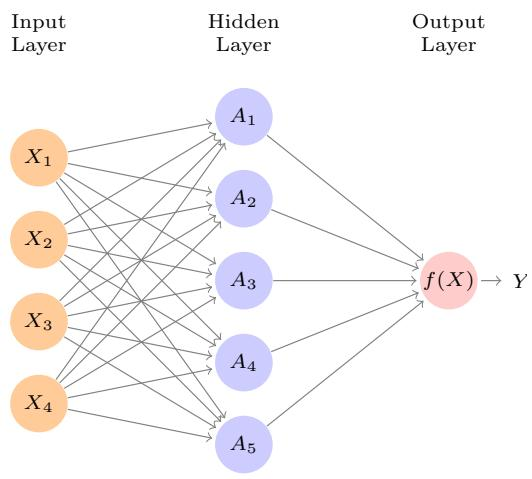

<details>
<summary>flowchart</summary>

```mermaid
graph LR
  InputLayer["Input Layer"] --> X1["X1"]
  InputLayer --> X2["X2"]
  InputLayer --> X3["X3"]
  InputLayer --> X4["X4"]
  X1 --> A1["A1"]
  X1 --> A2["A2"]
  X1 --> A3["A3"]
  X1 --> A4["A4"]
  X1 --> A5["A5"]
  X2 --> A1
  X2 --> A2
  X2 --> A3
  X2 --> A4
  X2 --> A5
  X3 --> A1
  X3 --> A2
  X3 --> A3
  X3 --> A4
  X3 --> A5
  X4 --> A1
  X4 --> A2
  X4 --> A3
  X4 --> A4
  X4 --> A5
  A1 --> f(X)["f(X)"]
  A2 --> f(X)["f(X)"]
  A3 --> f(X)["f(X)"]
  A4 --> f(X)["f(X)"]
  A5 --> f(X)["f(X)"]
```
</details>

FIGURE 10.1. Neural network with a single hidden layer. The hidden layer computes activations $A_{k} = h_{k}(X)$ that are nonlinear transformations of linear combinations of the inputs $X_{1}, X_{2}, \ldots, X_{p}$ . Hence these $A_{k}$ are not directly observed. The functions $h_{k}(\cdot)$ are not fixed in advance, but are learned during the training of the network. The output layer is a linear model that uses these activations $A_{k}$ as inputs, resulting in a function $f(X)$ .

will also demonstrate these models using the Python torch package, along with a number of helper packages.

The material in this chapter is slightly more challenging than elsewhere in this book.

# 10.1 Single Layer Neural Networks

A neural network takes an input vector of p variables $X = (X_{1}, X_{2}, \ldots, X_{p})$ and builds a nonlinear function $f(X)$ to predict the response Y. We have built nonlinear prediction models in earlier chapters, using trees, boosting and generalized additive models. What distinguishes neural networks from these methods is the particular structure of the model. Figure 10.1 shows a simple feed-forward neural network for modeling a quantitative response using p = 4 predictors. In the terminology of neural networks, the four features $X_{1}, \ldots, X_{4}$ make up the units in the input layer. The arrows indicate that each of the inputs from the input layer feeds into each of the K hidden units (we get to pick K; here we chose 5). The neural network model has the form

$$
\begin{array}{l} f (X) = \beta_ {0} + \sum_ {k = 1} ^ {K} \beta_ {k} h _ {k} (X) \tag {10.1} \\ = \beta_ {0} + \sum_ {k = 1} ^ {K} \beta_ {k} g (w _ {k 0} + \sum_ {j = 1} ^ {p} w _ {k j} X _ {j}). \\ \end{array}
$$

It is built up here in two steps. First the K activations $A_{k}$ , $k = 1, \ldots, K$ , in the hidden layer are computed as functions of the input features $X_{1}, \ldots, X_{p}$ ,

$$
A _ {k} = h _ {k} (X) = g (w _ {k 0} + \sum_ {j = 1} ^ {p} w _ {k j} X _ {j}), \tag {10.2}
$$

feed-forward
neural
network
input layer
hidden units

activations


<details>
<summary>line</summary>

| z | sigmoid | ReLU |
| --- | --- | --- |
| -5 | ~0.01 | 0.0 |
| -4 | ~0.03 | 0.0 |
| -2 | ~0.15 | 0.0 |
| 0 | 0.5 | 0.0 |
| 2 | ~0.85 | ~0.4 |
| 4 | ~0.98 | ~0.8 |
| 5 | 1.0 | 1.0 |
</details>

FIGURE 10.2. Activation functions. The piecewise-linear ReLU function is popular for its efficiency and computability. We have scaled it down by a factor of five for ease of comparison.

where $g(z)$ is a nonlinear activation function that is specified in advance. We can think of each $A_{k}$ as a different transformation $h_{k}(X)$ of the original features, much like the basis functions of Chapter 7. These K activations from the hidden layer then feed into the output layer, resulting in

$$
f (X) = \beta_ {0} + \sum_ {k = 1} ^ {K} \beta_ {k} A _ {k}, \tag {10.3}
$$

a linear regression model in the $K = 5$ activations. All the parameters $\beta_0, \ldots, \beta_K$ and $w_{10}, \ldots, w_{Kp}$ need to be estimated from data. In the early instances of neural networks, the sigmoid activation function was favored,

$$
g (z) = \frac {e ^ {z}}{1 + e ^ {z}} = \frac {1}{1 + e ^ {- z}}, \tag {10.4}
$$

which is the same function used in logistic regression to convert a linear function into probabilities between zero and one (see Figure 10.2). The preferred choice in modern neural networks is the ReLU (rectified linear unit) activation function, which takes the form

$$
g (z) = (z) _ {+} = \left\{ \begin{array}{l l} 0 & \text {if} z <   0 \\ z & \text {otherwise.} \end{array} \right. \tag {10.5}
$$

A ReLU activation can be computed and stored more efficiently than a sigmoid activation. Although it thresholds at zero, because we apply it to a linear function (10.2) the constant term $w_{k0}$ will shift this inflection point.

So in words, the model depicted in Figure 10.1 derives five new features by computing five different linear combinations of $X$ , and then squashes each through an activation function $g(\cdot)$ to transform it. The final model is linear in these derived variables.

The name neural network originally derived from thinking of these hidden units as analogous to neurons in the brain — values of the activations $A_{k} = h_{k}(X)$ close to one are firing, while those close to zero are silent (using the sigmoid activation function).

The nonlinearity in the activation function $g(\cdot)$ is essential, since without it the model $f(X)$ in (10.1) would collapse into a simple linear model in

$X_{1},\ldots,X_{p}$ . Moreover, having a nonlinear activation function allows the model to capture complex nonlinearities and interaction effects. Consider a very simple example with p=2 input variables $X=(X_{1},X_{2})$ , and K=2 hidden units $h_{1}(X)$ and $h_{2}(X)$ with $g(z)=z^{2}$ . We specify the other parameters as

$$
\begin{array}{l} \beta_ {0} = 0, \quad \beta_ {1} = \frac {1}{4}, \quad \beta_ {2} = - \frac {1}{4}, \\ w _ {1 0} = 0, \quad w _ {1 1} = 1, \quad w _ {1 2} = 1, \tag {10.6} \\ \end{array}
$$

$$
w _ {2 0} = 0, \quad w _ {2 1} = 1, \quad w _ {2 2} = - 1.
$$

From (10.2), this means that

$$
\begin{array}{r c l} h _ {1} (X) & = & (0 + X _ {1} + X _ {2}) ^ {2}, \\ h _ {2} (X) & = & (0 + X _ {1} - X _ {2}) ^ {2}. \end{array} \tag {10.7}
$$

Then plugging (10.7) into (10.1), we get

$$
\begin{array}{l} f (X) = 0 + \frac {1}{4} \cdot \left(0 + X _ {1} + X _ {2}\right) ^ {2} - \frac {1}{4} \cdot \left(0 + X _ {1} - X _ {2}\right) ^ {2} \\ = \frac {1}{4} \left[ \left(\dot {X} _ {1} + X _ {2}\right) ^ {2} - \left(X _ {1} - X _ {2}\right) ^ {2} \right] \tag {10.8} \\ = X _ {1} X _ {2}. \\ \end{array}
$$

So the sum of two nonlinear transformations of linear functions can give us an interaction! In practice we would not use a quadratic function for $g(z)$ , since we would always get a second-degree polynomial in the original coordinates $X_{1}, \ldots, X_{p}$ . The sigmoid or ReLU activations do not have such a limitation.

Fitting a neural network requires estimating the unknown parameters in $(10.1)$ . For a quantitative response, typically squared-error loss is used, so that the parameters are chosen to minimize

$$
\sum_ {i = 1} ^ {n} \left(y _ {i} - f (x _ {i})\right) ^ {2}. \tag {10.9}
$$

Details about how to perform this minimization are provided in Section 10.7.

# 10.2 Multilayer Neural Networks

Modern neural networks typically have more than one hidden layer, and often many units per layer. In theory a single hidden layer with a large number of units has the ability to approximate most functions. However, the learning task of discovering a good solution is made much easier with multiple layers each of modest size.

We will illustrate a large dense network on the famous and publicly available MNIST handwritten digit dataset. $^{1}$ Figure 10.3 shows examples of these digits. The idea is to build a model to classify the images into their correct digit class 0–9. Every image has $p = 28 \times 28 = 784$ pixels, each of which is an eight-bit grayscale value between 0 and 255 representing

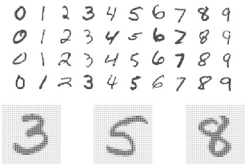  
FIGURE 10.3. Examples of handwritten digits from the MNIST corpus. Each grayscale image has $28 \times 28$ pixels, each of which is an eight-bit number (0–255) which represents how dark that pixel is. The first 3, 5, and 8 are enlarged to show their 784 individual pixel values.

the relative amount of the written digit in that tiny square. $^{2}$ These pixels are stored in the input vector X (in, say, column order). The output is the class label, represented by a vector $Y = (Y_{0}, Y_{1}, \ldots, Y_{9})$ of 10 dummy variables, with a one in the position corresponding to the label, and zeros elsewhere. In the machine learning community, this is known as one-hot encoding. There are 60,000 training images, and 10,000 test images.

On a historical note, digit recognition problems were the catalyst that accelerated the development of neural network technology in the late 1980s at AT&T Bell Laboratories and elsewhere. Pattern recognition tasks of this kind are relatively simple for humans. Our visual system occupies a large fraction of our brains, and good recognition is an evolutionary force for survival. These tasks are not so simple for machines, and it has taken more than 30 years to refine the neural-network architectures to match human performance.

Figure 10.4 shows a multilayer network architecture that works well for solving the digit-classification task. It differs from Figure 10.1 in several ways:

- It has two hidden layers $L_{1}$ (256 units) and $L_{2}$ (128 units) rather than one. Later we will see a network with seven hidden layers.  
- It has ten output variables, rather than one. In this case the ten variables really represent a single qualitative variable and so are quite dependent. (We have indexed them by the digit class 0–9 rather than 1–10, for clarity.) More generally, in multi-task learning one can predict different responses simultaneously with a single network; they all have a say in the formation of the hidden layers.  
- The loss function used for training the network is tailored for the multiclass classification task.


<details>
<summary>flowchart</summary>

This diagram illustrates a neural network architecture with hidden layers (L1 and L2), input layers (X1-Xp), and output layers (f0-f9), showing directed connections between nodes and their respective outputs.
</details>

FIGURE 10.4. Neural network diagram with two hidden layers and multiple outputs, suitable for the MNIST handwritten-digit problem. The input layer has p = 784 units, the two hidden layers $K_{1} = 256$ and $K_{2} = 128$ units respectively, and the output layer 10 units. Along with intercepts (referred to as biases in the deep-learning community) this network has 235,146 parameters (referred to as weights).

The first hidden layer is as in (10.2), with

$$
\begin{array}{l} A _ {k} ^ {(1)} = h _ {k} ^ {(1)} (X) \tag {10.10} \\ = g (w _ {k 0} ^ {(1)} + \sum_ {j = 1} ^ {p} w _ {k j} ^ {(1)} X _ {j}) \\ \end{array}
$$

for $k = 1, \ldots, K_{1}$ . The second hidden layer treats the activations $A_{k}^{(1)}$ of the first hidden layer as inputs and computes new activations

$$
\begin{array}{l} A _ {\ell} ^ {(2)} = h _ {\ell} ^ {(2)} (X) \tag {10.11} \text {, (2)} \quad \text {, (2)} \quad \text {, (1)} \\ = g (w _ {\ell 0} ^ {(2)} + \sum_ {k = 1} ^ {K _ {1}} w _ {\ell k} ^ {(2)} A _ {k} ^ {(1)}) \\ \end{array}
$$

for $\ell=1,\ldots,K_{2}$ . Notice that each of the activations in the second layer $A_{\ell}^{(2)}=h_{\ell}^{(2)}(X)$ is a function of the input vector X. This is the case because while they are explicitly a function of the activations $A_{k}^{(1)}$ from layer $L_{1}$ , these in turn are functions of X. This would also be the case with more hidden layers. Thus, through a chain of transformations, the network is able to build up fairly complex transformations of X that ultimately feed into the output layer as features.

We have introduced additional superscript notation such as $h_{\ell}^{(2)}(X)$ and $w_{\ell_{j}}^{(2)}$ in (10.10) and (10.11) to indicate to which layer the activations and weights (coefficients) belong, in this case layer 2. The notation $W_{1}$ in Fig-

ure 10.4 represents the entire matrix of weights that feed from the input layer to the first hidden layer $L_{1}$ . This matrix will have $785 \times 256 = 200,960$ elements; there are 785 rather than 784 because we must account for the intercept or bias term. $^{3}$

Each element $A_{k}^{(1)}$ feeds to the second hidden layer $L_{2}$ via the matrix of weights $\mathbf{W}_2$ of dimension $257 \times 128 = 32,896$ .

We now get to the output layer, where we now have ten responses rather than one. The first step is to compute ten different linear models similar to our single model $(10.1)$ ,

$$
\begin{array}{l} Z _ {m} = \beta_ {m 0} + \sum_ {\ell = 1} ^ {K _ {2}} \beta_ {m \ell} h _ {\ell} ^ {(2)} (X) \tag {10.12} \\ = \beta_ {m 0} + \sum_ {\ell = 1} ^ {K _ {2}} \beta_ {m \ell} A _ {\ell} ^ {(2)}, \\ \end{array}
$$

for $m = 0,1,\dots,9$ . The matrix $\mathbf{B}$ stores all $129 \times 10 = 1,290$ of these weights.

If these were all separate quantitative responses, we would simply set each $f_{m}(X) = Z_{m}$ and be done. However, we would like our estimates to represent class probabilities $f_{m}(X) = \Pr(Y = m|X)$ , just like in multinomial logistic regression in Section 4.3.5. So we use the special softmax activation function (see (4.13) on page 145),

$$
f _ {m} (X) = \Pr (Y = m | X) = \frac {e ^ {Z _ {m}}}{\sum_ {\ell = 0} ^ {9} e ^ {Z _ {\ell}}}, \tag {10.13}
$$

for $m = 0,1,\dots,9$ . This ensures that the 10 numbers behave like probabilities (non-negative and sum to one). Even though the goal is to build a classifier, our model actually estimates a probability for each of the 10 classes. The classifier then assigns the image to the class with the highest probability.

To train this network, since the response is qualitative, we look for coefficient estimates that minimize the negative multinomial log-likelihood

$$
- \sum_ {i = 1} ^ {n} \sum_ {m = 0} ^ {9} y _ {i m} \log (f _ {m} (x _ {i})), \tag {10.14}
$$

also known as the cross-entropy. This is a generalization of the criterion (4.5) for two-class logistic regression. Details on how to minimize this objective are given in Section 10.7. If the response were quantitative, we would instead minimize squared-error loss as in (10.9).

Table 10.1 compares the test performance of the neural network with two simple models presented in Chapter 4 that make use of linear decision boundaries: multinomial logistic regression and linear discriminant analysis. The improvement of neural networks over both of these linear methods is dramatic: the network with dropout regularization achieves a test error rate below 2% on the 10,000 test images. (We describe dropout regularization in Section 10.7.3.) In Section 10.9.2 of the lab, we present the code for fitting this model, which runs in just over two minutes on a laptop computer.

<table><tr><td>Method</td><td>Test Error</td></tr><tr><td>Neural Network + Ridge Regularization</td><td>2.3%</td></tr><tr><td>Neural Network + Dropout Regularization</td><td>1.8%</td></tr><tr><td>Multinomial Logistic Regression</td><td>7.2%</td></tr><tr><td>Linear Discriminant Analysis</td><td>12.7%</td></tr></table>

TABLE 10.1. Test error rate on the MNIST data, for neural networks with two forms of regularization, as well as multinomial logistic regression and linear discriminant analysis. In this example, the extra complexity of the neural network leads to a marked improvement in test error.

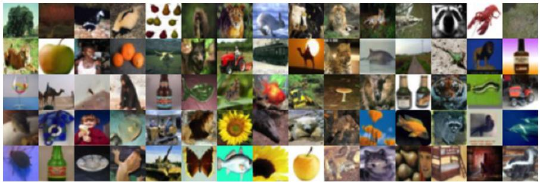

<details>
<summary>natural_image</summary>

Grid of colorful collage of animal and food-related images, no text or symbols present
</details>

FIGURE 10.5. A sample of images from the CIFAR100 database: a collection of natural images from everyday life, with 100 different classes represented.

Adding the number of coefficients in $W_{1}$ , $W_{2}$ and B, we get 235,146 in all, more than 33 times the number $785 \times 9 = 7,065$ needed for multinomial logistic regression. Recall that there are 60,000 images in the training set. While this might seem like a large training set, there are almost four times as many coefficients in the neural network model as there are observations in the training set! To avoid overfitting, some regularization is needed. In this example, we used two forms of regularization: ridge regularization, which is similar to ridge regression from Chapter 6, and dropout regularization. We discuss both forms of regularization in Section 10.7.

dropout

# 10.3 Convolutional Neural Networks

Neural networks rebounded around 2010 with big successes in image classification. Around that time, massive databases of labeled images were being accumulated, with ever-increasing numbers of classes. Figure 10.5 shows 75 images drawn from the CIFAR100 database. $^{4}$ This database consists of 60,000 images labeled according to 20 superclasses (e.g. aquatic mammals), with five classes per superclass (beaver, dolphin, otter, seal, whale). Each image has a resolution of $32 \times 32$ pixels, with three eight-bit numbers per pixel representing red, green and blue. The numbers for each image are organized in a three-dimensional array called a feature map. The first two

feature map


<details>
<summary>text_image</summary>

TIGER
</details>

FIGURE 10.6. Schematic showing how a convolutional neural network classifies an image of a tiger. The network takes in the image and identifies local features. It then combines the local features in order to create compound features, which in this example include eyes and ears. These compound features are used to output the label “tiger”.

axes are spatial (both are 32-dimensional), and the third is the channel axis, $^{5}$ representing the three colors. There is a designated training set of 50,000 images, and a test set of 10,000.

A special family of convolutional neural networks (CNNs) has evolved for classifying images such as these, and has shown spectacular success on a wide range of problems. CNNs mimic to some degree how humans classify images, by recognizing specific features or patterns anywhere in the image that distinguish each particular object class. In this section we give a brief overview of how they work.

Figure 10.6 illustrates the idea behind a convolutional neural network on a cartoon image of a tiger. $^{6}$

The network first identifies low-level features in the input image, such as small edges, patches of color, and the like. These low-level features are then combined to form higher-level features, such as parts of ears, eyes, and so on. Eventually, the presence or absence of these higher-level features contributes to the probability of any given output class.

How does a convolutional neural network build up this hierarchy? It combines two specialized types of hidden layers, called convolution layers and pooling layers. Convolution layers search for instances of small patterns in the image, whereas pooling layers downsample these to select a prominent subset. In order to achieve state-of-the-art results, contemporary neural-network architectures make use of many convolution and pooling layers. We describe convolution and pooling layers next.

# 10.3.1 Convolution Layers

A convolution layer is made up of a large number of convolution filters, each

of which is a template that determines whether a particular local feature is present in an image. A convolution filter relies on a very simple operation, called a convolution, which basically amounts to repeatedly multiplying matrix elements and then adding the results.

To understand how a convolution filter works, consider a very simple example of a $4 \times 3$ image:

$$
\text {Original Image} = \left[ \begin{array}{c c c} a & b & c \\ d & e & f \\ g & h & i \\ j & k & l \end{array} \right].
$$

Now consider a $2 \times 2$ filter of the form

$$
\text {Convolution Filter} = \left[ \begin{array}{c c} \alpha & \beta \\ \gamma & \delta \end{array} \right].
$$

When we convolve the image with the filter, we get the result $^{7}$

$$
\text {Convolved Image} = \left[ \begin{array}{c c} a \alpha + b \beta + d \gamma + e \delta & b \alpha + c \beta + e \gamma + f \delta \\ d \alpha + e \beta + g \gamma + h \delta & e \alpha + f \beta + h \gamma + i \delta \\ g \alpha + h \beta + j \gamma + k \delta & h \alpha + i \beta + k \gamma + l \delta \end{array} \right].
$$

For instance, the top-left element comes from multiplying each element in the $2 \times 2$ filter by the corresponding element in the top left $2 \times 2$ portion of the image, and adding the results. The other elements are obtained in a similar way: the convolution filter is applied to every $2 \times 2$ submatrix of the original image in order to obtain the convolved image. If a $2 \times 2$ submatrix of the original image resembles the convolution filter, then it will have a large value in the convolved image; otherwise, it will have a small value. Thus, the convolved image highlights regions of the original image that resemble the convolution filter. We have used $2 \times 2$ as an example; in general convolution filters are small $\ell_{1} \times \ell_{2}$ arrays, with $\ell_{1}$ and $\ell_{2}$ small positive integers that are not necessarily equal.

Figure 10.7 illustrates the application of two convolution filters to a $192 \times 179$ image of a tiger, shown on the left-hand side. $^{8}$ Each convolution filter is a $15 \times 15$ image containing mostly zeros (black), with a narrow strip of ones (white) oriented either vertically or horizontally within the image. When each filter is convolved with the image of the tiger, areas of the tiger that resemble the filter (i.e. that have either horizontal or vertical stripes or edges) are given large values, and areas of the tiger that do not resemble the feature are given small values. The convolved images are displayed on the right-hand side. We see that the horizontal stripe filter picks out horizontal stripes and edges in the original image, whereas the vertical stripe filter picks out vertical stripes and edges in the original image.


<details>
<summary>flowchart</summary>

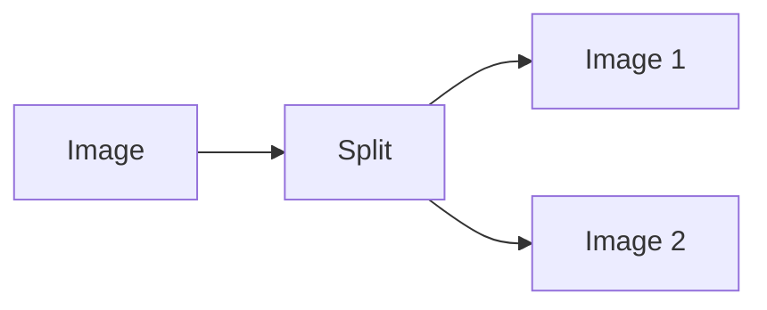
</details>

FIGURE 10.7. Convolution filters find local features in an image, such as edges and small shapes. We begin with the image of the tiger shown on the left, and apply the two small convolution filters in the middle. The convolved images highlight areas in the original image where details similar to the filters are found. Specifically, the top convolved image highlights the tiger's vertical stripes, whereas the bottom convolved image highlights the tiger's horizontal stripes. We can think of the original image as the input layer in a convolutional neural network, and the convolved images as the units in the first hidden layer.

We have used a large image and two large filters in Figure 10.7 for illustration. For the CIFAR100 database there are $32 \times 32$ color pixels per image, and we use $3 \times 3$ convolution filters.

In a convolution layer, we use a whole bank of filters to pick out a variety of differently-oriented edges and shapes in the image. Using predefined filters in this way is standard practice in image processing. By contrast, with CNNs the filters are learned for the specific classification task. We can think of the filter weights as the parameters going from an input layer to a hidden layer, with one hidden unit for each pixel in the convolved image. This is in fact the case, though the parameters are highly structured and constrained (see Exercise 4 for more details). They operate on localized patches in the input image (so there are many structural zeros), and the same weights in a given filter are reused for all possible patches in the image (so the weights are constrained). $^{9}$

We now give some additional details.

\- Since the input image is in color, it has three channels represented by a three-dimensional feature map (array). Each channel is a two-dimensional $(32 \times 32)$ feature map — one for red, one for green, and one for blue. A single convolution filter will also have three channels, one per color, each of dimension $3 \times 3$ , with potentially different filter weights. The results of the three convolutions are summed to form a two-dimensional output feature map. Note that at this point the color information has been used, and is not passed on to subsequent layers except through its role in the convolution.

- If we use K different convolution filters at this first hidden layer, we get K two-dimensional output feature maps, which together are treated as a single three-dimensional feature map. We view each of the K output feature maps as a separate channel of information, so now we have K channels in contrast to the three color channels of the original input feature map. The three-dimensional feature map is just like the activations in a hidden layer of a simple neural network, except organized and produced in a spatially structured way.  
- We typically apply the ReLU activation function (10.5) to the convolved image. This step is sometimes viewed as a separate layer in the convolutional neural network, in which case it is referred to as a detector layer.

detector
layer

# 10.3.2 Pooling Layers

A pooling layer provides a way to condense a large image into a smaller summary image. While there are a number of possible ways to perform pooling, the max pooling operation summarizes each non-overlapping $2 \times 2$ block of pixels in an image using the maximum value in the block. This reduces the size of the image by a factor of two in each direction, and it also provides some location invariance: i.e. as long as there is a large value in one of the four pixels in the block, the whole block registers as a large value in the reduced image.

Here is a simple example of max pooling:

$$
\text {Max pool} \left[ \begin{array}{c c c c} 1 & 2 & 5 & 3 \\ 3 & 0 & 1 & 2 \\ 2 & 1 & 3 & 4 \\ 1 & 1 & 2 & 0 \end{array} \right] \to \left[ \begin{array}{c c} 3 & 5 \\ 2 & 4 \end{array} \right].
$$

# 10.3.3 Architecture of a Convolutional Neural Network

So far we have defined a single convolution layer — each filter produces a new two-dimensional feature map. The number of convolution filters in a convolution layer is akin to the number of units at a particular hidden layer in a fully-connected neural network of the type we saw in Section 10.2. This number also defines the number of channels in the resulting three-dimensional feature map. We have also described a pooling layer, which reduces the first two dimensions of each three-dimensional feature map. Deep CNNs have many such layers. Figure 10.8 shows a typical architecture for a CNN for the CIFAR100 image classification task.

At the input layer, we see the three-dimensional feature map of a color image, where the channel axis represents each color by a $32 \times 32$ two-dimensional feature map of pixels. Each convolution filter produces a new channel at the first hidden layer, each of which is a $32 \times 32$ feature map (after some padding at the edges). After this first round of convolutions, we now have a new “image”; a feature map with considerably more channels than the three color input channels (six in the figure, since we used six convolution filters).


<details>
<summary>flowchart</summary>

This diagram illustrates a neural network architecture with convolutional layers and pool layers, showing the flow of data from input images through processing steps to final output.
</details>

FIGURE 10.8. Architecture of a deep CNN for the CIFAR100 classification task. Convolution layers are interspersed with $2 \times 2$ max-pool layers, which reduce the size by a factor of 2 in both dimensions.

This is followed by a max-pool layer, which reduces the size of the feature map in each channel by a factor of four: two in each dimension.

This convolve-then-pool sequence is now repeated for the next two layers. Some details are as follows:

- Each subsequent convolve layer is similar to the first. It takes as input the three-dimensional feature map from the previous layer and treats it like a single multi-channel image. Each convolution filter learned has as many channels as this feature map.  
- Since the channel feature maps are reduced in size after each pool layer, we usually increase the number of filters in the next convolve layer to compensate.  
- Sometimes we repeat several convolve layers before a pool layer. This effectively increases the dimension of the filter.

These operations are repeated until the pooling has reduced each channel feature map down to just a few pixels in each dimension. At this point the three-dimensional feature maps are flattened — the pixels are treated as separate units — and fed into one or more fully-connected layers before reaching the output layer, which is a softmax activation for the 100 classes (as in $(10.13)$ ).

There are many tuning parameters to be selected in constructing such a network, apart from the number, nature, and sizes of each layer. Dropout learning can be used at each layer, as well as lasso or ridge regularization (see Section 10.7). The details of constructing a convolutional neural network can seem daunting. Fortunately, terrific software is available, with extensive examples and vignettes that provide guidance on sensible choices for the parameters. For the CIFAR100 official test set, the best accuracy as of this writing is just above 75%, but undoubtedly this performance will continue to improve.

# 10.3.4 Data Augmentation

An additional important trick used with image modeling is data augmentation. Essentially, each training image is replicated many times, with each replicate randomly distorted in a natural way such that human recognition is unaffected. Figure 10.9 shows some examples. Typical distortions are

data augmentation

  
FIGURE 10.9. Data augmentation. The original image (leftmost) is distorted in natural ways to produce different images with the same class label. These distortions do not fool humans, and act as a form of regularization when fitting the CNN.

zoom, horizontal and vertical shift, shear, small rotations, and in this case horizontal flips. At face value this is a way of increasing the training set considerably with somewhat different examples, and thus protects against overfitting. In fact we can see this as a form of regularization: we build a cloud of images around each original image, all with the same label. This kind of fattening of the data is similar in spirit to ridge regularization.

We will see in Section 10.7.2 that the stochastic gradient descent algorithms for fitting deep learning models repeatedly process randomly-selected batches of, say, 128 training images at a time. This works hand-in-glove with augmentation, because we can distort each image in the batch on the fly, and hence do not have to store all the new images.

# 10.3.5 Results Using a Pretrained Classifier

Here we use an industry-level pretrained classifier to predict the class of some new images. The resnet50 classifier is a convolutional neural network that was trained using the imagenet data set, which consists of millions of images that belong to an ever-growing number of categories. $^{10}$ Figure 10.10 demonstrates the performance of resnet50 on six photographs (private collection of one of the authors). $^{11}$ The CNN does a reasonable job classifying the hawk in the second image. If we zoom out as in the third image, it gets confused and chooses the fountain rather than the hawk. In the final image a “jacamar” is a tropical bird from South and Central America with similar coloring to the South African Cape Weaver. We give more details on this example in Section 10.9.4.

Much of the work in fitting a CNN is in learning the convolution filters at the hidden layers; these are the coefficients of a CNN. For models fit to massive corpora such as imagenet with many classes, the output of these filters can serve as features for general natural-image classification problems. One can use these pretrained hidden layers for new problems with much smaller training sets (a process referred to as weight freezing), and just train the last few layers of the network, which requires much less data.

weight
freezing

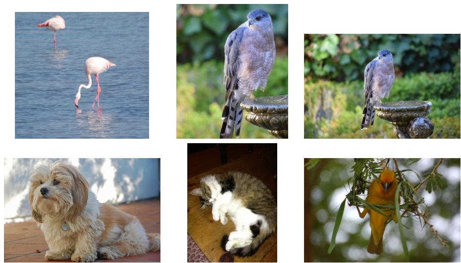

flamingo  
Cooper's hawk  
Cooper's hawk

<table><tr><td>flamingo</td><td>0.83</td><td>kite</td><td>0.60</td><td>fountain</td><td>0.35</td></tr><tr><td>spoonbill</td><td>0.17</td><td>great grey owl</td><td>0.09</td><td>nail</td><td>0.12</td></tr><tr><td>white stork</td><td>0.00</td><td>robin</td><td>0.06</td><td>hook</td><td>0.07</td></tr></table>

Lhasa Apso  
cat  
Cape weaver

<table><tr><td>Tibetan terrier</td><td>0.56</td><td>Old English sheepdog</td><td>0.82</td><td>jacamar</td><td>0.28</td></tr><tr><td>Lhasa</td><td>0.32</td><td>Shih-Tzu</td><td>0.04</td><td>macaw</td><td>0.12</td></tr><tr><td>cocker spaniel</td><td>0.03</td><td>Persian cat</td><td>0.04</td><td>robin</td><td>0.12</td></tr></table>

FIGURE 10.10. Classification of six photographs using the resnet50 CNN trained on the imagenet corpus. The table below the images displays the true (intended) label at the top of each panel, and the top three choices of the classifier (out of 100). The numbers are the estimated probabilities for each choice. (A kite is a raptor, but not a hawk.)

The vignettes and book $^{12}$ that accompany the keras package give more details on such applications.

# 10.4 Document Classification

In this section we introduce a new type of example that has important applications in industry and science: predicting attributes of documents. Examples of documents include articles in medical journals, Reuters news feeds, emails, tweets, and so on. Our example will be IMDb (Internet Movie Database) ratings — short documents where viewers have written critiques of movies. $^{13}$ The response in this case is the sentiment of the review, which will be positive or negative.

Here is the beginning of a rather amusing negative review:

This has to be one of the worst films of the 1990s. When my friends & I were watching this film (being the target audience it was aimed at) we just sat & watched the first half an hour with our jaws touching the floor at how bad it really was. The rest of the time, everyone else in the theater just started talking to each other, leaving or generally crying into their popcorn ...

Each review can be a different length, include slang or non-words, have spelling errors, etc. We need to find a way to featurize such a document. This is modern parlance for defining a set of predictors.

The simplest and most common featurization is the bag-of-words model. We score each document for the presence or absence of each of the words in a language dictionary — in this case an English dictionary. If the dictionary contains M words, that means for each document we create a binary feature vector of length M, and score a 1 for every word present, and 0 otherwise. That can be a very wide feature vector, so we limit the dictionary — in this case to the 10,000 most frequently occurring words in the training corpus of 25,000 reviews. Fortunately there are nice tools for doing this automatically. Here is the beginning of a positive review that has been redacted in this way:

$\langle START\rangle$ this film was just brilliant casting location scenery story direction everyone's really suited the part they played and you could just imagine being there robert $\langle UNK\rangle$ is an amazing actor and now the same being director $\langle UNK\rangle$ father came from the same scottish island as myself so i loved ...

Here we can see many words have been omitted, and some unknown words (UNK) have been marked as such. With this reduction the binary feature vector has length 10,000, and consists mostly of 0's and a smattering of 1's in the positions corresponding to words that are present in the document. We have a training set and test set, each with 25,000 examples, and each balanced with regard to sentiment. The resulting training feature matrix X has dimension $25,000 \times 10,000$ , but only 1.3% of the binary entries are nonzero. We call such a matrix sparse, because most of the values are the same (zero in this case); it can be stored efficiently in sparse matrix format. $^{14}$ There are a variety of ways to account for the document length; here we only score a word as in or out of the document, but for example one could instead record the relative frequency of words. We split off a validation set of size 2,000 from the 25,000 training observations (for model tuning), and fit two model sequences:

- A lasso logistic regression using the glmnet package;  
- A two-class neural network with two hidden layers, each with 16 ReLU units.

  
FIGURE 10.11. Accuracy of the lasso and a two-hidden-layer neural network on the IMDb data. For the lasso, the x-axis displays $-\log(\lambda)$ , while for the neural network it displays epochs (number of times the fitting algorithm passes through the training set). Both show a tendency to overfit, and achieve approximately the same test accuracy.

Both methods produce a sequence of solutions. The lasso sequence is indexed by the regularization parameter $\lambda$ . The neural-net sequence is indexed by the number of gradient-descent iterations used in the fitting, as measured by training epochs or passes through the training set (Section 10.7). Notice that the training accuracy in Figure 10.11 (black points) increases monotonically in both cases. We can use the validation error to pick a good solution from each sequence (blue points in the plots), which would then be used to make predictions on the test data set.

Note that a two-class neural network amounts to a nonlinear logistic regression model. From $(10.12)$ and $(10.13)$ we can see that

$$
\begin{array}{l} \log \left(\frac {\Pr (Y = 1 | X)}{\Pr (Y = 0 | X)}\right) = Z _ {1} - Z _ {0} \tag {10.15} \\ = (\beta_ {1 0} - \beta_ {0 0}) + \sum_ {\ell = 1} ^ {K _ {2}} (\beta_ {1 \ell} - \beta_ {0 \ell}) A _ {\ell} ^ {(2)}. \\ \end{array}
$$

(This shows the redundancy in the softmax function; for K classes we really only need to estimate K - 1 sets of coefficients. See Section 4.3.5.) In Figure 10.11 we show accuracy (fraction correct) rather than classification error (fraction incorrect), the former being more popular in the machine learning community. Both models achieve a test-set accuracy of about 88%.

The bag-of-words model summarizes a document by the words present, and ignores their context. There are at least two popular ways to take the context into account:

\- The bag-of-n-grams model. For example, a bag of 2-grams records

accuracy

bag-of-n-grams

the consecutive co-occurrence of every distinct pair of words. “Blissfully long” can be seen as a positive phrase in a movie review, while “blissfully short” a negative.

\- Treat the document as a sequence, taking account of all the words in the context of those that preceded and those that follow.

In the next section we explore models for sequences of data, which have applications in weather forecasting, speech recognition, language translation, and time-series prediction, to name a few. We continue with this IMDb example there.

# 10.5 Recurrent Neural Networks

Many data sources are sequential in nature, and call for special treatment when building predictive models. Examples include:

- Documents such as book and movie reviews, newspaper articles, and tweets. The sequence and relative positions of words in a document capture the narrative, theme and tone, and can be exploited in tasks such as topic classification, sentiment analysis, and language translation.  
- Time series of temperature, rainfall, wind speed, air quality, and so on. We may want to forecast the weather several days ahead, or climate several decades ahead.  
- Financial time series, where we track market indices, trading volumes, stock and bond prices, and exchange rates. Here prediction is often difficult, but as we will see, certain indices can be predicted with reasonable accuracy.  
- Recorded speech, musical recordings, and other sound recordings. We may want to give a text transcription of a speech, or perhaps a language translation. We may want to assess the quality of a piece of music, or assign certain attributes.  
- Handwriting, such as doctor's notes, and handwritten digits such as zip codes. Here we want to turn the handwriting into digital text, or read the digits (optical character recognition).

In a recurrent neural network (RNN), the input object X is a sequence. Consider a corpus of documents, such as the collection of IMDb movie reviews. Each document can be represented as a sequence of L words, so $X = \{X_{1}, X_{2}, \ldots, X_{L}\}$ , where each $X_{\ell}$ represents a word. The order of the words, and closeness of certain words in a sentence, convey semantic meaning. RNNs are designed to accommodate and take advantage of the sequential nature of such input objects, much like convolutional neural networks accommodate the spatial structure of image inputs. The output Y can also be a sequence (such as in language translation), but often is a scalar, like the binary sentiment label of a movie review document.

recurrent
neural
network


<details>
<summary>flowchart</summary>

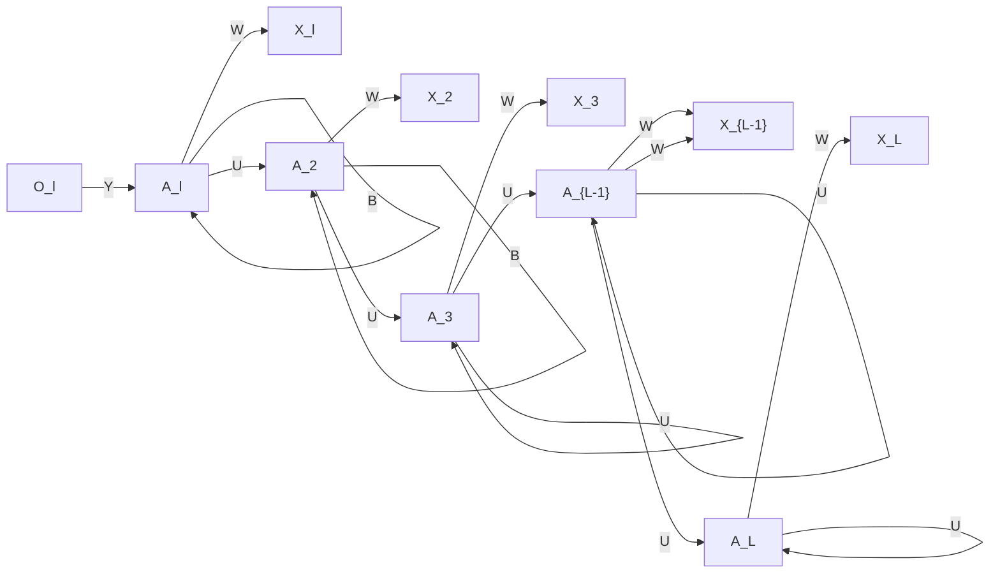
</details>

FIGURE 10.12. Schematic of a simple recurrent neural network. The input is a sequence of vectors $\{X_{\ell}\}_{1}^{L}$ , and here the target is a single response. The network processes the input sequence X sequentially; each $X_{\ell}$ feeds into the hidden layer, which also has as input the activation vector $A_{\ell-1}$ from the previous element in the sequence, and produces the current activation vector $A_{\ell}$ . The same collections of weights W, U and B are used as each element of the sequence is processed. The output layer produces a sequence of predictions $O_{\ell}$ from the current activation $A_{\ell}$ , but typically only the last of these, $O_{L}$ , is of relevance. To the left of the equal sign is a concise representation of the network, which is unrolled into a more explicit version on the right.

Figure 10.12 illustrates the structure of a very basic RNN with a sequence $X = \{X_{1}, X_{2}, \ldots, X_{L}\}$ as input, a simple output Y, and a hidden-layer sequence $\{A_{\ell}\}_{1}^{L} = \{A_{1}, A_{2}, \ldots, A_{L}\}$ . Each $X_{\ell}$ is a vector; in the document example $X_{\ell}$ could represent a one-hot encoding for the $\ell$ th word based on the language dictionary for the corpus (see the top panel in Figure 10.13 for a simple example). As the sequence is processed one vector $X_{\ell}$ at a time, the network updates the activations $A_{\ell}$ in the hidden layer, taking as input the vector $X_{\ell}$ and the activation vector $A_{\ell-1}$ from the previous step in the sequence. Each $A_{\ell}$ feeds into the output layer and produces a prediction $O_{\ell}$ for Y. $O_{L}$ , the last of these, is the most relevant.

In detail, suppose each vector $X_{\ell}$ of the input sequence has p components $X_{\ell}^{T} = (X_{\ell1}, X_{\ell2}, \ldots, X_{\ell p})$ , and the hidden layer consists of K units $A_{\ell}^{T} = (A_{\ell1}, A_{\ell2}, \ldots, A_{\ell K})$ . As in Figure 10.4, we represent the collection of $K \times (p+1)$ shared weights $w_{kj}$ for the input layer by a matrix W, and similarly U is a $K \times K$ matrix of the weights $u_{ks}$ for the hidden-to-hidden layers, and B is a $K + 1$ vector of weights $\beta_{k}$ for the output layer. Then

$$
A _ {\ell k} = g \Big (w _ {k 0} + \sum_ {j = 1} ^ {p} w _ {k j} X _ {\ell j} + \sum_ {s = 1} ^ {K} u _ {k s} A _ {\ell - 1, s} \Big), \tag {10.16}
$$

and the output $O_{\ell}$ is computed as

$$
O _ {\ell} = \beta_ {0} + \sum_ {k = 1} ^ {K} \beta_ {k} A _ {\ell k} \tag {10.17}
$$

for a quantitative response, or with an additional sigmoid activation function for a binary response, for example. Here $g(\cdot)$ is an activation function such as ReLU. Notice that the same weights $\mathbf{W}$ , $\mathbf{U}$ and $\mathbf{B}$ are used as we

process each element in the sequence, i.e. they are not functions of $\ell$ . This is a form of weight sharing used by RNNs, and similar to the use of filters in convolutional neural networks (Section 10.3.1.) As we proceed from beginning to end, the activations $A_{\ell}$ accumulate a history of what has been seen before, so that the learned context can be used for prediction.

For regression problems the loss function for an observation $(X,Y)$ is

$$
(Y - O _ {L}) ^ {2}, \tag {10.18}
$$

which only references the final output $O_L = \beta_0 + \sum_{k=1}^{K} \beta_k A_{Lk}$ . Thus $O_1, O_2, \ldots, O_{L-1}$ are not used. When we fit the model, each element $X_\ell$ of the input sequence $X$ contributes to $O_L$ via the chain (10.16), and hence contributes indirectly to learning the shared parameters $\mathbf{W}$ , $\mathbf{U}$ and $\mathbf{B}$ via the loss (10.18). With $n$ input sequence/response pairs $(x_i, y_i)$ , the parameters are found by minimizing the sum of squares

$$
\sum_ {i = 1} ^ {n} (y _ {i} - o _ {i L}) ^ {2} = \sum_ {i = 1} ^ {n} \left(y _ {i} - \left(\beta_ {0} + \sum_ {k = 1} ^ {K} \beta_ {k} g \left(w _ {k 0} + \sum_ {j = 1} ^ {p} w _ {k j} x _ {i L j} + \sum_ {s = 1} ^ {K} u _ {k s} a _ {i, L - 1, s}\right)\right)\right) ^ {2}. \tag {10.19}
$$

Here we use lowercase letters for the observed $y_{i}$ and vector sequences $x_{i}=\{x_{i1},x_{i2},\ldots,x_{iL}\}$ , $^{15}$ as well as the derived activations.

Since the intermediate outputs $O_{\ell}$ are not used, one may well ask why they are there at all. First of all, they come for free, since they use the same output weights B needed to produce $O_{L}$ , and provide an evolving prediction for the output. Furthermore, for some learning tasks the response is also a sequence, and so the output sequence $\{O_{1}, O_{2}, \ldots, O_{L}\}$ is explicitly needed.

When used at full strength, recurrent neural networks can be quite complex. We illustrate their use in two simple applications. In the first, we continue with the IMDb sentiment analysis of the previous section, where we process the words in the reviews sequentially. In the second application, we illustrate their use in a financial time series forecasting problem.

# 10.5.1 Sequential Models for Document Classification

Here we return to our classification task with the IMDb reviews. Our approach in Section 10.4 was to use the bag-of-words model. Here the plan is to use instead the sequence of words occurring in a document to make predictions about the label for the entire document.

We have, however, a dimensionality problem: each word in our document is represented by a one-hot-encoded vector (dummy variable) with 10,000 elements (one per word in the dictionary)! An approach that has become popular is to represent each word in a much lower-dimensional embedding space. This means that rather than representing each word by a binary vector with 9,999 zeros and a single one in some position, we will represent it instead by a set of $m$ real numbers, none of which are typically zero. Here $m$ is the embedding dimension, and can be in the low 100s, or even less. This means (in our case) that we need a matrix $\mathbf{E}$ of dimension $m \times 10,000$ ,

weight
sharing

embedding

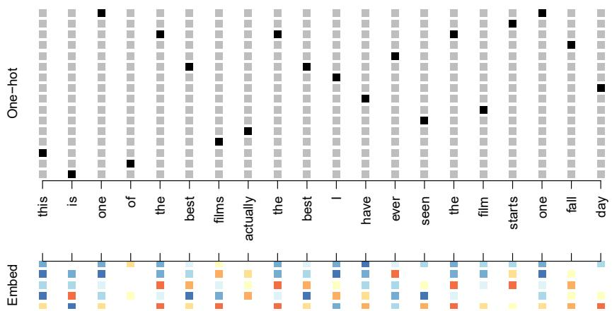

<details>
<summary>heatmap</summary>

| Word | One-hot Frequency | Embed Pattern |
| :--- | :--- | :--- |
| this | 1 | Blue, Dark Blue, Light Blue, Light Blue, Light Blue, Light Blue, Light Blue, Light Blue, Light Blue, Light Blue, Light Blue, Light Blue, Light Blue, Light Blue, Light Blue, Light Blue, Light Blue, Light Blue, Light Blue, Light Blue, Light Blue, Light Blue, Light Blue, Light Blue, Light Blue, Light Blue, Light Blue, Light Blue, Light Blue, Light Blue, Light Blue, Light Blue, Light Blue, Light Blue, Light Blue, Light Blue, Light Blue, Light Blue, Light Blue, Light Blue, Light Blue, Light Blue, Light Blue, Light Blue, Light Blue, Light Blue, Light Blue, Light Blue, Light Blue, Light Blue, Light Blue, Light Blue, Light Blue, Light Blue, Light Blue, Light Blue, Light Blue, Light Blue, Light Blue, Light Blue, Light Blue, Light Blue, Light Blue, Light Blue, Light Blue, Light Blue, Light Blue, Light Blue, Light Blue, Light Blue, Light Blue, Light Blue, Light Blue, Light Blue, Light Blue, Light Blue, Light Blue, Light Blue, Light Blue, Light Blue, Light Blue, Light Blue, Light Blue, Light Blue, Light Blue, Light Blue, Light Blue, Light Blue, Light Blue, Light Blue, Light Blue, Light Blue, Light Blue, Light Blue, Light Blue, Light Blue, Light Blue, Light Blue, Light Blue, Light Blue, Light Blue, Light Blue, Light Blue, Light Blue, Light Blue, Light Blue, Light Blue, Light Blue, Light Blue, Light Blue, Light Blue, Light Blue, Light Blue, Light Blue, Light Blue, Light Blue, Light Blue, Light Blue, Light Blue, Light Blue, Light Blue, Light Blue, Light Blue, Light Blue, Light Blue, Light Blue, Light Blue, Light Blue, Light Blue, Light Blue, Light Blue, Light Blue, Light Blue, Light Blue, Light Blue, Light Blue, Light Blue, Light Blue, Light Blue, Light Blue, Light Blue, Light Blue, Light Blue, Light Blue, Light Blue, Light Blue, Light Blue, Light Blue, Light Blue, Light Blue, Light Blue, Light Blue, Light Blue, Light Blue, Light Blue, Light Blue, Light Blue, Light Blue, Light Blue, Light Blue, Light Blue, Light Blue, Light Blue, Light Blue, Light Blue, Light Blue, Light Blue, Light Blue, Light Blue, Light Blue, Light Blue, Light Blue, Light Blue, Light Blue, Light Blue, Light Blue, Light Blue, Light Blue, Light Blue, Light Blue, Light Blue, Light Blue, Light Blue, Light Blue, Light Blue, Light Blue, Light Blue, Light Blue, Light Blue, Light Blue, Light Blue, Light Blue, Light Blue, Light Blue, Light Blue, Light Blue, Light Blue, Light Blue, Light Blue, Light Blue, Light Blue, Light Blue, Light Blue, Light Blue, Light Blue, Light Blue, Light Blue, Light Blue, Light Blue, Light Blue, Light Blue, Light Blue, Light Blue, Light Blue, Light Blue, Light Blue, Light Blue, Light Blue, Light Blue, Light Blue, Light Blue, Light Blue, Light Blue, Light Blue, Light Blue, Light Blue, Light Blue, Light Blue, Light Blue, Light Blue, Light Blue, Light Blue, Light Blue, Light Blue, Light Blue, Light Blue, Light Blue, Light Blue, Light Blue, Light Blue, Light Blue, Light Blue, Light Blue, Light Blue, Light Blue, Light Blue, Light Blue, Light Blue, Light Blue, Light Blue, Light Blue, Light Blue, Light Blue, Light Blue, Light Blue, Light Blue, Light Blue, Light Blue, Light Blue, Light Blue, Light Blue, Light Blue, Light Blue, Light Blue, Light Blue, Light Blue, Light Blue, Light Blue, Light Blue, Light Blue, Light Blue, Light Blue, Light Blue, Light Blue, Light Blue, Light Blue, Light Blue, Light Blue, Light Blue, Light Blue, Light Blue, Light Blue, Light Blue, Light Blue, Light Blue, Light Blue, Light Blue, Light Blue, Light Blue, Light Blue, Light Blue, Light Blue, Light Blue, Light Blue, Light Blue, Light Blue, Light Blue, Light Blue, Light Blue, Light Blue, Light Blue, Light Blue, Light Blue, Light Blue, Light Blue, Light Blue, Light Blue, Light Blue, Light Blue, Light Blue, Light Blue, Light Blue, Light Blue, Light Blue, Light Blue, Light Blue, Light Blue, Light Blue, Light Blue, Light Blue, Light Blue, Light Blue, Light Blue, Light Blue, Light Blue, Light Blue, Light Blue, Light Blue, Light Blue, Light Blue, Light Blue, Light Blue, Light Blue, Light Blue, Light Blue, Light Blue, Light Blue, Light Blue, Light Blue, Light Blue, Light Blue, Light Blue, Light Blue, Light Blue, Light Blue, Light Blue, Light Blue, Light Blue, Light Blue, Light Blue, Light Blue, Light Blue, Light Blue, Light Blue, Light Blue, Light Blue, Light Blue, Light Blue, Light Blue, Light Blue, Light Blue, Light Blue, Light Blue, Light Blue, Light Blue, Light Blue, Light Blue, Light Blue, Light Blue, Light Blue, Light Blue, Light Blue, Light Blue, Light Blue, Light Blue, Light Blue, Light Blue, Light Blue, Light Blue, Light Blue, Light Blue, Light Blue, Light Blue, Light Blue, Light Blue, Light Blue, Light Blue, Light Blue, Light Blue, Light Blue, Light Blue, Light Blue, Light Blue, Light Blue, Light Blue, Light Blue, Light Blue, Light Blue, Light Blue, Light Blue, Light Blue, Light Blue, Light Blue, Light Blue, Light Blue, Light Blue, Light Blue, Light Blue, Light Blue, Light Blue, Light Blue, Light Blue, Light Blue, Light Blue, Light Blue, Light Blue, Light Blue, Light Blue, Light Blue, Light Blue, Light Blue, Light Blue, Light Blue, Light Blue, Light Blue, Light Blue, Light Blue, Light Blue, Light Blue, Light Blue, Light Blue, Light Blue, Light Blue, Light Blue, Light Blue, Light Blue, Light Blue, Light Blue, Light Blue, Light Blue, Light Blue, Light Blue, Light Blue, Light Blue, Light Blue, Light Blue, Light Blue, Light Blue, Light Blue, Light Blue, Light Blue, Light Blue, Light Blue, Light Blue, Light Blue, Light Blue, Light Blue, Light Blue, Light Blue, Light Blue, Light Blue, Light Blue, Light Blue, Light Blue, Light Blue, Light Blue, Light Blue, Light Blue, Light Blue, Light Blue, Light Blue, Light Blue, Light Blue, Light Blue, Light Blue, Light Blue, Light Blue, Light Blue, Light Blue, Light Blue, Light Blue, Light Blue, Light Blue, Light Blue, Light Blue, Light Blue, Light Blue, Light Blue, Light Blue, Light Blue, Light Blue, Light Blue, Light Blue, Light Blue, Light Blue, Light Blue, Light Blue, Light Blue, Light Blue, Light Blue, Light Blue, Light Blue, Light Blue, Light Blue, Light Blue, Light Blue, Light Blue, Light Blue, Light Blue, Light Blue, Light Blue, Light Blue, Light Blue, Light Blue, Light Blue, Light Blue, Light Blue, Light Blue, Light Blue, Light Blue, Light Blue, Light Blue, Light Blue, Light Blue, Light Blue, Light Blue, Light Blue, Light Blue, Light Blue, Light Blue, Light Blue, Light Blue, Light Blue, Light Blue, Light Blue, Light Blue, Light Blue, Light Blue, Light Blue, Light Blue, Light Blue, Light Blue, Light Blue, Light Blue, Light Blue, Light Blue, Light Blue, Light Blue, Light Blue, Light Blue, Light Blue, Light Blue, Light Blue, Light Blue, Light Blue, Light Blue, Light Blue, Light Blue, Light Blue, Light Blue, Light Blue, Light Blue, Light Blue, Light Blue, Light Blue, Light Blue, Light Blue, Light Blue, Light Blue, Light Blue, Light Blue, Light Blue, Light Blue, Light Blue, Light Blue, Light Blue, Light Blue, Light Blue, Light Blue, Light Blue, Light Blue, Light Blue, Light Blue, Light Blue, Light Blue, Light Blue, Light Blue, Light Blue, Light Blue, Light Blue, Light Blue, Light Blue, Light Blue, Light Blue, Light Blue, Light Blue, Light Blue, Light Blue, Light Blue, Light Blue, Light Blue, Light Blue, Light Blue, Light Blue, Light Blue, Light Blue, Light Blue, Light Blue, Light Blue, Light Blue, Light Blue, Light Blue, Light Blue, Light Blue, Light Blue, Light Blue, Light Blue, Light Blue, Light Blue, Light Blue, Light Blue, Light Blue, Light Blue, Light Blue, Light Blue, Light Blue, Light Blue, Light Blue, Light Blue, Light Blue, Light Blue, Light Blue, Light Blue, Light Blue, Light Blue, Light Blue, Light Blue, Light Blue, Light Blue, Light Blue, Light Blue, Light Blue, Light Blue, Light Blue, Light Blue, Light Blue, Light Blue, Light Blue, Light Blue, Light Blue, Light Blue, Light Blue, Light Blue, Light Blue, Light Blue, Light Blue, Light Blue, Light Blue, Light Blue, Light Blue, Light Blue, Light Blue, Light Blue, Light Blue, Light Blue, Light Blue, Light Blue, Light Blue, Light Blue, Light Blue, Light Blue, Light Blue, Light Blue, Light Blue, Light Blue, Light Blue, Light Blue, Light Blue, Light Blue, Light Blue, Light Blue, Light Blue, Light Blue, Light Blue, Light Blue, Light Blue, Light Blue, Light Blue, Light Blue, Light Blue, Light Blue, Light Blue, Light Blue, Light Blue, Light Blue, Light Blue, Light Blue, Light Blue, Light Blue, Light Blue, Light Blue, Light Blue, Light Blue, Light Blue, Light Blue, Light Blue, Light Blue, Light Blue, Light Blue, Light Blue, Light Blue, Light Blue, Light Blue, Light Blue, Light Blue, Light Blue, Light Blue, Light Blue, Light Blue, Light Blue, Light Blue, Light Blue, Light Blue, Light Blue, Light Blue, Light Blue, Light Blue, Light Blue, Light Blue, Light Blue, Light Blue, Light Blue, Light Blue, Light Blue, Light Blue, Light Blue, Light Blue, Light Blue, Light Blue, Light Blue, Light Blue, Light Blue, Light Blue, Light Blue, Light Blue, Light Blue, Light Blue, Light Blue, Light Blue, Light Blue, Light Blue, Light Blue, Light Blue, Light Blue, Light Blue, Light Blue, Light Blue, Light Blue, Light Blue, Light Blue, Light Blue, Light Blue, Light Blue, Light Blue, Light Blue, Light Blue, Light Blue, Light Blue, Light Blue, Light Blue, Light Blue, Light Blue, Light Blue, Light Blue, Light Blue, Light Blue, Light Blue, Light Blue, Light Blue, Light Blue, Light Blue, Light Blue, Light Blue, Light Blue, Light Blue, Light Blue, Light Blue, Light Blue, Light Blue, Light Blue, Light Blue, Light Blue, Light Blue, Light Blue, Light Blue, Light Blue, Light Blue, Light Blue, Light Blue, Light Blue, Light Blue, Light Blue, Light Blue, Light Blue, Light Blue, Light Blue, Light Blue, Light Blue, Light Blue, Light Blue, Light Blue, Light Blue, Light Blue, Light Blue, Light Blue, Light Blue, Light Blue, Light Blue, Light Blue, Light Blue, Light Blue, Light Blue, Light Blue, Light Blue, Light Blue, Light Blue, Light Blue, Light Blue, Light Blue, Light Blue, Light Blue, Light Blue, Light Blue, Light Blue, Light Blue, Light Blue, Light Blue, Light Blue, Light Blue, Light Blue, Light Blue, Light Blue, Light Blue, Light Blue, Light Blue, Light Blue, Light Blue, Light Blue, Light Blue, Light Blue, Light Blue, Light Blue, Light Blue, Light Blue, Light Blue, Light Blue, Light Blue, Light Blue, Light Blue, Light Blue, Light Blue, Light Blue, Light Blue, Light Blue, Light Blue, Light Blue, Light Blue, Light Blue, Light Blue, Light Blue, Light Blue, Light Blue, Light Blue, Light Blue, Light Blue, Light Blue, Light Blue, Light Blue, Light Blue, Light Blue, Light Blue, Light Blue, Light Blue, Light Blue, Light Blue, Light Blue, Light Blue, Light Blue, Light Blue, Light Blue, Light Blue, Light Blue, Light Blue, Light Blue, Light Blue, Light Blue, Light Blue, Light Blue, Light Blue, Light Blue, Light Blue, Light Blue, Light Blue, Light Blue, Light Blue, Light Blue, Light Blue, Light Blue, Light Blue, Light Blue, Light Blue, Light Blue, Light Blue, Light Blue, Light Blue, Light Blue, Light Blue, Light Blue, Light Blue, Light Blue, Light Blue, Light Blue, Light Blue, Light Blue, Light Blue, Light Blue, Light Blue, Light Blue, Light Blue, Light Blue, Light Blue, Light Blue, Light Blue, Light Blue, Light Blue, Light Blue, Light Blue, Light Blue, Light Blue, Light Blue, Light Blue, Light Blue, Light Blue, Light Blue, Light Blue, Light Blue, Light Blue, Light Blue, Light Blue, Light Blue, Light Blue, Light Blue, Light Blue, Light Blue, Light Blue, Light Blue, Light Blue, Light Blue, Light Blue, Light Blue, Light Blue, Light Blue, Light Blue, Light Blue, Light Blue, Light Blue, Light Blue, Light Blue, Light Blue, Light Blue, Light Blue, Light Blue, Light Blue, Light Blue, Light Blue, Light Blue, Light Blue, Light Blue, Light Blue, Light Blue, Light Blue, Light Blue, Light Blue, Light Blue, Light Blue, Light Blue, Light Blue, Light Blue, Light Blue, Light Blue, Light Blue, Light Blue, Light Blue, Light Blue, Light Blue, Light Blue, Light Blue, Light Blue, Light Blue, Light Blue, Light Blue, Light Blue, Light Blue, Light Blue, Light Blue, Light Blue, Light Blue, Light Blue, Light Blue, Light Blue, Light Blue, Light Blue, Light Blue, Light Blue, Light Blue, Light Blue, Light Blue, Light Blue, Light Blue, Light Blue, Light Blue, Light Blue, Light Blue, Light Blue, Light Blue, Light Blue, Light Blue, Light Blue, Light Blue, Light Blue, Light Blue, Light Blue, Light Blue, Light Blue, Light Blue, Light Blue, Light Blue, Light Blue, Light Blue, Light Blue, Light Blue, Light Blue, Light Blue, Light Blue, Light Blue, Light Blue, Light Blue, Light Blue, Light Blue, Light Blue, Light Blue, Light Blue, Light Blue, Light Blue, Light Blue, Light Blue, Light Blue, Light Blue, Light Blue, Light Blue, Light Blue, Light Blue, Light Blue, Light Blue, Light Blue, Light Blue, Light Blue, Light Blue, Light Blue, Light Blue, Light Blue, Light Blue, Light Blue, Light Blue, Light Blue, Light Blue, Light Blue, Light Blue, Light Blue, Light Blue, Light Blue, Light Blue, Light Blue, Light Blue, Light Blue, Light Blue, Light Blue, Light Blue, Light Blue, Light Blue, Light Blue, Light Blue, Light Blue, Light Blue, Light Blue, Light Blue, Light Blue, Light Blue, Light Blue, Light Blue, Light Blue, Light Blue, Light Blue, Light Blue, Light Blue, Light Blue, Light Blue, Light Blue, Light Blue, Light Blue, Light Blue, Light Blue, Light Blue, Light Blue, Light Blue, Light Blue, Light Blue, Light Blue, Light Blue, Light Blue, Light Blue, Light Blue, Light Blue, Light Blue, Light Blue, Light Blue, Light Blue, Light Blue, Light Blue, Light Blue, Light Blue, Light Blue, Light Blue, Light Blue, Light Blue, Light Blue, Light Blue, Light Blue, Light Blue, Light Blue, Light Blue, Light Blue, Light Blue, Light Blue, Light Blue, Light Blue, Light Blue, Light Blue, Light Blue, Light Blue, Light Blue, Light Blue, Light Blue, Light Blue, Light Blue, Light Blue, Light Blue, Light Blue, Light Blue, Light Blue, Light Blue, Light Blue, Light Blue, Light Blue, Light Blue, Light Blue, Light Blue, Light Blue, Light Blue, Light Blue, Light Blue, Light Blue, Light Blue, Light Blue, Light Blue, Light Blue, Light Blue, Light Blue, Light Blue, Light Blue, Light Blue, Light Blue, Light Blue, Light Blue, Light Blue, Light Blue, Light Blue, Light Blue, Light Blue, Light Blue, Light Blue, Light Blue, Light Blue, Light Blue, Light Blue, Light Blue, Light Blue, Light Blue, Light Blue, Light Blue, Light Blue, Light Blue, Light Blue, Light Blue, Light Blue, Light Blue, Light Blue, Light Blue, Light Blue, Light Blue, Light Blue, Light Blue, Light Blue, Light Blue, Light Blue, Light Blue, Light Blue, Light Blue, Light Blue, Light Blue, Light Blue, Light Blue, Light Blue, Light Blue, Light Blue, Light Blue, Light Blue, Light Blue, Light Blue, Light Blue, Light Blue, Light Blue, Light Blue, Light Blue, Light Blue, Light Blue, Light Blue, Light Blue, Light Blue, Light Blue, Light Blue, Light Blue, Light Blue, Light Blue, Light Blue, Light Blue, Light Blue, Light Blue, Light Blue, Light Blue, Light Blue, Light Blue, Light Blue, Light Blue, Light Blue, Light Blue, Light Blue, Light Blue, Light Blue, Light Blue, Light Blue, Light Blue, Light Blue, Light Blue, Light Blue, Light Blue, Light Blue, Light Blue, Light Blue, Light Blue, Light Blue, Light Blue, Light Blue, Light Blue, Light Blue, Light Blue, Light Blue, Light Blue, Light Blue, Light Blue, Light Blue, Light Blue, Light Blue, Light Blue, Light Blue, Light Blue, Light Blue, Light Blue, Light Blue, Light Blue, Light Blue, Light Blue, Light Blue, Light Blue, Light Blue, Light Blue, Light Blue, Light Blue, Light Blue, Light Blue, Light Blue, Light Blue, Light Blue, Light Blue, Light Blue, Light Blue, Light Blue, Light Blue, Light Blue, Light Blue, Light Blue, Light Blue, Light Blue, Light Blue, Light Blue, Light Blue, Light Blue, Light Blue, Light Blue, Light Blue, Light Blue, Light Blue, Light Blue, Light Blue, Light Blue, Light Blue, Light Blue, Light Blue, Light Blue, Light Blue, Light Blue, Light Blue, Light Blue, Light Blue, Light Blue, Light Blue, Light Blue, Light Blue, Light Blue, Light Blue, Light Blue, Light Blue, Light Blue, Light Blue, Light Blue, Light Blue, Light Blue, Light Blue, Light Blue, Light Blue, Light Blue, Light Blue, Light Blue, Light Blue, Light Blue, Light Blue, Light Blue, Light Blue, Light Blue, Light Blue, Light Blue, Light Blue, Light Blue, Light Blue, Light Blue, Light Blue, Light Blue, Light Blue, Light Blue, Light Blue, Light Blue, Light Blue, Light Blue, Light Blue, Light Blue, Light Blue, Light Blue, Light Blue, Light Blue, Light Blue, Light Blue, Light Blue, Light Blue, Light Blue, Light Blue, Light Blue, Light Blue, Light Blue, Light Blue, Light Blue, Light Blue, Light Blue, Light Blue, Light Blue, Light Blue, Light Blue, Light Blue, Light Blue, Light Blue, Light Blue, Light Blue, Light Blue, Light Blue, Light Blue, Light Blue, Light Blue, Light Blue, Light Blue, Light Blue, Light Blue, Light Blue, Light Blue, Light Blue, Light Blue, Light Blue, Light Blue, Light Blue, Light Blue, Light Blue, Light Blue, Light Blue, Light Blue, Light Blue, Light Blue, Light Blue, Light Blue, Light Blue, Light Blue, Light Blue, Light Blue, Light Blue, Light Blue, Light Blue, Light Blue, Light Blue, Light Blue, Light Blue, Light Blue, Light Blue, Light Blue, Light Blue, Light Blue, Light Blue, Light Blue, Light Blue, Light Blue, Light Blue, Light Blue, Light Blue, Light Blue, Light Blue, Light Blue, Light Blue, Light Blue, Light Blue, Light Blue, Light Blue, Light Blue, Light Blue, Light Blue, Light Blue, Light Blue, Light Blue, Light Blue, Light Blue, Light Blue, Light Blue, Light Blue, Light Blue, Light Blue, Light Blue, Light Blue, Light Blue, Light Blue, Light Blue, Light Blue, Light Blue, Light Blue, Light Blue, Light Blue, Light Blue, Light Blue, Light Blue, Light Blue, Light Blue, Light Blue, Light Blue, Light Blue, Light Blue, Light Blue, Light Blue, Light Blue, Light Blue, Light Blue, Light Blue, Light Blue, Light Blue, Light Blue, Light Blue, Light Blue, Light Blue, Light Blue, Light Blue, Light Blue, Light Blue, Light Blue, Light Blue, Light Blue, Light Blue, Light Blue, Light Blue, Light Blue, Light Blue, Light Blue, Light Blue, Light Blue, Light Blue, Light Blue, Light Blue, Light Blue, Light Blue, Light Blue, Light Blue, Light Blue, Light Blue, Light Blue, Light Blue, Light Blue, Light Blue, Light Blue, Light Blue, Light Blue, Light Blue, Light Blue, Light Blue, Light Blue, Light Blue, Light Blue, Light Blue, Light Blue, Light Blue, Light Blue, Light Blue, Light Blue, Light Blue, Light Blue, Light Blue, Light Blue, Light Blue, Light Blue, Light Blue, Light Blue, Light Blue, Light Blue, Light Blue, Light Blue, Light Blue, Light Blue, Light Blue, Light Blue, Light Blue, Light Blue, Light Blue, Light Blue, Light Blue, Light Blue, Light Blue, Light Blue, Light Blue, Light Blue, Light Blue, Light Blue, Light Blue, Light Blue, Light Blue, Light Blue, Light Blue, Light Blue, Light Blue, Light Blue, Light Blue, Light Blue, Light Blue, Light Blue, Light Blue, Light Blue, Light Blue, Light Blue, Light Blue, Light Blue, Light Blue, Light Blue, Light Blue, Light Blue, Light Blue, Light Blue, Light Blue, Light Blue, Light Blue, Light Blue, Light Blue, Light Blue, Light Blue, Light Blue, Light Blue, Light Blue, Light Blue, Light Blue, Light Blue, Light Blue, Light Blue, Light Blue, Light Blue, Light Blue, Light Blue, Light Blue, Light Blue, Light Blue, Light Blue, Light Blue, Light Blue, Light Blue, Light Blue, Light Blue, Light Blue, Light Blue, Light Blue, Light Blue, Light Blue, Light Blue, Light Blue, Light Blue, Light Blue, Light Blue, Light Blue, Light Blue, Light Blue, Light Blue, Light Blue, Light Blue, Light Blue, Light Blue, Light Blue, Light Blue, Light Blue, Light Blue, Light Blue, Light Blue, Light Blue, Light Blue, Light Blue, Light Blue, Light Blue, Light Blue, Light Blue, Light Blue, Light Blue, Light Blue, Light Blue, Light Blue, Light Blue, Light Blue, Light Blue, Light Blue, Light Blue, Light Blue, Light Blue, Light Blue, Light Blue, Light Blue, Light Blue, Light Blue, Light Blue, Light Blue, Light Blue, Light Blue, Light Blue, Light Blue, Light Blue, Light Blue, Light Blue, Light Blue, Light Blue, Light Blue, Light Blue, Light Blue, Light Blue, Light Blue, Light Blue, Light Blue, Light Blue, Light Blue, Light Blue, Light Blue, Light Blue, Light Blue, Light Blue, Light Blue, Light Blue, Light Blue, Light Blue, Light Blue, Light Blue, Light Blue, Light Blue, Light Blue, Light Blue, Light Blue, Light Blue, Light Blue, Light Blue, Light Blue, Light Blue, Light Blue, Light Blue, Light Blue, Light Blue, Light Blue, Light Blue, Light Blue, Light Blue, Light Blue, Light Blue, Light Blue, Light Blue, Light Blue, Light Blue, Light Blue, Light Blue, Light Blue, Light Blue, Light Blue, Light Blue, Light Blue, Light Blue, Light Blue, Light Blue, Light Blue, Light Blue, Light Blue, Light Blue, Light Blue, Light Blue, Light Blue, Light Blue, Light Blue, Light Blue, Light Blue, Light Blue, Light Blue, Light Blue, Light Blue, Light Blue, Light Blue, Light Blue, Light Blue, Light Blue, Light Blue, Light Blue, Light Blue, Light Blue, Light Blue, Light Blue, Light Blue, Light Blue, Light Blue, Light Blue, Light Blue, Light Blue, Light Blue, Light Blue, Light Blue, Light Blue, Light Blue, Light Blue, Light Blue, Light Blue, Light Blue, Light Blue, Light Blue, Light Blue, Light Blue, Light Blue, Light Blue, Light Blue, Light Blue, Light Blue, Light Blue, Light Blue, Light Blue, Light Blue, Light Blue, Light Blue, Light Blue, Light Blue, Light Blue, Light Blue, Light Blue, Light Blue, Light Blue, Light Blue, Light Blue, Light Blue, Light Blue, Light Blue, Light Blue, Light Blue, Light Blue, Light Blue, Light Blue, Light Blue, Light Blue, Light Blue, Light Blue, Light Blue, Light Blue, Light Blue, Light Blue, Light Blue, Light Blue, Light Blue, Light Blue, Light Blue, Light Blue, Light Blue, Light Blue, Light Blue, Light Blue, Light Blue, Light Blue, Light Blue, Light Blue, Light Blue, Light Blue, Light Blue, Light Blue, Light Blue, Light Blue, Light Blue, Light Blue, Light Blue, Light Blue, Light Blue, Light Blue, Light Blue, Light Blue, Light Blue, Light Blue, Light Blue, Light Blue, Light Blue, Light Blue, Light Blue, Light Blue, Light Blue, Light Blue, Light Blue, Light Blue, Light Blue, Light Blue, Light Blue, Light Blue, Light Blue, Light Blue, Light Blue, Light Blue, Light Blue, Light Blue, Light Blue, Light Blue, Light Blue, Light Blue, Light Blue, Light Blue, Light Blue, Light Blue, Light Blue, Light Blue, Light Blue, Light Blue, Light Blue, Light Blue, Light Blue, Light Blue, Light Blue, Light Blue, Light Blue, Light Blue, Light Blue, Light Blue, Light Blue, Light Blue, Light Blue, Light Blue, Light Blue, Light Blue, Light Blue, Light Blue, Light Blue, Light Blue, Light Blue, Light Blue, Light Blue, Light Blue, Light Blue, Light Blue, Light Blue, Light Blue, Light Blue, Light Blue, Light Blue, Light Blue, Light Blue, Light Blue, Light Blue, Light Blue, Light Blue, Light Blue, Light Blue, Light Blue, Light Blue, Light Blue, Light Blue, Light Blue, Light Blue, Light Blue, Light Blue, Light Blue, Light Blue, Light Blue, Light Blue, Light Blue, Light Blue, Light Blue, Light Blue, Light Blue, Light Blue, Light Blue, Light Blue, Light Blue, Light Blue, Light Blue, Light Blue, Light Blue, Light Blue, Light Blue, Light Blue, Light Blue, Light Blue, Light Blue, Light Blue, Light Blue, Light Blue, Light Blue, Light Blue, Light Blue, Light Blue, Light Blue, Light Blue, Light Blue, Light Blue, Light Blue, Light Blue, Light Blue, Light Blue, Light Blue, Light Blue, Light Blue, Light Blue, Light Blue, Light Blue, Light Blue, Light Blue, Light Blue, Light Blue, Light Blue, Light Blue, Light Blue, Light Blue, Light Blue, Light Blue, Light Blue, Light Blue, Light Blue, Light Blue, Light Blue, Light Blue, Light Blue, Light Blue, Light Blue, Light Blue, Light Blue, Light Blue, Light Blue, Light Blue, Light Blue, Light Blue, Light Blue, Light Blue, Light Blue, Light Blue, Light Blue, Light Blue, Light Blue, Light Blue, Light Blue, Light Blue, Light Blue, Light Blue, Light Blue, Light Blue, Light Blue, Light Blue, Light Blue, Light Blue, Light Blue, Light Blue, Light Blue, Light Blue, Light Blue, Light Blue, Light Blue, Light Blue, Light Blue, Light Blue, Light Blue, Light Blue, Light Blue, Light Blue, Light Blue, Light Blue, Light Blue, Light Blue, Light Blue, Light Blue, Light Blue, Light Blue, Light Blue, Light Blue, Light Blue, Light Blue, Light Blue, Light Blue, Light Blue, Light Blue, Light Blue, Light Blue, Light Blue, Light Blue, Light Blue, Light Blue, Light Blue, Light Blue, Light Blue, Light Blue, Light Blue, Light Blue, Light Blue, Light Blue, Light Blue, Light Blue, Light Blue, Light Blue, Light Blue, Light Blue, Light Blue, Light Blue, Light Blue, Light Blue, Light Blue, Light Blue, Light Blue, Light Blue, Light Blue, Light Blue, Light Blue, Light Blue, Light Blue, Light Blue, Light Blue, Light Blue, Light Blue, Light Blue, Light Blue, Light Blue, Light Blue, Light Blue, Light Blue, Light Blue, Light Blue, Light Blue, Light Blue, Light Blue, Light Blue, Light Blue, Light Blue, Light Blue, Light Blue, Light Blue, Light Blue, Light Blue, Light Blue, Light Blue, Light Blue, Light Blue, Light Blue, Light Blue, Light Blue, Light Blue, Light Blue, Light Blue, Light Blue, Light Blue, Light Blue, Light Blue, Light Blue, Light Blue, Light Blue, Light Blue, Light Blue, Light Blue, Light Blue, Light Blue, Light Blue, Light Blue, Light Blue, Light Blue, Light Blue, Light Blue, Light Blue, Light Blue, Light Blue, Light Blue, Light Blue, Light Blue, Light Blue, Light Blue, Light Blue, Light Blue, Light Blue, Light Blue, Light Blue, Light Blue, Light Blue, Light Blue, Light Blue, Light Blue, Light Blue, Light Blue, Light Blue, Light Blue, Light Blue, Light Blue, Light Blue, Light Blue, Light Blue, Light Blue, Light Blue, Light Blue, Light Blue, Light Blue, Light Blue, Light Blue, Light Blue, Light Blue, Light Blue, Light Blue, Light Blue, Light Blue, Light Blue, Light Blue, Light Blue, Light Blue, Light Blue, Light Blue, Light Blue, Light Blue, Light Blue, Light Blue, Light Blue, Light Blue, Light Blue, Light Blue, Light Blue, Light Blue, Light Blue, Light Blue, Light Blue, Light Blue, Light Blue, Light Blue, Light Blue, Light Blue, Light Blue, Light Blue, Light Blue, Light Blue, Light Blue, Light Blue, Light Blue, Light Blue, Light Blue, Light Blue, Light Blue, Light Blue, Light Blue, Light Blue, Light Blue, Light Blue, Light Blue, Light Blue, Light Blue, Light Blue, Light Blue, Light Blue, Light Blue, Light Blue, Light Blue, Light Blue, Light Blue, Light Blue, Light Blue, Light Blue, Light Blue, Light Blue, Light Blue, Light Blue, Light Blue, Light Blue, Light Blue, Light Blue, Light Blue, Light Blue, Light Blue, Light Blue, Light Blue, Light Blue, Light Blue, Light Blue, Light Blue, Light Blue, Light Blue, Light Blue, Light Blue, Light Blue, Light Blue, Light Blue, Light Blue, Light Blue, Light Blue, Light Blue, Light Blue, Light Blue, Light Blue, Light Blue, Light Blue, Light Blue, Light Blue, Light Blue, Light Blue, Light Blue, Light Blue, Light Blue, Light Blue, Light Blue, Light Blue, Light Blue, Light Blue, Light Blue, Light Blue, Light Blue, Light Blue, Light Blue, Light Blue, Light Blue, Light Blue, Light Blue, Light Blue, Light Blue, Light Blue, Light Blue, Light Blue, Light Blue, Light Blue, Light Blue, Light Blue, Light Blue, Light Blue, Light Blue, Light Blue, Light Blue, Light Blue, Light Blue, Light Blue, Light Blue, Light Blue, Light Blue, Light Blue, Light Blue, Light Blue, Light Blue, Light Blue, Light Blue, Light Blue, Light Blue, Light Blue, Light Blue, Light Blue, Light Blue, Light Blue, Light Blue, Light Blue, Light Blue, Light Blue, Light Blue, Light Blue, Light Blue, Light Blue, Light Blue, Light Blue, Light Blue, Light Blue, Light Blue, Light Blue, Light Blue, Light Blue, Light Blue, Light Blue, Light Blue, Light Blue, Light Blue, Light Blue, Light Blue, Light Blue, Light Blue, Light Blue, Light Blue, Light Blue, Light Blue, Light Blue, Light Blue, Light Blue, Light Blue, Light Blue, Light Blue, Light Blue, Light Blue, Light Blue, Light Blue, Light Blue, Light Blue, Light Blue, Light Blue, Light Blue, Light Blue, Light Blue, Light Blue, Light Blue, Light Blue, Light Blue, Light Blue, Light Blue, Light Blue, Light Blue, Light Blue, Light Blue, Light Blue, Light Blue, Light Blue, Light Blue, Light Blue, Light Blue, Light Blue, Light Blue, Light Blue, Light Blue, Light Blue, Light Blue, Light Blue, Light Blue, Light Blue, Light Blue, Light Blue, Light Blue, Light Blue, Light Blue, Light Blue, Light Blue, Light Blue, Light Blue, Light Blue, Light Blue, Light Blue, Light Blue, Light Blue, Light Blue, Light Blue, Light Blue, Light Blue, Light Blue, Light Blue, Light Blue, Light Blue, Light Blue, Light Blue, Light Blue, Light Blue, Light Blue, Light Blue, Light Blue, Light Blue, Light Blue, Light Blue, Light Blue, Light Blue, Light Blue, Light Blue, Light Blue, Light Blue, Light Blue, Light Blue, Light Blue, Light Blue, Light Blue, Light Blue, Light Blue, Light Blue, Light Blue, Light Blue, Light Blue, Light Blue, Light Blue, Light Blue, Light Blue, Light Blue, Light Blue, Light Blue, Light Blue, Light Blue, Light Blue, Light Blue, Light Blue, Light Blue, Light Blue, Light Blue, Light Blue, Light Blue, Light Blue, Light Blue, Light Blue, Light Blue, Light Blue, Light Blue, Light Blue, Light Blue, Light Blue, Light Blue, Light Blue, Light Blue, Light Blue, Light Blue, Light Blue, Light Blue, Light Blue, Light Blue, Light Blue, Light Blue, Light Blue, Light Blue, Light Blue, Light Blue, Light Blue, Light Blue, Light Blue, Light Blue, Light Blue, Light Blue, Light Blue, Light Blue, Light Blue, Light Blue, Light Blue, Light Blue, Light Blue, Light Blue, Light Blue, Light Blue, Light Blue, Light Blue, Light Blue, Light Blue, Light Blue, Light Blue, Light Blue, Light Blue, Light Blue, Light Blue, Light Blue, Light Blue, Light Blue, Light Blue, Light Blue, Light Blue, Light Blue, Light Blue, Light Blue, Light Blue, Light Blue, Light Blue, Light Blue, Light Blue, Light Blue, Light Blue, Light Blue, Light Blue, Light Blue, Light Blue, Light Blue, Light Blue, Light Blue, Light Blue, Light Blue, Light Blue, Light Blue, Light Blue, Light Blue, Light Blue, Light Blue, Light Blue, Light Blue, Light Blue, Light Blue, Light Blue, Light Blue, Light Blue, Light Blue, Light Blue, Light Blue, Light Blue, Light Blue, Light Blue, Light Blue, Light Blue, Light Blue, Light Blue, Light Blue, Light Blue, Light Blue, Light Blue, Light Blue, Light Blue, Light Blue, Light Blue, Light Blue, Light Blue, Light Blue, Light Blue, Light Blue, Light Blue, Light Blue, Light Blue, Light Blue, Light Blue, Light Blue, Light Blue, Light Blue, Light Blue, Light Blue, Light Blue, Light Blue, Light Blue, Light Blue, Light Blue, Light Blue, Light Blue, Light Blue, Light Blue, Light Blue, Light Blue, Light Blue, Light Blue, Light Blue, Light Blue, Light Blue, Light Blue, Light Blue, Light Blue, Light Blue, Light Blue, Light Blue, Light Blue, Light Blue, Light Blue, Light Blue, Light Blue, Light Blue, Light Blue, Light Blue, Light Blue, Light Blue, Light Blue, Light Blue, Light Blue, Light Blue, Light Blue, Light Blue, Light Blue, Light Blue, Light Blue, Light Blue, Light Blue, Light Blue, Light Blue, Light Blue, Light Blue, Light Blue, Light Blue, Light Blue, Light Blue, Light Blue, Light Blue, Light Blue, Light Blue, Light Blue, Light Blue, Light Blue, Light Blue, Light Blue, Light Blue, Light Blue, Light Blue, Light Blue, Light Blue, Light Blue, Light Blue, Light Blue, Light Blue, Light Blue, Light Blue, Light Blue, Light Blue, Light Blue, Light Blue, Light Blue, Light Blue, Light Blue, Light Blue, Light Blue, Light Blue, Light Blue, Light Blue, Light Blue, Light Blue, Light Blue, Light Blue, Light Blue, Light Blue, Light Blue, Light Blue, Light Blue, Light Blue, Light Blue, Light Blue, Light Blue, Light Blue, Light Blue, Light Blue, Light Blue, Light Blue, Light Blue, Light Blue, Light Blue, Light Blue, Light Blue, Light Blue, Light Blue, Light Blue, Light Blue, Light Blue, Light Blue, Light Blue, Light Blue, Light Blue, Light Blue, Light Blue, Light Blue, Light Blue, Light Blue, Light Blue, Light Blue, Light Blue, Light Blue, Light Blue, Light Blue, Light Blue, Light Blue, Light Blue, Light Blue, Light Blue, Light Blue, Light Blue
</details>

FIGURE 10.13. Depiction of a sequence of 20 words representing a single document: one-hot encoded using a dictionary of 16 words (top panel) and embedded in an m-dimensional space with m = 5 (bottom panel).

where each column is indexed by one of the 10,000 words in our dictionary, and the values in that column give the $m$ coordinates for that word in the embedding space.

Figure 10.13 illustrates the idea (with a dictionary of 16 rather than 10,000, and m = 5). Where does E come from? If we have a large corpus of labeled documents, we can have the neural network learn E as part of the optimization. In this case E is referred to as an embedding layer, and a specialized E is learned for the task at hand. Otherwise we can insert a precomputed matrix E in the embedding layer, a process known as weight freezing. Two pretrained embeddings, word2vec and GloVe, are widely used. $^{16}$ These are built from a very large corpus of documents by a variant of principal components analysis (Section 12.2). The idea is that the positions of words in the embedding space preserve semantic meaning; e.g. synonyms should appear near each other.

So far, so good. Each document is now represented as a sequence of m-vectors that represents the sequence of words. The next step is to limit each document to the last L words. Documents that are shorter than L get padded with zeros upfront. So now each document is represented by a series consisting of L vectors $X = \{X_{1}, X_{2}, \ldots, X_{L}\}$ , and each $X_{\ell}$ in the sequence has m components.

We now use the RNN structure in Figure 10.12. The training corpus consists of n separate series (documents) of length L, each of which gets processed sequentially from left to right. In the process, a parallel series of hidden activation vectors $A_{\ell}$ , $\ell = 1, \ldots, L$ is created as in (10.16) for each document. $A_{\ell}$ feeds into the output layer to produce the evolving prediction $O_{\ell}$ . We use the final value $O_{L}$ to predict the response: the sentiment of the review.

embedding
layer

weight
freezing
word2vec
GloVe

This is a simple RNN, and has relatively few parameters. If there are K hidden units, the common weight matrix W has $K \times (m + 1)$ parameters, the matrix U has $K \times K$ parameters, and B has $2(K + 1)$ for the two-class logistic regression as in (10.15). These are used repeatedly as we process the sequence $X = \{X_{\ell}\}_{1}^{L}$ from left to right, much like we use a single convolution filter to process each patch in an image (Section 10.3.1). If the embedding layer E is learned, that adds an additional $m \times D$ parameters (D = 10,000 here), and is by far the biggest cost.

We fit the RNN as described in Figure 10.12 and the accompanying text to the IMDb data. The model had an embedding matrix E with m = 32 (which was learned in training as opposed to precomputed), followed by a single recurrent layer with K = 32 hidden units. The model was trained with dropout regularization on the 25,000 reviews in the designated training set, and achieved a disappointing 76% accuracy on the IMDb test data. A network using the GloVe pretrained embedding matrix E performed slightly worse.

For ease of exposition we have presented a very simple RNN. More elaborate versions use long term and short term memory (LSTM). Two tracks of hidden-layer activations are maintained, so that when the activation $A_{\ell}$ is computed, it gets input from hidden units both further back in time, and closer in time — a so-called LSTM RNN. With long sequences, this overcomes the problem of early signals being washed out by the time they get propagated through the chain to the final activation vector $A_{L}$ .

When we refit our model using the LSTM architecture for the hidden layer, the performance improved to 87% on the IMDb test data. This is comparable with the 88% achieved by the bag-of-words model in Section 10.4. We give details on fitting these models in Section 10.9.6.

Despite this added LSTM complexity, our RNN is still somewhat “entry level”. We could probably achieve slightly better results by changing the size of the model, changing the regularization, and including additional hidden layers. However, LSTM models take a long time to train, which makes exploring many architectures and parameter optimization tedious.

RNNs provide a rich framework for modeling data sequences, and they continue to evolve. There have been many advances in the development of RNNs — in architecture, data augmentation, and in the learning algorithms. At the time of this writing (early 2020) the leading RNN configurations report accuracy above 95% on the IMDb data. The details are beyond the scope of this book. $^{17}$

# 10.5.2 Time Series Forecasting

Figure 10.14 shows historical trading statistics from the New York Stock Exchange. Shown are three daily time series covering the period December 3, 1962 to December 31, 1986. $^{18}$

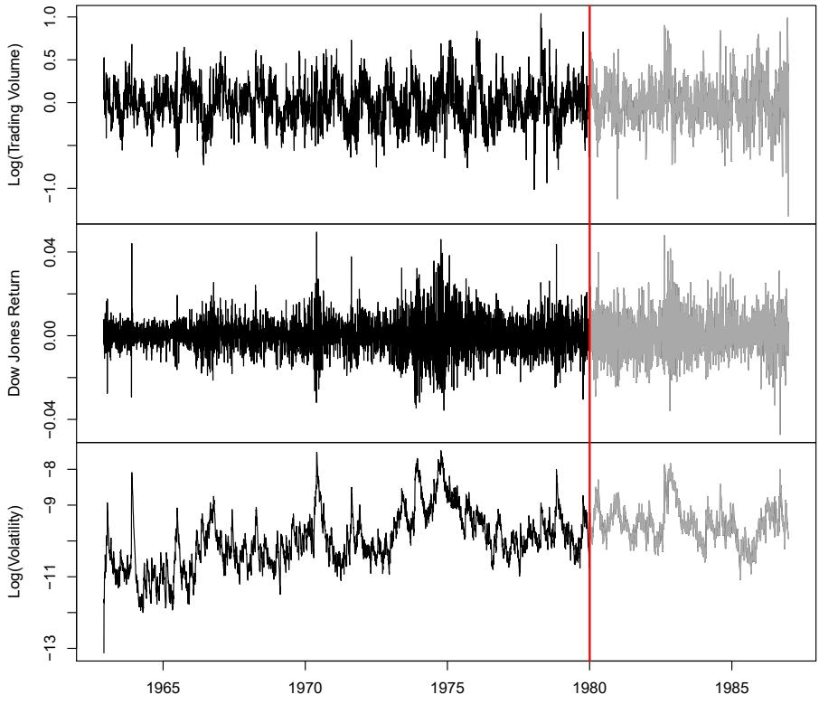

<details>
<summary>line</summary>

| Year | Log(Trading Volume) | Dow Jones Return | Log(Volatility) |
| --- | --- | --- | --- |
| 1963 | ~0.0 | ~0.0 | ~-11.0 |
| 1965 | ~0.0 | ~0.0 | ~-11.5 |
| 1970 | ~0.0 | ~0.0 | ~-10.0 |
| 1975 | ~0.0 | ~0.0 | ~-9.0 |
| 1980 | ~0.0 | ~0.0 | ~-9.0 |
| 1985 | ~0.0 | ~0.0 | ~-9.5 |
</details>

FIGURE 10.14. Historical trading statistics from the New York Stock Exchange. Daily values of the normalized log trading volume, DJIA return, and log volatility are shown for a 24-year period from 1962–1986. We wish to predict trading volume on any day, given the history on all earlier days. To the left of the red bar (January 2, 1980) is training data, and to the right test data.

- Log trading volume. This is the fraction of all outstanding shares that are traded on that day, relative to a 100-day moving average of past turnover, on the log scale.  
- Dow Jones return. This is the difference between the log of the Dow Jones Industrial Index on consecutive trading days.  
- Log volatility. This is based on the absolute values of daily price movements.

Predicting stock prices is a notoriously hard problem, but it turns out that predicting trading volume based on recent past history is more manageable (and is useful for planning trading strategies).

An observation here consists of the measurements $(v_{t}, r_{t}, z_{t})$ on day t, in this case the values for $\log\_volume$ , $DJ\_return$ and $\log\_volatility$ . There are a total of T = 6,051 such triples, each of which is plotted as a time series in Figure 10.14. One feature that strikes us immediately is that the day-to-day observations are not independent of each other. The series exhibit auto-correlation — in this case values nearby in time tend to be similar to each other. This distinguishes time series from other data sets we have encountered, in which observations can be assumed to be independent of

auto-correlation

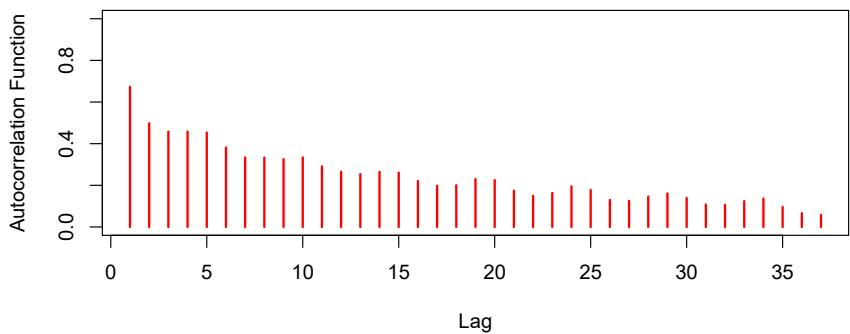

<details>
<summary>bar</summary>

| Lag | Autocorrelation Function |
| --- | --- |
| 1 | ~0.65 |
| 2 | ~0.50 |
| 3 | ~0.45 |
| 4 | ~0.45 |
| 5 | ~0.45 |
| 6 | ~0.38 |
| 7 | ~0.32 |
| 8 | ~0.32 |
| 9 | ~0.32 |
| 10 | ~0.32 |
| 11 | ~0.28 |
| 12 | ~0.25 |
| 13 | ~0.25 |
| 14 | ~0.25 |
| 15 | ~0.25 |
| 16 | ~0.22 |
| 17 | ~0.20 |
| 18 | ~0.20 |
| 19 | ~0.22 |
| 20 | ~0.22 |
| 21 | ~0.18 |
| 22 | ~0.15 |
| 23 | ~0.15 |
| 24 | ~0.18 |
| 25 | ~0.18 |
| 26 | ~0.15 |
| 27 | ~0.15 |
| 28 | ~0.15 |
| 29 | ~0.18 |
| 30 | ~0.15 |
| 31 | ~0.12 |
| 32 | ~0.12 |
| 33 | ~0.12 |
| 34 | ~0.15 |
| 35 | ~0.12 |
| 36 | ~0.08 |
| 37 | ~0.08 |
</details>

FIGURE 10.15. The autocorrelation function for log\_volume. We see that nearby values are fairly strongly correlated, with correlations above 0.2 as far as 20 days apart.

each other. To be clear, consider pairs of observations $(v_{t}, v_{t-\ell})$ , a lag of $\ell$ days apart. If we take all such pairs in the $v_{t}$ series and compute their correlation coefficient, this gives the autocorrelation at lag $\ell$ . Figure 10.15 shows the autocorrelation function for all lags up to 37, and we see considerable correlation.

Another interesting characteristic of this forecasting problem is that the response variable $v_{t}$ — $\log\_volume$ — is also a predictor! In particular, we will use the past values of $\log\_volume$ to predict values in the future.

# RNN forecaster

We wish to predict a value $v_{t}$ from past values $v_{t-1}, v_{t-2}, \ldots$ , and also to make use of past values of the other series $r_{t-1}, r_{t-2}, \ldots$ and $z_{t-1}, z_{t-2}, \ldots$ . Although our combined data is quite a long series with 6,051 trading days, the structure of the problem is different from the previous document-classification example.

• We only have one series of data, not 25,000.  
- We have an entire series of targets $v_{t}$ , and the inputs include past values of this series.

How do we represent this problem in terms of the structure displayed in Figure 10.12? The idea is to extract many short mini-series of input sequences $X = \{X_{1}, X_{2}, \ldots, X_{L}\}$ with a predefined length $L$ (called the lag in this context), and a corresponding target $Y$ . They have the form

$$
X _ {1} = \left( \begin{array}{c} v _ {t - L} \\ r _ {t - L} \\ z _ {t - L} \end{array} \right), X _ {2} = \left( \begin{array}{c} v _ {t - L + 1} \\ r _ {t - L + 1} \\ z _ {t - L + 1} \end{array} \right), \dots , X _ {L} = \left( \begin{array}{c} v _ {t - 1} \\ r _ {t - 1} \\ z _ {t - 1} \end{array} \right), \text {and} Y = v _ {t}. \tag {10.20}
$$

So here the target Y is the value of $\log\_volume\ v_{t}$ at a single timepoint t, and the input sequence X is the series of 3-vectors $\{X_{\ell}\}_{1}^{L}$ each consisting of the three measurements $\log\_volume$ , DJ\_return and $\log\_volatility$ from day t - L, $t - L + 1$ , up to t - 1. Each value of t makes a separate $(X, Y)$ pair, for t running from $L + 1$ to T. For the NYSE data we will use the past

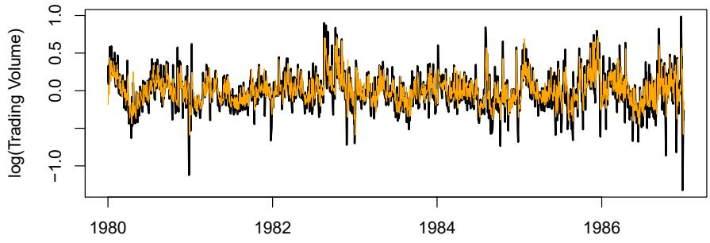

<details>
<summary>line</summary>

| Year | Black Line (log Trading Volume) | Orange Line (log Trading Volume) |
| --- | --- | --- |
| 1980 | ~0.3 | ~0.3 |
| 1981 | ~-0.2 | ~-0.1 |
| 1982 | ~0.0 | ~0.0 |
| 1983 | ~0.1 | ~0.1 |
| 1984 | ~0.0 | ~0.0 |
| 1985 | ~0.0 | ~0.0 |
| 1986 | ~0.0 | ~0.0 |
| 1987 | ~0.0 | ~0.0 |
</details>

FIGURE 10.16. RNN forecast of log\_volume on the NYSE test data. The black lines are the true volumes, and the superimposed orange the forecasts. The forecasted series accounts for 42% of the variance of log\_volume.

five trading days to predict the next day's trading volume. Hence, we use $L = 5$ . Since $T = 6,051$ , we can create 6,046 such $(X,Y)$ pairs. Clearly $L$ is a parameter that should be chosen with care, perhaps using validation data.

We fit this model with K = 12 hidden units using the 4,281 training sequences derived from the data before January 2, 1980 (see Figure 10.14), and then used it to forecast the 1,770 values of $\log\_volume$ after this date. We achieve an $R^{2} = 0.42$ on the test data. Details are given in Section 10.9.6. As a straw man, $^{19}$ using yesterday's value for $\log\_volume$ as the prediction for today has $R^{2} = 0.18$ . Figure 10.16 shows the forecast results. We have plotted the observed values of the daily $\log\_volume$ for the test period 1980–1986 in black, and superimposed the predicted series in orange. The correspondence seems rather good.

In forecasting the value of $\log\_volume$ in the test period, we have to use the test data itself in forming the input sequences X. This may feel like cheating, but in fact it is not; we are always using past data to predict the future.

# Autoregression

The RNN we just fit has much in common with a traditional autoregression (AR) linear model, which we present now for comparison. We first consider the response sequence $v_{t}$ alone, and construct a response vector y and a matrix M of predictors for least squares regression as follows:

$$
\mathbf {y} = \left[ \begin{array}{c} v _ {L + 1} \\ v _ {L + 2} \\ v _ {L + 3} \\ \vdots \\ v _ {T} \end{array} \right] \quad \mathbf {M} = \left[ \begin{array}{c c c c c} 1 & v _ {L} & v _ {L - 1} & \dots & v _ {1} \\ 1 & v _ {L + 1} & v _ {L} & \dots & v _ {2} \\ 1 & v _ {L + 2} & v _ {L + 1} & \dots & v _ {3} \\ \vdots & \vdots & \vdots & \ddots & \vdots \\ 1 & v _ {T - 1} & v _ {T - 2} & \dots & v _ {T - L} \end{array} \right]. \tag {10.21}
$$

M and y each have T - L rows, one per observation. We see that the predictors for any given response $v_{t}$ on day t are the previous L values

auto-
regression

of the same series. Fitting a regression of $\mathbf{y}$ on $\mathbf{M}$ amounts to fitting the model

$$
\hat {v} _ {t} = \hat {\beta} _ {0} + \hat {\beta} _ {1} v _ {t - 1} + \hat {\beta} _ {2} v _ {t - 2} + \dots + \hat {\beta} _ {L} v _ {t - L}, \tag {10.22}
$$

and is called an order-L autoregressive model, or simply AR(L). For the NYSE data we can include lagged versions of DJ\_return and log\_volatility, $r_{t}$ and $z_{t}$ , in the predictor matrix M, resulting in $3L + 1$ columns. An AR model with L = 5 achieves a test $R^{2}$ of 0.41, slightly inferior to the 0.42 achieved by the RNN.

Of course the RNN and AR models are very similar. They both use the same response Y and input sequences X of length L = 5 and dimension p = 3 in this case. The RNN processes this sequence from left to right with the same weights W (for the input layer), while the AR model simply treats all L elements of the sequence equally as a vector of $L \times p$ predictors — a process called flattening in the neural network literature. Of course the RNN also includes the hidden layer activations $A_{\ell}$ which transfer information along the sequence, and introduces additional nonlinearity. From (10.19) with K = 12 hidden units, we see that the RNN has $13 + 12 \times (1 + 3 + 12) = 205$ parameters, compared to the 16 for the AR(5) model.

An obvious extension of the AR model is to use the set of lagged predictors as the input vector to an ordinary feedforward neural network (10.1), and hence add more flexibility. This achieved a test $R^{2} = 0.42$ , slightly better than the linear AR, and the same as the RNN.

All the models can be improved by including the variable day\_of\_week corresponding to the day $t$ of the target $v_{t}$ (which can be learned from the calendar dates supplied with the data); trading volume is often higher on Mondays and Fridays. Since there are five trading days, this one-hot encodes to five binary variables. The performance of the AR model improved to $R^2 = 0.46$ as did the RNN, and the nonlinear AR model improved to $R^2 = 0.47$ .

We used the most simple version of the RNN in our examples here. Additional experiments with the LSTM extension of the RNN yielded small improvements, typically of up to 1% in $R^{2}$ in these examples.

We give details of how we fit all three models in Section 10.9.6.

# 10.5.3 Summary of RNNs

We have illustrated RNNs through two simple use cases, and have only scratched the surface.

There are many variations and enhancements of the simple RNN we used for sequence modeling. One approach we did not discuss uses a one-dimensional convolutional neural network, treating the sequence of vectors (say words, as represented in the embedding space) as an image. The convolution filter slides along the sequence in a one-dimensional fashion, with the potential to learn particular phrases or short subsequences relevant to the learning task.

One can also have additional hidden layers in an RNN. For example, with two hidden layers, the sequence $A_{\ell}$ is treated as an input sequence to the next hidden layer in an obvious fashion.

The RNN we used scanned the document from beginning to end; alternative bidirectional RNNs scan the sequences in both directions.

In language translation the target is also a sequence of words, in a language different from that of the input sequence. Both the input sequence and the target sequence are represented by a structure similar to Figure 10.12, and they share the hidden units. In this so-called Seq2Seq learning, the hidden units are thought to capture the semantic meaning of the sentences. Some of the big breakthroughs in language modeling and translation resulted from the relatively recent improvements in such RNNs.

Algorithms used to fit RNNs can be complex and computationally costly. Fortunately, good software protects users somewhat from these complexities, and makes specifying and fitting these models relatively painless. Many of the models that we enjoy in daily life (like Google Translate) use state-of-the-art architectures developed by teams of highly skilled engineers, and have been trained using massive computational and data resources.

# 10.6 When to Use Deep Learning

The performance of deep learning in this chapter has been rather impressive. It nailed the digit classification problem, and deep CNNs have really revolutionized image classification. We see daily reports of new success stories for deep learning. Many of these are related to image classification tasks, such as machine diagnosis of mammograms or digital X-ray images, ophthalmology eye scans, annotations of MRI scans, and so on. Likewise there are numerous successes of RNNs in speech and language translation, forecasting, and document modeling. The question that then begs an answer is: should we discard all our older tools, and use deep learning on every problem with data? To address this question, we revisit our Hitters dataset from Chapter 6.

This is a regression problem, where the goal is to predict the Salary of a baseball player in 1987 using his performance statistics from 1986. After removing players with missing responses, we are left with 263 players and 19 variables. We randomly split the data into a training set of 176 players (two thirds), and a test set of 87 players (one third). We used three methods for fitting a regression model to these data.

- A linear model was used to fit the training data, and make predictions on the test data. The model has 20 parameters.  
- The same linear model was fit with lasso regularization. The tuning parameter was selected by 10-fold cross-validation on the training data. It selected a model with 12 variables having nonzero coefficients.  
- A neural network with one hidden layer consisting of 64 ReLU units was fit to the data. This model has 1,345 parameters. $^{20}$

<table><tr><td>Model</td><td># Parameters</td><td>Mean Abs. Error</td><td>Test Set  $R^{2}$ </td></tr><tr><td>Linear Regression</td><td>20</td><td>254.7</td><td>0.56</td></tr><tr><td>Lasso</td><td>12</td><td>252.3</td><td>0.51</td></tr><tr><td>Neural Network</td><td>1345</td><td>257.4</td><td>0.54</td></tr></table>

TABLE 10.2. Prediction results on the Hitters test data for linear models fit by ordinary least squares and lasso, compared to a neural network fit by stochastic gradient descent with dropout regularization.

<table><tr><td></td><td>Coefficient</td><td>Std. error</td><td>t-statistic</td><td>p-value</td></tr><tr><td>Intercept</td><td>-226.67</td><td>86.26</td><td>-2.63</td><td>0.0103</td></tr><tr><td>Hits</td><td>3.06</td><td>1.02</td><td>3.00</td><td>0.0036</td></tr><tr><td>Walks</td><td>0.181</td><td>2.04</td><td>0.09</td><td>0.9294</td></tr><tr><td>CRuns</td><td>0.859</td><td>0.12</td><td>7.09</td><td>&lt; 0.0001</td></tr><tr><td>PutOuts</td><td>0.465</td><td>0.13</td><td>3.60</td><td>0.0005</td></tr></table>

TABLE 10.3. Least squares coefficient estimates associated with the regression of Salary on four variables chosen by lasso on the Hitters data set. This model achieved the best performance on the test data, with a mean absolute error of 224.8. The results reported here were obtained from a regression on the test data, which was not used in fitting the lasso model.

Table 10.2 compares the results. We see similar performance for all three models. We report the mean absolute error on the test data, as well as the test $R^{2}$ for each method, which are all respectable (see Exercise 5). We spent a fair bit of time fiddling with the configuration parameters of the neural network to achieve these results. It is possible that if we were to spend more time, and got the form and amount of regularization just right, that we might be able to match or even outperform linear regression and the lasso. But with great ease we obtained linear models that work well. Linear models are much easier to present and understand than the neural network, which is essentially a black box. The lasso selected 12 of the 19 variables in making its prediction. So in cases like this we are much better off following the Occam's razor principle: when faced with several methods that give roughly equivalent performance, pick the simplest.

After a bit more exploration with the lasso model, we identified an even simpler model with four variables. We then refit the linear model with these four variables to the training data (the so-called relaxed lasso), and achieved a test mean absolute error of 224.8, the overall winner! It is tempting to present the summary table from this fit, so we can see coefficients and p-values; however, since the model was selected on the training data, there would be selection bias. Instead, we refit the model on the test data, which was not used in the selection. Table 10.3 shows the results.

We have a number of very powerful tools at our disposal, including neural networks, random forests and boosting, support vector machines and generalized additive models, to name a few. And then we have linear models, and simple variants of these. When faced with new data modeling and prediction problems, it's tempting to always go for the trendy new methods. Often they give extremely impressive results, especially when the datasets are very large and can support the fitting of high-dimensional nonlinear models. However, if we can produce models with the simpler tools that

perform as well, they are likely to be easier to fit and understand, and potentially less fragile than the more complex approaches. Wherever possible, it makes sense to try the simpler models as well, and then make a choice based on the performance/complexity tradeoff.

Typically we expect deep learning to be an attractive choice when the sample size of the training set is extremely large, and when interpretability of the model is not a high priority.

# 10.7 Fitting a Neural Network

Fitting neural networks is somewhat complex, and we give a brief overview here. The ideas generalize to much more complex networks. Readers who find this material challenging can safely skip it. Fortunately, as we see in the lab at the end of this chapter, good software is available to fit neural network models in a relatively automated way, without worrying about the technical details of the model-fitting procedure.

We start with the simple network depicted in Figure 10.1 in Section 10.1. In model (10.1) the parameters are $\beta = (\beta_{0}, \beta_{1}, \ldots, \beta_{K})$ , as well as each of the $w_{k} = (w_{k0}, w_{k1}, \ldots, w_{kp})$ , $k = 1, \ldots, K$ . Given observations $(x_{i}, y_{i})$ , $i = 1, \ldots, n$ , we could fit the model by solving a nonlinear least squares problem

$$
\underset {\{w _ {k} \} _ {1} ^ {K}, \beta} {\text {minimize}} \frac {1}{2} \sum_ {i = 1} ^ {n} (y _ {i} - f (x _ {i})) ^ {2}, \tag {10.23}
$$

where

$$
f (x _ {i}) = \beta_ {0} + \sum_ {k = 1} ^ {K} \beta_ {k} g \Big (w _ {k 0} + \sum_ {j = 1} ^ {p} w _ {k j} x _ {i j} \Big). \tag {10.24}
$$

The objective in $(10.23)$ looks simple enough, but because of the nested arrangement of the parameters and the symmetry of the hidden units, it is not straightforward to minimize. The problem is nonconvex in the parameters, and hence there are multiple solutions. As an example, Figure 10.17 shows a simple nonconvex function of a single variable $\theta$ ; there are two solutions: one is a local minimum and the other is a global minimum. Furthermore, $(10.1)$ is the very simplest of neural networks; in this chapter we have presented much more complex ones where these problems are compounded. To overcome some of these issues and to protect from overfitting, two general strategies are employed when fitting neural networks.

- Slow Learning: the model is fit in a somewhat slow iterative fashion, using gradient descent. The fitting process is then stopped when overfitting is detected.  
- Regularization: penalties are imposed on the parameters, usually lasso or ridge as discussed in Section 6.2.

Suppose we represent all the parameters in one long vector $\theta$ . Then we can rewrite the objective in (10.23) as

$$
R (\theta) = \frac {1}{2} \sum_ {i = 1} ^ {n} (y _ {i} - f _ {\theta} (x _ {i})) ^ {2}, \tag {10.25}
$$


<details>
<summary>line</summary>

| Point | \(\theta\) | \(R(\theta)\) |
| --- | --- | --- |
| \(R(\theta^{0})\) | ~0.3 | ~2.1 |
| \(R(\theta^{1})\) | ~0.45 | ~1.9 |
| \(R(\theta^{2})\) | ~0.7 | ~1.2 |
| \(R(\theta^{7})\) | 1.0 | ~0.5 |
</details>

FIGURE 10.17. Illustration of gradient descent for one-dimensional $\theta$ . The objective function $R(\theta)$ is not convex, and has two minima, one at $\theta = -0.46$ (local), the other at $\theta = 1.02$ (global). Starting at some value $\theta^{0}$ (typically randomly chosen), each step in $\theta$ moves downhill — against the gradient — until it cannot go down any further. Here gradient descent reached the global minimum in 7 steps.

where we make explicit the dependence of f on the parameters. The idea of gradient descent is very simple.

1. Start with a guess $\theta^0$ for all the parameters in $\theta$ , and set $t = 0$ .  
2. Iterate until the objective (10.25) fails to decrease:

(a) Find a vector $\delta$ that reflects a small change in $\theta$ , such that $\theta^{t + 1} = \theta^t + \delta$ reduces the objective; i.e. such that $R(\theta^{t + 1}) < R(\theta^t)$ .  
(b) Set $t \leftarrow t + 1$ .

One can visualize (Figure 10.17) standing in a mountainous terrain, and the goal is to get to the bottom through a series of steps. As long as each step goes downhill, we must eventually get to the bottom. In this case we were lucky, because with our starting guess $\theta^{0}$ we end up at the global minimum. In general we can hope to end up at a (good) local minimum.

# 10.7.1 Backpropagation

How do we find the directions to move $\theta$ so as to decrease the objective $R(\theta)$ in (10.25)? The gradient of $R(\theta)$ , evaluated at some current value $\theta = \theta^{m}$ , is the vector of partial derivatives at that point:

$$
\nabla R (\theta^ {m}) = \frac {\partial R (\theta)}{\partial \theta} \Big | _ {\theta = \theta^ {m}}. \tag {10.26}
$$

The subscript $\theta = \theta^{m}$ means that after computing the vector of derivatives, we evaluate it at the current guess, $\theta^{m}$ . This gives the direction in $\theta$ -space in which $R(\theta)$ increases most rapidly. The idea of gradient descent is to move $\theta$ a little in the opposite direction (since we wish to go downhill):

$$
\theta^ {m + 1} \leftarrow \theta^ {m} - \rho \nabla R (\theta^ {m}). \tag {10.27}
$$

For a small enough value of the learning rate $\rho$ , this step will decrease the objective $R(\theta)$ ; i.e. $R(\theta^{m+1}) \leq R(\theta^{m})$ . If the gradient vector is zero, then we may have arrived at a minimum of the objective.

How complicated is the calculation (10.26)? It turns out that it is quite simple here, and remains simple even for much more complex networks, because of the chain rule of differentiation.

Since $R(\theta) = \sum_{i=1}^{n} R_i(\theta) = \frac{1}{2} \sum_{i=1}^{n} (y_i - f_\theta(x_i))^2$ is a sum, its gradient is also a sum over the $n$ observations, so we will just examine one of these terms,

$$
R _ {i} (\theta) = \frac {1}{2} \Big (y _ {i} - \beta_ {0} - \sum_ {k = 1} ^ {K} \beta_ {k} g \big (w _ {k 0} + \sum_ {j = 1} ^ {p} w _ {k j} x _ {i j} \big) \Big) ^ {2}. \tag {10.28}
$$

To simplify the expressions to follow, we write $z_{ik} = w_{k0} + \sum_{j=1}^{p} w_{kj} x_{ij}$ . First we take the derivative with respect to $\beta_{k}$ :

$$
\begin{array}{l} \frac {\partial R _ {i} (\theta)}{\partial \beta_ {k}} = \frac {\partial R _ {i} (\theta)}{\partial f _ {\theta} (x _ {i})} \cdot \frac {\partial f _ {\theta} (x _ {i})}{\partial \beta_ {k}} \\ = - (y _ {i} - f _ {\theta} (x _ {i})) \cdot g (z _ {i k}). \tag {10.29} \\ \end{array}
$$

And now we take the derivative with respect to $w_{kj}$ :

$$
\begin{array}{l} \frac {\partial R _ {i} (\theta)}{\partial w _ {k j}} = \frac {\partial R _ {i} (\theta)}{\partial f _ {\theta} (x _ {i})} \cdot \frac {\partial f _ {\theta} (x _ {i})}{\partial g (z _ {i k})} \cdot \frac {\partial g (z _ {i k})}{\partial z _ {i k}} \cdot \frac {\partial z _ {i k}}{\partial w _ {k j}} \\ = - (y _ {i} - f _ {\theta} (x _ {i})) \cdot \beta_ {k} \cdot g ^ {\prime} (z _ {i k}) \cdot x _ {i j}. \tag {10.30} \\ \end{array}
$$

Notice that both these expressions contain the residual $y_{i} - f_{\theta}(x_{i})$ . In (10.29) we see that a fraction of that residual gets attributed to each of the hidden units according to the value of $g(z_{ik})$ . Then in (10.30) we see a similar attribution to input j via hidden unit k. So the act of differentiation assigns a fraction of the residual to each of the parameters via the chain rule — a process known as backpropagation in the neural network literature. Although these calculations are straightforward, it takes careful bookkeeping to keep track of all the pieces.

learning rate

chain rule

backprop-
agation

# 10.7.2 Regularization and Stochastic Gradient Descent

Gradient descent usually takes many steps to reach a local minimum. In practice, there are a number of approaches for accelerating the process. Also, when n is large, instead of summing $(10.29)-(10.30)$ over all n observations, we can sample a small fraction or minibatch of them each time we compute a gradient step. This process is known as stochastic gradient descent (SGD) and is the state of the art for learning deep neural networks. Fortunately, there is very good software for setting up deep learning models, and for fitting them to data, so most of the technicalities are hidden from the user.

We now turn to the multilayer network (Figure 10.4) used in the digit recognition problem. The network has over 235,000 weights, which is around four times the number of training examples. Regularization is essential here

minibatch

stochastic
gradient
descent

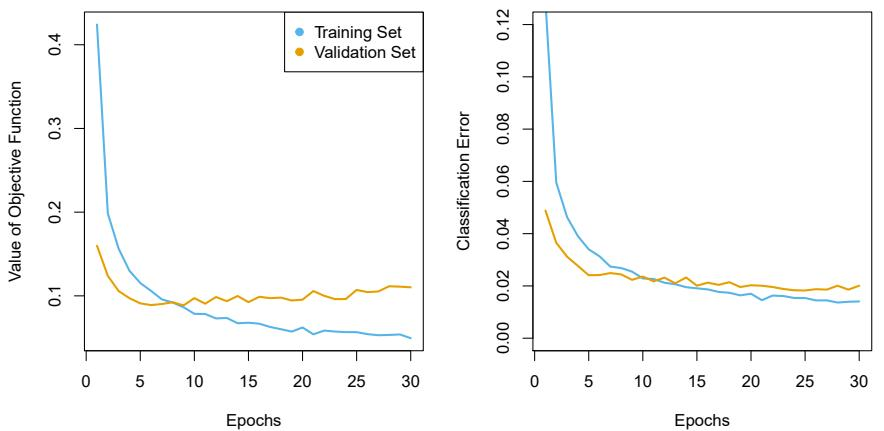  
FIGURE 10.18. Evolution of training and validation errors for the MNIST neural network depicted in Figure 10.4, as a function of training epochs. The objective refers to the log-likelihood (10.14).

to avoid overfitting. The first row in Table 10.1 uses ridge regularization on the weights. This is achieved by augmenting the objective function (10.14) with a penalty term:

$$
R (\theta ; \lambda) = - \sum_ {i = 1} ^ {n} \sum_ {m = 0} ^ {9} y _ {i m} \log (f _ {m} (x _ {i})) + \lambda \sum_ {j} \theta_ {j} ^ {2}. \tag {10.31}
$$

The parameter $\lambda$ is often preset at a small value, or else it is found using the validation-set approach of Section 5.3.1. We can also use different values of $\lambda$ for the groups of weights from different layers; in this case $W_{1}$ and $W_{2}$ were penalized, while the relatively few weights B of the output layer were not penalized at all. Lasso regularization is also popular as an additional form of regularization, or as an alternative to ridge.

Figure 10.18 shows some metrics that evolve during the training of the network on the MNIST data. It turns out that SGD naturally enforces its own form of approximately quadratic regularization. $^{21}$ Here the minibatch size was 128 observations per gradient update. The term epochs labeling the horizontal axis in Figure 10.18 counts the number of times an equivalent of the full training set has been processed. For this network, 20% of the 60,000 training observations were used as a validation set in order to determine when training should stop. So in fact 48,000 observations were used for training, and hence there are $48,000/128 \approx 375$ minibatch gradient updates per epoch. We see that the value of the validation objective actually starts to increase by 30 epochs, so early stopping can also be used as an additional form of regularization.

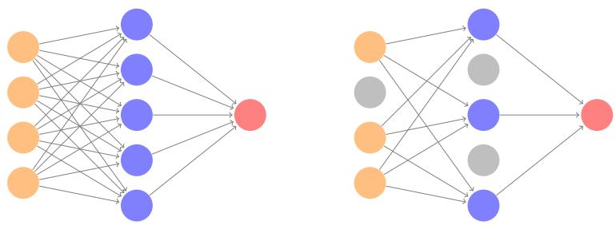  
FIGURE 10.19. Dropout Learning. Left: a fully connected network. Right: network with dropout in the input and hidden layer. The nodes in grey are selected at random, and ignored in an instance of training.

# 10.7.3 Dropout Learning

The second row in Table 10.1 is labeled dropout. This is a relatively new and efficient form of regularization, similar in some respects to ridge regularization. Inspired by random forests (Section 8.2), the idea is to randomly remove a fraction $\phi$ of the units in a layer when fitting the model. Figure 10.19 illustrates this. This is done separately each time a training observation is processed. The surviving units stand in for those missing, and their weights are scaled up by a factor of $1/(1-\phi)$ to compensate. This prevents nodes from becoming over-specialized, and can be seen as a form of regularization. In practice dropout is achieved by randomly setting the activations for the “dropped out” units to zero, while keeping the architecture intact.

# 10.7.4 Network Tuning

The network in Figure 10.4 is considered to be relatively straightforward; it nevertheless requires a number of choices that all have an effect on the performance:

- The number of hidden layers, and the number of units per layer. Modern thinking is that the number of units per hidden layer can be large, and overfitting can be controlled via the various forms of regularization.  
- Regularization tuning parameters. These include the dropout rate $\phi$ and the strength $\lambda$ of lasso and ridge regularization, and are typically set separately at each layer.  
- Details of stochastic gradient descent. These include the batch size, the number of epochs, and if used, details of data augmentation (Section 10.3.4.)

Choices such as these can make a difference. In preparing this MNIST example, we achieved a respectable 1.8% misclassification error after some trial and error. Finer tuning and training of a similar network can get under 1% error on these data, but the tinkering process can be tedious, and can result in overfitting if done carelessly.


<details>
<summary>line</summary>

| Degrees of Freedom | Training Error | Test Error |
| --- | --- | --- |
| 2 | ~0.68 | ~0.58 |
| 4 | ~0.14 | ~0.18 |
| 6 | ~0.11 | ~0.15 |
| 8 | ~0.08 | ~0.11 |
| 10 | ~0.08 | ~0.18 |
| 12 | ~0.07 | ~0.15 |
| 14 | ~0.07 | ~0.15 |
| 16 | ~0.05 | ~0.43 |
| 18 | ~0.01 | — |
| 20 | 0 | — |
| 22 | 0 | ~1.95 |
| 24 | 0 | ~1.62 |
| 26 | 0 | ~0.57 |
| 28 | 0 | ~0.77 |
| 30 | 0 | ~0.39 |
| 32 | 0 | ~0.34 |
| 34 | 0 | ~0.28 |
| 36 | 0 | ~0.30 |
| 38 | 0 | ~0.27 |
| 40 | 0 | ~0.28 |
| 42 | 0 | ~0.29 |
| 44 | 0 | ~0.30 |
| 46 | 0 | ~0.31 |
| 48 | 0 | ~0.32 |
| 50 | 0 | ~0.33 |
| 52 | 0 | ~0.34 |
| 54 | 0 | ~0.35 |
| 56 | 0 | ~0.36 |
| 58 | 0 | ~0.37 |
| 60 | 0 | ~0.38 |
| 62 | 0 | ~0.39 |
| 64 | 0 | ~0.40 |
| 66 | 0 | ~0.41 |
| 68 | 0 | ~0.42 |
| 70 | 0 | ~0.43 |
| 72 | 0 | ~0.44 |
| 74 | 0 | ~0.45 |
| 76 | 0 | ~0.46 |
| 78 | 0 | ~0.47 |
| 80 | 0 | ~0.48 |
</details>

FIGURE 10.20. Double descent phenomenon, illustrated using error plots for a one-dimensional natural spline example. The horizontal axis refers to the number of spline basis functions on the log scale. The training error hits zero when the degrees of freedom coincide with the sample size n = 20, the “interpolation threshold”, and remains zero thereafter. The test error increases dramatically at this threshold, but then descends again to a reasonable value before finally increasing again.

# 10.8 Interpolation and Double Descent

Throughout this book, we have repeatedly discussed the bias-variance trade-off, first presented in Section 2.2.2. This trade-off indicates that statistical learning methods tend to perform the best, in terms of test-set error, for an intermediate level of model complexity. In particular, if we plot “flexibility” on the x-axis and error on the y-axis, then we generally expect to see that test error has a U-shape, whereas training error decreases monotonically. Two “typical” examples of this behavior can be seen in the right-hand panel of Figure 2.9 on page 29, and in Figure 2.17 on page 39. One implication of the bias-variance trade-off is that it is generally not a good idea to interpolate the training data — that is, to get zero training error — since that will often result in very high test error.

However, it turns out that in certain specific settings it can be possible for a statistical learning method that interpolates the training data to perform well — or at least, better than a slightly less complex model that does not quite interpolate the data. This phenomenon is known as double descent, and is displayed in Figure 10.20. “Double descent” gets its name from the fact that the test error has a U-shape before the interpolation threshold is reached, and then it descends again (for a while, at least) as an increasingly flexible model is fit.

We now describe the set-up that resulted in Figure 10.20. We simulated $n = 20$ observations from the model

$$
Y = \sin (X) + \epsilon ,
$$

where $X \sim U[-5, 5]$ (uniform distribution), and $\epsilon \sim N(0, \sigma^2)$ with $\sigma = 0.3$ . We then fit a natural spline to the data, as described in Section 7.4, with $d$

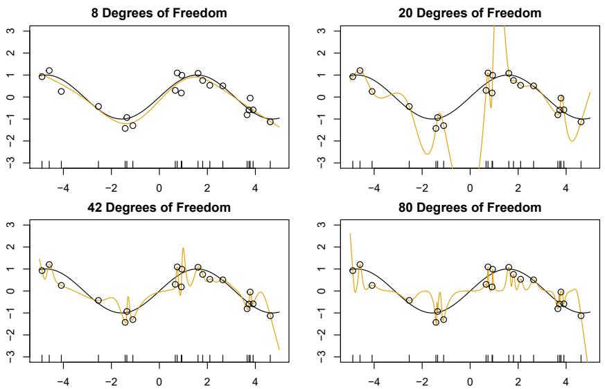  
FIGURE 10.21. Fitted functions $\hat{f}_{d}(X)$ (orange), true function $f(X)$ (black) and the observed 20 training data points. A different value of d (degrees of freedom) is used in each panel. For $d \geq 20$ the orange curves all interpolate the training points, and hence the training error is zero.

degrees of freedom. $^{22}$ Recall from Section 7.4 that fitting a natural spline with d degrees of freedom amounts to fitting a least-squares regression of the response onto a set of d basis functions. The upper-left panel of Figure 10.21 shows the data, the true function $f(X)$ , and $\hat{f}_{8}(X)$ , the fitted natural spline with d = 8 degrees of freedom.

Next, we fit a natural spline with d = 20 degrees of freedom. Since n = 20, this means that n = d, and we have zero training error; in other words, we have interpolated the training data! We can see from the top-right panel of Figure 10.21 that $\hat{f}_{20}(X)$ makes wild excursions, and hence the test error will be large.

We now continue to fit natural splines to the data, with increasing values of d. For d > 20, the least squares regression of Y onto d basis functions is not unique: there are an infinite number of least squares coefficient estimates that achieve zero error. To select among them, we choose the one with the smallest sum of squared coefficients, $\sum_{j=1}^{d}\hat{\beta}_{j}^{2}$ . This is known as the minimum-norm solution.

The two lower panels of Figure 10.21 show the minimum-norm natural spline fits with $d = 42$ and $d = 80$ degrees of freedom. Incredibly, $\hat{f}_{42}(X)$ is quite a bit less less wild than $\hat{f}_{20}(X)$ , even though it makes use of more degrees of freedom. And $\hat{f}_{80}(X)$ is not much different. How can this be? Essentially, $\hat{f}_{20}(X)$ is very wild because there is just a single way to interpolate $n = 20$ observations using $d = 20$ basis functions, and that single way results in a somewhat extreme fitted function. By contrast, there are an

infinite number of ways to interpolate n = 20 observations using d = 42 or d = 80 basis functions, and the smoothest of them — that is, the minimum norm solution — is much less wild than $\hat{f}_{20}(X)$ !

In Figure 10.20, we display the training error and test error associated with $\hat{f}_{d}(X)$ , for a range of values of the degrees of freedom d. We see that the training error drops to zero once d = 20 and beyond; i.e. once the interpolation threshold is reached. By contrast, the test error shows a U-shape for $d \leq 20$ , grows extremely large around d = 20, and then shows a second region of descent for d > 20. For this example the signal-to-noise ratio $-\operatorname{Var}(f(X))/\sigma^{2}$ — is 5.9, which is quite high (the data points are close to the true curve). So an estimate that interpolates the data and does not wander too far in between the observed data points will likely do well.

In Figures 10.20 and 10.21, we have illustrated the double descent phenomenon in a simple one-dimensional setting using natural splines. However, it turns out that the same phenomenon can arise for deep learning. Basically, when we fit neural networks with a huge number of parameters, we are sometimes able to get good results with zero training error. This is particularly true in problems with high signal-to-noise ratio, such as natural image recognition and language translation, for example. This is because the techniques used to fit neural networks, including stochastic gradient descent, naturally lend themselves to selecting a “smooth” interpolating model that has good test-set performance on these kinds of problems.

Some points are worth emphasizing:

\- The double-descent phenomenon does not contradict the bias-variance trade-off, as presented in Section 2.2.2. Rather, the double-descent curve seen in the right-hand side of Figure 10.20 is a consequence of the fact that the x-axis displays the number of spline basis functions used, which does not properly capture the true “flexibility” of models that interpolate the training data. Stated another way, in this example, the minimum-norm natural spline with d = 42 has lower variance than the natural spline with d = 20.

\- Most of the statistical learning methods seen in this book do not exhibit double descent. For instance, regularization approaches typically do not interpolate the training data, and thus double descent does not occur. This is not a drawback of regularized methods: they can give great results without interpolating the data!

In particular, in the examples here, if we had fit the natural splines using ridge regression with an appropriately-chosen penalty rather than least squares, then we would not have seen double descent, and in fact would have obtained better test error results.

\- In Chapter 9, we saw that maximal margin classifiers and SVMs that have zero training error nonetheless often achieve very good test error. This is in part because those methods seek smooth minimum norm solutions. This is similar to the fact that the minimum-norm natural spline can give good results with zero training error.

\- The double-descent phenomenon has been used by the machine learning community to explain the successful practice of using an over-

parametrized neural network (many layers, and many hidden units), and then fitting all the way to zero training error. However, fitting to zero error is not always optimal, and whether it is advisable depends on the signal-to-noise ratio. For instance, we may use ridge regularization to avoid overfitting a neural network, as in $(10.31)$ . In this case, provided that we use an appropriate choice for the tuning parameter $\lambda$ , we will never interpolate the training data, and thus will not see the double descent phenomenon. Nonetheless we can get very good test-set performance, likely much better than we would have achieved had we interpolated the training data. Early stopping during stochastic gradient descent can also serve as a form of regularization that prevents us from interpolating the training data, while still getting very good results on test data.

To summarize: though double descent can sometimes occur in neural networks, we typically do not want to rely on this behavior. Moreover, it is important to remember that the bias-variance trade-off always holds (though it is possible that test error as a function of flexibility may not exhibit a U-shape, depending on how we have parametrized the notion of “flexibility” on the x-axis).

# 10.9 Lab: Deep Learning

In this section we demonstrate how to fit the examples discussed in the text. We use the Python torch package, along with the pytorch\_lightning package which provides utilities to simplify fitting and evaluating models. This code can be impressively fast with certain special processors, such as Apple's new M1 chip. The package is well-structured, flexible, and will feel comfortable to Python users. A good companion is the site pytorch.org/tutorials. Much of our code is adapted from there, as well as the pytorch\_lightning documentation. $^{23}$

We start with several standard imports that we have seen before.

torch
pytorch\_
lightning

In [1]:  
```python
import numpy as np, pandas as pd
from matplotlib.pyplot import subplots
from sklearn.linear_model import \
    (LinearRegression,
        LogisticRegression,
        Lasso)
from sklearn.preprocessing import StandardScaler
from sklearn.model_selection import KFold
from sklearn.pipeline import Pipeline
from ISLP import load_data
from ISLP.models import ModelSpec as MS
from sklearn.model_selection import \
    (train_test_split,
        GridSearchCV)
```

# Torch-Specific Imports

There are a number of imports for torch. (These are not included with ISLP, so must be installed separately.) First we import the main library and essential tools used to specify sequentially-structured networks.

In [2]:  
```python
import torch
from torch import nn
from torch.optim import RMSprop
from torch.utils.data import TensorDataset
```

There are several other helper packages for torch. For instance, the torchmetrics package has utilities to compute various metrics to evaluate performance when fitting a model. The torchinfo package provides a useful summary of the layers of a model. We use the read\_image() function when loading test images in Section 10.9.4.

```txt
torchmetrics
torchinfo
read_image()
```

In [3]:  
```python
from torchmetrics import (MeanAbsoluteError,
                          R2Score)
from torchinfo import summary
from torchvision.io import read_image
```

The package pytorch\_lightning is a somewhat higher-level interface to torch that simplifies the specification and fitting of models by reducing the amount of boilerplate code needed (compared to using torch alone).

In [4]:  
```python
from pytorch_lightning import Trainer
from pytorch_lightning.loggers import CSVLogger
```

In order to reproduce results we use seed\_everything(). We will also instruct torch to use deterministic algorithms where possible.

```txt
seed_
everything()
```

In [5]:  
```python
from pytorch_lightning.utilities.seed import seed_everything
seed_everything(0, workers=True)
torch.use_deterministic_algorithms(True, warn_only=True)
```

We will use several datasets shipped with torchvision for our examples: a pretrained network for image classification, as well as some transforms used for preprocessing.

```txt
torchvision
```

In [6]:  
```python
from torchvision.datasets import MNIST, CIFAR100
from torchvision.models import (resnet50,
                               ResNet50_Weights)
from torchvision.transforms import (Resize,
                               Normalize,
                               CenterCrop,
                               ToTensor)
```

We have provided a few utilities in ISLP specifically for this lab. The SimpleDataModule and SimpleModule are simple versions of objects used in pytorch\_lightning, the high-level module for fitting torch models. Although more advanced uses such as computing on graphical processing units (GPUs) and parallel data processing are possible in this module, we will not be focusing much on these in this lab. The ErrorTracker handles collections of targets and predictions over each mini-batch in the validation or test stage, allowing computation of the metric over the entire validation or test data set.

```python
In [7]: from ISLP.torch import (SimpleDataModule,
                          SimpleModule,
                          ErrorTracker,
                          rec_num_workers)
```

In addition we have included some helper functions to load the IMDb database, as well as a lookup that maps integers to particular keys in the database. We've included a slightly modified copy of the preprocessed IMDb data from keras, a separate package for fitting deep learning models. This saves us significant preprocessing and allows us to focus on specifying and fitting the models themselves.

```python
from ISLP.torch.imdb import (load_lookup,
                            load_tensor,
                            load_sparse,
                            load_sequential)
```

Finally, we introduce some utility imports not directly related to torch. The glob() function from the glob module is used to find all files matching wildcard characters, which we will use in our example applying the ResNet50 model to some of our own images. The json module will be used to load a JSON file for looking up classes to identify the labels of the pictures in the ResNet50 example.

```txt
In [9]: from glob import glob
import json
```

# 10.9.1 Single Layer Network on Hitters Data

We start by fitting the models in Section 10.6 on the Hitters data.

```python
In [10]: Hitters = load_data('Hitters').dropna()
    n = Hitters.shape[0]
```

We will fit two linear models (least squares and lasso) and compare their performance to that of a neural network. For this comparison we will use mean absolute error on a validation dataset.

$$
\mathrm{MAE} (y, \hat {y}) = \frac {1}{n} \sum_ {i = 1} ^ {n} | y _ {i} - \hat {y} _ {i} |.
$$

We set up the model matrix and the response.

```python
In [11]: model = MS(Hitters.columns.drop('Salary'), intercept=False)
    X = model.fit_transform(Hitters).to_numpy()
    Y = Hitters['Salary'].to_numpy()
```

The to\_numpy() method above converts pandas data frames or series to numpy arrays. We do this because we will need to use sklearn to fit the lasso model, and it requires this conversion. We also use a linear regression method from sklearn, rather than the method in Chapter 3 from statsmodels, to facilitate the comparisons.

We now split the data into test and training, fixing the random state used by sklearn to do the split.

to\_numpy()

In [12]:

```txt
(X_train,
X_test,
Y_train,
Y_test) = train_test_split(X,
                          Y,
                          test_size=1/3,
                          random_state=1)
```

# Linear Models

We fit the linear model and evaluate the test error directly.

In [13]:

```txt
hit_lm = LinearRegression().fit(X_train, Y_train)
Yhat_test = hit_lm.predict(X_test)
np.abs(Yhat_test - Y_test).mean()
```

Out[13]: 259.7153

Next we fit the lasso using sklearn. We are using mean absolute error to select and evaluate a model, rather than mean squared error. The specialized solver we used in Section 6.5.2 uses only mean squared error. So here, with a bit more work, we create a cross-validation grid and perform the cross-validation directly.

We encode a pipeline with two steps: we first normalize the features using a StandardScaler() transform, and then fit the lasso without further normalization.

In [14]:

```python
scaler = StandardScaler(with_mean=True, with_std=True)
lasso = Lasso(warm_start=True, max_iter=30000)
standard_lasso = Pipeline(steps=[('scaler', scaler),
                              ('lasso', lasso)])
```

We need to create a grid of values for $\lambda$ . As is common practice, we choose a grid of 100 values of $\lambda$ , uniform on the log scale from lam\_max down to 0.01\*lam\_max. Here lam\_max is the smallest value of $\lambda$ with an all-zero solution. This value equals the largest absolute inner-product between any predictor and the (centered) response. $^{24}$

In [15]:

```python
X_s = scaler.fit_transform(X_train)
n = X_s.shape[0]
lam_max = np.fabs(X_s.T.dot(Y_train - Y_train.mean()).max() / n
param_grid = {'alpha': np.exp(np.linspace(0, np.log(0.01), 100))
* lam_max}
```

Note that we had to transform the data first, since the scale of the variables impacts the choice of $\lambda$ . We now perform cross-validation using this sequence of $\lambda$ values.

In [16]:

```python
cv = KFold(10,
                    shuffle=True,
                    random_state=1)
grid = GridSearchCV(lasso,
```

```txt
param_grid,
cv=cv,
scoring='neg_mean_absolute_error')
grid.fit(X_train, Y_train);
```

We extract the lasso model with best cross-validated mean absolute error, and evaluate its performance on X\_test and Y\_test, which were not used in cross-validation.

```python
In [17]: trained_lasso = grid.best_estimator_
Yhat_test = trained_lasso.predict(X_test)
np.fabs(Yhat_test - Y_test).mean()
```  
Out[17]:257.2382

This is similar to the results we got for the linear model fit by least squares. However, these results can vary a lot for different train/test splits; we encourage the reader to try a different seed in code block 12 and rerun the subsequent code up to this point.

# Specifying a Network: Classes and Inheritance

To fit the neural network, we first set up a model structure that describes the network. Doing so requires us to define new classes specific to the model we wish to fit. Typically this is done in pytorch by sub-classing a generic representation of a network, which is the approach we take here. Although this example is simple, we will go through the steps in some detail, since it will serve us well for the more complex examples to follow.

```python
class HittersModel(nn.Module):

    def __init__(self, input_size):
        super(HittersModel, self).__init__()
        self.flatten = nn.Flatten()
        self.sequential = nn.Sequential(
            nn.Linear(input_size, 50),
            nn.ReLU(),
            nn.Dropout(0.4),
            nn.Linear(50, 1))

    def forward(self, x):
        x = self.flatten(x)
        return torch.flatten(self.sequential(x))
```

The class statement identifies the code chunk as a declaration for a class HittersModel that inherits from the base class nn.Module. This base class is ubiquitous in torch and represents the mappings in the neural networks.

Indented beneath the class statement are the methods of this class: in this case \_\_init\_\_ and forward. The \_\_init\_\_ method is called when an instance of the class is created as in the cell below. In the methods, self always refers to an instance of the class. In the \_\_init\_\_ method, we have attached two objects to self as attributes: flatten and sequential. These are used in the forward method to describe the map that this module implements.

There is one additional line in the \_\_init\_\_ method, which is a call to super(). This function allows subclasses (i.e. HittersModel) to access methods of the class they inherit from. For example, the class nn.Module has its own \_\_init\_\_ method, which is different from the HittersModel.\_\_init\_\_() method we've written above. Using super() allows us to call the method of the base class. For torch models, we will always be making this super() call as it is necessary for the model to be properly interpreted by torch.

super()

The object nn.Module has more methods than simply \_\_init\_\_ and forward. These methods are directly accessible to HittersModel instances because of this inheritance. One such method we will see shortly is the eval() method, used to disable dropout for when we want to evaluate the model on test data.

```txt
In [19]: hit_model = HittersModel(X.shape[1])
```

The object self.sequential is a composition of four maps. The first maps the 19 features of Hitters to 50 dimensions, introducing $50 \times 19 + 50$ parameters for the weights and intercept of the map (often called the bias). This layer is then mapped to a ReLU layer followed by a 40% dropout layer, and finally a linear map down to 1 dimension, again with a bias. The total number of trainable parameters is therefore $50 \times 19 + 50 + 50 + 1 = 1051$ .

The package torchinfo provides a summary() function that neatly summarizes this information. We specify the size of the input and see the size of each tensor as it passes through layers of the network.

```python
Summary(hit_model,
        input_size=X_train.shape,
        col_names=['input_size',
                      'output_size',
                      'num_params'])
```

<table><tr><td>Layer (type:depth-idx)</td><td>Input Shape</td><td>Output Shape</td><td>Param #</td></tr><tr><td>HittersModel</td><td>[175, 19]</td><td>[175]</td><td>--</td></tr><tr><td>Flatten: 1-1</td><td>[175, 19]</td><td>[175, 19]</td><td>--</td></tr><tr><td>Sequential: 1-2</td><td>[175, 19]</td><td>[175, 1]</td><td>--</td></tr><tr><td>Linear: 2-1</td><td>[175, 19]</td><td>[175, 50]</td><td>1,000</td></tr><tr><td>ReLU: 2-2</td><td>[175, 50]</td><td>[175, 50]</td><td>--</td></tr><tr><td>Dropout: 2-3</td><td>[175, 50]</td><td>[175, 50]</td><td>--</td></tr><tr><td>Linear: 2-4</td><td>[175, 50]</td><td>[175, 1]</td><td>51</td></tr></table>

Total params: 1,051

Trainable params: 1,051

We have truncated the end of the output slightly, here and in subsequent uses.

We now need to transform our training data into a form accessible to torch. The basic datatype in torch is a tensor, which is very similar to an ndarray from early chapters. We also note here that torch typically works with 32-bit (single precision) rather than 64-bit (double precision) floating point numbers. We therefore convert our data to np.float32 before forming the tensor. The X and Y tensors are then arranged into a Dataset

Dataset

recognized by torch using TensorDataset().

In [21]:

```python
X_train_t = torch.tensor(X_train.astype(np.float32))
Y_train_t = torch.tensor(Y_train.astype(np.float32))
hit_train = TensorDataset(X_train_t, Y_train_t)
```

Tensor
Dataset()

We do the same for the test data.

In [22]:

```python
X_test_t = torch.tensor(X_test.astype(np.float32))
Y_test_t = torch.tensor(Y_test.astype(np.float32))
hit_test = TensorDataset(X_test_t, Y_test_t)
```

Finally, this dataset is passed to a DataLoader() which ultimately passes data into our network. While this may seem like a lot of overhead, this structure is helpful for more complex tasks where data may live on different machines, or where data must be passed to a GPU. We provide a helper function SimpleDataModule() in ISLP to make this task easier for standard usage. One of its arguments is num\_workers, which indicates how many processes we will use for loading the data. For small data like Hitters this will have little effect, but it does provide an advantage for the MNIST and CIFAR100 examples below. The torch package will inspect the process running and determine a maximum number of workers. $^{25}$ We've included a function rec\_num\_workers() to compute this so we know how many workers might be reasonable (here the max was 16).

SimpleData
Module()

In [23]:

```python
max_num_workers = rec_num_workers()
```

The general training setup in pytorch\_lightning involves training, validation and test data. These are each represented by different data loaders. During each epoch, we run a training step to learn the model and a validation step to track the error. The test data is typically used at the end of training to evaluate the model.

In this case, as we had split only into test and training, we'll use the test data as validation data with the argument validation=hit\_test. The validation argument can be a float between 0 and 1, an integer, or a Dataset. If a float (respectively, integer), it is interpreted as a percentage (respectively number) of the training observations to be used for validation. If it is a Dataset, it is passed directly to a data loader.

In [24]:

```python
hit_dm = SimpleDataModule(hit_train,
                      hit_test,
                      batch_size=32,
                      num_workers=min(4, max_num_workers),
                      validation=hit_test)
```

Next we must provide a pytorch\_lightning module that controls the steps performed during the training process. We provide methods for our SimpleModule() that simply record the value of the loss function and any additional metrics at the end of each epoch. These operations are controlled by the methods SimpleModule.[training/test/validation]\_step(), though we will not be modifying these in our examples.
```javascript
In [25]: hit_module = SimpleModule.regression(hit_model,
                          metrics={'mae':MeanAbsoluteError()})
```

By using the SimpleModule.regression() method, we indicate that we will use squared-error loss as in $(10.23)$ . We have also asked for mean absolute error to be tracked as well in the metrics that are logged.

We log our results via CSVLogger(), which in this case stores the results in a CSV file within a directory logs/hitters. After the fitting is complete, this allows us to load the results as a pd.DataFrame() and visualize them below. There are several ways to log the results within pytorch\_lightning, though we will not cover those here in detail.

SimpleModule.
regression()

```txt
In [26]: hit_logger = CSVLogger('logs', name='hitters')
```

Finally we are ready to train our model and log the results. We use the Trainer() object from pytorch\_lightning to do this work. The argument datamodule=hit\_dm tells the trainer how training/validation/test logs are produced, while the first argument hit\_module specifies the network architecture as well as the training/validation/test steps. The callbacks argument allows for several tasks to be carried out at various points while training a model. Here our ErrorTracker() callback will enable us to compute validation error while training and, finally, the test error. We now fit the model for 50 epochs.

```python
In [27]: hit_trainer = Trainer(deterministic=True,
                          max_epochs=50,
                          log_every_n_steps=5,
                          logger=hit_logger,
                          callbacks=[ErrorTracker()])
hit_trainer.fit(hit_module, datamodule=hit_dm)
```

At each step of SGD, the algorithm randomly selects 32 training observations for the computation of the gradient. Recall from Section 10.7 that an epoch amounts to the number of SGD steps required to process n observations. Since the training set has n = 175, and we specified a batch\_size of 32 in the construction of hit\_dm, an epoch is 175/32 = 5.5 SGD steps.

After having fit the model, we can evaluate performance on our test data using the test() method of our trainer.

```txt
In [28]: hit_trainer.test(hit_module, datamodule=hit_dm)
```

```txt
Out[28]: [{"test_loss': 104098.5469, 'test_mae': 229.5012}]
```

The results of the fit have been logged into a CSV file. We can find the results specific to this run in the experiment.metrics\_file\_path attribute of our logger. Note that each time the model is fit, the logger will output results into a new subdirectory of our directory logs/hitters.

We now create a plot of the MAE (mean absolute error) as a function of the number of epochs. First we retrieve the logged summaries.

```python
hit_results = pd.read_csv(hit_logger.experiment.metrics_file_path)
```

Since we will produce similar plots in later examples, we write a simple generic function to produce this plot.

In [29]:  
```python
def summary_plot(results,
            ax,
            col='loss',
            valid_legend='Validation',
            training_legend='Training',
            ylabel='Loss',
            fontsize=20):
    for (column,
        color,
        label) in zip([f'train_{col}_epoch',
                      f'veluid_{col}|],
                      ['black',
                      'red'],
                      [training_legend,
                      valid_legend]):
        results.plot(x='epoch',
                      y=column,
                      label=label,
                      marker='o',
                      color=color,
                      ax=ax)
    ax.set_xlabel('Epoch')
    ax.set_ylabel(ylabel)
    return ax
```

We now set up our axes, and use our function to produce the MAE plot.

In [30]:  
```python
fig, ax = subplots(1, 1, figsize=(6, 6))
ax = summary_plot(hit_results,
              ax,
              col='mae',
              ylabel='MAE',
              valid_legend='Validation (=Test)')
ax.set_ylim([0, 400])
ax.set_xticks(np.linspace(0, 50, 11).astype(int));
```

We can predict directly from the final model, and evaluate its performance on the test data. Before fitting, we call the eval() method of hit\_model. This tells torch to effectively consider this model to be fitted, so that we can use it to predict on new data. For our model here, the biggest change is that the dropout layers will be turned off, i.e. no weights will be randomly dropped in predicting on new data.

In [31]:  
```txt
hit_model.eval()
preds = hit_module(X_test_t)
torch.abs(Y_test_t - preds).mean()
```

```txt
Out[31]: tensor(229.5012, grad_fn=<MeanBackward0>)
```

# Cleanup

In setting up our data module, we had initiated several worker processes that will remain running. We delete all references to the torch objects to ensure these processes will be killed.

In [32]:

```erlang
del(Hitters,
    hit_model, hit_dm,
    hit_logger,
    hit_test, hit_train,
    X, Y,
    X_test, X_train,
    Y_test, Y_train,
    X_test_t, Y_test_t,
    hit_trainer, hit_module)
```

# 10.9.2 Multilayer Network on the MNIST Digit Data

The torchvision package comes with a number of example datasets, including the MNIST digit data. Our first step is to retrieve the training and test data sets; the MNIST() function within torchvision.datasets is provided for this purpose. The data will be downloaded the first time this function is executed, and stored in the directory data/MNIST.

MNIST()

In [33]:

```python
(mnist_train,
  mnist_test) = [MNIST(root='data',
                      train=train,
                      download=True,
                      transform=ToTensor())
                      for train in [True, False]]
mnist_train
```

Out[33]: Dataset MNIST

```swift
Number of datapoints: 60000
Root location: data
Split: Train
StandardTransform
Transform: ToTensor()
```

There are 60,000 images in the training data and 10,000 in the test data. The images are $28 \times 28$ , and stored as a matrix of pixels. We need to transform each one into a vector.

Neural networks are somewhat sensitive to the scale of the inputs, much as ridge and lasso regularization are affected by scaling. Here the inputs are eight-bit grayscale values between 0 and 255, so we rescale to the unit interval. $^{26}$ This transformation, along with some reordering of the axes, is performed by the ToTensor() transform from the torchvision.transforms package.

As in our Hitters example, we form a data module from the training and test datasets, setting aside 20% of the training images for validation.

In [34]:

```python
mnist_dm = SimpleDataModule(mnist_train,
                        mnist_test,
                        validation=0.2,
                        num_workers=max_num_workers,
                        batch_size=256)
```

Let's take a look at the data that will get fed into our network. We loop through the first few chunks of the test dataset, breaking after 2 batches:

```python
for idx, (X_, Y_) in enumerate(mnist_dm.train_dataloader()):
    print('X: ', X_.shape)
    print('Y: ', Y_.shape)
    if idx >= 1:
        break
```

```txt
X: torch.Size([256, 1, 28, 28])
Y: torch.Size([256])
X: torch.Size([256, 1, 28, 28])
Y: torch.Size([256])
```

We see that the X for each batch consists of 256 images of size 1x28x28. Here the 1 indicates a single channel (greyscale). For RGB images such as CIFAR100 below, we will see that the 1 in the size will be replaced by 3 for the three RGB channels.

Now we are ready to specify our neural network.

```python
class MNISTModel(nn.Module):
    def __init__(self):
        super(MNISTModel, self).__init__()
        self.layer1 = nn.Sequential(
            nn.Flatten(),
            nn.Linear(28*28, 256),
            nn.ReLU(),
            nn.Dropout(0.4))
        self.layer2 = nn.Sequential(
            nn.Linear(256, 128),
            nn.ReLU(),
            nn.Dropout(0.3))
        self._forward = nn.Sequential(
            self.layer1,
            self.layer2,
            nn.Linear(128, 10))
    def forward(self, x):
        return self._forward(x)
```

We see that in the first layer, each 1x28x28 image is flattened, then mapped to 256 dimensions where we apply a ReLU activation with 40% dropout. A second layer maps the first layer's output down to 128 dimensions, applying a ReLU activation with 30% dropout. Finally, the 128 dimensions are mapped down to 10, the number of classes in the MNIST data.

```txt
In [37]: mnist_model = MNISTModel()
```

We can check that the model produces output of expected size based on our existing batch $x_{-}$ above.

```txt
In [38]: mnist_model(X_).size()
```

```javascript
Out[38]: torch.Size([256, 10])
```

Let's take a look at the summary of the model. Instead of an input\_size we can pass a tensor of correct shape. In this case, we pass through the final batched X\_from above.

In [39]:

```bazel
summary(mnist_model,
    input_data=X_,
    col_names=['input_size',
                      'output_size',
                      'num_params'])
```

Out [39]:

<table><tr><td>Layer (type:depth-idx)</td><td>Input Shape</td><td>Output Shape</td><td>Param #</td></tr><tr><td>MNISTModel</td><td>[256, 1, 28, 28]</td><td>[256, 10]</td><td>--</td></tr><tr><td>Sequential: 1-1</td><td>[256, 1, 28, 28]</td><td>[256, 10]</td><td>--</td></tr><tr><td>Sequential: 2-1</td><td>[256, 1, 28, 28]</td><td>[256, 256]</td><td>--</td></tr><tr><td>Flatten: 3-1</td><td>[256, 1, 28, 28]</td><td>[256, 784]</td><td>--</td></tr><tr><td>Linear: 3-2</td><td>[256, 784]</td><td>[256, 256]</td><td>200,960</td></tr><tr><td>ReLU: 3-3</td><td>[256, 256]</td><td>[256, 256]</td><td>--</td></tr><tr><td>Dropout: 3-4</td><td>[256, 256]</td><td>[256, 256]</td><td>--</td></tr><tr><td>Sequential: 2-2</td><td>[256, 256]</td><td>[256, 128]</td><td>--</td></tr><tr><td>Linear: 3-5</td><td>[256, 256]</td><td>[256, 128]</td><td>32,896</td></tr><tr><td>ReLU: 3-6</td><td>[256, 128]</td><td>[256, 128]</td><td>--</td></tr><tr><td>Dropout: 3-7</td><td>[256, 128]</td><td>[256, 128]</td><td>--</td></tr><tr><td>Linear: 2-3</td><td>[256, 128]</td><td>[256, 10]</td><td>1,290</td></tr></table>

Total params: 235,146

Trainable params: 235,146

Having set up both the model and the data module, fitting this model is now almost identical to the Hitters example. In contrast to our regression model, here we will use the SimpleModule.classification() method which uses the cross-entropy loss function instead of mean squared error.

SimpleModule.
classifi-
cation()

In [40]:

```python
mnist_module = SimpleModule.classification(mnist_model)
mnist_logger = CSVLogger('logs', name='MNIST')
```

Now we are ready to go. The final step is to supply training data, and fit the model.

In [41]:

```python
mnist_trainer = Trainer(deterministic=True,
                       max_epochs=30,
                       logger=mnist_logger,
                       callbacks=[ErrorTracker()])
mnist_trainer.fit(mnist_module,
                       datamodule=mnist_dm)
```

We have suppressed the output here, which is a progress report on the fitting of the model, grouped by epoch. This is very useful, since on large datasets fitting can take time. Fitting this model took 245 seconds on a MacBook Pro with an Apple M1 Pro chip with 10 cores and 16 GB of RAM. Here we specified a validation split of 20%, so training is actually performed on 80% of the 60,000 observations in the training set. This is an alternative to actually supplying validation data, like we did for the Hitters data. SGD uses batches of 256 observations in computing the gradient, and doing the arithmetic, we see that an epoch corresponds to 188 gradient steps.

SimpleModule.classification() includes an accuracy metric by default. Other classification metrics can be added from torchmetrics. We will use our summary\_plot() function to display accuracy across epochs.

```python
In [42]: mnist_results = pd.read_csv(mnist_logger.experiment.
        metrics_file_path)
fig, ax = subplots(1, 1, figsize=(6, 6))
summary_plot(mnist_results,
        ax,
        col='accuracy',
        ylabel='Accuracy')
ax.set_ylim([0.5, 1])
ax.set_ylabel('Accuracy')
ax.set_xticks(np.linspace(0, 30, 7).astype(int));
```

Once again we evaluate the accuracy using the test() method of our trainer. This model achieves 97% accuracy on the test data.

```python
In [43]: mnist_trainer.test(mnist_module,
                                      datamodule=mnist_dm)
```

Out[43]: [{'test\_loss': 0.1471, 'test\_accuracy': 0.9681}]

Table 10.1 also reports the error rates resulting from LDA (Chapter 4) and multiclass logistic regression. For LDA we refer the reader to Section 4.7.3. Although we could use the sklearn function LogisticRegression() to fit multiclass logistic regression, we are set up here to fit such a model with torch. We just have an input layer and an output layer, and omit the hidden layers!

```python
class MNIST_MLR(nn.Module):
    def __init__(self):
        super(MNIST_MLR, self).__init__()
        self.linear = nn.Sequential(nn.Flatten(),
                                      nn.Linear(784, 10))
    def forward(self, x):
        return self.linear(x)

mlr_model = MNIST_MLR()
mlr_module = SimpleModule.classification(mlr_model)
mlr_logger = CSVLogger('logs', name='MNIST_MLR')
```

```python
In [45]: mlr_trainer = Trainer(deterministic=True,
                          max_epochs=30,
                          callbacks=[ErrorTracker()])
mlr_trainer.fit(mlr_module, datamodule=mnist_dm)
```

We fit the model just as before and compute the test results.

```python
In [46]: mlr_trainer.test(mlr_module,
                                      datamodule=mnist_dm)
```

Out[46]: [{'test\_loss': 0.3187, 'test\_accuracy': 0.9241}]

The accuracy is above 90% even for this pretty simple model.

As in the Hitters example, we delete some of the objects we created above.

```txt
In [47]: del(mnist_test,
                 mnist_train,
```

```txt
mnist_model,
mnist_dm,
mnist_trainer,
mnist_module,
mnist_results,
mlr_model,
mlr_module,
mlr_trainer)
```

# 10.9.3 Convolutional Neural Networks

In this section we fit a CNN to the CIFAR100 data, which is available in the torchvision package. It is arranged in a similar fashion as the MNIST data.

In [48]:  
```python
(cifar_train,
  cifar_test) = [CIFAR100(root="data",
                       train=train,
                       download=True)
        for train in [True, False]]
```

In [49]:  
```python
transform = ToTensor()
cifar_train_X = torch.stack([transform(x) for x in
                       cifar_train.data])
cifar_test_X = torch.stack([transform(x) for x in
                       cifar_test.data])
cifar_train = TensorDataset(cifar_train_X,
                       torch.tensor(cifar_train-Regets))
cifar_test = TensorDataset(cifar_test_X,
                       torch.tensor(cifar_test.Regets))
```

The CIFAR100 dataset consists of 50,000 training images, each represented by a three-dimensional tensor: each three-color image is represented as a set of three channels, each of which consists of $32 \times 32$ eight-bit pixels. We standardize as we did for the digits, but keep the array structure. This is accomplished with the ToTensor() transform.

Creating the data module is similar to the MNIST example.

In [50]:  
```python
cifar_dm = SimpleDataModule(cifar_train,
                    cifar_test,
                    validation=0.2,
                    num_workers=max_num_workers,
                    batch_size=128)
```

We again look at the shape of typical batches in our data loaders.

In [51]:  
```python
for idx, (X_,Y_) in enumerate(cifar_dm.train_dataloader()):
    print('X: ', X_.shape)
    print('Y: ', Y_.shape)
    if idx >= 1:
        break
```

```elixir
X: torch.Size([128, 3, 32, 32])
Y: torch.Size([128])
X: torch.Size([128, 3, 32, 32])
Y: torch.Size([128])
```

Before we start, we look at some of the training images; similar code produced Figure 10.5 on page 406. The example below also illustrates that TensorDataset objects can be indexed with integers — we are choosing random images from the training data by indexing cifar\_train. In order to display correctly, we must reorder the dimensions by a call to np.transpose().

In [52]:  
```python
fig, axes = subplots(5, 5, figsize=(10,10))
rng = np.random.default_rng(4)
indices = rng.choice(np.arange(len(cifar_train)), 25,
            replace=False).reshape((5,5))
for i in range(5):
    for j in range(5):
        idx = indices[i,j]
        axes[i,j].imshow(np.transpose(cifar_train[idx][0],
                                    [1,2,0]),
                                    interpolation=None)
        axes[i,j].set_xticks([])
        axes[i,j].set_yticks([])
```

.imshow()

Here the imshow() method recognizes from the shape of its argument that it is a 3-dimensional array, with the last dimension indexing the three RGB color channels.

We specify a moderately-sized CNN for demonstration purposes, similar in structure to Figure 10.8. We use several layers, each consisting of convolution, ReLU, and max-pooling steps. We first define a module that defines one of these layers. As in our previous examples, we overwrite the \_\_init\_\_() and forward() methods of nn.Module. This user-defined module can now be used in ways just like nn.Linear() or nn.Dropout().

In [53]:  
```python
class BuildingBlock(nn.Module):

    def __init__(self,
            in_channels,
            out_channels):

        super(BuildingBlock, self).__init__()
        self.conv = nn.Conv2d(in_channels=in_channels,
                             out_channels=out_channels,
                             kernel_size=(3,3),
                             padding='same')
        self.activation = nn.ReLU()
        self.pool = nn.MaxPool2d(kernel_size=(2,2))

    def forward(self, x):
        return self.pool(self.activation(self.conv(x)))
```

Notice that we used the padding = "same" argument to nn.Conv2d(), which ensures that the output channels have the same dimension as the input channels. There are 32 channels in the first hidden layer, in contrast to the three channels in the input layer. We use a $3 \times 3$ convolution filter for each channel in all the layers. Each convolution is followed by a max-pooling layer over $2 \times 2$ blocks.

In forming our deep learning model for the CIFAR100 data, we use several of our BuildingBlock() modules sequentially. This simple example illustrates some of the power of torch. Users can define modules of their own,

which can be combined in other modules. Ultimately, everything is fit by a generic trainer.

In [54]:  
```python
class CIFARModel(nn.Module):

    def __init__(self):
        super(CIFARModel, self).__init__()
        sizes = [(3,32),
            (32,64),
            (64,128),
            (128,256)]
        self.conv = nn.Sequential(*[BuildingBlock(in_, out_)
                                    for in_, out_ in sizes])

        self.output = nn.Sequential(nn.Dropout(0.5),
                                    nn.Linear(2*2*256, 512),
                                    nn.ReLU(),
                                    nn.Linear(512, 100))
    def forward(self, x):
        val = self.conv(x)
        val = torch.flatten(val, start_dim=1)
        return self.output(val)
```

We build the model and look at the summary. (We had created examples of x\_ earlier.)

In [55]:  
```python
cifar_model = CIFARModel()
summary(cifar_model,
    input_data=X_,
    col_names=['input_size',
        'output_size',
        'num_params'])
```

Out [55]:  
```txt
=========================
Layer (type:depth-idx) Input Shape Output Shape Param #
=========================
CIFARModel [128, 3, 32, 32] [128, 100] --  
Sequential: 1-1 [128, 3, 32, 32] [128, 256, 2, 2] --  
BuildingBlock: 2-1 [128, 3, 32, 32] [128, 32, 16, 16] --  
Conv2d: 3-1 [128, 3, 32, 32] [128, 32, 32, 32] 896  
ReLU: 3-2 [128, 32, 32, 32] [128, 32, 32, 32] --  
MaxPool2d: 3-3 [128, 32, 32, 32] [128, 32, 16, 16] --  
BuildingBlock: 2-2 [128, 32, 16, 16] [128, 64, 8, 8] --  
Conv2d: 3-4 [128, 32, 16, 16] [128, 64, 16, 16] 18,496  
ReLU: 3-5 [128, 64, 16, 16] [128, 64, 16, 16] --  
MaxPool2d: 3-6 [128, 64, 16, 16] [128, 64, 8, 8] --  
BuildingBlock: 2-3 [128, 64, 8, 8] [128, 128, 4, 4] --  
Conv2d: 3-7 [128, 64, 8, 8] [128, 128, 8, 8] 73,856  
ReLU: 3-8 [128, 128, 8, 8] [128, 128, 8, 8] --  
MaxPool2d: 3-9 [128, 128, 8, 8] [128, 128, 4, 4] --  
BuildingBlock: 2-4 [128, 128, 4, 4] [128, 256, 2, 2] --  
Conv2d: 3-10 [128, 128, 4, 4] [128, 256, 4, 4] 295,168  
ReLU: 3-11 [128, 256, 4, 4] [128, 256, 4, 4] --  
MaxPool2d: 3-12 [128, 256, 4, 4] [128, 256, 2, 2] --  
Sequential: 1-2 [128, 1024] [128, 100] --  
Dropout: 2-5 [128, 1024] [128, 1024] --  
Linear: 2-6 [128, 1024] [128, 512] 524,800
```

<table><tr><td>ReLU: 2-7</td><td>[128, 512]</td><td>[128, 512]</td><td>--</td></tr><tr><td>Linear: 2-8</td><td>[128, 512]</td><td>[128, 100]</td><td>51,300</td></tr></table>

Total params: 964,516

Trainable params: 964,516

The total number of trainable parameters is 964,516. By studying the size of the parameters, we can see that the channels halve in both dimensions after each of these max-pooling operations. After the last of these we have a layer with 256 channels of dimension $2 \times 2$ . These are then flattened to a dense layer of size 1,024; in other words, each of the $2 \times 2$ matrices is turned into a 4-vector, and put side-by-side in one layer. This is followed by a dropout regularization layer, then another dense layer of size 512, and finally, the output layer.

Up to now, we have been using a default optimizer in SimpleModule(). For these data, experiments show that a smaller learning rate performs better than the default 0.01. We use a custom optimizer here with a learning rate of 0.001. Besides this, the logging and training follow a similar pattern to our previous examples. The optimizer takes an argument params that informs the optimizer which parameters are involved in SGD (stochastic gradient descent).

We saw earlier that entries of a module's parameters are tensors. In passing the parameters to the optimizer we are doing more than simply passing arrays; part of the structure of the graph is encoded in the tensors themselves.

```python
cifar_optimizer = RMSprop(cifar_model.parameters(), lr=0.001)
cifar_module = SimpleModule.classification(cifar_model,
                                optimizer=cifar_optimizer)
cifar_logger = CSVLogger('logs', name='CIFAR100')
```

```python
cifar_trainer = Trainer(deterministic=True,
                           max_epochs=30,
                           logger=cifar_logger,
                           callbacks=[ErrorTracker()])
cifar_trainer.fit(cifar_module,
                       datamodule=cifar_dm)
```

This model takes 10 minutes or more to run and achieves about 42% accuracy on the test data. Although this is not terrible for 100-class data (a random classifier gets 1% accuracy), searching the web we see results around 75%. Typically it takes a lot of architecture carpentry, fiddling with regularization, and time, to achieve such results.

Let's take a look at the validation and training accuracy across epochs.

```python
log_path = cifar_logger.experiment.metrics_file_path
cifar_results = pd.read_csv(log_path)
fig, ax = subplots(1, 1, figsize=(6, 6))
summary_plot(cifar_results,
        ax,
        col='accuracy',
        ylabel='Accuracy')
ax.set_xticks(np.linspace(0, 10, 6).astype(int))
ax.set_ylabel('Accuracy')
ax.set_ylim([0, 1]);
```

Finally, we evaluate our model on our test data.

```python
In [59]: cifar_trainer.test(cifar_module,
                                   datamodule=cifar_dm)
```

```yaml
Out[59]: [{'test_loss': 2.4238 'test_accuracy': 0.4206}]
```

# Hardware Acceleration

As deep learning has become ubiquitous in machine learning, hardware manufacturers have produced special libraries that can often speed up the gradient-descent steps.

For instance, Mac OS devices with the M1 chip may have the Metal programming framework enabled, which can speed up the torch computations. We present an example of how to use this acceleration.

The main changes are to the Trainer() call as well as to the metrics that will be evaluated on the data. These metrics must be told where the data will be located at evaluation time. This is accomplished with a call to the to() method of the metrics.

```python
In [60]: try:
        for name, metric in cifar_module.metrics.items():
            cifar_module.metrics[name] = metric.to('mps')
        cifar_trainer_mps = Trainer(accelerator='mps',
                                    deterministic=True,
                                    max_epochs=30)
        cifar_trainer_mps.fit(cifar_module,
                                    datamodule=cifar_dm)
        cifar_trainer_mps.test(cifar_module,
                                    datamodule=cifar_dm)
    except:
        pass
```

This yields approximately two- or three-fold acceleration for each epoch. We have protected this code block using try: and except: clauses; if it works, we get the speedup, if it fails, nothing happens.

# 10.9.4 Using Pretrained CNN Models

We now show how to use a CNN pretrained on the imagenet database to classify natural images, and demonstrate how we produced Figure 10.10. We copied six JPEG images from a digital photo album into the directory book\_images. These images are available from the data section of www.statlearning.com, the ISLP book website. Download book\_images.zip; when clicked it creates the book\_images directory.

The pretrained network we use is called resnet50; specification details can be found on the web. We will read in the images, and convert them into the array format expected by the torch software to match the specifications in resnet50. The conversion involves a resize, a crop and then a predefined standardization for each of the three channels. We now read in the images and preprocess them.

```python
In [61]: resize = Resize((232,232))
crop = CenterCrop(224)
normalize = Normalize([0.485,0.456,0.406],
                      [0.229,0.224,0.225])
imgfiles = sorted([f for f in glob('book_images/*')])
imgs = torch.stack([torch.div(crop(resize(read_image(f))), 255)
                      for f in imgfiles])
imgs = normalize(imgs)
imgs.size()
```  
Out[61]: torch.Size([6, 3, 224, 224])

We now set up the trained network with the weights we read in code block 6. The model has 50 layers, with a fair bit of complexity.

```python
resnet_model = resnet50(weights=ResNet50_Weights.DEFAULT)
summary(resnet_model,
    input_data=imgs,
    col_names=['input_size',
        'output_size',
        'num_params'])
```

We set the mode to eval() to ensure that the model is ready to predict on new data.

```javascript
In [63]: resnet_model.eval()
```

Inspecting the output above, we see that when setting up the resnet\_model, the authors defined a Bottleneck, much like our BuildingBlock module.

We now feed our six images through the fitted network.

```python
In [64]: img_preds = resnet_model(imgs)
```

Let's look at the predicted probabilities for each of the top 3 choices. First we compute the probabilities by applying the softmax to the logits in img\_preds. Note that we have had to call the detach() method on the tensor img\_preds in order to convert it to our a more familiar ndarray.

```python
img_probs = np.exp(np.asarray(img_preds.detach()))
img_probs /= img_probs.sum(1)[:,None]
```

In order to see the class labels, we must download the index file associated with imagenet. $^{27}$

```python
In [66]: labs = json.load(open('imagenet_class_index.json'))
class_labels = pd.DataFrame([(int(k), v[1]) for k, v in labs.items()],
                         columns=['idx', 'label'])
class_labels = class_labels.set_index('idx')
class_labels = class_labels.sort_index()
```

We'll now construct a data frame for each image file with the labels with the three highest probabilities as estimated by the model above.

In [67]:  
```python
for i, imgfile in enumerate(imgfiles):
    img_df = class_labels.copy()
    img_df['prob'] = img_probs[i]
    img_df = img_df.sort_values(by='prob', ascending=False)[:3]
    print(f'Image: {imgfile}')
    print(img_df.reset_index().drop(columns=['idx']))
```

```txt
Image: book_images/Cape_Weaver.jpg
        label     prob
0     jacamar  0.287283
1   bee_eater  0.046768
2     bulbul  0.037507
Image: book_images/Flamingo.jpg
        label     prob
0     flamingo  0.591761
1     spoonbill  0.012386
2  American_egret  0.002105
Image: book_images/Hawk_Fountain.jpg
        label     prob
0  great_grey_owl  0.287959
1         kite  0.039478
2     fountain  0.029384
Image: book_images/Hawk_cropped.jpg
    label     prob
0     kite  0.301830
1     jay  0.121674
2  magpie  0.015513
Image: book_images/Lhasa_Apso.jpg
        label     prob
0         Lhasa  0.151143
1         Shih-Tzu  0.129850
2  Tibetan_terrier  0.102358
Image: book_images/Sleeping_Cat.jpg
        label     prob
0     tabby  0.173627
1  tiger_cat  0.110414
2  doormat  0.093447
```

We see that the model is quite confident about Flamingo.jpg, but a little less so for the other images.

We end this section with our usual cleanup.

In [68]:  
```txt
del(cifar_test,
    cifar_train,
    cifar_dm,
    cifar_module,
    cifar_logger,
    cifar_optimizer,
    cifar_trainer)
```

# 10.9.5 IMDB Document Classification

We now implement models for sentiment classification (Section 10.4) on the IMDB dataset. As mentioned above code block 8, we are using a preprocessed version of the IMDB dataset found in the keras package. As keras uses

tensorflow, a different tensor and deep learning library, we have converted the data to be suitable for torch. The code used to convert from keras is available in the module ISLP.torch.\_make\_imdb. It requires some of the keras packages to run. These data use a dictionary of size 10,000.

We have stored three different representations of the review data for this lab:

- load\_tensor(), a sparse tensor version usable by torch;  
- load\_sparse(), a sparse matrix version usable by sklearn, since we will compare with a lasso fit;  
- load\_sequential(), a padded version of the original sequence representation, limited to the last 500 words of each review.

```python
In [69]: (imdb_seq_train,
    imdb_seq_test) = load_sequential(root='data/IMDB')
    padded_sample = np.asarray(imdb_seq_train.tensors[0][0])
    sample_review = padded_sample[padded_sample > 0][:12]
    sample_review[:12]
```

```txt
Out[69]: array([    1,   14,   22,   16,   43,   530,   973, 1622, 1385,
        65,   458,  4468], dtype=int32)
```

The datasets imdb\_seq\_train and imdb\_seq\_test are both instances of the class TensorDataset. The tensors used to construct them can be found in the tensors attribute, with the first tensor the features X and the second the outcome Y. We have taken the first row of features and stored it as padded\_sample. In the preprocessing used to form these data, sequences were padded with 0s in the beginning if they were not long enough, hence we remove this padding by restricting to entries where padded\_sample > 0. We then provide the first 12 words of the sample review.

We can find these words in the lookup dictionary from the ISLP.torch.imdb module.

```python
lookup = load_lookup(root='data/IMDB')
' '.join(lookup[i] for i in sample_review)
```

```txt
Out[70]: "<START> this film was just brilliant casting location scenery
    story direction everyone's"
```

For our first model, we have created a binary feature for each of the 10,000 possible words in the dataset, with an entry of one in the $i, j$ entry if word $j$ appears in review $i$ . As most reviews are quite short, such a feature matrix has over $98\%$ zeros. These data are accessed using load\_tensor() from the ISLP library.

```python
max_num_workers=10
(imdb_train,
    imdb_test) = load_tensor(root='data/IMDB')
imdb_dm = SimpleDataModule(imdb_train,
                          imdb_test,
                          validation=2000,
                          num_workers=min(6, max_num_workers),
                          batch_size=512)
```

We'll use a two-layer model for our first model.

In [72]:  
```python
class IMDBModel(nn.Module):

    def __init__(self, input_size):
        super(IMDBModel, self).__init__()
        self.dense1 = nn.Linear(input_size, 16)
        self.activation = nn.ReLU()
        self.dense2 = nn.Linear(16, 16)
        self.output = nn.Linear(16, 1)

    def forward(self, x):
        val = x
        for _map in [self.dense1,
            self.activation,
            self.dense2,
            self.activation,
            self.output]:
            val = _map(val)
        return torch.flatten(val)
```

We now instantiate our model and look at a summary (not shown).

In [73]:  
```python
imdb_model = IMDBModel(imdb_test.tensors[0].size()[1])
summary(imdb_model,
    input_size=imdb_test.tensors[0].size(),
    col_names=['input_size',
        'output_size',
        'num_params'])
```

We'll again use a smaller learning rate for these data, hence we pass an optimizer to the SimpleModule. Since the reviews are classified into positive or negative sentiment, we use SimpleModule.binary\_classification(). $^{28}$

In [74]:  
```python
imdb_optimizer = RMSprop(imdb_model.parameters(), lr=0.001)
imdb_module = SimpleModule.binary_classification(
        imdb_model,
        optimizer=imdb_optimizer)
```

Having loaded the datasets into a data module and created a SimpleModule, the remaining steps are familiar.

In [75]:  
```python
imdb_logger = CSVLogger('logs', name='IMDB')
imdb_trainer = Trainer(deterministic=True,
                             max_epochs=30,
                             logger=imdb_logger,
                             callbacks=[ErrorTracker()])
imdb_trainer.fit(imdb_module,
              datamodule=imdb_dm)
```

Evaluating the test error yields roughly 86% accuracy.

In [76]:  
```python
test_results = imdb_trainer.test(imdb_module, datamodule=imdb_dm)
test_results
```

Out[76]: [{'test\_loss': 1.0863, 'test\_accuracy': 0.8550}]

# Comparison to Lasso

We now fit a lasso logistic regression model using LogisticRegression() from sklearn. Since sklearn does not recognize the sparse tensors of torch, we use a sparse matrix that is recognized by sklearn.

```python
In [77]: ((X_train, Y_train),
        (X_valid, Y_valid),
        (X_test, Y_test)) = load_sparse(validation=2000,
                               random_state=0,
                               root='data/IMDB')
```

Similar to what we did in Section 10.9.1, we construct a series of 50 values for the lasso reguralization parameter $\lambda$ .

```python
In [78]: lam_max = np.abs(X_train.T * (Y_train - Y_train.mean()));max()
    lam_val = lam_max * np.exp(np.linspace(np.log(1),
                                      np.log(1e-4), 50))
```

With LogisticRegression() the regularization parameter C is specified as the inverse of $\lambda$ . There are several solvers for logistic regression; here we use liblinear which works well with the sparse input format.

```python
In [79]: logit = LogisticRegression(penalty='l1',
                          C=1/lam_max,
                          solver='liblinear',
                          warm_start=True,
                          fit_intercept=True)
```

The path of 50 values takes approximately 40 seconds to run.

```python
In [80]: coefs = []
intercepts = []

for l in lam_val:
    logit.C = 1/l
    logit.fit(X_train, Y_train)
    coefs.append(logit.coef_.copy())
    intercepts.append(logit.intercept_)
```

The coefficient and intercepts have an extraneous dimension which can be removed by the np.squeeze() function.

```python
In [81]: coefs = np.squeeze(coefs)
    intercepts = np.squeeze(intercepts)
```

We'll now make a plot to compare our neural network results with the lasso.

```python
In [82]: %%capture
fig, axes = subplots(1, 2, figsize=(16, 8), sharey=True)
for ((X_, Y_),
    data_,
    color) in zip([(X_train, Y_train),
                       (X_valid, Y_valid),
                       (X_test, Y_test)],
```

```python
['Training', 'Validation', 'Test'],
['black', 'red', 'blue']):
linpred_ = X_ * coefs.T + intercepts[None,:] 
label_ = np.array(linpred_ > 0)
accuracy_ = np.array([np.mean(Y_ == 1) for 1 in label_.T])
axes[0].plot(-np.log(lam_val / X_train.shape[0]),
        accuracy_,
        '.', 
        color=color,
        markersize=13,
        linewidth=2,
        label=data_)
axes[0].legend()
axes[0].set_xlabel(r$-\log(\lambda)$', fontsize=20)
axes[0].set_ylabel('Accuracy', fontsize=20)
```

Notice the use of %%capture, which suppresses the displaying of the partially completed figure. This is useful when making a complex figure, since the steps can be spread across two or more cells. We now add a plot of the lasso accuracy, and display the composed figure by simply entering its name at the end of the cell.

%%capture

In [83]:

```python
imdb_results = pd.read_csv(imdb_logger.experiment.metrics_file_path)
summary_plot(imdb_results,
        axes[1],
        col='accuracy',
        ylabel='Accuracy')
axes[1].set_xticks(np.linspace(0, 30, 7).astype(int))
axes[1].set_ylabel('Accuracy', fontsize=20)
axes[1].set_xlabel('Epoch', fontsize=20)
axes[1].set_ylim([0.5, 1]);
axes[1].axhline(test_results[0]['test_accuracy'],
            color='blue',
            linestyle='--',
            linewidth=3)
fig
```

From the graphs we see that the accuracy of the lasso logistic regression peaks at about 0.88, as it does for the neural network.

Once again, we end with a cleanup.

In [84]:

```python
del(imdb_model,
    imdb_trainer,
    imdb_logger,
    imdb_dm,
    imdb_train,
    imdb_test)
```

# 10.9.6 Recurrent Neural Networks

In this lab we fit the models illustrated in Section 10.5.

# Sequential Models for Document Classification

Here we fit a simple LSTM RNN for sentiment prediction to the IMDb movie-review data, as discussed in Section 10.5.1. For an RNN we use

the sequence of words in a document, taking their order into account. We loaded the preprocessed data at the beginning of Section 10.9.5. A script that details the preprocessing can be found in the ISLP library. Notably, since more than 90% of the documents had fewer than 500 words, we set the document length to 500. For longer documents, we used the last 500 words, and for shorter documents, we padded the front with blanks.

In [85]:  
```python
imdb_seq_dm = SimpleDataModule(imdb_seq_train,
                                imdb_seq_test,
                                validation=2000,
                                batch_size=300,
                                num_workers=min(6, max_num_workers)
                                )
```

The first layer of the RNN is an embedding layer of size 32, which will be learned during training. This layer one-hot encodes each document as a matrix of dimension $500 \times 10,003$ , and then maps these 10,003 dimensions down to 32. $^{29}$ Since each word is represented by an integer, this is effectively achieved by the creation of an embedding matrix of size $10,003 \times 32$ ; each of the 500 integers in the document are then mapped to the appropriate 32 real numbers by indexing the appropriate rows of this matrix.

The second layer is an LSTM with 32 units, and the output layer is a single logit for the binary classification task. In the last line of the forward() method below, we take the last 32-dimensional output of the LSTM and map it to our response.

In [86]:  
```python
class LSTMModel(nn.Module):
    def __init__(self, input_size):
        super(LSTMModel, self).__init__()
        self.embedding = nn.Embedding(input_size, 32)
        self.lstm = nn.LSTM(input_size=32,
                             hidden_size=32,
                             batch_first=True)
        self.dense = nn.Linear(32, 1)
    def forward(self, x):
        val, (h_n, c_n) = self.lstm(self.embedding(x))
        return torch.flatten(self.dense(val[:,-1]))
```

We instantiate and take a look at the summary of the model, using the first 10 documents in the corpus.

In [87]:  
```python
lstm_model = LSTMModel(X_test.shape[-1])
summary(lstm_model,
    input_data=imdb_seq_train.tensors[0][:10],
    col_names=['input_size',
        'output_size',
        'num_params'])
```

Out [87]:  
```txt
========================
Layer (type:depth-idx)      Input Shape      Output Shape      Param #
========================
LSTMModel                  [10, 500]         [10]                  --
```

```txt
Embedding: 1-1          [10, 500]      [10, 500, 32]    320,096
LSTM: 1-2          [10, 500, 32]   [10, 500, 32]    8,448
Linear: 1-3          [10, 32]      [10, 1]          33
```

Total params: 328,577

Trainable params: 328,577

The 10,003 is suppressed in the summary, but we see it in the parameter count, since $10,003 \times 32 = 320,096$ .

```txt
lstm_module = SimpleModule.binary_classification(lstm_model)
lstm_logger = CSVLogger('logs', name='IMDB_LSTM')
```

```python
lstm_trainer = Trainer(deterministic=True,
                           max_epochs=20,
                           logger=lstm_logger,
                           callbacks=[ErrorTracker()])
lstm_trainer.fit(lstm_module,
                           datamodule=imdb_seq_dm)
```

The rest is now similar to other networks we have fit. We track the test performance as the network is fit, and see that it attains 85% accuracy.

```javascript
In [90]: lstm_trainer.test(lstm_module, datamodule=imdb_seq_dm)
```

```yaml
Out[90]: [{'test_loss': 0.8178, 'test_accuracy': 0.8476}]
```

We once again show the learning progress, followed by cleanup.

```python
lstm_results = pd.read_csv(lstm_logger.experiment.metrics_file_path)
fig, ax = subplots(1, 1, figsize=(6, 6))
summary_plot(lstm_results,
        ax,
        col='accuracy',
        ylabel='Accuracy')
ax.set_xticks(np.linspace(0, 20, 5).astype(int))
ax.set_ylabel('Accuracy')
ax.set_ylim([0.5, 1])
```

```python
del(lstm_model,
        lstm_trainer,
        lstm_logger,
        imdb_seq_dm,
        imdb_seq_train,
        imdb_seq_test)
```

# Time Series Prediction

We now show how to fit the models in Section 10.5.2 for time series prediction. We first load and standardize the data.

```python
In [93]: NYSE = load_data('NYSE')
    cols = ['DJ_return', 'log_volume', 'log_volatility']
    X = pd.DataFrame(StandardScaler(
        with_mean=True,
        with_std=True).fit_transform(NYSE[cols]),
        columns=NYSE[cols].columns,
        index=NYSE.index)
```

Next we set up the lagged versions of the data, dropping any rows with missing values using the dropna() method.

```python
In [94]: for lag in range(1, 6):
    for col in cols:
        newcol = np.zeros(X.shape[0]) * np.nan
        newcol[lag:] = X[col].values[:-lag]
        X.insert(len(X.columns), "{0}_{1}".format(col, lag), newcol)
X.insert(len(X.columns), 'train', NYSE['train'])
X = X.dropna()
```

Finally, we extract the response, training indicator, and drop the current day's DJ\_return and log\_volatility to predict only from previous day's data.

```python
In [95]: Y, train = X['log_volume'], X['train']
X = X.drop(columns=['train'] + cols)
X.columns
```

```python
Out[95]: Index(['DJ_return_1', 'log_volume_1', 'log_volatility_1',
              'DJ_return_2', 'log_volume_2', 'log_volatility_2',
              'DJ_return_3', 'log_volume_3', 'log_volatility_3',
              'DJ_return_4', 'log_volume_4', 'log_volatility_4',
              'DJ_return_5', 'log_volume_5', 'log_volatility_5'],
        dtype='object')
```

We first fit a simple linear model and compute the $R^{2}$ on the test data using the score() method.

```python
In [96]: M = LinearRegression()
    M.fit(X[train], Y[train])
    M.score(X[~train], Y[~train])
```

Out[96]:0.4129

We refit this model, including the factor variable day\_of\_week. For a categorical series in pandas, we can form the indicators using the get\_dummies() method.

```python
In [97]: X_day = pd.merge(X,
            pd.get_dummies(NYSE['day_of_week (
            on='date')
```

Note that we do not have to reinitialize the linear regression model as its fit() method accepts a design matrix and a response directly.

```python
In [98]: M.fit(X_day[train], Y[train])
    M.score(X_day[~train], Y[~train])
```

Out[98]:0.4595

This model achieves an $R^{2}$ of about 46%.

To fit the RNN, we must reshape the data, as it will expect 5 lagged versions of each feature as indicated by the input\_shape argument to the layer nn.RNN() below. We first ensure the columns of our data frame are such that a reshaped matrix will have the variables correctly lagged. We use the reindex() method to do this.

For an input shape $(5,3)$ , each row represents a lagged version of the three variables. The nn.RNN() layer also expects the first row of each observation to be earliest in time, so we must reverse the current order. Hence we loop over $\text{range}(5,0,-1)$ below, which is an example of using a slice() to index iterable objects. The general notation is start:end:step.

```python
In [99]: ordered_cols = []
for lag in range(5,0,-1):
    for col in cols:
        ordered_cols.append('{0}_{1}'.format(col, lag))
X = X.reindex(columns=ordered_cols)
X.columns
```

```python
Out[99]: Index(['DJ_return_5', 'log_volume_5', 'log_volatility_5',
           'DJ_return_4', 'log_volume_4', 'log_volatility_4',
           'DJ_return_3', 'log_volume_3', 'log_volatility_3',
           'DJ_return_2', 'log_volume_2', 'log_volatility_2',
           'DJ_return_1', 'log_volume_1', 'log_volatility_1'],
        dtype='object')
```

We now reshape the data.

```python
In [100]: X_rnn = X.to_numpy().reshape((-1,5,3))
X_rnn.shape
```

```javascript
Out[100]:(6046, 5, 3)
```

By specifying the first size as -1, numpy.reshape() deduces its size based on the remaining arguments.

Now we are ready to proceed with the RNN, which uses 12 hidden units, and 10% dropout. After passing through the RNN, we extract the final time point as val[:, -1] in forward() below. This gets passed through a 10% dropout and then flattened through a linear layer.

```python
class NYSEModel(nn.Module):
    def __init__(self):
        super(NYSEModel, self).__init__()
        self.rnn = nn.RNN(3,
                               12,
                               batch_first=True)
        self.dense = nn.Linear(12, 1)
        self.dropout = nn.Dropout(0.1)
    def forward(self, x):
        val, h_n = self.rnn(x)
        val = self.dense(self.dropout(val[:,-1]))
        return torch.flatten(val)
    nyse_model = NYSEModel()
```

We fit the model in a similar fashion to previous networks. We supply the fit function with test data as validation data, so that when we monitor its progress and plot the history function we can see the progress on the test data. Of course we should not use this as a basis for early stopping, since then the test performance would be biased.

We form the training dataset similar to our Hitters example.

```python
In [102]: datasets = []
    for mask in [train, ~train]:
        X_rnn_t = torch.tensor(X_rnn[mask].astype(np.float32))
        Y_t = torch.tensor(Y[mask].astype(np.float32))
        datasets.append(TensorDataset(X_rnn_t, Y_t))
    nyse_train, nyse_test = datasets
```

Following our usual pattern, we inspect the summary.

```python
Summary(nyse_model,
        input_data=X_rnn_t,
        col_names=['input_size',
                          'output_size',
                          'num_params'])
```

```markdown
Out[103]: =================-
Layer (type:depth-idx) Input Shape Output Shape Param #
========================
NYSEModel [1770, 5, 3] [1770] --  
RNN: 1-1 [1770, 5, 3] [1770, 5, 12] 204  
Dropout: 1-2 [1770, 12] [1770, 12] --  
Linear: 1-3 [1770, 12] [1770, 1] 13
```

```txt
Total params: 217
Trainable params: 217
```

We again put the two datasets into a data module, with a batch size of 64.

```python
In [104]:  nyse_dm = SimpleDataModule(nyse_train,
                               nyse_test,
                               num_workers=min(4, max_num_workers),
                               validation=nyse_test,
                               batch_size=64)
```

We run some data through our model to be sure the sizes match up correctly.

```python
for idx, (x, y) in enumerate(nyse_dm.train_dataloader()):
    out = nyse_model(x)
    print(y.size(), out.size())
    if idx >= 2:
        break
```

```go
torch.Size([64]) torch.Size([64])
torch.Size([64]) torch.Size([64])
torch.Size([64]) torch.Size([64])
```

We follow our previous example for setting up a trainer for a regression problem, requesting the $R^{2}$ metric to be be computed at each epoch.

```python
In [106]:  nyse_optimizer = RMSprop(nyse_model.parameters(),
                          lr=0.001)
    nyse_module = SimpleModule.regression(nyse_model,
                          optimizer=nyse_optimizer,
                          metrics={'r2':R2Score()})
```

Fitting the model should by now be familiar. The results on the test data are very similar to the linear AR model.

```python
In [107]: nyse_trainer = Trainer(deterministic=True,
                               max_epochs=200,
                               callbacks=[ErrorTracker()])
    nyse_trainer.fit(nyse_module,
                       datamodule=nyse_dm)
    nyse_trainer.test(nyse_module,
                       datamodule=nyse_dm)
```  
Out[107]: [{"test\_loss': 0.6141, 'test\_r2': 0.4172}]

We could also fit a model without the nn.RNN() layer by just using a nn.Flatten() layer instead. This would be a nonlinear AR model. If in addition we excluded the hidden layer, this would be equivalent to our earlier linear AR model.

Instead we will fit a nonlinear AR model using the feature set X\_day that includes the day\_of\_week indicators. To do so, we must first create our test and training datasets and a corresponding data module. This may seem a little burdensome, but is part of the general pipeline for torch.

```python
In [108]: datasets = []
    for mask in [train, ~train]:
        X_day_t = torch.tensor(
            np.asarray(X_day[mask]).astype(np.float32))
        Y_t = torch.tensor(np.asarray(Y[mask]).astype(np.float32))
        datasets.append(TensorDataset(X_day_t, Y_t))
    day_train, day_test = datasets
```

Creating a data module follows a familiar pattern.

```python
In [109]: day_dm = SimpleDataModule(day_train,
                               day_test,
                               num_workers=min(4, max_num_workers),
                               validation=day_test,
                               batch_size=64)
```

We build a NonLinearARModel() that takes as input the 20 features and a hidden layer with 32 units. The remaining steps are familiar.

```python
class NonLinearARModel(nn.Module):
    def __init__(self):
        super(NonLinearARModel, self).__init__()
        self._forward = nn.Sequential(nn.Flatten(),
                                    nn.Linear(20, 32),
                                    nn.ReLU(),
                                    nn.Dropout(0.5),
                                    nn.Linear(32, 1))
    def forward(self, x):
        return torch.flatten(self._forward(x))
```

```python
In [111]: nl_model = NonLinearARModel()
        nl_optimizer = RMSprop(nl_model.parameters(),
                          lr=0.001)
        nl_module = SimpleModule.regression(nl_model,
                          optimizer=nl_optimizer,
                          metrics={'r2':R2Score()})
```

We continue with the usual training steps, fit the model, and evaluate the test error. We see the test $R^{2}$ is a slight improvement over the linear AR model that also includes day\_of\_week.

```python
In [112]: nl_trainer = Trainer(deterministic=True,
                               max_epochs=20,
                               callbacks=[ErrorTracker()])
nl_trainer.fit(nl_module, datamodule=day_dm)
nl_trainer.test(nl_module, datamodule=day_dm)
```

```txt
Out[112]: [{'test_loss': 0.5625, 'test_r2': 0.4662}]
```

# 10.10 Exercises

# Conceptual

1. Consider a neural network with two hidden layers: p = 4 input units, 2 units in the first hidden layer, 3 units in the second hidden layer, and a single output.

(a) Draw a picture of the network, similar to Figures 10.1 or 10.4.  
(b) Write out an expression for $f(X)$ , assuming ReLU activation functions. Be as explicit as you can!  
(c) Now plug in some values for the coefficients and write out the value of $f(X)$ .  
(d) How many parameters are there?

2. Consider the softmax function in (10.13) (see also (4.13) on page 145) for modeling multinomial probabilities.

(a) In (10.13), show that if we add a constant $c$ to each of the $z_{\ell}$ , then the probability is unchanged.  
(b) In (4.13), show that if we add constants $c_{j}$ , $j = 0,1,\dots,p$ , to each of the corresponding coefficients for each of the classes, then the predictions at any new point $x$ are unchanged.

This shows that the softmax function is over-parametrized. However, regularization and SGD typically constrain the solutions so that this is not a problem.

over-
parametrized

3. Show that the negative multinomial log-likelihood (10.14) is equivalent to the negative log of the likelihood expression (4.5) when there are $M = 2$ classes.

4. Consider a CNN that takes in $32 \times 32$ grayscale images and has a single convolution layer with three $5 \times 5$ convolution filters (without boundary padding).

(a) Draw a sketch of the input and first hidden layer similar to Figure 10.8.

(b) How many parameters are in this model?  
(c) Explain how this model can be thought of as an ordinary feedforward neural network with the individual pixels as inputs, and with constraints on the weights in the hidden units. What are the constraints?  
(d) If there were no constraints, then how many weights would there be in the ordinary feed-forward neural network in (c)?

5. In Table 10.2 on page 426, we see that the ordering of the three methods with respect to mean absolute error is different from the ordering with respect to test set $R^2$ . How can this be?

# Applied

6. Consider the simple function $R(\beta) = \sin (\beta) + \beta / 10$ .

(a) Draw a graph of this function over the range $\beta \in [-6,6]$ .  
(b) What is the derivative of this function?  
(c) Given $\beta^0 = 2.3$ , run gradient descent to find a local minimum of $R(\beta)$ using a learning rate of $\rho = 0.1$ . Show each of $\beta^0, \beta^1, \ldots$ in your plot, as well as the final answer.  
(d) Repeat with $\beta^0 = 1.4$ .

7. Fit a neural network to the Default data. Use a single hidden layer with 10 units, and dropout regularization. Have a look at Labs 10.9.1-10.9.2 for guidance. Compare the classification performance of your model with that of linear logistic regression.  
8. From your collection of personal photographs, pick 10 images of animals (such as dogs, cats, birds, farm animals, etc.). If the subject does not occupy a reasonable part of the image, then crop the image. Now use a pretrained image classification CNN as in Lab 10.9.4 to predict the class of each of your images, and report the probabilities for the top five predicted classes for each image.  
9. Fit a lag-5 autoregressive model to the NYSE data, as described in the text and Lab 10.9.6. Refit the model with a 12-level factor representing the month. Does this factor improve the performance of the model?  
10. In Section 10.9.6, we showed how to fit a linear AR model to the NYSE data using the LinearRegression() function. However, we also mentioned that we can “flatten” the short sequences produced for the RNN model in order to fit a linear AR model. Use this latter approach to fit a linear AR model to the NYSE data. Compare the test $R^{2}$ of this linear AR model to that of the linear AR model that we fit in the lab. What are the advantages/disadvantages of each approach?  
11. Repeat the previous exercise, but now fit a nonlinear AR model by “flattening” the short sequences produced for the RNN model.

12. Consider the RNN fit to the NYSE data in Section 10.9.6. Modify the code to allow inclusion of the variable day\_of\_week, and fit the RNN. Compute the test $R^{2}$ .  
13. Repeat the analysis of Lab 10.9.5 on the IMDb data using a similarly structured neural network. We used 16 hidden units at each of two hidden layers. Explore the effect of increasing this to 32 and 64 units per layer, with and without 30% dropout regularization.

