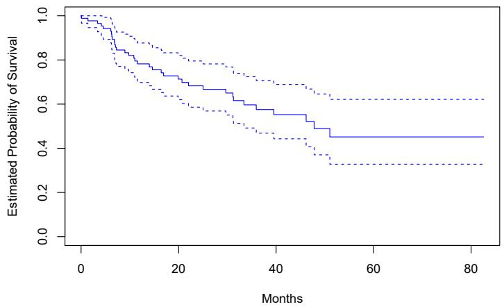
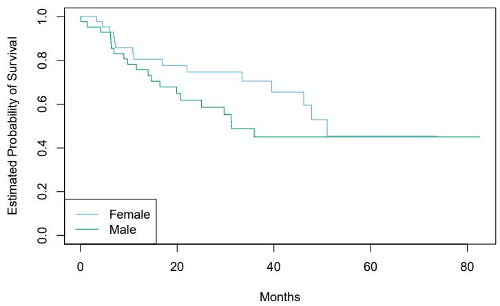
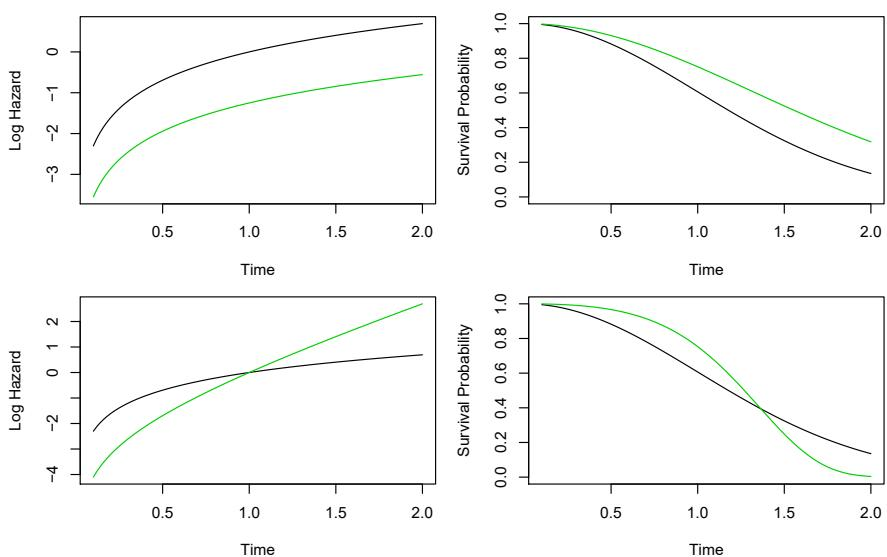
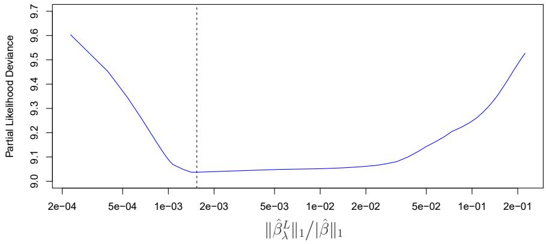
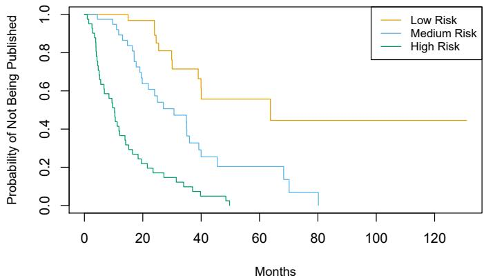
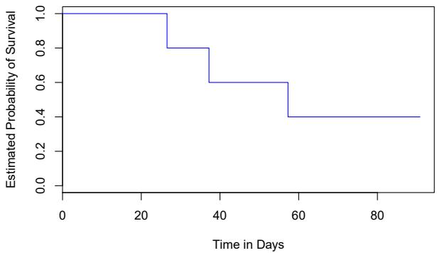

In this chapter, we will consider the topics of survival analysis and censored data. These arise in the analysis of a unique kind of outcome variable: the time until an event occurs.

For example, suppose that we have conducted a five-year medical study, in which patients have been treated for cancer. We would like to fit a model to predict patient survival time, using features such as baseline health measurements or type of treatment. At first pass, this may sound like a regression problem of the kind discussed in Chapter 3. But there is an important complication: hopefully some or many of the patients have survived until the end of the study. Such a patient's survival time is said to be censored: we know that it is at least five years, but we do not know its true value. We do not want to discard this subset of surviving patients, as the fact that they survived at least five years amounts to valuable information. However, it is not clear how to make use of this information using the techniques covered thus far in this textbook.

Though the phrase “survival analysis” evokes a medical study, the applications of survival analysis extend far beyond medicine. For example, consider a company that wishes to model churn, the process by which customers cancel subscription to a service. The company might collect data on customers over some time period, in order to model each customer’s time to cancellation as a function of demographics or other predictors. However, presumably not all customers will have canceled their subscription by the end of this time period; for such customers, the time to cancellation is censored.

In fact, survival analysis is relevant even in application areas that are unrelated to time. For instance, suppose we wish to model a person's weight as a function of some covariates, using a dataset with measurements for a large number of people. Unfortunately, the scale used to weigh those people is unable to report weights above a certain number. Then, any weights that

survival
analysis
censored
data

exceed that number are censored. The survival analysis methods presented in this chapter could be used to analyze this dataset.

Survival analysis is a very well-studied topic within statistics, due to its critical importance in a variety of applications, both in and out of medicine. However, it has received relatively little attention in the machine learning community.

# 11.1 Survival and Censoring Times

For each individual, we suppose that there is a true survival time, T, as well as a true censoring time, C. (The survival time is also known as the failure time or the event time.) The survival time represents the time at which the event of interest occurs: for instance, the time at which the patient dies, or the customer cancels his or her subscription. By contrast, the censoring time is the time at which censoring occurs: for example, the time at which the patient drops out of the study or the study ends.

We observe either the survival time T or else the censoring time C. Specifically, we observe the random variable

$$
Y = \min (T, C). \tag {11.1}
$$

In other words, if the event occurs before censoring (i.e. T < C) then we observe the true survival time T; however, if censoring occurs before the event (T > C) then we observe the censoring time. We also observe a status indicator,

$$
\delta = \left\{ \begin{array}{l l} 1 & \text {if} T \leq C \\ 0 & \text {if} T > C. \end{array} \right.
$$

Thus, $\delta = 1$ if we observe the true survival time, and $\delta = 0$ if we instead observe the censoring time.

Now, suppose we observe $n(Y,\delta)$ pairs, which we denote as $(y_{1},\delta_{1}),\ldots,(y_{n},\delta_{n})$ . Figure 11.1 displays an example from a (fictitious) medical study in which we observe n=4 patients for a 365-day follow-up period. For patients 1 and 3, we observe the time to event (such as death or disease relapse) $T=t_{i}$ . Patient 2 was alive when the study ended, and patient 4 dropped out of the study, or was “lost to follow-up”; for these patients we observe $C=c_{i}$ . Therefore, $y_{1}=t_{1}$ , $y_{3}=t_{3}$ , $y_{2}=c_{2}$ , $y_{4}=c_{4}$ , $\delta_{1}=\delta_{3}=1$ , and $\delta_{2}=\delta_{4}=0$ .

# 11.2 A Closer Look at Censoring

In order to analyze survival data, we need to make some assumptions about why censoring has occurred. For instance, suppose that a number of patients drop out of a cancer study early because they are very sick. An analysis that does not take into consideration the reason why the patients dropped out will likely overestimate the true average survival time. Similarly, suppose that males who are very sick are more likely to drop out of the study than


<details>
<summary>scatter</summary>

| Patient | Time in Days (Blue) | Time in Days (Orange) |
| --- | --- | --- |
| 1 | — | 300 |
| 2 | 370 | — |
| 3 | — | 150 |
| 4 | 250 | — |
</details>

FIGURE 11.1. Illustration of censored survival data. For patients 1 and 3, the event was observed. Patient 2 was alive when the study ended. Patient 4 dropped out of the study.

females who are very sick. Then a comparison of male and female survival times may wrongly suggest that males survive longer than females.

In general, we need to assume that the censoring mechanism is independent: conditional on the features, the event time T is independent of the censoring time C. The two examples above violate the assumption of independent censoring. Typically, it is not possible to determine from the data itself whether the censoring mechanism is independent. Instead, one has to carefully consider the data collection process in order to determine whether independent censoring is a reasonable assumption. In the remainder of this chapter, we will assume that the censoring mechanism is independent. $^{1}$

In this chapter, we focus on right censoring, which occurs when $T \geq Y$ , i.e. the true event time T is at least as large as the observed time Y. (Notice that $T \geq Y$ is a consequence of (11.1). Right censoring derives its name from the fact that time is typically displayed from left to right, as in Figure 11.1.) However, other types of censoring are possible. For instance, in left censoring, the true event time T is less than or equal to the observed time Y. For example, in a study of pregnancy duration, suppose that we survey patients 250 days after conception, when some have already had their babies. Then we know that for those patients, pregnancy duration is less than 250 days. More generally, interval censoring refers to the setting in which we do not know the exact event time, but we know that it falls in some interval. For instance, this setting arises if we survey patients once per week in order to determine whether the event has occurred. While left censoring and interval censoring can be accommodated using variants of the ideas presented in this chapter, in what follows we focus specifically on right censoring.

# 11.3 The Kaplan–Meier Survival Curve

The survival curve, or survival function, is defined as

$$
S (t) = \Pr (T > t). \tag {11.2} \text {survival}
$$

survival
curve
survival
function

This decreasing function quantifies the probability of surviving past time t. For example, suppose that a company is interested in modeling customer churn. Let T represent the time that a customer cancels a subscription to the company's service. Then $S(t)$ represents the probability that a customer cancels later than time t. The larger the value of $S(t)$ , the less likely that the customer will cancel before time t.

In this section, we will consider the task of estimating the survival curve. Our investigation is motivated by the BrainCancer dataset, which contains the survival times for patients with primary brain tumors undergoing treatment with stereotactic radiation methods. $^{2}$ The predictors are gtv (gross tumor volume, in cubic centimeters); sex (male or female); diagnosis (meningioma, LG glioma, HG glioma, or other); loc (the tumor location: either infratentorial or supratentorial); ki (Karnofsky index); and stereo (stereotactic method: either stereotactic radiosurgery or fractionated stereotactic radiotherapy, abbreviated as SRS and SRT, respectively). Only 53 of the 88 patients were still alive at the end of the study.

Now, we consider the task of estimating the survival curve $(11.2)$ for these data. To estimate $S(20) = \Pr(T > 20)$ , the probability that a patient survives for at least t = 20 months, it is tempting to simply compute the proportion of patients who are known to have survived past 20 months, i.e. the proportion of patients for whom Y > 20. This turns out to be 48/88, or approximately 55%. However, this does not seem quite right, since Y and T represent different quantities. In particular, 17 of the 40 patients who did not survive to 20 months were actually censored, and this analysis implicitly assumes that T < 20 for all of those censored patients; of course, we do not know whether that is true.

Alternatively, to estimate $S(20)$ , we could consider computing the proportion of patients for whom Y > 20, out of the 71 patients who were not censored by time t = 20; this comes out to 48/71, or approximately 68%. However, this is not quite right either, since it amounts to completely ignoring the patients who were censored before time t = 20, even though the time at which they are censored is potentially informative. For instance, a patient who was censored at time t = 19.9 likely would have survived past t = 20 had he or she not been censored.

We have seen that estimating $S(t)$ is complicated by the presence of censoring. We now present an approach to overcome these challenges. We let $d_{1} < d_{2} < \cdots < d_{K}$ denote the K unique death times among the non-censored patients, and we let $q_{k}$ denote the number of patients who died at time $d_{k}$ . For $k = 1, \ldots, K$ , we let $r_{k}$ denote the number of patients alive

and in the study just before $d_k$ ; these are the at risk patients. The set of patients that are at risk at a given time are referred to as the risk set.

By the law of total probability, $^{3}$

risk set

$$
\begin{array}{l} \Pr (T > d _ {k}) = \Pr (T > d _ {k} | T > d _ {k - 1}) \Pr (T > d _ {k - 1}) \\ + \Pr (T > d _ {k} | T \leq d _ {k - 1}) \Pr (T \leq d _ {k - 1}). \\ \end{array}
$$

The fact that $d_{k-1} < d_{k}$ implies that $\Pr(T > d_{k} | T \leq d_{k-1}) = 0$ (it is impossible for a patient to survive past time $d_{k}$ if he or she did not survive until an earlier time $d_{k-1}$ ). Therefore,

$$
S (d _ {k}) = \Pr (T > d _ {k}) = \Pr (T > d _ {k} | T > d _ {k - 1}) \Pr (T > d _ {k - 1}).
$$

Plugging in (11.2) again, we see that

$$
S (d _ {k}) = \Pr (T > d _ {k} | T > d _ {k - 1}) S (d _ {k - 1}).
$$

This implies that

$$
S (d _ {k}) = \Pr (T > d _ {k} | T > d _ {k - 1}) \times \dots \times \Pr (T > d _ {2} | T > d _ {1}) \Pr (T > d _ {1}).
$$

We now must simply plug in estimates of each of the terms on the right-hand side of the previous equation. It is natural to use the estimator

$$
\widehat {\mathrm{Pr}} (T > d _ {j} | T > d _ {j - 1}) = (r _ {j} - q _ {j}) / r _ {j},
$$

which is the fraction of the risk set at time $d_{j}$ who survived past time $d_{j}$ . This leads to the Kaplan–Meier estimator of the survival curve:

$$
\widehat {S} (d _ {k}) = \prod_ {j = 1} ^ {k} \left(\frac {r _ {j} - q _ {j}}{r _ {j}}\right). \tag {11.3}
$$

Kaplan–Meier estimator

For times $t$ between $d_k$ and $d_{k+1}$ , we set $\widehat{S}(t) = \widehat{S}(d_k)$ . Consequently, the Kaplan-Meier survival curve has a step-like shape.

The Kaplan–Meier survival curve for the BrainCancer data is displayed in Figure 11.2. Each point in the solid step-like curve shows the estimated probability of surviving past the time indicated on the horizontal axis. The estimated probability of survival past 20 months is 71%, which is quite a bit higher than the naive estimates of 55% and 68% presented earlier.

The sequential construction of the Kaplan–Meier estimator — starting at time zero and mapping out the observed events as they unfold in time — is fundamental to many of the key techniques in survival analysis. These include the log-rank test of Section 11.4, and Cox's proportional hazard model of Section 11.5.2.



<details>
<summary>survival</summary>

| Months | Estimated Probability of Survival (Lower Bound) | Estimated Probability of Survival (Estimate) | Estimated Probability of Survival (Upper Bound) |
| --- | --- | --- | --- |
| 0 | ~0.98 | 1.0 | 1.0 |
| 10 | ~0.75 | ~0.85 | ~0.92 |
| 20 | ~0.63 | ~0.73 | ~0.83 |
| 30 | ~0.57 | ~0.67 | ~0.79 |
| 40 | ~0.45 | ~0.58 | ~0.70 |
| 50 | ~0.33 | ~0.49 | ~0.63 |
| 60 | ~0.33 | ~0.45 | ~0.62 |
| 80 | ~0.33 | ~0.45 | ~0.62 |
</details>

FIGURE 11.2. For the BrainCancer data, we display the Kaplan–Meier survival curve (solid curve), along with standard error bands (dashed curves).



<details>
<summary>survival</summary>

| Months | Female (Estimated Probability) | Male (Estimated Probability) |
| --- | --- | --- |
| 0 | 1.0 | 1.0 |
| ~2 | 1.0 | ~0.98 |
| ~4 | ~0.98 | ~0.95 |
| ~6 | ~0.95 | ~0.93 |
| ~8 | ~0.85 | ~0.83 |
| ~10 | ~0.85 | ~0.80 |
| ~12 | ~0.80 | ~0.76 |
| ~14 | ~0.80 | ~0.72 |
| ~16 | ~0.80 | ~0.68 |
| ~18 | ~0.78 | ~0.68 |
| ~20 | ~0.78 | ~0.65 |
| ~22 | ~0.75 | ~0.62 |
| ~24 | ~0.75 | ~0.62 |
| ~26 | ~0.75 | ~0.58 |
| ~28 | ~0.75 | ~0.58 |
| ~30 | ~0.75 | ~0.55 |
| ~32 | ~0.75 | ~0.48 |
| ~34 | ~0.70 | ~0.48 |
| ~36 | ~0.70 | ~0.45 |
| ~38 | ~0.65 | ~0.45 |
| ~40 | ~0.65 | ~0.45 |
| ~42 | ~0.65 | ~0.45 |
| ~44 | ~0.60 | ~0.45 |
| ~46 | ~0.60 | ~0.45 |
| ~48 | ~0.53 | ~0.45 |
| ~50 | ~0.53 | ~0.45 |
| ~52 | ~0.45 | ~0.45 |
| ~82 | ~0.45 | ~0.45 |
</details>

FIGURE 11.3. For the BrainCancer data, Kaplan–Meier survival curves for males and females are displayed.

# 11.4 The Log-Rank Test

We now continue our analysis of the BrainCancer data introduced in Section 11.3. We wish to compare the survival of males to that of females. Figure 11.3 shows the Kaplan–Meier survival curves for the two groups. Females seem to fare a little better up to about 50 months, but then the two curves both level off to about 50%. How can we carry out a formal test of equality of the two survival curves?

At first glance, a two-sample t-test seems like an obvious choice: we could test whether the mean survival time among the females equals the mean survival time among the males. But the presence of censoring again creates a complication. To overcome this challenge, we will conduct a log-rank test, $^{4}$

<table><tr><td></td><td>Group 1</td><td>Group 2</td><td>Total</td></tr><tr><td>Died</td><td> $q_{1k}$ </td><td> $q_{2k}$ </td><td> $q_{k}$ </td></tr><tr><td>Survived</td><td> $r_{1k} - q_{1k}$ </td><td> $r_{2k} - q_{2k}$ </td><td> $r_{k} - q_{k}$ </td></tr><tr><td>Total</td><td> $r_{1k}$ </td><td> $r_{2k}$ </td><td> $r_{k}$ </td></tr></table>

TABLE 11.1. Among the set of patients at risk at time $d_{k}$ , the number of patients who died and survived in each of two groups is reported.

which examines how the events in each group unfold sequentially in time.

Recall from Section 11.3 that $d_{1} < d_{2} < \cdots < d_{K}$ are the unique death times among the non-censored patients, $r_{k}$ is the number of patients at risk at time $d_{k}$ , and $q_{k}$ is the number of patients who died at time $d_{k}$ . We further define $r_{1k}$ and $r_{2k}$ to be the number of patients in groups 1 and 2, respectively, who are at risk at time $d_{k}$ . Similarly, we define $q_{1k}$ and $q_{2k}$ to be the number of patients in groups 1 and 2, respectively, who died at time $d_{k}$ . Note that $r_{1k} + r_{2k} = r_{k}$ and $q_{1k} + q_{2k} = q_{k}$ .

At each death time $d_{k}$ , we construct a $2 \times 2$ table of counts of the form shown in Table 11.1. Note that if the death times are unique (i.e. no two individuals die at the same time), then one of $q_{1k}$ and $q_{2k}$ equals one, and the other equals zero.

The main idea behind the log-rank test statistic is as follows. In order to test $H_{0} : \mathrm{E}(X) = \mu$ for some random variable X, one approach is to construct a test statistic of the form

$$
W = \frac {X - \mu}{\sqrt {\operatorname{Var} (X)}}. \tag {11.4}
$$

To construct the log-rank test statistic, we compute a quantity that takes exactly the form (11.4), with $X = \sum_{k=1}^{K} q_{1k}$ , where $q_{1k}$ is given in the top left of Table 11.1.

In greater detail, if there is no difference in survival between the two groups, and conditioning on the row and column totals in Table 11.1, the expected value of $q_{1k}$ is

$$
\mu_ {k} = \frac {r _ {1 k}}{r _ {k}} q _ {k}. \tag {11.5}
$$

So the expected value of $X = \sum_{k=1}^{K} q_{1k}$ is $\mu = \sum_{k=1}^{K} \frac{r_{1k}}{r_k} q_k$ . Furthermore, it can be shown $^{5}$ that the variance of $q_{1k}$ is

$$
\mathrm{Var} \left(q _ {1 k}\right) = \frac {q _ {k} (r _ {1 k} / r _ {k}) (1 - r _ {1 k} / r _ {k}) (r _ {k} - q _ {k})}{r _ {k} - 1}. \tag {11.6}
$$

Though $q_{11},\ldots,q_{1K}$ may be correlated, we nonetheless estimate

$$
\operatorname{Var} \left(\sum_ {k = 1} ^ {K} q _ {1 k}\right) \approx \sum_ {k = 1} ^ {K} \operatorname{Var} \left(q _ {1 k}\right) = \sum_ {k = 1} ^ {K} \frac {q _ {k} (r _ {1 k} / r _ {k}) (1 - r _ {1 k} / r _ {k}) (r _ {k} - q _ {k})}{r _ {k} - 1}. \tag {11.7}
$$

Therefore, to compute the log-rank test statistic, we simply proceed as in (11.4), with $X = \sum_{k=1}^{K} q_{1k}$ , making use of (11.5) and (11.7). That is, we calculate

$$
W = \frac {\sum_ {k = 1} ^ {K} \left(q _ {1 k} - \mu_ {k}\right)}{\sqrt {\sum_ {k = 1} ^ {K} \operatorname{Var} \left(q _ {1 k}\right)}} = \frac {\sum_ {k = 1} ^ {K} \left(q _ {1 k} - \frac {q _ {k}}{r _ {k}} r _ {1 k}\right)}\sqrt {\sum_ {k = 1} ^ {K} \frac {q _ {k} \left(r _ {1 k} / r _ {k}\right) \left(1 - r _ {1 k} / r _ {k}\right) \left(r _ {k} - q _ {k}\right)}{r _ {k} - 1}}. \tag {11.8}
$$

When the sample size is large, the log-rank test statistic W has approximately a standard normal distribution; this can be used to compute a p-value for the null hypothesis that there is no difference between the survival curves in the two groups. $^{6}$

Comparing the survival times of females and males on the BrainCancer data gives a log-rank test statistic of W = 1.2, which corresponds to a two-sided p-value of 0.2 using the theoretical null distribution, and a p-value of 0.25 using the permutation null distribution with 1,000 permutations. Thus, we cannot reject the null hypothesis of no difference in survival curves between females and males.

The log-rank test is closely related to Cox's proportional hazards model, which we discuss in Section 11.5.2.

# 11.5 Regression Models With a Survival Response

We now consider the task of fitting a regression model to survival data. As in Section 11.1, the observations are of the form $(Y,\delta)$ , where $Y = \min(T,C)$ is the (possibly censored) survival time, and $\delta$ is an indicator variable that equals 1 if $T \leq C$ . Furthermore, $X \in R^{p}$ is a vector of p features. We wish to predict the true survival time T.

Since the observed quantity $Y$ is positive and may have a long right tail, we might be tempted to fit a linear regression of $\log(Y)$ on $X$ . But as the reader will surely guess, censoring again creates a problem since we are actually interested in predicting $T$ and not $Y$ . To overcome this difficulty, we instead make use of a sequential construction, similar to the constructions of the Kaplan-Meier survival curve in Section 11.3 and the log-rank test in Section 11.4.

# 11.5.1 The Hazard Function

The hazard function or hazard rate — also known as the force of mortality — is formally defined as

$$
h (t) = \lim _ {\Delta t \to 0} \frac {\Pr (t <   T \leq t + \Delta t | T > t)}{\Delta t}, \tag {11.9}
$$

hazard
function

where T is the (unobserved) survival time. It is the death rate in the instant after time t, given survival past that time. $^{7}$ In (11.9), we take the limit as $\Delta t$ approaches zero, so we can think of $\Delta t$ as being an extremely tiny number. Thus, more informally, (11.9) implies that

$$
h (t) \approx \frac {\Pr (t <   T \leq t + \Delta t | T > t)}{\Delta t}
$$

for some arbitrarily small $\Delta t$ .

Why should we care about the hazard function? First of all, it is closely related to the survival curve (11.2), as we will see next. Second, it turns out that a key approach for modeling survival data as a function of covariates relies heavily on the hazard function; we will introduce this approach — Cox's proportional hazards model — in Section 11.5.2.

We now consider the hazard function $h(t)$ in a bit more detail. Recall that for two events A and B, the probability of A given B can be expressed as $\Pr(A \mid B) = \Pr(A \cap B) / \Pr(B)$ , i.e. the probability that A and B both occur divided by the probability that B occurs. Furthermore, recall from (11.2) that $S(t) = \Pr(T > t)$ . Thus,

$$
\begin{array}{l} h (t) = \lim _ {\Delta t \to 0} \frac {\Pr \left((t <   T \leq t + \Delta t) \cap (T > t)\right) / \Delta t}{\Pr (T > t)} \\ = \lim _ {\Delta t \to 0} \frac {\Pr (t <   T \leq t + \Delta t) / \Delta t}{\Pr (T > t)} \\ = \frac {f (t)}{S (t)}, \tag {11.10} \\ \end{array}
$$

where

$$
f (t) = \lim _ {\Delta t \to 0} \frac {\Pr (t <   T \leq t + \Delta t)}{\Delta t} \tag {11.11}
$$

is the probability density function associated with T, i.e. it is the instantaneous rate of death at time t. The second equality in (11.10) made use of the fact that if $t < T \leq t + \Delta t$ , then it must be the case that T > t.

Equation 11.10 implies a relationship between the hazard function $h(t)$ , the survival function $S(t)$ , and the probability density function $f(t)$ . In fact, these are three equivalent ways $^{8}$ of describing the distribution of T.

The likelihood associated with the ith observation is

$$
\begin{array}{l} L _ {i} = \left\{ \begin{array}{l l} f (y _ {i}) & \text {if the ith observation is not censored} \\ S (y _ {i}) & \text {if the ith observation is censored} \end{array} \right. \\ = f (y _ {i}) ^ {\delta_ {i}} S (y _ {i}) ^ {1 - \delta_ {i}}. \tag {11.12} \\ \end{array}
$$

The intuition behind (11.12) is as follows: if $Y = y_{i}$ and the $i$ th observation is not censored, then the likelihood is the probability of dying in a tiny interval around time $y_{i}$ . If the $i$ th observation is censored, then the likelihood

is the probability of surviving at least until time $y_{i}$ . Assuming that the n observations are independent, the likelihood for the data takes the form

$$
L = \prod_ {i = 1} ^ {n} f (y _ {i}) ^ {\delta_ {i}} S (y _ {i}) ^ {1 - \delta_ {i}} = \prod_ {i = 1} ^ {n} h (y _ {i}) ^ {\delta_ {i}} S (y _ {i}), \tag {11.13}
$$

where the second equality follows from (11.10).

We now consider the task of modeling the survival times. If we assume exponential survival, i.e. that the probability density function of the survival time T takes the form $f(t) = \lambda \exp(-\lambda t)$ , then estimating the parameter $\lambda$ by maximizing the likelihood in (11.13) is straightforward. $^{9}$ Alternatively, we could assume that the survival times are drawn from a more flexible family of distributions, such as the Gamma or Weibull family. Another possibility is to model the survival times non-parametrically, as was done in Section 11.3 using the Kaplan–Meier estimator.

However, what we would really like to do is model the survival time as a function of the covariates. To do this, it is convenient to work directly with the hazard function, instead of the probability density function. $^{10}$ One possible approach is to assume a functional form for the hazard function $h(t|x_{i})$ , such as $h(t|x_{i}) = \exp\left(\beta_{0} + \sum_{j=1}^{p} \beta_{j}x_{ij}\right)$ , where the exponent function guarantees that the hazard function is non-negative. Note that the exponential hazard function is special, in that it does not vary with time. $^{11}$ Given $h(t|x_{i})$ , we could calculate $S(t|x_{i})$ . Plugging these equations into (11.13), we could then maximize the likelihood in order to estimate the parameter $\beta = (\beta_{0}, \beta_{1}, \ldots, \beta_{p})^{T}$ . However, this approach is quite restrictive, in the sense that it requires us to make a very stringent assumption on the form of the hazard function $h(t|x_{i})$ . In the next section, we will consider a much more flexible approach.

# 11.5.2 Proportional Hazards

# The Proportional Hazards Assumption

The proportional hazards assumption states that

$$
h (t | x _ {i}) = h _ {0} (t) \exp \left(\sum_ {j = 1} ^ {p} x _ {i j} \beta_ {j}\right), \tag {11.14}
$$

where $h_{0}(t) \geq 0$ is an unspecified function, known as the baseline hazard. It is the hazard function for an individual with features $x_{i1} = \cdots = x_{ip} = 0$ . The name “proportional hazards” arises from the fact that the hazard function for an individual with feature vector $x_{i}$ is some unknown function

proportional
hazards
assumption

baseline
hazard

  
FIGURE 11.4. Top: In a simple example with p = 1 and a binary covariate $x_{i} \in \{0,1\}$ , the log hazard and the survival function under the model (11.14) are shown (green for $x_{i} = 0$ and black for $x_{i} = 1$ ). Because of the proportional hazards assumption (11.14), the log hazard functions differ by a constant, and the survival functions do not cross. Bottom: Again we have a single binary covariate $x_{i} \in \{0,1\}$ . However, the proportional hazards assumption (11.14) does not hold. The log hazard functions cross, as do the survival functions.

$h_0(t)$ times the factor $\exp \left(\sum_{j=1}^{p} x_{ij} \beta_j\right)$ . The quantity $\exp \left(\sum_{j=1}^{p} x_{ij} \beta_j\right)$ is called the relative risk for the feature vector $x_i = (x_{i1}, \ldots, x_{ip})^T$ , relative to that for the feature vector $x_i = (0, \ldots, 0)^T$ .

What does it mean that the baseline hazard function $h_{0}(t)$ in (11.14) is unspecified? Basically, we make no assumptions about its functional form. We allow the instantaneous probability of death at time t, given that one has survived at least until time t, to take any form. This means that the hazard function is very flexible and can model a wide range of relationships between the covariates and survival time. Our only assumption is that a one-unit increase in $x_{ij}$ corresponds to an increase in $h(t|x_{i})$ by a factor of $\exp(\beta_{j})$ .

An illustration of the proportional hazards assumption (11.14) is given in Figure 11.4, in a simple setting with a single binary covariate $x_{i} \in \{0, 1\}$ (so that p = 1). In the top row, the proportional hazards assumption (11.14) holds. Thus, the hazard functions of the two groups are a constant multiple of each other, so that on the log scale, the gap between them is constant. Furthermore, the survival curves never cross, and in fact the gap between the survival curves tends to (initially) increase over time. By contrast, in the bottom row, (11.14) does not hold. We see that the log hazard functions for the two groups cross, as do the survival curves.

# Cox's Proportional Hazards Model

Because the form of $h_0(t)$ in the proportional hazards assumption (11.14) is unknown, we cannot simply plug $h(t|x_i)$ into the likelihood (11.13) and then estimate $\beta = (\beta_1, \dots, \beta_p)^T$ by maximum likelihood. The magic of Cox's proportional hazards model lies in the fact that it is in fact possible to estimate $\beta$ without having to specify the form of $h_0(t)$ .

To accomplish this, we make use of the same “sequential in time” logic that we used to derive the Kaplan–Meier survival curve and the log-rank test. For simplicity, assume that there are no ties among the failure, or death, times: i.e. each failure occurs at a distinct time. Assume that $\delta_{i}=1$ , i.e. the ith observation is uncensored, and thus $y_{i}$ is its failure time. Then the hazard function for the ith observation at time $y_{i}$ is $h(y_{i}|x_{i})=h_{0}(y_{i})\exp\left(\sum_{j=1}^{p}x_{ij}\beta_{j}\right)$ , and the total hazard at time $y_{i}$ for the at risk observations $^{12}$ is

$$
\sum_ {i ^ {\prime}: y _ {i ^ {\prime}} \geq y _ {i}} h _ {0} (y _ {i}) \exp \left(\sum_ {j = 1} ^ {p} x _ {i ^ {\prime} j} \beta_ {j}\right).
$$

Therefore, the probability that the ith observation is the one to fail at time $y_{i}$ (as opposed to one of the other observations in the risk set) is

$$
\frac {h _ {0} \left(y _ {i}\right) \exp \left(\sum_ {j = 1} ^ {p} x _ {i j} \beta_ {j}\right)}{\sum_ {i ^ {\prime} : y _ {i ^ {\prime}} \geq y _ {i}} h _ {0} \left(y _ {i}\right) \exp \left(\sum_ {j = 1} ^ {p} x _ {i ^ {\prime} j} \beta_ {j}\right)} = \frac {\exp \left(\sum_ {j = 1} ^ {p} x _ {i j} \beta_ {j}\right)}{\sum_ {i ^ {\prime} : y _ {i ^ {\prime}} \geq y _ {i}} \exp \left(\sum_ {j = 1} ^ {p} x _ {i ^ {\prime} j} \beta_ {j}\right)}. \tag {11.15}
$$

Notice that the unspecified baseline hazard function $h_{0}(y_{i})$ cancels out of the numerator and denominator!

The partial likelihood is simply the product of these probabilities over all of the uncensored observations,

$$
P L (\beta) = \prod_ {i: \delta_ {i} = 1} \frac {\exp \left(\sum_ {j = 1} ^ {p} x _ {i j} \beta_ {j}\right)}{\sum_ {i ^ {\prime} : y _ {i ^ {\prime}} \geq y _ {i}} \exp \left(\sum_ {j = 1} ^ {p} x _ {i ^ {\prime} j} \beta_ {j}\right)}. \tag {11.16}
$$

Critically, the partial likelihood is valid regardless of the true value of $h_{0}(t)$ , making the model very flexible and robust. $^{13}$

To estimate $\beta$ , we simply maximize the partial likelihood (11.16) with respect to $\beta$ . As was the case for logistic regression in Chapter 4, no closed-form solution is available, and so iterative algorithms are required.

In addition to estimating $\beta$ , we can also obtain other model outputs that we saw in the context of least squares regression in Chapter 3 and logistic regression in Chapter 4. For example, we can obtain p-values corresponding

Cox's
proportional
hazards
model

partial likelihood

to particular null hypotheses (e.g. $H_{0} : \beta_{j} = 0$ ), as well as confidence intervals associated with the coefficients.

# Connection With The Log-Rank Test

Suppose we have just a single predictor $(p = 1)$ , which we assume to be binary, i.e. $x_{i} \in \{0, 1\}$ . In order to determine whether there is a difference between the survival times of the observations in the group $\{i : x_{i} = 0\}$ and those in the group $\{i : x_{i} = 1\}$ , we can consider taking two possible approaches:

Approach #1: Fit a Cox proportional hazards model, and test the null hypothesis $H_{0} : \beta = 0$ . (Since p = 1, $\beta$ is a scalar.)

Approach #2: Perform a log-rank test to compare the two groups, as in Section 11.4.

Which one should we prefer?

In fact, there is a close relationship between these two approaches. In particular, when taking Approach #1, there are a number of possible ways to test $H_{0}$ . One way is known as a score test. It turns out that in the case of a single binary covariate, the score test for $H_{0} : \beta = 0$ in Cox's proportional hazards model is exactly equal to the log-rank test. In other words, it does not matter whether we take Approach #1 or Approach #2!

# Additional Details

The discussion of Cox's proportional hazards model glossed over a few subtleties:

- There is no intercept in (11.14) nor in the equations that follow, because an intercept can be absorbed into the baseline hazard $h_0(t)$ .  
- We have assumed that there are no tied failure times. In the case of ties, the exact form of the partial likelihood (11.16) is a bit more complicated, and a number of computational approximations must be used.  
- (11.16) is known as the partial likelihood because it is not exactly a likelihood. That is, it does not correspond exactly to the probability of the data under the assumption (11.14). However, it is a very good approximation.  
- We have focused only on estimation of the coefficients $\beta = (\beta_1, \dots, \beta_p)^T$ . However, at times we may also wish to estimate the baseline hazard $h_0(t)$ , for instance so that we can estimate the survival curve $S(t|x)$ for an individual with feature vector $x$ . The details are beyond the scope of this book. Estimation of $h_0(t)$ is implemented in the lifelines package in Python, which we will see in Section 11.8.

# 11.5.3 Example: Brain Cancer Data

Table 11.2 shows the result of fitting the proportional hazards model to the BrainCancer data, which was originally described in Section 11.3. The coefficient column displays $\hat{\beta}_{j}$ . The results indicate, for instance, that the estimated hazard for a male patient is $e^{0.18} = 1.2$ times greater than for a female patient: in other words, with all other features held fixed, males have a 1.2 times greater chance of dying than females, at any point in time. However, the p-value is 0.61, which indicates that this difference between males and females is not significant.

As another example, we also see that each one-unit increase in the Karnofsky index corresponds to a multiplier of $\exp(-0.05)=0.95$ in the instantaneous chance of dying. In other words, the higher the Karnofsky index, the lower the chance of dying at any given point in time. This effect is highly significant, with a p-value of 0.0027.

<table><tr><td></td><td>Coefficient</td><td>Std. error</td><td>z-statistic</td><td>p-value</td></tr><tr><td>sex [Male]</td><td>0.18</td><td>0.36</td><td>0.51</td><td>0.61</td></tr><tr><td>diagnosis [LG Glioma]</td><td>0.92</td><td>0.64</td><td>1.43</td><td>0.15</td></tr><tr><td>diagnosis [HG Glioma]</td><td>2.15</td><td>0.45</td><td>4.78</td><td>0.00</td></tr><tr><td>diagnosis [Other]</td><td>0.89</td><td>0.66</td><td>1.35</td><td>0.18</td></tr><tr><td>loc [Supratentorial]</td><td>0.44</td><td>0.70</td><td>0.63</td><td>0.53</td></tr><tr><td>ki</td><td>-0.05</td><td>0.02</td><td>-3.00</td><td>&lt;0.01</td></tr><tr><td>gtv</td><td>0.03</td><td>0.02</td><td>1.54</td><td>0.12</td></tr><tr><td>stereo [SRT]</td><td>0.18</td><td>0.60</td><td>0.30</td><td>0.77</td></tr></table>

TABLE 11.2. Results for Cox's proportional hazards model fit to the BrainCancer data, which was first described in Section 11.3. The variable diagnosis is qualitative with four levels: meningioma, LG glioma, HG glioma, or other. The variables sex, loc, and stereo are binary.

# 11.5.4 Example: Publication Data

Next, we consider the dataset Publication involving the time to publication of journal papers reporting the results of clinical trials funded by the National Heart, Lung, and Blood Institute. $^{14}$ For 244 trials, the time in months until publication is recorded. Of the 244 trials, only 156 were published during the study period; the remaining studies were censored. The covariates include whether the trial focused on a clinical endpoint (clinend), whether the trial involved multiple centers (multi), the funding mechanism within the National Institutes of Health (mech), trial sample size (sampsize), budget (budget), impact (impact, related to the number of citations), and whether the trial produced a positive (significant) result (posres). The last covariate is particularly interesting, as a number of studies have suggested that positive trials have a higher publication rate.


<details>
<summary>survival</summary>

| Months | Negative Result (Probability) | Positive Result (Probability) |
| --- | --- | --- |
| 0 | 1.0 | 1.0 |
| 20 | ~0.65 | ~0.60 |
| 40 | ~0.35 | ~0.35 |
| 60 | ~0.22 | ~0.12 |
| 80 | ~0.18 | ~0.03 |
</details>

FIGURE 11.5. Survival curves for time until publication for the Publication data described in Section 11.5.4, stratified by whether or not the study produced a positive result.

Figure 11.5 shows the Kaplan–Meier curves for the time until publication, stratified by whether or not the study produced a positive result. We see slight evidence that time until publication is lower for studies with a positive result. However, the log-rank test yields a very unimpressive p-value of 0.36.

We now consider a more careful analysis that makes use of all of the available predictors. The results of fitting Cox's proportional hazards model using all of the available features are shown in Table 11.3. We find that the chance of publication of a study with a positive result is $e^{0.55} = 1.74$ times higher than the chance of publication of a study with a negative result at any point in time, holding all other covariates fixed. The very small $p$ -value associated with posres in Table 11.3 indicates that this result is highly significant. This is striking, especially in light of our earlier finding that a log-rank test comparing time to publication for studies with positive versus negative results yielded a $p$ -value of 0.36. How can we explain this discrepancy? The answer stems from the fact that the log-rank test did not consider any other covariates, whereas the results in Table 11.3 are based on a Cox model using all of the available covariates. In other words, after we adjust for all of the other covariates, then whether or not the study yielded a positive result is highly predictive of the time to publication.

In order to gain more insight into this result, in Figure 11.6 we display estimates of the survival curves associated with positive and negative results, adjusting for the other predictors. To produce these survival curves, we estimated the underlying baseline hazard $h_{0}(t)$ . We also needed to select representative values for the other predictors; we used the mean value for each predictor, except for the categorical predictor mech, for which we used the most prevalent category (R01). Adjusting for the other predictors, we now see a clear difference in the survival curves between studies with positive versus negative results.

Other interesting insights can be gleaned from Table 11.3. For example, studies with a clinical endpoint are more likely to be published at any given point in time than those with a non-clinical endpoint. The funding

<table><tr><td></td><td>Coefficient</td><td>Std. error</td><td>z-statistic</td><td>p-value</td></tr><tr><td>posres[Yes]</td><td>0.55</td><td>0.18</td><td>3.02</td><td>0.00</td></tr><tr><td>multi[Yes]</td><td>0.15</td><td>0.31</td><td>0.47</td><td>0.64</td></tr><tr><td>clinend[Yes]</td><td>0.51</td><td>0.27</td><td>1.89</td><td>0.06</td></tr><tr><td>mech[K01]</td><td>1.05</td><td>1.06</td><td>1.00</td><td>0.32</td></tr><tr><td>mech[K23]</td><td>-0.48</td><td>1.05</td><td>-0.45</td><td>0.65</td></tr><tr><td>mech[P01]</td><td>-0.31</td><td>0.78</td><td>-0.40</td><td>0.69</td></tr><tr><td>mech[P50]</td><td>0.60</td><td>1.06</td><td>0.57</td><td>0.57</td></tr><tr><td>mech[R01]</td><td>0.10</td><td>0.32</td><td>0.30</td><td>0.76</td></tr><tr><td>mech[R18]</td><td>1.05</td><td>1.05</td><td>0.99</td><td>0.32</td></tr><tr><td>mech[R21]</td><td>-0.05</td><td>1.06</td><td>-0.04</td><td>0.97</td></tr><tr><td>mech[R24,K24]</td><td>0.81</td><td>1.05</td><td>0.77</td><td>0.44</td></tr><tr><td>mech[R42]</td><td>-14.78</td><td>3414.38</td><td>-0.00</td><td>1.00</td></tr><tr><td>mech[R44]</td><td>-0.57</td><td>0.77</td><td>-0.73</td><td>0.46</td></tr><tr><td>mech[RC2]</td><td>-14.92</td><td>2243.60</td><td>-0.01</td><td>0.99</td></tr><tr><td>mech[U01]</td><td>-0.22</td><td>0.32</td><td>-0.70</td><td>0.48</td></tr><tr><td>mech[U54]</td><td>0.47</td><td>1.07</td><td>0.44</td><td>0.66</td></tr><tr><td>sampsize</td><td>0.00</td><td>0.00</td><td>0.19</td><td>0.85</td></tr><tr><td>budget</td><td>0.00</td><td>0.00</td><td>1.67</td><td>0.09</td></tr><tr><td>impact</td><td>0.06</td><td>0.01</td><td>8.23</td><td>0.00</td></tr></table>

TABLE 11.3. Results for Cox's proportional hazards model fit to the Publication data, using all of the available features. The features posres, multi, and clinend are binary. The feature mech is qualitative with 14 levels; it is coded so that the baseline level is Contract.

mechanism did not appear to be significantly associated with time until publication.

# 11.6 Shrinkage for the Cox Model

In this section, we illustrate that the shrinkage methods of Section 6.2 can be applied to the survival data setting. In particular, motivated by the “loss+penalty” formulation of Section 6.2, we consider minimizing a penalized version of the negative log partial likelihood in (11.16),

$$
- \log \left(\prod_ {i: \delta_ {i} = 1} \frac {\exp \left(\sum_ {j = 1} ^ {p} x _ {i j} \beta_ {j}\right)}{\sum_ {i ^ {\prime} : y _ {i ^ {\prime}} \geq y _ {i}} \exp \left(\sum_ {j = 1} ^ {p} x _ {i ^ {\prime} j} \beta_ {j}\right)}\right) + \lambda P (\beta), \tag {11.17}
$$

with respect to $\beta = (\beta_{1},\dots,\beta_{p})^{T}$ . We might take $P(\beta) = \sum_{j=1}^{p}\beta_{j}^{2}$ , which corresponds to a ridge penalty, or $P(\beta) = \sum_{j=1}^{p}|\beta_{j}|$ , which corresponds to a lasso penalty.

In (11.17), $\lambda$ is a non-negative tuning parameter; typically we will minimize it over a range of values of $\lambda$ . When $\lambda = 0$ , then minimizing (11.17) is equivalent to simply maximizing the usual Cox partial likelihood (11.16). However, when $\lambda > 0$ , then minimizing (11.17) yields a shrunken version of the coefficient estimates. When $\lambda$ is large, then using a ridge penalty will give small coefficients that are not exactly equal to zero. By contrast, for a


<details>
<summary>survival</summary>

| Months | Negative Result (Probability) | Positive Result (Probability) |
| --- | --- | --- |
| 0 | 1.0 | 1.0 |
| 20 | ~0.75 | ~0.55 |
| 40 | ~0.35 | ~0.15 |
| 60 | ~0.15 | ~0.05 |
| 80 | ~0.05 | ~0.02 |
| 100 | ~0.05 | ~0.02 |
| 120 | ~0.05 | ~0.02 |
</details>

FIGURE 11.6. For the Publication data, we display survival curves for time until publication, stratified by whether or not the study produced a positive result, after adjusting for all other covariates.

sufficiently large value of $\lambda$ , using a lasso penalty will give some coefficients that are exactly equal to zero.

We now apply the lasso-penalized Cox model to the Publication data, described in Section 11.5.4. We first randomly split the 244 trials into equally-sized training and test sets. The cross-validation results from the training set are shown in Figure 11.7. The “partial likelihood deviance”, shown on the y-axis, is twice the cross-validated negative log partial likelihood; it plays the role of the cross-validation error. $^{15}$ Note the “U-shape” of the partial likelihood deviance: just as we saw in previous chapters, the cross-validation error is minimized for an intermediate level of model complexity. Specifically, this occurs when just two predictors, budget and impact, have non-zero estimated coefficients.

Now, how do we apply this model to the test set? This brings up an important conceptual point: in essence, there is no simple way to compare predicted survival times and true survival times on the test set. The first problem is that some of the observations are censored, and so the true survival times for those observations are unobserved. The second issue arises from the fact that in the Cox model, rather than predicting a single survival time given a covariate vector x, we instead estimate an entire survival curve, $S(t|x)$ , as a function of t.

Therefore, to assess the model fit, we must take a different approach, which involves stratifying the observations using the coefficient estimates. In particular, for each test observation, we compute the “risk” score

$$
\text {budget} _ {i} \cdot \hat {\beta} _ {\text {budget}} + \text {impact} _ {i} \cdot \hat {\beta} _ {\text {impact}},
$$

where $\hat{\beta}_{budget}$ and $\hat{\beta}_{impact}$ are the coefficient estimates for these two features from the training set. We then use these risk scores to categorize the observations based on their “risk”. For instance, the high risk group consists of the observations for which $budget_{i} \cdot \hat{\beta}_{budget} + impact_{i} \cdot \hat{\beta}_{impact}$ is largest; by



<details>
<summary>line</summary>

| 2e-04 | 9.6 |
| --- | --- |
| 5e-04 | ~9.45 |
| 1e-03 | ~9.08 |
| 2e-03 | ~9.04 |
| 5e-03 | ~9.05 |
| 1e-02 | ~9.06 |
| 2e-02 | ~9.07 |
| 5e-02 | ~9.15 |
| 1e-01 | ~9.25 |
| 2e-01 | ~9.53 |
</details>

FIGURE 11.7. For the Publication data described in Section 11.5.4, cross-validation results for the lasso-penalized Cox model are shown. The y-axis displays the partial likelihood deviance, which plays the role of the cross-validation error. The x-axis displays the $\ell_{1}$ norm (that is, the sum of the absolute values) of the coefficients of the lasso-penalized Cox model with tuning parameter $\lambda$ , divided by the $\ell_{1}$ norm of the coefficients of the unpenalized Cox model. The dashed line indicates the minimum cross-validation error.

(11.14), we see that these are the observations for which the instantaneous probability of being published at any moment in time is largest. In other words, the high risk group consists of the trials that are likely to be published sooner. On the Publication data, we stratify the observations into tertiles of low, medium, and high risk. The resulting survival curves for each of the three strata are displayed in Figure 11.8. We see that there is clear separation between the three strata, and that the strata are correctly ordered in terms of low, medium, and high risk of publication.

# 11.7 Additional Topics

# 11.7.1 Area Under the Curve for Survival Analysis

In Chapter 4, we introduced the area under the ROC curve — often referred to as the “AUC” — as a way to quantify the performance of a two-class classifier. Define the score for the ith observation to be the classifier’s estimate of $\Pr(Y = 1|X = x_{i})$ . It turns out that if we consider all pairs consisting of one observation in Class 1 and one observation in Class 2, then the AUC is the fraction of pairs for which the score for the observation in Class 1 exceeds the score for the observation in Class 2.

This suggests a way to generalize the notion of AUC to survival analysis. We calculate an estimated risk score, $\hat{\eta}_{i} = \hat{\beta}_{1}x_{i1} + \cdots + \hat{\beta}_{p}x_{ip}$ , for $i = 1, \ldots, n$ , using the Cox model coefficients. If $\hat{\eta}_{i'} > \hat{\eta}_{i}$ , then the model predicts that the $i'$ th observation has a larger hazard than the ith observation, and thus that the survival time $t_{i}$ will be greater than $t_{i'}$ . Thus, it is tempting to try to generalize AUC by computing the proportion of observations for which $t_{i} > t_{i'}$ and $\hat{\eta}_{i'} > \hat{\eta}_{i}$ . However, things are not quite so easy, because recall that we do not observe $t_{1}, \ldots, t_{n}$ ; instead, we observe



<details>
<summary>survival</summary>

| Months | Low Risk (Probability) | Medium Risk (Probability) | High Risk (Probability) |
| --- | --- | --- | --- |
| 0 | 1.0 | 1.0 | 1.0 |
| 20 | ~0.98 | ~0.65 | ~0.25 |
| 40 | ~0.72 | ~0.35 | ~0.08 |
| 60 | ~0.56 | ~0.20 | — |
| 80 | ~0.44 | ~0.06 | — |
</details>

FIGURE 11.8. For the Publication data introduced in Section 11.5.4, we compute tertiles of “risk” in the test set using coefficients estimated on the training set. There is clear separation between the resulting survival curves.

the (possibly-censored) times $y_{1}, \ldots, y_{n}$ , as well as the censoring indicators $\delta_{1}, \ldots, \delta_{n}$ .

Therefore, Harrell's concordance index (or $C$ -index) computes the proportion of observation pairs for which $\hat{\eta}_{i'} > \hat{\eta}_i$ and $y_i > y_{i'}$ :

$$
C = \frac {\sum_ {i , i ^ {\prime} : y _ {i} > y _ {i ^ {\prime}}} I (\hat {\eta} _ {i ^ {\prime}} > \hat {\eta} _ {i}) \delta_ {i ^ {\prime}}}{\sum_ {i , i ^ {\prime} : y _ {i} > y _ {i ^ {\prime}}} \delta_ {i ^ {\prime}}},
$$

Harrell's concordance index

where the indicator variable $I(\hat{\eta}_{i'} > \hat{\eta}_{i})$ equals one if $\hat{\eta}_{i'} > \hat{\eta}_{i}$ , and equals zero otherwise. The numerator and denominator are multiplied by the status indicator $\delta_{i'}$ , since if the $i'$ th observation is uncensored (i.e. if $\delta_{i'} = 1$ ), then $y_{i} > y_{i'}$ implies that $t_{i} > t_{i'}$ . By contrast, if $\delta_{i'} = 0$ , then $y_{i} > y_{i'}$ does not imply that $t_{i} > t_{i'}$ .

We fit a Cox proportional hazards model on the training set of the Publication data, and computed the C-index on the test set. This yielded C = 0.733. Roughly speaking, given two random papers from the test set, the model can predict with 73.3% accuracy which will be published first.

# 11.7.2 Choice of Time Scale

In the examples considered thus far in this chapter, it has been fairly clear how to define time. For example, in the Publication example, time zero for each paper was defined to be the calendar time at the end of the study, and the failure time was defined to be the number of months that elapsed from the end of the study until the paper was published.

However, in other settings, the definitions of time zero and failure time may be more subtle. For example, when examining the association between risk factors and disease occurrence in an epidemiological study, one might use the patient's age to define time, so that time zero is the patient's date of birth. With this choice, the association between age and survival cannot be measured; however, there is no need to adjust for age in the analysis. When examining covariates associated with disease-free survival (i.e. the

amount of time elapsed between treatment and disease recurrence), one might use the date of treatment as time zero.

# 11.7.3 Time-Dependent Covariates

A powerful feature of the proportional hazards model is its ability to handle time-dependent covariates, predictors whose value may change over time. For example, suppose we measure a patient's blood pressure every week over the course of a medical study. In this case, we can think of the blood pressure for the $i$ th observation not as $x_{i}$ , but rather as $x_{i}(t)$ at time $t$ .

Because the partial likelihood in $(11.16)$ is constructed sequentially in time, dealing with time-dependent covariates is straightforward. In particular, we simply replace $x_{ij}$ and $x_{i'j}$ in $(11.16)$ with $x_{ij}(y_i)$ and $x_{i'j}(y_i)$ , respectively; these are the current values of the predictors at time $y_i$ . By contrast, time-dependent covariates would pose a much greater challenge within the context of a traditional parametric approach, such as $(11.13)$ .

One example of time-dependent covariates appears in the analysis of data from the Stanford Heart Transplant Program. Patients in need of a heart transplant were put on a waiting list. Some patients received a transplant, but others died while still on the waiting list. The primary objective of the analysis was to determine whether a transplant was associated with longer patient survival.

A naïve approach would use a fixed covariate to represent transplant status: that is, $x_{i}=1$ if the ith patient ever received a transplant, and $x_{i}=0$ otherwise. But this approach overlooks the fact that patients had to live long enough to get a transplant, and hence, on average, healthier patients received transplants. This problem can be solved by using a time-dependent covariate for transplant: $x_{i}(t)=1$ if the patient received a transplant by time t, and $x_{i}(t)=0$ otherwise.

# 11.7.4 Checking the Proportional Hazards Assumption

We have seen that Cox's proportional hazards model relies on the proportional hazards assumption (11.14). While results from the Cox model tend to be fairly robust to violations of this assumption, it is still a good idea to check whether it holds. In the case of a qualitative feature, we can plot the log hazard function for each level of the feature. If (11.14) holds, then the log hazard functions should just differ by a constant, as seen in the top-left panel of Figure 11.4. In the case of a quantitative feature, we can take a similar approach by stratifying the feature.

# 11.7.5 Survival Trees

In Chapter 8, we discussed flexible and adaptive learning procedures such as trees, random forests, and boosting, which we applied in both the regression and classification settings. Most of these approaches can be generalized to the survival analysis setting. For example, survival trees are a modification of classification and regression trees that use a split criterion that maximizes

survival
trees

the difference between the survival curves in the resulting daughter nodes. Survival trees can then be used to create random survival forests.

# 11.8 Lab: Survival Analysis

In this lab, we perform survival analyses on three separate data sets. In Section 11.8.1 we analyze the BrainCancer data that was first described in Section 11.3. In Section 11.8.2, we examine the Publication data from Section 11.5.4. Finally, Section 11.8.3 explores a simulated call-center data set.

We begin by importing some of our libraries at this top level. This makes the code more readable, as scanning the first few lines of the notebook tell us what libraries are used in this notebook.

```python
from matplotlib.pyplot import subplots
import numpy as np
import pandas as pd
from ISLP.models import ModelSpec as MS
from ISLP import load_data
```

We also collect the new imports needed for this lab.

```python
from lifelines import \
    (KaplanMeierFitter,
    CoxPHFitter)
from lifelines.statistics import \
    (logrank_test,
    multivariate_logrank_test)
from ISLP.survival import sim_time
```

# 11.8.1 Brain Cancer Data

We begin with the BrainCancer data set, contained in the ISLP package.

```python
In [3]: BrainCancer = load_data('BrainCancer')
BrainCancer.columns
```

```javascript
Out[3]: Index(['sex', 'diagnosis', 'loc', 'ki', 'gtv', 'stereo',
              'status', 'time'],
              dtype='object')
```

The rows index the 88 patients, while the 8 columns contain the predictors and outcome variables. We first briefly examine the data.

```txt
In [4]: BrainCancer['sex'].value_counts()
```

```scala
Out[4]: Female      45
        Male       43
        Name: sex, dtype: int64
```

```txt
In [5]: BrainCancer['diagnosis'].value_counts()
```

```txt
Out[5]: Meningioma      42
        HG glioma      22
        Other          14
        LG glioma      9
        Name: diagnosis, dtype: int64
```

```txt
In [6]: BrainCancer['status'].value_counts()
```

```txt
Out[6]: 0      53
       1      35
       Name: status, dtype: int64
```

Before beginning an analysis, it is important to know how the status variable has been coded. Most software uses the convention that a status of 1 indicates an uncensored observation (often death), and a status of 0 indicates a censored observation. But some scientists might use the opposite coding. For the BrainCancer data set 35 patients died before the end of the study, so we are using the conventional coding.

To begin the analysis, we re-create the Kaplan-Meier survival curve shown in Figure 11.2. The main package we will use for survival analysis is lifelines. The variable time corresponds to $y_{i}$ , the time to the ith event (either censoring or death). The first argument to km.fit is the event time, and the second argument is the censoring variable, with a 1 indicating an observed failure time. The plot() method produces a survival curve with pointwise confidence intervals. By default, these are 90% confidence intervals, but this can be changed by setting the alpha argument to one minus the desired confidence level.

```txt
lifelines

.plot()
```

```python
In [7]: fig, ax = subplots(figsize=(8,8))
km = KaplanMeierFitter()
km_brain = km.fit(BrainCancer['time'], BrainCancer['status'])
km_brain.plot(label='Kaplan Meier estimate', ax=ax)
```

Next we create Kaplan-Meier survival curves that are stratified by sex, in order to reproduce Figure 11.3. We do this using the groupby() method of a dataframe. This method returns a generator that can be iterated over in the for loop. In this case, the items in the for loop are 2-tuples representing the groups: the first entry is the value of the grouping column sex while the second value is the dataframe consisting of all rows in the dataframe matching that value of sex. We will want to use this data below in the log-rank test, hence we store this information in the dictionary by\_sex. Finally, we have also used the notion of string interpolation to automatically label the different lines in the plot. String interpolation is a powerful technique to format strings — Python has many ways to facilitate such operations.

```txt
.groupby()
```

```txt
string
interpolation
```

```python
In [8]: fig, ax = subplots(figsize=(8,8))
    by_sex = {}
    for sex, df in BrainCancer.groupby('sex'):
        by_sex[sex] = df
        km_sex = km.fit(df['time'], df['status'])
        km_sex.plot(label='Sex=%s' % sex, ax=ax)
```

As discussed in Section 11.4, we can perform a log-rank test to compare the survival of males to females. We use the logrank\_test() function from

```txt
logrank_test()
```

the lifelines.statistics module. The first two arguments are the event times, with the second denoting the corresponding (optional) censoring indicators.

```ruby
In [9]: logrank_test(by_sex['Male']['time'],
                               by_sex['Female']['time'],
                               by_sex['Male']['status'],
                               by_sex['Female']['status'])
```

```python
Out[9]:             t_0          -1
       null_distribution   chi squared
       degrees_of_freedom          1
           test_name   logrank_test

       test_statistic    p  -log2(p)
               1.44 0.23      2.12
```

The resulting p-value is 0.23, indicating no evidence of a difference in survival between the two sexes.

Next, we use the CoxPHFitter() estimator from lifelines to fit Cox proportional hazards models. To begin, we consider a model that uses sex as the only predictor.

```python
In [10]: coxph = CoxPHFitter # shorthand
    sex_df = BrainCancer[['time', 'status', 'sex']]
    model_df = MS(['time', 'status', 'sex'],
                      intercept=False).fit_transform(sex_df)
    cox_fit = coxph().fit(model_df,
                           'time',
                           'status')
    cox_fit.summary[['coef', 'se(coef)', 'p']]
```

```txt
Out[10]:             coef  se(coef)      p
    covariate
    sex[Male]  0.407667  0.342004  0.233263
```

The first argument to fit should be a data frame containing at least the event time (the second argument time in this case), as well as an optional censoring variable (the argument status in this case). Note also that the Cox model does not include an intercept, which is why we used the intercept=False argument to ModelSpec above. The summary() method delivers many columns; we chose to abbreviate its output here. It is possible to obtain the likelihood ratio test comparing this model to the one with no features as follows:

```txt
In [11]: cox_fit.log_likelihood_ratio_test()
```

```python
Out[11]: null_distribution          chi squared
        degrees_freedom             1
        test_name   log-likelihood ratio test

        test_statistic   p  -log2(p)
            1.44 0.23      2.12
```

Regardless of which test we use, we see that there is no clear evidence for a difference in survival between males and females. As we learned in this chapter, the score test from the Cox model is exactly equal to the log rank test statistic!

Now we fit a model that makes use of additional predictors. We first note that one of our diagnosis values is missing, hence we drop that observation before continuing.

```python
In [12]: cleaned = BrainCancer.dropna()
all_MS = MS(cleaned.columns, intercept=False)
all_df = all_MS.fit_transform(cleaned)
fit_all = coxph().fit(all_df,
                          'time',
                          'status')
fit_all.summary[['coef', 'se(coef)', 'p']]
```

```txt
Out[12]:
                  coef se(coef)      p
covariate
sex[Male]      0.183748  0.360358  0.610119
diagnosis[LG glioma]  -1.239541  0.579557  0.032454
diagnosis[Meningioma]  -2.154566  0.450524  0.000002
diagnosis[Other]  -1.268870  0.617672  0.039949
loc[Supratentorial]   0.441195  0.703669  0.530664
    ki      -0.054955  0.018314  0.002693
    gtv      0.034293  0.022333  0.124660
stereo[SRT]   0.177778  0.601578  0.767597
```

The diagnosis variable has been coded so that the baseline corresponds to HG glioma. The results indicate that the risk associated with HG glioma is more than eight times (i.e. $e^{2.15} = 8.62$ ) the risk associated with meningioma. In other words, after adjusting for the other predictors, patients with HG glioma have much worse survival compared to those with meningioma. In addition, larger values of the Karnofsky index, ki, are associated with lower risk, i.e. longer survival.

Finally, we plot estimated survival curves for each diagnosis category, adjusting for the other predictors. To make these plots, we set the values of the other predictors equal to the mean for quantitative variables and equal to the mode for categorical. To do this, we use the apply() method across rows (i.e. axis=0) with a function representative that checks if a column is categorical or not.

```python
In [13]: levels = cleaned['diagnosis'].unique()
    def representative(series):
        if hasattr(series.dtype, 'categories'):
            return pd.Series.mode(series)
        else:
            return series.mean()
    modal_data = cleaned.apply(representative, axis=0)
```

We make four copies of the column means and assign the diagnosis column to be the four different diagnoses.

```python
modal_df = pd.DataFrame(
        [modal_data.iloc[0] for _ in range(len(levels))])
modal_df['diagnosis'] = levels
modal_df
```

```txt
Out[14]:     sex   diagnosis       loc      ki      gtv  stereo   ...
           Female   Meningioma  Supratentorial 80.920 8.687      SRT   ...
           Female   HG glioma  Supratentorial 80.920 8.687      SRT   ...
           Female   LG glioma  Supratentorial 80.920 8.687      SRT   ...
           Female       Other  Supratentorial 80.920 8.687      SRT   ...
```

We then construct the model matrix based on the model specification all\_MS used to fit the model, and name the rows according to the levels of diagnosis.

```txt
modal_X = all_MS.transform(modal_df)
modal_X.index = levels
modal_X
```

We can use the predict\_survival\_function() method to obtain the estimated survival function.

```python
In [16]: predicted_survival = fit_all.predict_survival_function(modal_X)
        predicted_survival
```

```cmake
.predict_survival_function()
```

```txt
Out[16]:         Meningioma   HG glioma   LG glioma   Other
        0.070      0.998         0.982         0.995   0.995
        1.180      0.998         0.982         0.995   0.995
        1.410      0.996         0.963         0.989   0.990
        1.540      0.996         0.963         0.989   0.990
        ...         ...         ...         ...     ...
        67.380      0.689         0.040         0.394   0.405
        73.740      0.689         0.040         0.394   0.405
        78.750      0.689         0.040         0.394   0.405
        82.560      0.689         0.040         0.394   0.405
        85 rows × 4 columns
```

This returns a data frame, whose plot methods yields the different survival curves. To avoid clutter in the plots, we do not display confidence intervals.

```txt
In [17]: fig, ax = subplots(figsize=(8, 8))
        predicted_survival.plot(ax=ax);
```

# 11.8.2 Publication Data

The Publication data presented in Section 11.5.4 can be found in the ISLP package. We first reproduce Figure 11.5 by plotting the Kaplan-Meier curves stratified on the posres variable, which records whether the study had a positive or negative result.

```python
In [18]: fig, ax = subplots(figsize=(8,8))
    Publication = load_data('Publication')
    by_result = {}
    for result, df in Publication.groupby('posres'):
        by_result[result] = df
        km_result = km.fit(df['time'], df['status'])
        km_result.plot(label='Result=%d' % result, ax=ax)
```

As discussed previously, the $p$ -values from fitting Cox's proportional hazards model to the posres variable are quite large, providing no evidence of a difference in time-to-publication between studies with positive versus negative results.

```python
In [19]: posres_df = MS(['posres',
                      'time',
                      'status'],
                      intercept=False).fit_transform(Publication)
    posres_fit = coxph().fit(posres_df,
                          'time',
                          'status')
    posres_fit.summary[['coef', 'se(coef)', 'p']]
```

```python
Out[19]:
        coef    se(coef)      p
    covariate
    posres    0.148076  0.161625  0.359578
```

However, the results change dramatically when we include other predictors in the model. Here we exclude the funding mechanism variable.

```python
model = MS(Publication.columns.drop('mech'),
        intercept=False)
coxph().fit(model.fit_transform(Publication),
        'time',
        'status').summary[['coef', 'se(coef)', 'p']]
```

```python
Out[20]:                          coef  se(coef)          p
    covariate
        posres    0.570774  0.175960  1.179606e-03
        multi   -0.040863  0.251194  8.707727e-01
        clinend   0.546180  0.262001  3.710099e-02
        sampsize    0.000005  0.000015  7.506978e-01
        budget    0.004386  0.002464  7.511276e-02
        impact    0.058318  0.006676  2.426779e-18
```

We see that there are a number of statistically significant variables, including whether the trial focused on a clinical endpoint, the impact of the study, and whether the study had positive or negative results.

# 11.8.3 Call Center Data

In this section, we will simulate survival data using the relationship between cumulative hazard and the survival function explored in Exercise 8. Our simulated data will represent the observed wait times (in seconds) for 2,000 customers who have phoned a call center. In this context, censoring occurs if a customer hangs up before his or her call is answered.

There are three covariates: Operators (the number of call center operators available at the time of the call, which can range from 5 to 15), Center (either A, B, or C), and Time of day (Morning, Afternoon, or Evening). We generate data for these covariates so that all possibilities are equally likely: for instance, morning, afternoon and evening calls are equally likely, and any number of operators from 5 to 15 is equally likely.

```python
rng = np.random.default_rng(10)
N = 2000
Operators = rng.choice(np.arange(5, 16),
                          N,
                          replace=True)
```

```python
Center = rng.choice(['A', 'B', 'C'],
                  N,
                  replace=True)
Time = rng.choice(['Morn.', 'After.', 'Even.'],
                  N,
                  replace=True)
D = pd.DataFrame({'Operators': Operators,
              'Center': pd.Categorical(Center),
              'Time': pd.Categorical(Time)})
```

We then build a model matrix (omitting the intercept)

```python
In [22]: model = MS(['Operators',
                          'Center',
                          'Time'],
                          intercept=False)
X = model.fit_transform(D)
```

It is worthwhile to take a peek at the model matrix X, so that we can be sure that we understand how the variables have been coded. By default, the levels of categorical variables are sorted and, as usual, the first column of the one-hot encoding of the variable is dropped.

```jsonl
In [23]: X[:5]
```

```python
Out[23]:        Operators Center[B] Center[C] Time[Even.] Time[Morn.]
0         13         0.0         1.0         0.0         0.0
1         15         0.0         0.0         1.0         0.0
2         7         1.0         0.0         0.0         1.0
3         7         0.0         1.0         0.0         1.0
4         13         0.0         1.0         1.0         0.0
```

Next, we specify the coefficients and the hazard function.

```python
In [24]: true_beta = np.array([0.04, -0.3, 0, 0.2, -0.2])
true_linpred = X.dot(true_beta)
hazard = lambda t: 1e-5 * t
```

Here, we have set the coefficient associated with Operators to equal 0.04; in other words, each additional operator leads to a $e^{0.04} = 1.041$ -fold increase in the “risk” that the call will be answered, given the Center and Time covariates. This makes sense: the greater the number of operators at hand, the shorter the wait time! The coefficient associated with Center == B is -0.3, and Center == A is treated as the baseline. This means that the risk of a call being answered at Center B is 0.74 times the risk that it will be answered at Center A; in other words, the wait times are a bit longer at Center B.

Recall from Section 2.3.7 the use of lambda for creating short functions on the fly. We use the function sim\_time() from the ISLP.survival package. This function uses the relationship between the survival function and cumulative hazard $S(t) = \exp(-H(t))$ and the specific form of the cumulative hazard function in the Cox model to simulate data based on values of the linear predictor true\_linpred and the cumulative hazard. We need to provide the cumulative hazard function, which we do here.

sim\_time()

```txt
In [25]: cum_hazard = lambda t: 1e-5 * t**2 / 2
```

We are now ready to generate data under the Cox proportional hazards model. We truncate the maximum time to 1000 seconds to keep simulated wait times reasonable. The function sim\_time() takes a linear predictor, a cumulative hazard function and a random number generator.

```python
W = np.array([sim_time(1, cum_hazard, rng)
                   for 1 in true_linpred])
D['Wait time'] = np.clip(W, 0, 1000)
```

We now simulate our censoring variable, for which we assume 90% of calls were answered (Failed==1) before the customer hung up (Failed==0).

```python
In [27]: D['Failed'] = rng.choice([1, 0],
                          N,
                          p=[0.9, 0.1])
D[:5]
```

```txt
Out[27]:        Operators Center      Time   Wait time  Failed
        0         13      C After. 525.064979      1
        1         15      A    Even. 254.677835      1
        2         7      B    Morn. 487.739224      1
        3         7      C    Morn. 308.580292      1
        4         13      C    Even. 154.174608      1
```

```javascript
In [28]: D['Failed'].mean()
```

```txt
Out[28]:0.8985
```

We now plot Kaplan-Meier survival curves. First, we stratify by Center.

```python
In [29]: fig, ax = subplots(figsize=(8,8))
    by_center = {}
    for center, df in D.groupby('Center'):
        by_center[center] = df
        km_center = km.fit(df['Wait time'], df['Failed'])
        km_center.plot(label='Center=%s' % center, ax=ax)
    ax.set_title("Probability of Still Being on Hold")
```

Next, we stratify by Time.

```python
In [30]: fig, ax = subplots(figsize=(8,8))
    by_time = {}
    for time, df in D.groupby('Time'):
        by_time[time] = df
        km_time = km.fit(df['Wait time'], df['Failed'])
        km_time.plot(label='Time=%s' % time, ax=ax)
    ax.set_title("Probability of Still Being on Hold")
```

It seems that calls at Call Center B take longer to be answered than calls at Centers A and C. Similarly, it appears that wait times are longest in the morning and shortest in the evening hours. We can use a log-rank test to determine whether these differences are statistically significant using the function multivariate\_logrank\_test().

```python
In [31]: multivariate_logrank_test(D['Wait time'],
                          D['Center'],
                          D['Failed'])
```

```python
Out[31]:                     t_0                     -1
       null_distribution            chi squared
       degrees_of_freedom             2
        test_name multivariate_logrank_test

       test_statistic     p -log2(p)
        20.30 <0.005     14.65
```

Next, we consider the effect of Time.

```python
In [32]: multivariate_logrank_test(D['Wait time'],
                               D['Time'],
                               D['Failed'])
```

```txt
Out[32]:                     t_0                     -1
       null_distribution            chi squared
       degrees_of_freedom             2
        test_name multivariate_logrank_test

       test_statistic     p -log2(p)
        49.90 <0.005     35.99
```

As in the case of a categorical variable with 2 levels, these results are similar to the likelihood ratio test from the Cox proportional hazards model. First, we look at the results for Center.

```python
In [33]: X = MS(['Wait time',
                      'Failed',
                      'Center'],
                      intercept=False).fit_transform(D)
F = coxph().fit(X, 'Wait time', 'Failed')
F.log_likelihood_ratio_test()
```

```python
Out[33]: null_distribution          chi squared
        degrees_freedom                  2
        test_name   log-likelihood ratio test

        test_statistic     p  -log2(p)
            20.58 <0.005     14.85
```

Next, we look at the results for Time.

```python
In [34]: X = MS(['Wait time',
                      'Failed',
                      'Time'],
                      intercept=False).fit_transform(D)
F = coxph().fit(X, 'Wait time', 'Failed')
F.log_likelihood_ratio_test()
```

```python
Out[34]: null_distribution          chi squared
        degrees_freedom                  2
        test_name   log-likelihood ratio test

        test_statistic     p  -log2(p)
            48.12 <0.005      34.71
```

We find that differences between centers are highly significant, as are differences between times of day.

Finally, we fit Cox's proportional hazards model to the data.

In [35]:

```python
X = MS(D.columns,
    intercept=False).fit_transform(D)
fit_queuing = coxph().fit(
        X,
        'Wait time',
        'Failed')
fit_queuing.summary[['coef', 'se(coef)', 'p']]
```

Out [35]:

<table><tr><td></td><td>coef</td><td>se(coef)</td><td>p</td></tr><tr><td colspan="4">covariate</td></tr><tr><td>Operators</td><td>0.043934</td><td>0.007520</td><td>5.143677e-09</td></tr><tr><td>Center [B]</td><td>-0.236059</td><td>0.058113</td><td>4.864734e-05</td></tr><tr><td>Center [C]</td><td>0.012231</td><td>0.057518</td><td>8.316083e-01</td></tr><tr><td>Time [Even.]</td><td>0.268845</td><td>0.057797</td><td>3.294914e-06</td></tr><tr><td>Time [Morn.]</td><td>-0.148215</td><td>0.057334</td><td>9.734378e-03</td></tr></table>

The p-values for Center B and evening time are very small. It is also clear that the hazard — that is, the instantaneous risk that a call will be answered — increases with the number of operators. Since we generated the data ourselves, we know that the true coefficients for Operators, Center = B, Center = C, Time = Even. and Time = Morn. are 0.04, -0.3, 0, 0.2, and -0.2, respectively. The coefficient estimates from the fitted Cox model are fairly accurate.

# 11.9 Exercises

# Conceptual

1. For each example, state whether or not the censoring mechanism is independent. Justify your answer.

(a) In a study of disease relapse, due to a careless research scientist, all patients whose phone numbers begin with the number “2” are lost to follow up.  
(b) In a study of longevity, a formatting error causes all patient ages that exceed 99 years to be lost (i.e. we know that those patients are more than 99 years old, but we do not know their exact ages).  
(c) Hospital A conducts a study of longevity. However, very sick patients tend to be transferred to Hospital B, and are lost to follow up.  
(d) In a study of unemployment duration, the people who find work earlier are less motivated to stay in touch with study investigators, and therefore are more likely to be lost to follow up.  
(e) In a study of pregnancy duration, women who deliver their babies pre-term are more likely to do so away from their usual hospital, and thus are more likely to be censored, relative to women who deliver full-term babies.

(f) A researcher wishes to model the number of years of education of the residents of a small town. Residents who enroll in college out of town are more likely to be lost to follow up, and are also more likely to attend graduate school, relative to those who attend college in town.  
(g) Researchers conduct a study of disease-free survival (i.e. time until disease relapse following treatment). Patients who have not relapsed within five years are considered to be cured, and thus their survival time is censored at five years.  
(h) We wish to model the failure time for some electrical component. This component can be manufactured in Iowa or in Pittsburgh, with no difference in quality. The Iowa factory opened five years ago, and so components manufactured in Iowa are censored at five years. The Pittsburgh factory opened two years ago, so those components are censored at two years.  
(i) We wish to model the failure time of an electrical component made in two different factories, one of which opened before the other. We have reason to believe that the components manufactured in the factory that opened earlier are of higher quality.

2. We conduct a study with $n = 4$ participants who have just purchased cell phones, in order to model the time until phone replacement. The first participant replaces her phone after 1.2 years. The second participant still has not replaced her phone at the end of the two-year study period. The third participant changes her phone number and is lost to follow up (but has not yet replaced her phone) 1.5 years into the study. The fourth participant replaces her phone after 0.2 years.

For each of the four participants $(i = 1, \ldots, 4)$ , answer the following questions using the notation introduced in Section 11.1:

(a) Is the participant's cell phone replacement time censored?  
(b) Is the value of $c_{i}$ known, and if so, then what is it?  
(c) Is the value of $t_i$ known, and if so, then what is it?  
(d) Is the value of $y_{i}$ known, and if so, then what is it?  
(e) Is the value of $\delta_{i}$ known, and if so, then what is it?

3. For the example in Exercise 2, report the values of $K, d_1, \ldots, d_K, r_1, \ldots, r_K$ , and $q_1, \ldots, q_K$ , where this notation was defined in Section 11.3.

4. This problem makes use of the Kaplan-Meier survival curve displayed in Figure 11.9. The raw data that went into plotting this survival curve is given in Table 11.4. The covariate column of that table is not needed for this problem.

(a) What is the estimated probability of survival past 50 days?

<table><tr><td>Observation (Y)</td><td>Censoring Indicator (δ)</td><td>Covariate (X)</td></tr><tr><td>26.5</td><td>1</td><td>0.1</td></tr><tr><td>37.2</td><td>1</td><td>11</td></tr><tr><td>57.3</td><td>1</td><td>-0.3</td></tr><tr><td>90.8</td><td>0</td><td>2.8</td></tr><tr><td>20.2</td><td>0</td><td>1.8</td></tr><tr><td>89.8</td><td>0</td><td>0.4</td></tr></table>

TABLE 11.4. Data used in Exercise 4.

(b) Write out an analytical expression for the estimated survival function. For instance, your answer might be something along the lines of

$$
\widehat {S} (t) = \left\{ \begin{array}{l l} 0. 8 & \text {if} t <   3 1 \\ 0. 5 & \text {if} 3 1 \leq t <   7 7 \\ 0. 2 2 & \text {if} 7 7 \leq t. \end{array} \right.
$$

(The previous equation is for illustration only: it is not the correct answer!)

5. Sketch the survival function given by the equation

$$
\widehat {S} (t) = \left\{ \begin{array}{l l} 0. 8 & \text {if} t <   3 1 \\ 0. 5 & \text {if} 3 1 \leq t <   7 7 \\ 0. 2 2 & \text {if} 7 7 \leq t. \end{array} \right.
$$

Your answer should look something like Figure 11.9.



<details>
<summary>survival</summary>

| Time in Days | Estimated Probability of Survival |
| --- | --- |
| 0 | 1.0 |
| ~27 | 0.8 |
| ~38 | 0.6 |
| ~58 | 0.4 |
</details>

FIGURE 11.9. A Kaplan-Meier survival curve used in Exercise 4.

6. This problem makes use of the data displayed in Figure 11.1. In completing this problem, you can refer to the observation times as $y_{1}, \ldots, y_{4}$ . The ordering of these observation times can be seen from Figure 11.1; their exact values are not required.

(a) Report the values of $\delta_1, \ldots, \delta_4$ , $K$ , $d_1, \ldots, d_K$ , $r_1, \ldots, r_K$ , and $q_1, \ldots, q_K$ . The relevant notation is defined in Sections 11.1 and 11.3.

(b) Sketch the Kaplan-Meier survival curve corresponding to this data set. (You do not need to use any software to do this — you can sketch it by hand using the results obtained in (a).)  
(c) Based on the survival curve estimated in (b), what is the probability that the event occurs within 200 days? What is the probability that the event does not occur within 310 days?  
(d) Write out an expression for the estimated survival curve from (b).

7. In this problem, we will derive (11.5) and (11.6), which are needed for the construction of the log-rank test statistic (11.8). Recall the notation in Table 11.1.

(a) Assume that there is no difference between the survival functions of the two groups. Then we can think of $q_{1k}$ as the number of failures if we draw $r_{1k}$ observations, without replacement, from a risk set of $r_k$ observations that contains a total of $q_k$ failures. Argue that $q_{1k}$ follows a hypergeometric distribution. Write the parameters of this distribution in terms of $r_{1k}$ , $r_k$ , and $q_k$ .  
(b) Given your previous answer, and the properties of the hypergeometric distribution, what are the mean and variance of $q_{1k}$ ? Compare your answer to (11.5) and (11.6).


hyper-
geometric
distribution

8. Recall that the survival function $S(t)$ , the hazard function $h(t)$ , and the density function $f(t)$ are defined in (11.2), (11.9), and (11.11), respectively. Furthermore, define $F(t) = 1 - S(t)$ . Show that the following relationships hold:

$$
\begin{array}{l} f (t) = d F (t) / d t \\ S (t) = \exp \left(- \int_ {0} ^ {t} h (u) d u\right). \\ \end{array}
$$


9. In this exercise, we will explore the consequences of assuming that the survival times follow an exponential distribution.

(a) Suppose that a survival time follows an $\mathrm{Exp}(\lambda)$ distribution, so that its density function is $f(t) = \lambda \exp (-\lambda t)$ . Using the relationships provided in Exercise 8, show that $S(t) = \exp (-\lambda t)$ .  
(b) Now suppose that each of $n$ independent survival times follows an $\mathrm{Exp}(\lambda)$ distribution. Write out an expression for the likelihood function (11.13).  
(c) Show that the maximum likelihood estimator for $\lambda$ is

$$
\hat {\lambda} = \sum_ {i = 1} ^ {n} \delta_ {i} / \sum_ {i = 1} ^ {n} y _ {i}.
$$

(d) Use your answer to (c) to derive an estimator of the mean survival time.

Hint: For (d), recall that the mean of an $\mathrm{Exp}(\lambda)$ random variable is $1/\lambda$ .

# Applied

10. This exercise focuses on the brain tumor data, which is included in the ISLP library.

(a) Plot the Kaplan-Meier survival curve with $\pm1$ standard error bands, using the KaplanMeierFitter() estimator in the lifelines package.  
(b) Draw a bootstrap sample of size $n = 88$ from the pairs $(y_{i},\delta_{i})$ , and compute the resulting Kaplan-Meier survival curve. Repeat this process $B = 200$ times. Use the results to obtain an estimate of the standard error of the Kaplan-Meier survival curve at each timepoint. Compare this to the standard errors obtained in (a).  
(c) Fit a Cox proportional hazards model that uses all of the predictors to predict survival. Summarize the main findings.  
(d) Stratify the data by the value of ki. (Since only one observation has ki==40, you can group that observation together with the observations that have ki==60.) Plot Kaplan-Meier survival curves for each of the five strata, adjusted for the other predictors.

11. This exercise makes use of the data in Table 11.4.

(a) Create two groups of observations. In Group 1, $X < 2$ , whereas in Group 2, $X \geq 2$ . Plot the Kaplan-Meier survival curves corresponding to the two groups. Be sure to label the curves so that it is clear which curve corresponds to which group. By eye, does there appear to be a difference between the two groups' survival curves?  
(b) Fit Cox's proportional hazards model, using the group indicator as a covariate. What is the estimated coefficient? Write a sentence providing the interpretation of this coefficient, in terms of the hazard or the instantaneous probability of the event. Is there evidence that the true coefficient value is non-zero?  
(c) Recall from Section 11.5.2 that in the case of a single binary covariate, the log-rank test statistic should be identical to the score statistic for the Cox model. Conduct a log-rank test to determine whether there is a difference between the survival curves for the two groups. How does the $p$ -value for the log-rank test statistic compare to the $p$ -value for the score statistic for the Cox model from (b)?

