# 12

# Unsupervised Learning


Most of this book concerns supervised learning methods such as regression and classification. In the supervised learning setting, we typically have access to a set of p features $X_{1}, X_{2}, \ldots, X_{p}$ , measured on n observations, and a response Y also measured on those same n observations. The goal is then to predict Y using $X_{1}, X_{2}, \ldots, X_{p}$ .

This chapter will instead focus on unsupervised learning, a set of statistical tools intended for the setting in which we have only a set of features $X_{1}, X_{2}, \ldots, X_{p}$ measured on n observations. We are not interested in prediction, because we do not have an associated response variable Y. Rather, the goal is to discover interesting things about the measurements on $X_{1}, X_{2}, \ldots, X_{p}$ . Is there an informative way to visualize the data? Can we discover subgroups among the variables or among the observations? Unsupervised learning refers to a diverse set of techniques for answering questions such as these. In this chapter, we will focus on two particular types of unsupervised learning: principal components analysis, a tool used for data visualization or data pre-processing before supervised techniques are applied, and clustering, a broad class of methods for discovering unknown subgroups in data.

# 12.1 The Challenge of Unsupervised Learning

Supervised learning is a well-understood area. In fact, if you have read the preceding chapters in this book, then you should by now have a good grasp of supervised learning. For instance, if you are asked to predict a binary outcome from a data set, you have a very well developed set of tools at your disposal (such as logistic regression, linear discriminant analysis, classification trees, support vector machines, and more) as well as a clear

understanding of how to assess the quality of the results obtained (using cross-validation, validation on an independent test set, and so forth).

In contrast, unsupervised learning is often much more challenging. The exercise tends to be more subjective, and there is no simple goal for the analysis, such as prediction of a response. Unsupervised learning is often performed as part of an exploratory data analysis. Furthermore, it can be hard to assess the results obtained from unsupervised learning methods, since there is no universally accepted mechanism for performing cross-validation or validating results on an independent data set. The reason for this difference is simple. If we fit a predictive model using a supervised learning technique, then it is possible to check our work by seeing how well our model predicts the response Y on observations not used in fitting the model. However, in unsupervised learning, there is no way to check our work because we don't know the true answer—the problem is unsupervised.

Techniques for unsupervised learning are of growing importance in a number of fields. A cancer researcher might assay gene expression levels in 100 patients with breast cancer. He or she might then look for subgroups among the breast cancer samples, or among the genes, in order to obtain a better understanding of the disease. An online shopping site might try to identify groups of shoppers with similar browsing and purchase histories, as well as items that are of particular interest to the shoppers within each group. Then an individual shopper can be preferentially shown the items in which he or she is particularly likely to be interested, based on the purchase histories of similar shoppers. A search engine might choose which search results to display to a particular individual based on the click histories of other individuals with similar search patterns. These statistical learning tasks, and many more, can be performed via unsupervised learning techniques.

exploratory
data
analysis

# 12.2 Principal Components Analysis

Principal components are discussed in Section 6.3.1 in the context of principal components regression. When faced with a large set of correlated variables, principal components allow us to summarize this set with a smaller number of representative variables that collectively explain most of the variability in the original set. The principal component directions are presented in Section 6.3.1 as directions in feature space along which the original data are highly variable. These directions also define lines and subspaces that are as close as possible to the data cloud. To perform principal components regression, we simply use principal components as predictors in a regression model in place of the original larger set of variables.

Principal components analysis (PCA) refers to the process by which principal components are computed, and the subsequent use of these components in understanding the data. PCA is an unsupervised approach, since it involves only a set of features $X_{1}, X_{2}, \ldots, X_{p}$ , and no associated response Y. Apart from producing derived variables for use in supervised learning problems, PCA also serves as a tool for data visualization (visualization of

principal
components
analysis

the observations or visualization of the variables). It can also be used as a tool for data imputation — that is, for filling in missing values in a data matrix.

We now discuss PCA in greater detail, focusing on the use of PCA as a tool for unsupervised data exploration, in keeping with the topic of this chapter.

# 12.2.1 What Are Principal Components?

Suppose that we wish to visualize n observations with measurements on a set of p features, $X_{1}, X_{2}, \ldots, X_{p}$ , as part of an exploratory data analysis. We could do this by examining two-dimensional scatterplots of the data, each of which contains the n observations' measurements on two of the features. However, there are $\binom{p}{2} = p(p-1)/2$ such scatterplots; for example, with p = 10 there are 45 plots! If p is large, then it will certainly not be possible to look at all of them; moreover, most likely none of them will be informative since they each contain just a small fraction of the total information present in the data set. Clearly, a better method is required to visualize the n observations when p is large. In particular, we would like to find a low-dimensional representation of the data that captures as much of the information as possible. For instance, if we can obtain a two-dimensional representation of the data that captures most of the information, then we can plot the observations in this low-dimensional space.

PCA provides a tool to do just this. It finds a low-dimensional representation of a data set that contains as much as possible of the variation. The idea is that each of the n observations lives in p-dimensional space, but not all of these dimensions are equally interesting. PCA seeks a small number of dimensions that are as interesting as possible, where the concept of interesting is measured by the amount that the observations vary along each dimension. Each of the dimensions found by PCA is a linear combination of the p features. We now explain the manner in which these dimensions, or principal components, are found.

The first principal component of a set of features $X_{1}, X_{2}, \ldots, X_{p}$ is the normalized linear combination of the features

$$
Z _ {1} = \phi_ {1 1} X _ {1} + \phi_ {2 1} X _ {2} + \dots + \phi_ {p 1} X _ {p} \tag {12.1}
$$

that has the largest variance. By normalized, we mean that $\sum_{j=1}^{p}\phi_{j1}^{2}=1$ . We refer to the elements $\phi_{11},\ldots,\phi_{p1}$ as the loadings of the first principal component; together, the loadings make up the principal component loading vector, $\phi_{1}=(\phi_{11}\phi_{21}\ldots\phi_{p1})^{T}$ . We constrain the loadings so that their sum of squares is equal to one, since otherwise setting these elements to be arbitrarily large in absolute value could result in an arbitrarily large variance.

Given an $n \times p$ data set X, how do we compute the first principal component? Since we are only interested in variance, we assume that each of the variables in X has been centered to have mean zero (that is, the column means of X are zero). We then look for the linear combination of the sample feature values of the form

$$
z _ {i 1} = \phi_ {1 1} x _ {i 1} + \phi_ {2 1} x _ {i 2} + \dots + \phi_ {p 1} x _ {i p} \tag {12.2}
$$

loading

that has largest sample variance, subject to the constraint that $\sum_{j=1}^{p}\phi_{j1}^{2}=1$ . In other words, the first principal component loading vector solves the optimization problem

$$
\underset {\phi_ {1 1}, \dots , \phi_ {p 1}} {\text {maximize}} \left\{\frac {1}{n} \sum_ {i = 1} ^ {n} \left(\sum_ {j = 1} ^ {p} \phi_ {j 1} x _ {i j}\right) ^ {2} \right\} \text {subject to} \sum_ {j = 1} ^ {p} \phi_ {j 1} ^ {2} = 1. \tag {12.3}
$$

From (12.2) we can write the objective in (12.3) as $\frac{1}{n}\sum_{i=1}^{n}z_{i1}^{2}$ . Since $\frac{1}{n}\sum_{i=1}^{n}x_{ij}=0$ , the average of the $z_{11},\ldots,z_{n1}$ will be zero as well. Hence the objective that we are maximizing in (12.3) is just the sample variance of the n values of $z_{i1}$ . We refer to $z_{11},\ldots,z_{n1}$ as the scores of the first principal component. Problem (12.3) can be solved via an eigen decomposition, a standard technique in linear algebra, but the details are outside of the scope of this book. $^{1}$

There is a nice geometric interpretation of the first principal component. The loading vector $\phi_{1}$ with elements $\phi_{11}, \phi_{21}, \ldots, \phi_{p1}$ defines a direction in feature space along which the data vary the most. If we project the n data points $x_{1}, \ldots, x_{n}$ onto this direction, the projected values are the principal component scores $z_{11}, \ldots, z_{n1}$ themselves. For instance, Figure 6.14 on page 254 displays the first principal component loading vector (green solid line) on an advertising data set. In these data, there are only two features, and so the observations as well as the first principal component loading vector can be easily displayed. As can be seen from (6.19), in that data set $\phi_{11} = 0.839$ and $\phi_{21} = 0.544$ .

After the first principal component $Z_{1}$ of the features has been determined, we can find the second principal component $Z_{2}$ . The second principal component is the linear combination of $X_{1},\ldots,X_{p}$ that has maximal variance out of all linear combinations that are uncorrelated with $Z_{1}$ . The second principal component scores $z_{12},z_{22},\ldots,z_{n2}$ take the form

$$
z _ {i 2} = \phi_ {1 2} x _ {i 1} + \phi_ {2 2} x _ {i 2} + \dots + \phi_ {p 2} x _ {i p}, \tag {12.4}
$$

where $\phi_{2}$ is the second principal component loading vector, with elements $\phi_{12}, \phi_{22}, \ldots, \phi_{p2}$ . It turns out that constraining $Z_{2}$ to be uncorrelated with $Z_{1}$ is equivalent to constraining the direction $\phi_{2}$ to be orthogonal (perpendicular) to the direction $\phi_{1}$ . In the example in Figure 6.14, the observations lie in two-dimensional space (since p = 2), and so once we have found $\phi_{1}$ , there is only one possibility for $\phi_{2}$ , which is shown as a blue dashed line. (From Section 6.3.1, we know that $\phi_{12} = 0.544$ and $\phi_{22} = -0.839$ .) But in a larger data set with p > 2 variables, there are multiple distinct principal components, and they are defined in a similar manner. To find $\phi_{2}$ , we solve a problem similar to (12.3) with $\phi_{2}$ replacing $\phi_{1}$ , and with the additional constraint that $\phi_{2}$ is orthogonal to $\phi_{1}$ . $^{2}$
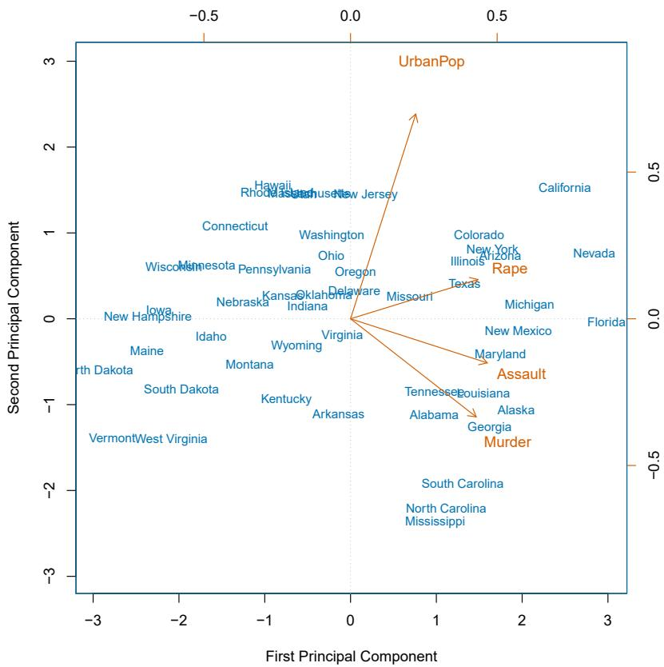

<details>
<summary>scatter</summary>

| State | First Principal Component | Second Principal Component |
| --- | --- | --- |
| California | ~2.5 | ~1.5 |
| Nevada | ~2.8 | ~0.8 |
| Colorado | ~1.2 | ~0.9 |
| New York | ~1.3 | ~0.8 |
| Arizona | ~1.4 | ~0.7 |
| Illinois | ~1.3 | ~0.6 |
| Texas | ~1.3 | ~0.4 |
| Michigan | ~1.8 | ~0.2 |
| Florida | ~2.8 | ~0.0 |
| New Mexico | ~1.8 | ~-0.1 |
| Maryland | ~1.8 | ~-0.3 |
| Louisiana | ~1.5 | ~-0.8 |
| Alaska | ~1.8 | ~-1.0 |
| Georgia | ~1.8 | ~-1.2 |
| South Carolina | ~1.2 | ~-1.9 |
| North Carolina | ~1.2 | ~-2.2 |
| Mississippi | ~1.2 | ~-2.4 |
| Hawaii | ~-0.8 | ~1.5 |
| Massachusetts | ~-0.6 | ~1.4 |
| New Jersey | ~-0.2 | ~1.4 |
| Connecticut | ~-1.2 | ~1.1 |
| Washington | ~-0.4 | ~1.0 |
| Ohio | ~-0.2 | ~0.8 |
| Oregon | ~-0.1 | ~0.6 |
| Kansas | ~-0.8 | ~0.4 |
| Oklahoma | ~-0.4 | ~0.3 |
| Indiana | ~-0.3 | ~0.2 |
| Missouri | ~0.2 | ~0.1 |
| Iowa | ~-1.8 | ~0.1 |
| Nebraska | ~-1.2 | ~0.1 |
| New Hampshire | ~-2.2 | ~0.0 |
| Idaho | ~-1.5 | ~-0.2 |
| Wyoming | ~-0.6 | ~-0.3 |
| Montana | ~-1.0 | ~-0.5 |
| North Dakota | ~-2.8 | ~-0.6 |
| South Dakota | ~-1.8 | ~-0.8 |
| Kentucky | ~-0.8 | ~-1.0 |
| Arkansas | ~-0.2 | ~-1.1 |
| Vermont | ~-2.5 | ~-1.4 |
</details>

FIGURE 12.1. The first two principal components for the USArrests data. The blue state names represent the scores for the first two principal components. The orange arrows indicate the first two principal component loading vectors (with axes on the top and right). For example, the loading for Rape on the first component is 0.54, and its loading on the second principal component 0.17 (the word Rape is centered at the point (0.54, 0.17)). This figure is known as a biplot, because it displays both the principal component scores and the principal component loadings.

Once we have computed the principal components, we can plot them against each other in order to produce low-dimensional views of the data. For instance, we can plot the score vector $Z_{1}$ against $Z_{2}$ , $Z_{1}$ against $Z_{3}$ , $Z_{2}$ against $Z_{3}$ , and so forth. Geometrically, this amounts to projecting the original data down onto the subspace spanned by $\phi_{1}$ , $\phi_{2}$ , and $\phi_{3}$ , and plotting the projected points.

We illustrate the use of PCA on the USArrests data set. For each of the 50 states in the United States, the data set contains the number of arrests per 100,000 residents for each of three crimes: Assault, Murder, and Rape. We also record UrbanPop (the percent of the population in each state living in urban areas). The principal component score vectors have length n = 50, and the principal component loading vectors have length p = 4. PCA was performed after standardizing each variable to have mean zero and standard

<table><tr><td></td><td>PC1</td><td>PC2</td></tr><tr><td>Murder</td><td>0.5358995</td><td>-0.4181809</td></tr><tr><td>Assault</td><td>0.5831836</td><td>-0.1879856</td></tr><tr><td>UrbanPop</td><td>0.2781909</td><td>0.8728062</td></tr><tr><td>Rape</td><td>0.5434321</td><td>0.1673186</td></tr></table>

TABLE 12.1. The principal component loading vectors, $\phi_{1}$ and $\phi_{2}$ , for the USArrests data. These are also displayed in Figure 12.1.

deviation one. Figure 12.1 plots the first two principal components of these data. The figure represents both the principal component scores and the loading vectors in a single biplot display. The loadings are also given in Table 12.2.1.

In Figure 12.1, we see that the first loading vector places approximately equal weight on Assault, Murder, and Rape, but with much less weight on UrbanPop. Hence this component roughly corresponds to a measure of overall rates of serious crimes. The second loading vector places most of its weight on UrbanPop and much less weight on the other three features. Hence, this component roughly corresponds to the level of urbanization of the state. Overall, we see that the crime-related variables (Murder, Assault, and Rape) are located close to each other, and that the UrbanPop variable is far from the other three. This indicates that the crime-related variables are correlated with each other—states with high murder rates tend to have high assault and rape rates—and that the UrbanPop variable is less correlated with the other three.

We can examine differences between the states via the two principal component score vectors shown in Figure 12.1. Our discussion of the loading vectors suggests that states with large positive scores on the first component, such as California, Nevada and Florida, have high crime rates, while states like North Dakota, with negative scores on the first component, have low crime rates. California also has a high score on the second component, indicating a high level of urbanization, while the opposite is true for states like Mississippi. States close to zero on both components, such as Indiana, have approximately average levels of both crime and urbanization.

# 12.2.2 Another Interpretation of Principal Components

The first two principal component loading vectors in a simulated three-dimensional data set are shown in the left-hand panel of Figure 12.2; these two loading vectors span a plane along which the observations have the highest variance.

In the previous section, we describe the principal component loading vectors as the directions in feature space along which the data vary the most, and the principal component scores as projections along these directions. However, an alternative interpretation of principal components can also be

  
FIGURE 12.2. Ninety observations simulated in three dimensions. The observations are displayed in color for ease of visualization. Left: the first two principal component directions span the plane that best fits the data. The plane is positioned to minimize the sum of squared distances to each point. Right: the first two principal component score vectors give the coordinates of the projection of the 90 observations onto the plane.

useful: principal components provide low-dimensional linear surfaces that are closest to the observations. We expand upon that interpretation here. $^{3}$

The first principal component loading vector has a very special property: it is the line in p-dimensional space that is closest to the n observations (using average squared Euclidean distance as a measure of closeness). This interpretation can be seen in the left-hand panel of Figure 6.15; the dashed lines indicate the distance between each observation and the line defined by the first principal component loading vector. The appeal of this interpretation is clear: we seek a single dimension of the data that lies as close as possible to all of the data points, since such a line will likely provide a good summary of the data.

The notion of principal components as the dimensions that are closest to the n observations extends beyond just the first principal component. For instance, the first two principal components of a data set span the plane that is closest to the n observations, in terms of average squared Euclidean distance. An example is shown in the left-hand panel of Figure 12.2. The first three principal components of a data set span the three-dimensional hyperplane that is closest to the n observations, and so forth.

Using this interpretation, together the first M principal component score vectors and the first M principal component loading vectors provide the best M-dimensional approximation (in terms of Euclidean distance) to

the $i$ th observation $x_{ij}$ . This representation can be written as

$$
x _ {i j} \approx \sum_ {m = 1} ^ {M} z _ {i m} \phi_ {j m}. \tag {12.5}
$$

We can state this more formally by writing down an optimization problem. Suppose the data matrix X is column-centered. Out of all approximations of the form $x_{ij} \approx \sum_{m=1}^{M} a_{im} b_{jm}$ , we could ask for the one with the smallest residual sum of squares:

$$
\underset {\mathbf {A} \in \mathbb {R} ^ {n \times M}, \mathbf {B} \in \mathbb {R} ^ {p \times M}} {\text {minimize}} \left\{\sum_ {j = 1} ^ {p} \sum_ {i = 1} ^ {n} \left(x _ {i j} - \sum_ {m = 1} ^ {M} a _ {i m} b _ {j m}\right) ^ {2} \right\}. \tag {12.6}
$$

Here, $\mathbf{A}$ is an $n \times M$ matrix whose $(i, m)$ element is $a_{im}$ , and $\mathbf{B}$ is a $p \times M$ element whose $(j, m)$ element is $b_{jm}$ .

It can be shown that for any value of M, the columns of the matrices $\hat{A}$ and $\hat{B}$ that solve (12.6) are in fact the first M principal components score and loading vectors. In other words, if $\hat{A}$ and $\hat{B}$ solve (12.6), then $\hat{a}_{im} = z_{im}$ and $\hat{b}_{jm} = \phi_{jm}$ . $^{4}$ This means that the smallest possible value of the objective in (12.6) is

$$
\sum_ {j = 1} ^ {p} \sum_ {i = 1} ^ {n} \left(x _ {i j} - \sum_ {m = 1} ^ {M} z _ {i m} \phi_ {j m}\right) ^ {2}. \tag {12.7}
$$

In summary, together the M principal component score vectors and M principal component loading vectors can give a good approximation to the data when M is sufficiently large. When $M = \min(n - 1, p)$ , then the representation is exact: $x_{ij} = \sum_{m=1}^{M} z_{im} \phi_{jm}$ .

# 12.2.3 The Proportion of Variance Explained

In Figure 12.2, we performed PCA on a three-dimensional data set (left-hand panel) and projected the data onto the first two principal component loading vectors in order to obtain a two-dimensional view of the data (i.e. the principal component score vectors; right-hand panel). We see that this two-dimensional representation of the three-dimensional data does successfully capture the major pattern in the data: the orange, green, and cyan observations that are near each other in three-dimensional space remain nearby in the two-dimensional representation. Similarly, we have seen on the USArrests data set that we can summarize the 50 observations and 4 variables using just the first two principal component score vectors and the first two principal component loading vectors.

We can now ask a natural question: how much of the information in a given data set is lost by projecting the observations onto the first few principal components? That is, how much of the variance in the data is not contained in the first few principal components? More generally, we are interested in knowing the proportion of variance explained (PVE) by each

principal component. The total variance present in a data set (assuming that the variables have been centered to have mean zero) is defined as

$$
\sum_ {j = 1} ^ {p} \mathrm{Var} (X _ {j}) = \sum_ {j = 1} ^ {p} \frac {1}{n} \sum_ {i = 1} ^ {n} x _ {i j} ^ {2}, \tag {12.8}
$$

and the variance explained by the mth principal component is

$$
\frac {1}{n} \sum_ {i = 1} ^ {n} z _ {i m} ^ {2} = \frac {1}{n} \sum_ {i = 1} ^ {n} \left(\sum_ {j = 1} ^ {p} \phi_ {j m} x _ {i j}\right) ^ {2}. \tag {12.9}
$$

Therefore, the PVE of the $m$ th principal component is given by

$$
\frac {\sum_ {i = 1} ^ {n} z _ {i m} ^ {2}}{\sum_ {j = 1} ^ {p} \sum_ {i = 1} ^ {n} x _ {i j} ^ {2}} = \frac {\sum_ {i = 1} ^ {n} \left(\sum_ {j = 1} ^ {p} \phi_ {j m} x _ {i j}\right) ^ {2}}{\sum_ {j = 1} ^ {p} \sum_ {i = 1} ^ {n} x _ {i j} ^ {2}}. \tag {12.10}
$$

The PVE of each principal component is a positive quantity. In order to compute the cumulative PVE of the first $M$ principal components, we can simply sum (12.10) over each of the first $M$ PVEs. In total, there are $\min(n - 1, p)$ principal components, and their PVEs sum to one.

In Section 12.2.2, we showed that the first M principal component loading and score vectors can be interpreted as the best M-dimensional approximation to the data, in terms of residual sum of squares. It turns out that the variance of the data can be decomposed into the variance of the first M principal components plus the mean squared error of this M-dimensional approximation, as follows:

$$
\underbrace {\sum_ {j = 1} ^ {p} \frac {1}{n} \sum_ {i = 1} ^ {n} x _ {i j} ^ {2}} _ {\text {Var. of data}} = \underbrace {\sum_ {m = 1} ^ {M} \frac {1}{n} \sum_ {i = 1} ^ {n} z _ {i m} ^ {2}} _ {\text {Var. of first} M \text {PCs}} + \underbrace {\frac {1}{n} \sum_ {j = 1} ^ {p} \sum_ {i = 1} ^ {n} \left(x _ {i j} - \sum_ {m = 1} ^ {M} z _ {i m} \phi_ {j m}\right) ^ {2}} _ {\text {MSE of} M \text {-dimensional approximation}} \tag {12.11}
$$

The three terms in this decomposition are discussed in (12.8), (12.9), and (12.7), respectively. Since the first term is fixed, we see that by maximizing the variance of the first M principal components, we minimize the mean squared error of the M-dimensional approximation, and vice versa. This explains why principal components can be equivalently viewed as minimizing the approximation error (as in Section 12.2.2) or maximizing the variance (as in Section 12.2.1).

Moreover, we can use (12.11) to see that the PVE defined in (12.10) equals

$$
1 - \frac {\sum_ {j = 1} ^ {p} \sum_ {i = 1} ^ {n} \left(x _ {i j} - \sum_ {m = 1} ^ {M} z _ {i m} \phi_ {j m}\right) ^ {2}}{\sum_ {j = 1} ^ {p} \sum_ {i = 1} ^ {n} x _ {i j} ^ {2}} = 1 - \frac {\mathrm{RSS}}{\mathrm{TSS}},
$$

where TSS represents the total sum of squared elements of X, and RSS represents the residual sum of squares of the M-dimensional approximation given by the principal components. Recalling the definition of $R^{2}$ from (3.17), this means that we can interpret the PVE as the $R^{2}$ of the approximation for X given by the first M principal components.

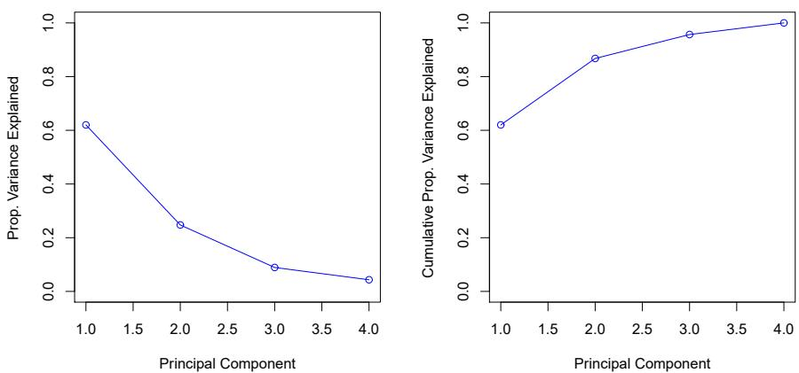  
FIGURE 12.3. Left: a scree plot depicting the proportion of variance explained by each of the four principal components in the USArrests data. Right: the cumulative proportion of variance explained by the four principal components in the USArrests data.

In the USArrests data, the first principal component explains 62.0% of the variance in the data, and the next principal component explains 24.7% of the variance. Together, the first two principal components explain almost 87% of the variance in the data, and the last two principal components explain only 13% of the variance. This means that Figure 12.1 provides a pretty accurate summary of the data using just two dimensions. The PVE of each principal component, as well as the cumulative PVE, is shown in Figure 12.3. The left-hand panel is known as a scree plot, and will be discussed later in this chapter.

scree plot

# 12.2.4 More on PCA

# Scaling the Variables

We have already mentioned that before PCA is performed, the variables should be centered to have mean zero. Furthermore, the results obtained when we perform PCA will also depend on whether the variables have been individually scaled (each multiplied by a different constant). This is in contrast to some other supervised and unsupervised learning techniques, such as linear regression, in which scaling the variables has no effect. (In linear regression, multiplying a variable by a factor of c will simply lead to multiplication of the corresponding coefficient estimate by a factor of 1/c, and thus will have no substantive effect on the model obtained.)

For instance, Figure 12.1 was obtained after scaling each of the variables to have standard deviation one. This is reproduced in the left-hand plot in Figure 12.4. Why does it matter that we scaled the variables? In these data, the variables are measured in different units; Murder, Rape, and Assault are reported as the number of occurrences per 100,000 people, and UrbanPop is the percentage of the state's population that lives in an urban area. These four variables have variances of 18.97, 87.73, 6945.16, and 209.5, respectively. Consequently, if we perform PCA on the unscaled variables, then

  
FIGURE 12.4. Two principal component biplots for the USArrests data. Left: the same as Figure 12.1, with the variables scaled to have unit standard deviations. Right: principal components using unscaled data. Assault has by far the largest loading on the first principal component because it has the highest variance among the four variables. In general, scaling the variables to have standard deviation one is recommended.

the first principal component loading vector will have a very large loading for Assault, since that variable has by far the highest variance. The right-hand plot in Figure 12.4 displays the first two principal components for the USArrests data set, without scaling the variables to have standard deviation one. As predicted, the first principal component loading vector places almost all of its weight on Assault, while the second principal component loading vector places almost all of its weight on UrbanPop. Comparing this to the left-hand plot, we see that scaling does indeed have a substantial effect on the results obtained.

However, this result is simply a consequence of the scales on which the variables were measured. For instance, if Assault were measured in units of the number of occurrences per 100 people (rather than number of occurrences per 100,000 people), then this would amount to dividing all of the elements of that variable by 1,000. Then the variance of the variable would be tiny, and so the first principal component loading vector would have a very small value for that variable. Because it is undesirable for the principal components obtained to depend on an arbitrary choice of scaling, we typically scale each variable to have standard deviation one before we perform PCA.

In certain settings, however, the variables may be measured in the same units. In this case, we might not wish to scale the variables to have standard deviation one before performing PCA. For instance, suppose that the variables in a given data set correspond to expression levels for p genes. Then since expression is measured in the same “units” for each gene, we might choose not to scale the genes to each have standard deviation one.

# Uniqueness of the Principal Components

While in theory the principal components need not be unique, in almost all practical settings they are (up to sign flips). This means that two different software packages will yield the same principal component loading vectors, although the signs of those loading vectors may differ. The signs may differ because each principal component loading vector specifies a direction in $p$ -dimensional space: flipping the sign has no effect as the direction does not change. (Consider Figure 6.14—the principal component loading vector is a line that extends in either direction, and flipping its sign would have no effect.) Similarly, the score vectors are unique up to a sign flip, since the variance of $Z$ is the same as the variance of $-Z$ . It is worth noting that when we use (12.5) to approximate $x_{ij}$ we multiply $z_{im}$ by $\phi_{jm}$ . Hence, if the sign is flipped on both the loading and score vectors, the final product of the two quantities is unchanged.

# Deciding How Many Principal Components to Use

In general, an $n \times p$ data matrix X has $\min(n - 1, p)$ distinct principal components. However, we usually are not interested in all of them; rather, we would like to use just the first few principal components in order to visualize or interpret the data. In fact, we would like to use the smallest number of principal components required to get a good understanding of the data. How many principal components are needed? Unfortunately, there is no single (or simple!) answer to this question.

We typically decide on the number of principal components required to visualize the data by examining a scree plot, such as the one shown in the left-hand panel of Figure 12.3. We choose the smallest number of principal components that are required in order to explain a sizable amount of the variation in the data. This is done by eyeballing the scree plot, and looking for a point at which the proportion of variance explained by each subsequent principal component drops off. This drop is often referred to as an elbow in the scree plot. For instance, by inspection of Figure 12.3, one might conclude that a fair amount of variance is explained by the first two principal components, and that there is an elbow after the second component. After all, the third principal component explains less than ten percent of the variance in the data, and the fourth principal component explains less than half that and so is essentially worthless.

However, this type of visual analysis is inherently ad hoc. Unfortunately, there is no well-accepted objective way to decide how many principal components are enough. In fact, the question of how many principal components are enough is inherently ill-defined, and will depend on the specific area of application and the specific data set. In practice, we tend to look at the first few principal components in order to find interesting patterns in the data. If no interesting patterns are found in the first few principal components, then further principal components are unlikely to be of interest. Conversely, if the first few principal components are interesting, then we typically continue to look at subsequent principal components until no further interesting patterns are found. This is admittedly a subjective ap-

proach, and is reflective of the fact that PCA is generally used as a tool for exploratory data analysis.

On the other hand, if we compute principal components for use in a supervised analysis, such as the principal components regression presented in Section 6.3.1, then there is a simple and objective way to determine how many principal components to use: we can treat the number of principal component score vectors to be used in the regression as a tuning parameter to be selected via cross-validation or a related approach. The comparative simplicity of selecting the number of principal components for a supervised analysis is one manifestation of the fact that supervised analyses tend to be more clearly defined and more objectively evaluated than unsupervised analyses.

# 12.2.5 Other Uses for Principal Components

We saw in Section 6.3.1 that we can perform regression using the principal component score vectors as features. In fact, many statistical techniques, such as regression, classification, and clustering, can be easily adapted to use the $n \times M$ matrix whose columns are the first $M \ll p$ principal component score vectors, rather than using the full $n \times p$ data matrix. This can lead to less noisy results, since it is often the case that the signal (as opposed to the noise) in a data set is concentrated in its first few principal components.

# 12.3 Missing Values and Matrix Completion

Often datasets have missing values, which can be a nuisance. For example, suppose that we wish to analyze the USArrests data, and discover that 20 of the 200 values have been randomly corrupted and marked as missing. Unfortunately, the statistical learning methods that we have seen in this book cannot handle missing values. How should we proceed?

We could remove the rows that contain missing observations and perform our data analysis on the complete rows. But this seems wasteful, and depending on the fraction missing, unrealistic. Alternatively, if $x_{ij}$ is missing, then we could replace it by the mean of the jth column (using the non-missing entries to compute the mean). Although this is a common and convenient strategy, often we can do better by exploiting the correlation between the variables.

In this section we show how principal components can be used to impute the missing values, through a process known as matrix completion. The completed matrix can then be used in a statistical learning method, such as linear regression or LDA.

This approach for imputing missing data is appropriate if the missingness is random. For example, it is suitable if a patient's weight is missing because the battery of the electronic scale was flat at the time of his exam. By contrast, if the weight is missing because the patient was too heavy to climb on the scale, then this is not missing at random; the missingness is

informative, and the approach described here for handling missing data is not suitable.

Sometimes data is missing by necessity. For example, if we form a matrix of the ratings (on a scale from 1 to 5) that n customers have given to the entire Netflix catalog of p movies, then most of the matrix will be missing, since no customer will have seen and rated more than a tiny fraction of the catalog. If we can impute the missing values well, then we will have an idea of what each customer will think of movies they have not yet seen. Hence matrix completion can be used to power recommender systems.

recommender systems

# Principal Components with Missing Values

In Section 12.2.2, we showed that the first M principal component score and loading vectors provide the “best” approximation to the data matrix X, in the sense of (12.6). Suppose that some of the observations $x_{ij}$ are missing. We now show how one can both impute the missing values and solve the principal component problem at the same time. We return to a modified form of the optimization problem (12.6),

$$
\underset {\mathbf {A} \in \mathbb {R} ^ {n \times M}, \mathbf {B} \in \mathbb {R} ^ {p \times M}} {\text {minimize}} \left\{\sum_ {(i, j) \in \mathcal {O}} \left(x _ {i j} - \sum_ {m = 1} ^ {M} a _ {i m} b _ {j m}\right) ^ {2} \right\}, \tag {12.12}
$$

where $\mathcal{O}$ is the set of all observed pairs of indices $(i,j)$ , a subset of the possible $n \times p$ pairs.

Once we solve this problem:

- we can estimate a missing observation $x_{ij}$ using $\hat{x}_{ij} = \sum_{m=1}^{M} \hat{a}_{im} \hat{b}_{jm}$ , where $\hat{a}_{im}$ and $\hat{b}_{jm}$ are the $(i, m)$ and $(j, m)$ elements, respectively, of the matrices $\hat{\mathbf{A}}$ and $\hat{\mathbf{B}}$ that solve (12.12); and  
- we can (approximately) recover the $M$ principal component scores and loadings, as we did when the data were complete.

It turns out that solving $(12.12)$ exactly is difficult, unlike in the case of complete data: the eigen decomposition no longer applies. But the simple iterative approach in Algorithm 12.1, which is demonstrated in Section 12.5.2, typically provides a good solution. $^{56}$

We illustrate Algorithm 12.1 on the USArrests data. There are p = 4 variables and n = 50 observations (states). We first standardized the data so each variable has mean zero and standard deviation one. We then randomly selected 20 of the 50 states, and then for each of these we randomly set one of the four variables to be missing. Thus, 10% of the elements of the data matrix were missing. We applied Algorithm 12.1 with M = 1 principal component. Figure 12.5 shows that the recovery of the missing elements

# Algorithm 12.1 Iterative Algorithm for Matrix Completion

1. Create a complete data matrix $\tilde{X}$ of dimension $n \times p$ of which the $(i, j)$ element equals

$$
\tilde {x} _ {i j} = \left\{ \begin{array}{l l} x _ {i j} & \text {if} (i, j) \in \mathcal {O} \\ \bar {x} _ {j} & \text {if} (i, j) \notin \mathcal {O}, \end{array} \right.
$$

where $\bar{x}_{j}$ is the average of the observed values for the jth variable in the incomplete data matrix X. Here, O indexes the observations that are observed in X.

2. Repeat steps (a)-(c) until the objective (12.14) fails to decrease:

(a) Solve

$$
\underset {\mathbf {A} \in \mathbb {R} ^ {n \times M}, \mathbf {B} \in \mathbb {R} ^ {p \times M}} {\text {minimize}} \left\{\sum_ {j = 1} ^ {p} \sum_ {i = 1} ^ {n} \left(\tilde {x} _ {i j} - \sum_ {m = 1} ^ {M} a _ {i m} b _ {j m}\right) ^ {2} \right\} \tag {12.13}
$$

by computing the principal components of $\tilde{X}$ .

(b) For each element $(i,j)\notin \mathcal{O}$ , set $\tilde{x}_{ij}\leftarrow \sum_{m = 1}^{M}\hat{a}_{im}\hat{b}_{jm}$ .

(c) Compute the objective

$$
\sum_ {(i, j) \in \mathcal {O}} \left(x _ {i j} - \sum_ {m = 1} ^ {M} \hat {a} _ {i m} \hat {b} _ {j m}\right) ^ {2}. \tag {12.14}
$$

3. Return the estimated missing entries $\tilde{x}_{ij}, (i,j) \notin \mathcal{O}$ .

is pretty accurate. Over 100 random runs of this experiment, the average correlation between the true and imputed values of the missing elements is 0.63, with a standard deviation of 0.11. Is this good performance? To answer this question, we can compare this correlation to what we would have gotten if we had estimated these 20 values using the complete data — that is, if we had simply computed $\hat{x}_{ij} = z_{i1}\phi_{j1}$ , where $z_{i1}$ and $\phi_{j1}$ are elements of the first principal component score and loading vectors of the complete data. $^{7}$ Using the complete data in this way results in an average correlation of 0.79 between the true and estimated values for these 20 elements, with a standard deviation of 0.08. Thus, our imputation method does worse than the method that uses all of the data ( $0.63 \pm 0.11$ versus $0.79 \pm 0.08$ ), but its performance is still pretty good. (And of course, the method that uses all of the data cannot be applied in a real-world setting with missing data.)

Figure 12.6 further indicates that Algorithm 12.1 performs fairly well on this dataset.

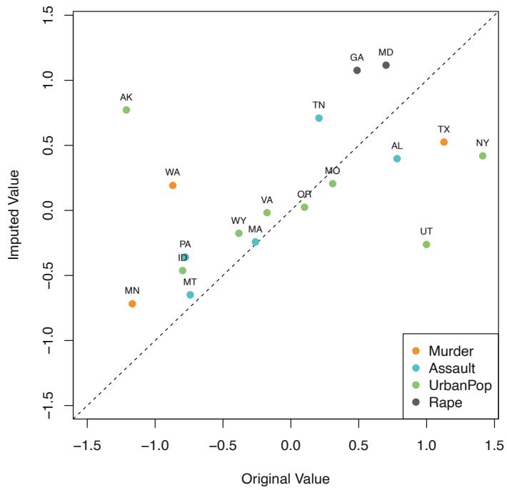

<details>
<summary>scatter</summary>

| State | Type | Original Value | Imputed Value |
| --- | --- | --- | --- |
| AK | UrbanPop | ~-1.2 | ~0.75 |
| WA | Murder | ~-0.9 | ~0.2 |
| MN | Murder | ~-1.1 | ~-0.7 |
| MT | UrbanPop | ~-0.8 | ~-0.45 |
| PA | Assault | ~-0.8 | ~-0.35 |
| ID | Assault | ~-0.8 | ~-0.35 |
| WY | UrbanPop | ~-0.4 | ~-0.15 |
| MA | Assault | ~-0.3 | ~-0.25 |
| VA | UrbanPop | ~-0.2 | ~0.0 |
| OR | UrbanPop | ~0.1 | ~0.05 |
| MO | UrbanPop | ~0.3 | ~0.2 |
| TN | Assault | ~0.2 | ~0.7 |
| GA | Rape | ~0.5 | ~1.1 |
| MD | Rape | ~0.7 | ~1.1 |
| AL | Assault | ~0.8 | ~0.4 |
| TX | Murder | ~1.1 | ~0.55 |
| UT | UrbanPop | ~1.0 | ~-0.25 |
| NY | UrbanPop | ~1.4 | ~0.4 |
</details>

FIGURE 12.5. Missing value imputation on the USArrests data. Twenty values (10% of the total number of matrix elements) were artificially set to be missing, and then imputed via Algorithm 12.1 with M = 1. The figure displays the true value $x_{ij}$ and the imputed value $\hat{x}_{ij}$ for all twenty missing values. For each of the twenty missing values, the color indicates the variable, and the label indicates the state. The correlation between the true and imputed values is around 0.63.

We close with a few observations:

- The USArrests data has only four variables, which is on the low end for methods like Algorithm 12.1 to work well. For this reason, for this demonstration we randomly set at most one variable per state to be missing, and only used M = 1 principal component.  
- In general, in order to apply Algorithm 12.1, we must select $M$ , the number of principal components to use for the imputation. One approach is to randomly leave out a few additional elements from the matrix, and select $M$ based on how well those known values are recovered. This is closely related to the validation-set approach seen in Chapter 5.

# Recommender Systems

Digital streaming services like Netflix and Amazon use data about the content that a customer has viewed in the past, as well as data from other customers, to suggest other content for the customer. As a concrete example, some years back, Netflix had customers rate each movie that they had seen with a score from 1–5. This resulted in a very big $n \times p$ matrix for which the $(i, j)$ element is the rating given by the ith customer to the

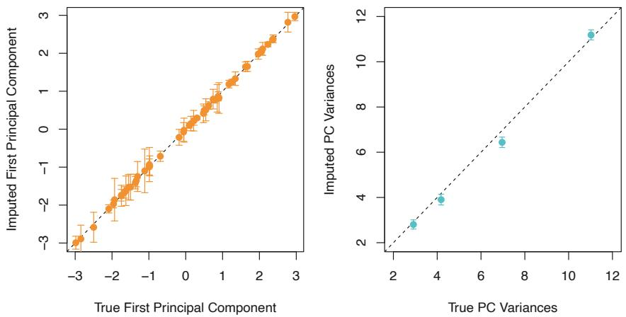  
FIGURE 12.6. As described in the text, in each of 100 trials, we left out 20 elements of the USArrests dataset. In each trial, we applied Algorithm 12.1 with M = 1 to impute the missing elements and compute the principal components. Left: For each of the 50 states, the imputed first principal component scores (averaged over 100 trials, and displayed with a standard deviation bar) are plotted against the first principal component scores computed using all the data. Right: The imputed principal component loadings (averaged over 100 trials, and displayed with a standard deviation bar) are plotted against the true principal component loadings.

jth movie. One specific early example of this matrix had n = 480,189 customers and p = 17,770 movies. However, on average each customer had seen around 200 movies, so 99% of the matrix had missing elements. Table 12.2 illustrates the setup.

In order to suggest a movie that a particular customer might like, Netflix needed a way to impute the missing values of this data matrix. The key idea is as follows: the set of movies that the $i$ th customer has seen will overlap with those that other customers have seen. Furthermore, some of those other customers will have similar movie preferences to the $i$ th customer. Thus, it should be possible to use similar customers' ratings of movies that the $i$ th customer has not seen to predict whether the $i$ th customer will like those movies.

More concretely, by applying Algorithm 12.1, we can predict the ith customer's rating for the jth movie using $\hat{x}_{ij} = \sum_{m=1}^{M} \hat{a}_{im} \hat{b}_{jm}$ . Furthermore, we can interpret the M components in terms of “cliques” and “genres”:

- $\hat{a}_{im}$ represents the strength with which the $i$ th user belongs to the $m$ th clique, where a clique is a group of customers that enjoys movies of the $m$ th genre;  
- $\hat{b}_{jm}$ represents the strength with which the $j$ th movie belongs to the $m$ th genre.

Examples of genres include Romance, Western, and Action.

Principal component models similar to Algorithm 12.1 are at the heart of many recommender systems. Although the data matrices involved are

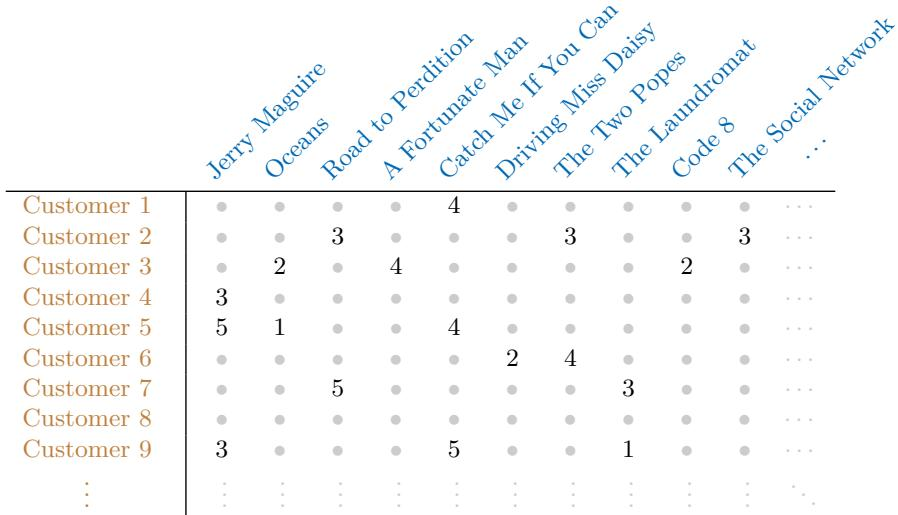

<details>
<summary>flowchart</summary>

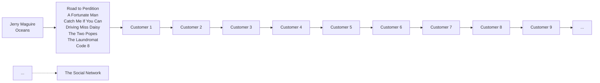
</details>

TABLE 12.2. Excerpt of the Netflix movie rating data. The movies are rated from 1 (worst) to 5 (best). The symbol • represents a missing value: a movie that was not rated by the corresponding customer.

typically massive, algorithms have been developed that can exploit the high level of missingness in order to perform efficient computations.

# 12.4 Clustering Methods

Clustering refers to a very broad set of techniques for finding subgroups, or clusters, in a data set. When we cluster the observations of a data set, we seek to partition them into distinct groups so that the observations within each group are quite similar to each other, while observations in different groups are quite different from each other. Of course, to make this concrete, we must define what it means for two or more observations to be similar or different. Indeed, this is often a domain-specific consideration that must be made based on knowledge of the data being studied.

For instance, suppose that we have a set of n observations, each with p features. The n observations could correspond to tissue samples for patients with breast cancer, and the p features could correspond to measurements collected for each tissue sample; these could be clinical measurements, such as tumor stage or grade, or they could be gene expression measurements. We may have a reason to believe that there is some heterogeneity among the n tissue samples; for instance, perhaps there are a few different unknown subtypes of breast cancer. Clustering could be used to find these subgroups. This is an unsupervised problem because we are trying to discover structure—in this case, distinct clusters—on the basis of a data set. The goal in supervised problems, on the other hand, is to try to predict some outcome vector such as survival time or response to drug treatment.

Both clustering and PCA seek to simplify the data via a small number of summaries, but their mechanisms are different:

- PCA looks to find a low-dimensional representation of the observations that explain a good fraction of the variance;  
- Clustering looks to find homogeneous subgroups among the observations.

Another application of clustering arises in marketing. We may have access to a large number of measurements (e.g. median household income, occupation, distance from nearest urban area, and so forth) for a large number of people. Our goal is to perform market segmentation by identifying subgroups of people who might be more receptive to a particular form of advertising, or more likely to purchase a particular product. The task of performing market segmentation amounts to clustering the people in the data set.

Since clustering is popular in many fields, there exist a great number of clustering methods. In this section we focus on perhaps the two best-known clustering approaches: K-means clustering and hierarchical clustering. In K-means clustering, we seek to partition the observations into a pre-specified number of clusters. On the other hand, in hierarchical clustering, we do not know in advance how many clusters we want; in fact, we end up with a tree-like visual representation of the observations, called a dendrogram, that allows us to view at once the clusterings obtained for each possible number of clusters, from 1 to n. There are advantages and disadvantages to each of these clustering approaches, which we highlight in this chapter.

In general, we can cluster observations on the basis of the features in order to identify subgroups among the observations, or we can cluster features on the basis of the observations in order to discover subgroups among the features. In what follows, for simplicity we will discuss clustering observations on the basis of the features, though the converse can be performed by simply transposing the data matrix.

# 12.4.1 K-Means Clustering

K-means clustering is a simple and elegant approach for partitioning a data set into K distinct, non-overlapping clusters. To perform K-means clustering, we must first specify the desired number of clusters K; then the K-means algorithm will assign each observation to exactly one of the K clusters. Figure 12.7 shows the results obtained from performing K-means clustering on a simulated example consisting of 150 observations in two dimensions, using three different values of K.

The K-means clustering procedure results from a simple and intuitive mathematical problem. We begin by defining some notation. Let $C_{1}, \ldots, C_{K}$ denote sets containing the indices of the observations in each cluster. These sets satisfy two properties:

1. $C_{1} \cup C_{2} \cup \cdots \cup C_{K} = \{1, \ldots, n\}$ . In other words, each observation belongs to at least one of the K clusters.  
2. $C_k \cap C_{k'} = \emptyset$ for all $k \neq k'$ . In other words, the clusters are non-overlapping: no observation belongs to more than one cluster.

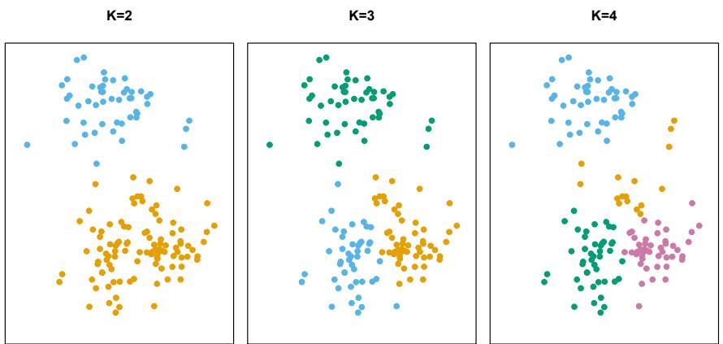  
FIGURE 12.7. A simulated data set with 150 observations in two-dimensional space. Panels show the results of applying K-means clustering with different values of K, the number of clusters. The color of each observation indicates the cluster to which it was assigned using the K-means clustering algorithm. Note that there is no ordering of the clusters, so the cluster coloring is arbitrary. These cluster labels were not used in clustering; instead, they are the outputs of the clustering procedure.

For instance, if the $i$ th observation is in the $k$ th cluster, then $i \in C_k$ . The idea behind $K$ -means clustering is that a good clustering is one for which the within-cluster variation is as small as possible. The within-cluster variation for cluster $C_k$ is a measure $W(C_k)$ of the amount by which the observations within a cluster differ from each other. Hence we want to solve the problem

$$
\underset {C _ {1}, \dots , C _ {K}} {\text {minimize}} \left\{\sum_ {k = 1} ^ {K} W (C _ {k}) \right\}. \tag {12.15}
$$

In words, this formula says that we want to partition the observations into $K$ clusters such that the total within-cluster variation, summed over all $K$ clusters, is as small as possible.

Solving (12.15) seems like a reasonable idea, but in order to make it actionable we need to define the within-cluster variation. There are many possible ways to define this concept, but by far the most common choice involves squared Euclidean distance. That is, we define

$$
W (C _ {k}) = \frac {1}{| C _ {k} |} \sum_ {i, i ^ {\prime} \in C _ {k}} \sum_ {j = 1} ^ {p} (x _ {i j} - x _ {i ^ {\prime} j}) ^ {2}, \tag {12.16}
$$

where $|C_{k}|$ denotes the number of observations in the kth cluster. In other words, the within-cluster variation for the kth cluster is the sum of all of the pairwise squared Euclidean distances between the observations in the kth cluster, divided by the total number of observations in the kth cluster. Combining (12.15) and (12.16) gives the optimization problem that defines

$K$ -means clustering,

$$
\underset {C _ {1}, \dots , C _ {K}} {\text {minimize}} \left\{\sum_ {k = 1} ^ {K} \frac {1}{| C _ {k} |} \sum_ {i, i ^ {\prime} \in C _ {k}} \sum_ {j = 1} ^ {p} (x _ {i j} - x _ {i ^ {\prime} j}) ^ {2} \right\}. \tag {12.17}
$$

Now, we would like to find an algorithm to solve $(12.17)$ —that is, a method to partition the observations into K clusters such that the objective of $(12.17)$ is minimized. This is in fact a very difficult problem to solve precisely, since there are almost $K^{n}$ ways to partition n observations into K clusters. This is a huge number unless K and n are tiny! Fortunately, a very simple algorithm can be shown to provide a local optimum—a pretty good solution—to the K-means optimization problem $(12.17)$ . This approach is laid out in Algorithm 12.2.

# Algorithm 12.2 K-Means Clustering

1. Randomly assign a number, from 1 to $K$ , to each of the observations. These serve as initial cluster assignments for the observations.

2. Iterate until the cluster assignments stop changing:

(a) For each of the $K$ clusters, compute the cluster centroid. The $k$ th cluster centroid is the vector of the $p$ feature means for the observations in the $k$ th cluster.  
(b) Assign each observation to the cluster whose centroid is closest (where closest is defined using Euclidean distance).

Algorithm 12.2 is guaranteed to decrease the value of the objective (12.17) at each step. To understand why, the following identity is illuminating:

$$
\frac {1}{| C _ {k} |} \sum_ {i, i ^ {\prime} \in C _ {k}} \sum_ {j = 1} ^ {p} (x _ {i j} - x _ {i ^ {\prime} j}) ^ {2} = 2 \sum_ {i \in C _ {k}} \sum_ {j = 1} ^ {p} (x _ {i j} - \bar {x} _ {k j}) ^ {2}, \tag {12.18}
$$

where $\bar{x}_{kj} = \frac{1}{|C_{k}|} \sum_{i \in C_{k}} x_{ij}$ is the mean for feature j in cluster $C_{k}$ . In Step 2(a) the cluster means for each feature are the constants that minimize the sum-of-squared deviations, and in Step 2(b), reallocating the observations can only improve (12.18). This means that as the algorithm is run, the clustering obtained will continually improve until the result no longer changes; the objective of (12.17) will never increase. When the result no longer changes, a local optimum has been reached. Figure 12.8 shows the progression of the algorithm on the toy example from Figure 12.7. K-means clustering derives its name from the fact that in Step 2(a), the cluster centroids are computed as the mean of the observations assigned to each cluster.

Because the K-means algorithm finds a local rather than a global optimum, the results obtained will depend on the initial (random) cluster assignment of each observation in Step 1 of Algorithm 12.2. For this reason, it is important to run the algorithm multiple times from different random

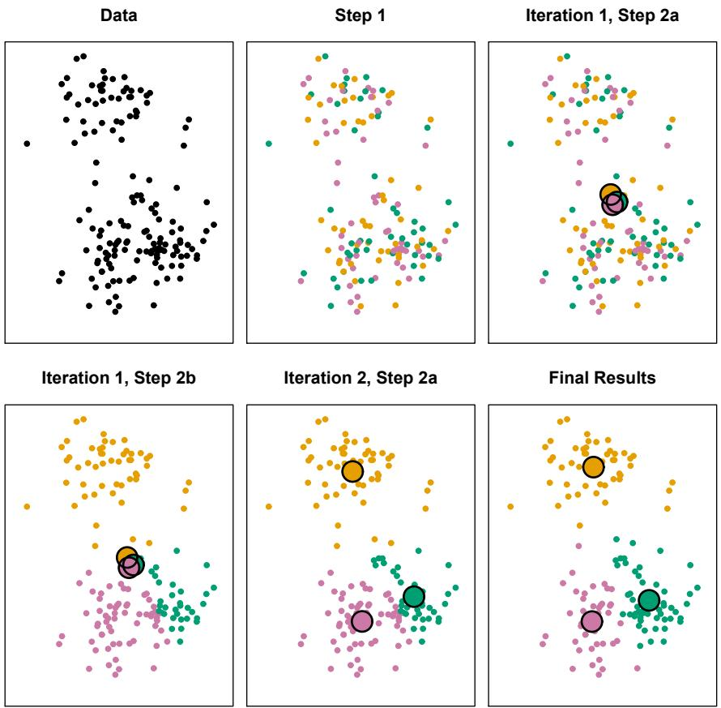  
FIGURE 12.8. The progress of the K-means algorithm on the example of Figure 12.7 with K=3. Top left: the observations are shown. Top center: in Step 1 of the algorithm, each observation is randomly assigned to a cluster. Top right: in Step 2(a), the cluster centroids are computed. These are shown as large colored disks. Initially the centroids are almost completely overlapping because the initial cluster assignments were chosen at random. Bottom left: in Step 2(b), each observation is assigned to the nearest centroid. Bottom center: Step 2(a) is once again performed, leading to new cluster centroids. Bottom right: the results obtained after ten iterations.

initial configurations. Then one selects the best solution, i.e. that for which the objective (12.17) is smallest. Figure 12.9 shows the local optima obtained by running K-means clustering six times using six different initial cluster assignments, using the toy data from Figure 12.7. In this case, the best clustering is the one with an objective value of 235.8.

As we have seen, to perform K-means clustering, we must decide how many clusters we expect in the data. The problem of selecting K is far from simple. This issue, along with other practical considerations that arise in performing K-means clustering, is addressed in Section 12.4.3.

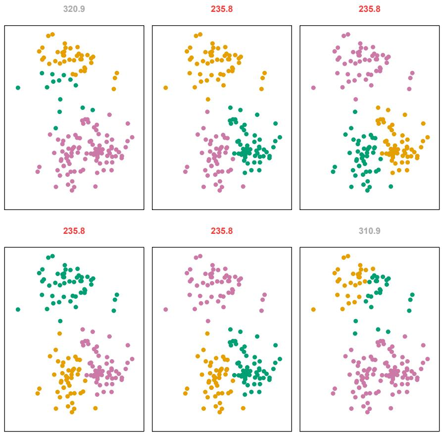  
FIGURE 12.9. K-means clustering performed six times on the data from Figure 12.7 with K = 3, each time with a different random assignment of the observations in Step 1 of the K-means algorithm. Above each plot is the value of the objective (12.17). Three different local optima were obtained, one of which resulted in a smaller value of the objective and provides better separation between the clusters. Those labeled in red all achieved the same best solution, with an objective value of 235.8.

# 12.4.2 Hierarchical Clustering

One potential disadvantage of K-means clustering is that it requires us to pre-specify the number of clusters K. Hierarchical clustering is an alternative approach which does not require that we commit to a particular choice of K. Hierarchical clustering has an added advantage over K-means clustering in that it results in an attractive tree-based representation of the observations, called a dendrogram.

In this section, we describe bottom-up or agglomerative clustering. This is the most common type of hierarchical clustering, and refers to the fact that a dendrogram (generally depicted as an upside-down tree; see Figure 12.11) is built starting from the leaves and combining clusters up to the trunk. We will begin with a discussion of how to interpret a dendrogram

bottom-up
agglomerative

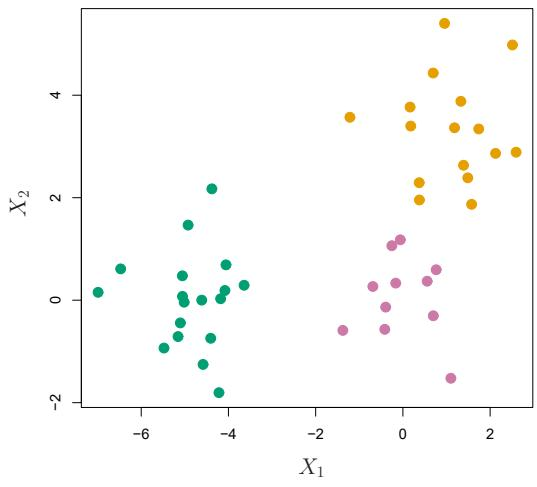

<details>
<summary>scatter</summary>

| Series | X1 (range) | X2 (range) |
| --- | --- | --- |
| Green | -7.0~-3.5 | -1.9~2.2 |
| Orange | -1.2~2.8 | 1.9~5.5 |
| Pink | -1.5~1.2 | -1.6~1.2 |
</details>

FIGURE 12.10. Forty-five observations generated in two-dimensional space. In reality there are three distinct classes, shown in separate colors. However, we will treat these class labels as unknown and will seek to cluster the observations in order to discover the classes from the data.

and then discuss how hierarchical clustering is actually performed—that is, how the dendrogram is built.

# Interpreting a Dendrogram

We begin with the simulated data set shown in Figure 12.10, consisting of 45 observations in two-dimensional space. The data were generated from a three-class model; the true class labels for each observation are shown in distinct colors. However, suppose that the data were observed without the class labels, and that we wanted to perform hierarchical clustering of the data. Hierarchical clustering (with complete linkage, to be discussed later) yields the result shown in the left-hand panel of Figure 12.11. How can we interpret this dendrogram?

In the left-hand panel of Figure 12.11, each leaf of the dendrogram represents one of the 45 observations in Figure 12.10. However, as we move up the tree, some leaves begin to fuse into branches. These correspond to observations that are similar to each other. As we move higher up the tree, branches themselves fuse, either with leaves or other branches. The earlier (lower in the tree) fusions occur, the more similar the groups of observations are to each other. On the other hand, observations that fuse later (near the top of the tree) can be quite different. In fact, this statement can be made precise: for any two observations, we can look for the point in the tree where branches containing those two observations are first fused. The height of this fusion, as measured on the vertical axis, indicates how different the two observations are. Thus, observations that fuse at the very bottom of the tree are quite similar to each other, whereas observations that fuse close to the top of the tree will tend to be quite different.

This highlights a very important point in interpreting dendrograms that is often misunderstood. Consider the left-hand panel of Figure 12.12, which shows a simple dendrogram obtained from hierarchically clustering nine

  
FIGURE 12.11. Left: dendrogram obtained from hierarchically clustering the data from Figure 12.10 with complete linkage and Euclidean distance. Center: the dendrogram from the left-hand panel, cut at a height of nine (indicated by the dashed line). This cut results in two distinct clusters, shown in different colors. Right: the dendrogram from the left-hand panel, now cut at a height of five. This cut results in three distinct clusters, shown in different colors. Note that the colors were not used in clustering, but are simply used for display purposes in this figure.

observations. One can see that observations 5 and 7 are quite similar to each other, since they fuse at the lowest point on the dendrogram. Observations 1 and 6 are also quite similar to each other. However, it is tempting but incorrect to conclude from the figure that observations 9 and 2 are quite similar to each other on the basis that they are located near each other on the dendrogram. In fact, based on the information contained in the dendrogram, observation 9 is no more similar to observation 2 than it is to observations 8, 5, and 7. (This can be seen from the right-hand panel of Figure 12.12, in which the raw data are displayed.) To put it mathematically, there are $2^{n-1}$ possible reorderings of the dendrogram, where n is the number of leaves. This is because at each of the n-1 points where fusions occur, the positions of the two fused branches could be swapped without affecting the meaning of the dendrogram. Therefore, we cannot draw conclusions about the similarity of two observations based on their proximity along the horizontal axis. Rather, we draw conclusions about the similarity of two observations based on the location on the vertical axis where branches containing those two observations first are fused.

Now that we understand how to interpret the left-hand panel of Figure 12.11, we can move on to the issue of identifying clusters on the basis of a dendrogram. In order to do this, we make a horizontal cut across the dendrogram, as shown in the center and right-hand panels of Figure 12.11. The distinct sets of observations beneath the cut can be interpreted as clusters. In the center panel of Figure 12.11, cutting the dendrogram at a height of nine results in two clusters, shown in distinct colors. In the right-hand panel, cutting the dendrogram at a height of five results in three clusters. Further cuts can be made as one descends the dendrogram in order to obtain any number of clusters, between 1 (corresponding to no cut) and $n$

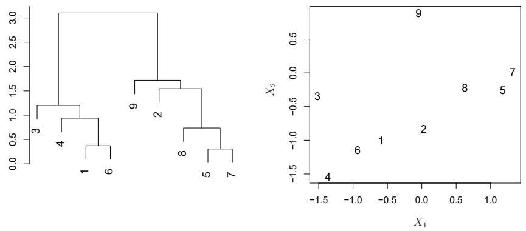  
FIGURE 12.12. An illustration of how to properly interpret a dendrogram with nine observations in two-dimensional space. Left: a dendrogram generated using Euclidean distance and complete linkage. Observations 5 and 7 are quite similar to each other, as are observations 1 and 6. However, observation 9 is no more similar to observation 2 than it is to observations 8, 5, and 7, even though observations 9 and 2 are close together in terms of horizontal distance. This is because observations 2, 8, 5, and 7 all fuse with observation 9 at the same height, approximately 1.8. Right: the raw data used to generate the dendrogram can be used to confirm that indeed, observation 9 is no more similar to observation 2 than it is to observations 8, 5, and 7.

(corresponding to a cut at height 0, so that each observation is in its own cluster). In other words, the height of the cut to the dendrogram serves the same role as the K in K-means clustering: it controls the number of clusters obtained.

Figure 12.11 therefore highlights a very attractive aspect of hierarchical clustering: one single dendrogram can be used to obtain any number of clusters. In practice, people often look at the dendrogram and select by eye a sensible number of clusters, based on the heights of the fusion and the number of clusters desired. In the case of Figure 12.11, one might choose to select either two or three clusters. However, often the choice of where to cut the dendrogram is not so clear.

The term hierarchical refers to the fact that clusters obtained by cutting the dendrogram at a given height are necessarily nested within the clusters obtained by cutting the dendrogram at any greater height. However, on an arbitrary data set, this assumption of hierarchical structure might be unrealistic. For instance, suppose that our observations correspond to a group of men and women, evenly split among Americans, Japanese, and French. We can imagine a scenario in which the best division into two groups might split these people by gender, and the best division into three groups might split them by nationality. In this case, the true clusters are not nested, in the sense that the best division into three groups does not result from taking the best division into two groups and splitting up one of those groups. Consequently, this situation could not be well-represented by hierarchical clustering. Due to situations such as this one, hierarchical clustering can sometimes yield worse (i.e. less accurate) results than K-means clustering for a given number of clusters.

# Algorithm 12.3 Hierarchical Clustering

1. Begin with $n$ observations and a measure (such as Euclidean distance) of all the $\binom{n}{2} = n(n - 1) / 2$ pairwise dissimilarities. Treat each observation as its own cluster.  
2. For $i = n, n - 1, \dots, 2$ :  
(a) Examine all pairwise inter-cluster dissimilarities among the i clusters and identify the pair of clusters that are least dissimilar (that is, most similar). Fuse these two clusters. The dissimilarity between these two clusters indicates the height in the dendrogram at which the fusion should be placed.  
(b) Compute the new pairwise inter-cluster dissimilarities among the $i - 1$ remaining clusters.

# The Hierarchical Clustering Algorithm

The hierarchical clustering dendrogram is obtained via an extremely simple algorithm. We begin by defining some sort of dissimilarity measure between each pair of observations. Most often, Euclidean distance is used; we will discuss the choice of dissimilarity measure later in this chapter. The algorithm proceeds iteratively. Starting out at the bottom of the dendrogram, each of the n observations is treated as its own cluster. The two clusters that are most similar to each other are then fused so that there now are n - 1 clusters. Next the two clusters that are most similar to each other are fused again, so that there now are n - 2 clusters. The algorithm proceeds in this fashion until all of the observations belong to one single cluster, and the dendrogram is complete. Figure 12.13 depicts the first few steps of the algorithm, for the data from Figure 12.12. To summarize, the hierarchical clustering algorithm is given in Algorithm 12.3.

This algorithm seems simple enough, but one issue has not been addressed. Consider the bottom right panel in Figure 12.13. How did we determine that the cluster $\{5,7\}$ should be fused with the cluster $\{8\}$ ? We have a concept of the dissimilarity between pairs of observations, but how do we define the dissimilarity between two clusters if one or both of the clusters contains multiple observations? The concept of dissimilarity between a pair of observations needs to be extended to a pair of groups of observations. This extension is achieved by developing the notion of linkage, which defines the dissimilarity between two groups of observations. The four most common types of linkage—complete, average, single, and centroid—are briefly described in Table 12.3. Average, complete, and single linkage are most popular among statisticians. Average and complete linkage are generally preferred over single linkage, as they tend to yield more balanced dendrograms. Centroid linkage is often used in genomics, but suffers from a major drawback in that an inversion can occur, whereby two clusters are fused at a height below either of the individual clusters in the dendrogram. This can lead to difficulties in visualization as well as in interpretation of the dendrogram. The dissimilarities computed in Step 2(b)

<table><tr><td>Linkage</td><td>Description</td></tr><tr><td>Complete</td><td>Maximal intercluster dissimilarity. Compute all pairwise dissimilarities between the observations in cluster A and the observations in cluster B, and record the largest of these dissimilarities.</td></tr><tr><td>Single</td><td>Minimal intercluster dissimilarity. Compute all pairwise dissimilarities between the observations in cluster A and the observations in cluster B, and record the smallest of these dissimilarities. Single linkage can result in extended, trailing clusters in which single observations are fused one-at-a-time.</td></tr><tr><td>Average</td><td>Mean intercluster dissimilarity. Compute all pairwise dissimilarities between the observations in cluster A and the observations in cluster B, and record the average of these dissimilarities.</td></tr><tr><td>Centroid</td><td>Dissimilarity between the centroid for cluster A (a mean vector of length p) and the centroid for cluster B. Centroid linkage can result in undesirable inversions.</td></tr></table>

TABLE 12.3. A summary of the four most commonly-used types of linkage in hierarchical clustering.

of the hierarchical clustering algorithm will depend on the type of linkage used, as well as on the choice of dissimilarity measure. Hence, the resulting dendrogram typically depends quite strongly on the type of linkage used, as is shown in Figure 12.14.

# Choice of Dissimilarity Measure

Thus far, the examples in this chapter have used Euclidean distance as the dissimilarity measure. But sometimes other dissimilarity measures might be preferred. For example, correlation-based distance considers two observations to be similar if their features are highly correlated, even though the observed values may be far apart in terms of Euclidean distance. This is an unusual use of correlation, which is normally computed between variables; here it is computed between the observation profiles for each pair of observations. Figure 12.15 illustrates the difference between Euclidean and correlation-based distance. Correlation-based distance focuses on the shapes of observation profiles rather than their magnitudes.

The choice of dissimilarity measure is very important, as it has a strong effect on the resulting dendrogram. In general, careful attention should be paid to the type of data being clustered and the scientific question at hand. These considerations should determine what type of dissimilarity measure is used for hierarchical clustering.

For instance, consider an online retailer interested in clustering shoppers based on their past shopping histories. The goal is to identify subgroups of similar shoppers, so that shoppers within each subgroup can be shown items and advertisements that are particularly likely to interest them. Suppose the data takes the form of a matrix where the rows are the shoppers and the columns are the items available for purchase; the elements of the data matrix indicate the number of times a given shopper has purchased a

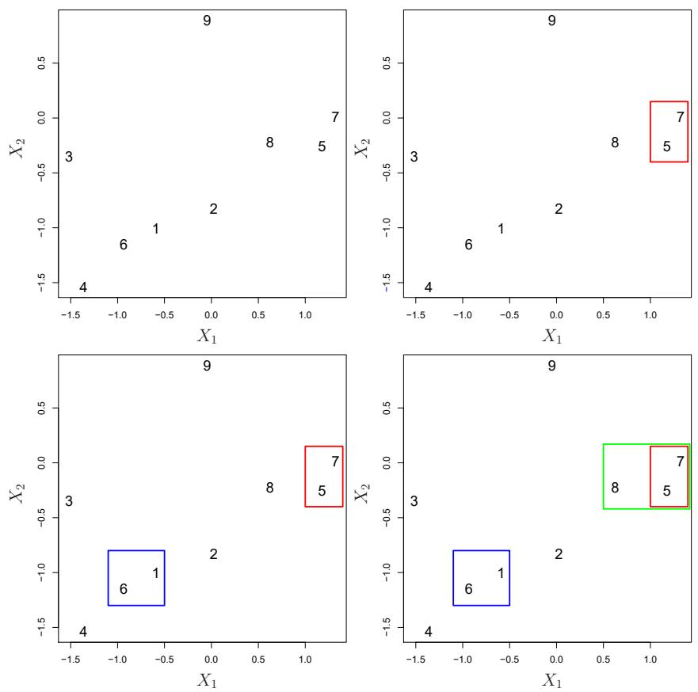  
FIGURE 12.13. An illustration of the first few steps of the hierarchical clustering algorithm, using the data from Figure 12.12, with complete linkage and Euclidean distance. Top Left: initially, there are nine distinct clusters, $\{1\}, \{2\}, \ldots, \{9\}$ . Top Right: the two clusters that are closest together, $\{5\}$ and $\{7\}$ , are fused into a single cluster. Bottom Left: the two clusters that are closest together, $\{6\}$ and $\{1\}$ , are fused into a single cluster. Bottom Right: the two clusters that are closest together using complete linkage, $\{8\}$ and the cluster $\{5, 7\}$ , are fused into a single cluster.

given item (i.e. a 0 if the shopper has never purchased this item, a 1 if the shopper has purchased it once, etc.) What type of dissimilarity measure should be used to cluster the shoppers? If Euclidean distance is used, then shoppers who have bought very few items overall (i.e. infrequent users of the online shopping site) will be clustered together. This may not be desirable. On the other hand, if correlation-based distance is used, then shoppers with similar preferences (e.g. shoppers who have bought items A and B but never items C or D) will be clustered together, even if some shoppers with these preferences are higher-volume shoppers than others. Therefore, for this application, correlation-based distance may be a better choice.

In addition to carefully selecting the dissimilarity measure used, one must also consider whether or not the variables should be scaled to have standard deviation one before the dissimilarity between the observations is computed. To illustrate this point, we continue with the online shopping ex-

  
FIGURE 12.14. Average, complete, and single linkage applied to an example data set. Average and complete linkage tend to yield more balanced clusters.

ample just described. Some items may be purchased more frequently than others; for instance, a shopper might buy ten pairs of socks a year, but a computer very rarely. High-frequency purchases like socks therefore tend to have a much larger effect on the inter-shopper dissimilarities, and hence on the clustering ultimately obtained, than rare purchases like computers. This may not be desirable. If the variables are scaled to have standard deviation one before the inter-observation dissimilarities are computed, then each variable will in effect be given equal importance in the hierarchical clustering performed. We might also want to scale the variables to have standard deviation one if they are measured on different scales; otherwise, the choice of units (e.g. centimeters versus kilometers) for a particular variable will greatly affect the dissimilarity measure obtained. It should come as no surprise that whether or not it is a good decision to scale the variables before computing the dissimilarity measure depends on the application at hand. An example is shown in Figure 12.16. We note that the issue of whether or not to scale the variables before performing clustering applies to K-means clustering as well.

# 12.4.3 Practical Issues in Clustering

Clustering can be a very useful tool for data analysis in the unsupervised setting. However, there are a number of issues that arise in performing clustering. We describe some of these issues here.

# Small Decisions with Big Consequences

In order to perform clustering, some decisions must be made.

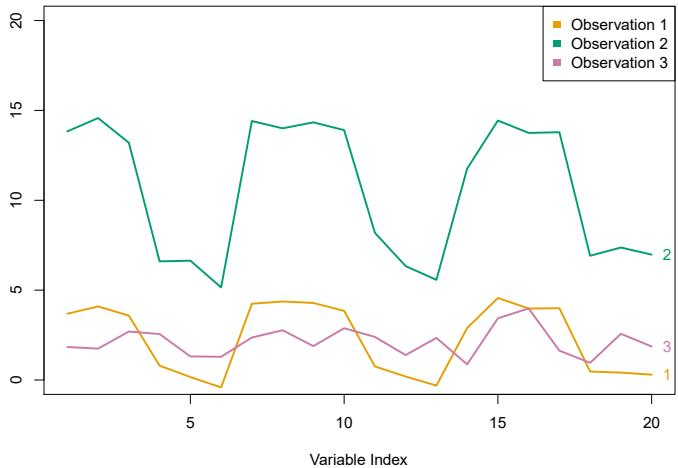

<details>
<summary>line</summary>

| Variable Index | Observation 1 | Observation 2 | Observation 3 |
| --- | --- | --- | --- |
| 1 | ~3.7 | ~13.8 | ~1.8 |
| 2 | ~4.1 | ~14.6 | ~1.7 |
| 3 | ~3.6 | ~13.2 | ~2.6 |
| 4 | ~0.8 | ~6.6 | ~2.5 |
| 5 | ~0.2 | ~6.6 | ~1.3 |
| 6 | ~-0.4 | ~5.2 | ~1.3 |
| 7 | ~4.2 | ~14.4 | ~2.2 |
| 8 | ~4.3 | ~14.0 | ~2.7 |
| 9 | ~4.2 | ~14.4 | ~1.9 |
| 10 | ~3.9 | ~13.9 | ~2.8 |
| 11 | ~0.7 | ~8.2 | ~2.3 |
| 12 | ~0.1 | ~6.4 | ~1.4 |
| 13 | ~-0.3 | ~5.6 | ~2.3 |
| 14 | ~2.8 | ~11.7 | ~0.8 |
| 15 | ~4.5 | ~14.4 | ~3.5 |
| 16 | ~4.0 | ~13.7 | ~4.0 |
| 17 | ~4.0 | ~13.8 | ~1.6 |
| 18 | ~0.5 | ~6.9 | ~0.8 |
| 19 | ~0.4 | ~7.4 | ~2.5 |
| 20 | ~0.3 | ~7.0 | ~1.8 |
</details>

FIGURE 12.15. Three observations with measurements on 20 variables are shown. Observations 1 and 3 have similar values for each variable and so there is a small Euclidean distance between them. But they are very weakly correlated, so they have a large correlation-based distance. On the other hand, observations 1 and 2 have quite different values for each variable, and so there is a large Euclidean distance between them. But they are highly correlated, so there is a small correlation-based distance between them.

- Should the observations or features first be standardized in some way? For instance, maybe the variables should be scaled to have standard deviation one.  
- In the case of hierarchical clustering,

- What dissimilarity measure should be used?  
- What type of linkage should be used?  
- Where should we cut the dendrogram in order to obtain clusters?

\- In the case of K-means clustering, how many clusters should we look for in the data?

Each of these decisions can have a strong impact on the results obtained. In practice, we try several different choices, and look for the one with the most useful or interpretable solution. With these methods, there is no single right answer—any solution that exposes some interesting aspects of the data should be considered.

# Validating the Clusters Obtained

Any time clustering is performed on a data set we will find clusters. But we really want to know whether the clusters that have been found represent true subgroups in the data, or whether they are simply a result of clustering the noise. For instance, if we were to obtain an independent set of observations, then would those observations also display the same set of clusters? This is a hard question to answer. There exist a number of techniques for assigning a p-value to a cluster in order to assess whether there is more

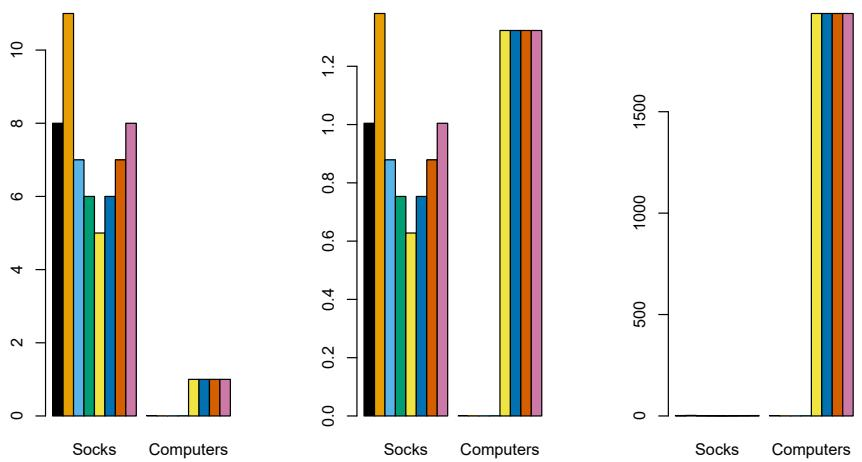  
FIGURE 12.16. An eclectic online retailer sells two items: socks and computers. Left: the number of pairs of socks, and computers, purchased by eight online shoppers is displayed. Each shopper is shown in a different color. If inter-observation dissimilarities are computed using Euclidean distance on the raw variables, then the number of socks purchased by an individual will drive the dissimilarities obtained, and the number of computers purchased will have little effect. This might be undesirable, since (1) computers are more expensive than socks and so the online retailer may be more interested in encouraging shoppers to buy computers than socks, and (2) a large difference in the number of socks purchased by two shoppers may be less informative about the shoppers' overall shopping preferences than a small difference in the number of computers purchased. Center: the same data are shown, after scaling each variable by its standard deviation. Now the two products will have a comparable effect on the inter-observation dissimilarities obtained. Right: the same data are displayed, but now the y-axis represents the number of dollars spent by each online shopper on socks and on computers. Since computers are much more expensive than socks, now computer purchase history will drive the inter-observation dissimilarities obtained.

evidence for the cluster than one would expect due to chance. However, there has been no consensus on a single best approach. More details can be found in ESL. $^{8}$

# Other Considerations in Clustering

Both K-means and hierarchical clustering will assign each observation to a cluster. However, sometimes this might not be appropriate. For instance, suppose that most of the observations truly belong to a small number of (unknown) subgroups, and a small subset of the observations are quite different from each other and from all other observations. Then since K-means and hierarchical clustering force every observation into a cluster, the clusters found may be heavily distorted due to the presence of outliers that do not belong to any cluster. Mixture models are an attractive approach for accommodating the presence of such outliers. These amount to a soft version of K-means clustering, and are described in ESL.

In addition, clustering methods generally are not very robust to perturbations to the data. For instance, suppose that we cluster n observations, and then cluster the observations again after removing a subset of the n observations at random. One would hope that the two sets of clusters obtained would be quite similar, but often this is not the case!

# A Tempered Approach to Interpreting the Results of Clustering

We have described some of the issues associated with clustering. However, clustering can be a very useful and valid statistical tool if used properly. We mentioned that small decisions in how clustering is performed, such as how the data are standardized and what type of linkage is used, can have a large effect on the results. Therefore, we recommend performing clustering with different choices of these parameters, and looking at the full set of results in order to see what patterns consistently emerge. Since clustering can be non-robust, we recommend clustering subsets of the data in order to get a sense of the robustness of the clusters obtained. Most importantly, we must be careful about how the results of a clustering analysis are reported. These results should not be taken as the absolute truth about a data set. Rather, they should constitute a starting point for the development of a scientific hypothesis and further study, preferably on an independent data set.

# 12.5 Lab: Unsupervised Learning

In this lab we demonstrate PCA and clustering on several datasets. As in other labs, we import some of our libraries at this top level. This makes the code more readable, as scanning the first few lines of the notebook tell us what libraries are used in this notebook.

```python
import numpy as np
import pandas as pd
import matplotlib.pyplot as plt
from statsmodels.datasets import get_rdataset
from sklearn.decomposition import PCA
from sklearn.preprocessing import StandardScaler
from ISLP import load_data
```

We also collect the new imports needed for this lab.

```python
from sklearn.cluster import \
    (KMeans,
        AgglomerativeClustering)
from scipy.cluster.hierarchy import \
    (dendrogram,
        cut_tree)
from ISLP.cluster import compute_linkage
```

# 12.5.1 Principal Components Analysis

In this lab, we perform PCA on USArrests, a data set in the R computing environment. We retrieve the data using get\_rdataset(), which can fetch

data from many standard R packages.

The rows of the data set contain the 50 states, in alphabetical order.

```python
In [3]: USArrests = get_rdataset('USArrests').data
USArrests
```

```python
Out[3]:
            Murder    Assault    UrbanPop    Rape
    Alabama    13.2    236    58    21.2
    Alaska    10.0    263    48    44.5
    Arizona    8.1    294    80    31.0
    ...    ...    ...    ...    ...
    Wisconsin    2.6    53    66    10.8
    Wyoming    6.8    161    60    15.6
```

The columns of the data set contain the four variables.

```txt
In [4]: USArrests.columns
```

```javascript
Out[4]: Index(['Murder', 'Assault', 'UrbanPop', 'Rape'],
        dtype='object')
```

We first briefly examine the data. We notice that the variables have vastly different means.

```txt
In [5]: USArrests.mean()
```

```txt
Out[5]: Murder          7.788
        Assault     170.760
        UrbanPop     65.540
        Rape         21.232
        dtype: float64
```

Dataframes have several useful methods for computing column-wise summaries. We can also examine the variance of the four variables using the var() method.

```txt
In [6]: USArests.var()
```

```txt
Out[6]: Murder          18.970465
        Assault     6945.165714
        UrbanPop     209.518776
        Rape           87.729159
        dtype: float64
```

Not surprisingly, the variables also have vastly different variances. The UrbanPop variable measures the percentage of the population in each state living in an urban area, which is not a comparable number to the number of rapes in each state per 100,000 individuals. PCA looks for derived variables that account for most of the variance in the data set. If we do not scale the variables before performing PCA, then the principal components would mostly be driven by the Assault variable, since it has by far the largest variance. So if the variables are measured in different units or vary widely in scale, it is recommended to standardize the variables to have standard deviation one before performing PCA. Typically we set the means to zero as well.

This scaling can be done via the StandardScaler() transform imported above. We first fit the scaler, which computes the necessary means and standard deviations and then apply it to our data using the transform method. As before, we combine these steps using the fit\_transform() method.

```python
In [7]: scaler = StandardScaler(with_std=True,
                              with_mean=True)
USArrests_scaled = scaler.fit_transform(USArrests)
```

Having scaled the data, we can then perform principal components analysis using the PCA() transform from the sklearn.decomposition package.

PCA()

```txt
In [8]: pcaUS = PCA()
```

(By default, the PCA() transform centers the variables to have mean zero though it does not scale them.) The transform pcaUS can be used to find the PCA scores returned by fit(). Once the fit method has been called, the pcaUS object also contains a number of useful quantities.

```javascript
In [9]: pcaUS.fit(USArrests_scaled)
```

After fitting, the mean\_ attribute corresponds to the means of the variables. In this case, since we centered and scaled the data with scaler() the means will all be 0.

```txt
In [10]: pcaUS.mean_
```

```txt
Out[10]: array([-0., 0., -0., 0.])
```

The scores can be computed using the transform() method of pcaUS after it has been fit.

```python
In [11]: scores = pcaUS.transform(USArrests_scaled)
```

We will plot these scores a bit further down. The components\_ attribute provides the principal component loadings: each row of pcaUS.components\_ contains the corresponding principal component loading vector.

```javascript
In [12]: pcaUS.components_
```

```txt
Out[12]: array([[ 0.53589947,  0.58318363,  0.27819087,  0.54343209],
       [ 0.41818087,  0.1879856 , -0.87280619, -0.16731864],
       [-0.34123273, -0.26814843, -0.37801579,  0.81777791],
       [ 0.6492278 , -0.74340748,  0.13387773,  0.08902432]])
```

The biplot is a common visualization method used with PCA. It is not built in as a standard part of sklearn, though there are python packages that do produce such plots. Here we make a simple biplot manually.

```python
In [13]: i, j = 0, 1 # which components
fig, ax = plt.subplots(1, 1, figsize=(8, 8))
ax.scatter(scores[:,0], scores[:,1])
ax.set_xlabel('PC%d' % (i+1))
ax.set_ylabel('PC%d' % (j+1))
for k in range(pcaUS.components_.shape[1]):
```

```javascript
ax.arrow(0, 0, pcaUS.components_[i,k], pcaUS.components_[j,k])
ax.text(pcaUS.components_[i,k],
       pcaUS.components_[j,k],
       USArrests.columns[k])
```

Notice that this figure is a reflection of Figure 12.1 through the y-axis. Recall that the principal components are only unique up to a sign change, so we can reproduce that figure by flipping the signs of the second set of scores and loadings. We also increase the length of the arrows to emphasize the loadings.

```python
In [14]: scale_arrow = s_ = 2
scores[:,1] *= -1
pcaUS.components_[1] *= -1 # flip the y-axis
fig, ax = plt.subplots(1, 1, figsize=(8, 8))
ax.scatter(scores[:,0], scores[:,1])
ax.set_xlabel('PC%d' % (i+1))
ax.set_ylabel('PC%d' % (j+1))
for k in range(pcaUS.components_.shape[1]):
    ax.arrow(0, 0, s_*pcaUS.components_[i,k], s_*pcaUS.components_[
        j,k])
    ax.text(s_*pcaUS.components_[i,k],
        s_*pcaUS.components_[j,k],
        USArrests.columns[k])
```

The standard deviations of the principal component scores are as follows:

```javascript
In [15]: scores.std(0, ddof=1)
```

```txt
Out[15]: array([1.5909, 1.0050, 0.6032, 0.4207])
```

The variance of each score can be extracted directly from the pcaUS object via the explained\_variance\_ attribute.

```txt
In [16]: pcaUS.explained_variance_
```

```txt
Out[16]: array([2.5309, 1.01 , 0.3638, 0.177 ])
```

The proportion of variance explained by each principal component (PVE) is stored as explained\_variance\_ratio\_:

```txt
In [17]: pcaUS.explained_variance_ratio_
```

```txt
Out[17]: array([0.6201, 0.2474, 0.0891, 0.0434])
```

We see that the first principal component explains 62.0% of the variance in the data, the next principal component explains 24.7% of the variance, and so forth. We can plot the PVE explained by each component, as well as the cumulative PVE. We first plot the proportion of variance explained.

```python
In [18]: %%capture
fig, axes = plt.subplots(1, 2, figsize=(15, 6))
ticks = np.arange(pcaUS.n_components_)+1
ax = axes[0]
ax.plot(ticks,
            pcaUS.explained_variance_ratio_,
            marker='o')
```

```python
ax.set_xlabel('Principal Component');
ax.set_ylabel('Proportion of Variance Explained')
ax.set_ylim([0,1])
ax.set_xticks(ticks)
```

Notice the use of %%capture, which suppresses the displaying of the partially completed figure.

In [19]:  
```python
ax = axes[1]
ax.plot(ticks,
    pcaUS.explained_variance_ratio_.cumsum(),
    marker='o')
ax.set_xlabel('Principal Component')
ax.set_ylabel('Cumulative Proportion of Variance Explained')
ax.set_ylim([0, 1])
ax.set_xticks(ticks)
fig
```

The result is similar to that shown in Figure 12.3. Note that the method cumsum() computes the cumulative sum of the elements of a numeric vector. For instance:

cumsum()

In [20]:  
```txt
a = np.array([1,2,8,-3])
np.cumsum(a)
```

Out[20]: array([ 1,  3, 11,  8])

# 12.5.2 Matrix Completion

We now re-create the analysis carried out on the USArrests data in Section 12.3.

We saw in Section 12.2.2 that solving the optimization problem (12.6) on a centered data matrix X is equivalent to computing the first M principal components of the data. We use our scaled and centered USArrests data as X below. The singular value decomposition (SVD) is a general algorithm for solving (12.6).

singular
value de-
composition
svd()

In [21]:  
```txt
X = USArrests_scaled
U, D, V = np.linalg.svd(X, full_matrices=False)
U.shape, D.shape, V.shape
```

Out[21]: ((50, 4), (4,), (4, 4))

The np.linalg.svd() function returns three components, U, D and V. The matrix V is equivalent to the loading matrix from principal components (up to an unimportant sign flip). Using the full\_matrices=False option ensures that for a tall matrix the shape of U is the same as the shape of X.

np.linalg.
svd()

In [22]:  
```txt
V
```

```txt
Out[22]: array([[-0.53589947, -0.58318363, -0.27819087, -0.54343209],
       [ 0.41818087,  0.1879856 , -0.87280619, -0.16731864],
       [-0.34123273, -0.26814843, -0.37801579,  0.81777791],
       [ 0.6492278 , -0.74340748,  0.13387773,  0.08902432]])
```

In [23]: pcaUS.components\_  
```txt
Out[23]: array([[ 0.53589947,  0.58318363,  0.27819087,  0.54343209],
       [ 0.41818087,  0.1879856 , -0.87280619, -0.16731864],
       [-0.34123273, -0.26814843, -0.37801579,  0.81777791],
       [ 0.6492278 , -0.74340748,  0.13387773,  0.08902432]])
```

The matrix U corresponds to a standardized version of the PCA score matrix (each column standardized to have sum-of-squares one). If we multiply each column of U by the corresponding element of D, we recover the PCA scores exactly (up to a meaningless sign flip).

In [24]: (U \* D[None,:])[:3]  
```txt
Out[24]: array([[-0.9856,  1.1334, -0.4443,  0.1563],
       [-1.9501,  1.0732,  2.04  , -0.4386],
       [-1.7632, -0.746  ,  0.0548, -0.8347]])
```  
In [25]: scores[:3]

```txt
Out[25]: array([[ 0.9856, -1.1334, -0.4443,  0.1563],
       [ 1.9501, -1.0732,  2.04   , -0.4386],
       [ 1.7632,  0.746  ,  0.0548, -0.8347]])
```

While it would be possible to carry out this lab using the PCA() estimator, here we use the np.linalg.svd() function in order to illustrate its use.

We now omit 20 entries in the $50 \times 4$ data matrix at random. We do so by first selecting 20 rows (states) at random, and then selecting one of the four entries in each row at random. This ensures that every row has at least three observed values.

```python
In [26]: n_omit = 20
np.random.seed(15)
r_idx = np.random.choice(np.arange(X.shape[0]),
                                n_omit,
                                replace=False)
c_idx = np.random.choice(np.arange(X.shape[1]),
                                n_omit,
                                replace=True)
Xna = X.copy()
Xna[r_idx, c_idx] = np.nan
```

Here the array r\_idx contains 20 integers from 0 to 49; this represents the states (rows of X) that are selected to contain missing values. And c\_idx contains 20 integers from 0 to 3, representing the features (columns in X) that contain the missing values for each of the selected states.

We now write some code to implement Algorithm 12.1. We first write a function that takes in a matrix, and returns an approximation to the matrix using the svd() function. This will be needed in Step 2 of Algorithm 12.1.

```python
def low_rank(X, M=1):
    U, D, V = np.linalg.svd(X)
    L = U[:,:M] * D[None,:M]
    return L.dot(V[:M])
```

To conduct Step 1 of the algorithm, we initialize Xhat — this is $\tilde{X}$ in Algorithm 12.1 — by replacing the missing values with the column means of the non-missing entries. These are stored in Xbar below after running np.nanmean() over the row axis. We make a copy so that when we assign values to Xhat below we do not also overwrite the values in Xna.

np.nanmean()

In [28]:

```python
Xhat = Xna.copy()
Xbar = np.nanmean(Xhat, axis=0)
Xhat[r_idx, c_idx] = Xbar[c_idx]
```

Before we begin Step 2, we set ourselves up to measure the progress of our iterations:

In [29]:

```python
thresh = 1e-7
rel_err = 1
count = 0
ismiss = np.isnan(Xna)
mssold = np.mean(Xhat[~ismiss]**2)
mss0 = np.mean(Xna[~ismiss]**2)
```

Here ismiss is a logical matrix with the same dimensions as Xna; a given element is True if the corresponding matrix element is missing. The notation $\sim$ ismiss negates this boolean vector. This is useful because it allows us to access both the missing and non-missing entries. We store the mean of the squared non-missing elements in mss0. We store the mean squared error of the non-missing elements of the old version of Xhat in mssold (which currently agrees with mss0). We plan to store the mean squared error of the non-missing elements of the current version of Xhat in mss, and will then iterate Step 2 of Algorithm 12.1 until the relative error, defined as (mssold - mss) / mss0, falls below thresh = 1e-7. $^{9}$

In Step 2(a) of Algorithm 12.1, we approximate Xhat using low\_rank(); we call this Xapp. In Step 2(b), we use Xapp to update the estimates for elements in Xhat that are missing in Xna. Finally, in Step 2(c), we compute the relative error. These three steps are contained in the following while loop:

In [30]:

```python
while rel_err > thresh:
    count += 1
    # Step 2(a)
    Xapp = low_rank(Xhat, M=1)
    # Step 2(b)
    Xhat[ismiss] = Xapp[ismiss]
    # Step 2(c)
    mss = np.mean(((Xna - Xapp)[~ismiss])**2)
    rel_err = (mssold - mss) / mss0
    mssold = mss
    print("Iteration: {0}, MSS:{1:.3f}, Rel.Err {2:.2e}"
        .format(count, mss, rel_err))
```

```txt
Iteration: 1, MSS:0.395, Rel.Err 5.99e-01
Iteration: 2, MSS:0.382, Rel.Err 1.33e-02
Iteration: 3, MSS:0.381, Rel.Err 1.44e-03
Iteration: 4, MSS:0.381, Rel.Err 1.79e-04
Iteration: 5, MSS:0.381, Rel.Err 2.58e-05
Iteration: 6, MSS:0.381, Rel.Err 4.22e-06
Iteration: 7, MSS:0.381, Rel.Err 7.65e-07
Iteration: 8, MSS:0.381, Rel.Err 1.48e-07
Iteration: 9, MSS:0.381, Rel.Err 2.95e-08
```

We see that after eight iterations, the relative error has fallen below $thresh = 1e^{-7}$ , and so the algorithm terminates. When this happens, the mean squared error of the non-missing elements equals 0.381.

Finally, we compute the correlation between the 20 imputed values and the actual values:

```txt
In [31]: np.corrcoef(Xapp[ismiss], X[ismiss])[0,1]
```

```txt
Out[31]:0.711
```

In this lab, we implemented Algorithm 12.1 ourselves for didactic purposes. However, a reader who wishes to apply matrix completion to their data might look to more specialized Python implementations.

# 12.5.3 Clustering

# K-Means Clustering

The estimator sklearn.cluster.KMeans() performs K-means clustering in Python. We begin with a simple simulated example in which there truly are two clusters in the data: the first 25 observations have a mean shift relative to the next 25 observations.

```txt
In [32]: np.random.seed(0);
X = np.random.standard_normal((50,2));
X[:25,0] += 3;
X[:25,1] -= 4;
```

We now perform $K$ -means clustering with $K = 2$ .

```python
kmeans = KMeans(n_clusters=2,
                       random_state=2,
                       n_init=20).fit(X)
```

We specify random\_state to make the results reproducible. The cluster assignments of the 50 observations are contained in kmeans.labels\_.

```txt
In [34]: kmeans.labels_
```

```txt
Out[34]: array([1, 1, 1, 1, 1, 1, 1, 1, 1, 1, 1, 1, 1, 1, 1, 1, 1, 1, 1, 1, 1, 1, 1, 1, 1, 1, 1, 1, 1, 1, 1, 1, 1, 1, 1, 1, 1, 1, 1, 1, 1, 1, 1, 1, 1, 1, 1, 1, 1, 1, 1, 1, 1, 1, 1, 1, 1, 1, 1, 1, 1, 1, 1, 1, 1, 1, 1, 1, 1, 1, 1, 1, 1, 1, 1, 1, 1, 1, 1, 1, 1, 1, 1, 1, 1, 1, 1, 1, 1, 1, 1, 1, 1, 1, 1, 1, 1, 1, 1, 1, 1, 1, 1, 1, 1, 1, 1, 1, 1, 1, 1, 1, 1, 1, 1, 1, 1, 1, 1, 1, 1, 1, 1, 1, 1, 1, 1, 1, 1, 1, 1, 1, 1, 1, 1, 1, 1, 1, 1, 1, 1, 1, 1, 1, 1, 1, 1, 1, 1, 1, 1, 1, 1, 1, 1, 1, 1, 1, 1, 1, 1, 1, 1, 1, 1, 1, 1, 1, 1, 1, 1, 1, 1, 1, 1, 1, 1, 1, 1, 1, 1, 1, 1, 1, 1, 1, 1, 1, 1, 1, 1, 1, 1, 1, 1, 1, 1, 1, 1, 1, 1, 1, 1, 1, 1, 1, 1, 1, 1, 1, 1, 1, 1, 1, 1, 1, 1, 1, 1, 1, 1, 1, 1, 1, 1, 1, 1, 1, 1, 1, 1, 1, 1, 1, 1, 1, 1, 1, 1, 1, 1, 1, 1, 1, 1, 1, 1, 1, 1, 1, 1, 1, 1, 1, 1, 1, 1, 1, 1, 1, 1, 1, 1, 1, 1, 1, 1, 1, 1, 1, 1, 1, 1, 1, 1, 1, 1, 1, 1, 1, 1, 1, 1, 1, 1, 1, 1, 1, 1, 1, 1, 1, 1, 1, 1, 1, 1, 1, 1, 1, 1, 1, 1, 1, 1, 1, 1, 1, 1, 1, 1, 1, 1, 1, 1, 1, 1, 1, 1, 1, 1, 1, 1, 1, 1, 1, 1, 1, 1, 1, 1, 1, 1, 1, 1, 1, 1, 1, 1, 1, 1, 1, 1, 1, 1, 1, 1, 1, 1, 1, 1, 1, 1, 1, 1, 1, 1, 1, 1, 1, 1, 1, 1, 1, 1, 1, 1, 1, 1, 1, 1, 1, 1, 1, 1, 1, 1, 1, 1, 1, 1, 1, 1, 1, 1, 1, 1, 1, 1, 1, 1, 1, 1, 1, 1, 1, 1, 1, 1, 1, 1, 1, 1, 1, 1, 1, 1, 1, 1, 1, 1, 1, 1, 1, 1, 1, 1, 1, 1, 1, 1, 1, 1, 1, 1, 1, 1, 1, 1, 1, 1, 1, 1, 1, 1, 1, 1, 1, 1, 1, 1, 1, 1, 1, 1, 1, 1, 1, 1, 1, 1, 1, 1, 1, 1, 1, 1, 1, 1, 1, 1, 1, 1, 1, 1, 1, 1, 1, 1, 1, 1, 1, 1, 1, 1, 1, 1, 1, 1, 1, 1, 1, 1, 1, 1, 1, 1, 1, 1, 1, 1, 1, 1, 1, 1, 1, 1, 1, 1, 1, 1, 1, 1, 1, 1, 1, 1, 1, 1, 1, 1, 1, 1, 1, 1, 1, 1, 1, 1, 1, 1, 1, 1, 1, 1, 1, 1, 1, 1, 1, 1, 1, 1, 1, 1, 1, 1, 1, 1, 1, 1, 1, 1, 1, 1, 1, 1, 1, 1, 1, 1, 1, 1, 1, 1, 1, 1, 1, 1, 1, 1, 1, 1, 1, 1, 1, 1, 1, 1, 1, 1, 1, 1, 1, 1, 1, 1, 1, 1, 1, 1, 1, 1, 1, 1, 1, 1, 1, 1, 1, 1, 1, 1, 1, 1, 1, 1, 1, 1, 1, 1, 1, 1, 1, 1, 1, 1, 1, 1, 1, 1, 1, 1, 1, 1, 1, 1, 1, 1, 1, 1, 1, 1, 1, 1, 1, 1, 1, 1, 1, 1, 1, 1, 1, 1, 1, 1, 1, 1, 1, 1, 1, 1, 1, 1, 1, 1, 1, 1, 1, 1, 1, 1, 1, 1, 1, 1, 1, 1, 1, 1, 1, 1, 1, 1, 1, 1, 1, 1, 1, 1, 1, 1, 1, 1, 1, 1, 1, 1, 1, 1, 1, 1, 1, 1, 1, 1, 1, 1, 1, 1, 1, 1, 1, 1, 1, 1, 1, 1, 1, 1, 1, 1, 1, 1, 1, 1, 1, 1, 1, 1, 1, 1, 1, 1, 1, 1, 1, 1, 1, 1, 1, 1, 1, 1, 1, 1, 1, 1, 1, 1, 1, 1, 1, 1, 1, 1, 1, 1, 1, 1, 1, 1, 1, 1, 1, 1, 1, 1, 1, 1, 1, 1, 1, 1, 1, 1, 1, 1, 1, 1, 1, 1, 1, 1, 1, 1, 1, 1, 1, 1, 1, 1, 1, 1, 1, 1, 1, 1, 1, 1, 1, 1, 1, 1, 1, 1, 1, 1, 1, 1, 1, 1, 1, 1, 1, 1, 1, 1, 1, 1, 1, 1, 1, 1, 1, 1, 1, 1, 1, 1, 1, 1, 1, 1, 1, 1, 1, 1, 1, 1, 1, 1, 1, 1, 1, 1, 1, 1, 1, 1, 1, 1, 1, 1, 1, 1, 1, 1, 1, 1, 1, 1, 1, 1, 1, 1, 1, 1, 1, 1, 1, 1, 1, 1, 1, 1, 1, 1, 1, 1, 1, 1, 1, 1, 1, 1, 1, 1, 1, 1, 1, 1, 1, 1, 1, 1, 1, 1, 1, 1, 1, 1, 1, 1, 1, 1, 1, 1, 1, 1, 1, 1, 1, 1, 1, 1, 1, 1, 1, 1, 1, 1, 1, 1, 1, 1, 1, 1, 1, 1, 1, 1, 1, 1, 1, 1, 1, 1, 1, 1, 1, 1, 1, 1, 1, 1, 1, 1, 1, 1, 1, 1, 1, 1, 1, 1, 1, 1, 1, 1, 1, 1, 1, 1, 1, 1, 1, 1, 1, 1, 1, 1, 1, 1, 1, 1, 1, 1, 1, 1, 1, 1, 1, 1, 1, 1, 1, 1, 1, 1, 1, 1, 1, 1, 1, 1, 1, 1, 1, 1, 1, 1, 1, 1, 1, 1, 1, 1, 1, 1, 1, 1, 1, 1, 1, 1, 1, 1, 1, 1, 1, 1, 1, 1, 1, 1, 1, 1, 1, 1, 1, 1, 1, 1, 1, 1, 1, 1, 1, 1, 1, 1, 1, 1, 1, 1, 1, 1, 1, 1, 1, 1, 1, 1, 1, 1, 1, 1, 1, 1, 1, 1, 1, 1, 1, 1, 1, 1, 1, 1, 1, 1, 1, 1, 1, 1, 1, 1, 1, 1, 1, 1, 1, 1, 1, 1, 1, 1, 1, 1, 1, 1, 1, 1, 1, 1, 1, 1, 1, 1, 1, 1, 1, 1, 1, 1, 1, 1, 1, 1, 1, 1, 1, 1, 1, 1, 1, 1, 1, 1, 1, 1, 1, 1, 1, 1, 1, 1, 1, 1, 1, 1, 1, 1, 1, 1, 1, 1, 1, 1, 1, 1, 1, 1, 1, 1, 1, 1, 1, 1, 1, 1, 1, 1, 1, 1, 1, 1, 1, 1, 1, 1, 1, 1, 1, 1, 1, 1, 1, 1, 1, 1, 1, 1, 1, 1, 1, 1, 1, 1, 1, 1, 1, 1, 1, 1, 1, 1, 1, 1, 1, 1, 1, 1, 1, 1, 1, 1, 1, 1, 1, 1, 1, 1, 1, 1, 1, 1, 1, 1, 1, 1, 1, 1, 1, 1, 1, 1, 1, 1, 1, 1, 1, 1, 1, 1, 1, 1, 1, 1, 1, 1, 1, 1, 1, 1, 1, 1, 1, 1, 1, 1, 1, 1, 1, 1, 1, 1, 1, 1, 1, 1, 1, 1, 1, 1, 1, 1, 1, 1, 1, 1, 1, 1, 1, 1, 1, 1, 1, 1, 1, 1, 1, 1, 1, 1, 1, 1, 1, 1, 1, 1, 1, 1, 1, 1, 1, 1, 1, 1, 1, 1, 1, 1, 1, 1, 1, 1, 1, 1, 1, 1, 1, 1, 1, 1, 1, 1, 1, 1, 1, 1, 1, 1, 1, 1, 1, 1, 1, 1, 1, 1, 1, 1, 1, 1, 1, 1, 1, 1, 1, 1, 1, 1, 1, 1, 1, 1, 1, 1, 1, 1, 1, 1, 1, 1, 1, 1, 1, 1, 1, 1, 1, 1, 1, 1, 1, 1, 1, 1, 1, 1, 1, 1, 1, 1, 1, 1, 1, 1, 1, 1, 1, 1, 1, 1, 1, 1, 1, 1, 1, 1, 1, 1, 1, 1, 1, 1, 1, 1, 1, 1, 1, 1, 1, 1, 1, 1, 1, 1, 1, 1, 1, 1, 1, 1, 1, 1, 1, 1, 1, 1, 1, 1, 1, 1, 1, 1, 1, 1, 1, 1, 1, 1, 1, 1, 1, 1, 1, 1, 1, 1, 1, 1, 1, 1, 1, 1, 1, 1, 1, 1, 1, 1, 1, 1, 1, 1, 1, 1, 1, 1, 1, 1, 1, 1, 1, 1, 1, 1, 1, 1, 1, 1, 1, 1, 1, 1, 1, 1, 1, 1, 1, 1, 1, 1, 1, 1, 1, 1, 1, 1, 1, 1, 1, 1, 1, 1, 1, 1, 1, 1, 1, 1, 1, 1, 1, 1, 1, 1, 1, 1, 1, 1, 1, 1, 1, 1, 1, 1, 1, 1, 1, 1, 1, 1, 1, 1, 1, 1, 1, 1, 1, 1, 1, 1, 1, 1, 1, 1, 1, 1, 1, 1, 1, 1, 1, 1, 1, 1, 1, 1, 1, 1, 1, 1, 1, 1, 1, 1, 1, 1, 1, 1, 1, 1, 1, 1, 1, 1, 1, 1, 1, 1, 1, 1, 1, 1, 1, 1, 1, 1, 1, 1, 1, 1, 1, 1, 1, 1, 1, 1, 1, 1, 1, 1, 1, 1, 1, 1, 1, 1, 1, 1, 1, 1, 1, 1, 1, 1, 1, 1, 1, 1, 1, 1, 1, 1, 1, 1, 1, 1, 1, 1, 1, 1, 1, 1, 1, 1, 1, 1, 1, 1, 1, 1, 1, 1, 1, 1, 1, 1, 1, 1, 1, 1, 1, 1, 1, 1, 1, 1, 1, 1, 1, 1, 1, 1, 1, 1, 1, 1, 1, 1, 1, 1, 1, 1, 1, 1, 1, 1, 1, 1, 1, 1, 1, 1, 1, 1, 1, 1, 1, 1, 1, 1, 1, 1, 1, 1, 1, 1, 1, 1, 1, 1, 1, 1, 1, 1, 1, 1, 1, 1, 1, 1, 1, 1, 1, 1, 1, 1, 1, 1, 1, 1, 1, 1, 1, 1, 1, 1, 1, 1, 1, 1, 1, 1, 1, 1, 1, 1, 1, 1, 1, 1, 1, 1, 1, 1, 1, 1, 1, 1, 1, 1, 1, 1, 1, 1, 1, 1, 1, 1, 1, 1, 1, 1, 1, 1, 1, 1, 1, 1, 1, 1, 1, 1, 1, 1, 1, 1, 1, 1, 1, 1, 1, 1, 1, 1, 1, 1, 1, 1, 1, 1, 1, 1, 1, 1, 1, 1, 1, 1, 1, 1, 1, 1, 1, 1, 1, 1, 1, 1, 1, 1, 1, 1, 1, 1, 1, 1, 1, 1, 1, 1, 1, 1, 1, 1, 1, 1, 1, 1, 1, 1, 1, 1, 1, 1, 1, 1, 1, 1, 1, 1, 1, 1, 1, 1, 1, 1, 1, 1, 1, 1, 1, 1, 1, 1, 1, 1, 1, 1, 1, 1, 1, 1, 1, 1, 1, 1, 1, 1, 1, 1, 1, 1, 1, 1, 1, 1, 1, 1, 1, 1, 1, 1, 1, 1, 1, 1, 1, 1, 1, 1, 1, 1, 1, 1, 1, 1, 1, 1, 1, 1, 1, 1, 1, 1, 1, 1, 1, 1, 1, 1, 1, 1, 1, 1, 1, 1, 1, 1, 1, 1, 1, 1, 1, 1, 1, 1, 1, 1, 1, 1, 1, 1, 1, 1, 1, 1, 1, 1, 1, 1, 1, 1, 1, 1, 1, 1, 1, 1, 1, 1, 1, 1, 1, 1, 1, 1, 1, 1, 1, 1, 1, 1, 1, 1, 1, 1, 1, 1, 1, 1, 1, 1, 1, 1, 1, 1, 1, 1, 1, 1, 1, 1, 1, 1, 1, 1, 1, 1, 1, 1, 1, 1, 1, 1, 1, 1, 1, 1, 1, 1, 1, 1, 1, 1, 1, 1, 1, 1, 1, 1, 1, 1, 1, 1, 1, 1, 1, 1, 1, 1, 1, 1, 1, 1, 1, 1, 1, 1, 1, 1, 1, 1, 1, 1, 1, 1, 1, 1, 1, 1, 1, 1, 1, 1, 1, 1, 1, 1, 1, 1, 1, 1, 1, 1, 1, 1, 1, 1, 1, 1, 1, 1, 1, 1, 1, 1, 1, 1, 1, 1, 1, 1, 1, 1, 1, 1, 1, 1, 1, 1, 1, 1, 1, 1, 1, 1, 1, 1, 1, 1, 1, 1, 1, 1, 1, 1, 1, 1, 1, 1, 1, 1, 1, 1, 1, 1, 1, 1, 1, 1, 1, 1, 1, 1, 1, 1, 1, 1, 1, 1, 1, 1, 1, 1, 1, 1, 1, 1, 1, 1, 1, 1, 1, 1, 1, 1, 1, 1, 1, 1, 1, 1, 1, 1, 1, 1, 1, 1, 1, 1, 1, 1, 1, 1, 1, 1, 1, 1, 1, 1, 1, 1, 1, 1, 1, 1, 1, 1, 1, 1, 1, 1, 1, 1, 1, 1, 1, 1, 1, 1, 1, 1, 1, 1, 1, 1, 1, 1, 1, 1, 1, 1, 1, 1, 1, 1, 1, 1, 1, 1, 1, 1, 1, 1, 1, 1, 1, 1, 1, 1, 1, 1, 1, 1, 1, 1, 1, 1, 1, 1, 1, 1, 1, 1, 1, 1, 1, 1, 1, 1, 1, 1, 1, 1, 1, 1, 1, 1, 1, 1, 1, 1, 1, 1, 1, 1, 1, 1, 1, 1, 1, 1, 1, 1, 1, 1, 1, 1, 1, 1, 1, 1, 1, 1, 1, 1, 1, 1, 1, 1, 1, 1, 1, 1, 1, 1, 1, 1, 1, 1, 1, 1, 1, 1, 1, 1, 1, 1, 1, 1, 1, 1, 1, 1, 1, 1, 1, 1, 1, 1, 1, 1, 1, 1, 1, 1, 1, 1, 1, 1, 1, 1, 1, 1, 1, 1, 1, 1, 1, 1, 1, 1, 1, 1, 1, 1, 1, 1, 1, 1, 1, 1, 1, 1, 1, 1, 1, 1, 1, 1, 1, 1, 1, 1, 1, 1, 1, 1, 1, 1, 1, 1, 1, 1, 1, 1, 1, 1, 1, 1, 1, 1, 1, 1, 1, 1, 1, 1, 1, 1, 1, 1, 1, 1, 1, 1, 1, 1, 1, 1, 1, 1, 1, 1, 1, 1, 1, 1, 1, 1, 1, 1, 1, 1, 1, 1, 1, 1, 1, 1, 1, 1, 1, 1, 1, 1, 1, 1, 1, 1, 1, 1, 1, 1, 1, 1, 1, 1, 1, 1, 1, 1, 1, 1, 1, 1, 1, 1, 1, 1, 1, 1, 1, 1, 1, 1, 1, 1, 1, 1, 1, 1, 1, 1, 1, 1, 1, 1, 1, 1, 1, 1, 1, 1, 1, 1, 1, 1, 1, 1, 1, 1, 1, 1, 1, 1, 1, 1, 1, 1, 1, 1, 1, 1, 1, 1, 1, 1, 1, 1, 1, 1, 1, 1, 1, 1, 1, 1, 1, 1, 1, 1, 1, 1, 1, 1, 1, 1, 1, 1, 1, 1, 1, 1, 1, 1, 1, 1, 1, 1, 1, 1, 1, 1, 1, 1, 1, 1, 1, 1, 1, 1, 1, 1, 1, 1, 1, 1, 1, 1, 1, 1, 1, 1, 1, 1, 1, 1, 1, 1, 1, 1, 1, 1, 1, 1, 1, 1, 1, 1, 1, 1, 1, 1, 1, 1, 1, 1, 1, 1, 1, 1, 1, 1, 1, 1, 1, 1, 1, 1, 1, 1, 1, 1, 1, 1, 1, 1, 1, 1, 1, 1, 1, 1, 1, 1, 1, 1, 1, 1, 1, 1, 1, 1, 1, 1, 1, 1, 1, 1, 1, 1, 1, 1, 1, 1, 1, 1, 1, 1, 1, 1, 1, 1, 1, 1, 1, 1, 1, 1, 1, 1, 1, 1, 1, 1, 1, 1, 1, 1, 1, 1, 1, 1, 1, 1, 1, 1, 1, 1, 1, 1, 1, 1, 1, 1, 1, 1, 1, 1, 1, 1, 1, 1, 1, 1, 1, 1, 1, 1, 1, 1, 1, 1, 1, 1, 1, 1, 1, 1, 1, 1, 1, 1, 1, 1, 1, 1, 1, 1, 1, 1, 1, 1, 1, 1, 1, 1, 1, 1, 1, 1, 1, 1, 1, 1, 1, 1, 1, 1, 1, 1, 1, 1, 1, 1, 1, 1, 1, 1, 1, 1, 1, 1, 1, 1, 1, 1, 1, 1, 1, 1, 1, 1, 1, 1, 1, 1, 1, 1, 1, 1, 1, 1, 1, 1, 1, 1, 1, 1, 1, 1, 1, 1, 1, 1, 1, 1, 1, 1, 1, 1, 1, 1, 1, 1, 1, 1, 1, 1, 1, 1
```

The K-means clustering perfectly separated the observations into two clusters even though we did not supply any group information to KMeans(). We can plot the data, with each observation colored according to its cluster assignment.

```python
In [35]: fig, ax = plt.subplots(1, 1, figsize=(8,8))
    ax.scatter(X[:,0], X[:,1], c=kmeans.labels_)
    ax.set_title("K-Means Clustering Results with K=2");
```

Here the observations can be easily plotted because they are two-dimensional. If there were more than two variables then we could instead perform PCA and plot the first two principal component score vectors to represent the clusters.

In this example, we knew that there really were two clusters because we generated the data. However, for real data, we do not know the true number of clusters, nor whether they exist in any precise way. We could instead have performed K-means clustering on this example with K = 3.

```txt
kmeans = KMeans(n_clusters=3,
                     random_state=3,
                     n_init=20).fit(X)
fig, ax = plt.subplots(figsize=(8,8))
ax.scatter(X[:,0], X[:,1], c=kmeans.labels_)
ax.set_title("K-Means Clustering Results with K=3");
```

When K = 3, K-means clustering splits up the two clusters. We have used the n\_init argument to run the K-means with 20 initial cluster assignments (the default is 10). If a value of n\_init greater than one is used, then K-means clustering will be performed using multiple random assignments in Step 1 of Algorithm 12.2, and the KMeans() function will report only the best results. Here we compare using n\_init=1 to n\_init=20.

```matlab
kmeans1 = KMeans(n_clusters=3,
                       random_state=3,
                       n_init=1).fit(X)
kmeans20 = KMeans(n_clusters=3,
                       random_state=3,
                       n_init=20).fit(X);
kmeans1.inertia_, kmeans20.inertia_
```

Out[37]: (78.06, 75.04)

Note that kmeans.inertia\_ is the total within-cluster sum of squares, which we seek to minimize by performing $K$ -means clustering (12.17).

We strongly recommend always running K-means clustering with a large value of n\_init, such as 20 or 50, since otherwise an undesirable local optimum may be obtained.

When performing K-means clustering, in addition to using multiple initial cluster assignments, it is also important to set a random seed using the random\_state argument to KMeans(). This way, the initial cluster assignments in Step 1 can be replicated, and the K-means output will be fully reproducible.

# Hierarchical Clustering

The AgglomerativeClustering() class from the sklearn.clustering package implements hierarchical clustering. As its name is long, we use the short hand HClust for hierarchical clustering. Note that this will not change

Agglomerative
Clustering()

the return type when using this method, so instances will still be of class AgglomerativeClustering. In the following example we use the data from the previous lab to plot the hierarchical clustering dendrogram using complete, single, and average linkage clustering with Euclidean distance as the dissimilarity measure. We begin by clustering observations using complete linkage.

```python
In [38]: HClust = AgglomerativeClustering
    hc_comp = HClust(distance_threshold=0,
                          n_clusters=None,
                          linkage='complete')
    hc_comp.fit(X)
```

This computes the entire dendrogram. We could just as easily perform hierarchical clustering with average or single linkage instead:

```matlab
hc_avg = HClust(distance_threshold=0,
                       n_clusters=None,
                       linkage='average');
hc_avg.fit(X)
hc_sing = HClust(distance_threshold=0,
                       n_clusters=None,
                       linkage='single');
hc_sing.fit(X);
```

To use a precomputed distance matrix, we provide an additional argument metric="precomputed". In the code below, the first four lines computes the $50 \times 50$ pairwise-distance matrix.

```python
D = np.zeros((X.shape[0], X.shape[0]));
for i in range(X.shape[0]):
    x_ = np.multiply.outer(np.ones(X.shape[0]), X[i])
    D[i] = np.sqrt(np.sum((X - x_)**2, 1));
hc_sing_pre = HClust(distance_threshold=0,
                       n_clusters=None,
                       metric='precomputed',
                       linkage='single')
hc_sing_pre.fit(D)
```

We use dendrogram() from scipy.cluster.hierarchy to plot the dendrogram. However, dendrogram() expects a so-called linkage-matrix representation of the clustering, which is not provided by AgglomerativeClustering(), but can be computed. The function compute\_linkage() in the ISLP.cluster package is provided for this purpose.

We can now plot the dendrograms. The numbers at the bottom of the plot identify each observation. The dendrogram() function has a default method to color different branches of the tree that suggests a pre-defined cut of the tree at a particular depth. We prefer to overwrite this default by setting this threshold to be infinite. Since we want this behavior for many dendrograms, we store these values in a dictionary cargs and pass this as keyword arguments using the notation \*\*cargs.

dendrogram()

compute\_
linkage()

ISLP.cluster

```python
In [41]: cargs = {'color_threshold': - np.inf,
            'above_threshold_color': 'black'}
    linkage_comp = compute_linkage(hc_comp)
    fig, ax = plt.subplots(1, 1, figsize=(8, 8))
```

```javascript
dendrogram(linkage_comp,
        ax=ax,
        **cargs);
```

We may want to color branches of the tree above and below a cut-threshold differently. This can be achieved by changing the color\_threshold. Let's cut the tree at a height of 4, coloring links that merge above 4 in black.

```txt
In [42]: fig, ax = plt.subplots(1, 1, figsize=(8, 8))
    dendrogram(linkage_comp,
        ax=ax,
        color_threshold=4,
        above_threshold_color='black');
```

To determine the cluster labels for each observation associated with a given cut of the dendrogram, we can use the cut\_tree() function from scipy.cluster.hierarchy:

```python
In [43]: cut_tree(linkage_comp, n_clusters=4).T
```

```txt
Out[43]: array([[0, 1, 0, 0, 1, 1, 0, 1, 0, 0, 2, 0, 0, 0, 1, 1, 0, 0, 1,
           0, 0, 2, 0, 2, 2, 3, 2, 3, 3, 3, 3, 2, 3, 3, 3, 3, 2, 3,
           3, 3, 3, 2, 3, 3, 3, 3, 3, 3, 3, 3, 3]])
```

This can also be achieved by providing an argument n\_clusters to HClust(); however each cut would require recomputing the clustering. Similarly, trees may be cut by distance threshold with an argument of distance\_threshold to HClust() or height to cut\_tree().

```txt
In [44]: cut_tree(linkage_comp, height=5)
```

```txt
Out[44]: array([[0, 0, 0, 0, 0, 0, 0, 0, 0, 1, 0, 0, 0, 0, 0, 0, 0, 0, 0, 0, 0, 0, 0, 0, 0, 0, 0, 0, 0, 0, 0, 0, 0, 0, 0, 0, 0, 0, 0, 0, 0, 0, 0, 0, 0, 0, 0, 0, 0, 0, 0, 0, 0, 0, 0, 0, 0, 0, 0, 0, 0, 0, 0, 0, 0, 0, 0, 0, 0, 0, 0, 0, 0, 0, 0, 0, 0, 0, 0, 0, 0, 0, 0, 0, 0, 0, 0, 0, 0, 0, 0, 0, 0, 0, 0, 0, 0, 0, 0, 0, 0, 0, 0, 0, 0, 0, 0, 0, 0, 0, 0, 0, 0, 0, 0, 0, 0, 0, 0, 0, 0, 0, 0, 0, 0, 0, 0, 0, 0, 0, 0, 0, 0, 0, 0, 0, 0, 0, 0, 0, 0, 0, 0, 0, 0, 0, 0, 0, 0, 0, 0, 0, 0, 0, 0, 0, 0, 0, 0, 0, 0, 0, 0, 0, 0, 0, 0, 0, 0, 0, 0, 0, 0, 0, 0, 0, 0, 0, 0, 0, 0, 0, 0, 0, 0, 0, 0, 0, 0, 0, 0, 0, 0, 0, 0, 0, 0, 0, 0, 0, 0, 0, 0, 0, 0, 0, 0, 0, 0, 0, 0, 0, 0, 0, 0, 0, 0, 0, 0, 0, 0, 0, 0, 0, 0, 0, 0, 0, 0, 0, 0, 0, 0, 0, 0, 0, 0, 0, 0, 0, 0, 0, 0, 0, 0, 0, 0, 0, 0, 0, 0, 0, 0, 0, 0, 0, 0, 0, 0, 0, 0, 0, 0, 0, 0, 0, 0, 0, 0, 0, 0, 0, 0, 0, 0, 0, 0, 0, 0, 0, 0, 0, 0, 0, 0, 0, 0, 0, 0, 0, 0, 0, 0, 0, 0, 0, 0, 0, 0, 0, 0, 0, 0, 0, 0, 0, 0, 0, 0, 0, 0, 0, 0, 0, 0, 0, 0, 0, 0, 0, 0, 0, 0, 0, 0, 0, 0, 0, 0, 0, 0, 0, 0, 0, 0, 0, 0, 0, 0, 0, 0, 0, 0, 0, 0, 0, 0, 0, 0, 0, 0, 0, 0, 0, 0, 0, 0, 0, 0, 0, 0, 0, 0, 0, 0, 0, 0, 0, 0, 0, 0, 0, 0, 0, 0, 0, 0, 0, 0, 0, 0, 0, 0, 0, 0, 0, 0, 0, 0, 0, 0, 0, 0, 0, 0, 0, 0, 0, 0, 0, 0, 0, 0, 0, 0, 0, 0, 0, 0, 0, 0, 0, 0, 0, 0, 0, 0, 0, 0, 0, 0, 0, 0, 0, 0, 0, 0, 0, 0, 0, 0, 0, 0, 0, 0, 0, 0, 0, 0, 0, 0, 0, 0, 0, 0, 0, 0, 0, 0, 0, 0, 0, 0, 0, 0, 0, 0, 0, 0, 0, 0, 0, 0, 0, 0, 0, 0, 0, 0, 0, 0, 0, 0, 0, 0, 0, 0, 0, 0, 0, 0, 0, 0, 0, 0, 0, 0, 0, 0, 0, 0, 0, 0, 0, 0, 0, 0, 0, 0, 0, 0, 0, 0, 0, 0, 0, 0, 0, 0, 0, 0, 0, 0, 0, 0, 0, 0, 0, 0, 0, 0, 0, 0, 0, 0, 0, 0, 0, 0, 0, 0, 0, 0, 0, 0, 0, 0, 0, 0, 0, 0, 0, 0, 0, 0, 0, 0, 0, 0, 0, 0, 0, 0, 0, 0, 0, 0, 0, 0, 0, 0, 0, 0, 0, 0, 0, 0, 0, 0, 0, 0, 0, 0, 0, 0, 0, 0, 0, 0, 0, 0, 0, 0, 0, 0, 0, 0, 0, 0, 0, 0, 0, 0, 0, 0, 0, 0, 0, 0, 0, 0, 0, 0, 0, 0, 0, 0, 0, 0, 0, 0, 0, 0, 0, 0, 0, 0, 0, 0, 0, 0, 0, 0, 0, 0, 0, 0, 0, 0, 0, 0, 0, 0, 0, 0, 0, 0, 0, 0, 0, 0, 0, 0, 0, 0, 0, 0, 0, 0, 0, 0, 0, 0, 0, 0, 0, 0, 0, 0, 0, 0, 0, 0, 0, 0, 0, 0, 0, 0, 0, 0, 0, 0, 0, 0, 0, 0, 0, 0, 0, 0, 0, 0, 0, 0, 0, 0, 0, 0, 0, 0, 0, 0, 0, 0, 0, 0, 0, 0, 0, 0, 0, 0, 0, 0, 0, 0, 0, 0, 0, 0, 0, 0, 0, 0, 0, 0, 0, 0, 0, 0, 0, 0, 0, 0, 0, 0, 0, 0, 0, 0, 0, 0, 0, 0, 0, 0, 0, 0, 0, 0, 0, 0, 0, 0, 0, 0, 0, 0, 0, 0, 0, 0, 0, 0, 0, 0, 0, 0, 0, 0, 0, 0, 0, 0, 0, 0, 0, 0, 0, 0, 0, 0, 0, 0, 0, 0, 0, 0, 0, 0, 0, 0, 0, 0, 0, 0, 0, 0, 0, 0, 0, 0, 0, 0, 0, 0, 0, 0, 0, 0, 0, 0, 0, 0, 0, 0, 0, 0, 0, 0, 0, 0, 0, 0, 0, 0, 0, 0, 0, 0, 0, 0, 0, 0, 0, 0, 0, 0, 0, 0, 0, 0, 0, 0, 0, 0, 0, 0, 0, 0, 0, 0, 0, 0, 0, 0, 0, 0, 0, 0, 0, 0, 0, 0, 0, 0, 0, 0, 0, 0, 0, 0, 0, 0, 0, 0, 0, 0, 0, 0, 0, 0, 0, 0, 0, 0, 0, 0, 0, 0, 0, 0, 0, 0, 0, 0, 0, 0, 0, 0, 0, 0, 0, 0, 0, 0, 0, 0, 0, 0, 0, 0, 0, 0, 0, 0, 0, 0, 0, 0, 0, 0, 0, 0, 0, 0, 0, 0, 0, 0, 0, 0, 0, 0, 0, 0, 0, 0, 0, 0, 0, 0, 0, 0, 0, 0, 0, 0, 0, 0, 0, 0, 0, 0, 0, 0, 0, 0, 0, 0, 0, 0, 0, 0, 0, 0, 0, 0, 0, 0, 0, 0, 0, 0, 0, 0, 0, 0, 0, 0, 0, 0, 0, 0, 0, 0, 0, 0, 0, 0, 0, 0, 0, 0, 0, 0, 0, 0, 0, 0, 0, 0, 0, 0, 0, 0, 0, 0, 0, 0, 0, 0, 0, 0, 0, 0, 0, 0, 0, 0, 0, 0, 0, 0, 0, 0, 0, 0, 0, 0, 0, 0, 0, 0, 0, 0, 0, 0, 0, 0, 0, 0, 0, 0, 0, 0, 0, 0, 0, 0, 0, 0, 0, 0, 0, 0, 0, 0, 0, 0, 0, 0, 0, 0, 0, 0, 0, 0, 0, 0, 0, 0, 0, 0, 0, 0, 0, 0, 0, 0, 0, 0, 0, 0, 0, 0, 0, 0, 0, 0, 0, 0, 0, 0, 0, 0, 0, 0, 0, 0, 0, 0, 0, 0, 0, 0, 0, 0, 0, 0, 0, 0, 0, 0, 0, 0, 0, 0, 0, 0, 0, 0, 0, 0, 0, 0, 0, 0, 0, 0, 0, 0, 0, 0, 0, 0, 0, 0, 0, 0, 0, 0, 0, 0, 0, 0, 0, 0, 0, 0, 0, 0, 0, 0, 0, 0, 0, 0, 0, 0, 0, 0, 0, 0, 0, 0, 0, 0, 0, 0, 0, 0, 0, 0, 0, 0, 0, 0, 0, 0, 0, 0, 0, 0, 0, 0, 0, 0, 0, 0, 0, 0, 0, 0, 0, 0, 0, 0, 0, 0, 0, 0, 0, 0, 0, 0, 0, 0, 0, 0, 0, 0, 0, 0, 0, 0, 0, 0, 0, 0, 0, 0, 0, 0, 0, 0, 0, 0, 0, 0, 0, 0, 0, 0, 0, 0, 0, 0, 0, 0, 0, 0, 0, 0, 0, 0, 0, 0, 0, 0, 0, 0, 0, 0, 0, 0, 0, 0, 0, 0, 0, 0, 0, 0, 0, 0, 0, 0, 0, 0, 0, 0, 0, 0, 0, 0, 0, 0, 0, 0, 0, 0, 0, 0, 0, 0, 0, 0, 0, 0, 0, 0, 0, 0, 0, 0, 0, 0, 0, 0, 0, 0, 0, 0, 0, 0, 0, 0, 0, 0, 0, 0, 0, 0, 0, 0, 0, 0, 0, 0, 0, 0, 0, 0, 0, 0, 0, 0, 0, 0, 0, 0, 0, 0, 0, 0, 0, 0, 0, 0, 0, 0, 0, 0, 0, 0, 0, 0, 0, 0, 0, 0, 0, 0, 0, 0, 0, 0, 0, 0, 0, 0, 0, 0, 0, 0, 0, 0, 0, 0, 0, 0, 0, 0, 0, 0, 0, 0, 0, 0, 0, 0, 0, 0, 0, 0, 0, 0, 0, 0, 0, 0, 0, 0, 0, 0, 0, 0, 0, 0, 0, 0, 0, 0, 0, 0, 0, 0, 0, 0, 0, 0, 0, 0, 0, 0, 0, 0, 0, 0, 0, 0, 0, 0, 0, 0, 0, 0, 0, 0, 0, 0, 0, 0, 0, 0, 0, 0, 0, 0, 0, 0, 0, 0, 0, 0, 0, 0, 0, 0, 0, 0, 0, 0, 0, 0, 0, 0, 0, 0, 0, 0, 0, 0, 0, 0, 0, 0, 0, 0, 0, 0, 0, 0, 0, 0, 0, 0, 0, 0, 0, 0, 0, 0, 0, 0, 0, 0, 0, 0, 0, 0, 0, 0, 0, 0, 0, 0, 0, 0, 0, 0, 0, 0, 0, 0, 0, 0, 0, 0, 0, 0, 0, 0, 0, 0, 0, 0, 0, 0, 0, 0, 0, 0, 0, 0, 0, 0, 0, 0, 0, 0, 0, 0, 0, 0, 0, 0, 0, 0, 0, 0, 0, 0, 0, 0, 0, 0, 0, 0, 0, 0, 0, 0, 0, 0, 0, 0, 0, 0, 0, 0, 0, 0, 0, 0, 0, 0, 0, 0, 0, 0, 0, 0, 0, 0, 0, 0, 0, 0, 0, 0, 0, 0, 0, 0, 0, 0, 0, 0, 0, 0, 0, 0, 0, 0, 0, 0, 0, 0, 0, 0, 0, 0, 0, 0, 0, 0, 0, 0, 0, 0, 0, 0, 0, 0, 0, 0, 0, 0, 0, 0, 0, 0, 0, 0, 0, 0, 0, 0, 0, 0, 0, 0, 0, 0, 0, 0, 0, 0, 0, 0, 0, 0, 0, 0, 0, 0, 0, 0, 0, 0, 0, 0, 0, 0, 0, 0, 0, 0, 0, 0, 0, 0, 0, 0, 0, 0, 0, 0, 0, 0, 0, 0, 0, 0, 0, 0, 0, 0, 0, 0, 0, 0, 0, 0, 0, 0, 0, 0, 0, 0, 0, 0, 0, 0, 0, 0, 0, 0, 0, 0, 0, 0, 0, 0, 0, 0, 0, 0, 0, 0, 0, 0, 0, 0, 0, 0, 0, 0, 0, 0, 0, 0, 0, 0, 0, 0, 0, 0, 0, 0, 0, 0, 0, 0, 0, 0, 0, 0, 0, 0, 0, 0, 0, 0, 0, 0, 0, 0, 0, 0, 0, 0, 0, 0, 0, 0, 0, 0, 0, 0, 0, 0, 0, 0, 0, 0, 0, 0, 0, 0, 0, 0, 0, 0, 0, 0, 0, 0, 0, 0, 0, 0, 0, 0, 0, 0, 0, 0, 0, 0, 0, 0, 0, 0, 0, 0, 0, 0, 0, 0, 0, 0, 0, 0, 0, 0, 0, 0, 0, 0, 0, 0, 0, 0, 0, 0, 0, 0, 0, 0, 0, 0, 0, 0, 0, 0, 0, 0, 0, 0, 0, 0, 0, 0, 0, 0, 0, 0, 0, 0, 0, 0, 0, 0, 0, 0, 0, 0, 0, 0, 0, 0, 0, 0, 0, 0, 0, 0, 0, 0, 0, 0, 0, 0, 0, 0, 0, 0, 0, 0, 0, 0, 0, 0, 0, 0, 0, 0, 0, 0, 0, 0, 0, 0, 0, 0, 0, 0, 0, 0, 0, 0, 0, 0, 0, 0, 0, 0, 0, 0, 0, 0, 0, 0, 0, 0, 0, 0, 0, 0, 0, 0, 0, 0, 0, 0, 0, 0, 0, 0, 0, 0, 0, 0, 0, 0, 0, 0, 0, 0, 0, 0, 0, 0, 0, 0, 0, 0, 0, 0, 0, 0, 0, 0, 0, 0, 0, 0, 0, 0, 0, 0, 0, 0, 0, 0, 0, 0, 0, 0, 0, 0, 0, 0, 0, 0, 0, 0, 0, 0, 0, 0, 0, 0, 0, 0, 0, 0, 0, 0, 0, 0, 0, 0, 0, 0, 0, 0, 0, 0, 0, 0, 0, 0, 0, 0, 0, 0, 0, 0, 0, 0, 0, 0, 0, 0, 0, 0, 0, 0, 0, 0, 0, 0, 0, 0, 0, 0, 0, 0, 0, 0, 0, 0, 0, 0, 0, 0, 0, 0, 0, 0, 0, 0, 0, 0, 0, 0, 0, 0, 0, 0, 0, 0, 0, 0, 0, 0, 0, 0, 0, 0, 0, 0, 0, 0, 0, 0, 0, 0, 0, 0, 0, 0, 0, 0, 0, 0, 0, 0, 0, 0, 0, 0, 0, 0, 0, 0, 0, 0, 0, 0, 0, 0, 0, 0, 0, 0, 0, 0, 0, 0, 0, 0, 0, 0, 0, 0, 0, 0, 0, 0, 0, 0, 0, 0, 0, 0, 0, 0, 0, 0, 0, 0, 0, 0, 0, 0, 0, 0, 0, 0, 0, 0, 0, 0, 0, 0, 0, 0, 0, 0, 0, 0, 0, 0, 0, 0, 0, 0, 0, 0, 0, 0, 0, 0, 0, 0, 0, 0, 0, 0, 0, 0, 0, 0, 0, 0, 0, 0, 0, 0, 0, 0, 0, 0, 0, 0, 0, 0, 0, 0, 0, 0, 0, 0, 0, 0, 0, 0, 0, 0, 0, 0, 0, 0, 0, 0, 0, 0, 0, 0, 0, 0, 0, 0, 0, 0, 0, 0, 0, 0, 0, 0, 0, 0, 0, 0, 0, 0, 0, 0, 0, 0, 0, 0, 0, 0, 0, 0, 0, 0, 0, 0, 0, 0, 0, 0, 0, 0, 0, 0, 0, 0, 0, 0, 0, 0, 0, 0, 0, 0, 0, 0, 0, 0, 0, 0, 0, 0, 0, 0, 0, 0, 0, 0, 0, 0, 0, 0, 0, 0, 0, 0, 0, 0, 0, 0, 0, 0, 0, 0, 0, 0, 0, 0, 0, 0, 0, 0, 0, 0, 0, 0, 0, 0, 0, 0, 0, 0, 0, 0, 0, 0, 0, 0, 0, 0, 0, 0, 0, 0, 0, 0, 0, 0, 0, 0, 0, 0, 0, 0, 0, 0, 0, 0, 0, 0, 0, 0, 0, 0, 0, 0, 0, 0, 0, 0, 0, 0, 0, 0, 0, 0, 0, 0, 0, 0, 0, 0, 0, 0, 0, 0, 0, 0, 0, 0, 0, 0, 0, 0, 0, 0, 0, 0, 0, 0, 0, 0, 0, 0, 0, 0, 0, 0, 0, 0, 0, 0, 0, 0, 0, 0, 0, 0, 0, 0, 0, 0, 0, 0, 0, 0, 0, 0, 0, 0, 0, 0, 0, 0, 0, 0, 0, 0, 0, 0, 0, 0, 0, 0, 0, 0, 0, 0, 0, 0, 0, 0, 0, 0, 0, 0, 0, 0, 0, 0, 0, 0, 0, 0, 0, 0, 0, 0, 0, 0, 0, 0, 0, 0, 0, 0, 0, 0, 0, 0, 0, 0, 0, 0, 0, 0, 0, 0, 0, 0, 0, 0, 0, 0, 0, 0, 0, 0, 0, 0, 0, 0, 0, 0, 0, 0, 0, 0, 0, 0, 0, 0, 0, 0, 0, 0, 0, 0, 0, 0, 0, 0, 0, 0, 0, 0, 0, 0, 0, 0, 0, 0, 0, 0, 0, 0, 0, 0, 0, 0, 0, 0, 0, 0, 0, 0, 0, 0, 0, 0, 0, 0, 0, 0, 0, 0, 0, 0, 0, 0, 0, 0, 0, 0, 0, 0, 0, 0, 0, 0, 0, 0, 0, 0, 0, 0, 0, 0, 0, 0, 0, 0, 0, 0, 0, 0, 0, 0, 0, 0, 0, 0, 0, 0, 0, 0, 0, 0, 0, 0, 0, 0, 0, 0, 0, 0, 0, 0, 0, 0, 0, 0, 0, 0, 0, 0, 0, 0, 0, 0, 0, 0, 0, 0, 0, 0, 0, 0, 0, 0, 0, 0, 0, 0, 0, 0, 0, 0, 0, 0, 0, 0, 0, 0, 0, 0, 0, 0, 0, 0, 0, 0, 0, 0, 0, 0, 0, 0, 0, 0, 0, 0, 0, 0, 0, 0, 0, 0, 0, 0, 0, 0, 0, 0, 0, 0, 0, 0, 0, 0, 0, 0, 0, 0, 0, 0, 0, 0, 0, 0, 0, 0, 0, 0, 0, 0, 0, 0, 0, 0, 0, 0, 0, 0, 0, 0, 0, 0, 0, 0, 0, 0, 0, 0, 0, 0, 0, 0, 0, 0, 0, 0, 0, 0, 0, 0, 0, 0, 0, 0, 0, 0, 0, 0, 0, 0, 0, 0, 0, 0, 0, 0, 0, 0, 0, 0, 0, 0, 0, 0, 0, 0, 0, 0, 0, 0, 0, 0, 0, 0, 0, 0, 0, 0, 0, 0, 0, 0, 0, 0, 0, 0, 0, 0, 0, 0, 0, 0
```

To scale the variables before performing hierarchical clustering of the observations, we use StandardScaler() as in our PCA example:

```python
In [45]: scaler = StandardScaler()
    X_scale = scaler.fit_transform(X)
    hc_comp_scale = HClust(distance_threshold=0,
                          n_clusters=None,
                          linkage='complete').fit(X_scale)
    linkage_comp_scale = compute_linkage(hc_comp_scale)
    fig, ax = plt.subplots(1, 1, figsize=(8, 8))
    dendrogram(linkage_comp_scale, ax=ax, **cargs)
    ax.set_title("Hierarchical Clustering with Scaled Features");
```

Correlation-based distances between observations can be used for clustering. The correlation between two observations measures the similarity of their feature values. $^{10}$ With n observations, the $n \times n$ correlation matrix

can then be used as a similarity (or affinity) matrix, i.e. so that one minus the correlation matrix is the dissimilarity matrix used for clustering.

Note that using correlation only makes sense for data with at least three features since the absolute correlation between any two observations with measurements on two features is always one. Hence, we will cluster a three-dimensional data set.

```python
In [46]: X = np.random.standard_normal((30, 3))
corD = 1 - np.corrcoef(X)
hc_cor = HClust(linkage='complete',
                       distance_threshold=0,
                       n_clusters=None,
                       metric='precomputed')
hc_cor.fit(corD)
linkage_cor = compute_linkage(hc_cor)
fig, ax = plt.subplots(1, 1, figsize=(8, 8))
dendrogram(linkage_cor, ax=ax, **cargs)
ax.set_title("Complete Linkage with Correlation-Based Dissimilarity
");
```

# 12.5.4 NCI60 Data Example

Unsupervised techniques are often used in the analysis of genomic data. In particular, PCA and hierarchical clustering are popular tools. We illustrate these techniques on the NCI60 cancer cell line microarray data, which consists of 6830 gene expression measurements on 64 cancer cell lines.

```txt
NCI60 = load_data('NCI60')
nci_labs = NCI60['labels']
nci_data = NCI60['data']
```

Each cell line is labeled with a cancer type. We do not make use of the cancer types in performing PCA and clustering, as these are unsupervised techniques. But after performing PCA and clustering, we will check to see the extent to which these cancer types agree with the results of these unsupervised techniques.

The data has 64 rows and 6830 columns.

```txt
In [48]: nci_data.shape
```

```javascript
Out[48]: (64, 6830)
```

We begin by examining the cancer types for the cell lines.

```txt
In [49]: nci_labs.value_counts()
```

```txt
Out[49]: label
       NSCLC          9
       RENAL          9
       MELANOMA      8
       BREAST          7
       COLON          7
       LEUKEMIA      6
       OVARIAN          6
```

```txt
CNS                          5
PROSTATE                   2
K562A-repro         1
K562B-repro         1
MCF7A-repro         1
MCF7D-repro         1
UNKNOWN                          1
dtype: int64
```

# PCA on the NCI60 Data

We first perform PCA on the data after scaling the variables (genes) to have standard deviation one, although here one could reasonably argue that it is better not to scale the genes as they are measured in the same units.

```python
In [50]:  scaler = StandardScaler()
    nci_scaled = scaler.fit_transform(nci_data)
    nci_pca = PCA()
    nci_scores = nci_pca.fit_transform(nci_scaled)
```

We now plot the first few principal component score vectors, in order to visualize the data. The observations (cell lines) corresponding to a given cancer type will be plotted in the same color, so that we can see to what extent the observations within a cancer type are similar to each other.

```txt
cancer_types = list(np.unique(nci_labs))
nci_groups = np.array([cancer_types.index(lab)
                    for lab in nci_labs.values])
fig, axes = plt.subplots(1, 2, figsize=(15,6))
ax = axes[0]
ax.scatter(nci_scores[:,0],
           nci_scores[:,1],
           c=nci_groups,
           marker='o',
           s=50)
ax.set_xlabel('PC1'); ax.set_ylabel('PC2')
ax = axes[1]
ax.scatter(nci_scores[:,0],
           nci_scores[:,2],
           c=nci_groups,
           marker='o',
           s=50)
ax.set_xlabel('PC1'); ax.set_ylabel('PC3');
```

The resulting plots are shown in Figure 12.17. On the whole, cell lines corresponding to a single cancer type do tend to have similar values on the first few principal component score vectors. This indicates that cell lines from the same cancer type tend to have pretty similar gene expression levels.

We can also plot the percent variance explained by the principal components as well as the cumulative percent variance explained. This is similar to the plots we made earlier for the USArrests data.

```python
In [52]: fig, axes = plt.subplots(1, 2, figsize=(15,6))
    ax = axes[0]
    ticks = np.arange(nci_pca.n_components_)+1
```

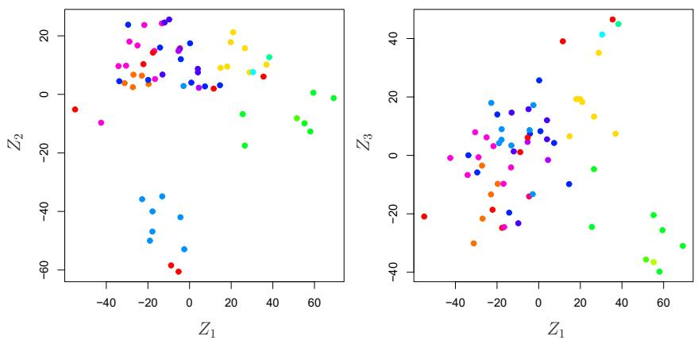  
FIGURE 12.17. Projections of the NCI60 cancer cell lines onto the first three principal components (in other words, the scores for the first three principal components). On the whole, observations belonging to a single cancer type tend to lie near each other in this low-dimensional space. It would not have been possible to visualize the data without using a dimension reduction method such as PCA, since based on the full data set there are $\binom{6,830}{2}$ possible scatterplots, none of which would have been particularly informative.

```matlab
ax.plot(ticks,
        nci_pca.explained_variance_ratio_,
        marker='o')
ax.set_xlabel('Principal Component');
ax.set_ylabel('PVE')
ax = axes[1]
ax.plot(ticks,
        nci_pca.explained_variance_ratio_.cumsum(),
        marker='o');
ax.set_xlabel('Principal Component')
ax.set_ylabel('Cumulative PVE');
```

The resulting plots are shown in Figure 12.18.

We see that together, the first seven principal components explain around 40% of the variance in the data. This is not a huge amount of the variance. However, looking at the scree plot, we see that while each of the first seven principal components explain a substantial amount of variance, there is a marked decrease in the variance explained by further principal components. That is, there is an elbow in the plot after approximately the seventh principal component. This suggests that there may be little benefit to examining more than seven or so principal components (though even examining seven principal components may be difficult).

# Clustering the Observations of the NCI60 Data

We now perform hierarchical clustering of the cell lines in the NCI60 data using complete, single, and average linkage. Once again, the goal is to find out whether or not the observations cluster into distinct types of cancer. Euclidean distance is used as the dissimilarity measure. We first write a short function to produce the three dendrograms.

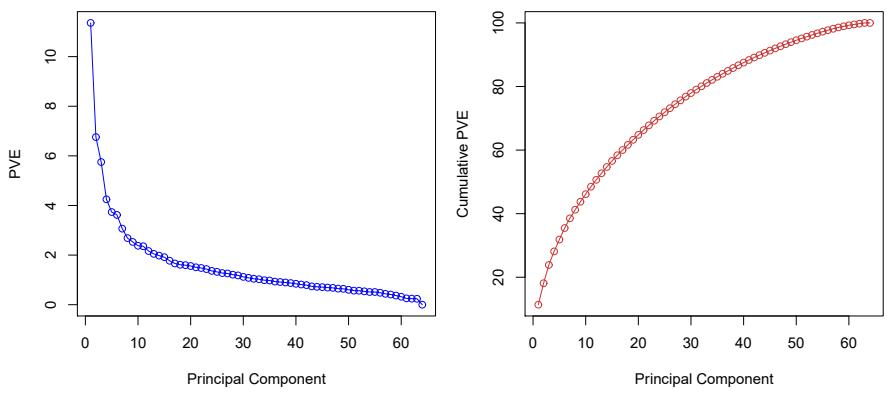  
FIGURE 12.18. The PVE of the principal components of the NCI60 cancer cell line microarray data set. Left: the PVE of each principal component is shown. Right: the cumulative PVE of the principal components is shown. Together, all principal components explain 100,% of the variance.

In [53]:  
```python
def plot_nci(linkage, ax, cut=-np.inf):
    cargs = {'above_threshold_color':'black',
        'color_threshold':cut}
    hc = HClust(n_clusters=None,
        distance_threshold=0,
        linkage=linkage.lower()).fit(nci_scaled)
    linkage_ = compute_linkage(hc)
    dendrogram(linkage_,
        ax=ax,
        labels=np.asarray(nci_labs),
        leaf_font_size=10,
        **cargs)
    ax.set_title('%s Linkage' % linkage)
    return hc
```

Let's plot our results.

In [54]:  
```matlab
fig, axes = plt.subplots(3, 1, figsize=(15,30))
ax = axes[0]; hc_comp = plot_nci('Complete', ax)
ax = axes[1]; hc_avg = plot_nci('Average', ax)
ax = axes[2]; hc_sing = plot_nci('Single', ax)
```

The results are shown in Figure 12.19. We see that the choice of linkage certainly does affect the results obtained. Typically, single linkage will tend to yield trailing clusters: very large clusters onto which individual observations attach one-by-one. On the other hand, complete and average linkage tend to yield more balanced, attractive clusters. For this reason, complete and average linkage are generally preferred to single linkage. Clearly cell lines within a single cancer type do tend to cluster together, although the clustering is not perfect. We will use complete linkage hierarchical clustering for the analysis that follows.

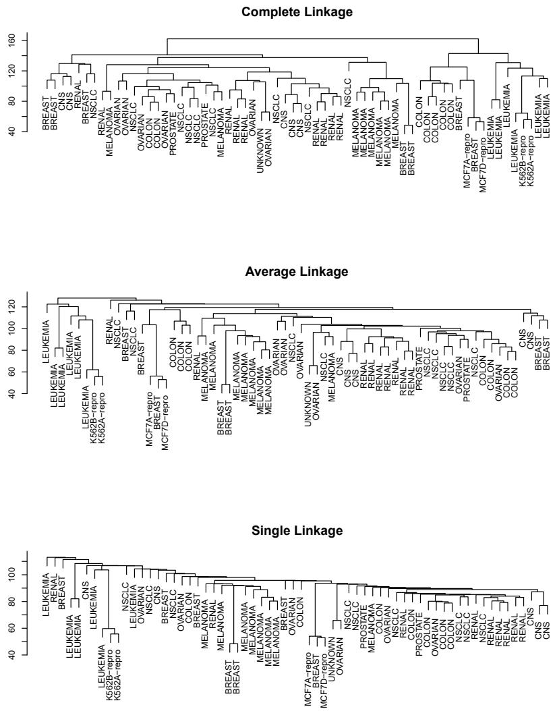  
FIGURE 12.19. The NCI60 cancer cell line microarray data, clustered with average, complete, and single linkage, and using Euclidean distance as the dissimilarity measure. Complete and average linkage tend to yield evenly sized clusters whereas single linkage tends to yield extended clusters to which single leaves are fused one by one.

We can cut the dendrogram at the height that will yield a particular number of clusters, say four:

```python
In [55]: linkage_comp = compute_linkage(hc_comp)
    comp_cut = cut_tree(linkage_comp, n_clusters=4).reshape(-1)
    pd.crosstab(nci_labs['label'],
        pd.Series(comp_cut.reshape(-1), name='Complete'))
```

There are some clear patterns. All the leukemia cell lines fall in one cluster, while the breast cancer cell lines are spread out over three different clusters.

We can plot a cut on the dendrogram that produces these four clusters:

```matlab
In [56]: fig, ax = plt.subplots(figsize=(10,10))
plot_nci('Complete', ax, cut=140)
ax.axhline(140, c='r', linewidth=4);
```

The axhline() function draws a horizontal line line on top of any existing set of axes. The argument 140 plots a horizontal line at height 140 on the dendrogram; this is a height that results in four distinct clusters. It is easy to verify that the resulting clusters are the same as the ones we obtained in comp\_cut.

We claimed earlier in Section 12.4.2 that K-means clustering and hierarchical clustering with the dendrogram cut to obtain the same number of clusters can yield very different results. How do these NCI60 hierarchical clustering results compare to what we get if we perform K-means clustering with K = 4?

```python
In [57]: nci_kmeans = KMeans(n_clusters=4,
                               random_state=0,
                               n_init=20).fit(nci_scaled)
pd.crosstab(pd.Series(comp_cut, name='HClust'),
            pd.Series(nci_kmeans.labels_, name='K-means'))
```

```txt
Out[57]: K-means        0  1  2  3
        HClust
        0   28  3  9  0
        1    7  0  0  0
        2    0  0  0  8
        3    0  9  0  0
```

We see that the four clusters obtained using hierarchical clustering and K-means clustering are somewhat different. First we note that the labels in the two clusterings are arbitrary. That is, swapping the identifier of the cluster does not change the clustering. We see here Cluster 3 in K-means clustering is identical to cluster 2 in hierarchical clustering. However, the other clusters differ: for instance, cluster 0 in K-means clustering contains a portion of the observations assigned to cluster 0 by hierarchical clustering, as well as all of the observations assigned to cluster 1 by hierarchical clustering.

Rather than performing hierarchical clustering on the entire data matrix, we can also perform hierarchical clustering on the first few principal component score vectors, regarding these first few components as a less noisy version of the data.

In [58]:

```python
hc_pca = HClust(n_clusters=None,
            distance_threshold=0,
            linkage='complete'
        ).fit(nci_scores[:,:5])
linkage_pca = compute_linkage(hc_pca)
fig, ax = plt.subplots(figsize=(8,8))
dendrogram(linkage_pca,
        labels=np.asarray(nci_labs),
        leaf_font_size=10,
        ax=ax,
        **cargs)
ax.set_title("Hier. Clust. on First Five Score Vectors")
pca_labels = pd.Series(cut_tree(linkage_pca,
                             n_clusters=4).reshape(-1),
                             name='Complete-PCA')
pd.crosstab(nci_labs['label'], pca_labels)
```

# 12.6 Exercises

# Conceptual

1. This problem involves the K-means clustering algorithm.

(a) Prove (12.18).  
(b) On the basis of this identity, argue that the $K$ -means clustering algorithm (Algorithm 12.2) decreases the objective (12.17) at each iteration.


2. Suppose that we have four observations, for which we compute a dissimilarity matrix, given by

$$
\left[ \begin{array}{c c c c} & 0. 3 & 0. 4 & 0. 7 \\ 0. 3 & & 0. 5 & 0. 8 \\ 0. 4 & 0. 5 & & 0. 4 5 \\ 0. 7 & 0. 8 & 0. 4 5 \end{array} \right].
$$

For instance, the dissimilarity between the first and second observations is 0.3, and the dissimilarity between the second and fourth observations is 0.8.

(a) On the basis of this dissimilarity matrix, sketch the dendrogram that results from hierarchically clustering these four observations using complete linkage. Be sure to indicate on the plot the height at which each fusion occurs, as well as the observations corresponding to each leaf in the dendrogram.  
(b) Repeat (a), this time using single linkage clustering.  
(c) Suppose that we cut the dendrogram obtained in (a) such that two clusters result. Which observations are in each cluster?  
(d) Suppose that we cut the dendrogram obtained in (b) such that two clusters result. Which observations are in each cluster?

(e) It is mentioned in this chapter that at each fusion in the dendrogram, the position of the two clusters being fused can be swapped without changing the meaning of the dendrogram. Draw a dendrogram that is equivalent to the dendrogram in (a), for which two or more of the leaves are repositioned, but for which the meaning of the dendrogram is the same.

3. In this problem, you will perform $K$ -means clustering manually, with $K = 2$ , on a small example with $n = 6$ observations and $p = 2$ features. The observations are as follows.

<table><tr><td>Obs.</td><td> $X_{1}$ </td><td> $X_{2}$ </td></tr><tr><td>1</td><td>1</td><td>4</td></tr><tr><td>2</td><td>1</td><td>3</td></tr><tr><td>3</td><td>0</td><td>4</td></tr><tr><td>4</td><td>5</td><td>1</td></tr><tr><td>5</td><td>6</td><td>2</td></tr><tr><td>6</td><td>4</td><td>0</td></tr></table>

(a) Plot the observations.

(b) Randomly assign a cluster label to each observation. You can use the np.random.choice() function to do this. Report the cluster labels for each observation.

(c) Compute the centroid for each cluster.

(d) Assign each observation to the centroid to which it is closest, in terms of Euclidean distance. Report the cluster labels for each observation.

(e) Repeat (c) and (d) until the answers obtained stop changing.

(f) In your plot from (a), color the observations according to the cluster labels obtained.

4. Suppose that for a particular data set, we perform hierarchical clustering using single linkage and using complete linkage. We obtain two dendrograms.

(a) At a certain point on the single linkage dendrogram, the clusters $\{1,2,3\}$ and $\{4,5\}$ fuse. On the complete linkage dendrogram, the clusters $\{1,2,3\}$ and $\{4,5\}$ also fuse at a certain point. Which fusion will occur higher on the tree, or will they fuse at the same height, or is there not enough information to tell?

(b) At a certain point on the single linkage dendrogram, the clusters $\{5\}$ and $\{6\}$ fuse. On the complete linkage dendrogram, the clusters $\{5\}$ and $\{6\}$ also fuse at a certain point. Which fusion will occur higher on the tree, or will they fuse at the same height, or is there not enough information to tell?

5. In words, describe the results that you would expect if you performed K-means clustering of the eight shoppers in Figure 12.16, on the basis of their sock and computer purchases, with K = 2. Give three answers, one for each of the variable scalings displayed. Explain.

6. We saw in Section 12.2.2 that the principal component loading and score vectors provide an approximation to a matrix, in the sense of (12.5). Specifically, the principal component score and loading vectors solve the optimization problem given in (12.6).

Now, suppose that the M principal component score vectors $z_{im}$ , $m = 1, \ldots, M$ , are known. Using (12.6), explain that each of the first M principal component loading vectors $\phi_{jm}$ , $m = 1, \ldots, M$ , can be obtained by performing p separate least squares linear regressions. In each regression, the principal component score vectors are the predictors, and one of the features of the data matrix is the response.

# Applied

7. In this chapter, we mentioned the use of correlation-based distance and Euclidean distance as dissimilarity measures for hierarchical clustering. It turns out that these two measures are almost equivalent: if each observation has been centered to have mean zero and standard deviation one, and if we let $r_{ij}$ denote the correlation between the ith and jth observations, then the quantity $1 - r_{ij}$ is proportional to the squared Euclidean distance between the ith and jth observations.

On the USArrests data, show that this proportionality holds.

Hint: The Euclidean distance can be calculated using the pairwise\_distances() function from the sklearn.metrics module, and correlations can be calculated using the np.corrcoef() function.

pairwise\_
distances()

8. In Section 12.2.3, a formula for calculating PVE was given in Equation 12.10. We also saw that the PVE can be obtained using the explained\_variance\_ratio\_attribute of a fitted PCA() estimator.

On the USArrests data, calculate PVE in two ways:

(a) Using the explained\_variance\_ratio\_output of the fitted PCA() estimator, as was done in Section 12.2.3.  
(b) By applying Equation 12.10 directly. The loadings are stored as the components\_ attribute of the fitted PCA() estimator. Use those loadings in Equation 12.10 to obtain the PVE.

These two approaches should give the same results.

Hint: You will only obtain the same results in (a) and (b) if the same data is used in both cases. For instance, if in (a) you performed PCA() using centered and scaled variables, then you must center and scale the variables before applying Equation 12.10 in (b).

9. Consider the USArrests data. We will now perform hierarchical clustering on the states.

(a) Using hierarchical clustering with complete linkage and Euclidean distance, cluster the states.  
(b) Cut the dendrogram at a height that results in three distinct clusters. Which states belong to which clusters?

(c) Hierarchically cluster the states using complete linkage and Euclidean distance, after scaling the variables to have standard deviation one.  
(d) What effect does scaling the variables have on the hierarchical clustering obtained? In your opinion, should the variables be scaled before the inter-observation dissimilarities are computed? Provide a justification for your answer.

10. In this problem, you will generate simulated data, and then perform PCA and $K$ -means clustering on the data.

(a) Generate a simulated data set with 20 observations in each of three classes (i.e. 60 observations total), and 50 variables.

Hint: There are a number of functions in Python that you can use to generate data. One example is the normal() method of the random() function in numpy; the uniform() method is another option. Be sure to add a mean shift to the observations in each class so that there are three distinct classes.

(b) Perform PCA on the 60 observations and plot the first two principal component score vectors. Use a different color to indicate the observations in each of the three classes. If the three classes appear separated in this plot, then continue on to part (c). If not, then return to part (a) and modify the simulation so that there is greater separation between the three classes. Do not continue to part (c) until the three classes show at least some separation in the first two principal component score vectors.

(c) Perform $K$ -means clustering of the observations with $K = 3$ . How well do the clusters that you obtained in $K$ -means clustering compare to the true class labels?

Hint: You can use the pd.crosstab() function in Python to compare the true class labels to the class labels obtained by clustering. Be careful how you interpret the results: K-means clustering will arbitrarily number the clusters, so you cannot simply check whether the true class labels and clustering labels are the same.

(d) Perform $K$ -means clustering with $K = 2$ . Describe your results.

(e) Now perform $K$ -means clustering with $K = 4$ , and describe your results.

(f) Now perform $K$ -means clustering with $K = 3$ on the first two principal component score vectors, rather than on the raw data. That is, perform $K$ -means clustering on the $60 \times 2$ matrix of which the first column is the first principal component score vector, and the second column is the second principal component score vector. Comment on the results.

(g) Using the StandardScaler() estimator, perform $K$ -means clustering with $K = 3$ on the data after scaling each variable to have standard deviation one. How do these results compare to those obtained in (b)? Explain.

11. Write a Python function to perform matrix completion as in Algorithm 12.1, and as outlined in Section 12.5.2. In each iteration, the function should keep track of the relative error, as well as the iteration count. Iterations should continue until the relative error is small enough or until some maximum number of iterations is reached (set a default value for this maximum number). Furthermore, there should be an option to print out the progress in each iteration.

Test your function on the Boston data. First, standardize the features to have mean zero and standard deviation one using the StandardScaler() function. Run an experiment where you randomly leave out an increasing (and nested) number of observations from 5% to 30%, in steps of 5%. Apply Algorithm 12.1 with $M = 1, 2, \ldots, 8$ . Display the approximation error as a function of the fraction of observations that are missing, and the value of M, averaged over 10 repetitions of the experiment.

12. In Section 12.5.2, Algorithm 12.1 was implemented using the svd() function from the np.linalg module. However, given the connection between the svd() function and the PCA() estimator highlighted in the lab, we could have instead implemented the algorithm using PCA().

Write a function to implement Algorithm 12.1 that makes use of PCA() rather than svd().

13. On the book website, www.statlearning.com, there is a gene expression data set (Ch12Ex13.csv) that consists of 40 tissue samples with measurements on 1,000 genes. The first 20 samples are from healthy patients, while the second 20 are from a diseased group.

(a) Load in the data using pd.read\_csv(). You will need to select header = None.  
(b) Apply hierarchical clustering to the samples using correlation-based distance, and plot the dendrogram. Do the genes separate the samples into the two groups? Do your results depend on the type of linkage used?  
(c) Your collaborator wants to know which genes differ the most across the two groups. Suggest a way to answer this question, and apply it here.

