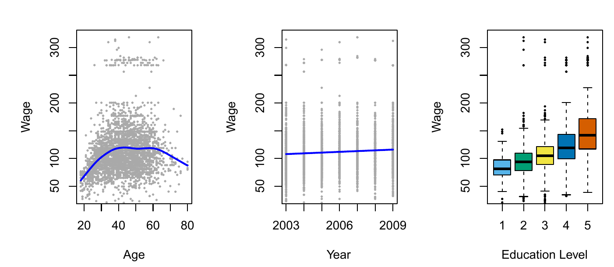
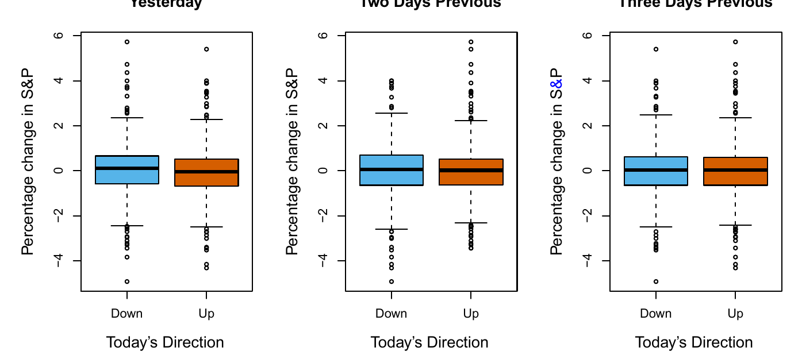
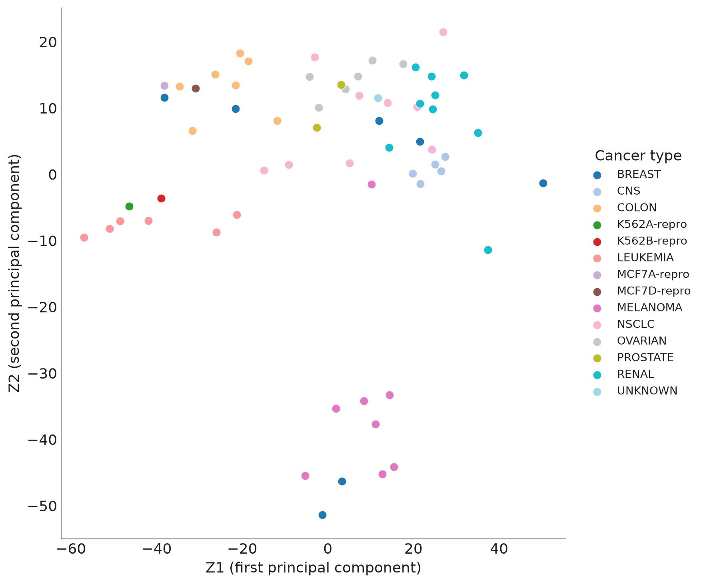
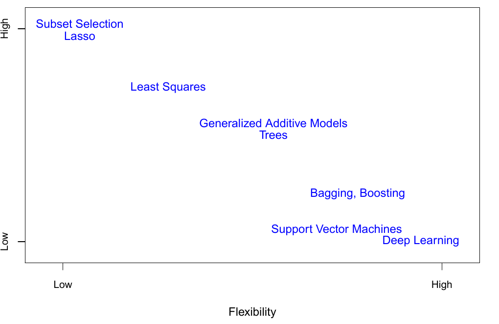
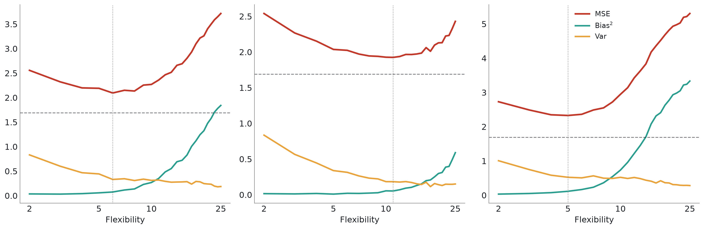
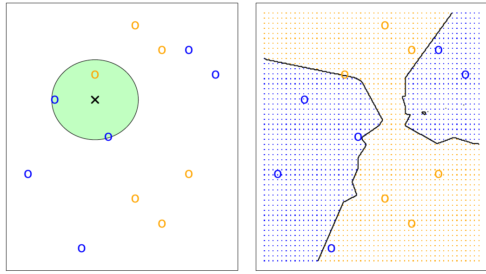
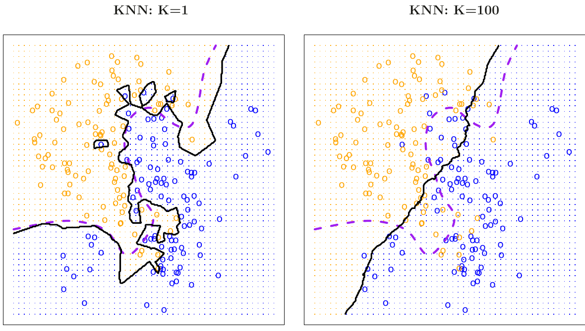

# Welcome {.divider background-color="#1b3a5c"}

::: notes
Quick intros, logistics (Fridays 2-4pm Central, 7 weeks), and set expectations:
read before class, we spend class time on discussion + labs.
:::

## About this course

:::: {.columns}
::: {.column width="50%"}
- **Instructors:** Ho-min Park & Hyun-Hwan Jeong
- **This session:** led by Hyun-Hwan Jeong
- **Format:** 7 Fridays, 2:00–4:00 PM Central, Jul 10 – Aug 21
- **Textbook:** *An Introduction to Statistical Learning*, Python edition (ISLP)
:::
::: {.column width="50%"}
- Read the chapter **before** class
- Class time = discussion + labs, not lecture
- Every week pairs theory with a runnable notebook
:::
::::

::: notes
Emphasize the flipped-classroom structure — the condensed 7-week pace only
works if people show up having read the chapter.
:::

## Course syllabus

| # | Date | Topics | Chapters |
|---|------|--------|----------|
| 1 | Jul 10 | Intro + Statistical Learning basics | Ch 1–2 |
| 2 | Jul 17 | Linear Regression; Classification | Ch 3–4 |
| 3 | Jul 24 | Resampling; Regularization | Ch 5–6 |
| 4 | Jul 31 | Moving Beyond Linearity; Tree-Based Methods | Ch 7–8 |
| 5 | Aug 7 | Support Vector Machines; Deep Learning I | Ch 9, Ch 10 (pt 1) |
| 6 | Aug 14 | Deep Learning II; Unsupervised Learning | Ch 10 (pt 2), Ch 12 |
| 7 | Aug 21 | Survival Analysis; Multiple Testing; wrap-up | Ch 11, Ch 13 |

More detail is in the repo README.

# Why Are We Doing This? {.divider background-color="#1b3a5c"}

## Data is everywhere

Every field collects more data than anyone could look at by hand. The hard
part isn't collecting data anymore — it's turning it into decisions.

::: {.fragment}
> "Statistical learning refers to a vast set of tools for understanding data."
> — James, Witten, Hastie, Tibshirani, Taylor (ISLP, Ch. 1)
:::

## Wage data — a regression problem

```{=html}
<div class="fig-wrap"></div>
```

Predict a worker's **wage** — a number — from age, education, and year.

## Stock market data — a classification problem

```{=html}
<div class="fig-wrap"></div>
```

Predict whether the market goes **up or down** tomorrow — a category, not
a number.

## Gene expression data — no target at all

```{=html}
<div class="fig-wrap"></div>
```

No output to predict — just structure hidden in thousands of
measurements. The colors show the true cancer type, which the method
never saw.

## One shape, three questions

Regression, classification, clustering — three different questions. This
course teaches one toolkit that covers all three.

## A short history

```{=html}
<div class="timeline">
  <div class="timeline-line"></div>

  <div class="timeline-label timeline-label-top" style="grid-column: 1;">
    <strong>Early 1800s</strong><span>Least squares</span>
  </div>
  <div class="timeline-dot" style="grid-column: 1;"></div>

  <div class="timeline-dot" style="grid-column: 2;"></div>
  <div class="timeline-label timeline-label-bottom" style="grid-column: 2;">
    <strong>1936</strong><span>Linear discriminant analysis</span>
  </div>

  <div class="timeline-label timeline-label-top" style="grid-column: 3;">
    <strong>1940s–70s</strong><span>Logistic regression, GLMs</span>
  </div>
  <div class="timeline-dot" style="grid-column: 3;"></div>

  <div class="timeline-dot" style="grid-column: 4;"></div>
  <div class="timeline-label timeline-label-bottom" style="grid-column: 4;">
    <strong>1980s</strong><span>Classification &amp; regression trees</span>
  </div>

  <div class="timeline-label timeline-label-top" style="grid-column: 5;">
    <strong>1990s</strong><span>Support vector machines</span>
  </div>
  <div class="timeline-dot" style="grid-column: 5;"></div>

  <div class="timeline-dot" style="grid-column: 6;"></div>
  <div class="timeline-label timeline-label-bottom" style="grid-column: 6;">
    <strong>2010s–now</strong><span>Deep learning at scale</span>
  </div>
</div>
```

::: {.fragment}
Most of these ideas are decades old — we just finally have the data and
compute to use them well.
:::

## Why *you*, specifically

- These methods power tools you already use: recommendation systems,
  medical risk scores, fraud detection, genomics.
- Knowing a model's assumptions — and when they break — is what separates
  using a tool from trusting it.
- The skills carry over directly to `scikit-learn` and `statsmodels`.

# Why It Is Important {.divider background-color="#1b3a5c"}

## It shows up everywhere

:::: {.columns}
::: {.column width="55%"}
- **Science** — genomics, astrophysics, climate models
- **Medicine** — diagnosis support, survival/risk prediction
- **Business** — demand forecasting, pricing, churn
- **Technology** — search ranking, spam filtering, the models behind LLMs
:::
::: {.column width="45%"}
```{=html}
<div class="stat-card">
  <i class="fa-solid fa-diagram-project"></i>
  <div>
    <strong>One toolkit, many domains.</strong>
    <p>The bias-variance trade-off that governs a linear regression also
    governs a neural network.</p>
  </div>
</div>
```
:::
::::

## Getting it wrong is expensive

- An **overfit** model looks great on training data, then quietly fails
  the moment it sees new data.
- An **overly rigid** model misses real signal, and gives you false
  confidence in a too-simple story.
- Statistical learning gives you ways to tell which mistake you're
  making — train/test splits, cross-validation, bias-variance.

::: notes
This is the seed for Chapter 2's bias-variance discussion and Chapter 5's
cross-validation — plant the idea now, they'll see the math for it soon.
:::

# How It Works {.divider background-color="#1b3a5c"}

## The basic setup

We assume there's some relationship between an input $X$ and an output $Y$:

$$Y = f(X) + \epsilon$$

::: {.fragment}
- $f$ — the **true, unknown** relationship we want to learn
- $\epsilon$ — random noise, independent of $X$, mean zero
- Statistical learning = a set of ways to estimate $f$
:::

## Two reasons to estimate $f$

:::: {.columns}
::: {.column width="50%"}
### Prediction
We only care about the output. $f$ can be a black box as long as
$\hat{Y} = \hat{f}(X)$ is accurate.

*e.g. will this loan default?*
:::
::: {.column width="50%"}
### Inference
We want to know **how** $Y$ changes with $X$. $f$ has to stay
interpretable.

*e.g. which drug dosage actually helps?*
:::
::::

::: {.fragment}
Most real projects need a bit of both.
:::

## How do we estimate $f$?

:::: {.columns}
::: {.column width="50%"}
### Parametric methods
Assume a functional **form** (e.g. $f(X) = \beta_0 + \beta_1 X$), then
estimate its parameters from data.

Simpler, needs less data — wrong if the assumed form is wrong.
:::
::: {.column width="50%"}
### Non-parametric methods
No assumed form — let the data shape $f$ directly (splines, trees, KNN).

More flexible, needs more data, harder to interpret.
:::
::::

## The flexibility spectrum, mapped

```{=html}
<div class="fig-wrap"></div>
```

Every method we'll cover fits somewhere on this plot: more flexibility,
less interpretability.

## Two kinds of learning problems

:::: {.columns}
::: {.column width="50%"}
### Supervised
Every observation has a **labeled outcome** $Y$.

Regression (numeric $Y$) · Classification (categorical $Y$)
:::
::: {.column width="50%"}
### Unsupervised
No labeled outcome — only inputs $X$. We look for structure instead.

Clustering · Dimension reduction
:::
::::

## Regression vs. classification

- $Y$ **quantitative** (a number) → **regression**
- $Y$ **qualitative** (a category) → **classification**

::: {.fragment}
We measure error differently for each: a wrong number is off by some
amount; a wrong category is just wrong.
:::

## Measuring the quality of fit

For regression, the standard yardstick is **mean squared error**:

$$\text{MSE} = \frac{1}{n}\sum_{i=1}^{n}\left(y_i - \hat{f}(x_i)\right)^2$$

::: {.fragment}
Small MSE on training data is easy, and not the point. What matters is
**test MSE** — how well $\hat{f}$ predicts data it hasn't seen.
:::

## The bias-variance trade-off, precisely

Expected test error at a point $x_0$ decomposes into three pieces:

$$E\left[\left(y_0 - \hat{f}(x_0)\right)^2\right] = \text{Var}(\hat{f}(x_0)) + \left[\text{Bias}(\hat{f}(x_0))\right]^2 + \text{Var}(\epsilon)$$

- **Variance** — how much $\hat{f}$ changes on a different training set
- **Bias** — error from fitting a complex reality with too simple a model
- $\text{Var}(\epsilon)$ — irreducible noise, no model beats it

## What it looks like in practice

```{=html}
<div class="fig-wrap"></div>
```

Bias (cyan) falls and variance (orange) rises as flexibility increases.
Test MSE (red) is their sum, so it bottoms out in the middle.

::: notes
Worth pausing here — this U-shape recurs (in disguise) in cross-validation
curves, regularization paths, and learning curves for the rest of the course.
:::

## The classification setting

Instead of MSE, classification uses the **error rate**:

$$\frac{1}{n}\sum_{i=1}^{n} I(y_i \neq \hat{y}_i)$$

::: {.fragment}
The best possible classifier — the **Bayes classifier** — assigns each
$x_0$ to the class $j$ that maximizes $\Pr(Y = j \mid X = x_0)$. We can't
compute it directly, but we can approximate it.
:::

## K-Nearest Neighbors

**KNN** approximates the Bayes classifier: look at the $K$ closest
training points to $x_0$ and vote.

$$\Pr(Y = j \mid X = x_0) \approx \frac{1}{K}\sum_{i \in \mathcal{N}_0} I(y_i = j)$$

::: {.fragment}
Small $K$ → flexible, low bias, high variance. Large $K$ → the opposite.
:::

## KNN in action ($K=3$)

```{=html}
<div class="fig-wrap"></div>
```

Left: the 3 nearest neighbors of the test point (✕) vote — 2 blue beats 1
orange. Right: doing this everywhere traces out the decision boundary.

## Choosing $K$ *is* choosing flexibility

```{=html}
<div class="fig-wrap"></div>
```

$K=1$ (left) chases every point — low bias, high variance. $K=100$
(right) barely bends — high bias, low variance. The purple dashed line is
the true boundary.

## Where the next 7 weeks go

| Week | Focus |
|---|---|
| 1 | **Foundations** — what we just covered |
| 2 | Regression & classification: fitting $f$ to data |
| 3 | Resampling & regularization: trusting your estimate of $f$ |
| 4 | Beyond straight lines: splines, trees |
| 5–6 | Support vector machines, deep learning |
| 7 | Survival analysis, unsupervised learning, multiple testing |

Each week pairs the ideas here with a hands-on Python lab.

# Getting Started {.divider background-color="#1b3a5c"}

## Before next Friday

1. Read **ISLP Ch. 3–4** (`week2/ch03-04-regression-classification.pdf`) —
   for Jul 17
2. If you haven't already, set up Python with `jupyter`, `numpy`,
   `pandas`, `scikit-learn`, `statsmodels`, and `ISLP`
3. If you didn't finish today's Ch. 2 lab (*Introduction to Python*),
   catch up before next week's lab builds on it
4. Bring questions — class time is for discussion and the lab, not
   re-reading slides

## Questions?

::: {style="text-align: center; margin-top: 2em;"}
[See you next Friday.]{.hl}
:::

::: notes
Leave time here for open Q&A before wrapping.
:::
