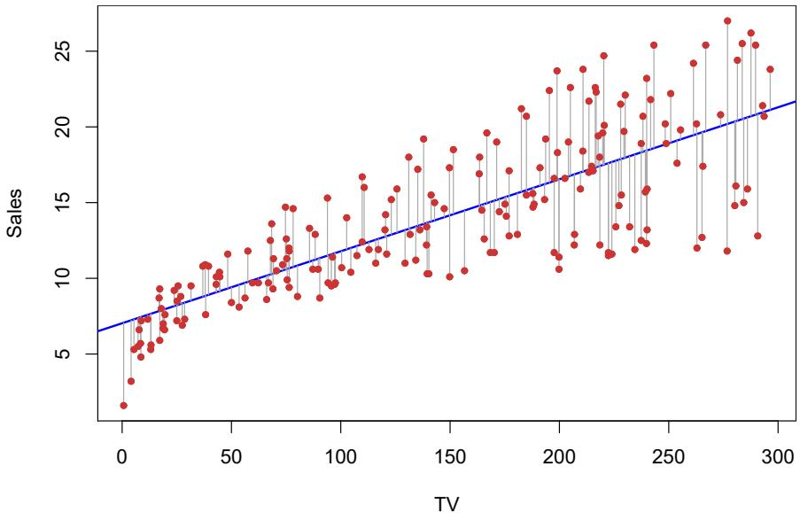
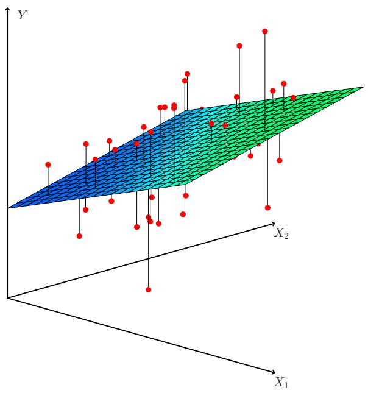
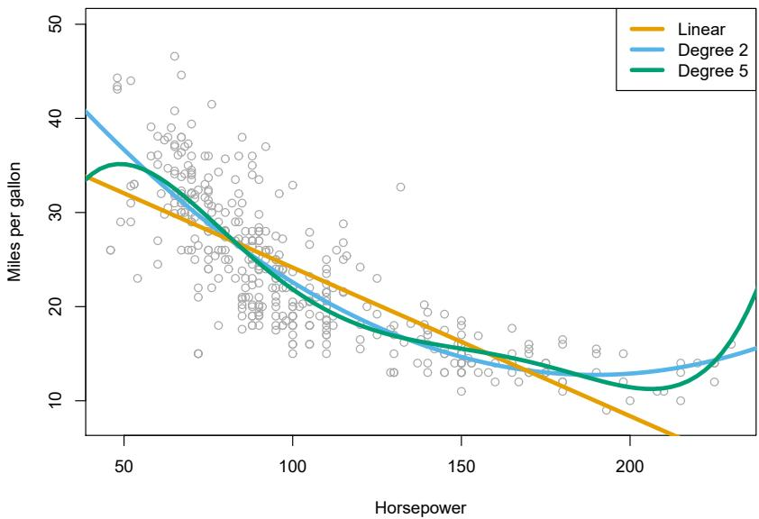
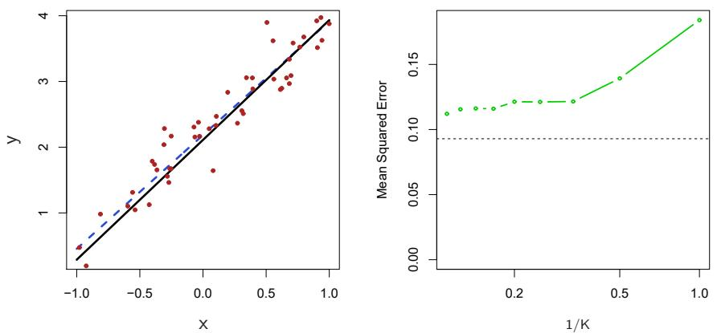
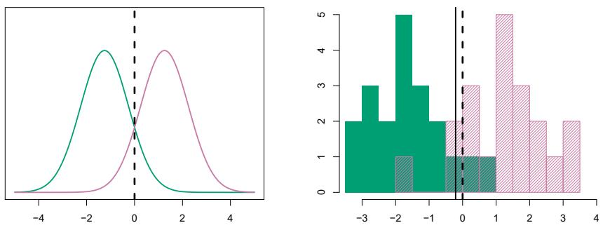
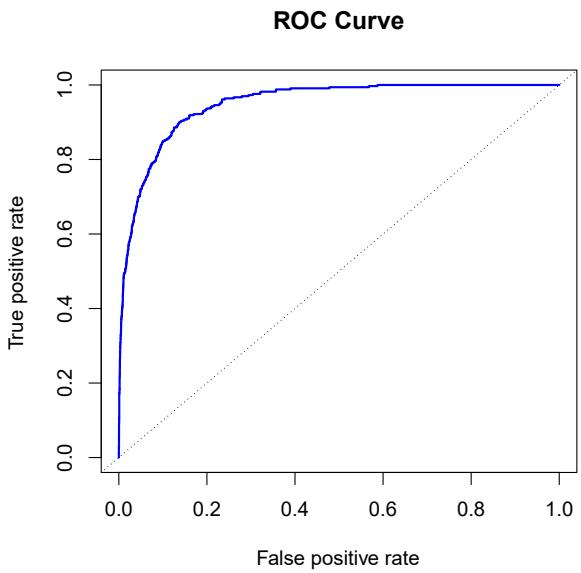
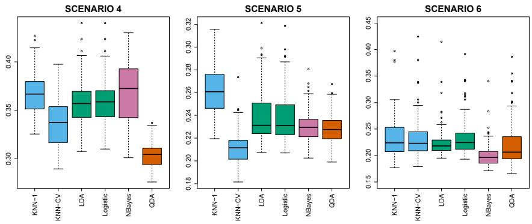

# Welcome Back {.divider background-color="#1b3a5c"}

::: notes
This session is led by Ho-min Park. Quick check-in on the Ch. 2 lab before
diving in — most of today builds directly on the bias-variance picture.
:::

## Last week in 60 seconds

- Everything we do is estimating the $f$ in $Y = f(X) + \epsilon$
- Two goals: **prediction** (accuracy of $\hat{Y}$) and **inference** (how $Y$ relates to $X$)
- **Parametric** methods assume a form for $f$; **non-parametric** methods let the data decide
- What matters is **test** error, not training error — and it decomposes into
  [bias² + variance + irreducible noise]{.hl}

::: {.fragment}
This week: the two workhorses of applied statistics.
**Chapter 3** — predict a *number*. **Chapter 4** — predict a *category*.
:::

::: notes
The bias-variance U-curve from last week returns at least three times today:
choosing polynomial degree, KNN's K, and LDA vs QDA.
:::

# Linear Regression {.divider background-color="#1b3a5c"}

## The simplest useful model

Assume the relationship between $X$ and $Y$ is (approximately) a straight line:

$$Y \approx \beta_0 + \beta_1 X$$

For the `Advertising` data: $\texttt{sales} \approx \beta_0 + \beta_1 \times \texttt{TV}$.

::: {.fragment}
- A **parametric** method in its purest form: estimating $f$ reduces to
  estimating just two numbers
- Dull? Maybe. But it's the [reference point for every fancier method]{.hl}
  in this course — and often surprisingly hard to beat
:::

## Least squares: how the line is chosen

```{=html}
<div class="fig-wrap"></div>
```

Each grey segment is a **residual** $e_i = y_i - \hat{y}_i$. Least squares picks
the intercept and slope that minimize the **residual sum of squares**
$\text{RSS} = e_1^2 + e_2^2 + \cdots + e_n^2$.

## Our line is an estimate — from one sample

```{=html}
<div class="fig-wrap"></div>
```

Red: the true *population* line. Dark blue: the least squares line from one
sample. Light blue: least squares lines from ten other samples. Each line
differs, but on average they land on the truth — [unbiased, with
variance]{.hl}.

## How wrong could our estimates be?

The **standard error** quantifies how much $\hat{\beta}_1$ would vary across
samples, giving confidence intervals like $\hat{\beta}_1 \pm 2 \cdot \text{SE}(\hat{\beta}_1)$.

::: {.fragment}
It also gives a hypothesis test of $H_0: \beta_1 = 0$ ("no relationship") via

$$t = \frac{\hat{\beta}_1 - 0}{\text{SE}(\hat{\beta}_1)}$$

For sales vs TV: $\hat{\beta}_1 = 0.0475$, $t = 17.67$, $p < 0.0001$ —
the association is not chance.
:::

::: notes
Connect to what they know: this is the same logic as any t-test. The p-value
answers "could a slope this large arise by luck if there were no relationship?"
:::

## How well does the line fit?

- **Residual standard error (RSE)** — roughly, the average distance the
  response falls from the line, in units of $Y$. For sales vs TV:
  RSE ≈ 3.26, i.e. predictions are off by ~3,260 units of sales on average.
- **$R^2$** — the *proportion of variance explained*, between 0 and 1:

$$R^2 = 1 - \frac{\text{RSS}}{\text{TSS}}$$

::: {.fragment}
$R^2 = 0.61$ for sales vs TV: the model explains about 61% of the
variability in sales. Whether that's "good" depends entirely on the domain —
physics expects 0.99, social science celebrates 0.3.
:::

## More than one predictor

$$Y = \beta_0 + \beta_1 X_1 + \beta_2 X_2 + \cdots + \beta_p X_p + \epsilon$$

:::: {.columns}
::: {.column style="width:45%;"}
- Each $\beta_j$: the average effect on $Y$ of a one-unit increase in $X_j$,
  [holding all other predictors fixed]{.hl}
- With two predictors, the fitted "line" becomes a plane; beyond that,
  a hyperplane
:::
::: {.column style="width:55%;"}
```{=html}
<div class="fig-wrap"></div>
```
:::
::::

## Simple and multiple coefficients can disagree

On the `Advertising` data, regressing sales on **newspaper alone** gives a
significant positive coefficient (0.055). In the **multiple** regression with
TV and radio included, newspaper's coefficient drops to ≈ 0 ($p = 0.86$).

::: {.fragment}
Newspaper spending is *correlated* with radio spending — it gets credit for
radio's work in the simple regression. [Correlation with the response is not
the same as a direct contribution.]{.hl}
:::

::: {.fragment}
The **F-statistic** tests all predictors at once ($H_0$: *all* $\beta_j = 0$)
— here $F = 570$, so the model as a whole clearly has signal.
:::

::: notes
This is the classic "shark attacks vs ice cream sales" moment. Worth dwelling
on — it's the single most common misreading of regression output in practice.
:::

## Predictors that aren't numbers

Qualitative predictors enter via **dummy variables**:

$$x_i = \begin{cases} 1 & \text{if the } i\text{th person is a student} \\ 0 & \text{if not} \end{cases}$$

- The coefficient on $x_i$ is the *difference* in average response between
  students and non-students
- A factor with $k$ levels needs $k - 1$ dummies; the left-out level is the
  **baseline**

## Interactions: when effects multiply

```{=html}
<div class="fig-wrap"></div>
```

Adding a product term $X_1 X_2$ lets one predictor's slope depend on another
(right panel: income's effect on balance differs for students). In
`Advertising`, TV and radio show real **synergy** — spending on both beats
splitting the same budget into either alone.

## Straight lines aren't sacred

```{=html}
<div class="fig-wrap"></div>
```

Adding $\texttt{horsepower}^2$ as a predictor is *still linear regression* —
linear in the **coefficients**. Degree 2 clearly improves on linear here;
degree 5 starts to wiggle. [Same bias-variance trade-off, first
reappearance.]{.hl}

## Trust, but verify: residual plots

```{=html}
<div class="fig-wrap"></div>
```

A pattern in the residuals (left) means the model missed structure; adding the
quadratic term removes it (right). Other things to check: correlated errors,
non-constant variance, outliers, high-leverage points, collinearity.

::: notes
Don't go deep on all six problems — point to Section 3.3.3 as a checklist to
keep next to any regression they run at work.
:::

## Linear regression vs KNN

```{=html}
<div class="fig-wrap"></div>
```

When the truth *is* linear, least squares (dashed line, right panel) beats KNN
at every $K$. Non-parametric flexibility has a price — and it gets much worse
as the number of predictors grows (the [curse of dimensionality]{.hl}).

::: {.fragment}
Rule of thumb: a parametric method wins when its assumed form is close to the
truth, or when data are scarce relative to $p$.
:::

## This week's lab, part 1: `statsmodels`

```python
import statsmodels.formula.api as smf
from ISLP import load_data

Boston = load_data('Boston')
model = smf.ols('medv ~ lstat + age', data=Boston).fit()
model.summary()
```

- Every number from today's slides — coefficients, SE, $t$, $p$, $R^2$,
  F-statistic — appears in this one summary table
- The lab also covers interaction terms (`lstat:age`) and polynomial
  transforms (`I(lstat**2)`)

# Classification {.divider background-color="#1b3a5c"}

## New problem: predicting a category

```{=html}
<div class="fig-wrap"></div>
```

The `Default` data: will a customer **default** on their credit card debt?
Balance clearly separates the orange (default) from blue (no default);
income barely matters. The response is now [Yes/No — not a number]{.hl}.

## Why not just run linear regression?

```{=html}
<div class="fig-wrap"></div>
```

Code No = 0, Yes = 1 and regress? The line (left) produces probabilities
**below zero** and, for other data, above one. Logistic regression (right)
squeezes the output into $(0, 1)$ — a proper probability.

## The logistic model

$$p(X) = \frac{e^{\beta_0 + \beta_1 X}}{1 + e^{\beta_0 + \beta_1 X}}$$

::: {.fragment}
Rearranged, the **log odds** are linear in $X$:

$$\log\left(\frac{p(X)}{1 - p(X)}\right) = \beta_0 + \beta_1 X$$

- One unit more $X$ adds $\beta_1$ to the log odds — the probability itself
  changes by a varying amount (that's the S-curve)
:::

## Fitting and using it

Coefficients are chosen by **maximum likelihood**: make the predicted
probabilities match the observed 0/1 outcomes as closely as possible.

::: {.fragment}
For `Default`: $\hat{\beta}_0 = -10.65$, $\hat{\beta}_1 = 0.0055$ (per dollar
of balance), $z = 24.9$, $p < 0.0001$. Then:

- balance = \$1,000 → $\hat{p}(X) = 0.6\%$
- balance = \$2,000 → $\hat{p}(X) = 58.6\%$
:::

::: {.fragment}
Same machinery as linear regression output — $z$-statistics instead of
$t$-statistics, deviance instead of RSS.
:::

## A confounding story worth remembering

```{=html}
<div class="fig-wrap"></div>
```

Alone, `student` has a **positive** coefficient (+0.40): students default
more. With `balance` in the model it flips **negative** (−0.65): [at any
given balance, a student is *less* risky]{.hl} — students simply carry higher
balances. Simple vs multiple regression, all over again.

::: notes
Same phenomenon as the newspaper example this morning — one continuous, one
categorical. If they internalize just one thing today, make it this.
:::

## More than two classes

- **Multinomial logistic regression** extends the model to $K$ classes
  (pick a baseline class, fit $K-1$ sets of coefficients)
- The **softmax** formulation treats all classes symmetrically — the same
  function that sits at the output layer of every classification neural
  network you'll meet in Week 5

::: {.fragment}
But for many-class problems there's a different strategy entirely…
:::

## The generative approach: model each class

Instead of modeling $\Pr(Y \mid X)$ directly, model each class's predictor
distribution $f_k(x)$ and its prior $\pi_k$, then flip with **Bayes' theorem**:

$$\Pr(Y = k \mid X = x) = \frac{\pi_k f_k(x)}{\sum_{l=1}^{K} \pi_l f_l(x)}$$

Why bother?

- More stable than logistic regression when classes are **well separated**
  or $n$ is small
- Handles $K > 2$ classes naturally

## LDA with one predictor

```{=html}
<div class="fig-wrap"></div>
```

Assume each class is **normal with the same variance**. The resulting decision
boundary is where the densities cross — LDA estimates it from class means and
the pooled variance (solid line, right) and approximates the Bayes boundary
(dashed).

## LDA with many predictors

```{=html}
<div class="fig-wrap"></div>
```

With multivariate normals sharing one covariance matrix, the boundaries
between every pair of classes are **straight lines** — that's the "linear" in
LDA. Three classes, $p = 2$: LDA (solid) nearly recovers Bayes (dashed).

## Accuracy is not enough: the confusion matrix

On `Default`, LDA achieves 2.75% overall error — sounds great, until you
notice only 3.33% of customers default at all.

| Threshold | Overall error | Defaulters missed |
|---|---|---|
| 0.5 (default) | **2.75%** | 75.7% |
| 0.2 | 3.73% | 41.4% |

::: {.fragment}
A **confusion matrix** breaks errors into false positives and false negatives
— and moving the **threshold** trades one for the other. Which threshold is
right is a *business* decision, not a statistical one.
:::

## The ROC curve: all thresholds at once

```{=html}
<div class="fig-wrap"></div>
```

True positive rate vs false positive rate as the threshold sweeps from 0 to 1.
The closer the curve hugs the top-left corner — summarized by the **AUC** —
the better the classifier, independent of any particular threshold choice.

## QDA: give each class its own covariance

```{=html}
<div class="fig-wrap"></div>
```

Per-class covariance matrices make the boundary **quadratic** (green). When
the true boundary is linear (left), LDA wins; when it isn't (right), QDA wins.
[Bias-variance trade-off, third appearance]{.hl}: QDA fits $K \cdot p(p+1)/2$
covariance parameters, LDA just $p(p+1)/2$.

## Naive Bayes: assume everything is independent

Within each class, treat the $p$ predictors as **independent**:
$f_k(x) = f_{k1}(x_1) \times f_{k2}(x_2) \times \cdots \times f_{kp}(x_p)$

- Obviously wrong as a model of reality — but it slashes the number of
  parameters to estimate
- Wins when $p$ is large or $n$ is small, where estimating a full joint
  distribution is hopeless
- The spam-filter classic

## No single method dominates

```{=html}
<div class="fig-wrap"></div>
```

- Boundary truly linear → **LDA & logistic regression** win
- Moderately non-linear → **QDA / naive Bayes**
- Highly non-linear, lots of data → **KNN** (but it needs the data!)
- Logistic regression and LDA differ mainly in *how* they fit the same
  linear form

::: notes
GLMs (Poisson regression for counts, Section 4.6) are skipped for time —
flag them as reading for anyone working with count data, e.g. the Bikeshare
example.
:::

## This week's lab, part 2: four classifiers, one dataset

```python
from ISLP import load_data
import statsmodels.api as sm
from sklearn.discriminant_analysis import \
    LinearDiscriminantAnalysis as LDA

Smarket = load_data('Smarket')
# Logistic regression on market direction
glm = sm.GLM(y, X, family=sm.families.Binomial()).fit()
# LDA, QDA, Naive Bayes, KNN follow the same
# fit() / predict() pattern in scikit-learn
```

Predicting the stock market direction from Week 1's motivating example —
spoiler: barely better than coin-flipping, and that's the honest result.

# Getting Started {.divider background-color="#1b3a5c"}

## Before next Friday

1. Read **ISLP Ch. 5–6** (`week3/ch05-06-resampling-regularization.pdf`) —
   Resampling and Regularization, for Jul 24
2. Run this week's labs: **3.6** (Linear Regression) and **4.7**
   (Logistic Regression, LDA, QDA, KNN)
3. Try the threshold exercise: on `Default`, find the threshold you would
   actually recommend to a credit card company — and be ready to defend it
4. Next week explains how to *validate* every model you fit today —
   cross-validation is the tool you'll use for the rest of your career

## Questions?

::: {style="text-align: center; margin-top: 2em;"}
[See you next Friday.]{.hl}
:::

::: notes
Leave time for Q&A. If discussion runs dry, ask: "when would you prefer LDA
over logistic regression?" — good check of the generative-vs-discriminative
distinction.
:::
