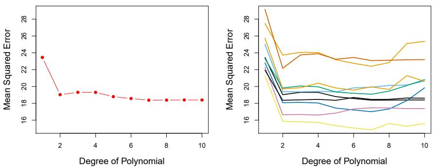
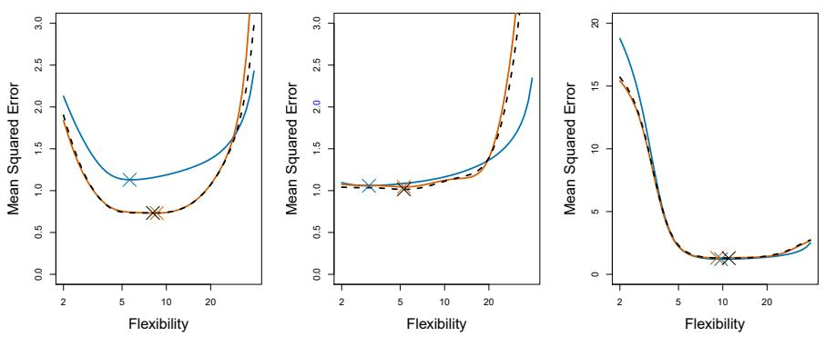
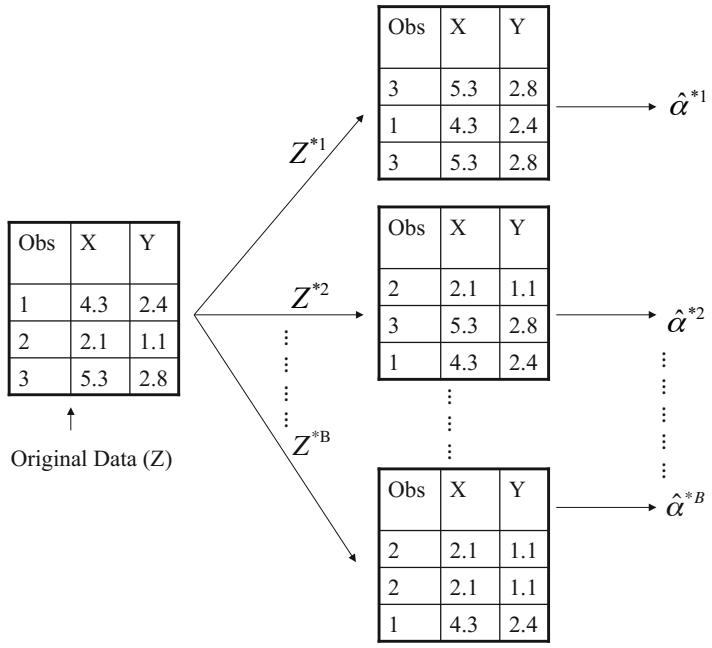
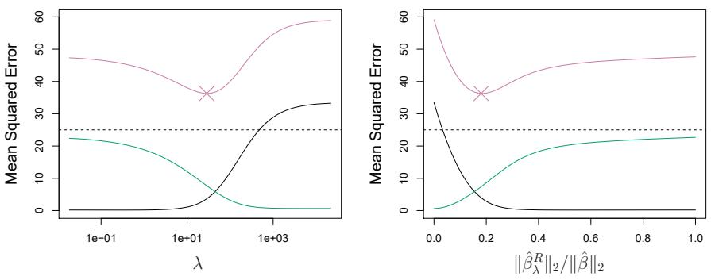
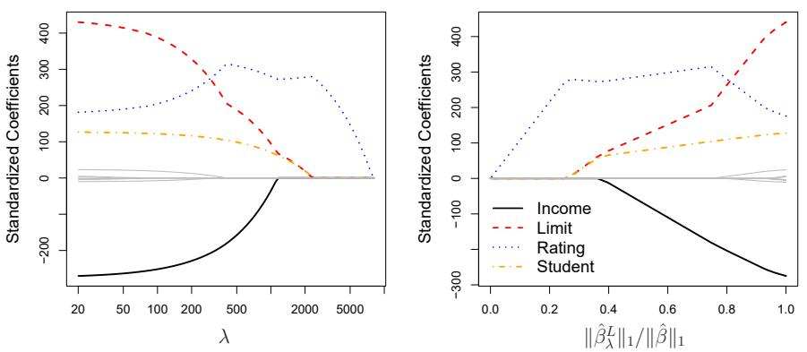
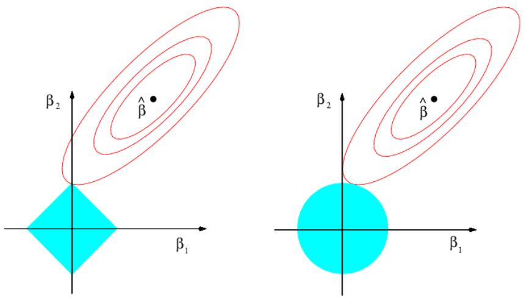
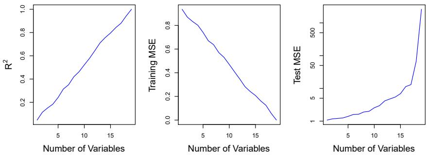

# Welcome Back {.divider background-color="#1b3a5c"}

::: notes
This session is led by Hyun-Hwan Jeong. Last week we learned to fit models;
this week we learn to (a) honestly measure how good they are and (b) keep
them from getting too clever.
:::

## Where we are

- **Last week** — fitting: least squares, logistic regression, LDA
- **The question we dodged**: those models looked good *on the data that
  trained them* — how good are they on data they've [never seen]{.hl}?
- **Today, part 1 (Ch. 5)** — squeeze a test-error estimate out of the data
  you already have: cross-validation and the bootstrap
- **Today, part 2 (Ch. 6)** — use that estimate to *choose* among models —
  and meet a better idea: shrink coefficients instead of selecting them

::: {.fragment}
These two chapters are the most-used tools in this course. Not the
flashiest — the most used.
:::

# Cross-Validation {.divider background-color="#1b3a5c"}

## The obvious idea first: hold some data out

```{=html}
<div class="fig-wrap"></div>
```

Randomly split into a **training set** (blue) and a **validation set**
(beige). Fit on one, score on the other. The validation MSE estimates the
test error — no peeking, no self-grading.

## Two problems with a single split

```{=html}
<div class="fig-wrap"></div>
```

Ten random splits of the `Auto` data, ten noticeably different error curves —
the estimate is [highly variable]{.hl}. And each model trains on only half
the data, so validation error tends to *overestimate* the true test error.

## Extreme opposite: leave-one-out CV

```{=html}
<div class="fig-wrap"></div>
```

Hold out **one** observation, train on the other $n-1$, score it; repeat $n$
times and average:

$$CV_{(n)} = \frac{1}{n}\sum_{i=1}^{n} \text{MSE}_i$$

No randomness, almost no lost data — but $n$ refits. (For least squares,
a leverage-based formula gives all $n$ errors from [one single fit]{.hl}.)

## The industry standard: k-fold CV

```{=html}
<div class="fig-wrap"></div>
```

Split into $k$ non-overlapping folds (usually $k = 5$ or 10); each fold takes
one turn as the validation set:

$$CV_{(k)} = \frac{1}{k}\sum_{i=1}^{k} \text{MSE}_i$$

$k$ refits instead of $n$ — and, surprisingly, often *better* estimates
than LOOCV.

## Why k = 5 or 10? Bias-variance, again

- **Validation set** ($k=2$-ish): trains on little data → error estimates
  biased *upward*
- **LOOCV** ($k=n$): the $n$ training sets are nearly identical → the $n$
  errors are highly correlated → averaging them removes [less variance]{.hl}
- **$k = 5$ or 10**: enough training data (low bias), folds different enough
  (low variance) — the empirical sweet spot

::: {.fragment}
Even the tool for *estimating* the bias-variance trade-off obeys the
bias-variance trade-off.
:::

## Does CV actually find the right model?

```{=html}
<div class="fig-wrap"></div>
```

Blue: true test MSE. Black: LOOCV. Orange: 10-fold. The estimated curves
sometimes sit too low or high — but the crosses (minima) land [at nearly the
right flexibility]{.hl}. Usually we need the location of the minimum, not its
level — and that's the easier job.

## The same machinery classifies

```{=html}
<div class="fig-wrap"></div>
```

Swap MSE for the error rate $\frac{1}{n}\sum I(y_i \neq \hat{y}_i)$ and
everything carries over: 10-fold CV (black) tracks test error (brown) and
picks a sensible polynomial degree for logistic regression, and $K$ for KNN —
while training error (blue) just keeps falling, as it always does.

# The Bootstrap {.divider background-color="#1b3a5c"}

## Resample your data as if it were the population

```{=html}
<div class="fig-wrap"></div>
```

We can't draw new datasets from the population — so draw them **from the
sample, with replacement**. Each bootstrap set $Z^{*b}$ has $n$ rows (some
repeated, some missing), and yields one estimate $\hat{\alpha}^{*b}$. The
spread of $\hat{\alpha}^{*1}, \dots, \hat{\alpha}^{*B}$ estimates the
[standard error of $\hat{\alpha}$]{.hl}.

## And it works startlingly well

```{=html}
<div class="fig-wrap"></div>
```

Left: the ideal — 1,000 fresh datasets from the true population. Center:
1,000 bootstrap samples from *one* dataset. Nearly identical spread. The
bootstrap SE (0.087) vs the truth (0.083) — [computed without ever touching
the population]{.hl}.

## What the bootstrap buys you

- A standard error (or confidence interval) for **any statistic** — median,
  correlation, a portfolio weight $\alpha$, a spline's value at $x_0$ —
  including ones with no textbook SE formula
- No distributional assumptions; just resample and recompute
- Coming attraction: drawing bootstrap datasets and averaging models trained
  on them is **bagging** — Week 4's random forests are [the bootstrap wearing
  a cape]{.hl}

## This week's lab, part 1

```python
from sklearn.model_selection import cross_val_score, KFold

cv_mse = -cross_val_score(model, X, y, cv=KFold(10, shuffle=True),
                          scoring='neg_mean_squared_error').mean()

def boot_se(data, stat, B=1000):
    stats = [stat(data.sample(frac=1, replace=True))
             for _ in range(B)]
    return np.std(stats)
```

Lab 5.3: validation splits, LOOCV and 10-fold on `Auto`, then bootstrap
standard errors — including for regression coefficients, checked against
the formulas from Week 2.

# Choosing Predictors {.divider background-color="#1b3a5c"}

## Best subset selection: try everything

```{=html}
<div class="fig-wrap"></div>
```

For each model size $d$, find the subset of predictors with lowest RSS (red
frontier on `Credit`). Two catches: $2^p$ models ($p = 20$ → a million), and
RSS/$R^2$ [always improve with more variables]{.hl} — they can't pick $d$.

::: {.fragment}
**Stepwise** selection (forward or backward) walks the frontier greedily —
$O(p^2)$ models, nearly as good in practice.
:::

## Comparing across sizes: pay for parameters

```{=html}
<div class="fig-wrap"></div>
```

$C_p$, **AIC**, **BIC**, adjusted $R^2$ — training error plus a [penalty per
parameter]{.hl} (BIC penalizes hardest, hence its minimum at 4 variables
here). The modern alternative: skip the theory and cross-validate every
size directly — often with the **one-standard-error rule**: take the
simplest model within one SE of the best.

# Shrinkage: Ridge & Lasso {.divider background-color="#1b3a5c"}

## Ridge: don't select — shrink

Keep all $p$ predictors, but penalize large coefficients:

$$\text{minimize} \;\; \text{RSS} + \lambda \sum_{j=1}^{p} \beta_j^2$$

```{=html}
<div class="fig-wrap"></div>
```

As $\lambda$ grows, coefficients shrink smoothly toward zero (but never
exactly reach it). One caveat: the penalty treats all $\beta_j$ alike, so
[standardize predictors first]{.hl}.

## Why shrinking helps: buy bias, sell variance

```{=html}
<div class="fig-wrap"></div>
```

Variance (green) drops fast as $\lambda$ grows; bias² (black) rises slowly.
Test MSE (purple) dips below least squares — the model is *deliberately
wrong on purpose*, and better for it. Ridge shines when least squares is
high-variance: [many predictors, modest $n$, collinearity]{.hl}.

## The lasso: shrink until it selects

Change the penalty from squares to absolute values:

$$\text{minimize} \;\; \text{RSS} + \lambda \sum_{j=1}^{p} |\beta_j|$$

```{=html}
<div class="fig-wrap"></div>
```

Now coefficients hit **exactly zero** as $\lambda$ grows — the lasso does
[variable selection and shrinkage simultaneously]{.hl}, producing sparse,
readable models.

## Why zeros? The geometry

```{=html}
<div class="fig-wrap"></div>
```

Both methods find where the RSS contours (red) first touch a budget region
(blue). The lasso's diamond has **corners on the axes** — contact usually
happens at a corner, where some $\beta_j = 0$. The ridge circle has no
corners, so nothing ever zeroes out. [One picture, whole story.]{.hl}

## Ridge or lasso? Depends on the truth

- Truth **sparse** (few predictors matter): lasso wins — it can find them
  and discard the rest
- Truth **dense** (many small effects): ridge wins — forcing zeros throws
  away real signal
- You don't know which — so [cross-validate both]{.hl} and let test error
  decide. (Elastic net: why not both penalties at once.)

## Choosing λ: CV closes the loop

```{=html}
<div class="fig-wrap"></div>
```

Compute the CV error at each $\lambda$ on a grid, pick the minimum. On this
sparse simulation the lasso at the CV-chosen $\lambda$ (dashed line) keeps
the two real signal variables (color) and zeroes most of the noise (grey).
[Ch. 5 supplies the ruler; Ch. 6 supplies the knob.]{.hl}

## Why all this matters: p can exceed n

```{=html}
<div class="fig-wrap"></div>
```

Add pure-noise predictors to a model and watch: $R^2 \to 1$, training MSE
$\to 0$, test MSE explodes. With genomics ($p$ in the thousands, $n$ in the
hundreds) least squares isn't even defined — [regularization isn't optional,
it's the price of entry]{.hl}. And never judge a high-dimensional model by
training-set metrics.

## This week's lab, part 2

```python
from sklearn.linear_model import RidgeCV, LassoCV

ridge = RidgeCV(alphas=np.logspace(-2, 4, 100), cv=10).fit(Xs, y)
lasso = LassoCV(n_alphas=100, cv=10).fit(Xs, y)
lasso.coef_        # note the exact zeros
```

Lab 6.5: subset selection on `Hitters`, then ridge and lasso with
cross-validated $\lambda$ — ending with PCR/PLS (dimension-reduction
cousins; PCA gets its full treatment in Week 6).

# Getting Started {.divider background-color="#1b3a5c"}

## Before next Friday

1. Read **ISLP Ch. 7–8** (`week4/ch07-08-nonlinearity-trees.pdf`) — Moving
   Beyond Linearity and Tree-Based Methods, for Jul 31
2. Run this week's labs: **5.3** (CV & Bootstrap) and **6.5**
   (Regularization)
3. Retrofit Week 2: take your favorite model from last week and report a
   *cross-validated* error for it — did your opinion of the model change?
4. From now on, every method we meet has a tuning knob, and the answer to
   "how do I set it?" is always the same: [cross-validation]{.hl}

## Questions?

::: {style="text-align: center; margin-top: 2em;"}
[See you next Friday.]{.hl}
:::

::: notes
Discussion seed: "why not pick the model with the best training R²?" —
by now the class should answer this in unison. If they do, this week worked.
:::
