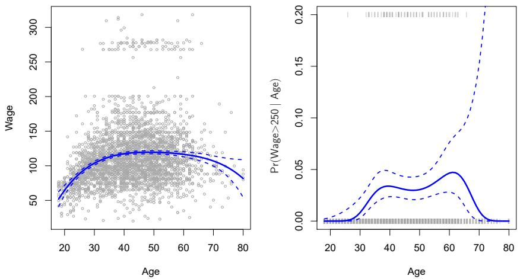
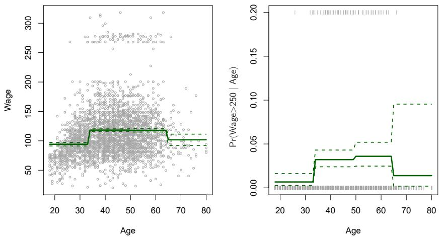
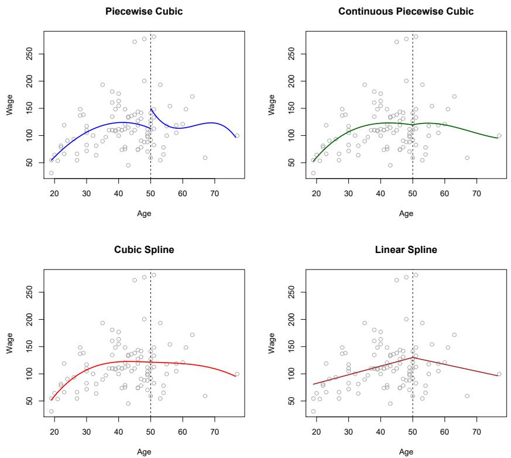
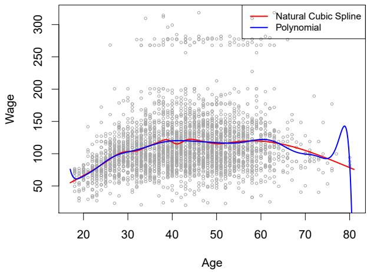
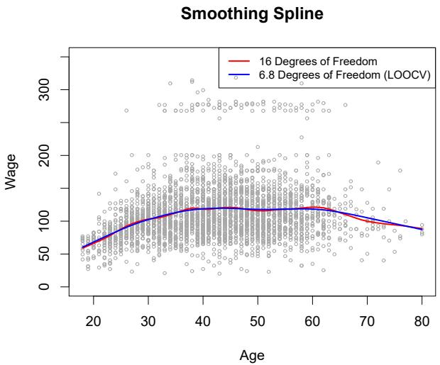
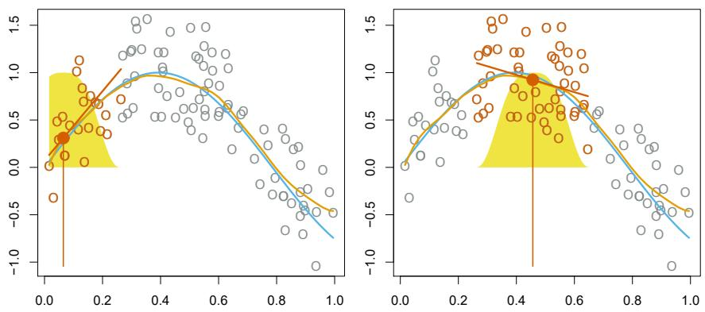
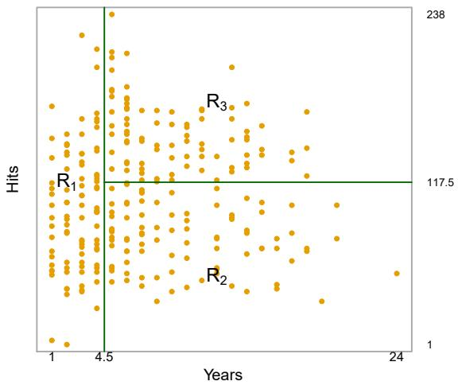
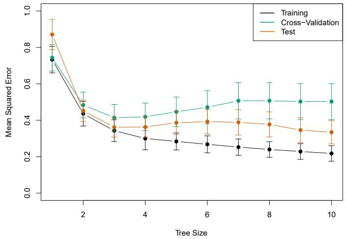
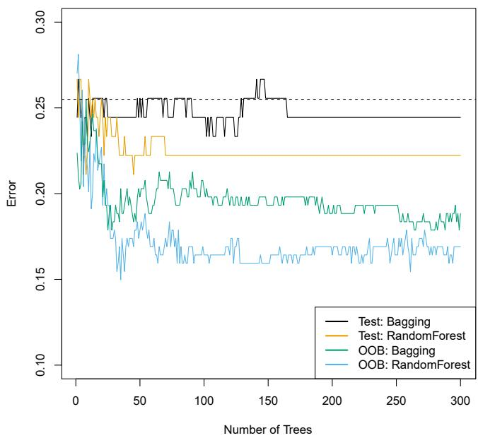
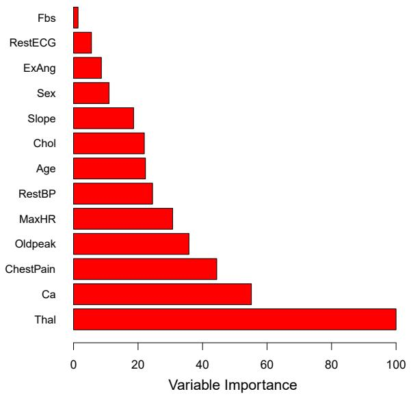

# Welcome Back {.divider background-color="#1b3a5c"}

::: notes
This session is led by Ho-min Park. Weeks 2–3 gave us linear models and the
tools to validate them — today we finally let the models bend.
:::

## Where we are

- **Week 2** — the linear workhorses: least squares, logistic regression, LDA
- **Week 3** — how to *trust* a model: cross-validation; how to *restrain*
  one: ridge & lasso ($\lambda$ returns today!)
- **Today** — two very different ways to [drop the linearity
  assumption]{.hl}:
  - **Ch. 7** — keep regression, make the curve *bend* (splines, GAMs)
  - **Ch. 8** — abandon curves entirely, *split* the space (trees, forests,
    boosting)

::: {.fragment}
Same referee as always: test error, bias vs variance. Only the contestants
change.
:::

# Moving Beyond Linearity {.divider background-color="#1b3a5c"}

## The truth is rarely straight

```{=html}
<div class="fig-wrap"></div>
```

`Wage` vs `age`: wages rise until ~40, plateau, then decline. No straight
line can say that. A **degree-4 polynomial** — just adding $\texttt{age}^2,
\texttt{age}^3, \texttt{age}^4$ as predictors — captures it, [with ordinary
least squares doing all the work]{.hl}.

## Step functions: chop, don't bend

```{=html}
<div class="fig-wrap"></div>
```

Cut the range of $X$ into bins and fit a constant in each — dummy variables
for "age bracket". Crude but honest: no global shape assumption at all.
Ubiquitous in biostatistics and marketing (age 20–35, 35–50, …).

## One framework for both: basis functions

Polynomials and steps are the *same trick*: replace $X$ with a fixed family
of transformations, then run linear regression on them:

$$y_i = \beta_0 + \beta_1 b_1(x_i) + \beta_2 b_2(x_i) + \cdots + \beta_K b_K(x_i) + \epsilon_i$$

- Polynomials: $b_j(x) = x^j$. Steps: $b_j(x) = I(c_j \le x < c_{j+1})$
- Everything from Ch. 3 still applies — standard errors, F-tests, all of it
- The question becomes: [which basis behaves best?]{.hl}

## Piecewise polynomials, tamed step by step

```{=html}
<div class="fig-wrap"></div>
```

Fit separate cubics left and right of a **knot** at age 50, then add
constraints: continuity, then continuous 1st and 2nd derivatives. Each
constraint frees up... nothing visually — [the curve just gets
smoother]{.hl}. The bottom-left panel is a **cubic spline**.

## Regression splines

A **cubic spline** with $K$ knots: piecewise cubic, continuous up to the
second derivative — using $K + 4$ degrees of freedom.

::: {.fragment}
Polynomials achieve flexibility by raising the **degree** (global, unstable);
splines achieve it by adding **knots** (local, stable). Knots go where the
data is — often just at quantiles.
:::

::: {.fragment}
One remaining problem: splines misbehave at the edges of the data…
:::

## Natural splines: calm at the boundaries

```{=html}
<div class="fig-wrap"></div>
```

A **natural spline** adds one more constraint: the fit must be *linear*
beyond the outermost knots. Look at the confidence bands past age 60 — the
natural spline (red) stays sane where the plain cubic spline (blue) flares.

## Splines vs high-degree polynomials

```{=html}
<div class="fig-wrap"></div>
```

Same degrees of freedom (15), wildly different behavior: the degree-15
polynomial (blue) goes berserk at the tails; the natural spline (red) stays
smooth. [If you need flexibility, buy it with knots, not with degree.]{.hl}
How many knots? Cross-validation — Week 3's tool, already earning rent.

## Smoothing splines: let the penalty choose

Skip knot placement entirely — ask for *any* function $g$ that fits well but
isn't too wiggly:

$$\text{minimize} \;\; \sum_{i=1}^n (y_i - g(x_i))^2 + \lambda \int g''(t)^2 \, dt$$

- The integral measures total **wiggliness** ($g''$ = how fast the slope changes)
- $\lambda = 0$: interpolate every point. $\lambda \to \infty$: a straight line
- [Exactly ridge regression's logic]{.hl}, applied to curves — and the
  solution is always a natural cubic spline with knots at every $x_i$

## Effective degrees of freedom

```{=html}
<div class="fig-wrap"></div>
```

$\lambda$ converts to **effective degrees of freedom** $df_\lambda$ — a
continuous dial from 2 (line) to $n$ (interpolation). Here LOOCV picks
$df = 6.8$ (blue); a hand-picked 16 (red) barely differs from it. LOOCV for
smoothing splines has a [closed-form shortcut]{.hl} — no refitting loop.

## Local regression: fit a line, but only nearby

```{=html}
<div class="fig-wrap"></div>
```

At each target point: grab the nearest fraction $s$ of points (the **span**),
weight them by closeness (yellow bell), fit a weighted line, keep its value
at the target only. Slide along and repeat. KNN's memory-based spirit, but
smooth — the span $s$ is the flexibility dial.

## GAMs: a bend for every predictor

Generalized Additive Models replace each linear term with its own smooth
function:

$$y_i = \beta_0 + f_1(x_{i1}) + f_2(x_{i2}) + \cdots + f_p(x_{ip}) + \epsilon_i$$

```{=html}
<div class="fig-wrap"></div>
```

`wage` = spline of `year` + spline of `age` + steps of `education` — three
readable plots. [Additivity is the compromise]{.hl}: each variable bends,
but no interactions unless you add them yourself.

## This week's lab, part 1: splines in Python

```python
from ISLP.transforms import BSpline, NaturalSpline
from pygam import LinearGAM, s

# Natural spline of age, still just OLS
ns_age = NaturalSpline(df=4).fit(age)
# A GAM: one smooth per predictor
gam = LinearGAM(s(0) + s(1)).fit(X, y)
```

The lab walks through polynomials → steps → splines → smoothing splines →
GAMs on the `Wage` data — every figure from today's Ch. 7 slides,
reproduced by you.

# Tree-Based Methods {.divider background-color="#1b3a5c"}

## A completely different philosophy

:::: {.columns}
::: {.column style="width:55%;"}
```{=html}
<div class="fig-wrap"></div>
```
:::
::: {.column style="width:45%;"}
Predicting a baseball player's (log) salary:

- One question at a time: *Years < 4.5?* Then: *Hits < 117.5?*
- Follow the branches to a **leaf**; predict the leaf's mean
- No equation, no coefficients — [a flowchart learned from data]{.hl}
:::
::::

## What a tree really does: carve the space

```{=html}
<div class="fig-wrap"></div>
```

The same tree, drawn as geography: axis-parallel cuts dividing the predictor
space into boxes $R_1, R_2, R_3$. Prediction = the mean response inside your
box. Compare: splines bend a *global* surface; trees fit [a constant in each
local box]{.hl}.

## How the tree is grown

**Recursive binary splitting** — top-down and greedy:

1. Scan every predictor $j$ and every cutpoint $s$
2. Pick the split $X_j < s$ that most reduces
   $\text{RSS} = \sum_{\text{regions}} \sum_{i \in R_m} (y_i - \bar{y}_{R_m})^2$
3. Recurse into each half; stop when regions get small

::: {.fragment}
"Greedy" = the best split *right now*, never looking ahead — fast, but no
guarantee of the globally best tree. For classification, RSS is replaced by
the **Gini index** or **entropy** (leaf purity).
:::

## Grown trees overfit — so prune them

```{=html}
<div class="fig-wrap"></div>
```

Training MSE (black) falls forever as the tree grows; CV and test error
(green, orange) bottom out at **three leaves** for `Hitters`.
**Cost-complexity pruning** adds a penalty $\alpha |T|$ on the number of
leaves — [the lasso's idea, wearing bark]{.hl} — and CV picks $\alpha$.

## Trees vs linear models: whose prior is right?

```{=html}
<div class="fig-wrap"></div>
```

Truth linear (top): the linear model wins; a tree can only staircase.
Truth blocky (bottom): the tree nails it; the linear model can't. [Neither
is better — it depends on the true $f$]{.hl}, which is Week 1's lesson
refusing to go away.

## Trees: the honest scorecard

:::: {.columns}
::: {.column style="width:50%;"}
### Loved because
- Read like a decision process — explain one to anyone
- Handle qualitative predictors, interactions, missing values gracefully
- Zero feature scaling, zero dummy-variable ceremony
:::
::: {.column style="width:50%;"}
### Distrusted because
- **Predictive accuracy** usually loses to regression
- **High variance**: change a few observations, get a different tree
:::
::::

::: {.fragment}
One tree is weak. The fix: [stop relying on one tree.]{.hl}
:::

## Bagging: average away the variance

Bootstrap (Week 3!) $B$ training sets, grow a deep tree on each, average
their predictions (majority vote for classification):

$$\hat{f}_{\text{bag}}(x) = \frac{1}{B} \sum_{b=1}^{B} \hat{f}^{*b}(x)$$

- Averaging $B$ noisy estimates slashes variance — the trees are grown deep
  (low bias) and the averaging handles the rest
- **Out-of-bag (OOB) error**: each tree never saw ~1/3 of the data — score
  it there and get [test-error estimation for free]{.hl}, no CV loop needed

## Random forests: decorrelate the trees

```{=html}
<div class="fig-wrap"></div>
```

Bagged trees all lean on the same strong predictor → correlated trees →
less variance reduction. Random forests allow each split to consider only a
**random sample of $m \approx \sqrt{p}$ predictors**. Deliberately hobbling
each tree makes [the ensemble stronger]{.hl} — orange vs black above.

## What did the forest learn? Variable importance

```{=html}
<div class="fig-wrap"></div>
```

We traded the single tree's readability for accuracy — variable importance
buys some back: total RSS/Gini improvement contributed by each predictor,
averaged over all trees. On the `Heart` data: `Thal`, `Ca`, `ChestPain`
dominate.

## Boosting: learn slowly, on the residuals

No bootstrap — grow small trees **sequentially**, each fit to what the
previous ensemble *got wrong*:

$$\hat{f}(x) \leftarrow \hat{f}(x) + \lambda \hat{f}^b(x), \qquad r_i \leftarrow r_i - \lambda \hat{f}^b(x_i)$$

Three knobs:

- $B$ — number of trees (can overfit if huge, unlike bagging)
- $\lambda$ — shrinkage, typically 0.01: [slow learning]{.hl}
- $d$ — tree depth, often just 1–2 (stumps!): each tree is a weak learner

## Small, slow trees beat big forests (sometimes)

```{=html}
<div class="fig-wrap"></div>
```

Gene-expression data: boosted **depth-1 stumps** ($\lambda = 0.01$) edge out
depth-2 boosting, and both beat the random forest. Boosting's descendants —
XGBoost, LightGBM — remain [the strongest baseline for tabular data]{.hl}
today. (BART, Section 8.2.4, is the Bayesian cousin — skim it.)

## This week's lab, part 2: forests in three lines

```python
from sklearn.ensemble import \
    RandomForestRegressor, GradientBoostingRegressor

rf = RandomForestRegressor(max_features='sqrt').fit(X_train, y_train)
boost = GradientBoostingRegressor(n_estimators=5000,
    learning_rate=0.01, max_depth=3).fit(X_train, y_train)
```

The lab (8.3) grows a single tree on `Boston`, watches it overfit, prunes
it, then buries it with bagging, random forests, boosting, and BART —
compare the test MSEs yourself.

# Getting Started {.divider background-color="#1b3a5c"}

## Before next Friday

1. Read **ISLP Ch. 9 and Ch. 10.1–10.4**
   (`week5/ch09-10pt1-svm-deep-learning-intro.pdf`) — Support Vector
   Machines and the start of Deep Learning, for Aug 7
2. Run this week's labs: **7.8** (Non-Linear Modeling) and **8.3**
   (Tree-Based Methods)
3. A thought exercise for the week: your random forest beats your GAM by 2%
   test error, but the client asks *"so what drives price?"* — which model
   do you report, and why?
4. Next week the flexibility story continues — SVMs bend boundaries with
   kernels, then neural networks learn the basis functions themselves

## Questions?

::: {style="text-align: center; margin-top: 2em;"}
[See you next Friday.]{.hl}
:::

::: notes
If time remains, the trees-vs-splines contrast is the best discussion seed:
both replace "one global line" with local structure — smooth pieces vs
constant boxes — and both rediscover the bias-variance dial with new names
(knots/λ vs depth/pruning).
:::
