# Welcome Back {.divider background-color="#1b3a5c"}

::: notes
This session is led by Hyun-Hwan Jeong. Two big families today — SVMs close
out the "clever boundaries" story, neural networks open the "learned
features" story that continues next week.
:::

## Where we are

- **Weeks 2–4** — from straight lines to splines and forests, always with
  the same recipe: [you choose the features, the model fits the
  weights]{.hl}
- **Today, part 1 (Ch. 9)** — SVMs: choose the boundary with the widest
  buffer zone, and bend it with kernels
- **Today, part 2 (Ch. 10.1–10.4)** — neural networks: stop choosing
  features by hand and [let the model learn them]{.hl} — through MNIST
  digits, CNNs, and movie reviews

# Maximum-Margin Classifiers {.divider background-color="#1b3a5c"}

## Infinitely many separating lines — which one?

```{=html}
<div class="fig-wrap">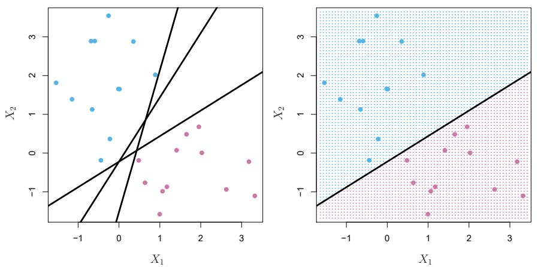</div>
```

A **hyperplane** ($\beta_0 + \beta_1 X_1 + \cdots + \beta_p X_p = 0$) splits
the space in two; classify by which side you're on. If the classes are
separable, [infinitely many hyperplanes work]{.hl} on the training data —
they will *not* work equally well on test data.

## Pick the one with the widest buffer

```{=html}
<div class="fig-wrap">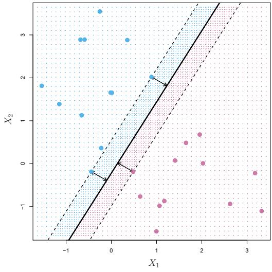</div>
```

The **maximal margin classifier** maximizes the distance to the nearest
training points. Those nearest points — the **support vectors** — are the
only ones that matter: [move any other point and the boundary doesn't
budge]{.hl}.

## Two reasons this isn't enough

```{=html}
<div class="fig-wrap">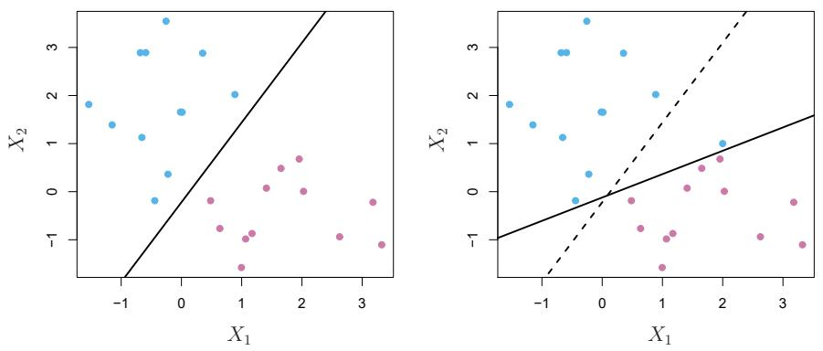</div>
```

One added observation (right) swings the maximal margin hyperplane wildly —
tiny margin, high variance. Worse: for most real data, [no separating
hyperplane exists at all]{.hl}. We need a boundary that's allowed to make
mistakes.

## The support vector classifier: a soft margin

Allow observations on the wrong side of the margin — even of the
hyperplane — within a total error budget controlled by $C$:

$$y_i(\beta_0 + \beta_1 x_{i1} + \cdots + \beta_p x_{ip}) \geq M(1 - \epsilon_i), \qquad \epsilon_i \geq 0, \;\; \sum_{i=1}^n \epsilon_i \leq C$$

- $\epsilon_i = 0$: right side of the margin. $\epsilon_i > 0$: inside it.
  $\epsilon_i > 1$: misclassified
- Support vectors now = every point on or inside the margin

## C is a bias-variance dial

```{=html}
<div class="fig-wrap"></div>
```

Large $C$ (top left): wide, tolerant margin — many support vectors, low
variance, more bias. Small $C$ (bottom right): narrow, strict margin — few
support vectors, high variance. How to choose? [Cross-validation, as
always.]{.hl}

## When no line will ever do

```{=html}
<div class="fig-wrap">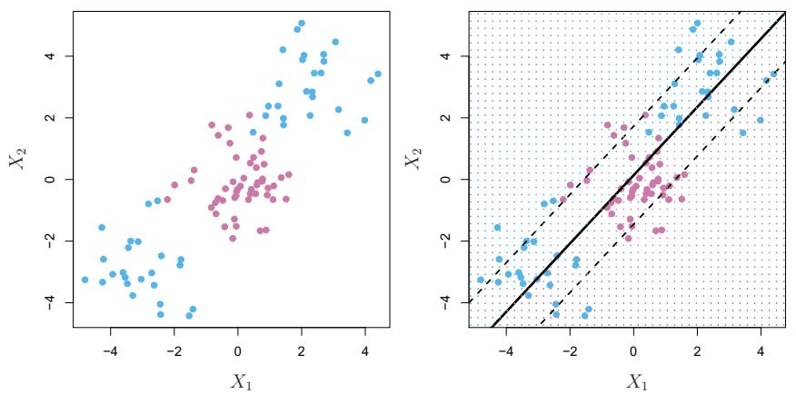</div>
```

The classes sit in concentric groups — the best *linear* classifier (right)
is useless. Week 4's answer was to add transformed features
($X^2$, splines…). The SVM automates exactly that idea, efficiently.

## The kernel trick

The classifier depends on the data [only through inner products]{.hl}
$\langle x_i, x_{i'} \rangle$. Replace them with a **kernel** — a similarity
function — and you've implicitly fit a linear boundary in a huge enlarged
feature space, without ever building it:

- Polynomial: $K(x_i, x_{i'}) = (1 + \sum_j x_{ij}x_{i'j})^d$
- Radial: $K(x_i, x_{i'}) = \exp(-\gamma \sum_j (x_{ij} - x_{i'j})^2)$ —
  local, "nearby points vote"

Support vector classifier + kernel = **support vector machine**.

## Kernels in action

```{=html}
<div class="fig-wrap">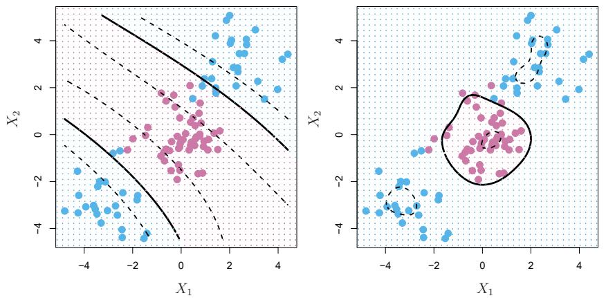</div>
```

Degree-3 polynomial kernel (left) and radial kernel (right) on the doughnut
data — both trace the curved boundary a linear classifier couldn't. Extra
knobs ($d$, $\gamma$) join $C$ on the [cross-validation to-do list]{.hl}.

## SVM and logistic regression: close cousins

```{=html}
<div class="fig-wrap">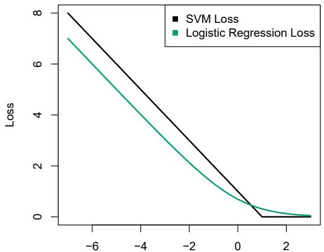</div>
```

The SVM minimizes **hinge loss**; logistic regression a smooth near-twin.
Practical folklore: [well-separated classes → SVM; overlapping classes →
logistic regression]{.hl} (which also gives probabilities). For $K > 2$
classes: one-versus-one or one-versus-all voting.

## This week's lab, part 1

```python
from sklearn.svm import SVC
from sklearn.model_selection import GridSearchCV

grid = GridSearchCV(SVC(kernel='rbf'),
                    {'C': [0.1, 1, 10, 100],
                     'gamma': [0.5, 1, 2, 4]}, cv=5)
grid.fit(X_train, y_train)
```

Lab 9.6: linear → polynomial → radial kernels, tuning $C$ and $\gamma$ by
CV, ROC curves, and a $p \gg n$ gene-expression finale.

# Neural Networks {.divider background-color="#1b3a5c"}

## Stop engineering features — learn them

```{=html}
<div class="fig-wrap"></div>
```

$$f(X) = \beta_0 + \sum_{k=1}^{K} \beta_k \, g\!\left(w_{k0} + \sum_{j=1}^{p} w_{kj} X_j\right)$$

Week 4's basis functions $b_k(X)$ were *fixed* (splines, polynomials). A
neural network's hidden units are basis functions [with learnable
weights]{.hl} — the model invents its own transformations.

## The nonlinearity is the whole point

```{=html}
<div class="fig-wrap">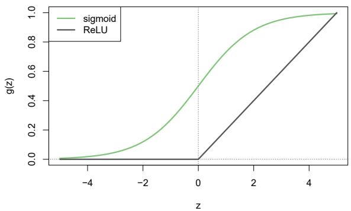</div>
```

Without the **activation** $g(\cdot)$, layers of linear combinations
collapse into… one linear model. The modern default is **ReLU**
$g(z) = \max(0, z)$ — crude-looking, fast, and enough nonlinearity to
approximate almost anything. (Sigmoid — logistic regression's S-curve —
was the classic choice.)

## Deeper: a network for handwritten digits

```{=html}
<div class="fig-wrap">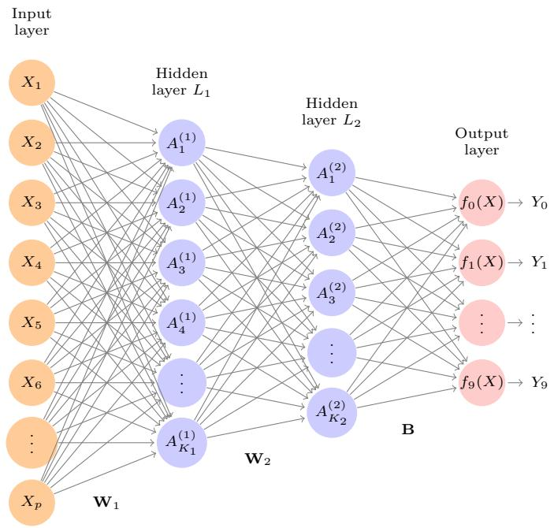</div>
```

MNIST: $28 \times 28$ pixels → $p = 784$ inputs, two hidden layers (256,
128 units), 10 outputs through **softmax** (Week 2's multinomial trick) —
**235,146 parameters** for 60,000 training images. Fitted by minimizing
cross-entropy. [More parameters than feels safe — regularization does the
heavy lifting]{.hl} (details next week).

## Was it worth 235k parameters? Here, yes

| Method | MNIST test error |
|---|---|
| Neural network + dropout | **1.8%** |
| Neural network + ridge | 2.3% |
| Multinomial logistic regression | 7.2% |
| Linear discriminant analysis | 12.7% |

::: {.fragment}
Pixels are exactly the setting where learned features crush linear methods:
the raw inputs mean nothing individually. But hold that thought until the
IMDB slide…
:::

## Images deserve a smarter architecture

```{=html}
<div class="fig-wrap">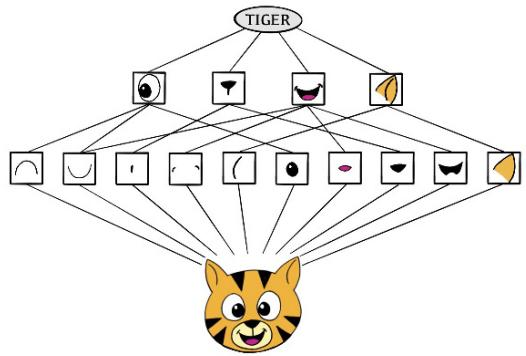</div>
```

A **convolutional neural network** classifies the way vision seems to work:
find small local features (edges, spots), compose them into parts (eyes,
ears, stripes), then into objects (tiger). Two ingredients: [convolution
layers and pooling layers]{.hl}.

## Convolution: one tiny filter, dragged everywhere

```{=html}
<div class="fig-wrap">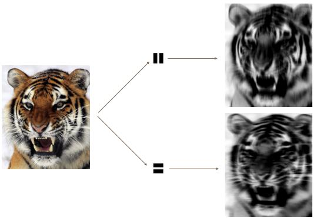</div>
```

A filter is a small weight matrix slid across the image; the output lights
up wherever the image matches it (vertical stripes, top; horizontal,
bottom). One filter = few dozen weights [reused at every location]{.hl} —
compare a dense layer's millions. The filters themselves are learned.

## Pooling, then repeat until it's a vector

```{=html}
<div class="fig-wrap">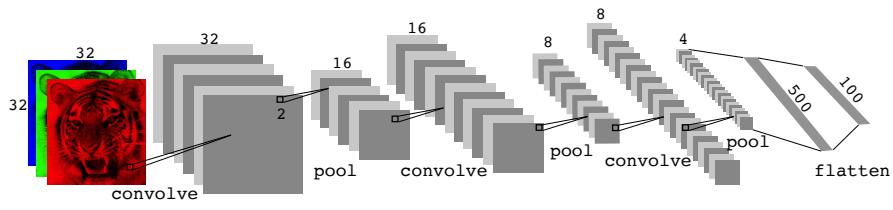</div>
```

**Max-pooling** keeps the strongest response in each $2 \times 2$ block —
halving resolution, adding location-invariance. A CNN alternates
convolve/pool until the image becomes a short vector, then finishes with
dense layers. Channels grow as resolution shrinks: [pixels in, concepts
out]{.hl}.

## Two practical tricks that matter

```{=html}
<div class="fig-wrap">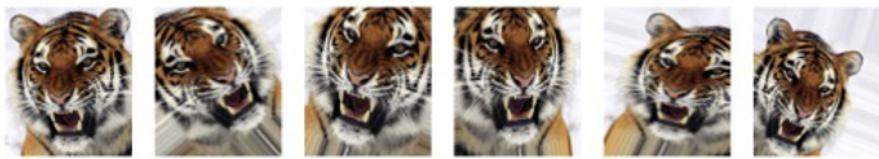</div>
```

- **Data augmentation**: train on distorted copies (crop, flip, zoom) —
  free data, and a regularizer with the same flavor as ridge
- **Pretrained networks**: a resnet trained on millions of images can be
  reused — freeze its feature layers, retrain only the top. This
  [transfer learning]{.hl} is how most real projects use deep learning

## Humility check: movie reviews

```{=html}
<div class="fig-wrap">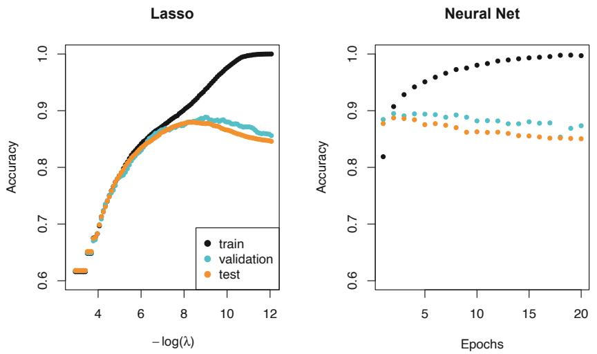</div>
```

IMDB sentiment, bag-of-words features: the lasso (left) and a
two-hidden-layer network (right) both reach [about 88% test accuracy]{.hl}.
On tabular/sparse data the fancy model often just matches the simple one —
Week 3's tools remain the benchmark to beat.

## This week's lab, part 2

```python
import torch.nn as nn

model = nn.Sequential(
    nn.Flatten(),
    nn.Linear(784, 256), nn.ReLU(), nn.Dropout(0.4),
    nn.Linear(256, 128), nn.ReLU(), nn.Dropout(0.3),
    nn.Linear(128, 10))
```

Lab 10.9.1–10.9.4: a single-layer network on `Hitters` (vs the lasso!), the
MNIST network above, a CNN on CIFAR100, and a pretrained resnet50 on your
own photos.

# Getting Started {.divider background-color="#1b3a5c"}

## Before next Friday

1. Read **ISLP Ch. 10.5–10.10 and Ch. 12**
   (`week6/ch10pt2-rnn-deep-learning.pdf`,
   `week6/ch12-unsupervised-learning.pdf`) — RNNs, network fitting, and
   Unsupervised Learning, for Aug 14
2. Run this week's labs: **9.6** (SVMs) and **10.9.1–10.9.4** (networks &
   CNNs) — the CNN benefits from a GPU; Google Colab works fine
3. Compare deliberately: on the `Heart` data, tune an SVM and re-run
   Week 2's logistic regression — is the extra machinery buying you
   anything?
4. Next week: how training actually works (SGD, backprop, dropout), RNNs
   for sequences — and then we lose our labels entirely

## Questions?

::: {style="text-align: center; margin-top: 2em;"}
[See you next Friday.]{.hl}
:::

::: notes
Discussion seed: "the SVM only remembers its support vectors; the neural
network remembers 235k weights — which model do you trust more, and why?"
Good bridge into next week's regularization story.
:::
