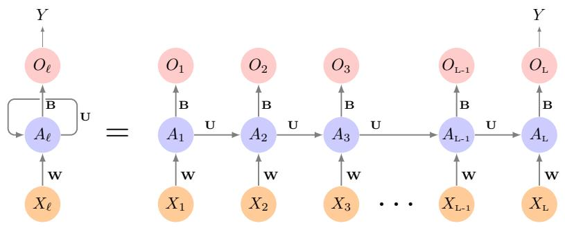
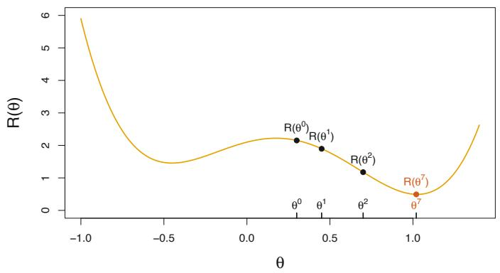
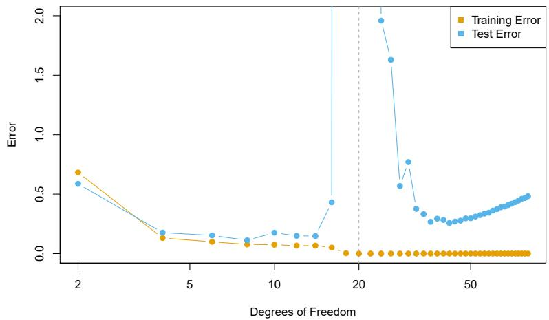
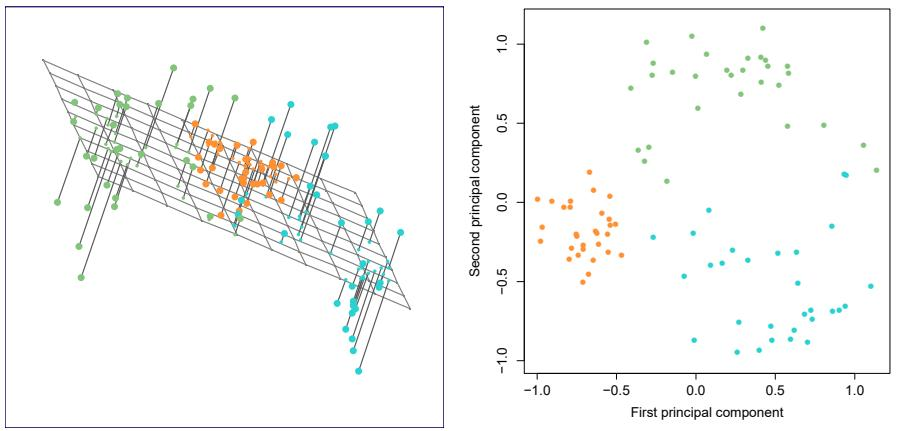
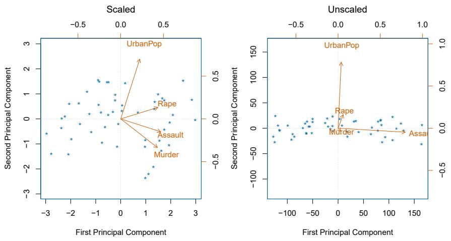
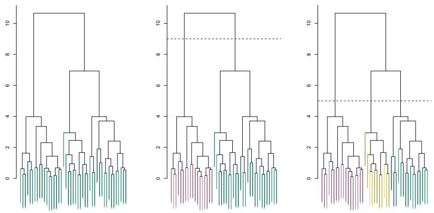
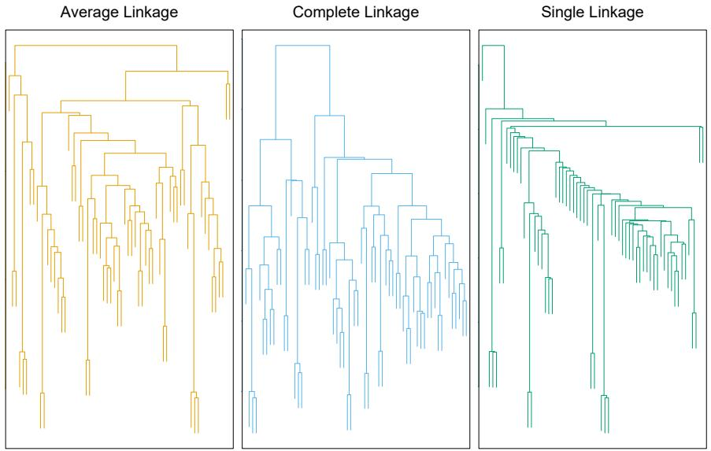

# Welcome Back {.divider background-color="#1b3a5c"}

::: notes
This session is led by Ho-min Park. Second-to-last week — deep learning
concludes, then we lose our labels entirely.
:::

## Where we are

- **Last week** — SVMs, then neural networks: layers, activations, CNNs for
  images
- **Today, part 1** — networks for **sequences** (text, time series), and
  how any network is actually *fitted* (SGD, backprop, dropout)
- **Today, part 2** — a bigger shift: [what can we learn when there is no
  $Y$ at all?]{.hl} PCA and clustering

::: {.fragment}
Everything until today has been supervised. Unsupervised learning drops the
answer key — which changes what "being right" even means.
:::

# Deep Learning II: Sequences {.divider background-color="#1b3a5c"}

## When the input has an order

A document, a stock-price history, a genome, a sensor log — each is a
sequence $X = \{X_1, X_2, \dots, X_L\}$ where [the order carries the
information]{.hl}.

- Bag-of-words models throw the order away — "good, not bad" and
  "bad, not good" become identical
- Fixed-input methods (everything we've seen) need a new idea for
  variable-length, ordered data

## First problem: words aren't numbers

```{=html}
<div class="fig-wrap"></div>
```

**One-hot** encoding (top): each word = a huge sparse indicator vector —
every pair of words equally far apart. An **embedding** (bottom) maps each
word to a short dense vector where [similar words land close
together]{.hl} — learned from data, or borrowed (word2vec, GloVe).

## The recurrent idea: reuse one network, carry a memory

```{=html}
<div class="fig-wrap"></div>
```

Process the sequence one element at a time; the hidden **activation**
$A_\ell$ feeds forward into the next step. Crucially, the weights
$\mathbf{W}, \mathbf{U}, \mathbf{B}$ are [the same at every step]{.hl} —
one network, unrolled $L$ times, with a running summary as memory.

## RNNs in practice

- Plain RNNs forget quickly — long sequences drown the early signal
- **LSTM** and **GRU** cells add gates that decide what to keep and what to
  forget; the workhorses of pre-transformer NLP
- Sequence-to-sequence RNNs (translate, summarize) are the [direct ancestors
  of today's transformer LLMs]{.hl} — same problem, new architecture

::: notes
Worth one sentence of history: attention was invented to fix seq2seq RNN
bottlenecks, then "Attention Is All You Need" dropped the recurrence
entirely. ISLP 10.6 nods to this.
:::

## Time series: predicting NYSE trading volume

```{=html}
<div class="fig-wrap"></div>
```

An RNN fed the last 5 days of (volume, return, volatility) predicts
tomorrow's log volume — capturing **42% of test-set variance**. Sobering
footnote: a plain autoregressive linear model on lagged values does
[almost exactly as well]{.hl}.

## When to actually use deep learning

ISLP's own advice (§10.6), after fitting all these networks:

- On `Hitters`, a lasso model matches the neural network — with 12
  interpretable coefficients
- Deep learning shines with [large $n$, and signal-rich raw inputs]{.hl}
  (images, audio, text) — not on every tabular problem
- **Occam's razor**: given similar performance, take the simpler,
  more interpretable model

::: {.fragment}
The best argument for learning Weeks 2–4 thoroughly: they're the baseline
deep learning has to beat — and often doesn't.
:::

# How Networks Are Fitted {.divider background-color="#1b3a5c"}

## A non-convex problem

```{=html}
<div class="fig-wrap"></div>
```

$R(\theta) = \frac{1}{2}\sum_i (y_i - f_\theta(x_i))^2$ has **many minima** —
unlike least squares, no formula, no unique answer. **Gradient descent**:
start somewhere, repeatedly step downhill:
$\theta^{t+1} = \theta^t - \rho \nabla R(\theta^t)$, with learning rate $\rho$.

## Backpropagation and SGD

- **Backpropagation** = the chain rule, organized: the gradient of the loss
  flows backwards through the layers, one cheap pass
- **Stochastic** gradient descent: compute each step's gradient on a small
  **minibatch**, not all $n$ points — noisier steps, far cheaper, and the
  noise even helps escape bad minima
- One sweep through the data = an **epoch**

::: {.fragment}
None of this guarantees the global minimum — and in practice,
[nobody cares]{.hl}: a good local minimum generalizes fine.
:::

## Keeping big networks honest: dropout

```{=html}
<div class="fig-wrap"></div>
```

Networks have *far* more parameters than observations — regularization is
not optional. Options: ridge penalties on weights, **early stopping**, and
**dropout** — randomly silence a fraction of units at each training step, so
no unit can free-ride on another. [The ensemble idea from Week 4]{.hl},
happening inside one network.

## Double descent: a plot twist

```{=html}
<div class="fig-wrap"></div>
```

Push flexibility *past* the point of interpolating the training data
(zero training error) and test error can come [back down]{.hl}. Doesn't
break the bias-variance trade-off — among all interpolating fits, the
training procedure finds the *smoothest* one. But it explains why absurdly
overparameterized networks can still generalize.

## This week's lab, part 1: an RNN in PyTorch

```python
import torch.nn as nn

class NYSEModel(nn.Module):
    def __init__(self):
        super().__init__()
        self.rnn = nn.RNN(3, 12, batch_first=True)
        self.dense = nn.Linear(12, 1)
    def forward(self, x):
        val, h_n = self.rnn(x)
        return self.dense(val[:, -1])   # last time step only
```

Lab 10.9.5–10.9.6: IMDB sentiment with embeddings, then this NYSE
forecaster — plus the autoregressive baseline that keeps it humble.

# Unsupervised Learning {.divider background-color="#1b3a5c"}

## No $Y$, new rules

Only features $X_1, \dots, X_p$ — no response to predict. The goal shifts to
**discovery**: interesting directions, informative groups.

- Is there a low-dimensional way to *see* this data? → **PCA**
- Do the observations fall into *groups*? → **clustering**

::: {.fragment}
The honest difficulty: [no test error exists]{.hl}. There's no ground truth
to check against — results must be judged by usefulness, stability, and
domain sense. More art, more caution.
:::

## PCA: the directions that matter most

The **first principal component** is the normalized linear combination

$$Z_1 = \phi_{11} X_1 + \phi_{21} X_2 + \cdots + \phi_{p1} X_p$$

with the largest variance — the single axis along which the data varies
most. $Z_2$ is the next-most-variable direction *uncorrelated with* $Z_1$,
and so on.

- The $\phi$'s are **loadings** (what the direction is made of)
- The $z_i$'s are **scores** (where each observation sits on it)

## Fifty states, four crimes, one picture

```{=html}
<div class="fig-wrap"></div>
```

`USArrests`: PC1 loads on the three crime rates (overall crime level), PC2
on urbanization. The **biplot** shows both scores (states) and loadings
(arrows): California high on both; the Dakotas low on both. [Four dimensions
compressed into a readable map.]{.hl}

## Another view: the best-fitting flat surface

```{=html}
<div class="fig-wrap"></div>
```

Equivalent definition: the first $M$ components span the flat surface
**closest to the data points** (minimal total squared distance). PCA =
the best possible $M$-dimensional shadow of a $p$-dimensional cloud.
(This view powers matrix completion — recommender systems impute missing
entries with iterated PCA, §12.3.)

## How many components? The scree plot

```{=html}
<div class="fig-wrap"></div>
```

Each PC explains a **proportion of variance** (PVE). For `USArrests`:
62%, 25%, 9%, 4% — two components carry 87%. The standard heuristic:
look for the **elbow** where the plot flattens. Unsatisfying but honest —
[there is no CV to hide behind here]{.hl}.

## Scale first, or one variable runs the show

```{=html}
<div class="fig-wrap"></div>
```

Unscaled (right), `Assault` — the variable with the biggest raw variance —
hijacks PC1 purely because of its units. [Standardize each variable
(mean 0, sd 1) before PCA]{.hl} unless everything is measured in the same
units on purpose.

## K-means: pick K, minimize within-cluster scatter

```{=html}
<div class="fig-wrap"></div>
```

Partition the observations into $K$ clusters minimizing total
**within-cluster variation** $\sum_{k=1}^{K} W(C_k)$ (squared Euclidean
distances). You choose $K$ — and each choice tells [a different, equally
confident-looking story]{.hl}.

## The algorithm: assign, average, repeat

```{=html}
<div class="fig-wrap"></div>
```

1. Random initial assignment → 2. compute cluster **centroids** →
3. reassign each point to its nearest centroid → repeat until nothing moves.

Each step lowers the objective, but only to a [local optimum]{.hl} — run
many random starts (`n_init` in sklearn) and keep the best.

## Hierarchical clustering: don't choose K, grow a tree

```{=html}
<div class="fig-wrap"></div>
```

Start with $n$ singleton clusters; repeatedly **fuse the two closest**
clusters until one remains. The record of fusions is a **dendrogram** —
cut it at height 9 for two clusters, at 5 for three. [One tree, every $K$
at once.]{.hl}

## Reading a dendrogram (most people do it wrong)

```{=html}
<div class="fig-wrap"></div>
```

Similarity is the **height where two observations first fuse** — never
their left-right closeness. Here observation 9 looks adjacent to 2, but is
no more similar to 2 than to 8, 5, or 7: they all join 9 at the same height.
Horizontal position is [an artifact of drawing]{.hl}.

## The knobs: linkage and dissimilarity

```{=html}
<div class="fig-wrap"></div>
```

- **Linkage** = distance between *clusters*: complete (max), average, single
  (min — produces stringy, unbalanced trees). Average/complete preferred
- **Dissimilarity**: Euclidean distance, or *correlation-based* (shapes of
  profiles, not magnitudes) — the right choice is a [domain decision]{.hl},
  e.g. shopper baskets vs gene expression profiles

## Unsupervised results: handle with care

- Scaling, dissimilarity, linkage, $K$ — [small decisions, big
  consequences]{.hl}; try several, report what's stable
- Clusters *will* appear even in noise — the algorithms have no way to say
  "there's nothing here"
- Validate: do the clusters persist across subsamples? Do they mean
  something to a domain expert?
- Use as the start of a hypothesis, not the end of an analysis

## This week's lab, part 2: three lines each

```python
from sklearn.decomposition import PCA
from sklearn.cluster import KMeans
from scipy.cluster.hierarchy import dendrogram, linkage

scores = PCA().fit_transform(X_scaled)
km = KMeans(n_clusters=3, n_init=20).fit(X_scaled)
dendrogram(linkage(X_scaled, method='complete'))
```

Lab 12.5: PCA on `USArrests`, matrix completion, K-means and hierarchical
clustering — ending with the `NCI60` cancer cell lines, where clustering
meets real genomics.

# Getting Started {.divider background-color="#1b3a5c"}

## Before next Friday

1. Read **ISLP Ch. 11 and Ch. 13** (`week7/ch11-survival-analysis.pdf`,
   `week7/ch13-multiple-testing.pdf`) — Survival Analysis and Multiple
   Testing, for the final session on Aug 21
2. Run this week's labs: **10.9.5–10.9.6** (IMDB & RNNs) and **12.5**
   (PCA & clustering)
3. Try it on your own data: PCA-then-cluster something from your work —
   and notice how much the story changes with scaling on vs off
4. Final week wraps up with two topics every practitioner eventually
   needs: time-to-event data and the perils of testing many hypotheses

## Questions?

::: {style="text-align: center; margin-top: 2em;"}
[See you next Friday — one week to go.]{.hl}
:::

::: notes
Discussion seed if time remains: "PCA before clustering — helpful or
harmful?" (denoising vs distortion; NCI60 in the lab does exactly this.)
:::
