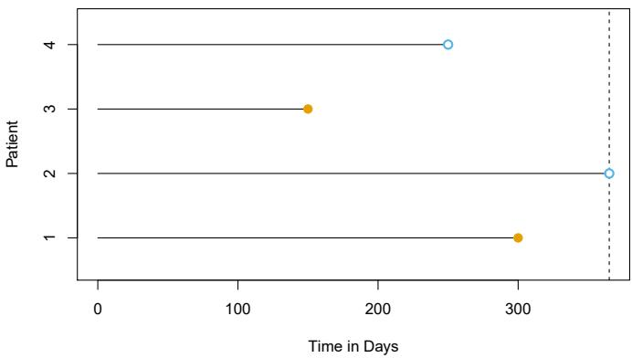
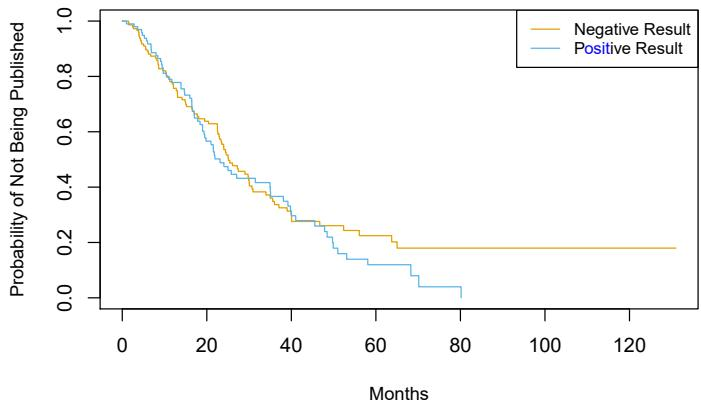
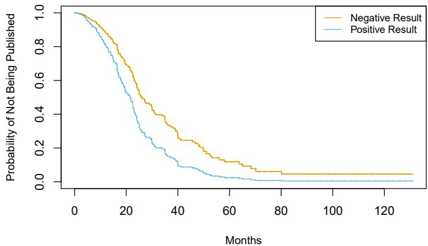
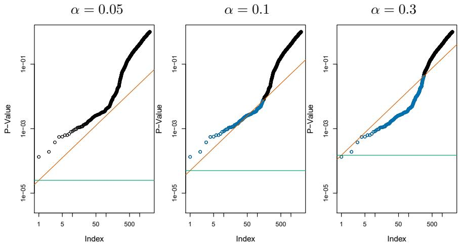

# The Finale {.divider background-color="#1b3a5c"}

::: notes
Final session, co-taught. Two topics every practitioner eventually collides
with — waiting-time data and the too-many-tests problem — then a course
wrap-up and open Q&A. Leave a generous buffer for the wrap-up discussion.
:::

## Where we are

- **Six weeks in**: regression, classification, validation, regularization,
  splines, trees, SVMs, neural networks, PCA, clustering
- **Today** — two topics that look niche until the day they aren't:
  - **Ch. 11** — the response is a *waiting time*, and for many subjects
    [the clock hasn't run out yet]{.hl}
  - **Ch. 13** — you ran *thousands* of hypothesis tests; how many of your
    "discoveries" are noise?
- Then: a course wrap-up, and where to go from here

# Survival Analysis {.divider background-color="#1b3a5c"}

## The problem: incomplete clocks

```{=html}
<div class="fig-wrap"></div>
```

Time until death, churn, machine failure, paper publication… For patients 1
and 3 we saw the event. Patient 2 was fine when the study ended; patient 4
dropped out. Their times are **censored** — [we only know the event happens
*after* some time]{.hl}. Throwing them away wastes data *and* biases results
toward early events.

## Why not just regress or classify?

- Regression of $T$ on $X$? The censored observations have no $T$ to
  regress on — and they're often the *majority*
- "Survived past 5 years, yes/no"? Discards everyone censored before year 5
  and all timing detail
- Survival analysis keeps everyone, [each observation contributing exactly
  what was seen]{.hl}: an event time $y_i$ and a status $\delta_i$
  (event vs censored)

::: {.fragment}
Standing assumption: censoring is unrelated to prognosis (*independent
censoring*) — worth interrogating in any real study.
:::

## The Kaplan–Meier estimator

$$S(t) = \Pr(T > t) \qquad\quad \hat{S}(t) = \prod_{j: d_j \le t}\left(1 - \frac{q_j}{r_j}\right)$$

```{=html}
<div class="fig-wrap"></div>
```

At each observed event time $d_j$: of the $r_j$ still **at risk**, $q_j$ had
the event. Multiply the survival fractions — censored patients count while
at risk, then exit gracefully. The result is the staircase everyone in
medicine has seen ( `BrainCancer` data above).

## Comparing groups

```{=html}
<div class="fig-wrap"></div>
```

Female vs male survival on `BrainCancer` — the curves separate a little.
Real or luck? The **log-rank test** compares, at every event time, observed
vs expected events per group (expected under $H_0$: identical survival).
Here it finds [no significant difference]{.hl}.

## The hazard: risk, right now

$$h(t) = \lim_{\Delta t \to 0} \frac{\Pr(t < T \le t + \Delta t \mid T > t)}{\Delta t}$$

- Read: among those [still alive at $t$]{.hl}, the instantaneous event rate
- The hazard and survival function carry the same information in different
  clothes — high hazard ↔ steeply dropping survival
- Why bother? Because hazards are the natural home for [regression with
  covariates]{.hl}…

## Cox proportional hazards

$$h(t \mid x_i) = h_0(t) \exp\!\left(\sum_{j=1}^p x_{ij}\beta_j\right)$$

```{=html}
<div class="fig-wrap"></div>
```

A baseline hazard $h_0(t)$ — never specified! — scaled up or down by the
covariates: one unit more $x_j$ multiplies the hazard by $e^{\beta_j}$,
[at all times equally]{.hl} (top row). Estimated by *partial likelihood*,
which sidesteps $h_0$ entirely. Bottom row: what a violation looks like —
crossing curves.

## A story in two figures: the Publication data

:::: {.columns}
::: {.column style="width:50%;"}
```{=html}
<div class="fig-wrap"></div>
```
Raw KM curves: positive vs negative trial results reach publication at
[nearly the same rate]{.hl}…
:::
::: {.column style="width:50%;"}
```{=html}
<div class="fig-wrap"></div>
```
…but adjust for the other covariates in a Cox model and the gap is
[dramatic]{.hl}: positive results publish far sooner.
:::
::::

::: notes
Same confounding lesson as Week 2's students (Default) and newspaper
(Advertising) — third time in the course, now with time-to-event data.
Publication bias, quantified.
:::

## The toolbox extends as you'd hope

- **Lasso-penalized Cox** — high-dimensional survival ($p \gg n$ genomics),
  $\lambda$ by cross-validation: Week 3 machinery, survival edition
- **Survival trees & random survival forests** — Week 4, survival edition
- **Time-dependent covariates** — the Cox partial likelihood handles them
  naturally
- Checking proportional hazards: plot stratified log hazards; if curves
  cross, stratify or extend the model

## This week's lab, part 1

```python
from lifelines import KaplanMeierFitter, CoxPHFitter
from lifelines.statistics import logrank_test

km = KaplanMeierFitter().fit(df['time'], df['status'])
km.plot_survival_function()

cox = CoxPHFitter().fit(df, 'time', 'status')
cox.print_summary()   # hazard ratios = exp(coef)
```

Lab 11.8: `BrainCancer` KM curves and log-rank test, multivariate Cox, and
the `Publication` story you just saw.

# Multiple Testing {.divider background-color="#1b3a5c"}

## One hypothesis test, honestly stated

1. Set $H_0$ (e.g. $\mu_1 = \mu_2$: "no difference") and $H_a$
2. Compute a test statistic $T$
3. The **p-value**: the probability of a $T$ [at least this extreme,
   *if* $H_0$ were true]{.hl} — not the probability $H_0$ is true!
4. Reject if $p$ is below your threshold $\alpha$

| | $H_0$ true | $H_0$ false |
|---|---|---|
| **Reject** | Type I error ($\alpha$) | correct — "power" |
| **Don't reject** | correct | Type II error |

## Test enough hypotheses and noise looks like signal

At $\alpha = 0.05$, each true null has a 5% false-alarm rate. Test $m$
independent true nulls and *something* rejects with probability
$1 - 0.95^m$:

- $m = 10$: 40% chance of a false discovery
- $m = 100$: 99.4%
- Flip 1,024 fair coins ten times each — [expect one to look
  "biased"]{.hl}, guaranteed

::: {.fragment}
Modern data analysis *is* multiple testing: every gene, every A/B variant,
every subgroup, every model comparison.
:::

## The family-wise error rate

```{=html}
<div class="fig-wrap"></div>
```

**FWER** = probability of making [even one]{.hl} Type I error among the $m$
tests. At per-test $\alpha = 0.05$ it races to 1 as $m$ grows (orange). To
keep FWER at 0.05 with $m = 50$ tests, each test must clear
$\alpha = 0.001$ (purple).

## Controlling FWER: Bonferroni and Holm

```{=html}
<div class="fig-wrap"></div>
```

**Bonferroni**: reject only if $p_j \le \alpha/m$ — simple, assumption-free,
brutal. **Holm** steps down through the sorted p-values, relaxing the bar as
it goes (blue vs black line) — [always rejects at least as much]{.hl}, same
FWER guarantee. No reason to prefer Bonferroni, ever.

## The price of certainty

```{=html}
<div class="fig-wrap"></div>
```

Power at FWER = 0.05 collapses as $m$ grows: with 500 tests you'll catch
only a small fraction of the *real* effects. "Never a single false
positive" is [the wrong goal when screening thousands of candidates]{.hl} —
which motivates a different target…

## The false discovery rate

Reframe: among the hypotheses I *reject* — my claimed discoveries —
[what fraction are false?]{.hl}

$$\text{FDR} = E\!\left[\frac{\text{false rejections}}{\text{total rejections}}\right]$$

FWER asks "any mistakes at all?"; FDR asks "is my discovery list mostly
real?" Accepting, say, 10% contamination buys enormous power — the standard
bargain in genomics and A/B testing.

## Benjamini–Hochberg: an FDR in three lines

Sort the p-values; reject $H_{(j)}$ for all $j$ up to the largest $j$ with
$p_{(j)} < qj/m$.

```{=html}
<div class="fig-wrap"></div>
```

2,000 fund managers: Bonferroni-style FWER control (green line) rejects
almost nothing; **BH** at $q = 0.1$ (orange) declares [146
discoveries]{.hl} — of which we expect at most ~15 to be false. That's the
trade in one picture.

## When theory fails: resample the null

```{=html}
<div class="fig-wrap"></div>
```

The p-value needs a null distribution. Small samples, weird statistics? —
**permute** the group labels many times and recompute $T$: the histogram
*is* the null distribution (here on the `Khan` gene data, nearly matching
theory). Week 3's resampling spirit, [one last encore]{.hl}.

## This week's lab, part 2

```python
from statsmodels.stats.multitest import multipletests

reject_holm, p_holm, *_ = multipletests(pvals, alpha=0.05,
                                        method='holm')
reject_bh, q_vals, *_ = multipletests(pvals, alpha=0.1,
                                      method='fdr_bh')
```

Lab 13.6: FWER vs FDR on the `Fund` data, then permutation p-values on
`Khan` — count your discoveries under each regime.

# Course Wrap-Up {.divider background-color="#1b3a5c"}

## Seven weeks, one idea

Everything we did was the same move in different costumes:
[choose a family of models, fit it to training data, and honestly estimate
how it does on data it hasn't seen]{.hl}.

- The **bias-variance trade-off** was the physics
- **Cross-validation** was the measuring device
- **Regularization** ($\lambda$, pruning, dropout, margins…) was the brake
- Everything else — splines, trees, kernels, layers — was a hypothesis
  about the *shape* of $f$

## What you can now do

| Week | You learned to… |
|---|---|
| 1 | frame prediction vs inference; respect test error |
| 2 | fit & read linear and logistic models, LDA, confusion matrices |
| 3 | cross-validate anything; bootstrap anything; ridge & lasso |
| 4 | bend fits with splines & GAMs; grow, prune, and ensemble trees |
| 5 | tune SVMs with kernels; build and read neural networks & CNNs |
| 6 | model sequences; fit networks honestly; PCA & clustering |
| 7 | handle censored time-to-event data; survive your own p-values |

## Where to go from here

- **Depth**: *The Elements of Statistical Learning* (Hastie, Tibshirani,
  Friedman) — ISLP's rigorous older sibling, free online
- **Breadth**: causal inference (why regression ≠ causation, formally),
  Bayesian methods, time series
- **Practice**: enter a Kaggle competition with *linear regression first*;
  add complexity only when CV says so
- **Habit**: for every model you ever ship, be able to answer
  ["what's your test error, and how do you know?"]{.hl}

## Thank you

::: {style="text-align: center; margin-top: 1.5em;"}
[Seven Fridays, thirteen chapters, one toolkit.]{.hl}

It's been a pleasure — keep the repo, keep the labs, and keep in touch.

**— Ho-min & Hyun-Hwan**
:::

::: notes
Open floor for final Q&A. Possible closing discussion: "which single method
from this course will you actually use next month?" — go around the room.
:::
